# Installation and Relocation

This chapter describes how to prepare your lab for Opentrons Flex, how to set up the robot, and how to move it if necessary. Before taking delivery of your Flex, make sure that your lab or facility meets all the criteria in the Safety and Operating Requirements section. When it's time to get your Flex up and running, follow the detailed instructions in the Unboxing, First Run, and Instrument Installation and Calibration sections, or use the Opentrons [On-Site Installation service](https://shop.opentrons.com/onsite-support-set-up/). And if you ever need to move your Flex to a new location, near or far, follow the steps in the Relocation section.

## Safety and operating requirements

### Where to place Opentrons Flex

Space is a valuable commodity in almost every lab. Your Flex is going to need some—but not too much, as it's designed to fit on half of a standard lab bench. Make sure that you have a space that meets the following criteria.

- **Bench surface:** Stationary, sturdy, level, water-resistant surface. Tables or benches with wheels (even locking wheels) are not recommended. Flex moves quickly and has a lot of mass, which can shake or imbalance lightweight or movable tables.

- **Weight bearing:** The robot alone weighs 88.5 kg (195 lb) and should only be lifted by two people working together. Place the robot on a surface that can readily support its weight plus the weight of any modules, labware, liquids, or other lab equipment to be used in your applications.

- **Operating space:** The robot's base dimensions are 87 cm W x 69 cm D x 84 cm H (about 34" x 27" x 33"). Flex needs 20 cm (8") of side and back clearance for cables, USB connections, and to dissipate exhaust from modules that heat and cool.

!!! warning
    *Do not* position the sides or back of the Flex flush against a wall.

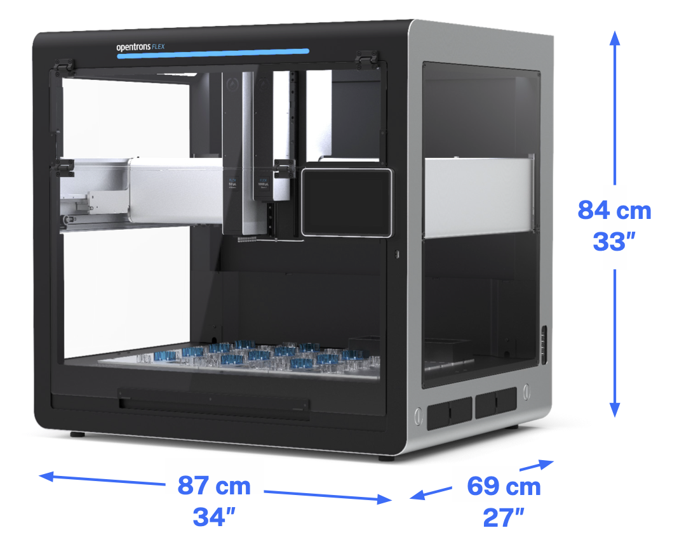 Opentrons Flex base dimensions.

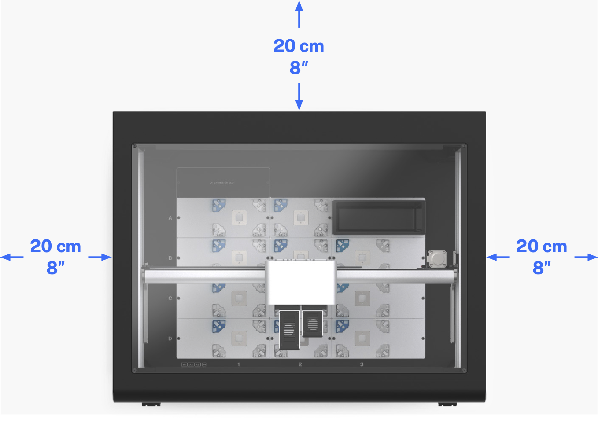 Top view of Opentrons Flex, showing minimum side and back clearance.

### Power consumption

Opentrons Flex should be connected to a wall outlet at or near the bench location where you install it. Only connect Flex to circuits that can accommodate its peak power draw:

- **Input power:** 36 VDC, 6.1 A

- **Idle consumption:** 30–40 W

- **Typical consumption:** 40–120 W

- **Peak consumption:** Up to 250 W

| Power Consumption Type | Description |
| :--------------------- | :---------- |
| Idle                   | The amount of power the robot uses while on and inactive (not running a protocol). Flex does not have a low-power sleep or standby mode.                                                                                                                               |
| Typical                | The average power the robot and attached instruments use when running a protocol. Different protocols and instruments can cause variations within the typical power consumption range. This range does not account for separately powered modules used in protocols. |
| Peak                   | The highest instantaneous power draw. For example, during fast gantry acceleration, or other high-energy movements, the robot can draw more power and exceed typical power consumption values. The peak consumption value may also be useful for estimating current handling capacity (and circuit breaker selection) for an AC circuit that powers multiple robots. |

Along with the conditions described above, total power consumption also depends on:

- The amount and type of movement executed during a protocol.

- The amount of time the robot spends idle.

- The status lights of the robot.

- How many instruments are attached.

!!! note 
    Always account for other electronics that consume power on the same circuit, including Flex modules with their own power supplies. For example, the Thermocycler Module has a peak power consumption (630 W) that is much greater than the Flex robot itself. If necessary, consult the manager of your facility to make sure it meets your equipment's peak power requirements.

### Environmental conditions

Environmental conditions for recommended use, acceptable use, and storage vary:

|                 | Recommended for system operation | Acceptable for system operation | Storage and transportation |
| :---------------------- | :----------------------------------- | :---------------------------------- | :----------------------------- |
| **Ambient temperature** | +20 to +25 °C                        | +2 to +40 °C                        | −10 to +60 °C                  |
| **Relative humidity** | 40–60%, non-condensing            | 30–80%, non-condensing (below 30 °C) | 10–85%, non-condensing (below 30 °C) |
| **Altitude** | Approximately 500 m above sea level | Up to 2000 m above sea level    | Up to 2000 m above sea level |

Opentrons has validated the performance of Opentrons Flex in the conditions recommended for system operation, and operation in those conditions should provide optimal results. Flex is safe to use in conditions acceptable for system operation, but results may vary. Do not power on or use Flex in conditions outside of those bounds. The storage and transportation conditions only apply when the robot is completely disconnected from power and other equipment.

### Network ports

Flex requires an internet connection for initial setup. After setup, it's possible to run Flex without a network connection, although some features of Flex and the Opentrons App expect local area network access over certain ports.

Network ports are software-defined connections between devices on a network. Each numbered port handles data for a specific network protocol or service. Flex uses these ports for services like software updates, file transfers, or to accept command-line instructions from a terminal.

The following table lists the network ports used by Flex, along with their function. All listed ports use TCP, except for port 5353, which uses UDP.

| Port number | Description |
| :---------- | :---------- |
| **22** | Used to make a Secure Shell (SSH) connection. See [Command-line operation over SSH][command-line-operation-over-ssh]. | **80** | Used for HTTP traffic. |
| **443** | Used for HTTPS traffic. The Opentrons App uses this port to check for and download software updates. |
| **1883** | Used for [MQTT messages](https://mqtt.org). Flex sends realtime notifications to the Opentrons App using MQTT. This reduces network traffic and shortens delays within the app, compared to polling. |
| **5353** | Used for Multicast DNS ([mDNS or zero-configuration networking](https://en.wikipedia.org/wiki/Zero-configuration_networking)). The Opentrons App relies on mDNS to find Flex robots on a network. |
| **31950** | Used by the robot server for [HTTP API commands](https://docs.opentrons.com/http/api_reference.html). |
| **48888** | Used for the built-in [Jupyter Notebook server][jupyter-notebook], which you can connect to with your web browser. |

If you're having trouble with these services, consult your facility's IT documentation or contact your IT manager for assistance with your network setup.

## Unboxing

Congratulations! Your Opentrons Flex has arrived and you've prepared a space for it in your lab. Let's open that monster crate, remove the robot, and prepare it for operation. The information in this section provides a parts list and instructions that walk you through the steps required to get the Flex unboxed, set up, and ready for use. We've divided the setup procedure into three parts:

- Part 1 covers disassembling the crate.

- Part 2 covers detaching the Flex from the crate and moving it to a final assembly location.

- Part 3 covers final assembly and powering on the robot for the first time.

### Effort and time required

You'll want to ask a lab partner to assist with the unboxing, lifting, moving, and assembly process. You'll need to budget about 30 minutes to an hour for this effort.

!!! note
    The Flex requires two people to lift it properly. Also, lifting and carrying the Flex by its handles is the best way to move the robot.

### Crate and packing material

Unpacking a Flex gives you an awesome robot, but you're also left with several large crate panels along with assorted shipping components and padding. While you could discard this material, we encourage you to keep these items if storage space is available. The packaging is reusable, which helps prepare your Flex for shipping if you ever need to send it somewhere else (e.g., to a conference or a new facility) in the future.

### Product elements

The Flex ships with the components listed below. Pipettes, the gripper, and modules come in separate packaging from the main Flex crate, even if you purchased them together as a workstation.

<figure markdown>
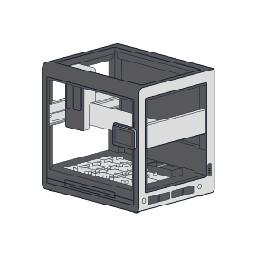
<figcaption>(1) Opentrons Flex robot</figcaption>
</figure>

<figure markdown>
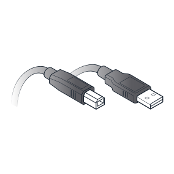
<figcaption>(1) USB cable</figcaption>
</figure>

<figure markdown>
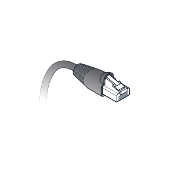
<figcaption>(1) Ethernet cable</figcaption>
</figure>

<figure markdown>
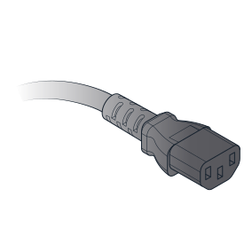
<figcaption>(1) Power cable</figcaption>
</figure>

<figure markdown>
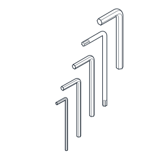
<figcaption>(5) L-keys

(12 mm hex, 1.5 mm hex, 
2.5 mm hex, 3 mm hex, 
T10 Torx)
</figcaption>
</figure>

<figure markdown>
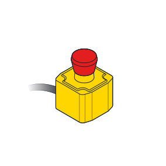
<figcaption>(1) Emergency Stop Pendant</figcaption>
</figure>

<figure markdown>
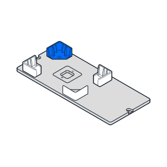
<figcaption>(1) Deck slot with labware clips</figcaption>
</figure>

<figure markdown>
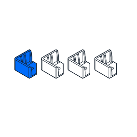
<figcaption>(4) Spare labware clips</figcaption>
</figure>

<figure markdown>
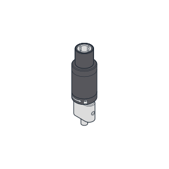
<figcaption>(1) Pipette calibration probe</figcaption>
</figure>

<figure markdown>

<figcaption>(4) Carrying handles and caps</figcaption>
</figure>

<figure markdown>

<figcaption>(1) Top window panel</figcaption>
</figure>

<figure markdown>
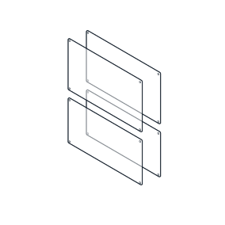
<figcaption>(4) Side window panels</figcaption>
</figure>

<figure markdown>
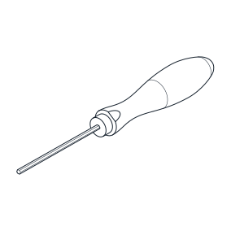
<figcaption>(1) 2.5 mm hex screwdriver</figcaption>
</figure>

<figure markdown>
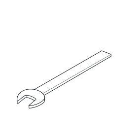
<figcaption>(1) 19 mm wrench</figcaption>
</figure>

<figure markdown>
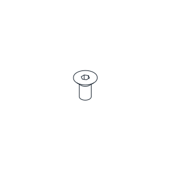
<figcaption>(16 + spares) Window screws

(M4x8 mm flat head)

</figcaption>
</figure>

<figure markdown>
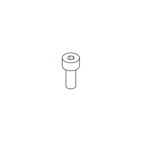
<figcaption>(10) Spare deck slot screws

(M4x10 mm socket head)

</figcaption>
</figure>

<figure markdown>
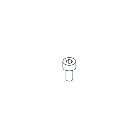
<figcaption>(12) Spare deck clip screws

(M3x6 mm socket head)

</figcaption>
</figure>

### Part 1: Remove the crate

Opentrons ships your Flex in a sturdy plywood crate. The shipping crate uses hook and latch clamps to secure the top, side, and bottom panels together. Using latches, instead of nails or screws, means you won't need a crowbar (or a lot of force) to disassemble the crate, and you can reassemble it later, if needed.

!!! note 
    Crate edges can get roughed up during shipping. You may want to use work gloves to protect your hands from wood splinters.

To release the latches, flip the latch tab up and turn it to the left (counterclockwise). This action moves the clamp arm out of its corresponding retaining bracket. You can then flip the latch arm away from the crate.

1. Unlock the eight latches holding the top to the sides.

    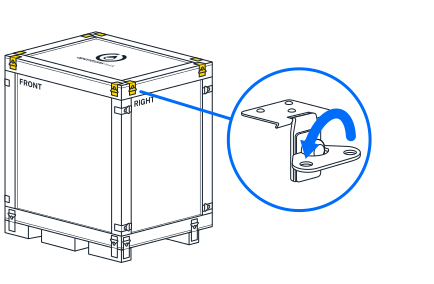

2. Remove the top panel after releasing the latches.

3. Cut open the blue shipping bag, remove these items from the padding, and set them aside:

    - User Kit
    
    - Power, Ethernet, and USB cables
    
    - Emergency Stop Pendant

    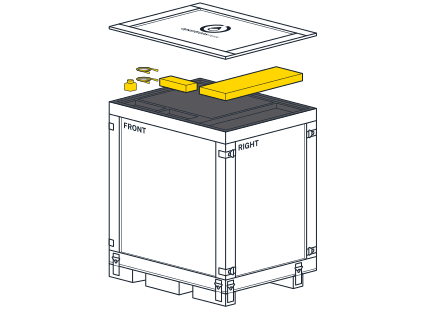

4. Remove the top piece of foam padding. The padding protects the installed top window panel.

5. Unlock the remaining 16 latches holding the side panels to each other and the base of the crate.

6. Remove the side panels and set them aside.

    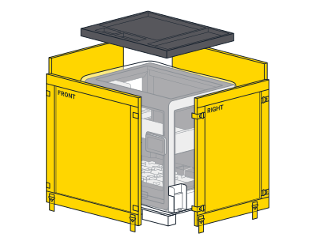

### Part 2: Release the Flex

After completing the steps in Part 1, you should now see a robot that's in a protective bag and attached to orange steel mounting components. The bag encloses the robot and protects it from the outside environment. Steel brackets secure the robot to the bottom of the crate. Two shipping frames support the robot, distributing its weight evenly, and keeping it rigid so it doesn't warp during shipping.

Continue to unpack the Flex and get it off the crate base.

7. Using the 19 mm wrench from the User Kit, unbolt the brackets from the crate bottom. You can discard the brackets, or save them for future use.

    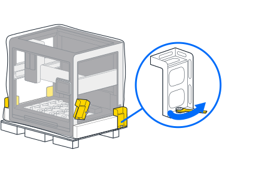

8. Pull or roll the shipping bag all the way down to expose the entire robot.

    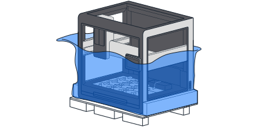

9. With help from your lab partner, grab the handholds in the orange shipping frames on either side of the robot's base, lift the Flex off the crate base, and set it down on the floor. Save or discard the crate base and shipping frame.

    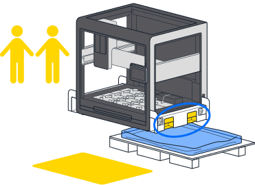

10. Using the 12 mm hex L-key from the User Kit, remove the four bolts holding the shipping frames to the Flex. Save or discard the frames and bolts.

    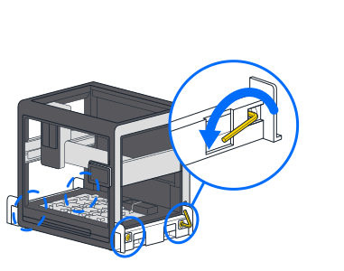

11. Remove the four aluminum handles from the User Kit. Screw the handles into the same locations that held the 12 mm shipping frame bolts.

    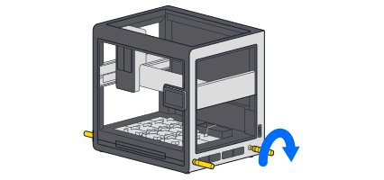

12. With help from your lab partner, lift the Flex by its carrying handles and move it to a workbench for final assembly.

    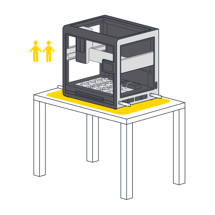

### Part 3: Final assembly and power on

After moving the Flex to a temporary work area, or its permanent home, it's time to put the finishing touches on your new robot.

13. If you have moved the robot to its final, working location, remove the carrying handles and replace them with the finishing caps. The caps close the handle openings in the frame and give the robot a clean appearance. Return the handles to the User Kit for storage.

    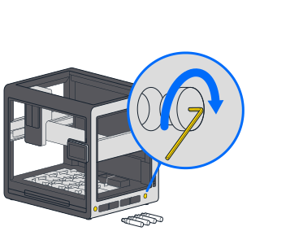

14. Using the 2.5 mm screwdriver from the User Kit, remove the locking screws from the gantry. These screws prevent the gantry from moving while in transit. The gantry locking screws are located:

    - On the left side rail near the front of the robot.
    
    - Underneath the vertical gantry arm.
    
    - On the right side rail near the front of the robot in an orange bracket. There are two screws here.

    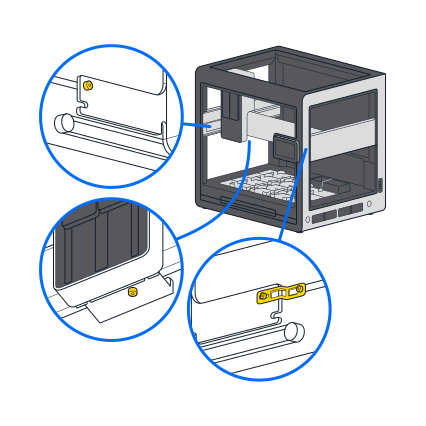

    The gantry moves easily by hand after removing all the shipping screws.

15. Cut and remove the two rubber bands that hold the trash bin in place during shipping.

16. Attach the power cord to Flex and plug it into the wall outlet. Make sure the deck area is free of obstructions. Flip the power switch on the back left of the robot. Once powered on, the gantry moves to its home location and the touchscreen displays additional configuration instructions.

    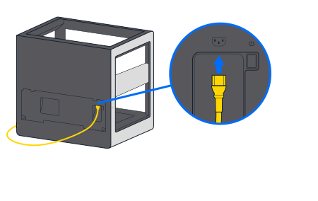

Now that your Flex is out of the box and ready to go, continue to the First Run section below.

## First run

Perform basic setup on the touchscreen before connecting any other hardware to your Flex. The robot will guide you through connecting to your lab network, updating to the latest software, and personalizing Flex by giving it a name.

### Power on

When you power on Flex, the Opentrons logo will appear on the touchscreen. After a few moments, it will show the "Welcome to your Opentrons Flex" screen.

<figure class="screenshot" markdown>
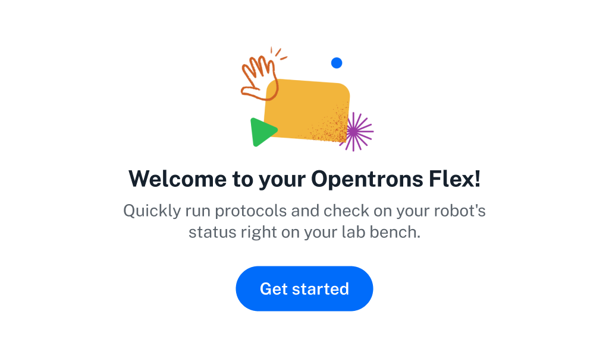
<figcaption>The Opentrons Flex welcome screen. You should only see this screen when you start your Flex for the first time.</<figcaption>
</figure>

### Connect to a network or computer

Follow the prompts on the touchscreen to get your robot connected so it can check for software updates and receive protocol files. There are three connection methods: Wi-Fi, Ethernet, and USB.

<figure class="screenshot" markdown>
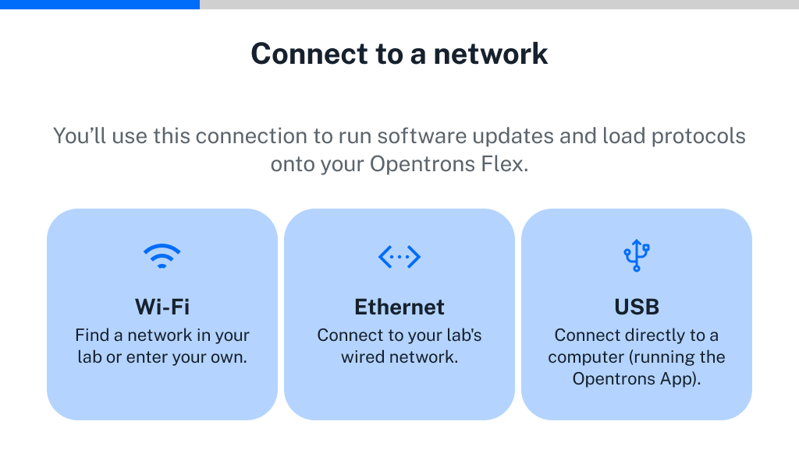
<figcaption>Network connection options. You need to have internet connectivity to set up Flex.</figcaption>
</figure>

**Wi-Fi:** Use the touchscreen to connect to Wi-Fi networks that are secured with WPA2 Personal authentication (most networks that only require a password to join fall under this category).

!!! note 
    Flex does not support captive portals (networks that don't have a password but load a webpage to authenticate users after connecting).

You can also connect to an open Wi-Fi network, but this is not recommended.

!!! warning
    Connecting to an open Wi-Fi network will allow anyone in range of the network signal to control your Opentrons Flex robot without authentication.

If you need to connect to a Wi-Fi network that uses enterprise authentication (including "eduroam" and similar academic networks that require a username and password), first connect to the Opentrons App by Ethernet or USB to complete initial setup. Then connect to the enterprise Wi-Fi network in the networking settings for your Flex. To access the networking settings:

1.  Click **Devices** in the left sidebar of the Opentrons App.

2.  Click the three-dot menu (⋮) for your Flex and choose **Robot Settings**.

3.  Click the **Networking** tab.

Select your network from the dropdown menu or choose "Join other network..." and enter its SSID. Choose the enterprise authentication method that your network uses. The supported methods are:

- EAP-TTLS with TLS

- EAP-TTLS with MS-CHAP v2

- EAP-TTLS with MD5

- EAP-PEAP with MS-CHAP v2

- EAP-TLS

Each of these methods requires a username and password, and depending on your exact network configuration may require certificate files or other options. Consult your facility's IT documentation or contact your IT manager for details of your network setup.

**Ethernet:** Connect your robot to a network switch or hub with an Ethernet cable. You can also connect directly to the Ethernet port on your computer, starting in robot system version 7.1.0.

**USB:** Connect the provided USB A-to-B cable to the robot's USB-B port and an open port on your computer. Use a USB B-to-C cable or a USB A-to-C adapter if your computer does not have a USB-A port.

To proceed with setup, the connected computer must have the Opentrons App installed *and running*. For details on installing the Opentrons App, see the [App Installation section][app-installation] of the Software and Operation chapter.

### Install software updates

Now that you've connected to a network or computer, the robot can check for software and firmware updates and download them if needed. If there is an update, it may take a few minutes to install. Once the update is complete, the robot will restart.

### Attach Emergency Stop Pendant

Connect the included Emergency Stop Pendant (E-stop) to an auxiliary port (AUX-1 or AUX-2) on the back of the robot.

<figure class="screenshot side-by-side" markdown>
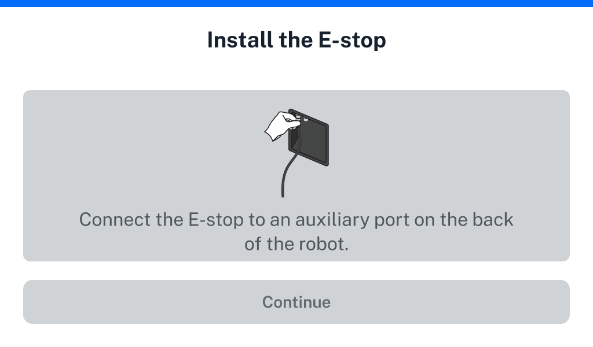
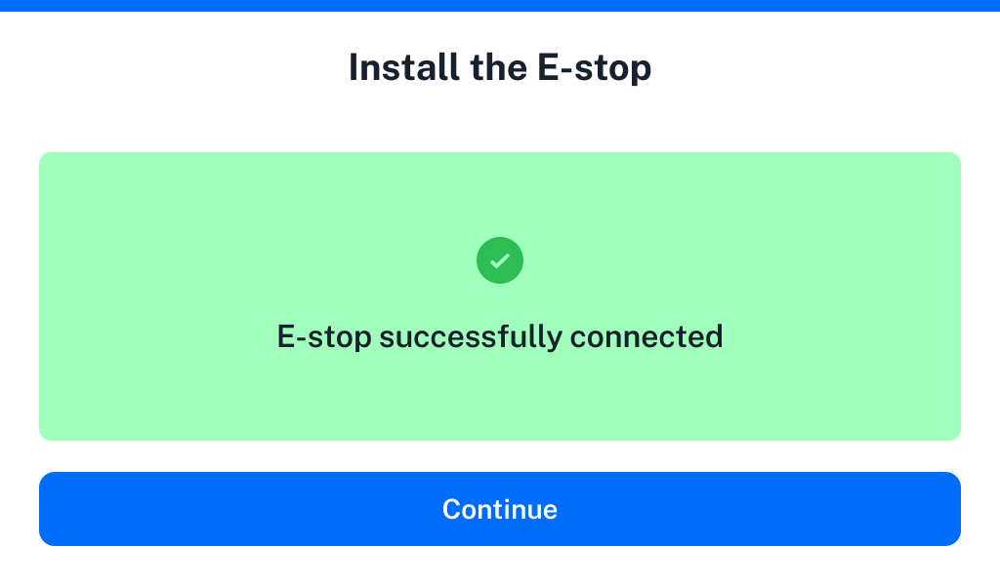
<figcaption>Before and after connecting the Emergency Stop Pendant.</figcaption>
</figure>

Attaching and enabling the E-stop is *mandatory* for attaching instruments and running protocols on Flex. For more information on using the E-stop during robot operation, see the of the System Description chapter.

### Give your robot a name

Naming your robot lets you easily identify it in your lab environment. If you have multiple Opentrons robots on your network, make sure to give them unique names. Once you've confirmed your robot's name, you'll be taken to your Opentrons Flex Dashboard. Likely the next step you'll want to take is attaching instruments, which is covered in the next section.

## Instrument installation and calibration

After initial robot setup, the next step is to attach instruments to the robot and calibrate them.

To install an instrument, first tap on **Instruments** on the touchscreen or go to the **Pipettes and Modules** section of the device detail screen in the Opentrons App. Choose an empty mount and select either **Attach Pipette** or **Attach Gripper**. If the mount you want to use is already occupied, you need to detach the pipette or gripper first.

!!! note
    The overall installation process is the same regardless of whether you use the touchscreen or the Opentrons App. Whatever device you begin on will control the installation process until you complete or cancel it.
    
    If you begin on the touchscreen, the app will show the robot as being “busy”. If you begin in the app, the touchscreen will show a modal indicating that instrument installation is in progress.

The exact installation process varies depending on the instrument you are attaching, as covered in the sections below. All instruments have an automated calibration procedure, which you should perform immediately after installation.

### Pipette installation

When you install a pipette, you will be guided through the following steps on the touchscreen or in the Opentrons App.

1. Choose pipette type

    Choose between **1- or 8-Channel Pipette** and **96-Channel Pipette**. Attaching the 96-Channel Pipette requires a few additional steps because it attaches to a special mounting plate that spans both pipette mounts.

2. Prepare for installation

    Remove labware from the deck and clean up the working area to make attachment and calibration easier. Also gather the needed equipment, such as the calibration probe, hex screwdriver, and mounting plate (for the 96-Channel Pipette).

3. Connect and secure the pipette

    The gantry will move to the front of the robot so you can attach the pipette.

    1- and 8-Channel Pipettes connect directly to a pipette mount. The 96-Channel Pipette requires a mounting plate. In order to attach the mounting plate, you must first disconnect the z-axis carriage for the right pipette mount.

    Connect the pipette to the chosen pipette mount and secure its screws.

4. Run automated calibration

    To calibrate the pipette, attach the calibration probe to the appropriate pipette nozzle. The pipette will automatically move to touch certain points on the deck and save these calibration values for future use. Once calibration is complete and you've removed the probe, the pipette will be ready for use in protocols.

### Gripper installation

When you install the gripper, you will be guided through the following steps on the touchscreen or in the Opentrons App.

1. Prepare for installation

    Remove labware from the deck and clean up the working area to make attachment and calibration easier. Also gather the required hex screwdriver and make sure that the calibration pin is in its storage area on the gripper.

2. Connect and secure the gripper

    The gantry will move to the front of the robot so you can attach the gripper. Connect the gripper to the extension mount and secure its screws.

3. Run automated calibration

    To calibrate the gripper, insert the calibration pin in the front jaw. The gripper will automatically move to touch certain points on the deck and save these calibration values for future use. Then repeat the same process with the calibration pin in the back jaw. Once calibration is complete and you've put the pin back in its storage location, the gripper will be ready for use in protocols.

## Relocation

This section provides advice and instructions about how to move your Opentrons Flex robot over short and long distances.

### Short moves

A short move spans a range of distances from "let's just move it over a little bit" to across the lab, down the hall, or another floor in your building. In these cases, you can move your Flex by hand. Transporting it on a hand cart is also a good option.

!!! warning
    The Flex weighs 88.5 kg. As a result, it requires two people to lift and move it safely.

Reattach the lift handles to move your Flex to a new, nearby location. Lifting and carrying the Flex by its handles is the right way to move the robot short distances. Remove the handles and store them in the User Kit after the move is complete. To prevent damaging the robot, always use the lift handles to pick it up and move it. Do not grab the frame to lift or move your robot.

### Long-distance moves

A long-distance move transports your Flex off the grounds of your university, facility, or institution. Across town, to a new city, state, province, or country are all examples of a long-distance move. In this case, you'll need to pack the Flex to protect it from the elements, shocks, and rough movements that may occur while in transit.

If you've kept the shipping crate and internal supports that came with your Flex, you can repackage it in these materials for a long-distance move. Follow the [unboxing steps][unboxing] in reverse order to prepare your Flex for a long-distance move. Basically, you should:

- Disconnect the power and network cable, if attached.

- Remove all attached hardware and labware.

- Reattach the deck plates.

- Lock the gantry (see the [General Moving Advice section][general-moving-advice] below).

- Remove and store the window panels.

If you kept the original crate:

- Reattach the shipping frame to the Flex and secure it to the pallet base using the L-brackets.

- Add padding and reassemble the shipping crate.

If you don't have the original crate and related material, contact a reputable shipping company. They can manage the packing, transportation, and delivery process for you.

### General moving advice

#### Disconnect power and network cables

Before moving your Flex, don't forget to:

- Turn off the power and unplug it from the power supply.

- Disconnect the Ethernet or USB cable, if used.

#### Lock the gantry

Before moving your Flex, reinsert the locking screws to hold the gantry in place. The gantry locking points are located:

- On the left side rail near the front of the robot.

- Underneath the vertical gantry arm.

- On the right side rail near the front of the robot. Locking this part of the gantry requires the small orange bracket and two locking screws.

#### Home the gantry

You may not want to lock the gantry if you're only moving the robot to a nearby location. If you decide not to lock it, at least use the touchscreen or the Opentrons App to send the gantry to its home position before powering it down.

To home the gantry via the touchscreen, tap the three-dot menu (⋮) and then tap **Home gantry**. 

To home the gantry via the Opentrons App:

- Click **Devices**.

- Click on your Flex in the device list.

- Click the three-dot menu (⋮) and then click **Home gantry**.

#### Remove modules

In-deck modules and other attachments add extra weight to your Flex. They also affect the robot's center of gravity, which can make it feel "tippy" when lifting it. To help lighten and balance the robot, remove any attached instruments and labware before you pick it up.

#### Reinstall deck slots

We recommend reattaching the deck slots for a long-distance move. Securing the slots in their original locations helps prevent accidental loss.

Reattaching the deck slots for short moves around the lab is optional.

#### Post-move recalibration

You should recalibrate any instruments and modules after reinstalling them. For more details on [module calibration][module-calibration], see the Modules chapter.

### Final thoughts about moving

Your Flex is a sturdy and well-built machine, but it is also a precise scientific instrument designed to exacting tolerances. As a result, you should treat it with care when relocating it within your local work area or sending it across the country. This means following the guidance provided here *and* using your own common sense about how to transport an expensive piece of laboratory equipment. Bottom line: when moving your Flex, err on the side of caution and extra padding.

If you have questions or concerns about relocating your Flex, contact us at <support@opentrons.com>.
