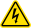
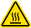

# Introduction

This chapter introduces you to the Opentrons Flex ecosystem, including the overall system design and available workstation configurations. It also includes important compliance and safety information, which you should review before setting up your Opentrons Flex robot. For more details on the features of Opentrons Flex, see the [System Description chapter](system-description.md).

## Welcome to Opentrons Flex

Opentrons Flex is a liquid-handling robot designed for high throughput and complex workflows. The Flex robot is the base of a modular system that includes pipettes, a labware gripper, deck fixtures, on-deck modules, and labware — all of which you can swap out yourself. Flex is designed with a touchscreen so you can work with it directly at the lab bench, or you can control it from across your lab with the Opentrons App or our open-source APIs.

Flex workstations come with all of the equipment — robot, hardware, and labware — that you need to get started automating common lab tasks. For other applications, Opentrons Flex runs on fully open-source software and firmware, and is reagent- and labware-agnostic, giving you control over how you design and run your protocols.

### What's new in Flex

Opentrons Flex is part of the Opentrons liquid handler series of robots. Users of Opentrons Flex may be familiar with the Opentrons OT-2, our personal pipetting robot. Flex goes beyond the capabilities of OT-2 in several key areas, delivering higher throughput and walkaway time.

| Feature                     | Description                                                                                                                                                                                                                                                           |
| :-------------------------- | :-------------------------------------------------------------------------------------------------------------------------------------------------------------------------------------------------------------------------------------------------------------------- |
| **Pipette throughput** | Flex pipettes have 1, 8, or 96 channels. The 96-channel pipette operates on 12 times as many wells at once as the largest OT-2 pipette.                                                                                                                               |
| **Pipette and tip capacities** | Flex pipettes have larger volume ranges (1–50 µL, 5–1000 µL) and can all work with any volume of Opentrons Flex tips. This is an improvement over OT-2 pipettes, which have smaller ranges and must use tips with a matching volume range.                         |
| **Gripper** | The Opentrons Flex Gripper picks up and moves labware around the deck automatically, without user intervention. The gripper enables more complex workflows within a single protocol run.                                                                             |
| **Automated calibration** | Positional calibration of Flex pipettes and the gripper is fully automated. Press one button, and the instrument will move to precision-machined points on the deck to determine its exact position, saving that data for use in your protocols.                      |
| **Touchscreen** | Flex has its own touchscreen interface that lets you control it directly, in addition to using the Opentrons App. Use the touchscreen to start protocol runs, check job status, and change settings right on the robot.                                                 |
| **Module caddies** | Flex modules fit into caddies that occupy space below the deck. Caddies place your labware closer to the deck surface and allow for below-deck cable routing. Caddies enable even more module and labware configurations on the deck.                                  |
| **Deck slot coordinates** | Deck slots on Flex are numbered with a coordinate system (A1–D4) which is similar to how wells are numbered on labware.                                                                                                                                             |
| **Movable trash** | The trash bin can go in multiple deck locations on Flex. The default location (slot A3) is the recommended position. You can also use the gripper to dispose of trash in the optional waste chute.                                                                     |
| **Size and weight** | Flex is a bit bigger and much heavier than OT-2. Installation tasks on Flex require the assistance of a lab partner.                                                                                                                                                   |

A detailed [comparison of robot technical specifications](https://opentrons.com/products/robots/) is available on the Opentrons website.

Both Flex and OT-2 robots run on our open-source software, and the Opentrons App can control both types of robots at once. While OT-2 protocols can't be run directly on Flex, it's straightforward to adapt them (see the [OT-2 Protocols section][ot-2-python-protocols] of the Protocol Development chapter for details).

### Flex workstations

Opentrons Flex workstations include the Flex robot, accessories, pipettes and gripper, on-deck modules, and labware needed to automate a particular application. All workstation components are modular. If you need to change applications, you can add or swap in other Flex hardware and compatible consumables.

#### NGS Workstation

The Opentrons Flex NGS Workstation automates NGS library prep. It can automate pre-sequencing workflows using any leading reagent system, including fragmentation- and tagmentation-based library prep.

In addition to the Flex robot, the NGS Workstation includes:

- Gripper

- Choice of pipette configuration

    - Two 8-Channel Pipettes (1–50 µL and 5–1000 µL)
  
    - 96-Channel Pipette (5–1000 µL)

- Waste Chute

- Magnetic Block

- Temperature Module

- Thermocycler Module

- Labware kit with filter tips, microcentrifuge tubes, reservoirs, and PCR plates

#### PCR Workstation

The Opentrons Flex PCR Workstation automates PCR setup and thermocycling workflows for up to 96 samples. It can aliquot chilled reagents and samples into a 96-well PCR plate. With the addition of the automated Thermocycler Module, use the gripper to load the plate into the Thermocycler, and then run your chosen PCR program.

In addition to the Flex robot, the PCR Workstation includes:

- Gripper

- Choice of pipette configuration

    - 1-Channel Pipette (1–50 µL) and 8-Channel Pipette (1–50 µL)
  
    - 96-Channel Pipette (5–1000 µL)

- Waste Chute

- Temperature Module

- Labware kit with filter tips, microcentrifuge tubes, reservoirs, and PCR plates

#### Nucleic Acid Extraction Workstation

The Opentrons Flex Nucleic Acid Extraction Workstation automates DNA/RNA isolation and purification. It uses the Magnetic Block for separation of magnetic beads, and the Heater-Shaker for sample lysis and resuspension of magnetic beads.

In addition to the Flex robot, the Nucleic Acid Extraction Workstation includes:

- Gripper

- Choice of pipette configuration

    - 1-Channel Pipette (5–1000 µL) and 8-Channel Pipette (5–1000 µL)
  
    - 96-Channel Pipette (5–1000 µL)

- Waste Chute

- Magnetic Block

- Heater-Shaker Module

- Labware kit with filter tips, reservoirs, PCR plates, and deep well plates

#### Magnetic Bead Protein Purification Workstation

The Opentrons Flex Magnetic Bead Protein Purification Workstation automates small-scale protein purification and proteomics sample prep for up to 96 samples. It is compatible with many popular magnetic-bead-based reagents.

In addition to the Flex robot, the Protein Purification Workstation includes:

- Gripper

- Choice of pipette configuration

    - 1-Channel Pipette (5–1000 µL) and 8-Channel Pipette (5–1000 µL)
  
    - 96-Channel Pipette (5–1000 µL)

- Waste Chute

- Magnetic Block

- Heater-Shaker Module

- Labware kit with filter tips, reservoirs, PCR plates, and deep well plates

## Safety information

The Opentrons Flex liquid handling robot has been designed for safe operation. Refer to the specifications and compliance guidelines in this section to ensure safe usage of your Flex. These guidelines cover safe use of input and output connections for the product, including the power and data connections, as well as warning labels found on the Flex robot and related hardware. Using the device in a manner other than those specified in this manual may put the user and equipment at risk.

### Safety symbols

Various labels on the Flex and in this manual warn you about sources of
potential injury or harm.

| Symbol   | Description  |
| :------- | :----------- |
|  | **Warning:** Alerts users to <ul><li>Potentially hazardous conditions.</li><li>Actions that may result in personal injury or death.</li></ul>                             |
|   | **Caution:** Cautions users against <ul><li>Damage to the equipment.</li><li>Lost or corrupted data.</li><li>Unrecoverable interruption of the operation being performed.</li></ul> |
|   | **Electrical shock:** Identifies instrument components that might pose a risk of electrical shock if the instrument is handled improperly.                                |
|   | **Hot surface:** Identifies instrument components that pose a risk of personal injury due to high heat/temperatures if the instrument is handled improperly.              |
|   | **Pinch point:** Identifies instrument components that can pose a risk of personal injury when in motion.                                                                  |

You will find the following labels on the Flex:

- Intellectual property labels

- Regulatory compliance labels (e.g., [ETL](https://www.intertek.com/marks/etl/))

- Electrical hazard labels

- General warning labels

- Product labels

- Pinch point labels

- High voltage labels

- Power rating labels

### Electrical safety warnings

Always observe the following electrical safety warnings:

| Symbol   | Description  |
| :------- | :----------- |
|  | Plug the robot into a grounded, Class 1 circuit. See the [Power Connection section][power-connection] in the System Description chapter.                                                                                |
|  | Do not connect (plug in), disconnect (unplug), or use AC power cables if: <ul><li>The cable is frayed or damaged.</li><li>Other attached cables, cords, or receptacles are frayed or damaged.</li></ul> Using damaged power cords can cause an electric shock hazard resulting in serious injury or damage to the robot.                                                           |
|  | Do not replace the AC power cable unless at the direction of Opentrons Support.                                                                                            |

For more information on electrical requirements, see the [Power Consumption section][power-consumption] of the Installation and Relocation chapter.

### Additional safety warnings

Always observe the following additional safety warnings:

| Symbol   | Description  |
| :------- | :----------- |
|  | Opentrons Flex has not been certified for use with explosive or flammable liquids. Do not load plates, tubes, or vials containing explosive or flammable liquids into the robot or otherwise operate the instrument with explosive or flammable liquids in the enclosure. |
|  | Use good laboratory practices and follow the manufacturer's precautions when working with chemicals. Opentrons is not responsible or liable for any damages because of, or as a result of, the use of hazardous chemicals.           |
|  | The Flex weighs 88.5 kg (195 lbs). As a result, it requires two people to lift and move it safely. See the [Relocation section][relocation] in the Installation and Relocation chapter.                                                                        |
|  | The Flex should be placed on a surface capable of supporting its weight of 88.5 kg (195 lbs) with sufficient surface area to accommodate the robot plus its minimum clearance distance (20 cm/8 in). See the in the Installation and Relocation chapter. |
|  | The Flex can emit vibrations while in operation. Place the robot on a surface that is sturdy, level, and water-resistant with cross-bracing or welded joints. See the in the Installation and Relocation chapter.                |

### Safety cautions

To help protect the Flex from damage, follow these precautions:

| Symbol   | Description  |
| :------- | :----------- |
|  | Use labware that is ANSI/SLAS-compliant or approved by Opentrons. See the [Labware chapter](labware.md). |
|  | Keep corrosive materials, agents, or otherwise damaging materials away from the robot.|

### Biological safety

Treat specimens and reagents containing materials taken from humans as potentially infectious agents. Opentrons recommends using safe laboratory procedures as explained in [*Biosafety in Microbiological and Biomedical Laboratories (BMBL) 6th Edition*](https://www.cdc.gov/labs/bmbl/).

Under normal circumstances, the Flex does not create detectable aerosols from source liquids. However, under certain conditions, it is possible to generate aerosols from source liquids. When operating with biosafety level 2 or greater source liquids, consider taking precautions against aerosol exposure, in accordance with your local regulatory bodies. To minimize the potential risk of aerosol exposure from the robot, ensure that you:

- Perform maintenance as described in the [Maintenance and Service chapter](maintenance-service.md).

- Properly install and secure all instrument covers, pipettes, modules, and labware.

- Use proper pipetting technique to aid in the mitigation of aerosols.

### Toxic fumes

If you're working with volatile solvents or toxic substances, use an efficient laboratory ventilation system to remove any vapors that may be produced.

### Flammable liquids

The Flex has not been evaluated for use with flammable liquids and should not be used with flammable liquids.

## Regulatory compliance

Opentrons Flex complies with all applicable requirements of the following safety and electromagnetic standards.

### Safety

| Rule ID | Title |
| :------ | :---- |
| **IEC/UL/CSA 61010-1** |Safety Requirements for Electrical Equipment for Measurement, Control, and Laboratory Use – Part 1: General Requirements |
| **IEC/UL/CSA 61010-2-051** | Particular requirements for laboratory equipment for mixing and stirring |

### Electromagnetic compatibility

| Rule ID | Title |
| :------ | :---- |
| **EN/BSI 61326-1** | Electrical Equipment for Measurement, Control, and Laboratory Use – EMC Requirements – Part 1: General Requirements |
| **FCC 47 CFR Part 15 Subpart B Class A** | Unintentional Radiators |
| **IC ICES-003** | Spectrum Management and Telecommunications – Interference- Causing Equipment Standard – Information Technology Equipment (Including Digital Apparatus) |

### FCC warnings and notes

**Warning:** Changes or modifications to this unit not expressly approved by Opentrons could void the user's authority to operate the equipment.

This device complies with Part 15 of the FCC rules. Operation is subject to the following:

- This device may not cause harmful interference.

- This device must accept any interference received, including interference that may cause undesired operation.

**Note:** This equipment has been tested and found to comply with the limits for a Class A digital device, pursuant to Part 15 of the FCC rules. These limits are designed to provide reasonable protection against harmful interference when the equipment is operated in a commercial environment. This equipment generates, uses, and can radiate radio frequency energy and, if not installed and used in accordance with the instruction manual, may cause harmful interference to radio communications. Operation of this equipment in a residential area is likely to cause harmful interference in which case the user will be required to correct the interference at their own expense.

### Canada ISED compliance

Canada ICES-003(A) / NMB-003(A)

This product meets the applicable Innovation, Science and Economic Development Canada technical specifications.

Le présent produit est conforme aux spécifications techniques applicables d'Innovation, Sciences et Développement économique Canada.

### Environmental warning

**Warning:** Cancer and Reproductive Harm – <https://www.P65Warnings.ca.gov>

### WEEE policy

Opentrons is dedicated to adhering to the EU Directive on Waste Electrical and Electronic Equipment (WEEE – 2012/19/EU). Our goal is to ensure that our products are properly disposed of or recycled once they reach the end of their useful life.

Opentrons products that fall under the WEEE directive are labeled with the  symbol, signifying that they should not be thrown away with regular household waste but must be collected and handled separately.

If you or your business have Opentrons products that are at end of life or need to be discarded for a separate purpose, contact Opentrons for proper disposal and recycling.

### Wi-Fi precertification

The Wi-Fi module is precertified for use in many regions:

- United States (FCC): FCC Identifier UAY-W8997-M1216

- European Economic Area (CE): No public identifier (self-declaration)

- Canada (IC): Hardware Version Identification Number W8997-M1216

- Japan (TELEC): Certified number 020-170034

- India (WPC): Registration number ETA-SD-20191005525 (self-declaration)
