# Labware 

This chapter covers items in the [Opentrons Labware Library](https://labware.opentrons.com/) you can use with Opentrons Flex and the Opentrons Flex Gripper. It also covers custom labware and, for our power users, links labware components to their corresponding JSON file definitions. 

You can [purchase labware](https://opentrons.com/products/categories/tips-&-labware) from the original equipment manufacturers or from the Opentrons shop. And, Opentrons is always working to verify new labware definitions. See the Labware Library (linked above) for the latest listings. 

## Labware concepts 

Labware encompasses more than just the objects placed on the deck and used in a protocol. To help you understand Opentrons labware, let's examine this topic from three different perspectives. For the Opentrons Flex, labware includes items in our Labware Library, data that defines each piece of labware, and custom labware. 

### Labware as hardware 

The Labware Library includes everything you can use by default with Opentrons Flex. These are durable components and consumable items that you work with, reuse, or discard while running a protocol. You don't need to take any special steps to work with the items in the Labware Library. The Flex robot knows how to work with everything in the library automatically. 

### Labware as data 

Labware information is stored in Javascript object notation (JSON) files with .json file extensions. A JSON file includes spatial dimensions (length, width, height), volumetric capacity (µL, mL), and other metrics that define surface features, their shapes, and locations. When running a protocol, the Flex reads these .json files to know what labware is on the deck and how to work with it. 

### Custom labware 

Custom labware is labware that is not included in the Labware Library or is labware created by the [Custom Labware Creator](https://labware.opentrons.com/create/). However, sometimes the idea of custom labware comes burdened by notions of complexity, expense, or difficulty. But, custom labware shouldn't be hard to understand or create. 

Let's take a moment to unpack the concept of custom labware. 

As an example, the Opentrons Labware Library includes 96-well plates (200 µL) from Corning and Bio-Rad, but other manufacturers make these well plates too. And, thanks to commonly accepted industry standards, the differences among these ubiquitous lab items are minor. However, an ordinary 200 μL, 96-well plate from Stellar Scientific, Oxford Lab, or Krackeler Scientific (or any other supplier for that matter) is "custom labware" for the Flex because it isn't pre-defined in our Labware Library. Additionally, minor differences in labware dimensions can have a drastic impact on the success of your protocol run. For this reason, it's important to have an accurate labware definition for each labware you want to use in your protocol. 

Also, while custom labware could be an esoteric, one-off piece of kit, most of the time it's just the tips, plates, tubes, and racks used every day in labs all over the world. Again, the only difference between Opentrons labware and custom labware is the new item is not predefined in the software that powers the robot. The Flex can, and does, work with other basic labware items or something unique, but you need to record that item's characteristics in a labware definition JSON file and import that data into the Opentrons App. See the [Custom Labware Definitions section][custom-labware-definitions] below for more information. 

To sum up, labware includes:

- Everything in the Opentrons Labware Library. 
- Labware definitions: data in a JSON file that defines shapes, sizes, and capabilities of individual items like well plates, tips, reservoirs, etc. 
- Custom labware, which are items that aren't included in the Labware Library. 

After reviewing these important concepts, let's examine the categories and items in the Opentrons Labware Library. After that, we'll finish the chapter with an overview of the data components of a labware file and summarize the Opentrons features and services that help you create custom labware. 

## Reservoirs 

The Opentrons Flex works by default with the single- and multi-well reservoirs listed below. Using these reservoirs helps reduce your prep work burden because they're automation-ready right out of the box. Reservoir information is also available in the [Opentrons Labware Library](https://labware.opentrons.com/?category=reservoir). 

### Single-well reservoirs 

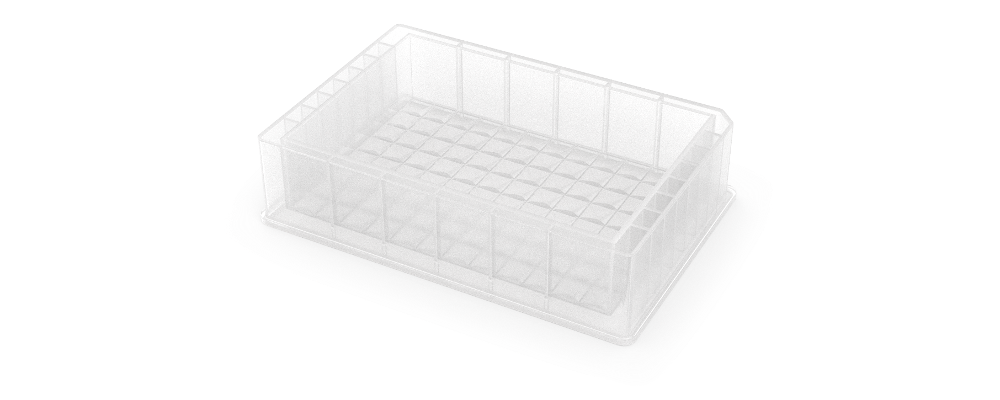

| Manufacturer | Specifications | API load name             |
| :----------- | :------------- | :------------------------ |
| Agilent      | <ul><li>290 mL</li><li>V bottom</li></ul> | [`agilent_1_reservoir_290ml`](https://github.com/Opentrons/opentrons/blob/edge/shared-data/labware/definitions/2/agilent_1_reservoir_290ml/3.json) |
| Axygen       | <ul><li>90 mL</li><li>Flat bottom</li></ul> | [`axygen_1_reservoir_90ml`](https://github.com/Opentrons/opentrons/blob/edge/shared-data/labware/definitions/2/axygen_1_reservoir_90ml/1.json) |
| NEST         | <ul><li>195 mL</li><li>Flat bottom</li></ul> | [`nest_1_reservoir_195ml`](https://github.com/Opentrons/opentrons/blob/edge/shared-data/labware/definitions/2/nest_1_reservoir_195ml/1.json) |
| NEST         | <ul><li>290 mL</li><li>V bottom</li></ul> | [`nest_1_reservoir_290ml`](https://github.com/Opentrons/opentrons/blob/edge/shared-data/labware/definitions/2/nest_1_reservoir_290ml/3.json) |

### Multi-well reservoirs 

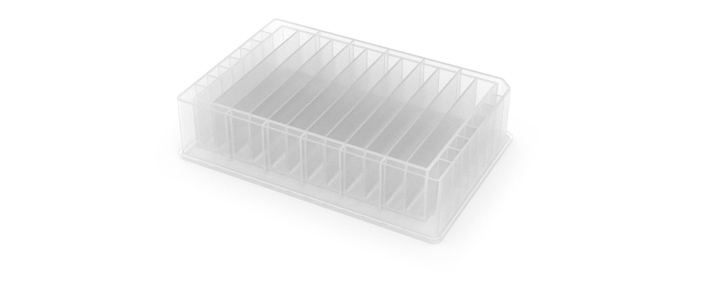

| Manufacturer | Specifications | API load name            |
| :----------- | :------------- | :----------------------- |
| NEST         | <ul><li>12 wells</li><li>15 mL/well</li><li>V bottom</li></ul> | [`nest_12_reservoir_15ml`](https://github.com/Opentrons/opentrons/blob/edge/shared-data/labware/definitions/2/nest_12_reservoir_15ml/2.json) |
| USA Scientific | <ul><li>12 wells</li><li>22 mL/well</li><li>V bottom</li></ul> | [`usascientific_12_reservoir_22ml`](https://github.com/Opentrons/opentrons/blob/edge/shared-data/labware/definitions/2/usascientific_12_reservoir_22ml/1.json) |

### Reservoirs and API definitions 

The [Opentrons Labware Library](https://labware.opentrons.com/) defines the characteristics of the reservoirs listed above in separate JSON files. The robot and the Opentrons Python API rely on these JSON definitions to work with labware used by your protocols. For example, when working with the API, the `ProtocolContext.load_labware` function accepts these labware names as valid parameters in your code. Linked API load names connect to the reservoir labware definitions in the [Opentrons GitHub repository](https://github.com/Opentrons/opentrons). 

### Custom reservoir labware 

Try creating a custom labware definition with the [Opentrons Labware Creator](https://labware.opentrons.com/create/) if a reservoir you'd like to use isn't listed here. A custom definition combines all the dimensions, metadata, shapes, volumetric capacity, and other information in a JSON file. The Opentrons Flex needs this information to understand how to work with your custom labware. See the [Custom Labware Definitions section][custom-labware-definitions] for more information. 

## Well plates 

The Opentrons Flex works by default with well plates listed below. Using these well plates helps reduce your prep work burden because they're automation-ready right out of the box. Well plate information is also available in the [Opentrons Labware Library](https://labware.opentrons.com/?category=wellPlate). 

<figure class="side-by-side" markdown>
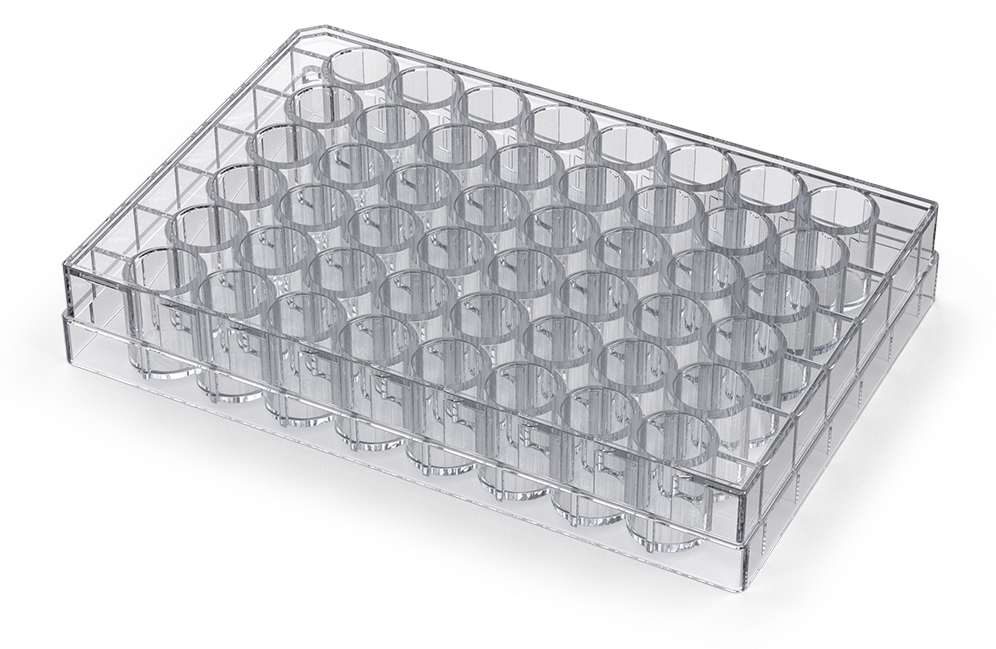
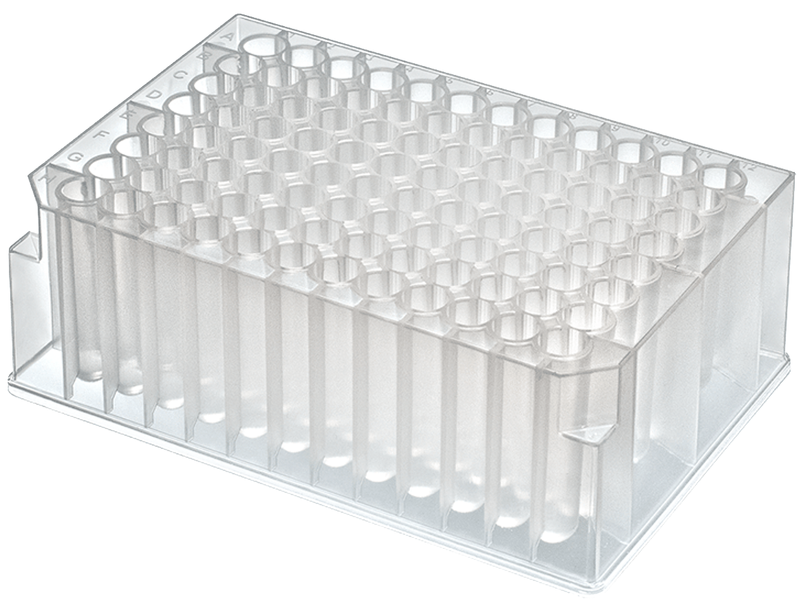
</figure>

### 6-well plates 

| Manufacturer | Specifications | API load name |
| :----------- | :------------- | :---------------------------- |
| Corning | <ul><li>6 wells</li><li>16.8 mL/well</li><li>Circular wells, flat bottom</li></ul> | [`corning_6_wellplate_16.8ml_flat`](https://github.com/Opentrons/opentrons/blob/edge/shared-data/labware/definitions/2/corning_6_wellplate_16.8ml_flat/3.json) |

### 12-well plates 

| Manufacturer | Specifications | API load name |
| :----------- | :------------- | :---------------------------- |
| Corning | <ul><li>12 wells</li><li>6.9 mL/well</li><li>Circular wells, flat bottom</li></ul> | [`corning_12_wellplate_6.9ml_flat`](https://github.com/Opentrons/opentrons/blob/edge/shared-data/labware/definitions/2/corning_12_wellplate_6.9ml_flat/3.json) |

### 24-well plates 

| Manufacturer | Specifications | API load name |
| :----------- | :------------- | :----------------------------- |
| Corning | <ul><li>24 wells</li><li>3.4 mL/well</li><li>Circular wells, flat bottom</li></ul> | [`corning_24_wellplate_3.4ml_flat`](https://github.com/Opentrons/opentrons/blob/edge/shared-data/labware/definitions/2/corning_24_wellplate_3.4ml_flat/3.json) |

### 48-well plates 

| Manufacturer | Specifications | API load name |
| :----------- | :------------- | :----------------------------- |
| Corning | <ul><li>48 wells</li><li>1.6 mL/well</li><li>Circular wells, flat bottom</li></ul> | [`corning_48_wellplate_1.6ml_flat`](https://github.com/Opentrons/opentrons/blob/edge/shared-data/labware/definitions/2/corning_48_wellplate_1.6ml_flat/4.json) |

### 96-well plates 

| Manufacturer | Specifications | API load name |
| :-------------- | :------------- | :---------------------------------- |
| Bio-Rad | <ul><li>96 wells</li><li>200 µL/well</li><li>Circular wells, V bottom</li></ul> | [`biorad_96_wellplate_200ul_pcr`](https://github.com/Opentrons/opentrons/blob/edge/shared-data/labware/definitions/2/biorad_96_wellplate_200ul_pcr/3.json) |
| Corning | <ul><li>96 wells</li><li>360 µL/well</li><li>Circular wells, flat bottom</li></ul> | [`corning_96_wellplate_360ul_flat`](https://github.com/Opentrons/opentrons/blob/edge/shared-data/labware/definitions/2/corning_96_wellplate_360ul_flat/3.json) |
| NEST | <ul><li>96 wells</li><li>100 µL/well</li><li>Circular wells, V bottom</li><li>PCR full skirt</li></ul> | [`nest_96_wellplate_100ul_pcr_full_skirt`](https://github.com/Opentrons/opentrons/blob/edge/shared-data/labware/definitions/2/nest_96_wellplate_100ul_pcr_full_skirt/3.json) |
| NEST | <ul><li>96 wells</li><li>200 µL/well</li><li>Circular wells, flat bottom</li></ul> | [`nest_96_wellplate_200ul_flat`](https://github.com/Opentrons/opentrons/blob/edge/shared-data/labware/definitions/2/nest_96_wellplate_200ul_flat/3.json) |
| NEST | <ul><li>96 deep wells</li><li>2000 µL/well</li><li>Square wells, V bottom</li></ul> | [`nest_96_wellplate_2ml_deep`](https://github.com/Opentrons/opentrons/blob/edge/shared-data/labware/definitions/2/nest_96_wellplate_2ml_deep/3.json) |
| Opentrons | <ul><li>Tough 96 wells</li><li>200 µL/well</li><li>Circular wells, V bottom</li><li>PCR full skirt</li></ul> | [`opentrons_96_wellplate_200ul_pcr_full_skirt`](https://github.com/Opentrons/opentrons/blob/edge/shared-data/labware/definitions/2/opentrons_96_wellplate_200ul_pcr_full_skirt/3.json) |
| Thermo Scientific | <ul><li>Nunc 96 deep wells</li><li>1300 µL/well</li><li>Circular wells, U bottom</li></ul> | [`thermoscientificnunc_96_wellplate_1300ul`](https://github.com/Opentrons/opentrons/blob/edge/shared-data/labware/definitions/2/thermoscientificnunc_96_wellplate_1300ul/2.json) |
| Thermo Scientific | <ul><li>Nunc 96 deep wells</li><li>2000 µL/well</li><li>Circular wells, U bottom</li></ul> | [`thermoscientificnunc_96_wellplate_2000ul`](https://github.com/Opentrons/opentrons/blob/edge/shared-data/labware/definitions/2/thermoscientificnunc_96_wellplate_2000ul/2.json) |
| USA Scientific | <ul><li>96 deep wells</li><li>2.4 mL/well</li><li>Square wells, U bottom</li></ul> | [`usascientific_96_wellplate_2.4ml_deep`](https://github.com/Opentrons/opentrons/blob/edge/shared-data/labware/definitions/2/usascientific_96_wellplate_2.4ml_deep/2.json) |

### 384-well plates 

| Manufacturer | Specifications | API load name |
| :---------------- | :------------------------- | :--------------------------------- |
| Applied Biosystems | <ul><li>384 wells</li><li>40 µL/well</li><li>Circular wells, V bottom</li></ul> | [`appliedbiosystemsmicroamp_384_wellplate_40ul`](https://github.com/Opentrons/opentrons/blob/edge/shared-data/labware/definitions/2/appliedbiosystemsmicroamp_384_wellplate_40ul/2.json) |
| Bio-Rad | <ul><li>384 wells</li><li>50 µL/well</li><li>Circular wells, V bottom</li></ul> | [`biorad_384_wellplate_50ul`](https://github.com/Opentrons/opentrons/blob/edge/shared-data/labware/definitions/2/biorad_384_wellplate_50ul/3.json) |
| Corning | <ul><li>384 wells</li><li>112 µL/well</li><li>Square wells, flat bottom</li></ul> | [`corning_384_wellplate_112ul_flat`](https://github.com/Opentrons/opentrons/blob/edge/shared-data/labware/definitions/2/corning_384_wellplate_112ul_flat/4.json) |

### Well plate adapters 

The aluminum plates listed below are [thermal adapters][thermal-adapters] for the Opentrons Heater-Shaker GEN1 module. You can use these standalone adapter definitions to load Opentrons verified or custom labware on top of the Heater-Shaker. 

| Adapter type | API load name |
| :----------- | :------------ |
| Opentrons 96 Deep Well Heater-Shaker Adapter with NEST Deep Well Plate 2 mL | [`opentrons_96_deep_well_adapter_nest_wellplate_2ml_deep`](https://github.com/Opentrons/opentrons/blob/edge/shared-data/labware/definitions/2/opentrons_96_deep_well_adapter_nest_wellplate_2ml_deep/1.json) |
| Opentrons 96 Flat Bottom Heater-Shaker Adapter with NEST 96 Well Plate 200 µL Flat | [`opentrons_96_flat_bottom_adapter_nest_wellplate_200ul_flat`](https://github.com/Opentrons/opentrons/blob/edge/shared-data/labware/definitions/2/opentrons_96_flat_bottom_adapter_nest_wellplate_200ul_flat/1.json) |
| Opentrons 96 PCR Heater-Shaker Adapter with NEST Well Plate 100 μL | [`opentrons_96_pcr_adapter_nest_wellplate_100ul_pcr_full_skirt`](https://github.com/Opentrons/opentrons/blob/edge/shared-data/labware/definitions/2/opentrons_96_pcr_adapter_nest_wellplate_100ul_pcr_full_skirt/1.json) |
| Opentrons Universal Flat Heater-Shaker Adapter with Corning 384 Well Plate 112 µL Flat | [`opentrons_universal_flat_adapter_corning_384_wellplate_112ul_flat`](https://github.com/Opentrons/opentrons/blob/edge/shared-data/labware/definitions/2/opentrons_universal_flat_adapter_corning_384_wellplate_112ul_flat/1.json) |

You can purchase adapters directly from Opentrons: 

- [Universal Flat Adapter](https://opentrons.com/products/universal-flat-adapter/)
- [PCR Adapter](https://opentrons.com/products/pcr-adapter/)
- [Deep Well Adapter](https://opentrons.com/products/deep-well-adapter/)
- [96 Flat Bottom Adapter](https://opentrons.com/products/96-flat-bottom-adapter/)

!!! note
    Don't use a combined definition if you need to move labware onto or off of the Heater-Shaker during your protocol, either with the gripper or manually. Use a standalone adapter definition instead. 

| Adapter/labware combination | API load name |
| :-------------------------- | :------------ |
| Opentrons 96 Deep Well Heater-Shaker Adapter with NEST Deep Well Plate 2 mL | [`opentrons_96_deep_well_adapter_nest_wellplate_2ml_deep`](https://github.com/Opentrons/opentrons/blob/edge/shared-data/labware/definitions/2/opentrons_96_deep_well_adapter_nest_wellplate_2ml_deep/1.json)    |
| Opentrons 96 Flat Bottom Heater-Shaker Adapter with NEST 96 Well Plate 200 µL Flat | [`opentrons_96_flat_bottom_adapter_nest_wellplate_200ul_flat`](https://github.com/Opentrons/opentrons/blob/edge/shared-data/labware/definitions/2/opentrons_96_flat_bottom_adapter_nest_wellplate_200ul_flat/1.json) |
| Opentrons 96 PCR Heater-Shaker Adapter with NEST Well Plate 100 µL          | [`opentrons_96_pcr_adapter_nest_wellplate_100ul_pcr_full_skirt`](https://github.com/Opentrons/opentrons/blob/edge/shared-data/labware/definitions/2/opentrons_96_pcr_adapter_nest_wellplate_100ul_pcr_full_skirt/1.json) |
| Opentrons Universal Flat Heater-Shaker Adapter with Corning 384 Well Plate 112 µL Flat | [`opentrons_universal_flat_adapter_corning_384_wellplate_112ul_flat`](https://github.com/Opentrons/opentrons/blob/edge/shared-data/labware/definitions/2/opentrons_universal_flat_adapter_corning_384_wellplate_112ul_flat/1.json) |

Adapters can be purchased directly from Opentrons at [https://shop.opentrons.com](https://shop.opentrons.com). 

### Well plates and API definitions 

The [Opentrons Labware Library](https://labware.opentrons.com/) defines the characteristics of the well plates listed above in separate JSON files. The Flex robot and the Opentrons Python API rely on these JSON definitions to work with labware used by your protocols. For example, when working with the API, the `ProtocolContext.load_labware` function accepts these labware names as valid parameters in your code. Linked API load names connect to the well plate labware definitions in the [Opentrons GitHub repository](https://github.com/Opentrons/opentrons). 

### Custom well plate labware 

Try using the Opentrons Labware Creator to make a custom labware definition if a well plate you'd like to use isn't listed here. A custom definition combines all the dimensions, metadata, shapes, volumetric capacity, and other information in a JSON file. The Opentrons Flex reads this information to understand how to work with your custom labware. See the [Custom Labware Definitions section][custom-labware-definitions] for more information. 

## Tips and tip racks 

Opentrons Flex tips come in 50 µL, 200 µL, and 1000 µL sizes. These are clear, non-conducting polypropylene tips that are available with or without filters. They're packaged sterile in racks that hold 96 tips and are free of DNase, RNase, protease, pyrogens, human DNA, endotoxins, and PCR inhibitors. Racks also include lot numbers and expiration dates. 

Flex pipette tips work with all single- and multi-channel Opentrons Flex 50 µL and 1000 µL pipettes. While any Flex tip fits on any Flex pipette, you should always match the tip to a pipette of the same capacity or larger. For best performance, use the smallest tips that can hold the amount of liquid you need to aspirate. See [Pipette specifications][pipette-specifications] for examples. 

| Pipette capacity | Compatible tips             |
| :--------------- | :-------------------------- |
| 1–50 µL          | 50 µL tips only             |
| 5–1000 µL        | 50 μL, 200 μL, and 1000 µL tips |

### Tip racks 

Unfiltered and filtered tips are bundled into a rack that consists of a reusable base plate, a mid-plate that holds 96 tips, and a lid. 

| Tip rack by volume | API load name                         |
| :----------------- | :------------------------------------ |
| 50 μL              | <ul><li>Unfiltered: [`opentrons_flex_96_tiprack_50ul`](https://github.com/Opentrons/opentrons/blob/edge/shared-data/labware/definitions/2/opentrons_flex_96_tiprack_50ul/1.json)</li><li>Filtered: [`opentrons_flex_96_filtertiprack_50ul`](https://github.com/Opentrons/opentrons/blob/edge/shared-data/labware/definitions/2/opentrons_flex_96_filtertiprack_50ul/1.json)</li></ul> |
| 200 µL             | <ul><li>Unfiltered: [`opentrons_flex_96_tiprack_200ul`](https://github.com/Opentrons/opentrons/blob/edge/shared-data/labware/definitions/2/opentrons_flex_96_tiprack_200ul/1.json)</li><li>Filtered: [`opentrons_flex_96_filtertiprack_200ul`](https://github.com/Opentrons/opentrons/blob/edge/shared-data/labware/definitions/2/opentrons_flex_96_filtertiprack_200ul/1.json)</li></ul> |
| 1000 µL            | <ul><li>Unfiltered: [`opentrons_flex_96_tiprack_1000ul`](https://github.com/Opentrons/opentrons/blob/edge/shared-data/labware/definitions/2/opentrons_flex_96_tiprack_1000ul/1.json)</li><li>Filtered: [`opentrons_flex_96_filtertiprack_1000ul`](https://github.com/Opentrons/opentrons/blob/edge/shared-data/labware/definitions/2/opentrons_flex_96_filtertiprack_1000ul/1.json)</li></ul> |

To help with identification, the tip rack mid-plates are color coded based on tip size: 

- 50 µL: magenta 
- 200 µL: yellow 
- 1000 µL: blue 

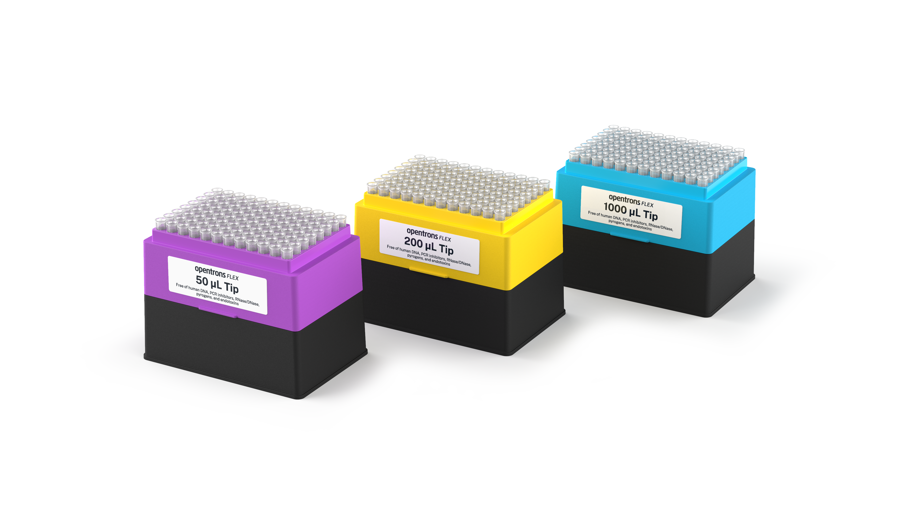

When ordering or reordering, tips and racks come in two different packaged configurations: 

- **Racks:** Consist of separately shrink-wrapped tip racks (base plate, mid-plate with tips, and lid). Racked configurations are best when cleanliness is paramount, to avoid cross-contamination, or when your protocols don't allow for base plate or component reuse. 
- **Refills:** Consist of one complete tip rack (base plate, mid plate with tips, and lid) and individual tip containers. Refill configurations are best when your protocols allow for base plate or component reuse. 

### Tip-pipette compatibility 

Flex pipette tips are designed for the Opentrons Flex pipettes. Flex tips are not backwards compatible with Opentrons OT-2 pipettes, nor can you use OT-2 tips on Flex pipettes. 

Other industry-standard tips may work with Flex pipettes, but this is not recommended. To ensure optimum performance, you should only use Opentrons Flex tips with Flex pipettes. 

### Tip rack adapter 

The 96-channel pipette requires an adapter to attach a full rack of tips properly. During the attachment procedure, the pipette moves over the adapter, lowers itself onto the mounting pins, and pulls tips onto the pipettes by lifting the adapter and tip rack. 

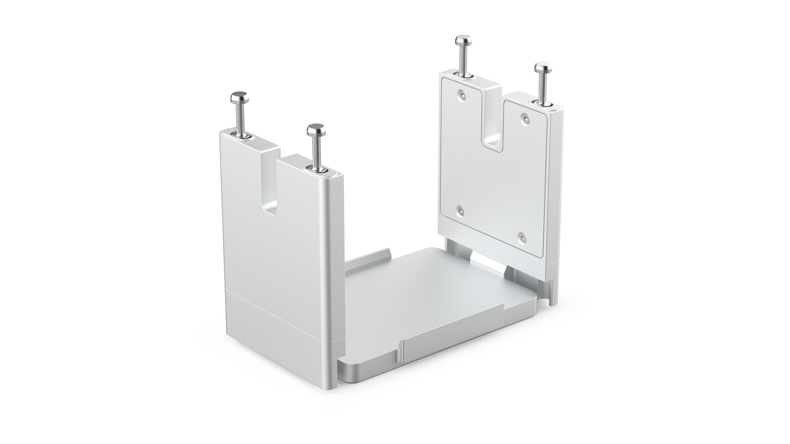

!!! note
    Only use the tip rack adapter when picking up a full rack of tips at once. Place tip racks directly on the deck when picking up fewer tips. 

!!! warning
    Pinch point hazard. Keep hands away from the tip rack adapter while the pipette is attaching pipette tips. 

| Adapter type | API load name |
| :------------------------------ | :-------------------------------- |
| Opentrons Flex 96 Tip Rack Adapter | [`opentrons_flex_96_tiprack_adapter`](https://github.com/Opentrons/opentrons/blob/edge/shared-data/labware/definitions/2/opentrons_flex_96_tiprack_adapter/1.json) |

The tip rack adapter is compatible with the Opentrons Flex Gripper. You can use the gripper to place fresh tip racks on the adapter or to pick up and move used tip racks into the waste chute. 

## Tubes and tube racks 

<figure class="side-by-side" markdown>
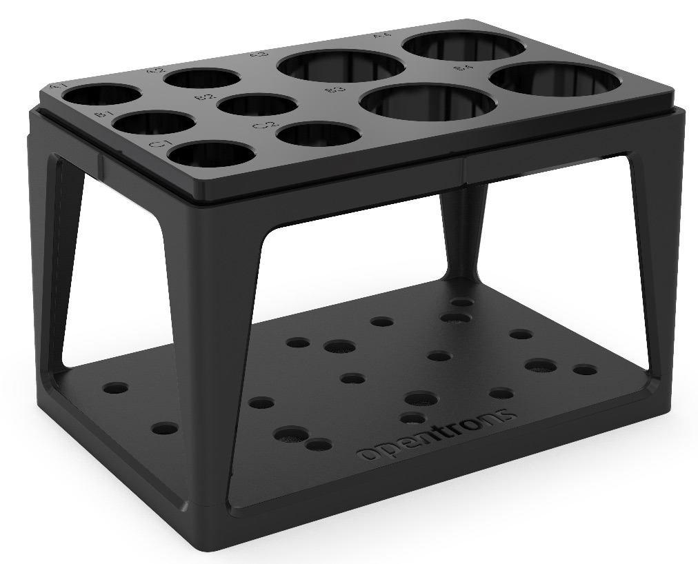
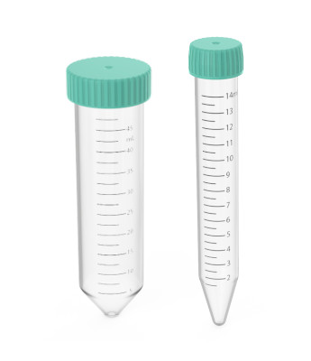
</figure>

The [Opentrons 4-in-1 Tube Rack system](https://opentrons.com/products/4-in-1-tube-rack-set) works with the Opentrons Flex by default. Using the 4-in-1 tube rack helps reduce your prep work burden because the combinations it provides are automation-ready right out of the box. More information is also available in the [Opentrons Labware Library](https://labware.opentrons.com/?category=tubeRack). 

### Tube and rack combinations 

The Opentrons 4-in-1 tube rack supports a wide variety of tube sizes, singly or in different size (volume) combinations. These include a: 

- 6-tube rack for 50 mL tubes (6 × 50 mL). 
- 10-tube combination rack for four 50 mL tubes and six 15 mL tubes (4 × 50 mL, 6 × 15 mL). 
- 15-tube rack for 15 mL tubes (15 × 15 mL). 
- 24-tube rack for 0.5 mL, 1.5 mL, or 2 mL tubes (24 × 0.5 mL, 1.5 mL, 2 mL). 

!!! note
    All tubes are cylindrical with V-shaped (conical) bottoms unless otherwise indicated. 

### 6-tube racks 

| Tube type         | API load name                          |
| :---------------- | :------------------------------------- |
| 6 Falcon 50 mL    | [`opentrons_6_tuberack_falcon_50ml_conical`](https://github.com/Opentrons/opentrons/blob/edge/shared-data/labware/definitions/2/opentrons_6_tuberack_falcon_50ml_conical/1.json) |
| 6 NEST 50 mL      | [`opentrons_6_tuberack_nest_50ml_conical`](https://github.com/Opentrons/opentrons/blob/edge/shared-data/labware/definitions/2/opentrons_6_tuberack_nest_50ml_conical/1.json) |

### 10-tube racks 

| Tube type | API load name |
| :-------- | :------------ |
| <ul><li>4 Falcon 50 mL</li><li>6 Falcon 15 mL</li></ul> | [`opentrons_10_tuberack_falcon_4x50ml_6x15ml_conical`](https://github.com/Opentrons/opentrons/blob/edge/shared-data/labware/definitions/2/opentrons_10_tuberack_falcon_4x50ml_6x15ml_conical/1.json) |
| <ul><li>4 NEST 50 mL</li><li>6 NEST 15 mL</li></ul> | [`opentrons_10_tuberack_nest_4x50ml_6x15ml_conical`](https://github.com/Opentrons/opentrons/blob/edge/shared-data/labware/definitions/2/opentrons_10_tuberack_nest_4x50ml_6x15ml_conical/1.json) |

### 15-tube racks 

| Tube type          | API load name                           |
| :----------------- | :-------------------------------------- |
| 15 Falcon 15 mL    | [`opentrons_15_tuberack_falcon_15ml_conical`](https://github.com/Opentrons/opentrons/blob/edge/shared-data/labware/definitions/2/opentrons_15_tuberack_falcon_15ml_conical/1.json) |
| 15 NEST 15 mL      | [`opentrons_15_tuberack_nest_15ml_conical`](https://github.com/Opentrons/opentrons/blob/edge/shared-data/labware/definitions/2/opentrons_15_tuberack_nest_15ml_conical/1.json) |

### 24-tube racks 

| Tube type          | API load name                           |
| :----------------- | :-------------------------------------- |
| 24 Eppendorf Safe-Lock 1.5 mL   | [`opentrons_24_tuberack_eppendorf_1.5ml_safelock_snapcap`](https://github.com/Opentrons/opentrons/blob/edge/shared-data/labware/definitions/2/opentrons_24_tuberack_eppendorf_1.5ml_safelock_snapcap/1.json) |
| 24 Eppendorf Safe-Lock 2 mL, U-shaped bottom | [`opentrons_24_tuberack_eppendorf_2ml_safelock_snapcap`](https://github.com/Opentrons/opentrons/blob/edge/shared-data/labware/definitions/2/opentrons_24_tuberack_eppendorf_2ml_safelock_snapcap/1.json) |
| 24 generic 2 mL screw cap       | [`opentrons_24_tuberack_generic_2ml_screwcap`](https://github.com/Opentrons/opentrons/blob/edge/shared-data/labware/definitions/2/opentrons_24_tuberack_generic_2ml_screwcap/1.json)        |
| 24 NEST 0.5 mL screw cap        | [`opentrons_24_tuberack_nest_0.5ml_screwcap`](https://github.com/Opentrons/opentrons/blob/edge/shared-data/labware/definitions/2/opentrons_24_tuberack_nest_0.5ml_screwcap/1.json)         |
| 24 NEST 1.5 mL screw cap        | [`opentrons_24_tuberack_nest_1.5ml_screwcap`](https://github.com/Opentrons/opentrons/blob/edge/shared-data/labware/definitions/2/opentrons_24_tuberack_nest_1.5ml_screwcap/1.json)         |
| 24 NEST 1.5 mL snap cap         | [`opentrons_24_tuberack_nest_1.5ml_snapcap`](https://github.com/Opentrons/opentrons/blob/edge/shared-data/labware/definitions/2/opentrons_24_tuberack_nest_1.5ml_snapcap/1.json)          |
| 24 NEST 2 mL screw cap          | [`opentrons_24_tuberack_nest_2ml_screwcap`](https://github.com/Opentrons/opentrons/blob/edge/shared-data/labware/definitions/2/opentrons_24_tuberack_nest_2ml_screwcap/1.json)           |
| 24 NEST 2 mL snap cap, U-shaped bottom | [`opentrons_24_tuberack_nest_2ml_snapcap`](https://github.com/Opentrons/opentrons/blob/edge/shared-data/labware/definitions/2/opentrons_24_tuberack_nest_2ml_snapcap/1.json)          |

### Tube rack API definitions 

The [Opentrons Labware Library](https://labware.opentrons.com/) defines the characteristics of the tube racks listed above in separate JSON files. The Flex robot and the Opentrons Python API rely on these JSON definitions to work with labware used by your protocols. For example, when working with the API, the `ProtocolContext.load_labware` function accepts these labware names as valid parameters in your code. Linked API load names connect to the tube rack labware definitions in the [Opentrons GitHub repository](https://github.com/Opentrons/opentrons). 

### Custom tube rack labware 

Try creating a custom labware definition using the [Opentrons Labware Creator](https://labware.opentrons.com/create/) if a tube and rack combination you'd like to use isn't listed here. A custom definition combines all the dimensions, metadata, shapes, volumetric capacity, and other information in a JSON file. The Opentrons Flex reads this information to understand how to work with your custom labware. See the [Custom Labware Definitions section][custom-labware-definitions] for more information. 

## Aluminum blocks 

Aluminum blocks ship with the Temperature Module GEN2 and can be purchased separately as a [three-piece set](https://opentrons.com/products/aluminum-block-1-5-2-0ml-tubes). The set includes a flat bottom plate, a 24-well block, and a 96-well block. 

The Opentrons Flex uses aluminum blocks to hold sample tubes and well plates on the Temperature Module or directly on the deck. When used with the Temperature Module, the aluminum blocks can keep your sample tubes, PCR strips, or plates at a constant temperature between 4 °C and 95 °C. 

### Flat bottom plate 

The flat bottom plate for Flex ships with the Temperature Module's caddy and is compatible with various ANSI/SLAS standard well plates. This flat plate differs from the plate that ships with the Temperature Module itself or the separate three-piece set. It features a wider working surface and chamfered corner clips. These features help improve the performance of the Opentrons Flex Gripper when moving labware onto or off of the plate. 

You can tell which flat bottom plate you have because the one for Flex has the words "Opentrons Flex" on its top surface. The one for OT-2 does not. 

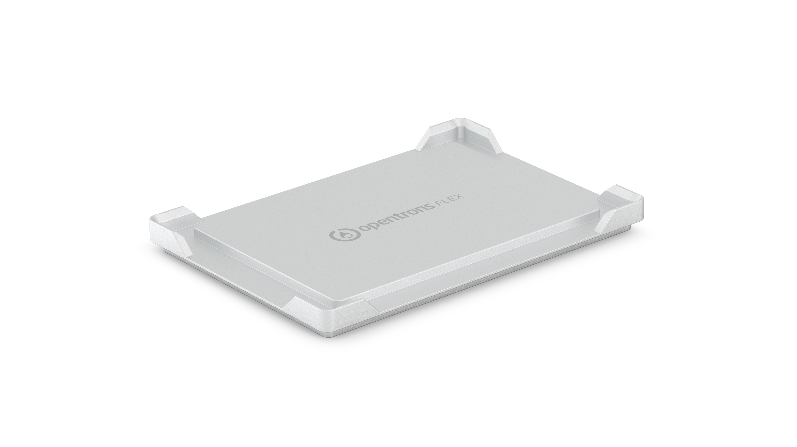

### 24-well aluminum block 

The 24-well block is used with individual sample vials. For example, it accepts sample vials that: 

- Have V-shaped or U-shaped bottoms. 
- Secure contents with snap cap or screw cap closures. 
- Hold liquid in capacities of 0.5 mL, 1.5 mL, and 2 mL. 

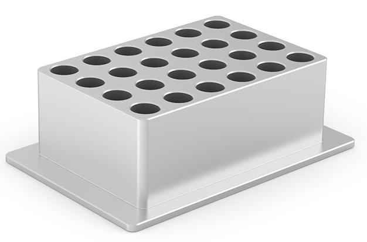

### 96-well aluminum block 

The 96-well block supports a wide variety of well plate types. For example, it accepts well plates that are: 

- From major well-plate manufacturers like Bio-Rad and NEST. 
- Designed with V-shaped bottoms, U-shaped bottoms, or flat bottoms. 
- Designed with 100 µL or 200 µL wells. 

It is also compatible with generic PCR strips. 

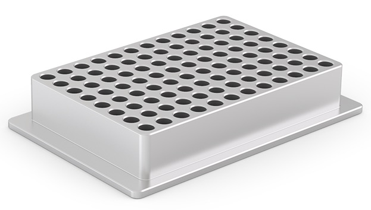

### Standalone adapters 

| Thermal block           | API load name                         |
| :---------------------- | :------------------------------------ |
| Flex flat bottom plate  | [`opentrons_aluminum_flat_bottom_plate`](https://github.com/Opentrons/opentrons/blob/edge/shared-data/labware/definitions/2/opentrons_aluminum_flat_bottom_plate/1.json)  |
| 24-well aluminum block  | *See labware combinations below.*     |
| 96-well aluminum block  | [`opentrons_96_well_aluminum_block`](https://github.com/Opentrons/opentrons/blob/edge/shared-data/labware/definitions/2/opentrons_96_well_aluminum_block/1.json)      |

### Aluminum block labware combinations 

The [Opentrons Labware Library](https://labware.opentrons.com/) supports the following block, vial, and well plate combinations, which are also defined in separate JSON labware definition files. The Flex robot and the Opentrons Python API rely on these JSON definitions to work with labware used by your protocols. For example, when working with the API, the `ProtocolContext.load_labware` function accepts these labware names as valid parameters in your code. The tables below list the default block/container combinations and related API load names. Links connect to corresponding JSON definitions in the [Opentrons GitHub repository](https://github.com/Opentrons/opentrons). 

!!! note
    All tubes have V-shaped bottoms unless otherwise indicated. 

### 24-well aluminum block labware combinations 

| 24-well block contents                | API load name                                   |
| :------------------------------------ | :---------------------------------------------- |
| Generic 2 mL screw cap                | [`opentrons_24_aluminumblock_generic_2ml_screwcap`](https://github.com/Opentrons/opentrons/blob/edge/shared-data/labware/definitions/2/opentrons_24_aluminumblock_generic_2ml_screwcap/1.json) |
| NEST 0.5 mL screw cap                 | [`opentrons_24_aluminumblock_nest_0.5ml_screwcap`](https://github.com/Opentrons/opentrons/blob/edge/shared-data/labware/definitions/2/opentrons_24_aluminumblock_nest_0.5ml_screwcap/1.json)  |
| NEST 1.5 mL screw cap                 | [`opentrons_24_aluminumblock_nest_1.5ml_screwcap`](https://github.com/Opentrons/opentrons/blob/edge/shared-data/labware/definitions/2/opentrons_24_aluminumblock_nest_1.5ml_screwcap/1.json)  |
| NEST 1.5 mL snap cap                  | [`opentrons_24_aluminumblock_nest_1.5ml_snapcap`](https://github.com/Opentrons/opentrons/blob/edge/shared-data/labware/definitions/2/opentrons_24_aluminumblock_nest_1.5ml_snapcap/1.json)   |
| NEST 2 mL screw cap                   | [`opentrons_24_aluminumblock_nest_2ml_screwcap`](https://github.com/Opentrons/opentrons/blob/edge/shared-data/labware/definitions/2/opentrons_24_aluminumblock_nest_2ml_screwcap/1.json)    |
| NEST 2 mL snap cap, U-shaped bottom   | [`opentrons_24_aluminumblock_nest_2ml_snapcap`](https://github.com/Opentrons/opentrons/blob/edge/shared-data/labware/definitions/2/opentrons_24_aluminumblock_nest_2ml_snapcap/1.json)     |

### 96-well aluminum block labware combinations 

| 96-well block contents      | API load name                                       |
| :-------------------------- | :-------------------------------------------------- |
| Bio-Rad well plate 200 µL   | [`opentrons_96_aluminumblock_biorad_wellplate_200uL`](https://github.com/Opentrons/opentrons/blob/edge/shared-data/labware/definitions/2/opentrons_96_aluminumblock_biorad_wellplate_200ul/1.json)   |
| Generic PCR strip 200 µL    | [`opentrons_96_aluminumblock_generic_pcr_strip_200uL`](https://github.com/Opentrons/opentrons/blob/edge/shared-data/labware/definitions/2/opentrons_96_aluminumblock_generic_pcr_strip_200ul/1.json)  |
| NEST well plate 100 µL      | [`opentrons_96_aluminumblock_nest_wellplate_100uL`](https://github.com/Opentrons/opentrons/blob/edge/shared-data/labware/definitions/2/opentrons_96_aluminumblock_nest_wellplate_100ul/1.json)     |

## Labware and the Opentrons Flex Gripper 

Although the Opentrons Flex works with all the inventory in the Labware Library, the Opentrons Flex Gripper is compatible with specific labware items only. Currently, the Gripper is optimized for use with the following labware items. 

| Labware category                | Brands                                     |
| :------------------------------ | :----------------------------------------- |
| Deep Well Plates                | <ul><li>NEST 96 Deep Well Plate 2 mL</li></ul> |
| Fully Skirted 96 Well Plates    | <ul><li>Opentrons Tough 96 Well Plate 200 µL PCR Full Skirt</li><li>NEST 96 Well Plate 200 µL Flat</li></ul> |
| Tip Racks (unfiltered and filtered tips) | <ul><li>Opentrons Flex 96 Tip Rack 50 µL</li><li>Opentrons Flex 96 Tip Rack 200 µL</li><li>Opentrons Flex 96 Tip Rack 1000 µL</li></ul> |

!!! note
    For best results, use the Flex Gripper only with the labware listed above. The Flex Gripper may work with other ANSI/SLAS automation compliant labware, but this is not recommended. 

## Custom labware definitions 

As discussed at the beginning of this chapter, custom labware is labware that's not listed in the Opentrons Labware Library. You can use other common or unique labware items with the Flex by accurately measuring and recording the characteristics of that object and saving that data in a JSON file. When imported into the app, the Flex and the API uses that JSON data to interact with your labware. Opentrons provides tools and services, which we'll examine below, to help you use the Flex with custom labware. 

### Creating custom labware definitions 

Opentrons tools and services help put custom labware within your reach. These features accommodate different skill levels and ways of working. Creating your own labware, and using it with the Opentrons Flex, helps make the robot a versatile and powerful addition to your lab. 

#### Custom Labware Creator 

The [Custom Labware Creator](https://labware.opentrons.com/create/) is a no-code, web-based tool that uses a graphical interface to help you create a labware definition file. Labware Creator produces a JSON labware definition file that you import into the Opentrons App. After that, your custom labware is available to the Flex robot and the Python API. 

#### Custom Labware Service 

Get in touch with us if the labware you'd like to use isn't available in the library, if you can't create your own definitions, or because a custom item includes different shapes, sizes, or other irregularities described below. 

| Labware you can define in Labware Creator | Labware Opentrons needs to define |
| :---------------------------------------- | :-------------------------------- |
| :material-checkbox-outline: Wells and tubes are uniform and identical. | :material-checkbox-outline: Wells and tube shapes vary.               |
| :material-checkbox-outline: All rows are evenly spaced (the space between rows is equal). | :material-checkbox-outline: Rows are not evenly spaced.               |
| :material-checkbox-outline: All columns are evenly spaced (the space between columns is equal). | :material-checkbox-outline: Columns are not evenly spaced.            |
| :material-checkbox-outline: Fits perfectly in one deck slot.       | :material-checkbox-outline: Smaller than one deck slot (requires adapter) or spans multiple deck slots. |

Here are some diagrams that help you visualize the examples described above. 

| Layout {style="width: 200px;"} | Description |
| ------ | ----------- |
| 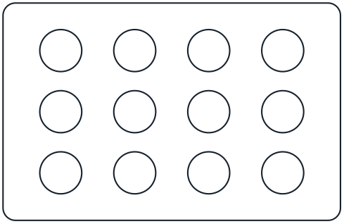 | :material-check-bold:{ .opentrons-blue } **Regular**  All columns are evenly spaced and all rows are evenly spaced. Columns do not need to have the same spacing as rows. |
| 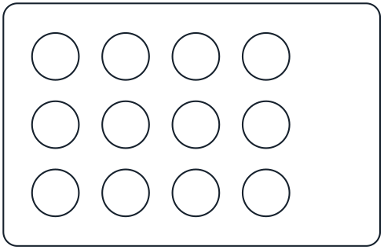 | :material-check-bold:{ .opentrons-blue } **Regular**  The grid does not have to be in the center of labware.  |
| 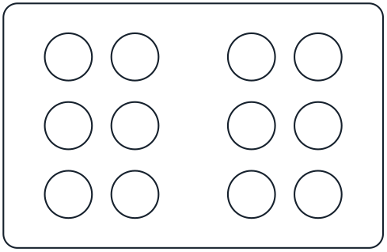 | :octicons-x-12:{ .grey } **Irregular**  Rows are evenly spaced but **columns are not evenly spaced.**  |
| 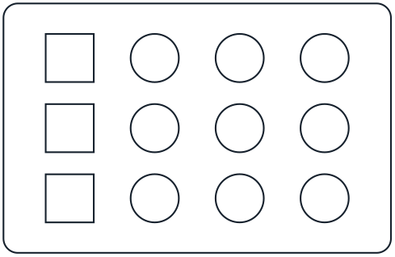 | :octicons-x-12:{ .grey } **Irregular**  Columns/rows are evenly spaced but **wells are not identical.** |
| 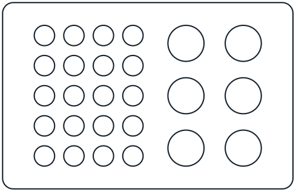 | :octicons-x-12:{ .grey } **Irregular**  There is **more than one grid.** |

If you need help creating custom labware definitions, contact Opentrons Support (<support@opentrons.com>). They will work to design custom labware definitions based on your requirements. This is a fee-based service.

#### Python API 

While you cannot create custom labware with our API, you can use custom labware with the available API methods. However, you need to define your custom labware first and import it into the Opentrons App. 

Once you have added your labware to the Opentrons App, it's available to the Python API and the robot. For information about writing protocol scripts with the API, see the [Python Protocol API section](protocol-development.md#python-protocol-api) in the Protocol Development chapter. 

### JSON labware schema 

A JSON file is the blueprint for Opentrons standard and custom labware. This file contains and organizes labware data according to the design specifications set by the default schema. 

A schema is a framework for organizing data. It sets the rules about what information is required or optional and how it’s organized in the JSON file. If you’re interested, take a moment to review [our labware schema](https://github.com/Opentrons/opentrons/blob/edge/shared-data/labware/schemas). For an actual example, see the definition for the [Opentrons 96 PCR Adapter](https://github.com/Opentrons/opentrons/blob/edge/shared-data/labware/definitions/2/opentrons_96_pcr_adapter/1.json). The following table lists and defines the items in the Opentrons labware schema.

| Property {style="width: 20%;"} | Data type | Definition                                   |
| :------------------ | :-------- | :------------------------------------------- |
| `schemaVersion`     | Number    | Schema version used by a labware. The current version is `3`. |
| `version`           | Integer   | An incrementing integer that identifies the labware version. Minimum version is `1`. |
| `namespace`         | String    | See `safeString` in the JSON definitions section below. |
| `metadata`          | Object    | Properties used for search and display. Accepts only:<ul><li>`displayName` (String): An easy-to-remember labware name.</li><li>`displayCategory`: Labels used in the UI to categorize labware. See `displayCategory` in the JSON definitions section below.</li><li>`displayVolumeUnits` (String): Labels used in the UI to indicate volume. Must be either µL, mL, or L.</li></ul> |
| `brand`             | Object    | Information about the labware manufacturer or those products the labware is compatible with. |
| `parameters`        | Object    | Internal parameters that describe labware characteristics. Accepts only:<ul><li>`format` (String): Determines labware compatibility with multichannel pipettes. Must be one of `96Standard`, `384Standard`, `trough`, `irregular`, or `trash`.</li><li>`quirks` (Array): Strings describing labware behavior. See the [Opentrons 96 Deep Well Adapter](https://github.com/Opentrons/opentrons/blob/03cd0336c6051c05fa66088fabec426c7b751a85/shared-data/labware/definitions/2/opentrons_96_deep_well_adapter_nest_wellplate_2ml_deep/1.json#L1108) definition.</li><li>`isTiprack` (Boolean): Indicates if labware is a tip rack (`true`) or not (`false`).</li><li>`tipLength` (Number): Required if labware is a tip rack. Specifies tip length (in mm), from top to bottom, as indicated in technical drawings or as measured with calipers.</li><li>`tipoverlap` (Number): Required if labware is a tip rack. Specifies how far tips on a tip rack are expected to overlap with the pipette's nozzle. Defined as tip length minus the distance between the bottom of the pipette and the bottom of the tip. The robot's calibration process may fine-tune this estimate.</li><li>`loadName`: Name used to reference a labware definition (e.g., `opentrons_flex_96_tiprack_50_ul`).</li><li>`isMagneticModuleCompatible` (Boolean): Indicates if labware is compatible with the Magnetic Module.</li><li>`magneticModuleEngageHeight`: How far the Magnetic Module will move its magnets when used with this labware. See `positiveNumber` in the JSON definitions section below.</li></ul> |
| `ordering`          | Array     | An array that tracks how wells should be ordered on a piece of labware. See the [Opentrons 96 PCR Adapter](https://github.com/Opentrons/opentrons/blob/8569e32d2d918abb1f232f48a7b28385021215fd/shared-data/labware/definitions/2/opentrons_96_pcr_adapter/1.json#L2) example. |
| `cornerOffsetFromSlot` | Object    | Used for labware that spans multiple deck slots. Offset is the distance from the left-front-bottom corner of the slot to the left-front-bottom corner of the labware bounding box. Accepts only:<ul><li>`x` (number)</li><li>`y` (number)</li><li>`z` (number)</li></ul> For labware that does not span multiple slots, these values should be zero. See `positiveNumber` in the JSON definitions section below. |
| `dimensions`        | Object    | Outer dimensions (in mm) of a piece of labware. Accepts only:<ul><li>`xDimension` (length)</li><li>`yDimension` (width)</li><li>`zDimension` (height)</li></ul> See the [Opentrons 96 PCR Adapter](https://github.com/Opentrons/opentrons/blob/8569e32d2d918abb1f232f48a7b28385021215fd/shared-data/labware/definitions/2/opentrons_96_pcr_adapter/1.json#L26) example. |
| `wells`             | Object    | An unordered object of well objects, including position and dimensions. Each well object's key is the well's coordinates, which must be an uppercase letter followed by a number, e.g., A1, B1, H12. Each well object accepts the following properties:<ul><li>`depth` (Number): The distance (in mm) between the top and bottom of the well. For tip racks, depth is ignored in favor of `tipLength`, but the values should match.</li><li>`x` (Number): Location of the center-bottom of a well in reference to the left of the labware.</li><li>`y` (Number): Location of the center-bottom of a well in reference to the front of the labware.</li><li>`z` (Number): Location of the center-bottom of a well in reference to the bottom of the labware.</li><li>`totalLiquidVolume` (Number): Total well, tube, or tip volume in µL.</li><li>`xDimension` (Number): Length of a rectangular well.</li><li>`yDimension` (Number): Width of a rectangular well.</li><li>`diameter` (Number): Diameter of a circular well.</li><li>`shape` (String): Either `rectangular` or `circular`. If `rectangular`, specify `xDimension` and `yDimension`. If `circular`, specify `diameter`.</li></ul>For a circular well example, see the [Opentrons 96 PCR Adapter](https://github.com/Opentrons/opentrons/blob/8569e32d2d918abb1f232f48a7b28385021215fd/shared-data/labware/definitions/2/opentrons_96_pcr_adapter/1.json#L31). For a rectangular well example, see the [NEST 96 Deep Well Plate 2mL](https://github.com/Opentrons/opentrons/blob/8569e32d2d918abb1f232f48a7b28385021215fd/shared-data/labware/definitions/2/nest_96_wellplate_2ml_deep/2.json#L35). For dimension, depth, and volume, see `positiveNumber` in the JSON definitions section below. |
| `groups`            | Array     | Logical well groupings for metadata and display purposes. Changes in groups do not affect protocol execution. Each item in the array accepts: <ul><li>`wells` (Array): An array of wells (e.g., `["A1", "B1", "C1"]`) that share the same metadata. Array elements are strings.</li><li>`metadata` (Object): Metadata specific to a grid of wells. Accepts only:</li><ul><li>`displayName` (String): Human-readable name for the well group.</li><li>`displayCategory`: Labels used to categorize well groups. See `displayCategory` in the JSON definitions section below.</li><li>`wellBottomShape` (String): Bottom shape of a well. Available shapes are `flat`, `u`, or `v` only.</li></ul><li>`brand`: Brand information for the well group. See `brandData` in the JSON definitions section below.</li></ul> |
| `allowedRoles`      | Array     | Defines an item's role or purpose. If the `allowedRoles` field is missing from a definition, an item is treated as `labware`. Possible array items are only the following strings: <ul><li>`labware` (standard labware items)</li><li>`adapter` (items designed to hold labware)</li><li>`fixture` (items that are affixed to the deck)</li><li>`maintenance` (items not used in normal protocol runs)</li></ul> |
| `stackingOffsetWithLabware` | Object    | For labware that can stack on top of another piece of labware. Used to determine z-height (labware z height + adapter z height - overlap). See `coordinates` in the JSON definitions section below. |
| `stackingOffsetWithModule` | Object    | For labware that can stack on top of a module. Used to determine z-height (module labware offset z + labware z - overlap). See `coordinates` in the JSON definitions section below. |
| `gripperOffsets`    | Object    | Offsets added when calculating the coordinates the gripper should go to when picking up or dropping other labware on this labware. Includes a `default` object that includes two properties: <ul><li>`pickUpOffset`: Offset added to calculate the pick-up coordinates of labware placed on this labware.</li><li>`dropOffset`: Offset added to calculate the drop-off coordinates of labware placed on this labware.</li></ul> See `coordinates` in the JSON definitions section below. |
| `gripForce`         | Number    | Measured in newtons, this is the force which the gripper uses to grasp labware. Recommended values are between 5 and 16. |
| `gripHeightFromLabwareBottom` | Number    | Recommended z-axis height, from the labware bottom to the center of the gripper pads. |

### JSON labware definitions 

| Property {style="width: 20%;"}       | Data type | Definition                                   |
| :-------------- | :-------- | :------------------------------------------- |
| `positiveNumber` | Number    | Minimum: 0.                      |
| `brandData`     | Object    | Information about branded items. Accepts only: <ul><li>`brand` (String): Brand/manufacturer's name.</li><li>`brandId` (Array): OEM part numbers or IDs.</li><li>`links` (Array): Manufacturer URLs. Array items are strings.</li></ul> |
| `displayCategory` | String    | Must be one of: <ul><li>`tipRack`</li><li>`tubeRack`</li><li>`reservoir`</li><li>`trash`</li><li>`wellPlate`</li><li>`aluminumBlock`</li><li>`adapter`</li><li>`other`</li></ul> |
| `safeString`    | String    | A string safe to use for load names and namespaces. Lowercase letters, numerals, periods, and underscores only. |
| `coordinates`   | Object    | Coordinates that specify a distance or position along the x-, y-, and z-axes. Accepts only: <ul><li>`x` (number)</li><li>`y` (number)</li><li>`z` (number)</li></ul> |