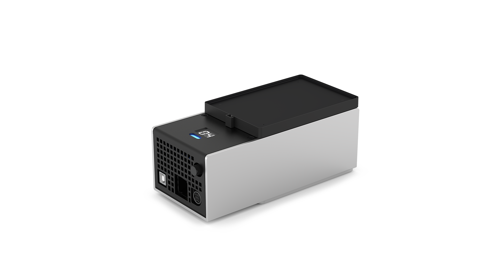
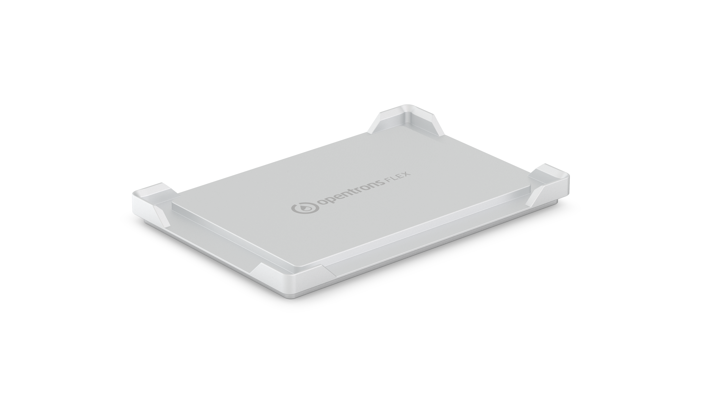

# Modules

Opentrons Flex integrates with several Opentrons hardware modules that add features and capabilities to the robot. Modules can occupy deck slots or are external, frame-mounted components. Flex communicates with and controls most modules via a USB connection.

This chapter summarizes the functions and physical specifications of modules that are compatible with Opentrons Flex. It also covers the caddy attachment system and module calibration.

!!!tip
    - For complete instructions on module installation and use, refer to the quickstart guide that shipped with your unit or find its manual in the [documentation and manuals section](https://opentrons.com/resources/knowledge-hub?c%5B%5D=documentation-manuals) of the Opentrons website.

    - For details on integrating modules into your protocols, see the [Protocol Designer section](protocol-development.md#protocol-designer) of the Protocol Development chapter or the [Hardware Modules section](https://docs.opentrons.com/v2/new_modules.html) of our Python API documentation.

## Supported modules

Opentrons Flex is compatible with with the following Opentrons modules:

- The **Absorbance Plate Reader** is a fully automated spectrophotometer that uses light absorbance to determine sample concentrations. This module is optimized for a variety of applications, including protein quantification, sample normalization, cell viability assays, and monitoring bacterial growth.

- The **Heater-Shaker Module** provides on-deck heating and orbital shaking. The module can be heated to 95 °C, and can shake samples from 200 to 3000 rpm.

- The **HEPA/UV Module** is a positive-pressure clean air and ultraviolet disinfectant accessory for Opentrons Flex. A single 15-minute filtration and UV cycle is sufficient to create an ISO-5 clean bench environment within the Flex enclosure.

- The **Magnetic Block** is a passive device that holds labware close to its high-strength neodymium magnets. The OT-2 Magnetic Module GEN1 and GEN2, which actively move their magnets up and down relative to labware, are not supported on Opentrons Flex.

- The **Temperature Module** is a hot and cold plate module that is able to maintain steady state temperatures between 4 and 95 °C.

- The **Thermocycler Module** provides on-deck, fully automated thermocycling, enabling automation of upstream and downstream workflow steps. Thermocycler GEN2 is fully compatible with the gripper. Thermocycler GEN1 cannot be used with the gripper, and is therefore not supported on Opentrons Flex.

Some modules originally designed for the OT-2 are compatible with Flex, as summarized in the table below. A checkmark :heavy_check_mark: indicates compatibility, and an :heavy_multiplication_x: indicates incompatibility.

| Device type and generation    | OT-2                     | Flex                     |
|:------------------------------|:------------------------:|:------------------------:|
| Absorbance Plate Reader       | :heavy_multiplication_x: | :heavy_check_mark:       |
| Heater-Shaker Module GEN1     | :heavy_check_mark:       | :heavy_check_mark:       |
| HEPA Module                   | :heavy_check_mark:       | :heavy_multiplication_x: |
| HEPA/UV Module                | :heavy_multiplication_x: | :heavy_check_mark:       |
| Magnetic Block GEN1           | :heavy_multiplication_x: | :heavy_check_mark:       |
| Magnetic Module GEN1          | :heavy_check_mark:       | :heavy_multiplication_x: |
| Magnetic Module GEN2          | :heavy_check_mark:       | :heavy_multiplication_x: |
| Temperature Module GEN1       | :heavy_check_mark:       | :heavy_multiplication_x: |
| Temperature Module GEN2       | :heavy_check_mark:       | :heavy_check_mark:       |
| Thermocycler Module GEN1      | :heavy_check_mark:       | :heavy_multiplication_x: |
| Thermocycler Module GEN2      | :heavy_check_mark:       | :heavy_check_mark: 

## Module caddy system

Compatible modules are designed to fit into caddies that occupy space below the deck. This system allows labware on top of modules to remain closer to the deck surface, and it also allows for below-deck cable routing so the deck stays tidy during your protocol runs.

<figure class="side-by-side" markdown>

<figcaption>
Caddies for the Heater-Shaker, Temperature, and Thermocycler Modules.
</figcaption>
</figure>

To fit a module into the deck surface, it must first be placed into the corresponding module caddy. Each type of compatible module has its own caddy design that aligns the module and labware precisely with the surrounding deck. (The exception is the Magnetic Block, which does not require power or USB cable routing and thus sits directly on the deck surface.) Caddies for modules that occupy a single slot can be placed anywhere in column 1 or 3; the Thermocycler can only be placed in slots A1 and B1 simultaneously.

In general, to install a module caddy:

1.  Remove any deck slots from the location where the module will go.

2.  Seat the module into its caddy and tighten its anchors.

3.  Route the module power and USB cables through the side covers, up through the empty deck slot, and attach them to the module.

4.  Seat the module caddy into the slot and screw it into place.

For exact installation instructions, consult the Quickstart Guide or Instruction Manual for the specific module. Cable connections and method of attachment to the caddy vary by module.

!!!warning
    The Heater-Shaker Module and Temperature Module have asymmetrical 4-pin DIN power connectors. When connecting the power cable:

    * Align the connector's flat side with the flat side of the module's power port.
    * Connect the cable to the module first, before plugging it in to a wall outlet.

    {width="40%"}

    _Do not_ force cable connections, or you may damage the module.

## Module calibration

When you first install a module on Flex, you need to run automated positional calibration. This process is similar to positional calibration for instruments, and ensures that Flex moves to the exact correct locations for optimal protocol performance. During calibration, Flex will move to locations on a module calibration adapter, which looks similar to the calibration squares that are part of removable deck slots.

<figure class="side-by-side" markdown>

<figcaption>
Calibration adapters for the Heater-Shaker, Temperature, and
Thermocycler Modules.
</figcaption>
</figure>

Calibration is required for some modules that use a separate caddy, specifically the Heater-Shaker, Temperature, and Thermocycler Modules.

Other modules do not require calibration and are ready for use upon installation. These include the Absorbance Plate Reader Module (which ships preinstalled in its caddy), the HEPA/UV Module, and the Magnetic Block.

### When to calibrate modules

Flex automatically prompts you to perform calibration when you connect and power on a module that doesn't have any stored calibration data. (You can dismiss this prompt, but you won't be able to run protocols with the module until you calibrate it.)

Once you've completed calibration, Flex stores the calibration data and module serial number for future use. Flex won't prompt you to recalibrate unless you delete the calibration data for that module in the robot settings. You can freely power your module on and off, or even move it to another deck slot, without needing to recalibrate. If you want to recalibrate, you can begin the process at any time from the module card in the Opentrons App. (Recalibration is not available from the touchscreen.)

### How to calibrate modules

Instructions on the touchscreen or in the Opentrons App will guide you through the calibration procedure. In general the steps are:

1.  Gather the required equipment, including the module calibration adapter and pipette calibration probe.

2.  Place the calibration adapter on the module surface and ensure that it is completely level. Some modules may require you to fasten the adapter to the module.

3.  Attach the calibration probe to a pipette.

4.  Flex will automatically move to touch certain points on the calibration adapter and save these calibration values for future use.

Once calibration is complete and you've removed the adapter and probe, the module will be ready for use in protocols.

At any time, you can view and manage your module calibration data in the Opentrons App. Go to **Robot Settings** for your Flex and click on the **Calibration** tab.

## Absorbance Plate Reader

### Plate reader features

The Opentrons Absorbance Plate Reader Module is a deck-mounted, fully automated spectrophotometer. It uses light absorbance to determine sample concentrations. This module is ideal for a broad array of applications, including protein quantification, sample normalization, cell viability assays, and bacterial growth monitoring. The plate reader is designed for indoor laboratory research and other non-in-vitro diagnostic analyses.

!!!note
    The Opentrons Flex Absorbance Plate Reader Module may currently not be offered, used or put on the market in any European Patent Convention States due to a third-party patent application.

#### Measurement capabilities

The plate reader uses 96 separate detection units for rapid sample analysis. The detection units use light in the 400–700 nanometer (nm) range to determine sample concentrations.

#### Gripper compatibility

The Opentrons Flex Gripper is required when using the plate reader. The Gripper is needed to move labware and the plate reader's lid, onto and off the module.

#### Deck placement

The plate reader fits in deck slots A3–D3 only. It comes preinstalled in a caddy, which helps secure the unit to the deck. This module does not require calibration, but you can run Labware Position Check on any installed labware.

#### Software control

The plate reader is fully programmable in Protocol Designer and the Python Protocol API.

### Plate reader specifications

<table>
    <tr>
        <th>Specification</th>
        <th>Description</th>
    </tr>
    <tr>
        <td><strong>Dimensions</strong></td>
        <td>155.3 mm L x 95.5 mm W x 57 mm H</td>
    </tr>
    <tr>
        <td><strong>Weight</strong></td>
        <td>~790 g</td>
    </tr>
    <tr>
        <td><strong>Module power</strong></td>
        <td>
            <ul>
                <li>Input: USB 5 VDC, 3 A</li>
                <li>Consumption: 2.5 W</li>
                <li>Fuse: 1 A (very fast acting)</li>
            </ul>
        </td>
    </tr>
    <tr>
        <td><strong>Detection</strong></td>
        <td>
            <ul>
                <li>Hardware: 96 photodiodes</li>
                <li>Wavelengths: The plate reader emits light in the visible spectrum at 450 nm (blue), 562 nm (green), 600 nm (orange) and 650 nm (red).</li>
            </ul>
        </td>
    </tr>
    <tr>
        <td><strong>Measurement methods</strong></td>
        <td>
            <ul>
                <li>Method: Absorbance</li>
                <li>Techniques: Endpoint and kinetic</li>
                <li>Range: 0–4.0 OD</li>
                <li>Resolution: 0.001 OD</li>
            </ul>
        </td>
    </tr>
    <tr>
        <td><strong>Accuracy</strong></td>
        <td>The maximum deviation between the determined value and the true value.  At 405 nm:
            <ul>
                <li>≤ 1.5% + 0.010 OD from 0.0–2.0 OD</li>
                <li>≤ 3% + 0.010 OD from 2.0–3.0 OD</li>
            </ul>At or above 450 nm:
            <ul>
                <li>≤ 1% + 0.010 OD from 0.0–2.0 OD</li>
                <li>1.5% + 0.010 OD from 2.0–3.0 OD</li>
            </ul>
        </td>
    </tr>
    <tr>
        <td><strong>Linearity</strong></td>
        <td>The maximum deviation between the true and determined increase of the value.  At 405 nm:
            <ul>
                <li>≤ 1.5% from 0.0–2.0 OD</li>
                <li>≤ 3% 2.0–3.0 OD</li>
            </ul>At or above 450 nm:
            <ul>
                <li>≤ 1% from 0.0–2.0 OD</li>
                <li>≤ 1.5% from 2.0–3.0 OD</li>
            </ul>
        </td>
    </tr>
    <tr>
        <td><strong>Reproducibility</strong></td>
        <td>The maximum deviation between the determined values when the measurement is repeated directly. 
            <ul>
                <li>≤ 0.5% + 0.005 OD from 0.0–2.0 OD</li>
                <li>≤ 1% + 0.010 OD from 2.0–3.0 OD</li>
            </ul>
        </td>
    </tr>
</table>

## Heater-Shaker Module GEN1

### Heater-Shaker features

#### Heating and shaking

The Heater-Shaker provides on-deck heating and orbital shaking. The
module can be heated to 95 °C, with the following temperature profile:

- Temperature range: 37–95 °C

- Temperature accuracy: ±0.5 °C at 55 °C

- Temperature uniformity: ±0.5 °C at 55 °C

- Ramp rate: 10 °C/min

The module can shake samples from 200 to 3000 rpm, with the following
shaking profile:

- Orbital diameter: 2.0 mm

- Orbital direction: Clockwise

- Speed range: 200–3000 rpm

- Speed accuracy: ±25 rpm

The module has a powered labware latch for securing plates to the module
prior to shaking.

#### Thermal adapters

A compatible thermal adapter is required for adding labware to the Heater-Shaker. Currently available Thermal Adapters include:

<figure markdown>

<figcaption>Universal Flat Adapter </figcaption>
</figure>

<figure markdown>

<figcaption>PCR Adapter</figcaption>
</figure>

<figure markdown>

<figcaption>Deep Well Adapter</figcaption>
</figure>

<figure markdown>

<figcaption>96 Flat Bottom Adapter</figcaption>
</figure>

You can purchase adapters directly from Opentrons:

- [Universal Flat Adapter](https://opentrons.com/products/universal-flat-adapter/)
- [PCR Adapter](https://opentrons.com/products/pcr-adapter/)
- [Deep Well Adapter](https://opentrons.com/products/deep-well-adapter/)
- [96 Flat Bottom Adapter](https://opentrons.com/products/96-flat-bottom-adapter/)

#### Software control

The Heater-Shaker is fully programmable in Protocol Designer and the Python Protocol API. The Python API additionally allows for other protocol steps to be performed in parallel while the Heater-Shaker is active. See [Non-blocking commands](https://docs.opentrons.com/v2/modules/heater_shaker.html#non-blocking-commands) in the API documentation for details on adding parallel steps to your protocols.

Outside of protocols, the Opentrons App can display the current status of the Heater-Shaker and can directly control the heater, shaker, and labware latch.

### Heater-Shaker specifications

<table>
  <thead>
    <tr>
      <th>Specification</th>
      <th>Details</th>
    </tr>
  </thead>
  <tbody>
    <tr>
      <td><strong>Dimensions</strong></td>
      <td>152 × 90 × 82 mm (L/W/H)</td>
    </tr>
    <tr>
      <td><strong>Weight</strong></td>
      <td>1.34 kg</td>
    </tr>
    <tr>
      <td><strong>Module power input</strong></td>
      <td>36 VDC, 6.1 A</td>
    </tr>
    <tr>
      <td><strong>Power adapter input</strong></td>
      <td>100–240 VAC, 50/60 Hz</td>
    </tr>
    <tr>
      <td><strong>Mains supply voltage fluctuation</strong></td>
      <td>±10%</td>
    </tr>
    <tr>
      <td><strong>Overvoltage</strong></td>
      <td>Category II</td>
    </tr>
    <tr>
      <td><strong>Power consumption</strong></td>
      <td>
        Idle: 3 W Typical:
        <ul>
          <li>Shaking: 4–11 W</li>
          <li>Heating: 10–30 W</li>
          <li>Heating and shaking: 10–40 W</li>
        </ul>
        Maximum: 125–130 W
      </td>
    </tr>
    <tr>
      <td><strong>Environmental conditions</strong></td>
      <td>Indoor use only</td>
    </tr>
    <tr>
      <td><strong>Ambient temperature</strong></td>
      <td>20–25 °C</td>
    </tr>
    <tr>
      <td><strong>Relative humidity</strong></td>
      <td>Up to 80%, non-condensing</td>
    </tr>
    <tr>
      <td><strong>Altitude</strong></td>
      <td>Up to 2,000 m above sea level</td>
    </tr>
    <tr>
      <td><strong>Pollution degree</strong></td>
      <td>2</td>
    </tr>
  </tbody>
</table>

## HEPA/UV Module

The top-mounted Opentrons Flex HEPA/UV Module is a clean air and ultraviolet (UV-C) disinfectant accessory for the Flex liquid handling robot. It contains a mesh pre-filter, a HEPA filter, and two UV lights. During operation, the HEPA system creates a positive pressure environment inside the Flex enclosure, which helps protect samples from contamination. When running the UV lights and air filtration for a full, 15-minute cycle, the HEPA/UV module can achieve ISO-5 clean bench standards within the Flex enclosure.

!!!warning
    The HEPA/UV Module is not a biosafety cabinet. Do not use it with pathogens or to filter particles smaller than 0.3 micrometers (μM).

### HEPA/UV Module features

#### Air filtration

The HEPA/UV Module relies on a 2-stage filtration system to purify air pulled into the enclosure. This system includes a reusable pre-filter and a disposable H14 HEPA main filter. The pre-filter traps large particles while the HEPA filter captures up to 99.99% of airborne particulate matter at ≥ 0.3 μm. Vertical air flow from the filter creates a positive pressure environment within the enclosure.

#### UV disinfection

The HEPA/UV Module uses two compact fluorescent bulbs that emit UV-C light at a wavelength of 254 nm. After a 15-minute exposure cycle, the UV light produced is sufficient to reach log-4 (99.99%) inactivation of commonly targeted microorganisms within the enclosure.

#### Safety features

The HEPA/UV Module includes safety features that protect you from UV-C exposure and prevent it from operating in an unsafe manner.

- Panels: The robot's polycarbonate door and side panels block UV spectrum light to below a level that represents an exposure risk.

- Door switch: Flex uses a mechanical switch to tell if the front door is open or closed. The UV lights only work when the front door is closed.

- Attachment sensors: The Flex and HEPA/UV module each have a built-in sensor to detect if the module is attached properly. The sensors deactivate/disable the UV lights if the module is not mounted on the robot, removed while in operation, or misaligned.

### HEPA/UV Module specifications

<table>
    <tr>
        <th>Specification</th>
        <th>Description</th>
    </tr>
    <tr>
        <td><strong>Dimensions</strong></td>
        <td>87 cm L x 64 cm W x 14 cm H</td>
    </tr>
    <tr>
        <td><strong>Weight</strong></td>
        <td>~20 kg (42 lbs)</td>
    </tr>
    <tr>
        <td><strong>Power input</strong></td>
        <td>
            <ul>
                <li>100–240 VAC, 50/60 Hz</li>
                <li>2.2 A at 115 VAC</li>
                <li>1.1 A 230 VAC</li>
            </ul>
        </td>
    </tr>
    <tr>
        <td><strong>Power output</strong></td>
        <td>24 VDC, 8.4 A, 201 W max</td>
    </tr>
    <tr>
        <td><strong>Filter</strong></td>
        <td>
            <ul>
                <li>Metal mesh pre-filter, reusable</li>
                <li>H14 HEPA secondary filter, good for 3 years/6,000 hours, disposable</li>
            </ul>
        </td>
    </tr>
    <tr>
        <td><strong>Ambient fan noise</strong></td>
        <td>≤ 70 dB at 1 meter during operation</td>
    </tr>
    <tr>
        <td><strong>Bulb type</strong></td>
        <td>
            <ul>
                <li>Actinic fluorescent</li>
                <li>2G11 base (4 pin, single-cap)</li>
            </ul>
        </td>
    </tr>
    <tr>
        <td><strong>Bulb life</strong></td>
        <td>
            <ul>
                <li>9,000 hours</li>
                <li>UV end-of-life depreciation: 20%</li>
            </ul>
        </td>
    </tr>
    <tr>
        <td><strong>Mercury (Hg) content</strong></td>
        <td>4.4 mg</td>
</table>

## Magnetic Block GEN1

### Magnetic Block features

The Opentrons Magnetic Block GEN1 is a magnetic 96-well plate holder. Magnetic blocks are used in protocols that rely on magnetism to pull particles out of suspension and retain them in well plates during wash, rinse, or other elution procedures. For example, automated NGS preparation; purifying genomic and mitochondrial DNA, RNA, or proteins; and other extraction procedures are all use cases that can involve magnetic blocks.

#### Magnetic components

The Magnetic Block is unpowered, does not contain any electronic components, and does not move magnetic beads up or down in solution. The wells consist of 96 high-strength neodymium ring magnets fixed to a spring-loaded bed, which helps maintain tolerances between the block and pipettes while running automated protocols.

#### Software control

The Magnetic Block GEN1 is fully programmable in Protocol Designer and the Python Protocol API.

Outside of protocols, however, the touchscreen and the Opentrons App *are not* aware of and *cannot* display the current status of the Magnetic Block GEN1. This is an unpowered module. It does not contain electronic or mechanical components that can communicate with the Flex robot. You "control" the Magnetic Block via protocols that use the Opentrons Flex Gripper to add and remove labware from this module.

### Magnetic Block specifications

| **Specification**       | **Details**                     |
|--------------------------|---------------------------------|
| **Dimensions**           | 136 × 94 × 45 mm (L/W/H)       |
| **Weight**               | 1.13 kg                        |
| **Module power**         | None, module is unpowered      |
| **Magnet grade**         | N52 neodymium                  |
| **Environmental conditions** | Indoor use only           |
| **Ambient temperature**  | 20–25 °C                       |
| **Relative humidity**    | 30–80%, non-condensing         |
| **Altitude**             | Up to 2000 m above sea level   |
| **Pollution degree**     | 2                              |

## Temperature Module GEN2

### Temperature Module features

#### Heating and cooling

The Opentrons Temperature Module GEN2 is a hot and cold plate module. It is often used in protocols that require heating, cooling, or temperature changes. The module can reach and maintain temperatures ranging from 4 °C to 95 °C within minutes, depending on the module's configuration and contents.

#### Thermal blocks

To hold labware at temperature, the module uses aluminum thermal blocks. The module comes with 24- well and 96-well thermal blocks. The Temperature Module caddy comes with a deep well block and a flat bottom block designed for use with the Flex Gripper. The blocks hold 1.5 mL and 2.0 mL tubes, 96-well PCR plates, PCR strips, deep well plates, and flat bottom plates.

!!! note
    Note: The module also ships with a flat bottom block for the OT-2. Do not use the OT-2 block with Flex. The flat bottom block for Flex has the words “Opentrons Flex” on its top surface. The one for OT-2 does not.

<figure markdown>

<figcaption>24-well thermal block </figcaption>
</figure>

<figure markdown>

<figcaption>96-well thermal block</figcaption>
</figure>

<figure markdown>

<figcaption>Deep well thermal block</figcaption>
</figure>

<figure markdown>

<figcaption>Flat bottom thermal block for Flex</figcaption>
</figure>

#### Software control

The Temperature Module is fully programmable in Protocol Designer and the Python Protocol API.

Outside of protocols, the Opentrons App can display the current status of the Temperature Module and can directly control the temperature of the surface plate.

### Temperature Module specifications

<table>
  <thead>
    <tr>
      <th><strong>Specification</strong></th>
      <th><strong>Details</strong></th>
    </tr>
  </thead>
  <tbody>
    <tr>
      <td><strong>Dimensions</strong></td>
      <td>194 × 90 × 84 mm (L/W/H)</td>
    </tr>
    <tr>
      <td><strong>Weight</strong></td>
      <td>1.5 kg</td>
    </tr>
    <tr>
      <td><strong>Module power</strong></td>
      <td>
        <ul>
          <li>Input: 100–240 VAC, 50/60 Hz, 4.0 A</li>
          <li>Output: 36 VDC, 6.1 A, 219.6 W max</li>
        </ul>
      </td>
    </tr>
    <tr>
      <td><strong>Environmental conditions</strong></td>
      <td>Indoor use only</td>
    </tr>
    <tr>
      <td><strong>Ambient temperature</strong></td>
      <td>&lt;22 °C (recommended for optimal cooling)</td>
    </tr>
    <tr>
      <td><strong>Relative humidity</strong></td>
      <td>Up to 60%, non-condensing</td>
    </tr>
    <tr>
      <td><strong>Altitude</strong></td>
      <td>Up to 2000 m above sea level</td>
    </tr>
    <tr>
      <td><strong>Pollution degree</strong></td>
      <td>2</td>
    </tr>
  </tbody>
</table>

## Thermocycler Module GEN2

### Thermocycler features

The Opentrons Thermocycler Module is a fully automated on-deck thermocycler designed for hands-free PCR in a 96-well plate format. It is compatible with the Flex Gripper, other deck-mounted hardware, and is fully supported in the Opentrons App and Python API. When used with a reusable rubber seal or single-use PCR plate lid, the module's heated lid provides a tight seal that helps ensure efficient sample heating and minimizes evaporation, crucial for reliable and repeatable experimental results.

#### Heating and cooling

The Thermocycler's block can heat and cool, and its lid can heat, with the following temperature profile:

- Thermal block temperature range: 4–99 °C

- Thermal block maximum heating ramp rate: 4.25 °C/s from GEN2 ambient to 95 °C

- Thermal block maximum cooling ramp rate: 2.0 °C/s from 95 °C to ambient

- Lid temperature range: 37–110 °C

- Lid temperature accuracy: ±1 °C

The automated lid can be opened or closed as needed during protocol execution.

#### Thermocycler profiles

The Thermocycler can execute *profiles*: automatically cycling through a sequence of block temperatures to perform heat-sensitive reactions.

#### Thermocycler lid seals

The Thermocycler works with two different plate seals to help protect your samples. These are the the [Opentrons Tough PCR Auto-sealing Lid](https://opentrons.com/products/opentrons-flex-tough-auto-sealing-lids-20-count) and reuseable [rubber automation seals](https://opentrons.com/products/gen2-thermocycler-seals).

| Lid Type | Description |
|----|----|
| Opentrons Tough PCR Auto-sealing Lid | These sterile, single-use PCR plate lids help prevent cross-contamination and evaporation during Thermocycler incubation periods. The lids are Gripper-compatible and can be stacked directly on the deck or placed in a special deck riser. |
| Rubber Automation Seal | These are adhesive-backed ethylene propylene diene monomer (EPDM) seals you manually apply to the Thermocycler lid. Rubber seals can be reused up to 20 times; however, unlike the Opentrons Tough Auto-sealing Lid, they are not sterile. The seals must be cleaned and sanitized before each use. |

!!!warning
    Do not use the Opentrons Tough Auto-sealing PCR Lid and a rubber automation seal on the Thermocycler at the same time. This combination prevents the module's lid from closing properly, which can cause temperature control problems and mechanical damage. Always remove the rubber seal before running protocols that use the disposable PCR lid.
    

#### Software control

The Thermocycler is fully programmable in Protocol Designer and the
Python Protocol API.

Outside of protocols, the Opentrons App can display the current status
of the Thermocycler and can directly control the block temperature, lid
temperature, and lid position.

### Thermocycler specifications

| Specification                    | Details                                          |
|----------------------------------|--------------------------------------------------|
| **Dimensions (lid open)**        | 244.95 × 172 × 310.1 mm (L/W/H)                  |
| **Dimensions (lid closed)**      | 244.95 × 172 × 170.35 mm (L/W/H)                 |
| **Weight (including rear duct)** | 8.4 kg                                           |
| **Power adapter voltage**        | 100–240 V at 50/60 Hz                            |
| **Power adapter current**        | 8.5–5 A                                          |
| **Overvoltage**                  | Category II                                      |
| **Environmental conditions**     | Indoor use only                                  |
| **Ambient temperature**          | 20–25 °C (ideal); 2–40 °C (acceptable)           |
| **Relative humidity**            | 30–80%, non-condensing                           |
| **Altitude**                     | Up to 2000 m above sea level                     |
| **Ventilation requirements**     | At least 20 cm / 8 in between the unit and a wall|
