# Software and Operation

There are multiple ways to control Opentrons Flex, depending on the needs of your lab. You can perform most functions either from the touchscreen or from a computer running the Opentrons App. This chapter will focus primarily on touchscreen operation, and will only cover features of the Opentrons App that are not possible on the touchscreen. It will also outline advanced control features, such as running Python code using the Jupyter Notebook server or from the command line of Flex.

One major difference between touchscreen and app operation is the software's relationship to the robot. The touchscreen is integrated, and therefore only controls the Flex robot that it's physically a part of. In contrast, the Opentrons App can control any number of Opentrons robots connected to the computer that's running the app. Using both pieces of software is required to set up Flex and run your first protocol, but it's up to you to decide the balance of how you will control Flex in your daily workflow.

## Touchscreen operation

You can use the touchscreen to control Flex whenever the robot is on. If your robot is on and the touchscreen is off, tap it once to wake the screen.

### Robot dashboard

<figure class="screenshot" markdown>
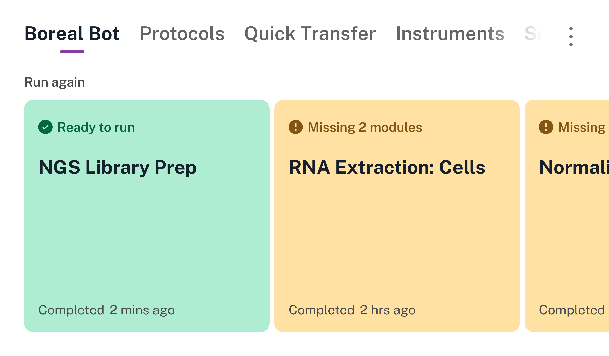
</figure>

The dashboard is the main screen for the robot, accessible by tapping the robot's name in the top left corner of the touchscreen.

The dashboard provides quick access to recently run protocols. It displays protocols as large cards in a horizontal carousel. Green cards show protocols that are ready to run. Orange cards show protocols that require hardware setup or have a deck configuration conflict. The dashboard can display up to eight previously run protocols.

From the dashboard you can also perform actions that apply to the robot as a whole, rather than a particular protocol. Access these actions by tapping the three-dot (⋮) menu:

- **Home gantry:** Move the gantry to its home position at the back right of the working area.

- **Restart robot:** Perform a soft restart of the robot.

- **Deck configuration:** Manage deck fixture locations.

- **Lights on/off:** Toggle the LED lights that illuminate the working area.

The top navigation on the dashboard provides access to the other main screens: All Protocols, Quick Transfer, Instruments, and Settings. Next we'll look at how to manage protocols on the All Protocols screen

### Protocol management

The All Protocols screen is an interactive list of all protocols that you've stored on Opentrons Flex. (Sending a protocol to Flex requires the Opentrons App. See the [Transferring Protocols to Flex section][transferring-protocols-to-flex] below for details on that process.)

There are two sections of the All Protocols screen:

- Pinned protocols: Large cards in a horizontal carousel at the top of the screen.

- Other protocols: A vertical list at the bottom of the screen.

<figure class="screenshot" markdown>

</figure>

Regardless of which section a protocol is in, its card or list entry includes information about when it was last run and when it was added to this robot.

!!! note
    Flex can store a maximum of 20 unique protocols. It automatically deletes older protocols to maintain this limit. Use the Opentrons App if you need to manage a larger number of protocols.

#### Pin a protocol

Long press on a protocol and tap **Pin protocol** to move it to the pinned protocols section. Conversely, long press a pinned protocol and tap **Unpin protocol** to remove it from the section.

<figure class="screenshot" markdown>
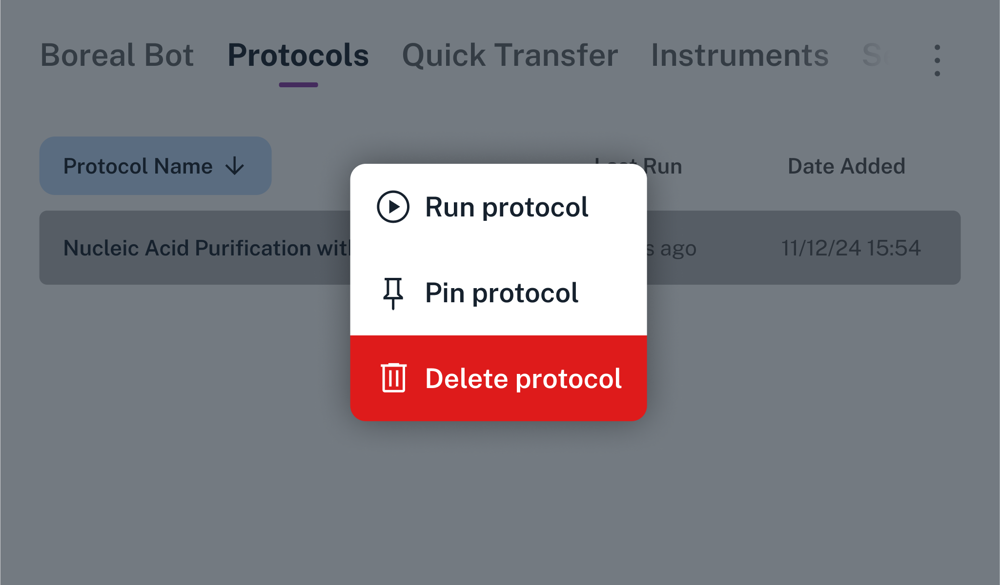
</figure>

You can pin up to eight protocols. When you hit the maximum, you'll need to unpin a protocol before pinning another one.

#### Sort protocols

Tap any of the three headers — Protocol Name, Last Run, or Date Added — to sort the All Protocols section.

Tap once to sort protocols in ascending order (A to Z for names, oldest to newest for dates). Tap again to reverse the sort order. The current sort criterion is highlighted in blue and the current sort order is indicated by an upward or downward arrow.

#### Delete a protocol

Long press on a protocol and tap **Delete protocol** to delete it directly from the All Protocols screen. Flex will prompt you for confirmation that you want to delete the protocol file and all of its run history.

<figure class="screenshot" markdown>
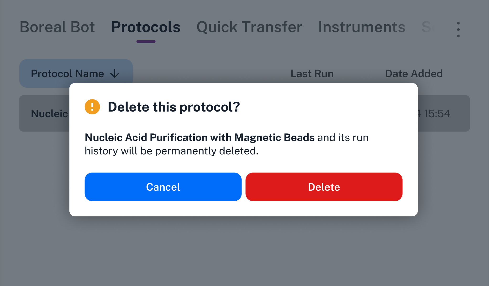
</figure>

!!! warning
    Run history is *not recoverable* after you delete a protocol on Flex. The protocol file itself is also not recoverable, although you may be able to resend the protocol to Flex if you've kept a copy of it on a computer.

### Protocol details

Tap on any protocol to view its detail screen. This screen displays all of the types of information included in the protocol file, as well as common protocol actions. An indicator at the top left of the screen shows whether the protocol is ready to run, or whether you need to perform additional setup.

#### Summary tab

<figure class="screenshot" markdown>
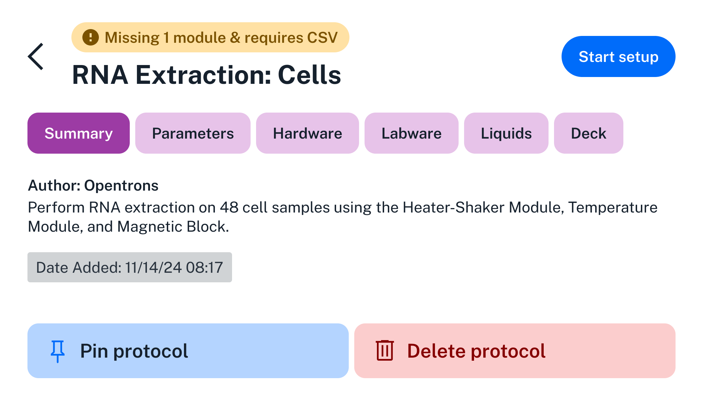
</figure>

The Summary tab shows:

- **Protocol name:** For protocols with very long names, tap to toggle between the full and truncated name.

- **Author:** Who created the protocol.

- **Description:** For protocols with long descriptions, scroll to read the full text.

- **Date added:** Timestamp when Flex received the protocol file.

#### Parameters tab

<figure class="screenshot" markdown>
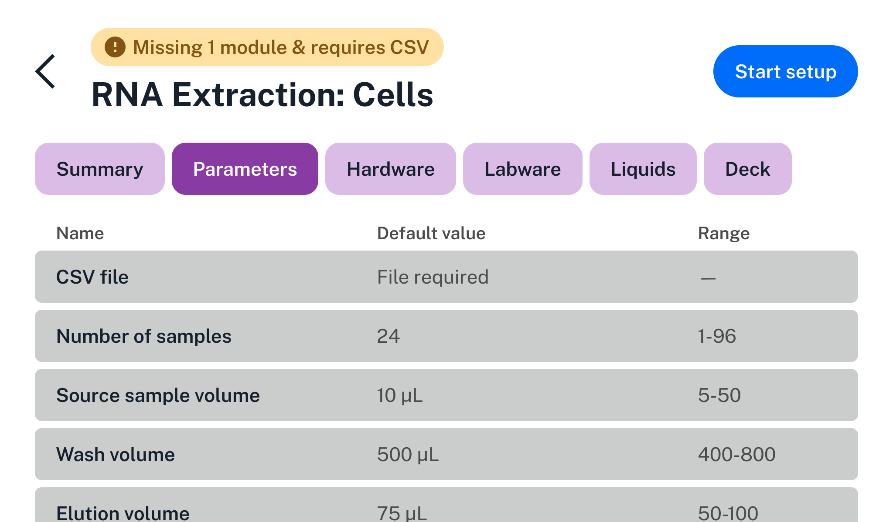
</figure>

The Parameters tab lists all of the runtime parameters that you can configure from the touchscreen while setting up the protocol. The Default Value column shows the value that the protocol will use if you don't change it. The Range column shows the maximum and minimum, list of choices, or number of choices depending on the parameter type.

!!! note
    Runtime parameters are only available in Python protocols that define their names, descriptions, and possible values. See [Runtime Parameters](https://docs.opentrons.com/v2/runtime_parameters.html) in the Python API documentation for information on defining parameters and using their values. JSON protocols do not currently support this feature.

#### Hardware tab

<figure class="screenshot" markdown>
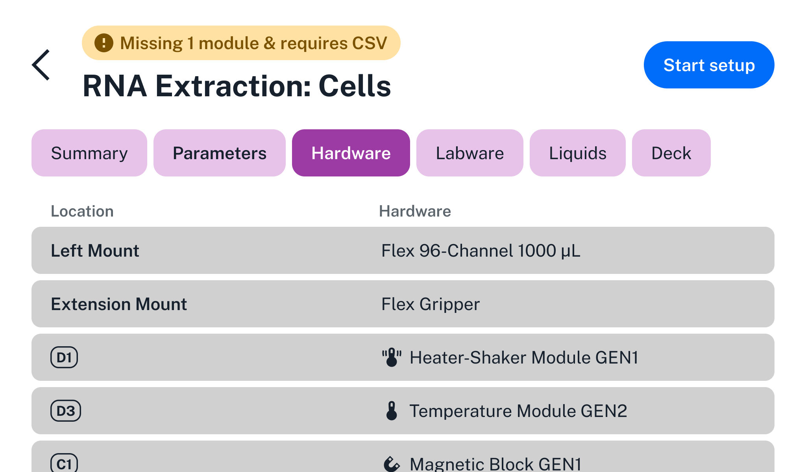
</figure>

The Hardware tab is a list of all instruments, modules, and fixtures used in the protocol. The Location column tells you where the hardware needs to be attached to Flex. For instruments, location can be the left pipette mount, right pipette mount, both mounts (for the 96-channel pipette), or the extension mount (for the gripper). For modules and fixtures, the location is the deck slot or slots that the item occupies.

#### Labware tab

<figure class="screenshot" markdown>
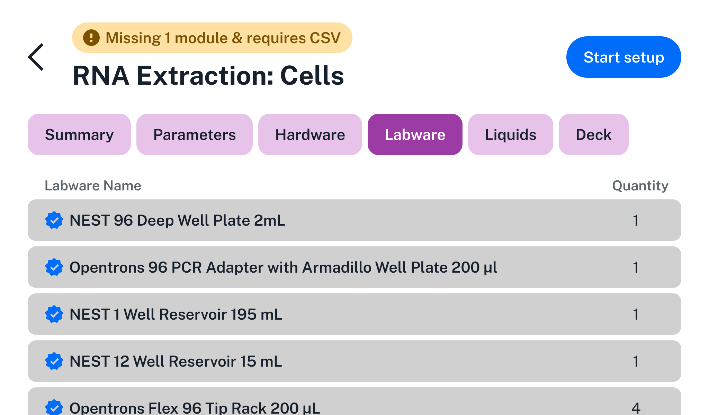
</figure>

The Labware tab is a list of all labware used in the protocol. It shows the names and quantities of labware. It does not show their locations, since labware can be moved, added, or removed from the deck during the course of a protocol. Use the Deck tab to see initial positions of labware.

Opentrons-verified labware is indicated with a blue checkmark.

#### Liquids tab

<figure class="screenshot" markdown>
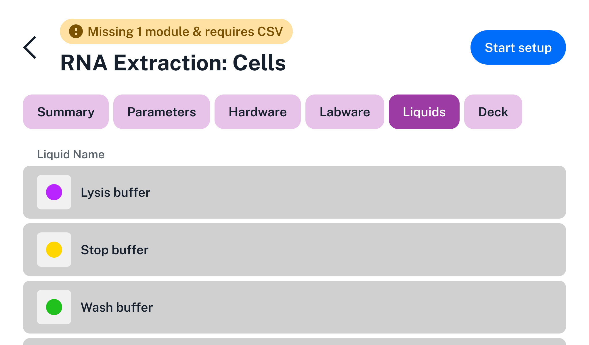
</figure>

The Liquids tab lists all liquids to be loaded into labware at the start of the protocol. It shows the color code of the liquid (as assigned by the protocol author), the liquid name, and the total volume of liquid used across all wells. Use the Deck tab to see well-by-well initial positions of liquids.

#### Deck tab

<figure class="screenshot" markdown>
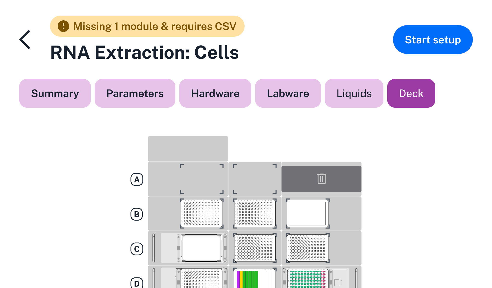
</figure>

The Deck tab shows a visual map of the deck at the beginning of the protocol.

For an interactive view that provides more information about the contents of each deck slot, tap **Start setup**, then tap **Labware**, and then tap **Map View**. There you can tap on any labware to see its type and custom label (if set by the protocol).

#### Action buttons

On any of the protocol detail tabs, three action buttons are available:

- **Start setup** (top right)

- **Pin protocol** (bottom left)

- **Delete protocol** (bottom right)

Next we'll look at the steps for setting up and performing a protocol run.

### Run setup

When you start setup for a protocol, you'll see the "Prepare to run" screen, which summarizes all of the requirements for the protocol.

<figure class="screenshot" markdown>
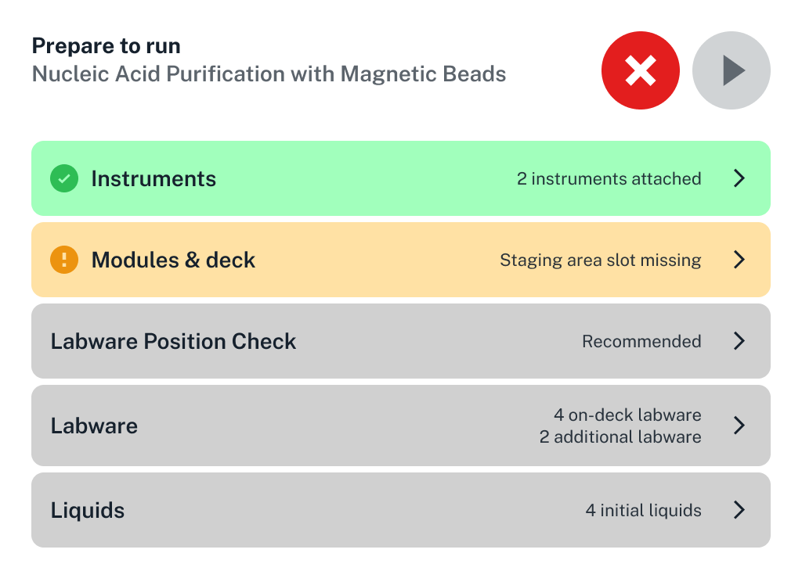
<figcaption>All sections of the "Prepare to run" screen. On the touchscreen, scroll the list to see all sections.</figcaption>
</figure>

If hardware is not connected or calibrated, you will see a warning icon (exclamation point) and the row will be highlighted in orange. If all requirements are met, you will see a checkmark and the row will be highlighted in green.

Tap any row with a right arrow to show more information for that category. (The one exception is tapping Labware Position Check, which begins that process. See the Labware Position Check section below for more details.)

| Category   | Description |
|------------|------------|
| Instruments    | See if all instruments are attached to the correct mounts and calibrated.<br />Tap <b>Attach</b> or <b>Calibrate</b> to set up any that aren't. |
| Parameters     | See the names, descriptions, and default values of runtime parameters for the protocol.<br />Tap a parameter to edit its value. See the Runtime Parameters section below for more details. |
| Hardware       | See the locations and connection statuses of hardware on the deck.<br><ul><li>Tap :fontawesome-solid-circle-info: <b>Setup Instructions</b> to get detailed instructions.</li><li>Tap <b>Map View</b> to switch to a visual layout of hardware positions.</li></ul> |
| Labware        | See the locations of labware. Each labware lists its initial deck location, and icons indicate labware that are on top of modules.<br />Tap <b>Map View</b> to switch to a visual layout of labware positions. |
| Liquids        | See the types and total volumes of liquids.<br />Tap any liquid name to expand a list of well-by-well volumes. In turn, tap an individual volume row to show a visual layout of its location within labware. |

On any category screen, return to the "Prepare to run" screen by tapping the back arrow in the top left.

### Runtime parameters

Runtime parameters customize protocols during setup, letting you adjust pipette types, mount positions, aspirate/dispense volumes, labware types, and more—all without writing a new protocol.

<figure class="screenshot" markdown>
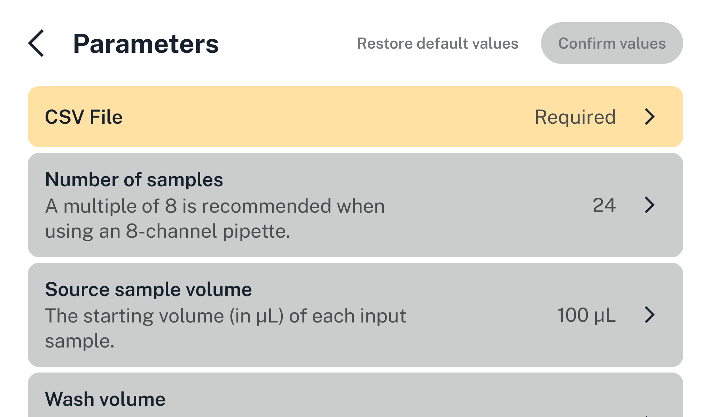
</figure>

Tap a configurable parameter to modify it. Different types of touchscreen controls are used for different parameter types.

- **Boolean:** Tap the parameter to toggle its value between On and Off.

- **String and numeric choices:** Choose from a menu of possible values.

- **Numeric range:** Use the onscreen keypad to enter a value within the acceptable range.

- **CSV:** Choose from a file picker.

#### Using CSV data

Flex looks for CSV files in the root directory of an attached USB drive or files that were used in a previous run of the same protocol. You can connect a USB drive to any open USB port on Flex, but we recommend using the port below the touchscreen. As shown here, this protocol has no CSV files saved on this robot, but there are several on an attached USB drive. Tap the desired CSV file to use its data into your protocol.

<figure class="screenshot" markdown>
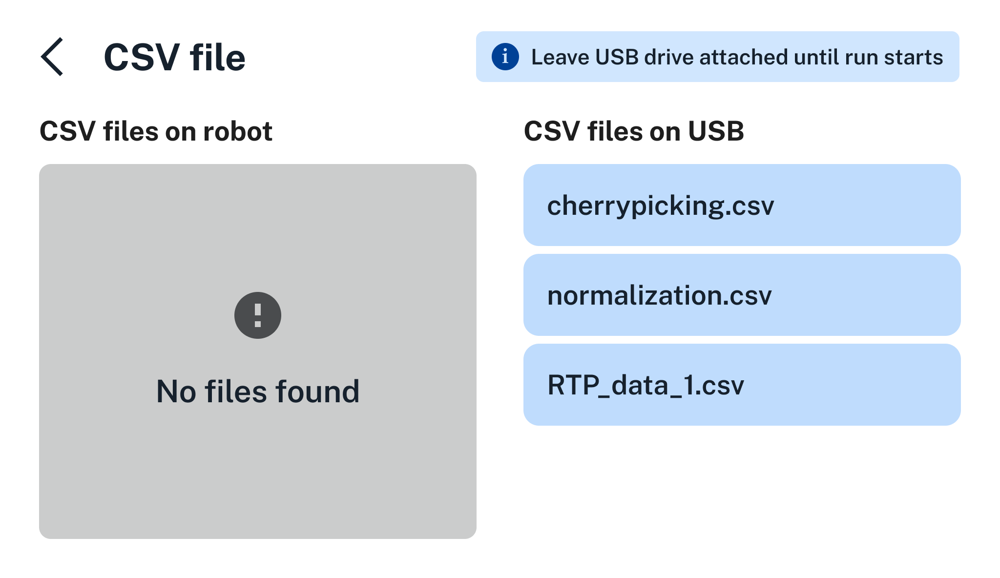
</figure>

When working with CSV files, keep in mind that:

- The touchscreen truncates file names that are longer than 52 characters. You can still upload files with names that exceed the limit.

- The USB drive must use a file system that's readable by the robot. FAT32, NTFS, and ext4 file systems are supported. The HFS+ and APFS file systems are not.

- You must leave the USB drive attached until you start the run, or Flex won't be able to access the CSV data that you chose.

#### Confirming runtime parameters

Parameter and CSV file selections are still editable until you tap **Confirm values**. Modifications become read-only after that. To make further adjustments, you'll have to cancel the protocol run and start over.

### Labware offsets and position checking

#### Labware offsets
Labware offsets are fine-tuned positional coordinates that help your robot align its pipette relative to a specific piece of labware. The release of robot software version 8.4 introduced significant improvements to the labware offset and position checking system.

| Feature | Description |
|----|----|
| Protocol independence | Offsets are positional adjustments associated with a piece of labware, rather than with a specific protocol, and saved on the robot. This allows for greater flexibility and reusability of offset data in any protocol. |
| Default offsets | Default offsets are manually created via Labware Position Check and then automatically applied to each instance of that labware, regardless of deck slot or protocol. This "measure once, set everywhere" feature means you don't have to check offsets for duplicate labware, which helps reduce protocol setup time and effort. |
| Applied offsets | Applied offsets override defaults for a specific piece of labware in a specific deck slot. You can use an applied offset with different protocols, but the labware and deck slot must be the same as the original applied offset. |
| Hardcoded offsets | A hardcoded offset is an offset type typically created by advanced users via the Opentrons Python API. Because these offsets are defined in code (`set_offset`), you cannot change them from the touchscreen or Opentrons App. You’ll need to modify the Python protocol file to change a hardcoded offset. See [Setting Labware Offsets](https://docs.opentrons.com/v2/new_advanced_running.html?highlight=offset#setting-labware-offsets). |

#### Offsets at-a-glance

This illustration shows how the different types of offsets appear as you're configuring a protocol on the Flex touchscreen.


#### Labware Position Check

Labware Position Check lets you align a pipette relative to a piece of labware (e.g. a well plate), which helps ensure accurate and reproducible pipetting results.

You must ensure that each piece of labware used in your protocol has a default or applied offset associated with it. As shown in the touchscreen example below, you cannot run a protocol (the blue run button is inactive) if it uses labware that is missing offset data.

<figure class="screenshot" markdown>
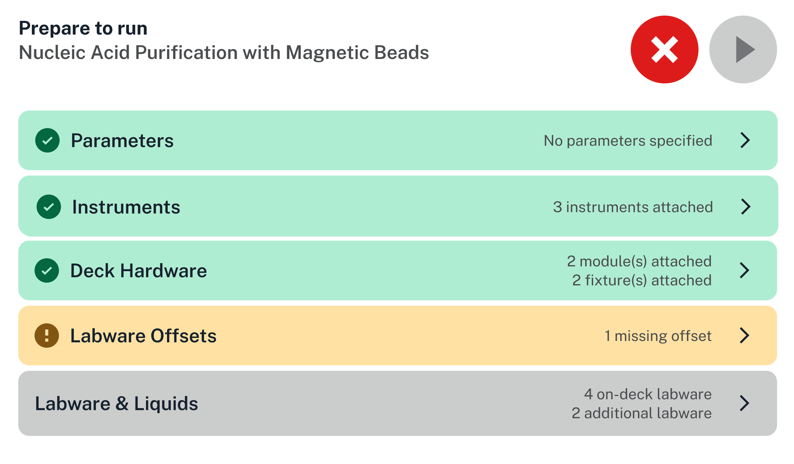
</figure>

Tap **Labware Offsets** to see which labware is missing an offset and to start Labware Position Check. Refer to the touchscreen or the Opentrons App when running Labware Position Check. It will provide instructions and animations to guide you through this process.

#### Jog controls

During Labware Position Check, you’ll use the jog controls to align the pipette with the selected labware.

<figure class="screenshot" markdown>
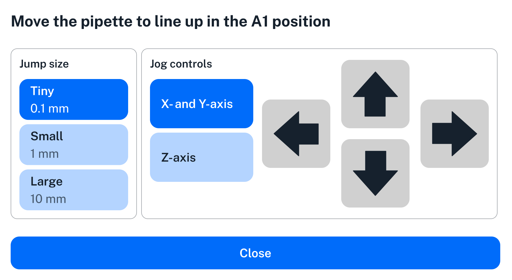
<figcaption>Jog controls used in Labware Position Check.</figcaption>
</figure>

To use the jog controls:

1. Select a jog control option to set the pipette's axis of movement.
2. Select a jump size to set how far the pipette moves (in mm). You can move the pipette in increments of 0.1, 1, or 10 mm.  Use larger jump sizes to move the pipette quickly, but beware of crashing the pipette into labware.
3. Tap an arrow to move the pipette for your selected direction and distance.
4. Tap **Close** when, in your best judgement, the pipette is optimally aligned with the selected labware.
5. Continue to follow prompts and instructions on the touchscreen to complete the Labware Position Check process.

!!! note
    Labware Position Check corrects for minor, millimeter-scale pipette and labware alignment variations. If you find yourself using it to compensate for large, multi-centimeter offsets, this may suggest an alignment problem related to labware manufacturing defects or incorrect labware definitions. Contact Opentrons Support if you encounter persistent, significant instrument or labware misalignments.

### Run progress

Once everything is set up, begin your run by tapping the play button :material-play-circle: on the "Prepare to run" screen. Flex will begin the protocol and you'll see the Running screen.

The Running screen gives you quick access to stop and play/pause controls, in case you need to intervene in your protocol. On the default view, these controls are large and only the current step of the protocol is shown.

<figure class="screenshot" markdown>
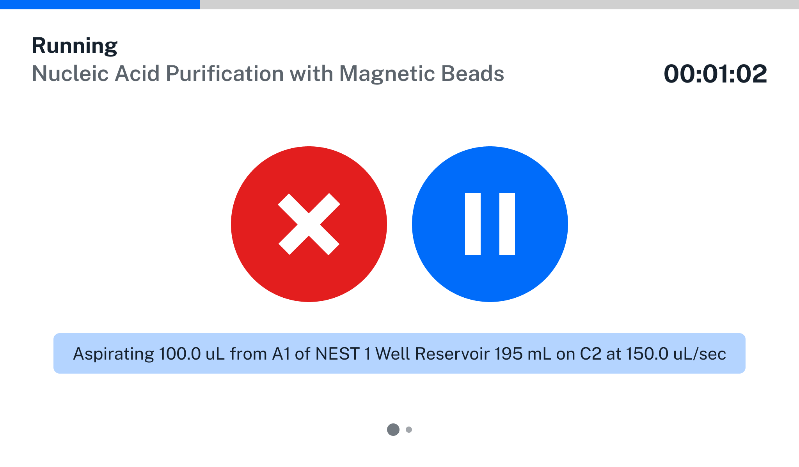
</figure>

Swipe from right to left to see an alternative view with smaller controls and more protocol steps. The current step will always be at the top of the list.

<figure class="screenshot" markdown>
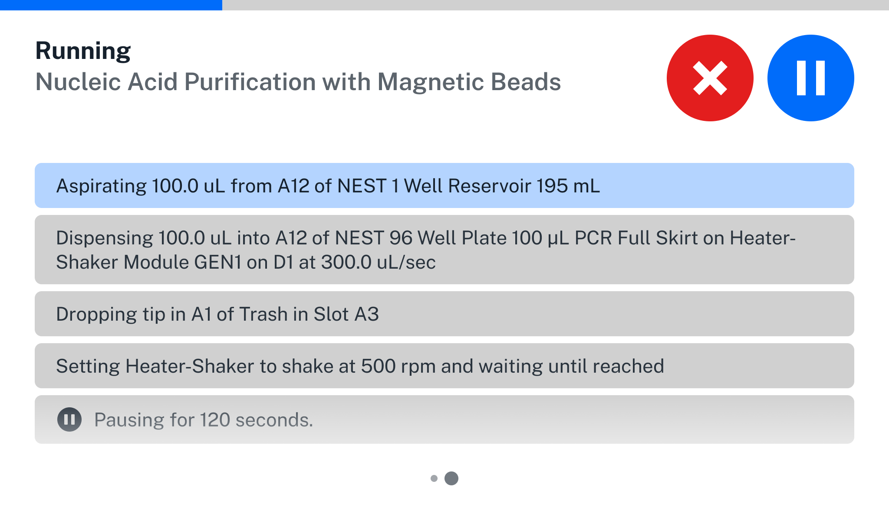
</figure>

Starting in robot software version 8.0.0, if something unexpected happens during the protocol run, Flex will pause and give you the option to enter error recovery mode. In earlier versions, Flex cancels the run when an error occurs.

### Error recovery

Flex error recovery allows you to continue a protocol run even when
problems arise.

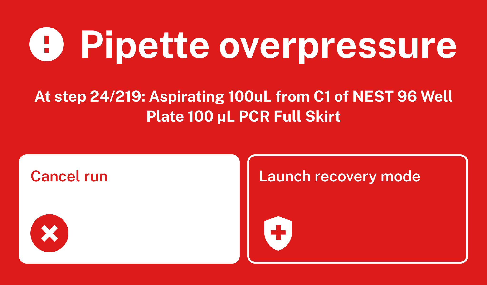

Tap **Launch recovery mode** to see options for the particular type of error that has occurred. Instead of just canceling the protocol and forcing a restart, this feature gives you a chance to correct problems like replacing a damaged tip or filling an empty well. Even if you have to cancel a protocol run, error recovery will let you preserve liquids in the pipette and control where tips are dropped. After all, an occasional mistake or problem shouldn't end a procedure with the loss of expensive reagents or valuable samples.

Flex provides a protocol recovery path for the following error conditions.

<table>
  <thead>
    <tr>
      <th>Error type</th>
      <th style="width: 30%;">Description</th>
      <th>Recovery options</th>
    </tr>
  </thead>
  <tbody>
    <tr>
      <td>No liquid detected</td>
      <td>Occurs when a pipette encounters an empty well and expects a liquid to be present.</td>
      <td>
        <ul>
          <li>Manually fill the empty well and retry with the same tips.</li>
          <li>Manually fill the empty well and retry with new tips.</li>
          <li>Manually fill the empty well and skip to the next step.</li>
          <li>Ignore the error and skip to the next step.</li>
          <li>Cancel protocol run.</li>
        </ul>
      </td>
    </tr>
    <tr>
      <td>Pipette overpressure</td>
      <td>Occurs when pressure inside the pipette exceeds the normal range while aspirating or dispensing liquid. Caused by clogged, bent, or sealed tips.</td>
      <td>For aspiration:<br>
        <ul>
            <li>Retry with new tips.</li>
            <li>Cancel protocol run.</li>
        </ul>
        For dispense:
        <ul>
            <li>Skip to the next step with the same tips.</li>
            <li>Skip to the next step with new tips.</li>
            <li>Cancel protocol run.</li>
        </ul>
      </td>
    </tr>
    <tr>
      <td>General errors</td>
      <td>A catch-all category for other errors.</td>
      <td>
        <ul>
          <li>Retry step.</li>
          <li>Skip to next step.</li>
          <li>Cancel protocol run.</li>
        </ul>
      </td>
    </tr> </tbody>
</table>

!!! note
    The tip presence sensor is disabled for [partial tip pickup](system-description.md#partial-tip-pickup) of 1, 2, or 3 tips. In these configurations, Flex cannot detect tip pickup errors and will not present error recovery options if the pipette fails to pick up the tips. The run will continue unless and until another error occurs.

You can view the status of a finished protocol and review any resolved errors on the run completion screen.

### Run completion

At the end of your protocol, a large "Run completed" or "Run failed" message will take over the touchscreen. These color-coded messages match the LED status bar at the top of the robot and are visible at a distance.

<figure class="side-by-side" markdown>
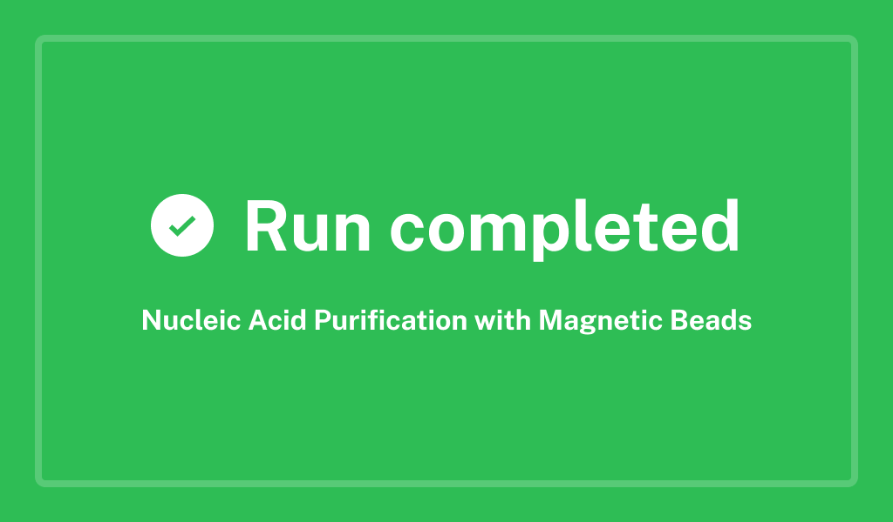
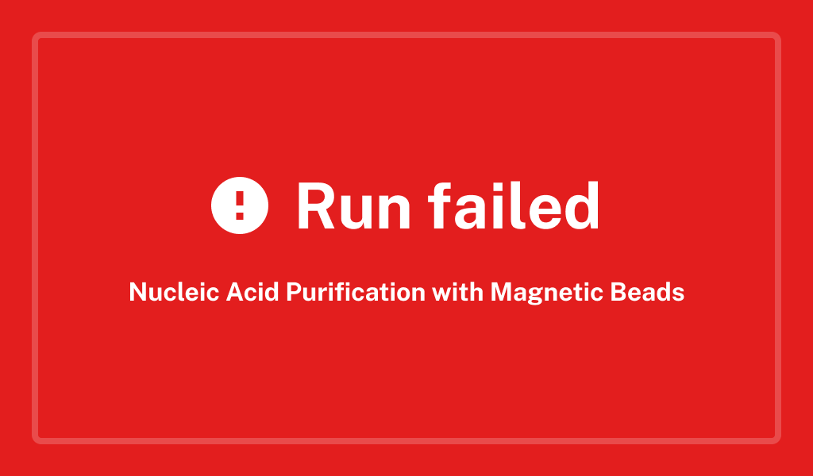
</figure>

Tap anywhere on either of these screens to go to the run summary screen, which shows information about the protocol run time and next steps. The summary screen always gives you the options to **Return to dashboard** or have the protocol **Run again**. If the run failed, you can also **View error details** and begin the troubleshooting process.

<figure class="screenshot side-by-side" markdown>
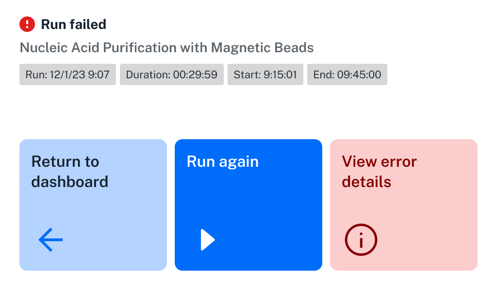
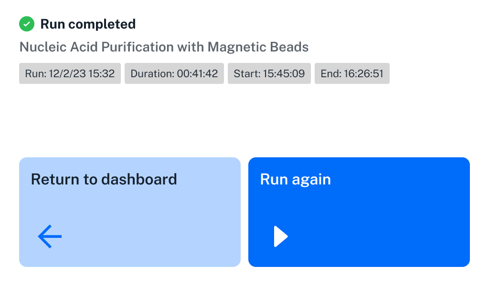
</figure>

### Quick transfer

Quick transfer is a touchscreen-only feature that lets you create, save, and run simple procedures that move liquid from a source to a destination, all without creating a protocol or writing code. Available starting in robot software version 8.0.0, this feature is ideal for preparing labware you need to use in other, more complex procedures. For example, you can use quick transfers to:

- Provision well plates with a reagent, buffer, or other liquid.

- Consolidate liquid from many wells to one well.

- Distribute liquid from a single well to multiple wells.

- Move culture to growth media or to prepare it for long-term storage.

There are two sections of the quick transfer screen:

- **Pinned transfers**: Large cards on a horizontal carousel. You can pin 8 cards, maximum.

- **Saved transfers**: A vertical list at the bottom of the screen. Flex can save a maximum of 20 quick transfers. You have to delete older quick transfers to maintain this limit.

<figure class="screenshot" markdown>
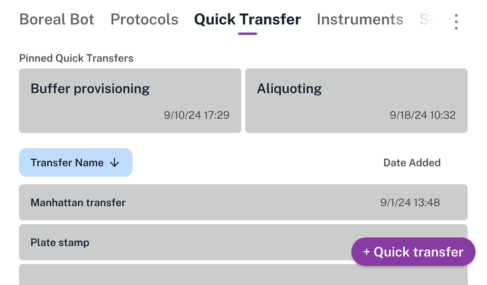
</figure>

The remainder of this section goes through quick transfer features in detail.

#### Creating a quick transfer

From the Quick Transfer tab on the touchscreen, tap **+ Quick transfer.** This starts a guided setup. Follow the instructions on the screen. You can run, save, pin, or delete the transfer when finished.

#### Deck slots and hardware requirements

Quick transfers require a Flex pipette, a tip rack in slot B2, source labware in slot C2, and destination labware in slot D2. For tip disposal, quick transfer relies on the robot's [deck configuration][deck-configuration] to determine where the trash bin or waste chute is on the deck. It shows the trash bin in slot A3 if no trash container is configured. You cannot use the gripper, modules, and custom labware in a quick transfer.

<figure class="screenshot" markdown>
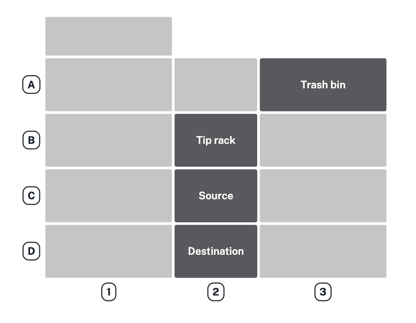
</figure>

If everything is set up correctly, you'll move on to selecting pipettes and tips.

#### Pipettes and tips

Creating a quick transfer involves selecting a pipette and appropriate tips. Quick transfer can use any 1-, 8-, or 96-channel pipette that's attached to the robot. When selecting a pipette tip, try to match the tip to a pipette of the same capacity or larger. For best performance, use the smallest tips that can hold the amount of liquid you need to aspirate.

#### Labware

Quick transfer works with most of the labware in the [Opentrons Labware Library](https://labware.opentrons.com/). It omits labware from the source and destination menus when those items are incompatible with the selected pipette. For example, only the 1-channel pipette can aspirate or dispense from tube racks. If you select a multi-channel pipette, quick transfer won't let you choose a tube rack as a source or destination.

#### Well selection

Well selection depends upon the pipette and labware you're using. When using a 1-or 8-channel pipette and a 96-well plate, you select individual wells by tapping or tapping and dragging on the touchscreen. Or, when using multi-channel pipettes and high-density well plates, quick transfer provides button controls that let you select columns and well groups instead of individual wells.

For example, these controls let you select wells and columns with an 8-channel pipette and a 384-well plate.

<figure class="screenshot" markdown>
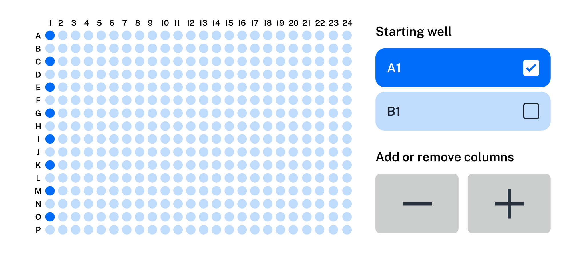
</figure>

And these controls let you select wells and columns with a 96-channel pipette and 384-well plate.

<figure class="screenshot" markdown>
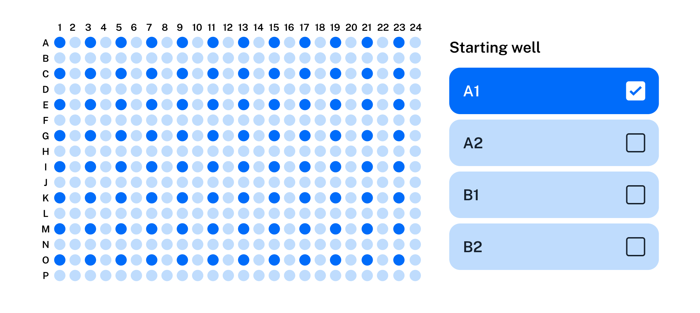
</figure>

Quick transfer checks your pipette, source, and destination choices to prevent incompatible combinations. If you make a mistake while selecting wells, or want to start over, tap **Reset** to clear your selections.

After making instrument and well selections, you'll set the transfer volume and give your new quick transfer a name.

#### Transfer volumes and name

You'll set the amount of liquid to transfer (in μL) after specifying the source and destination wells. You'll also have a chance to name the transfer after setting the transfer volume. A good, concise name helps you find a quick transfer in a list of saved or pinned transfers and indicates what it does.

#### Advanced settings

These are available after you name a quick transfer and before you save it. If some settings are familiar to you that's because they're the same as those offered in Protocol Designer. Advanced settings are optional; select any that you need or just save or run the transfer.

| Setting {style="width: 25%;"} | Description |
|----------|-------------|
| Aspirate and dispense flow rates | Set how quickly the pipette will aspirate or dispense, in μL/s.|
| Pipette path           | Choose how the pipette moves between wells. Options include:<br><ul><li>single transfer (1 well to 1 well)</li><li>multi-aspirate (many wells to 1 well)</li><li>multi-dispense (1 well to many wells)</li></ul> |
| Tip position           | Change where in the well the pipette aspirates or dispenses. By default, the robot positions the tip 1 mm from the bottom center of a well. |
| Pre-wet tip            | Pre-wet the pipette tip by aspirating and dispensing ⅔ of the tip's maximum volume. |
| Mix                    | Aspirate and dispense repeatedly from a single location. Used to mix the contents of a well together. |
| Delay                  | Adds a timed delay (in seconds) before an aspirate or dispense action. |
| Touch tip              | Move the pipette so the tip touches the wall of a well. Used to help knock off any droplets that might cling to the pipette's tip. Not supported on all labware. |
| Air gap                | When used during aspiration, draw in extra air after the liquid. When used during dispense, draw in extra air before moving to the trash container to dispose of the tip. Used to prevent liquid from leaking out of the pipette tip. |
| Blowout                | Blow an extra amount of air through the tip to clear it. The pipette can blow out into the trash bin, source well, or destination well. |
| Change tip             | Replace the tip at the start of the transfer, before every aspirate, or per source well. |

#### Managing transfers

Click **Create Transfer** when you're satisfied with your transfer settings. After creating a quick transfer, you can run, save, or delete it.

- Flex saves a maximum of 20 transfers in a vertical list under the Quick Transfer tab.

- Long press a saved transfer to run it, pin it, or delete it. Flex pins a maximum of 8 quick transfers.

- Long press a pinned transfer to run it, un-pin it (returns it to the saved list), or delete it.

<figure class="screenshot" markdown>
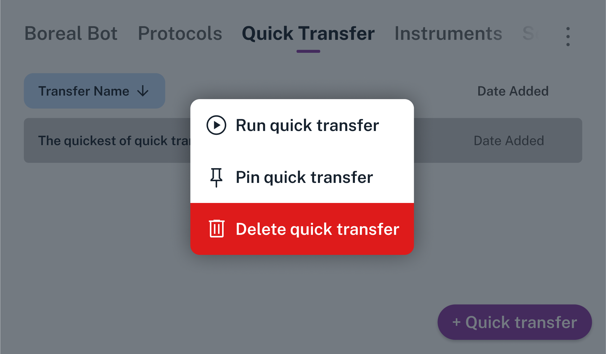
</figure>

### Instrument management

The Instruments screen is an interactive list of all instruments that you've connected to your Flex. The list is organized by mount: left pipette mount, right pipette mount, and extension mount.

<figure class="screenshot" markdown>
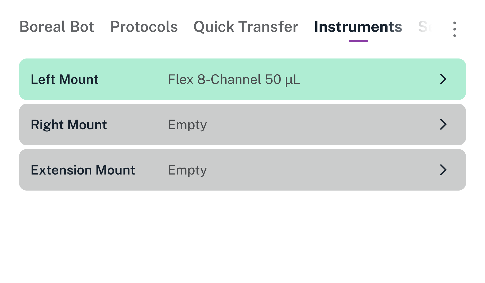
</figure>

For an empty mount, tap anywhere on the row to begin the process of attaching an instrument.

For an occupied mount, the row lists its current contents. Tap anywhere on the row to get more details about the instrument, detach it, or recalibrate it.

<figure class="screenshot" markdown>
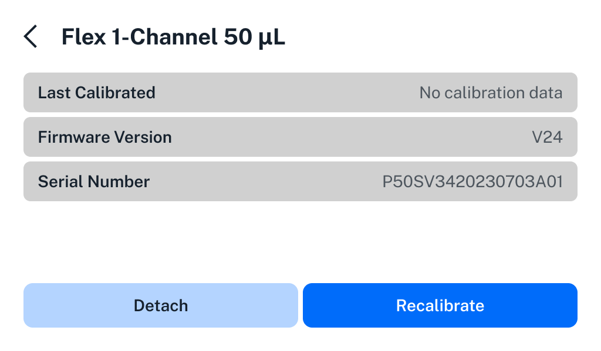
</figure>

- **Last Calibrated:** The date and time of the instrument's most recent calibration.

- **Firmware Version:** The version of the firmware running on the instrument. Flex automatically updates instrument firmware whenever the instrument is attached, depending on the robot system version.

- **Serial Number:** A unique identifier for the instrument. If you are having problems with an instrument, Opentrons Support will want to know the serial number.

#### Attach an instrument

Choose an empty mount and then choose the type of instrument to install. Then connect and secure the instrument using its captive mounting screws. For more details, follow the instructions on the touchscreen or see the [Instrument Installation and Calibration section][instrument-installation-and-calibration] of the Installation and Relocation chapter.

Exact installation steps depend on the instrument you choose and the current setup of your robot. For example, if you have an 8-channel pipette already attached and you attempt to install the 96-channel pipette on the other mount, the touchscreen will give you instructions for detaching the 8-channel so the 96-channel can occupy both mounts.

#### Detach an instrument

Choose an attached instrument that you want to detach. Then loosen the instrument's captive mounting screws and remove it from the gantry. For more details, follow the instructions on the touchscreen. Exact removal steps depend on the instrument you choose and the current setup of your robot.

#### Recalibrate an instrument

Choose an attached instrument that you want to recalibrate. Then connect the instrument's calibration probe or pin and begin the automated calibration process. For more details, follow the instructions on the touchscreen or see the [Instrument Installation and Calibration section][instrument-installation-and-calibration] of the Installation and Relocation chapter.

!!! note
    The new calibration data will overwrite any previous calibration data for that instrument.

### Robot settings

The Settings screen lists all the ways you can customize the behavior of your Flex.

<figure class="screenshot" markdown>
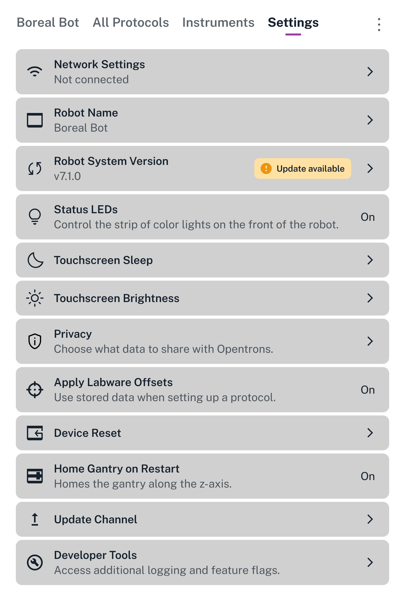
<figcaption>All settings available on Flex. On the touchscreen, scroll the list to see all the settings.</figcaption>
</figure>

Although they are presented in a single list, they roughly break down into four categories.

#### Setup

All of these settings are covered when you [first set up your Flex][first-run]. However, you can change them at any time.

- **Network Settings:** View the status of or set up a Wi-Fi, Ethernet, or USB connection. Multiple connections can be active simultaneously.

- **Robot Name:** Change the name of your Flex. The robot name appears on the touchscreen dashboard and in the Opentrons App.

- **Robot System Version:** See the current version of the robot software or check for updates. If Flex has already automatically checked for updates and found one, this item will have an "Update available" badge in the settings list.

#### Display

Control how Flex displays information to meet the needs of your lab and users.

- **Status Light:** Turn on or off the strip of color lights on the front of the robot.

- **Touchscreen Sleep:** Set how long the touchscreen should remain on when idle. The default is for the display to never go to sleep. When the screen is asleep, tap it once to wake it.

- **Touchscreen Brightness:** Set the screen's brightness to one of six levels by tapping **−** or **+**.

#### Privacy

Choose what data you want Flex to share with Opentrons. This information is always anonymized and we only use it to improve our products.

Flex records what it's doing in several log files that are stored on the robot. These logs are grouped into two categories for privacy opt-in purposes:

- **Robot Logs:** Data about robot server activities, executed API commands, and interactions with attached modules.

- **Display Usage:** Data about how the touchscreen draws its graphics.

If you opt out of automatic data sharing, you can still [download your Flex log files](https://support.opentrons.com/s/article/How-to-download-the-logs-on-Opentrons-Flex) for your own use or to manually send them to Opentrons Support for troubleshooting.

!!! note
    There are separate privacy controls in the Opentrons App. Turning sharing on or off from the touchscreen only affects data collected and sent by the robot. Your laptop or desktop computer will still automatically share data if this feature is enabled in the Opentrons App.

#### Advanced

You shouldn't need these settings for everyday operation, but they may be useful for troubleshooting or testing pre-release features.

- **Apply Labware Offsets:** Choose whether to use saved offset data from Labware Position Check in subsequent protocol runs. This setting is on by default. Opentrons recommends running Labware Position Check before every run, and applying previous labware offsets at the beginning of Labware Position Check can make the process quicker.

- **Device Reset:** Batch delete certain types of information from the robot, such as calibrations, run history, or protocols.

- **Home Gantry on Restart:** By default, the gantry moves to its home position any time you turn on Flex. Only disable this behavior if you have a reason that the gantry must remain stationary after powering on.

- **Update Channel:** Choose whether to receive stable or beta software updates.

- **Developer Tools:** Enable additional tools and features designed for developers. Not recommended unless instructed by Opentrons Support.

### Deck configuration

Deck configuration tells your Flex what fixtures are attached to the deck, in what locations. You need to inform the robot about installed fixtures because they're unpowered attachments. They do not contain electronic or mechanical components that communicate with the robot. Flex won't know what's attached and where it is until you configure deck fixtures via the touchscreen or Opentrons App.

Mapping fixtures to deck slots allows the robot to find discrepancies between the hardware used in a protocol and what it thinks is attached to the deck. Flex detects potential conflicts between the hardware setup of a protocol and the robot's current deck configuration (see [Resolving Deck Conflicts][resolving-deck-conflicts] below).

Running protocols with proper deck configuration helps avoid collisions
among the various components installed on the robot.

For more information on which fixtures you can configure in which slots,
see the [Deck Fixtures section][deck-fixtures] in the System Description chapter.

#### Adding and removing fixtures

To add deck fixtures via the touchscreen:

1.  Tap the three-dot (⋮) menu and then tap **Deck configuration**. This opens the interactive deck map.

2.  Tap a blue deck slot that you want to configure. This opens the fixture menu.

3.  From the fixture menu, select the item you want to add.

4.  Tap a fixture to add it to the deck.

5.  Tap **Confirm**.

Click the :octicons-x-circle-fill-16: on a fixture on the deck map to remove it from the deck configuration.

<figure class="screenshot" markdown>
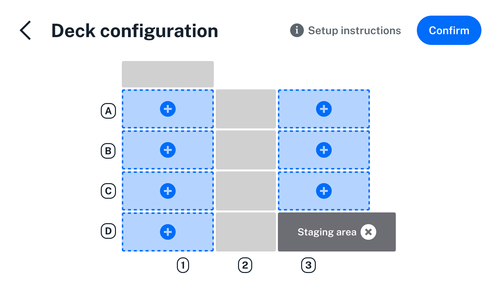
<figcaption>A Flex configured with a staging area slot in D3, and no other fixtures.</figcaption>
</figure>

You can also configure the deck in the Opentrons App, on the robot details page for your Flex.

#### Resolving deck conflicts

Flex displays orange warning prompts when setting up a protocol run that conflicts with the current deck configuration. To resolve the conflict:

1.  Tap the prompt for more information on what the protocol specifies, compared to the current deck configuration.

2.  Inspect the hardware configuration of your Flex and attach, move, or remove the deck fixtures or modules as needed.

3.  Tap **Update deck** to clear the conflict warning.

Alternatively, you can modify your protocol to fit your current deck configuration, and then resend it to your Flex.

Your Flex won't run a protocol until you resolve all deck conflict warnings.

<figure class="screenshot" markdown>
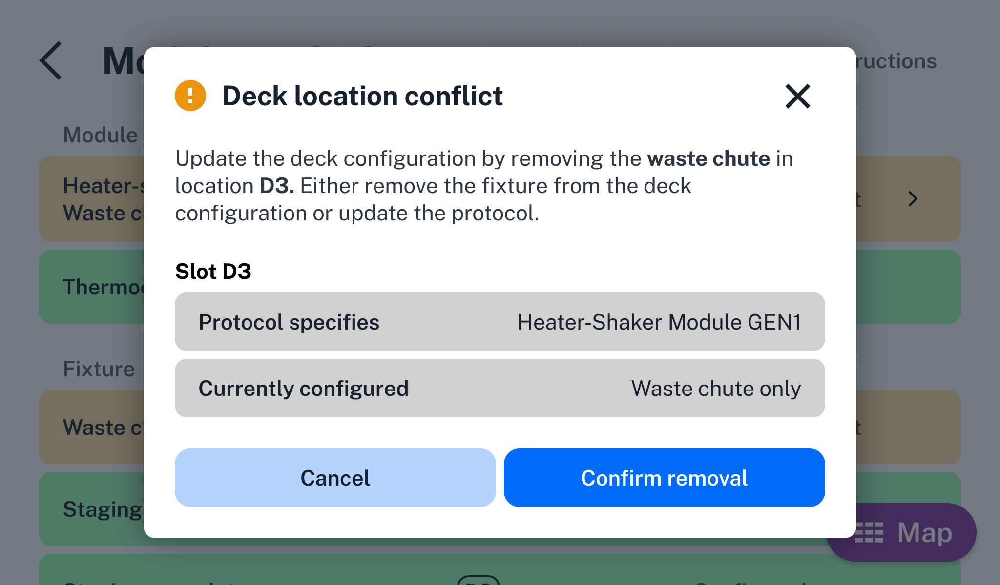
<figcaption>This protocol requires a Heater-Shaker in slot D3, but the deck
configuration indicates that the waste chute is in that location.</figcaption>
</figure>

#### Fixture statuses

The following table defines the statuses the robot generates when it
compares its configured deck fixtures to your protocol.

| Status              | Description |
|---------------------|-------------|
| **Configured**          | A fixture is specified in the correct location. Always verify that the fixture is physically attached before running the protocol. |
| **Location conflict**   | A deck slot is configured with a fixture different from the fixture specified in your protocol (e.g., the protocol specifies a waste chute, but deck slot D3 is occupied by a staging area slot). |
| **Not configured**      | A fixture required by your protocol is missing from the deck configuration (e.g., the protocol requires a staging area slot but that fixture is not configured in the specified location). |

The following table defines the deck configuration statuses the robot generates when it compares its attached instruments and attached modules to its deck configuration and your protocol.

| Status             | Description |
|--------------------|-------------|
| **Attach pipette**     | A required pipette is not attached.                                                                            |
| **Calibrate**          | A module needs calibration. It is in the right location and connected to the robot.                            |
| **Calibrate pipette**  | An attached pipette requires calibration.                                                                      |
| **Connected**          | Modules are connected, calibrated, and in the right locations. Configuration status is good.                   |
| **Location conflict**  | A module location conflicts with a deck fixture.                                                               |
| **Not connected**      | The module is not connected to the robot or is powered off. Once connected, there will be no location conflict.|

## Opentrons App

### App installation

Download the Opentrons App at <https://opentrons.com/ot-app/>. The app requires Windows 10, macOS 10.10, or Ubuntu 12.04 or later. The app may run on other Linux distributions, but Opentrons does not officially support them.

#### Windows

The Windows version of the Opentrons App is packaged as an installer. To use it:

- Open the .exe file you downloaded from opentrons.com.

- Follow the instructions in the installer. You can install the app for a single user or all users of the computer.

The app opens automatically once installed. Grant the app security or firewall permissions, if prompted, to make sure it can launch and communicate with Flex over your network.

#### macOS

The macOS version of the Opentrons App is packaged as a disk image. To use it:

1.  Open the .dmg file you downloaded from opentrons.com. A window for the disk image will open in Finder.

2.  Drag the Opentrons icon onto the Applications icon in the window.

3.  Double-click on the Applications icon.

4.  Double-click on the Opentrons icon in the Applications folder.

Grant the app security or firewall permissions, if prompted, to make sure it can launch and communicate with Flex over your network.

#### Ubuntu

The Ubuntu version of the Opentrons App is packaged as an AppImage. To use it:

1.  Move the .AppImage file you downloaded from opentrons.com to your Desktop or Applications folder.

2.  Right-click the .AppImage file and choose **Properties**.

3.  Click the **Permissions** tab. Then check **Allow executing file as a program**. Close the Properties window.

4.  Double-click the .AppImage file.

!!! note
    Do not use third-party AppImage launchers with the Opentrons App. They may interfere with app updates. Opentrons does not support using third-party launchers to control Opentrons robots.

### Transferring protocols to Flex

Every protocol will begin as a file on your computer, regardless of what method of [Protocol Development](protocol-development.md) you use. You need to import the protocol into the Opentrons App and then transfer it to your Flex. When transferring a protocol, you can choose to begin run setup immediately or later.

#### Import a protocol

When you first launch the Opentrons App, you will see the Protocols screen. (Click **Protocols** in the left sidebar to access it at any other time.) Click **Import** in the top right corner to reveal the Import a Protocol pane. Then click **Choose File** and find your protocol in the system file picker, or drag and drop your protocol file into the well.

The Opentrons App will analyze your protocol as soon as you import it. *Protocol analysis* is the process of taking the JSON object or Python code contained in the protocol file and turning it into a series of commands that the robot can execute in order. If there are any errors in your protocol file, or if you're missing custom labware definitions, a warning banner will appear on the protocol's card. Correct the errors and re-import the protocol. If there are no errors, your protocol is ready to transfer to Flex.

<figure class="screenshot" markdown>
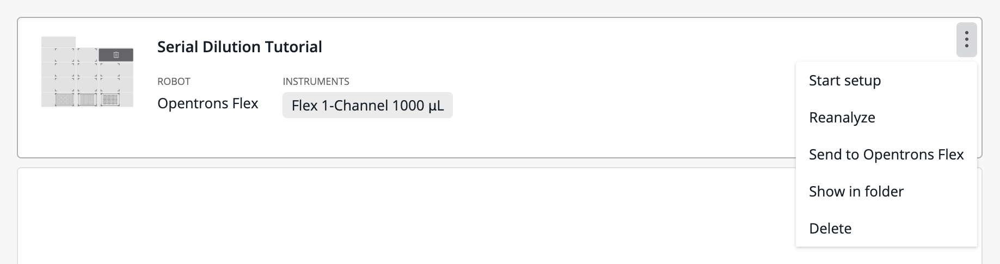
<figcaption>Actions available in the three-dot menu (⋮) for imported protocols.</figcaption>
</figure>

!!! note
    In-app protocol analysis is only a preliminary check of the validity of your protocol. Protocol analysis will run again on the robot once you transfer the protocol to it. It's possible for analysis to fail in the app and succeed on the robot, or vice versa. Analysis mismatches may occur when your app and robot software versions are out of sync, or if you have customized the Python environment on your Flex.

#### Run immediately

Click the three-dot menu (⋮) on your protocol and choose **Start setup**. Choose a connected and available Flex from the list to transfer the protocol and begin run setup immediately. The run setup screen will appear both in the app and on the touchscreen, and you can continue from either place.

If you stay in the app, expand the sections under the Setup tab and follow the instructions in each one: Robot Calibration, Module Setup (if your protocol uses modules), Labware Position Check (recommended), and Labware Setup. Then click :material-play-circle: **Start run** to to begin the protocol.

If you move to the touchscreen, follow the steps in the [Run Setup section][run-setup] above.

#### Run later

Click the three-dot menu (⋮) on your protocol and choose **Send to Opentrons Flex**. Choose a connected and available Flex from the list to transfer the protocol. A message indicating a successful transfer will pop up both in the app and on the touchscreen. To set up your protocol, you need to move to the touchscreen and follow the steps in the [Run Setup section][run-setup] above.

### Module status and controls

Use the Opentrons App to view the status of modules connected to your Flex and control them outside of protocols. Click **Devices** and then click on your Flex to view its robot details page. Under Instruments and Modules, there is a card for each attached module. The card shows the type of module, what USB port it is connected to, and its current status.

<figure markdown>
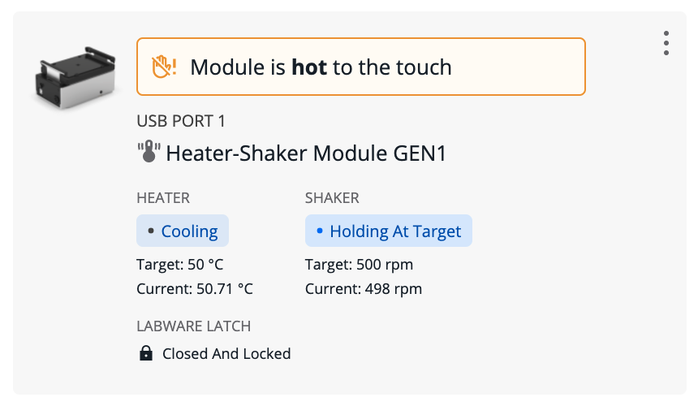
<figcaption>Module card for the Heater-Shaker Module.</figcaption>
</figure>

!!! note
    The Magnetic Block does not have a card in Instruments and Modules, since it is unpowered and does not connect to Flex via USB.

Click the three-dot menu (⋮) on the module card to choose from available commands. You can always choose **About module** to see the firmware version and serial number of the module. (This information is very useful when contacting Opentrons Support!) The other commands depend on the type of the module and its current status:

| Module type    | Commands |
| -------------- | -------- |
| **Heater-Shaker** | <ul><li>Set module temperature / Deactivate heater</li><li>Open labware latch / Close labware latch</li><li>Test shake / Deactivate shaker</li></ul> |
| **Temperature**   | <ul><li>Set module temperature / Deactivate module</li></ul>                            |
| **Thermocycler**  | <ul><li>Set lid temperature / Deactivate lid</li><li>Open lid / Close lid</li><li>Set block temperature / Deactivate block</li></ul> |

### Recent protocol runs

The robot details page lists up to 20 recent protocol runs. This provides additional information compared to the touchscreen, which only shows the most recent run for each unique protocol.

Each entry in the recent protocol runs list includes the protocol name, its timestamp, whether the run was canceled or completed, and the duration of the run. Click the disclosure triangle next to any run to show its associated labware offset data. Click the three-dot menu (⋮) for related actions:

- **View protocol run record:** Show the protocol run screen as it appeared when the protocol ended (succeeded, failed, or was canceled), including all performed steps.

- **Rerun protocol now:** The same as choosing **Start setup** on the corresponding protocol.

- **Download run log:** Save to your computer a JSON file containing information about the protocol run, including all performed steps.

- **Delete protocol run record:** Delete all information about this protocol run from Flex, including labware offset data. When you choose this option, it's as though the protocol run never happened.

!!! note
    If you need to maintain a comprehensive record of all runs performed on your Flex, you must use the **Download run log** feature to save this information to your computer.

Flex *will not* retain information about more than 20 runs on the robot. Proceeding to the Run Setup screen generates an entry in the list and counts towards the maximum of 20 runs, even if you never begin the protocol.

## Command line operation over SSH

You can work with your Flex through a Secure Shell (SSH) terminal connection. Terminal access lets you [run protocols directly from the command line](https://docs.opentrons.com/v2/new_advanced_running.html#command-line) or perform advanced tasks, such as customizing the Python environment on the robot. Protocols that reference external files on disk (apart from custom labware definition files) must be run from the command line.

!!!note
    - SSH keys are required before you can connect to Flex and issue commands from a terminal.
    - If you're unable to use a Wi-Fi network for SSH, see [Hardwired SSH Connections][hardwired-ssh-connections] below.

### Creating SSH keys

Follow these steps to create SSH keys on your Mac, Windows, or Linux computer:

1. Open a terminal window and type this command:

    ```
    ssh-keygen -f robot_key -t ecdsa
    ```

1. Create a passphrase when prompted. This process generates a file, `robot_key.pub`. A passphrase is not required, but you should create one.

1. Copy the `robot_key.pub` file to the root of a USB-A flash drive. You will use this USB drive (and the saved key) for SSH authentication to the robot.

    !!!note
        The flash drive must have a single partition formatted with a file system readable by the embedded Linux system on Flex. FAT32, NTFS, and ext4 file systems are supported. The macOS HFS+ and APFS file systems are not. macOS can read and write to FAT-formatted drives.

1. Eject the USB drive.

### Making an SSH connection

To make an SSH connection:

1. Insert the USB drive that holds the SSH key created earlier into a USB port on your Flex.

1. On your computer, open a terminal window and type the commands shown below. Replace `ROBOT_IP` with the IP address of your Flex.

    ```
    curl \
    --location --request POST \
    'http://ROBOT_IP:31950/server/ssh_keys/from_local'
    ```
    The command is successful when you see a response message that indicates a new key was added.

1. After adding the key, type the command shown below. Replace `ROBOT_IP` with the IP address of your Flex.

    ```
    ssh -i robot_key root@ROBOT_IP
    ```

1. Type the passphrase you set when creating the SSH key.

When an SSH connection is successful, the terminal command prompt changes to `root@` followed by the serial number of your robot (e.g., `root@FLXA1020231007001:~#`). You can now interact with the robot via the terminal window.

### Hardwired SSH connections

A hardwired connection uses an Ethernet cable to connect and transmit data directly between your computer and Flex. This is a secure alternative for SSH access in situations where network policies prevent you from making a wireless connection to the robot.

!!!note
    The hardwired SSH procedure requires assigning a static IP address to the robot. You may want to ask for help from your IT support team before proceeding.

#### Physical connection

Connect a computer to the robot using an Ethernet cable. If your computer has a built-in RJ-45 Ethernet port, plug one end into the computer and connect the other end to the Ethernet port on the robot. If you're using a computer without an Ethernet port, use an adapter with an Ethernet port to make this connection.

When disconnected from a network, your Flex will assign itself an IP address and subnet mask. You'll need this information to set a static address on your computer within the same IP address range and subnet as your Flex.

#### Finding the robot's IP address

You can get the IP address range and subnet mask from the robot by connecting it to your computer and checking the Opentrons App:

1. If the robot is connected by Ethernet cable to a switch or wall jack, disconnect it. Then establish a physical Ethernet connection to your computer, as described above.

1. Launch the Opentrons App.

1. Click the **Devices** tab and find your robot.

    !!!note
        If your robot appears as inactive or inaccessible in the app, wait a few moments. Flex will configure itself and eventually become available again. If this does not happen, turn the robot's power off, wait a few seconds, turn the power back on, and check the app again after the robot boots up.

1. After locating your robot in the app, click the three-dot menu (⋮), select **Robot settings**, and then click the **Networking** tab.

The Networking tab will show you the IP address and subnet mask of your robot. When disconnected from a network, Flex will assign itself a non-routing IP address. Here's an example of a self-assigned IP address on a Flex:

- IP address: 169.254.29.160
- Subnet mask: 255.255.0.0

#### Setting a static IP address

The static IP address on your computer needs to be in the same IP range and subnet that your Flex uses. Given the robot's IP address above, you could set your computer's IP address and subnet as shown here:

- IP address: 169.254.29.164
- Subnet mask: 255.255.0.0

After you have a working hardwired connection, follow the instructions in [Making an SSH Connection](software-operation.md#making-an-ssh-connection) above.

## Jupyter Notebook

Flex runs a [Jupyter Notebook](https://jupyter.org/) server on port 48888, which you can connect to with your web browser. Use Jupyter to individually run discrete chunks of Python code, called *cells*. This is a convenient environment for writing and debugging protocols, since you can define different parts of your protocol in different notebook cells, and run a single cell at a time.

Access your robot's Jupyter Notebook either:

- In the Opentrons App. Go to **Devices** > your robot > **Robot Settings** > **Advanced** and then click **Launch Jupyter Notebook**.

- In your web browser. Navigate directly to `http://<robot-ip>:48888`, replacing `<robot-ip>` with the local IP address of your Flex.

For more details on using Jupyter, including preparing executable cells
of code and running them on a robot, see the [Jupyter Notebook section](https://docs.opentrons.com/v2/new_advanced_running.html#jupyter-notebook) of the Python Protocol API documentation.

