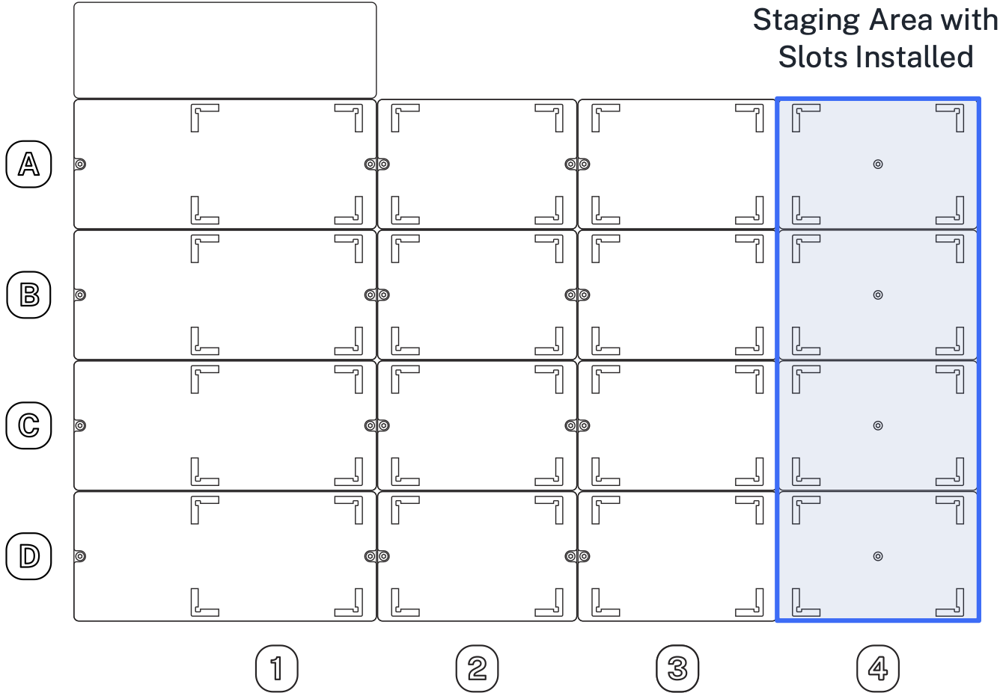
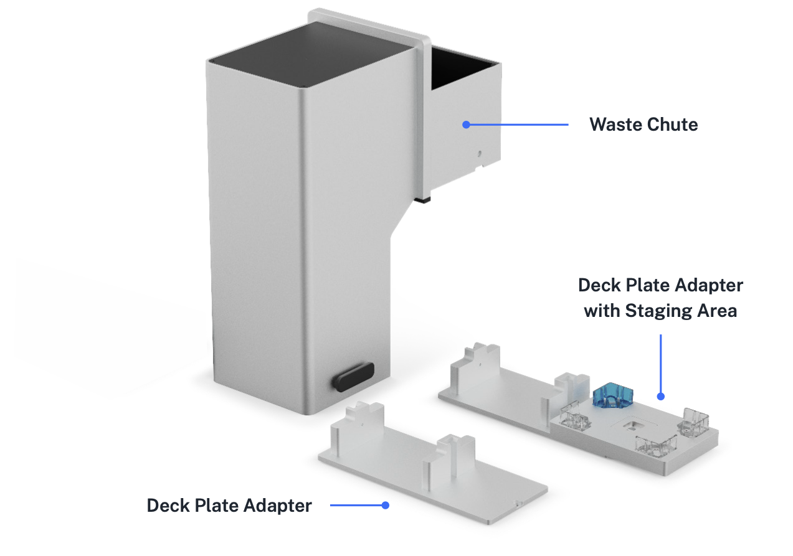
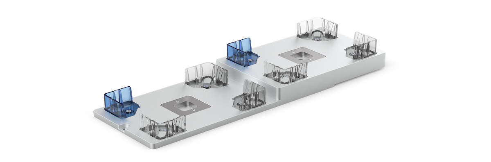
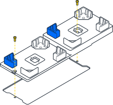
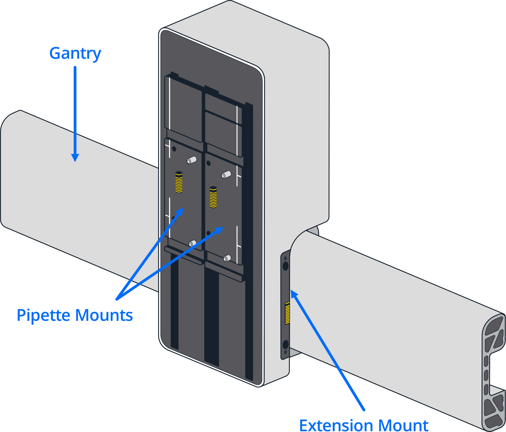
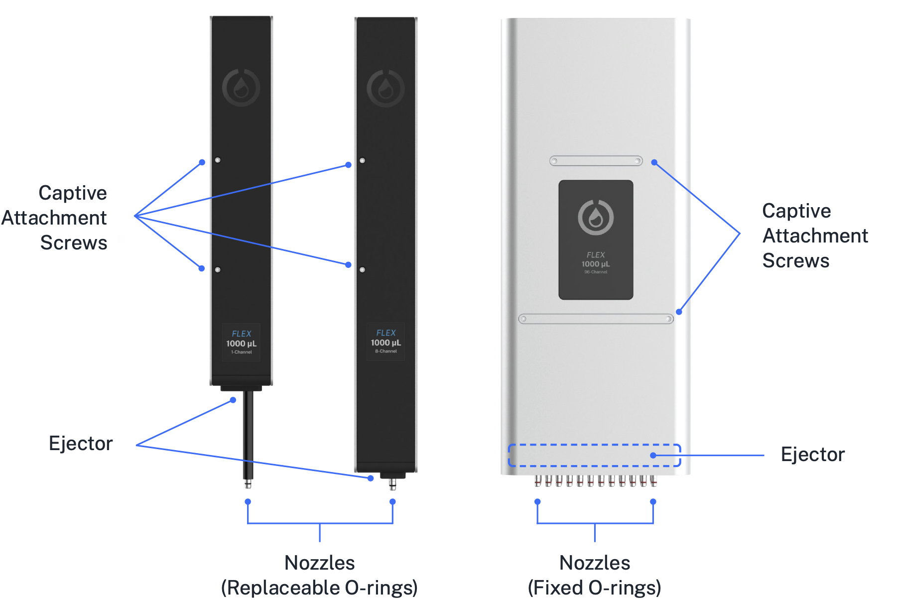
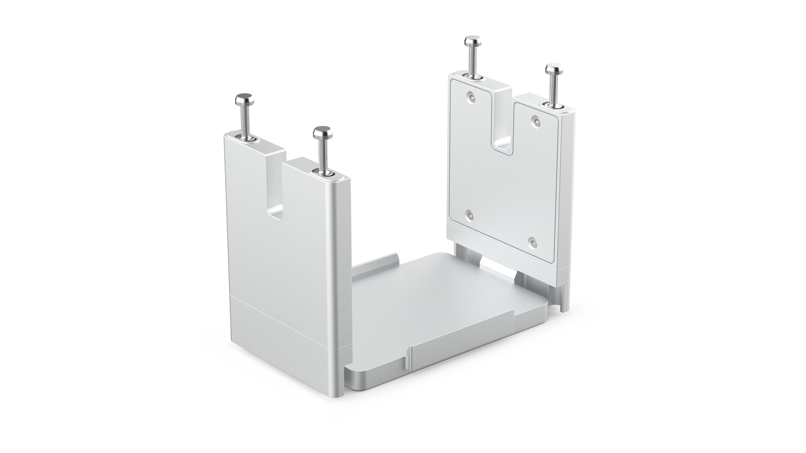
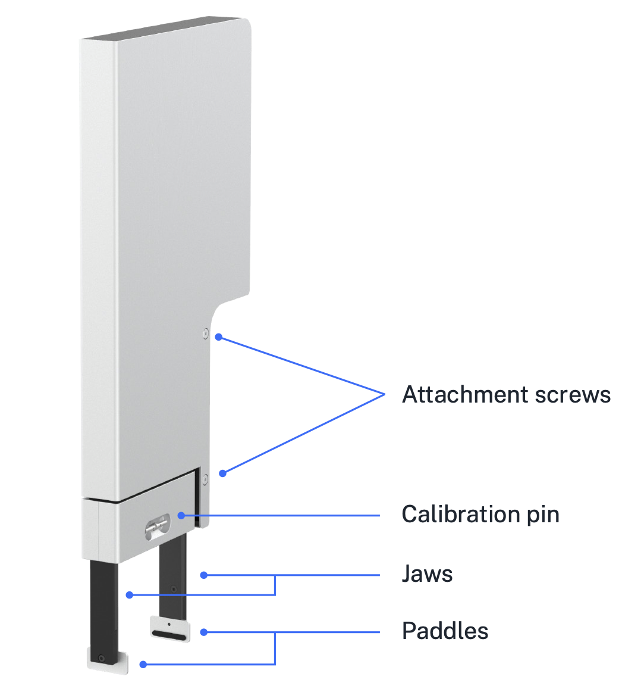
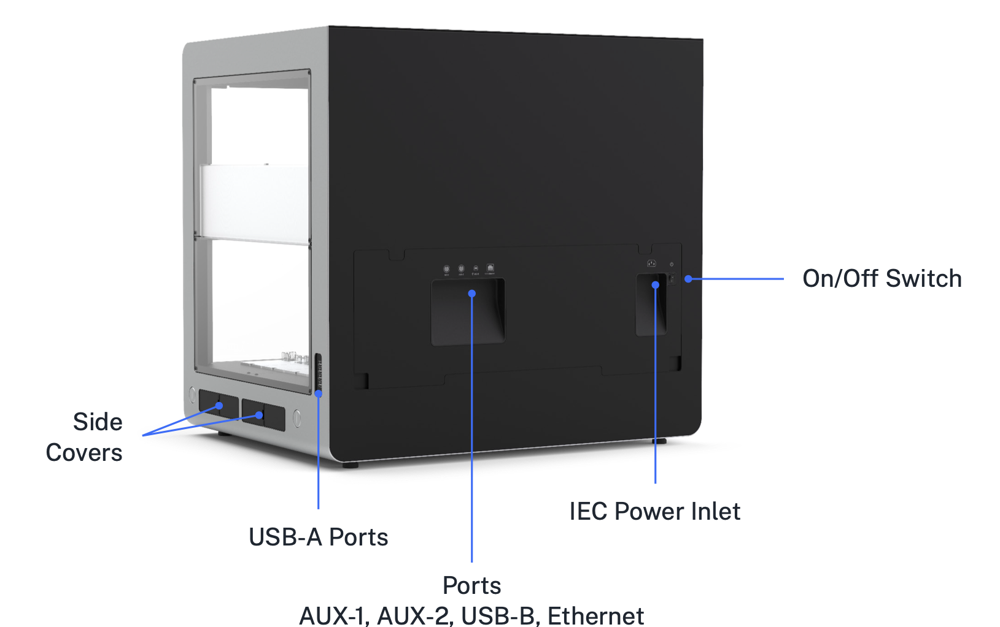

# System Description

This chapter describes the hardware systems of Opentrons Flex, which underlie its core lab automation features. The deck, gantry, and instrument mounts of Opentrons Flex enable the use of precision liquid- and labware-handling components. The on-device touchscreen enables running protocols and checking on the robot's status without needing to bring your computer to the lab bench. Wired and wireless connectivity enables additional control from the Opentrons App (see the [Software and Operation chapter](software-operation.md) for more details) and extending the system's features by attaching peripherals (see the [Modules chapter](modules.md)).

## Physical components

<figure markdown>

<figcaption>Locations of the physical components of Opentrons Flex.</figcaption>
</figure>

### Frame and enclosure

The *frame* of the Opentrons Flex robot provides rigidity and structural support for its deck and gantry. All of the mechanical subsystems are situated on and mounted to the main frame. The frame is constructed primarily of sheet metal and aluminum extrusions.

The metal frame has openings for *side windows* and a *front door* made of transparent polycarbonate that let you see what's going on inside Flex. The front door hinges open for access to the interior of the system. With the front door open, you can attach instruments, modules, and deck fixtures; prepare the deck before a protocol; or manipulate the state of the deck during a protocol.

White LED strips on the inside top edges of the frame provide software-controllable ambient lighting. A 2-megapixel camera can photograph the deck and working area for recording and tracking protocol execution.

### Deck and working area

The deck is the machined aluminum surface on which automated science protocols are executed. The deck has 12 main ANSI/SLAS-format slots that can be reconfigured to hold labware, modules, and consumables. The deck slots are identified by a coordinate system, with slot A1 at the back left and slot D3 at the front right.

<figure markdown>

<figcaption>Areas of the deck within Flex.</figcaption>
</figure>

The *working area* is the physical space above the deck that is accessible for pipetting. Labware placed in slots A1 through D3 are in the working area.

Opentrons Flex comes with *removable deck slots* for all 12 positions in the working area. Each deck slot has corner *labware clips* for securely placing labware on the deck.

You can reconfigure the deck by replacing slots with other *deck fixtures*, including the *movable trash, waste chute,* and *module caddies*. The *expansion slot* behind A1 is only used to make additional room for the Thermocycler Module, which occupies slots A1 and B1.

!!! note
    Deck slots are interchangeable within a column (1, 2, or 3) but not across columns; column 1 and column 3 slots are distinct pieces despite their similar size. You can tell which column a slot goes in by orienting the blue labware clip to the back left.

You should leave deck slots installed in locations where you want to place standalone labware. The deck and items placed on it remain static, unless moved by the gripper or manual intervention.

### Staging area

The *staging area* is additional space along the right side of the deck. You can store labware in this location after installing *staging area slots*. Labware placed in slots A4 through D4 are in the staging area. Flex pipettes cannot reach into the staging area, but the gripper can pick up and move labware to and from this location. Adding extra slots helps keep the working area available for the equipment used in your automated protocols.

Staging area slots are included in certain workstation configurations.
You can also purchase a [set of four slots](https://opentrons.com/products/opentrons-flex-deck-expansion-set-4-count) from Opentrons.

<figure markdown>

<figcaption>Staging Area with Slots Installed</figcaption>
</figure>

### Deck fixtures

Fixtures are hardware items that replace standard deck slots. They let
you customize the deck layout and add functionality to your Flex.
Currently, deck fixtures include the staging area slots, the internal
trash bin, and the external waste chute. You can only install fixtures
in a few specific deck slots. The following table lists the deck
locations for each fixture.

| **Fixture**                        | **Slots**         |
|------------------------------------|-------------------|
| Staging area slots                 | A3–D3             |
| Trash bin                          | A1–D1 and A3–D3   |
| Waste chute                        | D3 only           |
| Waste chute with staging area slot | D3 only           |

Fixtures are unpowered. They do not contain electronic or mechanical components that communicate their current state and deck location to the robot. This means you have to use the deck configuration feature to let the Flex know what fixtures are attached to the deck and where they're located.

You can access the deck configuration settings from the touchscreen via the three-dot (⋮) menu and from the Opentrons App. See the [Deck Configuration section][deck-configuration] of the Software and Operation chapter for information on how to configure the deck from the touchscreen.

### Waste chute

The Opentrons Flex Waste Chute transfers liquids, tips, tip racks, and well plates from the Flex enclosure to a trash receptacle placed below its external opening. The waste chute attaches to a deck plate adapter that fits in slot D3. It also comes with a special window half panel that lets the chute extend out of the front of the robot.

<figure markdown>

<figcaption>Components of the waste chute.</figcaption>
</figure>

### Staging area slots

Staging area slots are ANSI/SLAS compatible deck pieces that replace standard slots in column 3 and add new slots to the staging area — all without losing space in the working area. You can install a single slot or a maximum of four slots to create a new column (A4 to D4) along the right side of the deck. Note, however, that replacing deck slot A3 requires moving the trash bin. By adding staging area slots to the deck, your Flex robot can store more labware and operate more efficiently.

<figure markdown>

<figcaption>Flex staging area slot.</figcaption>
</figure>

#### Slot installation

To install, remove the screws that attach a standard slot to the deck and replace it with the staging area slot. After installation, use the touchscreen or Opentrons App to tell the robot you've added a staging area slot to the deck.

<figure markdown>

<figcaption>Installing a staging area slot.</figcaption>
</figure>

#### Slot compatibility

Staging area slots are compatible with the Flex instruments, modules, and labware listed below.

| Flex component | Staging area compatibility |
|:-------------- |:------------|
| **Gripper**        | The Flex Gripper can move labware to or from staging area slots.                                                     |
| **Pipettes**       | Flex pipettes cannot reach the staging area. Use the gripper to move tip racks and labware from the staging area to the working area before pipetting. |
| **Modules**        | The Magnetic Block GEN1 can be placed in column 3 on top of a staging area slot. Modules are not supported in column 4.  Powered modules such as the Heater-Shaker and Temperature Module fit into caddies that can be placed in column 3. You can't add a staging area slot to a position occupied by a module caddy. |
| **Labware**        | Staging area slots have the same ANSI/SLAS dimensions as standard deck slots. Use in the staging area, or manually add and remove labware from this location. |

### Movement system

Attached to the frame is the *gantry*, which is the robot's movement and positioning system.

The gantry moves separately along the x- and y-axis to position the pipettes and gripper at precise locations for protocol execution. Movement along these axes is precise to the nearest 0.1 mm. The gantry is controlled by 36 VDC hybrid bipolar stepper motors.

In turn, attached to the gantry are the *pipette mounts* and the *extension mount*. These move along the z-axis to position the pipettes and gripper at precise locations for protocol execution. Movement along this axis is controlled by 36 VDC hybrid bipolar stepper motors.

The electronics contained in the gantry provide 36 VDC power and communications to the pipettes and gripper, when attached.

Location of instrument mounts on Flex.

### Touchscreen and LED displays

The primary user interface is the 7-inch LCD *touchscreen*, located on the front right of the robot. The touchscreen is covered with Gorilla Glass 3 for scratch and damage resistance. Access many features of Flex right on the touchscreen, including:

- Protocol management

- Protocol setup, execution, and monitoring

- Labware management

- Robot settings

- System software and firmware updates

- Operation logs and error notifications

For more information on using Flex via the touchscreen, see the [Touchscreen Operation section](software-operation.md#touchscreen-operation) of the Software and Operation chapter.

The *status light* is a strip of LEDs along the top front of the robot that provides at-a-glance information about the robot. Different colors and patterns of illumination can communicate various success, failure, or idle states:

<table>
  <thead>
    <tr>
      <th>LED color</th>
      <th>LED pattern</th>
      <th>Robot status</th>
    </tr>
  </thead>
  <tbody>
    <tr>
      <td rowspan="2" markdown>⚪️ White Neutral states</td>
      <td>Solid</td>
      <td>Powered on and not running a protocol</td>
    </tr>
    <tr>
      <td>Pulsing</td>
      <td>Robot is busy (e.g., updating software or firmware, setting up protocol run, canceling protocol run)</td>
    </tr>
    <tr>
      <td rowspan="3">🟢 Green Normal states</td>
      <td>Blinks twice</td>
      <td>Action is complete (e.g., protocol stored, software updated, instrument attached or detached)</td>
    </tr>
    <tr>
      <td>Solid</td>
      <td>Protocol is running</td>
    </tr>
    <tr>
      <td>Pulsing</td>
      <td>Protocol is complete</td>
    </tr>
    <tr>
      <td>🔵 Blue Mandatory states</td>
      <td>Pulsing</td>
      <td>Protocol is paused</td>
    </tr>
    <tr>
      <td>🟡 Yellow Abnormal states</td>
      <td>Solid</td>
      <td>Software error</td>
    </tr>
    <tr>
      <td>🔴 Red Emergency states</td>
      <td>Blinks three times, repeatedly</td>
      <td>Physical error (e.g., instrument crash)</td>
    </tr>
  </tbody>
</table>

The status light can also be disabled in the robot settings.

## Pipettes

Opentrons *pipettes* are configurable devices used to move liquids throughout the working area during the execution of protocols. There are several Opentrons Flex pipettes, which can handle volumes from 1 µL to 1000 µL in 1, 8, or 96 channels:

- Opentrons Flex 1-Channel Pipette (1–50 µL)

- Opentrons Flex 1-Channel Pipette (5–1000 µL)

- Opentrons Flex 8-Channel Pipette (1–50 µL)

- Opentrons Flex 8-Channel Pipette (5–1000 µL)

- Opentrons Flex 96-Channel Pipette (5–1000 µL)

Pipettes attach to the gantry using captive screws on the front of the pipette. 1-channel and 8-channel pipettes each occupy one *pipette mount* (left or right); the 96-channel pipette occupies both mounts. For details on installing pipettes, see [Instrument Installation and Calibration][instrument-installation-and-calibration].

Locations of components of the 1-, 8-, and 96-channel pipettes.

The pipettes pick up disposable plastic *tips* by pressing them onto the pipette *nozzles*, and then use the tips to aspirate and dispense liquids. The amount of total force required for pickup increases as more tips get picked up simultaneously. For smaller numbers of tips, the pipette attaches tips by pushing each pipette nozzle down into a tip. To achieve the necessary force to pick up a full rack of tips, the 96-channel pipette also pulls the tips upward onto the nozzles. This pulling action requires placing tip racks into a *tip rack adapter*, rather than directly in a deck slot. To discard tips (or return them to their rack), the pipette *ejector* mechanism pushes the tips off of the nozzles.

### Pipette specifications

Opentrons Flex pipettes are designed to handle a wide range of volumes.
Because of their wide overall range, they can use multiple sizes of tips, which affect their liquid-handling characteristics. Opentrons has tested Flex pipettes for accuracy and precision in a number of tip and liquid volume combinations:

<table>
  <thead>
    <tr>
      <th>Pipette</th>
      <th>Tip Capacity</th>
      <th>Tested Volume</th>
      <th>Accuracy %D</th>
      <th>Precision %CV</th>
    </tr>
  </thead>
  <tbody>
    <tr>
      <td rowspan="3"><b>Flex 1-Channel 50 µL</b></td>
      <td>50 µL</td>
      <td>1 µL</td>
      <td>8.00%</td>
      <td>7.00%</td>
    </tr>
    <tr>
      <td>50 µL</td>
      <td>10 µL</td>
      <td>1.50%</td>
      <td>0.50%</td>
    </tr>
    <tr>
      <td>50 µL</td>
      <td>50 µL</td>
      <td>1.25%</td>
      <td>0.40%</td>
    </tr>
    <tr>
      <td rowspan="4"><b>Flex 1-Channel 1000 µL</b></td>
      <td>50 µL</td>
      <td>5 µL</td>
      <td>5.00%</td>
      <td>2.50%</td>
    </tr>
    <tr>
      <td>50 µL</td>
      <td>50 µL</td>
      <td>0.50%</td>
      <td>0.30%</td>
    </tr>
    <tr>
      <td>200 µL</td>
      <td>200 µL</td>
      <td>0.50%</td>
      <td>0.15%</td>
    </tr>
    <tr>
      <td>1000 µL</td>
      <td>1000 µL</td>
      <td>0.50%</td>
      <td>0.15%</td>
    </tr>
    <tr>
      <td rowspan="3"><b>Flex 8-Channel 50 µL</b></td>
      <td>50 µL</td>
      <td>1 µL</td>
      <td>10.00%</td>
      <td>8.00%</td>
    </tr>
    <tr>
      <td>50 µL</td>
      <td>10 µL</td>
      <td>2.50%</td>
      <td>1.00%</td>
    </tr>
    <tr>
      <td>50 µL</td>
      <td>50 µL</td>
      <td>1.25%</td>
      <td>0.60%</td>
    </tr>
    <tr>
      <td rowspan="4"><b>Flex 8-Channel 1000 µL</b></td>
      <td>50 µL</td>
      <td>5 µL</td>
      <td>8.00%</td>
      <td>4.00%</td>
    </tr>
    <tr>
      <td>50 µL</td>
      <td>50 µL</td>
      <td>2.50%</td>
      <td>0.60%</td>
    </tr>
    <tr>
      <td>200 µL</td>
      <td>200 µL</td>
      <td>1.00%</td>
      <td>0.25%</td>
    </tr>
    <tr>
      <td>1000 µL</td>
      <td>1000 µL</td>
      <td>0.70%</td>
      <td>0.15%</td>
    </tr>
    <tr>
      <td rowspan="4"><b>Flex 96-Channel 1000 µL</b></td>
      <td>50 µL</td>
      <td>5 µL</td>
      <td>10.00%</td>
      <td>5.00%</td>
    </tr>
    <tr>
      <td>50 µL</td>
      <td>50 µL</td>
      <td>2.50%</td>
      <td>1.25%</td>
    </tr>
    <tr>
      <td>200 µL</td>
      <td>200 µL</td>
      <td>1.50%</td>
      <td>1.25%</td>
    </tr>
    <tr>
      <td>1000 µL</td>
      <td>1000 µL</td>
      <td>1.50%</td>
      <td>1.50%</td>
    </tr>
  </tbody>
</table>

Keep this accuracy information in mind when choosing tips for your
pipette. In general, for best results you should use the smallest tips
that meet the needs of your protocol.

!!! note
    Opentrons performs volumetric testing of Flex pipettes to ensure that they meet the accuracy and precision specifications listed above. You *do not* have to calibrate the volume that your pipettes dispense before use. You only have to perform positional calibration. See the next section, as well as the [Pipette Installation section][pipette-installation] of the Installation and Relocation chapter, for details.

    The Opentrons Care and Opentrons Care Plus services include yearly pipette replacement and certificates of calibration. See the [Servicing Flex section][servicing-flex] of the Maintenance and Service chapter for details.

### Pipette calibration

The User Kit includes a metal pipette calibration probe, which you use during positional calibration. During protocol runs, safely store the probe on the magnetic holder on the front pillar of the robot. During the calibration process, attach the probe to the appropriate nozzle and lock it in place. The robot moves the probe to calibration points on the deck to measure the pipette's exact position.

### Pipette tip rack adapter

The Opentrons Flex 96-channel pipette ships with four tip rack adapters. These are precision formed aluminum brackets that you place on the deck. The adapters hold Flex 50 μL, 200 μL, and 1000 µL tip racks.

Because of the force involved, the 96-channel pipette requires an adapter to attach a full tip rack properly. During the attachment procedure, the pipette moves over the adapter, lowers itself onto the mounting pins, and pulls tips onto the pipettes by lifting the adapter and tip rack. Pulling the tips, rather than pushing, provides the leverage needed to secure tips to the pipettes and prevents warping the deck surface. When finished, the 96-channel pipette lowers the adapter and empty tip rack onto the deck. See the [Tips and Tip Racks section][tips-and-tip-racks] of the Labware chapter for more information.

### Partial tip pickup

By default, multi-channel pipettes use all of their nozzles to pick up tips and handle liquids: an 8-channel pipette picks up 8 tips at once, and a 96-channel pipette picks up 96 tips at once. Partial tip pickup lets you configure a multi-channel pipette to use fewer tips. This expands the liquid handling capabilities of your robot without having to physically switch pipettes, and is especially useful for the 96-channel pipette, which occupies both pipette mounts.

Currently, the 96-channel pipette supports partial tip pickup for a column, a row, or a single tip. The 8-channel pipettes support a partial column (2–7 consecutive tips) or a single tip.

When picking up fewer than 96 tips from a tip rack with any pipette, the rack must be placed directly on the deck, not in the tip rack adapter.

### Pipette sensors

Opentrons Flex pipettes have a number of sensors that detect and record data about the status of the pipette and any tips it has picked up.

#### Capacitance sensors

In combination with a metal probe or conductive tip, the capacitance sensors detect when the pipette makes contact with something. Detection of contact between the metal probe and the deck is used in the automated [pipette calibration][pipette-calibration] and [module calibration][module-calibration] processes.

1-channel pipettes have one capacitance sensor, while multi-channel pipettes have two: on channels 1 and 8 of 8-channel pipettes, and on channels 1 and 96 (positions A1 and H12) of the 96-channel pipette.

#### Optical tip presence sensors

A photointerruptor switch detects the position of the pipette's tip ejector mechanism, confirming whether tips were successfully picked up or dropped. 1-channel, 8-channel, and 96-channel pipettes all have a single optical sensor that monitors tip attachment across all channels.

#### Pressure sensors

Flex pipettes use internal pressure sensors to detect liquid in well plates, reservoirs, and tubes. Liquid detection takes place as a pipette approaches the surface of a liquid. Sensors in the pipettes detect pressure changes relative to ambient pressure. A particular change in pressure tells the robot that liquid is present in a well and the pipette tip is in contact with the liquid's surface.

1-channel pipettes have one pressure sensor. The 8-channel pipette pressure sensors are on channels 1 and 8 (positions A1 and H1). The 96-channel pipette pressure sensors are on channels 1 and 96 (positions A1 and H12). Other channels on multi-channel pipettes do not have sensors and cannot detect liquid.

### Pipette firmware updates

Opentrons Flex automatically updates pipette firmware to keep it in sync with the robot software version. Pipette firmware updates are typically quick, and occur whenever:

- You attach a pipette.

- The robot restarts.

If, for any reason, your pipette firmware and robot software versions get out of sync, you can manually update the firmware in the Opentrons App.

1.  Click **Devices**.

2.  Click on your Flex in the device list.

3.  Under Instruments and Modules, the out-of-sync pipette will show a warning banner reading "Firmware update available." Click **Update now** to begin the update.

You can view the currently installed firmware version of any attached pipette. On the touchscreen, go to **Instruments** and tap the pipette name. In the Opentrons App, find the pipette card under Instruments and Modules, click the three-dot menu (⋮), and then click **About pipette**.

## Gripper

The *gripper* moves labware throughout the working area and staging area during the execution of protocols. The gripper attaches to the *extension mount*, which is separate from the pipette mounts; the gripper can be used with any pipette configuration. For details on installing the gripper, see [Instrument Installation and Calibration][instrument-installation-and-calibration].

The gripper can move labware across the deck and onto or off of modules. The gripper can manipulate certain fully skirted well plates, deep well plates, and tip racks. For more details on what labware the gripper can move, see the [Labware and the Opentrons Flex Gripper section][labware-and-the-opentrons-flex-gripper] of the Labware chapter, or consult the [Opentrons Labware Library](https://labware.opentrons.com).

### Gripper specifications

The *jaws* perform the primary motion of the gripper, which is to open or close two parallel *paddles* to apply or release force on the sides of labware. Movement of the jaws is controlled by a 36 VDC brushed motor connected to a rack-and-pinion gear system.

To move a piece of labware that has been gripped by the jaws, the gantry lifts the gripper along the z-axis, moves it laterally, and then lowers it into the Calibration pin labware's new position.

<figure markdown>

<figcaption>Locations of components of the gripper.</figcaption>
</figure>

### Gripper calibration

The gripper includes a metal *calibration pin*. The calibration pin is located in a recessed storage area on the lower part of the gripper. A magnet holds the pin in place. To remove the calibration pin, grasp it with your fingers and pull gently. To replace the pin, put it back in the storage slot. You'll know it's secure when it snaps into place.

When calibrating the gripper, attach the pin to each jaw in turn. The robot moves the pin to calibration points on the deck to measure the gripper's exact position.

During protocol runs, place the pin in its storage area for safekeeping. Contact us at <support@opentrons.com> if you lose the calibration pin.

### Gripper firmware updates

Opentrons Flex automatically updates the gripper firmware to keep it in sync with the robot software version. Gripper firmware updates are typically quick, and occur whenever:

- You attach the gripper.

- The robot restarts.

If, for any reason, your gripper firmware and robot software versions get out of sync, you can manually update the firmware in the Opentrons App.

1.  Click **Devices**.

2.  Click on your Flex in the device list.

3.  Under Instruments and Modules, the out-of-sync gripper will show a warning banner reading "Firmware update available." Click **Update now** to begin the update.

You can view the currently installed firmware version of the gripper. On the touchscreen, go to **Instruments** and tap the gripper. In the Opentrons App, find the gripper card under Instruments and Modules, click the three-dot menu (⋮), and then click **About gripper**.

## Emergency Stop Pendant

The *Emergency Stop Pendant (E-stop)* is a dedicated hardware button for quickly stopping robot motion. Opentrons Flex requires a functional, disengaged E-stop to be attached at all times. When you press the stop button, Flex cancels any running protocol or setup workflow as quickly as possible and prevents most robot motion.

### When to use the E-stop

You may need to press the E-stop:

- When there is imminent risk of injury or harm to a user.

- When there is imminent risk of damage to the robot or other hardware.

- When samples or reagents are in imminent danger of contamination.

- After a hardware collision.

Ideally you should never have to press the E-stop (except during infrequent hardware quality testing).

Do not use the E-stop to cancel normal, expected operations. Instead, use the software button on the touchscreen or in the Opentrons App. Pausing via software will let you resume or cancel your protocol, whereas pressing the E-stop always cancels the protocol immediately.

### Engaging and releasing the E-stop

The E-stop has a press-to-engage, twist-to-release mechanism.

- **Engage**: Push down firmly on the red button. Flex will enter the stopped state.

- **Resolve**: Once stopped, safely address any problems in the working area, such as clearing spills, removing labware, or moving the gantry (it should move freely and easily by hand).

- **Release**: Twist the button clockwise. It will pop up to its disengaged position.

- **Reset**: On the touchscreen or in the Opentrons App, confirm that you are ready for Flex to resume motion. The gantry will return to its home position and module activity will resume.

In the stopped state, Flex and connected hardware will behave as follows:

<table>
    <thead>
        <tr>
            <th>Component</th>
            <th>Behavior When E-stop Engaged</th>
        </tr>
    </thead>
    <tbody>
        <tr>
            <td><strong>Gantry</strong></td>
            <td>
                <ul>
                    <li>Automated horizontal motion is halted.</li>
                    <li>Manual horizontal motion is allowed.</li>
                </ul>
            </td>
        </tr>
        <tr>
            <td><strong>Pipettes</strong></td>
            <td>
                <ul>
                    <li>Vertical motion is halted.</li>
                    <li>Motor brakes on vertical axes are engaged to prevent pipettes from falling.</li>
                    <li>Plunger motion and tip pickup is halted.</li>
                </ul>
            </td>
        </tr>
        <tr>
            <td><strong>Gripper</strong></td>
            <td>
                <ul>
                    <li>Vertical motion is halted.</li>
                    <li>Motor brake on vertical axis is engaged to prevent the gripper from falling.</li>
                    <li>Jaw motors that exert gripping force remain enabled, so the gripper will not drop labware it may be carrying.</li>
                </ul>
            </td>
        </tr>
        <tr>
            <td><strong>Heater-Shaker Module</strong></td>
            <td>
                <ul>
                    <li>The shaker stops and homes.</li>
                    <li>The labware latch opens.</li>
                    <li>Heating is disabled.</li>
                </ul>
            </td>
        </tr>
        <tr>
            <td><strong>HEPA/UV Module</strong></td>
            <td>
                <ul>
                    <li>The UV lights and fan continue to operate.</li>
                    <li>Opening the door disables the lights.</li>
                </ul>
            </td>
        </tr>
        <tr>
            <td><strong>Plate Reader</strong></td>
            <td>
                <ul>
                    <li>When analyzing a sample, the module will continue to operate.</li>
                    <li>If the gripper is moving the plate reader's lid, its jaws remain enabled to hold the lid.</li>
                    <li>The gripper will automatically place the plate reader's lid back in its docking area after you fully reset the E-stop.</li>
                </ul>
            </td>
        </tr>
        <tr>
            <td><strong>Temperature Module</strong></td>
            <td>Heating or cooling is disabled.</td>
        </tr>
        <tr>
            <td><strong>Thermocycler Module</strong></td>
            <td>Heating or cooling is disabled.</td>
        </tr>
        <tr>
            <td><strong>Status light</strong></td>
            <td>The light turns red.</td>
        </tr>
        <tr>
            <td><strong>Touchscreen</strong></td>
            <td>
                <ul>
                    <li>A cancellation message takes over the screen.</li>
                    <li>An on-screen indicator shows when you have successfully disengaged the stop button.</li>
                </ul>
            </td>
        </tr>
    </tbody>
</table>

## Connections

### Power connection

Opentrons Flex connects to a power source via a standard IEC-C14 inlet. The robot contains an internal full-range AC/DC power supply, accepting 100–240 VAC, 50/60 Hz input and converting it to 36 VDC. All other internal electronics are powered by the 36 VDC supply.

!!! warning
    Only use the power cord provided with the robot. Do not use a power cord with inadequate current or voltage ratings.

    Keep the power cord free of obstructions so you can remove it if necessary.

There is also a CR1220 coin cell battery to power the robot's real-time clock when not connected to mains power. The battery is located inside the touchscreen enclosure. Contact Opentrons Support for more information if you think you need to replace the battery.

### USB and auxiliary connections

Opentrons Flex has 10 total USB ports located in different areas of the robot, which serve different purposes.

The 8 rear USB-A ports (numbered USB-1 through USB-8) and 2 auxiliary ports (M12 connectors numbered AUX-1 and AUX-2) are for connecting Opentrons modules and accessories. See the [Modules chapter](modules.md) for more information on connecting these devices and using them in your protocols.

The rear USB-B port is for connecting the robot to a laptop or desktop computer, to establish communication with the Opentrons App running on the connected computer. The front USB-A port (USB-9), located below the touchscreen display, has the same functionality as the rear USB-A ports.

!!! note
    The USB ports are power-limited to protect the robot and connected devices. Power delivery is split internally into three port groups: the left rear USB-A ports (USB-1 through USB-4), the right rear USB-A ports (USB-5 through USB-8), and the front USB-A port. Each of these groups will deliver a maximum of 500 mA to connected USB 2.0–compatible devices.

### Network connections

Opentrons Flex can connect to a local area network through a wired (Ethernet) or wireless (Wi-Fi) connection.

The Ethernet port is located on the rear of the robot. Connect it to an Ethernet hub or switch on your network. Or, starting in robot system version 7.1.0, connect it directly to an Ethernet port on your computer.

The internal Wi-Fi module supports 802.11 ac/a/b/g/n networks with a dual-band 2.4/5 GHz antenna.

## System specifications

### General specifications

| **Specification**         | **Details**                                                                                                                                         |
|--------------------------|------------------------------------------------------------------------------------------------------------------------------------------------------|
| **Dimensions**           | 87 × 69 × 84 cm / 34.25 × 27 × 33 in (W, D, H)                                                                                                      |
| **Weight**               | 88.5 kg / 195 lb                                                                                                                                    |
| **Deck slots**           | <ul><li>12 ANSI/SLAS-compatible slots in working area (accessible to pipettes)</li><li>4 additional slots for staging tips and labware (gripper only)</li></ul> |
| **Touchscreen**          | 7-inch LCD touchscreen with scratch- and damage-resistant Gorilla Glass 3                                                                            |
| **Wi-Fi**                | 802.11 ac/a/b/g/n dual-band (2.4/5 GHz)                                                                                                             |
| **Ethernet**             | 100 Mbps                                                                                                                                            |
| **USB**                  | <ul><li>9 USB-A ports</li><li>1 USB-B port</li><li>USB 2.0 speed</li></ul>                                                                          |
| **Camera**               | 2MP, photo and video                                                                                                                                |
| **Robot power input**    | <ul><li>100–240 VAC, 50–60 Hz, 1φ</li><li>4.0 A/115 VAC, 2.0 A/230 VAC</li></ul>                                                                    |
| **Mains supply voltage fluctuation** | ±10%                                                                                                                                    |
| **Mains supply frequency fluctuation** | ±5%                                                                                                                                   |
| **Distribution system**  | TN-S                                                                                                                                                |
| **Short-circuit supply current** | 6.3 A                                                                                                                                       |
| **Frame composition**    | Rigid steel and CNC aluminum design                                                                                                                  |
| **Window composition**   | Removable polycarbonate side windows and front door                                                                                                  |
| **Ventilation requirements** | At least 20 cm / 8 in between the unit and a wall                                                                                                |
| **Connected PC requirements** | The Opentrons App runs on: <ul><li>Windows 10 or later</li><li>macOS 10.10 or later</li><li>Ubuntu 12.04 or later</li></ul>                                               |

### Environmental specifications

| **Specification**         | **Details**                          |
|--------------------------|---------------------------------------|
| **Environmental conditions** | Indoor use only                  |
| **Ambient temperature**   | +20 to +25 °C (recommended)          |
| **Relative humidity**     | 40–60%, non-condensing (recommended) |
| **Pollution degree**      | 2 (non-conductive pollution only)    |

For additional information on acceptable environmental conditions for use and transport, see the [Environmental Conditions section][environmental-conditions] of the Installation and Relocation chapter.

### Certifications

| **Certification**         | **Status**         |
|--------------------------|--------------------|
| **Certifications complete** | CE, ETL, FCC, ISO 9001 |
| **Not certified/validated** | IVD, GMP         |

A summary of certification information is printed on a sticker on the back of Flex, near the on/off switch. For detailed certification and compliance information, see the [Regulatory Compliance section][regulatory-compliance] in the Introduction.

### Serial number

Every Flex has a unique serial number. The format of the serial number
provides additional information, including the robot's date of
production. For example, the serial number `FLXA1020231007001` would
indicate:

| **Characters**  | **Category** | **Meaning**                                      |
|-----------------|--------------|--------------------------------------------------|
| `FLX`           | Model        | The robot is an Opentrons Flex.                  |
| `A10`           | Version      | A code for the production version of the robot.  |
| `2023`          | Year         | The robot was made in 2023.                      |
| `10`            | Month        | The robot was made in October.                   |
| `07`            | Day          | The robot was made on the 7th day of the month.  |
| `001`           | Unit         | A unique number for robots made on a certain day.|

You can find the serial number for your Flex:

- On the certification sticker on the back of Flex, near the on/off
  switch.

- On the reverse side of the touchscreen (towards the working area).

- In the Opentrons App under **Devices** \> your Flex \> **Robot
  settings** \> **Advanced**.
