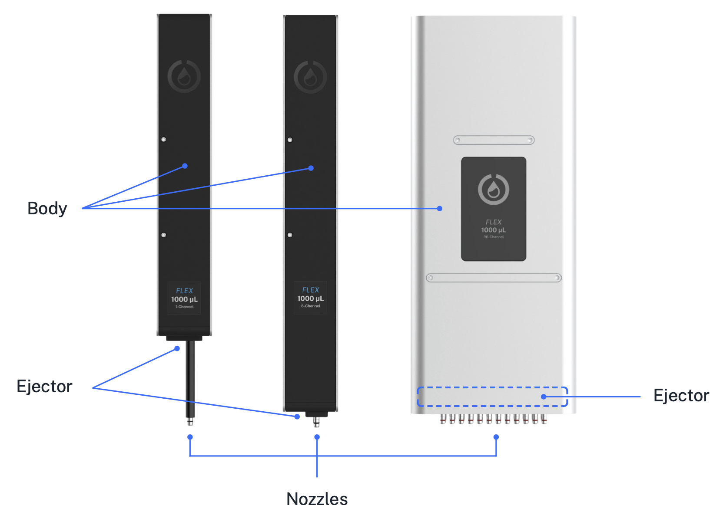
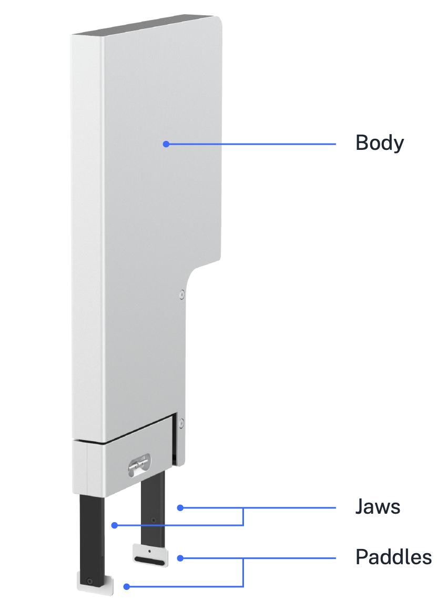
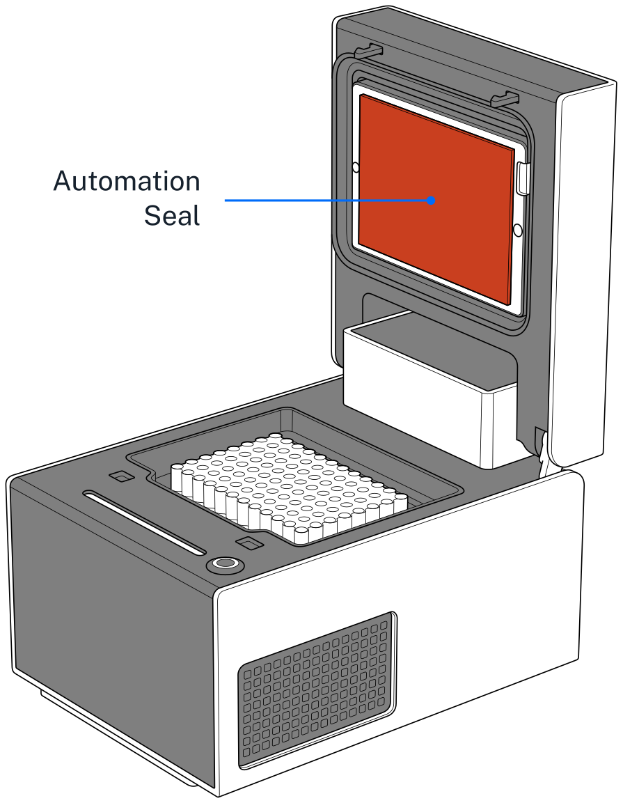

# Maintenance and Service

This chapter covers how to perform routine maintenance on your Opentrons Flex, and what to do if you require service for a problem. You should be able to perform cleaning tasks yourself, whereas service and repairs should be handled by Opentrons Support.

## Cleaning your Flex

Routine cleaning helps keep Flex free of contaminants that can affect your protocols. Cleaning also gives you a chance to inspect the robot for wear and damage. You should review this section for information, instructions, and resources about how to clean your Flex, pipettes, gripper, modules, and other hardware.

If you have any questions about cleaning your Flex and its related components, contact the support team at <support@opentrons.com>.

### Before you begin

Flex is an electrically powered mechanical device. As a good practice, turn off the power before you start cleaning it and before reaching inside the enclosure. You may even want to unplug the robot as well. These are simple safety steps you can take to make the robot inoperable until you're finished.

Along with turning the power off, remove any instruments, modules, and labware before cleaning the robot. Removing attached items gives you more room to work and provides better access to the deck, gantry, and other spaces.

### What you can clean

You can wipe off all the visible and easily accessible surfaces of your Flex. This includes the exterior and interior frame, touchscreen, windows, gantry, and deck. The Flex does not have any internal parts that you need to open or disassemble for this level of maintenance. If you can see it, you can clean it. If you can't see it, don't clean it.

### Cleaning solutions

The following table lists the chemicals you can use to clean your Flex. Diluted alcohol and distilled water are our recommended cleaning solutions, but you can refer to this list for other cleaning options. You can also use these chemicals to clean modules, pipettes, and other attached hardware.

!!! warning
    *Do not use acetone.* The robot, pipettes, and modules are made from materials that acetone can damage or dissolve.

| Solution | Recommendations |
|----|----|
| **Alcohol** | Includes ethyl/ethanol, isopropyl, and methanol. Dilute to 70% for cleaning. Do not use 100% alcohol. |
| **Bleach** | Dilute to 10% (1:10 bleach/water ratio) for cleaning. Do not use 100% bleach. |
| **Distilled water** | You can use distilled water to clean or rinse your robot. |

### Frame and window panel cleaning

To clean the exterior and interior frame and window panels of your Flex:

1. Dampen a soft, clean cloth or paper towel with a cleaning solution.
2. Gently wipe off the exposed and easily accessible surface areas.
3. Rinse off any remaining residue using a cloth dampened with distilled water.
4. Let the robot air dry.

### Deck cleaning

To clean the deck, deck slots, and trash bin:

1. Dampen a soft, clean cloth or paper towel with a cleaning solution.
2. Gently wipe off the deck, deck slots, and trash bin. You can remove the deck slots and trash bin for easier access.
3. Rinse off any remaining residue using a cloth dampened with distilled water.
4. Let the deck pieces air dry. Replace any items that you removed for cleaning.

### Gantry cleaning

To clean the gantry:

1. Dampen a soft, clean cloth or paper towel with a cleaning solution.
2. Gently wipe off the horizontal and vertical gantry surfaces, and side rails.
3. Rinse off any remaining residue using a cloth dampened with distilled water.
4. Let the gantry air dry.

### Waste chute cleaning

To clean the waste chute:

1. Remove the waste chute from its deck plate adapter.
2. Dampen a soft, clean cloth or paper towel with a cleaning solution.
3. Gently wipe down the exterior of the chute. The interior is powder-coated steel, so you can clean it with mild detergents or surfactants.
4. Rinse off any remaining residue using a cloth dampened with distilled water.
5. Let the waste chute air dry.
6. Reattach the waste chute to its deck plate adapter.

## Cleaning pipettes and tips

To clean a 1-, 8-, or 96-channel pipette:

1. Remove the pipette from the gantry.
2. Dampen a soft, clean cloth or paper towel with a cleaning solution.
3. Gently wipe down the following parts:
    - Body
    - Ejector
    - Nozzles
4. Rinse off any remaining residue using a cloth dampened with distilled water.
5. Let the pipette air dry.
6. Reattach the pipette to the gantry. When prompted, note that recalibration is optional, but recommended.

!!! warning
    - *Do not* disassemble Flex pipettes for cleaning or attempt to clean their internal electronic components.
    - *Do not* put Flex pipettes in an autoclave. The high temperatures, pressures, and steam used inside an autoclave can damage the electronics, circuit boards, small electric motors, and other sensitive components.

### Pipette decontamination

The routine cleaning steps described above may not clean your pipette if it becomes contaminated with substances like nucleic acids, proteins, or radioactive material. When a pipette becomes contaminated, try the decontamination steps described in this section. You can also contact support if your pipette gets contaminated and these cleaning procedures do not work.

#### Outside of the pipette

Refer to the following table for recommended cleaning methods, by contamination type.

| Contaminant  | Cleaning recommendation |
|--------------|-------------------------|
| **Aqueous solutions**   | Rinse the contaminated parts with distilled water or 70% ethanol and air dry at 15.5 °C (60 °F).         |
| **Nucleic acids**       | Clean the contaminated parts in a glycine/HCl buffer (pH 2) for 10 minutes, rinse with distilled water, and air dry. |
| **Organic solvents**    | Allow the solvent to evaporate on its own or immerse the pipette *nozzle only* in a detergent, rinse with distilled water, and air dry. |
| **Proteins**            | Clean the contaminated parts with a detergent, rinse with distilled water, and air dry. *Do not* use alcohol. That will set the proteins. |
| **Radioactive materials** | Place the pipette nozzle in a solution like Decon 90, rinse with distilled water, and air dry.         |

#### Inside the pipette

Filtered pipette tips help prevent contaminating the barrel or inside of the pipette. But, you cannot disassemble the barrel if it becomes contaminated. If the inside of your pipette gets contaminated, the following steps may help remove the contamination:

1. Remove the pipette from the gantry.
2. Inject a small amount of cleaning solution into the barrel using a manual pipette or syringe.
3. Gently shake the pipette to swirl the cleaning solution.
4. Rinse with distilled water.
5. Let the pipette air dry.
6. Reattach the pipette to the gantry. When prompted, note that recalibration is optional, but recommended.

### Cleaning pipette tips

Flex pipette tips are disposable items. You can autoclave and reuse them if your protocol allows it. For best results, we recommend using clean, fresh tips. Discard pipette tips after you no longer need them. You can purchase [replacement tips](https://opentrons.com/products/categories/tips-&-labware) directly from Opentrons.

## Cleaning the gripper

To clean the gripper:

1. Remove the gripper from the gantry.
2. Dampen a soft, clean cloth or paper towel with a cleaning solution.
3. Gently wipe down the following parts:
    - Gripper body
    - Jaws
    - Paddles
4. Rinse off any remaining residue using a cloth dampened with distilled water.
5. Let the gripper air dry.
6. Reattach the gripper to the gantry. When prompted, note that recalibration is optional, but recommended.

{width="50%"}

!!! warning
    - *Do not* disassemble the gripper for cleaning or attempt to clean its internal electronic components.
    - *Do not* put the gripper in an autoclave. The high temperatures, pressures, and steam used inside an autoclave can damage the electronics, circuit boards, small electric motors, and other sensitive components.

#### Gripper paddles

The gripper paddles are wear items that require periodic replacement. When cleaning the gripper, inspect the rubber pads for tears, nicks, or other wear. Replace the paddles as needed with the two spares (included with the gripper). If you need additional gripper paddles, contact Opentrons Support at <support@opentrons.com>.

!!! note
    Aggressive cleaning chemicals may reduce the lifetime of the rubber pads on the gripper paddles.

## Cleaning modules

You can clean the surfaces of any of your Flex modules. The general procedure is the same for all supported modules: Heater-Shaker, Magnetic Block, Temperature, and Thermocycler.

Be sure to turn the module's power off before cleaning it. You can clean the top surfaces of modules while they're installed in a deck slot. However, for better access, you may want to:

- Remove the caddy and module from the deck slot.
- Remove the module from the caddy.
- Disconnect any USB or power cables (if you're cleaning a powered module).

!!! warning
    - *Do not* disassemble modules for cleaning or attempt to clean their internal electronic components.
    - *Do not* put Flex modules in an autoclave. The high temperatures, pressures, and steam used inside an autoclave can damage the electronics, circuit boards, small electric motors, and other sensitive components.

### General module cleaning

Once you've prepared the module for cleaning:

1. Dampen a soft, clean cloth or paper towel with a cleaning solution.
2. Gently wipe off the module's surfaces.
3. Rinse off any remaining residue using a cloth dampened with distilled water.
4. Let the module air dry.

### Thermocycler seals

To set up the Thermocycler with a clean seal:

1. Affix a seal to the Thermocycler lid (if one isn't attached already).
2. Wipe the seal with a 1:10 diluted bleach solution.
3. Rinse the seal with molecular biology grade water.
4. Let the seal air dry.

{width="50%"}

## Autoclave-safe labware

The following table lists labware sold by Opentrons that we have verified as autoclave-safe. When you can't determine whether a piece of labware is autoclave-safe, just replace it with new, clean labware. You can [purchase replacement labware](https://opentrons.com/products/categories/tips-&-labware) from the Opentrons shop.

<table>
  <thead>
    <tr>
      <th>Labware type</th>
      <th>Autoclave-safe items</th>
    </tr>
  </thead>
  <tbody>
    <tr>
      <td><strong>Reservoirs</strong></td>
      <td>All NEST reservoirs</td>
    </tr>
    <tr>
      <td><strong>Sample vials</strong></td>
      <td>Eppendorf Safe-Lock 1.5 mL and 2.0 mL vials (when left open at 121 °C, 20 min)</td>
    </tr>
    <tr>
      <td><strong>Tip racks and tips</strong></td>
      <td>All Flex tip racks and tips</td>
    </tr>
    <tr>
      <td><strong>Well plates</strong></td>
      <td>
        <ul>
          <li>Thermo Scientific Nunc 96-Well Plate, 1300 μL</li>
          <li>Thermo Scientific Nunc 96-Well Plate, 2000 μL</li>
          <li>USA Scientific 96 Deep Well Plate, 2.4 mL</li>
        </ul>
      </td>
    </tr>
  </tbody>
</table>

If you're using labware from a manufacturer that's not listed here, refer to their website to see whether those items can be autoclaved.

## Servicing Flex

Opentrons Flex is designed for years of full-time operation. Unlike cleaning, you should not attempt to service or repair Flex yourself. Opentrons offers multiple levels of service for Flex and related Opentrons hardware, some of which include maintenance and repairs.

### Opentrons services

Opentrons offers two levels of service, Opentrons Care and Opentrons Care Plus, both of which include benefits for onboarding, maintenance, repair, and more. Both services are available in the continental United States; Opentrons Care is also available internationally. Both services include:

- Onboarding with an Opentrons field applications scientist.
- Parts for yearly preventive maintenance.
- Access to a dedicated support engineer.

In addition, Opentrons Care Plus includes on-site visits for:

- Installation.
- Preventive maintenance, yearly.
- Repairs, as needed.

You can also [purchase services](https://opentrons.com/instrument-services) individually, including installation, protocol development (remote or on-site), repair, relocation, and preventive maintenance. Contact Opentrons Sales for more information.

### Installation qualification and operation qualification

Opentrons recommends performing installation qualification and operation qualification (IQ/OQ) after you first set up Flex, after you attach hardware, and after having service performed. IQ/OQ generally verifies:

- The serial numbers of your hardware, including the Flex robot, pipettes, gripper, and modules.
- Software and firmware versions.
- Proper connection of attached hardware.
- Pipette and module calibrations.

Consult the [Flex IQ/OQ form](https://opentrons-flex-iq-oq-checklist.paperform.co) for a complete checklist of IQ/OQ activities to perform.

### Preventative maintenance

Along with routine cleaning, Opentrons also recommends the following optional procedures to help keep your Flex running smoothly. These suggestions are based on a Flex that operates for about 20 hours per week, 50 weeks per year. Feel free to adapt this schedule to your robot's workload. Alternatively, let Opentrons do the work for you—see the [Instrument Services section](https://opentrons.com/instrument-services) of our website for information about our service contract offerings.

<table>
  <thead>
    <tr>
      <th>Frequency</th>
      <th>Task</th>
      <th>Description</th>
    </tr>
  </thead>
  <tbody>
    <tr>
      <td rowspan="2">Daily</td>
      <td>Empty trash</td>
      <td>Take the movable trash out of its deck slot, safely discard its contents, and replace it into the deck.</td>
    </tr>
    <tr>
      <td>Inspect working area</td>
      <td>Clear the deck of any debris, liquid, or no-longer-needed labware. Check that the plastic labware clips are not damaged.</td>
    </tr>
    <tr>
      <td>Weekly</td>
      <td>Clean surfaces</td>
      <td>Clean the exterior surfaces of the deck, gantry, windows, instruments, and other hardware, as described above.</td>
    </tr>
    <tr>
      <td>Monthly</td>
      <td>Power cycle</td>
      <td>Turn off Flex and all connected modules. Then turn them back on.</td>
    </tr>
    <tr>
      <td rowspan="3">Every six months</td>
      <td>Inspect pipettes</td>
      <td>Inspect the O-rings on the pipette nozzles for signs of wear (notches, deformation). Replace the O-rings with the provided spares, if needed.</td>
    </tr>
    <tr>
      <td>Inspect gripper</td>
      <td>Inspect the rubber pads on the gripper paddles. Replace the gripper paddles with the provided spares, if needed.</td>
    </tr>
    <tr>
      <td>Recalibrate instruments</td>
      <td>Run recalibration for the pipettes and gripper.</td>
    </tr>
    <tr>
      <td>Yearly</td>
      <td>Evaluate pipette performance</td>
      <td>Evaluate the overall performance of your Flex pipettes. Replace any pipette that is not performing according to the <a href="../system-description/#pipette-specifications">published accuracy and precision standards</a>.</td>
    </tr>
  </tbody>
</table>

The annual on-site preventative maintenance visit that is part of Opentrons Care Plus includes performance of all of the tasks listed above, as well as replacement parts.

### Warranty

All hardware purchased from Opentrons is covered under a [1-year standard warranty](https://support.opentrons.com/s/article/Our-warranty). Opentrons warrants to the end-user of the products that they will be free of manufacturing defects due to part quality issues or poor workmanship and also warrants that the products will materially conform to Opentrons' published specifications. See the [Services page](https://opentrons.com/instrument-services) of our website for information about service contracts, custom protocol development, and other support offerings.

Contact us at <support@opentrons.com> if you have any questions about our warranty.
