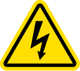
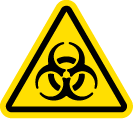

# Safety Information and Regulatory Compliance

Opentrons recommends that you follow the safe use specifications listed in this section and throughout this manual.

## Environmental conditions

The HEPA/UV Module should only be used indoors in an environment with stable ambient conditions. This module is designed for use with the Flex robot only. It cannot be used with the OT-2 robot or as standalone equipment. Follow the [installation instructions](installation.md) to ensure proper and safe operation.

!!! note
    The HEPA/UV Module should not be powered on or used in conditions outside of the acceptable operating conditions.

The following table lists and defines the environmental operating conditions for recommended use, acceptable use, and storage of your HEPA/UV Module.

| Environmental Conditions | Recommended | Acceptable | Storage and Transportation |
|---|---|---|---|
| Ambient Temperatures | +20 to +25 °C | +2 to +40 °C | +2 to +40 °C |
| Relative Humidity | 40–60%, non-condensing | 30–80%, non-condensing (below 30 °C) | 10–85%, non-condensing (below 30 °C) |
| Altitude | Approximately 500 m above sea level | Up to 2000 m above sea level | Up to 2000 m above sea level |
| Pollution Degree | 2 | 2 | 2 |

The following table lists and defines standards for recommended use, acceptable use, and storage.

| Operating Conditions | Description |
|---|---|
| Recommended | Opentrons has validated the performance of the HEPA/UV Module in the conditions recommended for system operation. Operating the module in these conditions provides optimal results. |
| Acceptable | The HEPA/UV Module is safe to use in conditions acceptable for system operation, but results may vary. |
| Storage | Storage and transportation conditions only apply when the device is completely disconnected from power and other equipment. |

## Instrument safety warnings

Warning symbols posted on the HEPA/UV Module and in this manual refer directly to the safe use of the unit. The following table lists and defines each safety warning symbol.

| Symbol | Description |
|---|---|
|  exposure hazard") | **Caution: Mercury (Hg) exposure hazard!** The fluorescent UV bulbs contain mercury (Hg). In the event of a broken bulb, there may be a risk of exposure to mercury. Follow lab procedures and local regulations for bulb cleanup and disposal. Intact bulbs do not present a health hazard. |
| ") | **Caution: Ultraviolet radiation (UV-C)!** The HEPA/UV Module produces high-intensity ultraviolet light (UV-C). The Flex and the HEPA/UV Module come with safety features that protect you from UV-C. Even with these safety features in place, always take care to protect your eyes and skin from exposure while the UV lights are on. Do not attempt to remove or adjust the HEPA/UV Module while powered on. If using the waste chute accessory, ensure that the chute door is unobstructed and in its closed position before enabling the UV lights. |
|  | **Caution: High Voltage!** The rear enclosure of the HEPA/UV Module contains high voltage electricity which can cause electric shock. This area should only be opened and serviced by qualified personnel. |
|  | **Caution: Heavy object!** The HEPA/UV Module requires two people to lift it properly. Also, lifting and carrying the HEPA/UV Module by its handles is the best way to move it on and off the robot. |
|  | **Warning: Biohazard!** The HEPA/UV Module is not a biosafety cabinet. <ul><li>Do not use it with pathogens.</li><li>Do not use it in situations where volatiles or hazardous aerosolized materials are present.</li><li>Do not use to filter particles smaller than 0.3 micrometers (µm).</li></ul> |

## Standards compliance

The HEPA/UV Module has been tested and found to be in compliance with all applicable requirements of the following safety and electromagnetic standards.

### Safety

| Rule ID | Title |
|---|---|
| IEC/UL/CSA 61010-1 | Safety Requirements for Electrical Equipment for Measurement, Control, and Laboratory Use – Part 1: General Requirements |
| IEC/EN 62471 | Photobiological safety of lamps and lamp systems |

### Electromagnetic compatibility

| Rule ID | Title |
|---|---|
| EN/BSI 61326-1 | Electrical Equipment for Measurement, Control, and Laboratory Use – EMC Requirements – Part 1: General Requirements |
| FCC 47 CFR Part 15 Subpart B | Equipment Authorization of Unintentional Radiators |
| IC ICES-003 | Spectrum Management and Telecommunications – Interference-Causing Equipment Standard – Information Technology Equipment (Including Digital Apparatus) |

### Hazardous substances

RoHS 3 compliant.

### FCC warnings and notes

**Warning:** Changes or modifications to this module not expressly approved by Opentrons could void the user’s authority to operate the equipment. This device complies with part 15 of the FCC Rules. Operation is subject to the following two conditions:

- This device may not cause harmful interference.
- This device must accept any interference received, including interference that may cause undesired operation.

**Note:** This equipment has been tested and found to comply with the limits for a Class A digital device, pursuant to part 15 of the FCC rules. These limits are designed to provide a reasonable protection against harmful interference when the equipment is operated in a commercial environment. This equipment generates, uses, and can radiate radio frequency energy and, if not installed and used in accordance with the instruction manual, may cause harmful interference to radio communications. Operation of this equipment in a residential area is likely to cause harmful interference in which case the user will be required to correct the interference at their own expense.

### Canada ISED

Canada ICES–003(A) / NMB–003(A)

This product meets the applicable Innovation, Science and Economic Development Canada technical specifications.

Le présent produit est conforme aux spécifications techniques applicables d’Innovation, Sciences et Développement économique Canada.

### CISPR 11 Class A

**Caution:** This equipment is not intended for use in residential environments and may not provide adequate protection to radio reception in such environments.

### Environmental warning

**Warning:** Cancer and Reproductive harm – [www.P65Warnings.ca.gov](http://www.p65warnings.ca.gov/)

### WEEE policy

Opentrons is dedicated to adhering to the EU Directive on Waste Electrical and Electronic Equipment (WEEE – 2012/19/EU). Our goal is to ensure that our products are properly disposed of or recycled once they reach the end of their useful life.

Opentrons products that fall under the WEEE directive are labeled with the  symbol, signifying that they should not be thrown away with regular household waste but must be collected and handled separately.

If you or your business have Opentrons products that are at end of life or need to be discarded for a separate purpose, contact Opentrons for proper disposal and recycling.
