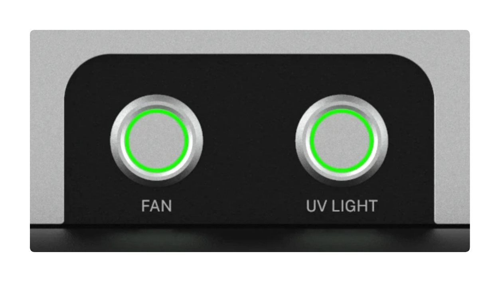

# Hardware Controls

Separate on/off buttons on the front of the HEPA/UV Module control the fan and UV lights. You can operate these systems simultaneously or independently of each other.

See the following table for the information on how to operate the HEPA and UV systems.

| Function | Operation |
|---|---|
| HEPA filtration on | Press **Fan** once. |
| HEPA filtration off | Press **Fan** again. |
| UV lights on | Press **UV Light** once. Do not turn on the lights during a protocol run. |
| UV lights off | Lights turn off automatically after 15 minutes. Or press **UV Light** again. |

Ring lights around the on/off buttons change colors to indicate the operational status of the HEPA fan and UV lights.

<table>
    <thead>
        <tr>
            <th width="20%">LED color</th>
            <th width="20%">LED pattern</th>
            <th>HEPA/UV status</th>
        </tr>
    </thead>
    <tbody>
        <tr>
            <td>White</td>
            <td>Solid</td>
            <td>Idle</td>
        </tr>
        <tr>
            <td rowspan="2">Green</td>
            <td>Solid</td>
            <td>Normal operation</td>
        </tr>
        <tr>
            <td>Pulse</td>
            <td>An operation cycle has been completed or canceled. Returns to white/idle state after pulse.</td>
        </tr>
        <tr>
            <td>Blue</td>
            <td>Solid</td>
            <td>Indicates user intervention required or an unsafe condition (e.g., the door opens while the UV lights are on).</td>
        </tr>
    </tbody>
</table>
