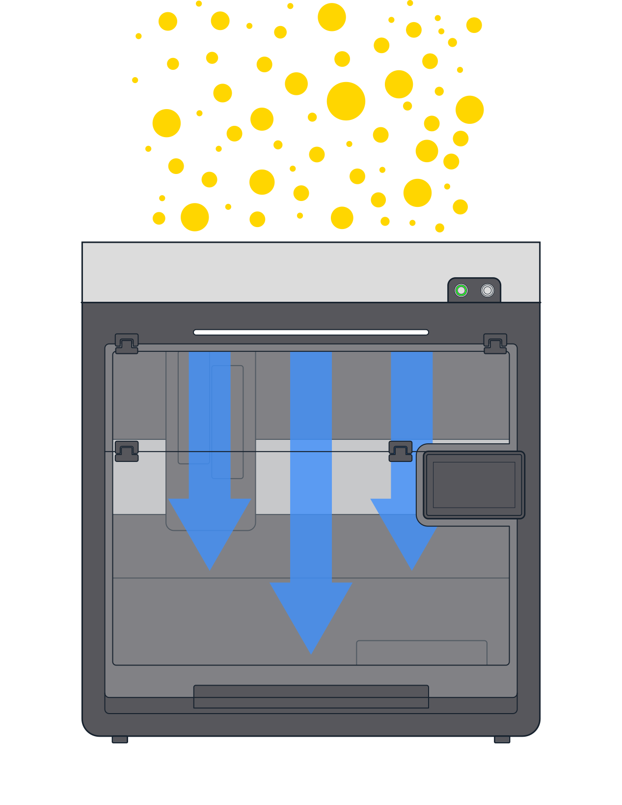

# HEPA Specifications

The Flex HEPA/UV Module uses a two-stage filtration system to purify air pulled into the enclosure. This system includes a reusable pre-filter and a disposable H14 HEPA main filter. The pre-filter traps large particles while the HEPA filter captures up to 99.99% of airborne particulate matter at ≥ 0.3 microns (μm). Vertical air flow from the HEPA filter creates a positive-pressure environment within the enclosure. This air boundary helps protect samples inside the Flex from external contamination. The air cleaning system of the Flex HEPA/UV Module meets ISO-5 clean bench standards.

<figure style="width: 50%;" markdown>

</figure>

## Filter Data

| Specification | Description |
|---|---|
| ISO clean bench standards | ISO-5 |
| Pre-filter | <ul><li>Metal mesh</li><li>Reusable</ul> |
| HEPA filter | <ul><li>Grade H14</li><li>99.99% efficiency for particles ≥ 0.3 μm</li><li>Disposable</ul> |
| HEPA filter lifetime | 3 years of use (~6,000 hours) |
| Ambient fan noise | ≤ 70 dB at 1 meter during fan operation |
