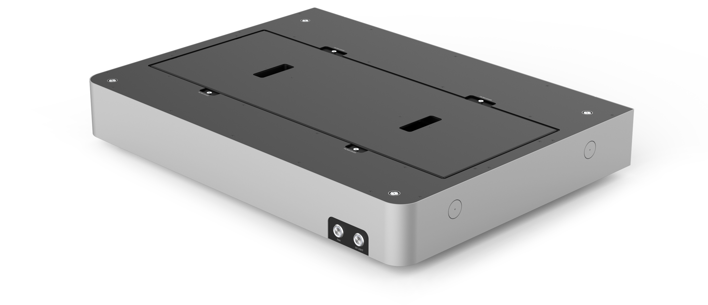

{style="width: 60%"}

# HEPA/UV Module Instruction Manual

**Opentrons Labworks Inc.**

July 2024

## Product description
The Opentrons Flex® HEPA/UV Module is a positive-pressure clean air and ultraviolet (UV) disinfectant accessory for the Flex liquid handling robot. It contains a mesh pre-filter, a HEPA filter, and two UV lights. Running the module’s filtration and lighting for 15 minutes creates an ISO-5 clean bench environment within the Flex enclosure.

Review this guide for information about the features of the HEPA/UV Module, including installation, maintenance, and warranty information.
