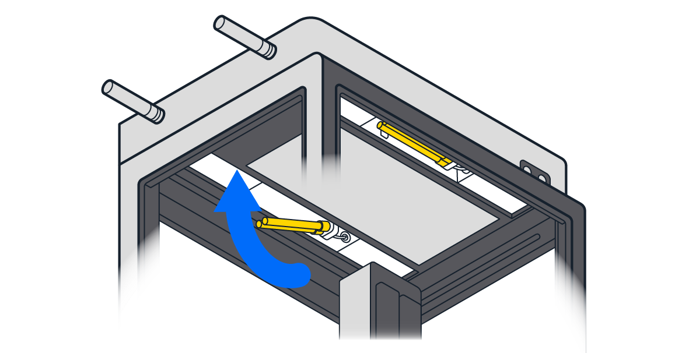

# Unboxing and installation

Ask a lab partner for help with unboxing, lifting, and attaching the module. For tools, you will need scissors and the 2.5 mm hex screwdriver that comes in the Module User Kit.

!!! note
    When attached, the HEPA/UV Module requires 20 cm (8″) of top and side clearance to operate properly.

## Unboxing

1. Open the box and remove the power cable.
    
2. Cut open the blue shipping bag. Remove the foam padding and the Module User Kit.
    
3. Remove the four aluminum handles from the Module User Kit. Screw the handles into the sides of the module. The bottom half of the box has side cutouts so you can attach the handles while the module is still in the box.
    

## Installation

4. Using the 2.5 mm hex screwdriver, remove the top window panel from your Flex. Store the window panel and screws in a safe place for future reassembly.
    
5. Working with a lab partner, lift the module from its box by the handles. Lower the module onto the top of the robot. Chamfered corner pins on the module help guide it into place.
    
6. Use the 2.5 mm hex screwdriver to tighten the module’s captive screws and fasten it to the robot.
    

    The HEPA/UV Module is attached properly when it sits flush with the top of the robot. There should be no gaps between the foam seal on the HEPA/UV Module and the robot.

7. Remove the UV bulbs from the Module User Kit. Unwrap and install them in recessed receptacles on the underside of the module.
    - If necessary, move the gantry to its home position at the back right. When Flex is powered off, the gantry should move easily by hand.
    - Each bulb has 4 prongs that fit into the power receptacle. Push the prongs into the receptacle.
    - Retaining clips hold the free ends of the bulbs in place. Press the bulbs gently until they snap into the clips.
    
8. Remove the carrying handles and replace them with the finishing caps. Fasten the caps using the 2.5 mm hex screwdriver. The caps close the handle openings and give the HEPA/UV Module a clean, finished appearance. Store the handles in the Module User Kit for future use.
    
9. Remove the M12 AUX cable from the Module User Kit. Attach the cord’s right-angle connector to the AUX port on the back of the HEPA/UV Module. Attach the other end to an AUX port on the back of the Flex.
    
10. Connect the power cord to the module and to a wall outlet.
11. Press the rear power switch to turn on the HEPA/UV Module. The ring lights around the on/off buttons should glow white.

With everything secure, connected, and powered on, your HEPA/UV Module is ready for use. This module does not require calibration.
