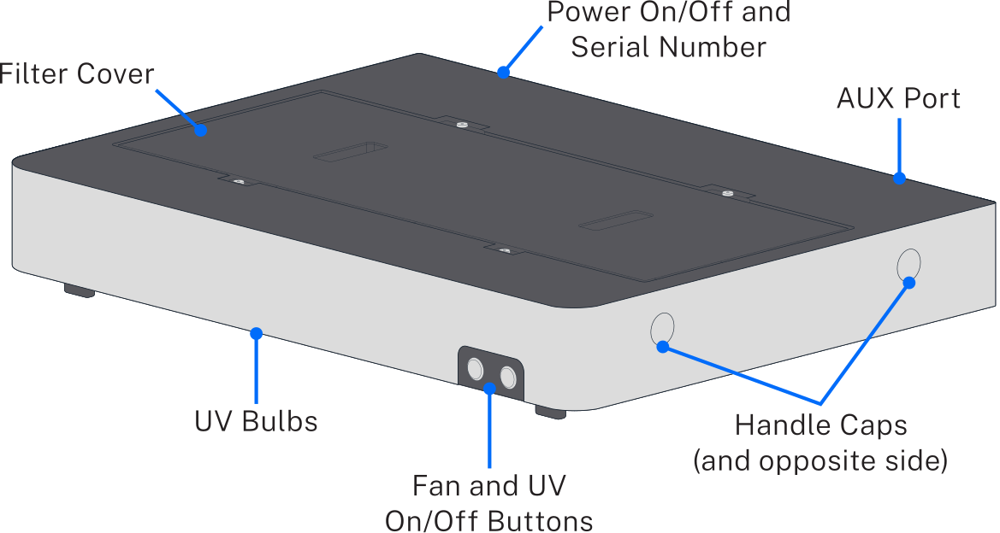
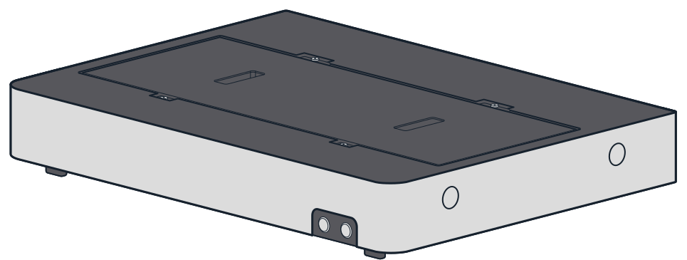
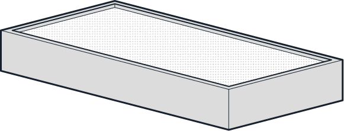
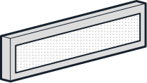
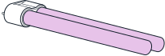
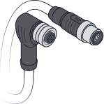
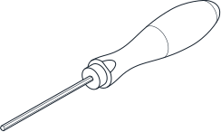
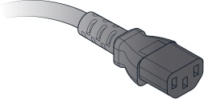
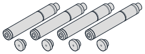

# Product Specifications

## Included parts

<figure>
  
  <figcaption>(1) HEPA/UV Module</figcaption>
</figure>

<figure>
  
  <figcaption>(1) HEPA Filter</figcaption>
</figure>

<figure>
  
  <figcaption>(1) Pre-Filter</figcaption>
</figure>

<figure>
  
  <figcaption>(2) UV Bulbs</figcaption>
</figure>

<figure>
  
  <figcaption>(1) M12 AUX Cable</figcaption>
</figure>

<figure>
  
  <figcaption>(1) 2.5 mm Hex Screwdriver</figcaption>
</figure>

<figure>
  
  <figcaption>(1) Power Cable</figcaption>
</figure>

<figure>
  
  <figcaption>(4 each) Carrying Handles and Caps</figcaption>
</figure>

## Physical specifications

| Specification | Details |
|---|---|
| Box dimensions | 102 cm L x 79 cm W x 25 cm H |
| Module dimensions | 87 cm L x 64 cm W x 14 cm H |
| Module weight | ~20 kg (42 lbs) |
| Operating space | 20 cm / 8” (minimum) of side and top clearance |

## Input and output connections

The HEPA/UV Module has the following power input requirements, which are met by the included power supply.

!!! warning
    Observe the following when handling the module power cable:

    - Always plug the power cable into a grounded outlet.
    - Make sure that the power cable is not obstructed, in case it needs to be disconnected.
    - Do not replace the power supply cable unless at the direction of Opentrons Support. This ensures that the power cable has adequate ratings for the equipment.

### Power specifications

| Specification | Details |
|---|---|
| Input | <ul><li>100–240 VAC, 50/60 Hz</li><li>2.2 A at 115 VAC</li><li>1.1 A at 230 VAC</li></ul> |
| Output | 24 VDC, 8.4 A, 201 W max |
| Mains supply voltage fluctuation | 100–240 VAC ±10% |
| Fuse type | T3.15 A, 250 V, 5×20 mm |

### Power consumption { #power-consumption-hepa-uv }

The power consumption specifications are measured with the UV lights and fan on.

- Typical power consumption: 75.5 W
- Peak power consumption: 160 W
