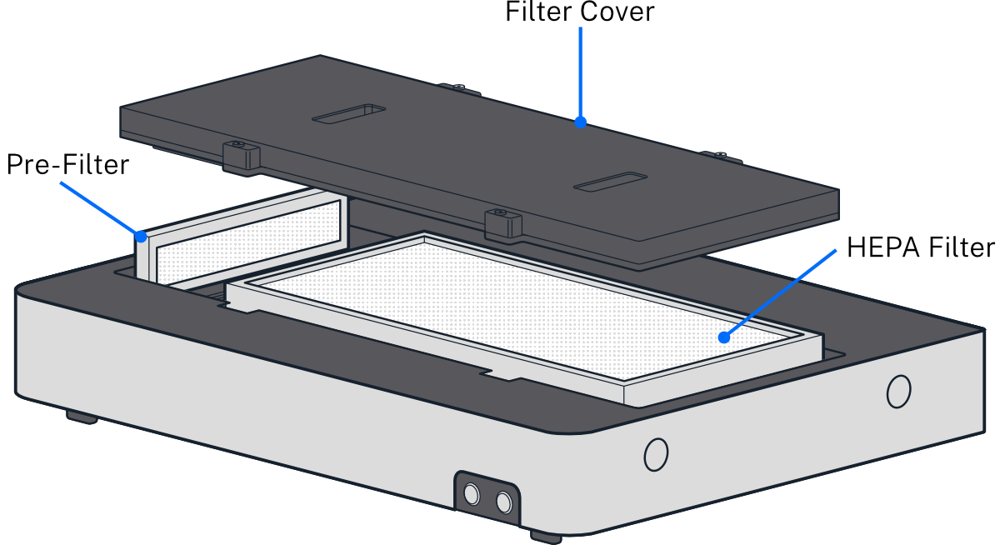
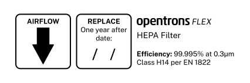

# Maintenance

Aside from replacing the UV bulbs and filters, users should not attempt to service or repair the HEPA/UV Module themselves. If you have concerns about the module’s performance or require maintenance, please [contact Opentrons Support](mailto:support@opentrons.com).

## Bulb replacement

The UV bulbs are user-replaceable items. To purchase a new bulb, [contact Opentrons Support](mailto:support@opentrons.com).

## Filter maintenance

You can clean and reuse the pre-filter but not the HEPA filter. Always replace your dirty HEPA filter with a fresh filter. To purchase a new set of filters, [contact Opentrons Support](mailto:support@opentrons.com).

To access, replace, and clean the filters:

1. Turn off power to the HEPA/UV Module.
2. Using the 2.5 mm hex screwdriver, loosen the captive screws that secure the filter panel to the top of the module. Lift the panel off the module and set it aside.
3. Remove the old HEPA filter and throw it away.
4. Install the new HEPA filter with the airflow direction arrow pointing down, towards the Flex enclosure, and write the replacement date on the filter label.
    <figure class="label" markdown>
    {style="width: 100%;"}
    </figure>
5. Remove the pre-filter and replace it with a fresh one. You can also clean the pre-filter with warm water or a mild detergent. Rinse and let it air dry before reinstalling.
6. Install the pre-filter with the airflow direction arrow pointing towards the HEPA filter.
7. Set the filter cover on top of the module and fasten the screws.
8. Turn the power on. Press the Fan button for 3 seconds to reset the filter status.

