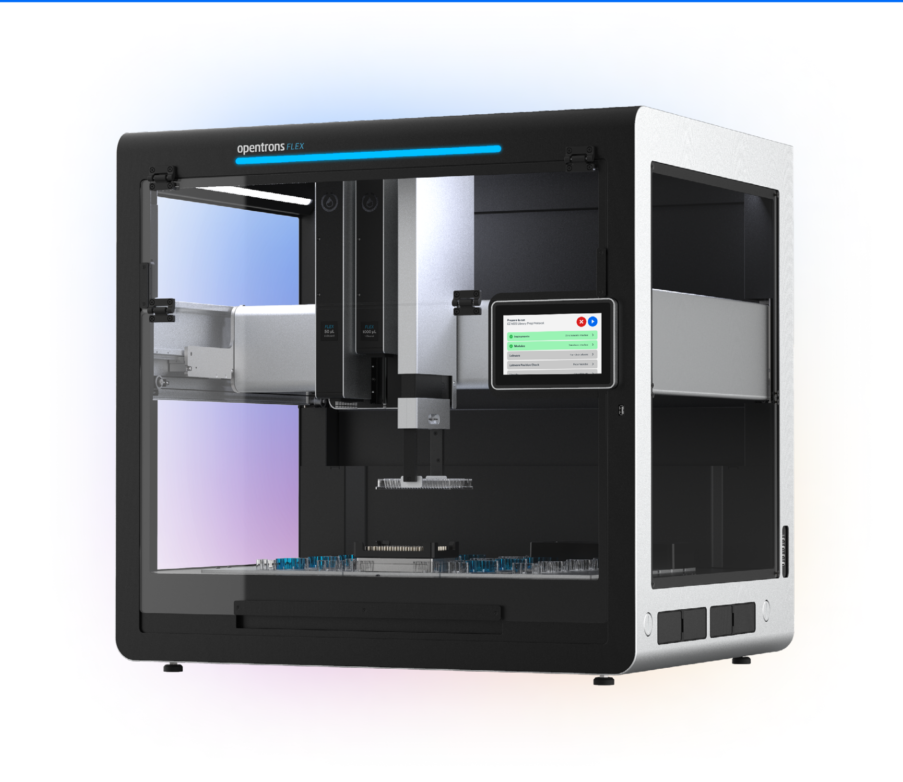{width="6.529166666666667in"
height="5.651441382327209in"}{width="4.1666666666666664e-2in"
height="5.555555555555555e-2in"}

{width="2.9166666666666665in"
height="0.5277777777777778in"}

  -----------------------------------------------------------------------
  Opentrons Flex
  -----------------------------------------------------------------------

  -----------------------------------------------------------------------

  -----------------------------------------------------------------------
  **Instruction Manual**
  -----------------------------------------------------------------------

  -----------------------------------------------------------------------

**Opentrons Labworks Inc.**

October 2024

> **© OPENTRONS 2024**\
> Opentrons FlexTM (Opentrons Labworks, Inc.)\
> Registered names, trademarks, etc. used in this document, even when
> not specifically marked as such, are not to be considered unprotected
> by law.

**Table of Contents**

**Preface . . . . . . . . . . . . . . . . . . . . . . . . . . . . . . .
. . . . . . . . . . . . . . . . . . . . . 9** Structure of this manual .
. . . . . . . . . . . . . . . . . . . . . . . . . . . . . . . . . . 9
Notes and warnings . . . . . . . . . . . . . . . . . . . . . . . . . . .
. . . . . . . . . . . . 10 **Chapter 1: Introduction . . . . . . . . . .
. . . . . . . . . . . . . . . . . . . . . . . . . . . . 11** 1.1 Welcome
to Opentrons Flex . . . . . . . . . . . . . . . . . . . . . . . . . . .
. 11 What's new in Flex . . . . . . . . . . . . . . . . . . . . . . . .
. . . . . . . . . . . . 11 Flex workstations . . . . . . . . . . . . . .
. . . . . . . . . . . . . . . . . . . . . . . 12 1.2 Safety information
. . . . . . . . . . . . . . . . . . . . . . . . . . . . . . . . . . . .
. 15 Safety symbols . . . . . . . . . . . . . . . . . . . . . . . . . .
. . . . . . . . . . . . . 15 Electrical safety warnings . . . . . . . .
. . . . . . . . . . . . . . . . . . . . . 16 Additional safety warnings
. . . . . . . . . . . . . . . . . . . . . . . . . . . . 17 Safety
cautions . . . . . . . . . . . . . . . . . . . . . . . . . . . . . . . .
. . . . . . . 17 Biological safety . . . . . . . . . . . . . . . . . . .
. . . . . . . . . . . . . . . . . . . 18 Toxic fumes . . . . . . . . . .
. . . . . . . . . . . . . . . . . . . . . . . . . . . . . . . . . 18
Flammable liquids . . . . . . . . . . . . . . . . . . . . . . . . . . .
. . . . . . . . . 18 1.3 Regulatory compliance . . . . . . . . . . . . .
. . . . . . . . . . . . . . . . . . . 19 Safety . . . . . . . . . . . .
. . . . . . . . . . . . . . . . . . . . . . . . . . . . . . . . . . . .
19 Electromagnetic compatibility . . . . . . . . . . . . . . . . . . . .
. . . . . 19 FCC warnings and notes . . . . . . . . . . . . . . . . . .
. . . . . . . . . . . . 19 Canada ISED compliance . . . . . . . . . . .
. . . . . . . . . . . . . . . . . . . 20 Environmental warning . . . . .
. . . . . . . . . . . . . . . . . . . . . . . . . . . 20 WEEE Policy . .
. . . . . . . . . . . . . . . . . . . . . . . . . . . . . . . . . . . .
. . . . 21 Wi-Fi precertification . . . . . . . . . . . . . . . . . . .
. . . . . . . . . . . . . . 21 **Chapter 2: Installation and Relocation
. . . . . . . . . . . . . . . . . . . . . . . 22** 2.1 Safety and
operating requirements . . . . . . . . . . . . . . . . . . . . . 22
Where to place Opentrons Flex . . . . . . . . . . . . . . . . . . . . .
. . . 22 Power consumption . . . . . . . . . . . . . . . . . . . . . . .
. . . . . . . . . . . . 24 Environmental conditions . . . . . . . . . .
. . . . . . . . . . . . . . . . . . . 25 Network Ports . . . . . . . . .
. . . . . . . . . . . . . . . . . . . . . . . . . . . . . . . 26 2.2
Unboxing . . . . . . . . . . . . . . . . . . . . . . . . . . . . . . . .
. . . . . . . . . . . . . 27 Effort and time required . . . . . . . . .
. . . . . . . . . . . . . . . . . . . . . . 27 Crate and packing
material . . . . . . . . . . . . . . . . . . . . . . . . . . . . 27
Product elements . . . . . . . . . . . . . . . . . . . . . . . . . . . .
. . . . . . . . . 28 Part 1: Remove the crate . . . . . . . . . . . . .
. . . . . . . . . . . . . . . . . . 29 Part 2: Release the Flex . . . .
. . . . . . . . . . . . . . . . . . . . . . . . . . . 31 Part 3: Final
assembly and power on . . . . . . . . . . . . . . . . . . . 34

2.3 First run . . . . . . . . . . . . . . . . . . . . . . . . . . . . .
. . . . . . . . . . . . . . . . . 36 Power on . . . . . . . . . . . . .
. . . . . . . . . . . . . . . . . . . . . . . . . . . . . . . . 36
Connect to a network or computer . . . . . . . . . . . . . . . . . . . .
. 37 Install software updates . . . . . . . . . . . . . . . . . . . . .
. . . . . . . . . . 38 Attach Emergency Stop Pendant . . . . . . . . . .
. . . . . . . . . . . . 39 Give your robot a name . . . . . . . . . . .
. . . . . . . . . . . . . . . . . . . . . 39 2.4 Instrument installation
and calibration . . . . . . . . . . . . . . . . . 39 Pipette
installation . . . . . . . . . . . . . . . . . . . . . . . . . . . . . .
. . . . . . 40 Gripper installation . . . . . . . . . . . . . . . . . .
. . . . . . . . . . . . . . . . . 41 2.5 Relocation . . . . . . . . . .
. . . . . . . . . . . . . . . . . . . . . . . . . . . . . . . . . . 41
Short moves . . . . . . . . . . . . . . . . . . . . . . . . . . . . . .
. . . . . . . . . . . . 42 Long-distance moves . . . . . . . . . . . . .
. . . . . . . . . . . . . . . . . . . . 42 General moving advice . . . .
. . . . . . . . . . . . . . . . . . . . . . . . . . . . 43 Final
thoughts about moving . . . . . . . . . . . . . . . . . . . . . . . . .
. 45 **Chapter 3: System Description . . . . . . . . . . . . . . . . . .
. . . . . . . . . . . . 46** 3.1 Physical components . . . . . . . . . .
. . . . . . . . . . . . . . . . . . . . . . . . 46 Frame and enclosure .
. . . . . . . . . . . . . . . . . . . . . . . . . . . . . . . . . 47
Deck and working area . . . . . . . . . . . . . . . . . . . . . . . . .
. . . . . . . 47 Staging area . . . . . . . . . . . . . . . . . . . . .
. . . . . . . . . . . . . . . . . . . . . 48 Deck fixtures . . . . . . .
. . . . . . . . . . . . . . . . . . . . . . . . . . . . . . . . . . 49
Waste chute . . . . . . . . . . . . . . . . . . . . . . . . . . . . . .
. . . . . . . . . . . . 50 Staging area slots . . . . . . . . . . . . .
. . . . . . . . . . . . . . . . . . . . . . . 50 Movement system . . . .
. . . . . . . . . . . . . . . . . . . . . . . . . . . . . . . . 52
Touchscreen and LED displays . . . . . . . . . . . . . . . . . . . . . .
. . 52 3.2 Pipettes . . . . . . . . . . . . . . . . . . . . . . . . . .
. . . . . . . . . . . . . . . . . . . . . 54 Pipette specifications . .
. . . . . . . . . . . . . . . . . . . . . . . . . . . . . . . 55 Pipette
calibration . . . . . . . . . . . . . . . . . . . . . . . . . . . . . .
. . . . . . 56 Pipette tip rack adapter . . . . . . . . . . . . . . . .
. . . . . . . . . . . . . . . 56 Partial tip pickup . . . . . . . . . .
. . . . . . . . . . . . . . . . . . . . . . . . . . . . 57 Pipette
sensors . . . . . . . . . . . . . . . . . . . . . . . . . . . . . . . .
. . . . . . . 57 Pipette firmware updates . . . . . . . . . . . . . . .
. . . . . . . . . . . . . . 58 3.3 Gripper . . . . . . . . . . . . . . .
. . . . . . . . . . . . . . . . . . . . . . . . . . . . . . . . 59
Gripper specifications . . . . . . . . . . . . . . . . . . . . . . . . .
. . . . . . . . 59 Gripper calibration . . . . . . . . . . . . . . . . .
. . . . . . . . . . . . . . . . . . . 59 Gripper firmware updates . . .
. . . . . . . . . . . . . . . . . . . . . . . . . . 60 3.4 Emergency
Stop Pendant . . . . . . . . . . . . . . . . . . . . . . . . . . . . . .
61 When to use the E-stop . . . . . . . . . . . . . . . . . . . . . . .
. . . . . . . . 61 Engaging and releasing the E-stop . . . . . . . . . .
. . . . . . . . . . 61 3.5 Connections . . . . . . . . . . . . . . . . .
. . . . . . . . . . . . . . . . . . . . . . . . . 63 Power connection .
. . . . . . . . . . . . . . . . . . . . . . . . . . . . . . . . . . . .
63

USB and auxiliary connections . . . . . . . . . . . . . . . . . . . . .
. . . 64 Network connections . . . . . . . . . . . . . . . . . . . . . .
. . . . . . . . . . . 64 3.6 System specifications . . . . . . . . . . .
. . . . . . . . . . . . . . . . . . . . . . 65 General specifications .
. . . . . . . . . . . . . . . . . . . . . . . . . . . . . . . 65
Environmental specifications . . . . . . . . . . . . . . . . . . . . . .
. . . . 66 Certifications . . . . . . . . . . . . . . . . . . . . . . .
. . . . . . . . . . . . . . . . . . 66 Serial number . . . . . . . . . .
. . . . . . . . . . . . . . . . . . . . . . . . . . . . . . 66 **Chapter
4: Modules . . . . . . . . . . . . . . . . . . . . . . . . . . . . . . .
. . . . . . . . . . 68** 4.1 Supported modules . . . . . . . . . . . . .
. . . . . . . . . . . . . . . . . . . . . . . 68 4.2 Module caddy system
. . . . . . . . . . . . . . . . . . . . . . . . . . . . . . . . . 69 4.3
Module calibration . . . . . . . . . . . . . . . . . . . . . . . . . . .
. . . . . . . . . 70 When to calibrate modules . . . . . . . . . . . . .
. . . . . . . . . . . . . . . 71 How to calibrate modules . . . . . . .
. . . . . . . . . . . . . . . . . . . . . . 71 4.4 Heater-Shaker Module
GEN1 . . . . . . . . . . . . . . . . . . . . . . . . . . 72
Heater-Shaker features . . . . . . . . . . . . . . . . . . . . . . . . .
. . . . . . 72 Heater-Shaker specifications . . . . . . . . . . . . . .
. . . . . . . . . . . . 74 4.5 Magnetic Block GEN1 . . . . . . . . . . .
. . . . . . . . . . . . . . . . . . . . . . 75 Magnetic Block features .
. . . . . . . . . . . . . . . . . . . . . . . . . . . . . 76 Magnetic
Block specifications . . . . . . . . . . . . . . . . . . . . . . . . .
76 4.6 Temperature Module GEN2 . . . . . . . . . . . . . . . . . . . . .
. . . . . . . 77 Temperature Module features . . . . . . . . . . . . . .
. . . . . . . . . . . 77 Temperature Module specifications . . . . . . .
. . . . . . . . . . . . . 79 4.7 Thermocycler Module GEN2 . . . . . . .
. . . . . . . . . . . . . . . . . . . . 79 Thermocycler features . . . .
. . . . . . . . . . . . . . . . . . . . . . . . . . . . 80 Thermocycler
specifications . . . . . . . . . . . . . . . . . . . . . . . . . . 81
**Chapter 5: Labware . . . . . . . . . . . . . . . . . . . . . . . . . .
. . . . . . . . . . . . . . . 82** 5.1 Labware concepts . . . . . . . .
. . . . . . . . . . . . . . . . . . . . . . . . . . . . . 82 Labware as
hardware . . . . . . . . . . . . . . . . . . . . . . . . . . . . . . . .
. 82 Labware as data . . . . . . . . . . . . . . . . . . . . . . . . . .
. . . . . . . . . . . . 82 Custom labware . . . . . . . . . . . . . . .
. . . . . . . . . . . . . . . . . . . . . . . 83 5.2 Reservoirs . . . .
. . . . . . . . . . . . . . . . . . . . . . . . . . . . . . . . . . . .
. . . . 84 Single-well reservoirs . . . . . . . . . . . . . . . . . . .
. . . . . . . . . . . . . . 84 Multi-well reservoirs . . . . . . . . . .
. . . . . . . . . . . . . . . . . . . . . . . . 84 Reservoirs and API
definitions . . . . . . . . . . . . . . . . . . . . . . . . . 85 Custom
reservoir labware . . . . . . . . . . . . . . . . . . . . . . . . . . .
. . 85 5.3 Well plates . . . . . . . . . . . . . . . . . . . . . . . . .
. . . . . . . . . . . . . . . . . . . 85 6-well plates . . . . . . . . .
. . . . . . . . . . . . . . . . . . . . . . . . . . . . . . . . . 86
12-well plates . . . . . . . . . . . . . . . . . . . . . . . . . . . . .
. . . . . . . . . . . . 86 24-well plates . . . . . . . . . . . . . . .
. . . . . . . . . . . . . . . . . . . . . . . . . 86 48-well plates . .
. . . . . . . . . . . . . . . . . . . . . . . . . . . . . . . . . . . .
. . 86

96-well plates . . . . . . . . . . . . . . . . . . . . . . . . . . . . .
. . . . . . . . . . . 87 384-well plates . . . . . . . . . . . . . . . .
. . . . . . . . . . . . . . . . . . . . . . . 88 Well plate adapters . .
. . . . . . . . . . . . . . . . . . . . . . . . . . . . . . . . . 89
Well plates and API definitions . . . . . . . . . . . . . . . . . . . .
. . . . 89 Custom well plate labware . . . . . . . . . . . . . . . . . .
. . . . . . . . . . 89 5.4 Tips and tip racks . . . . . . . . . . . . .
. . . . . . . . . . . . . . . . . . . . . . . . 90 Tip racks . . . . . .
. . . . . . . . . . . . . . . . . . . . . . . . . . . . . . . . . . . .
. . . 90 Tip--pipette compatibility . . . . . . . . . . . . . . . . . .
. . . . . . . . . . . . 91 Tip rack adapter . . . . . . . . . . . . . .
. . . . . . . . . . . . . . . . . . . . . . . . 91 5.5 Tubes and tube
racks . . . . . . . . . . . . . . . . . . . . . . . . . . . . . . . . .
. 92 Tube and rack combinations . . . . . . . . . . . . . . . . . . . .
. . . . . . . 93 6-tube racks . . . . . . . . . . . . . . . . . . . . .
. . . . . . . . . . . . . . . . . . . . . 93 10-tube racks . . . . . . .
. . . . . . . . . . . . . . . . . . . . . . . . . . . . . . . . . . 93
15-tube racks . . . . . . . . . . . . . . . . . . . . . . . . . . . . .
. . . . . . . . . . . . 94 24-tube racks . . . . . . . . . . . . . . . .
. . . . . . . . . . . . . . . . . . . . . . . . . 94 Tube rack API
definitions . . . . . . . . . . . . . . . . . . . . . . . . . . . . . .
94 Custom tube rack labware . . . . . . . . . . . . . . . . . . . . . .
. . . . . . 95 5.6 Aluminum blocks . . . . . . . . . . . . . . . . . . .
. . . . . . . . . . . . . . . . . . . 95 Flat bottom plate . . . . . . .
. . . . . . . . . . . . . . . . . . . . . . . . . . . . . . 95 24-well
aluminum block . . . . . . . . . . . . . . . . . . . . . . . . . . . . .
. 96 96-well aluminum block . . . . . . . . . . . . . . . . . . . . . .
. . . . . . . . 96 Standalone adapters . . . . . . . . . . . . . . . . .
. . . . . . . . . . . . . . . . . 96 Aluminum block labware combinations
. . . . . . . . . . . . . . . . 96 24-well aluminum block labware
combinations . . . . . . . . 97 96-well aluminum block labware
combinations . . . . . . . . 97 5.7 Labware and the Opentrons Flex
Gripper . . . . . . . . . . . . . . . 98 5.8 Custom labware definitions
. . . . . . . . . . . . . . . . . . . . . . . . . . . . 98 Creating
custom labware definitions . . . . . . . . . . . . . . . . . . . 99 JSON
labware schema . . . . . . . . . . . . . . . . . . . . . . . . . . . . .
. . . 101 JSON labware definitions . . . . . . . . . . . . . . . . . . .
. . . . . . . . . . . 106 **Chapter 6: Protocol Development . . . . . .
. . . . . . . . . . . . . . . . . . . . . 107** 6.1 Pre-made protocols .
. . . . . . . . . . . . . . . . . . . . . . . . . . . . . . . . . . .
107 Protocol Library . . . . . . . . . . . . . . . . . . . . . . . . . .
. . . . . . . . . . . . 107 Custom Protocol Development service . . . .
. . . . . . . . . . . . . 109 6.2 Protocol Designer . . . . . . . . . .
. . . . . . . . . . . . . . . . . . . . . . . . . . . 111 Protocol
Designer requirements . . . . . . . . . . . . . . . . . . . . . . . 111
Designing a protocol . . . . . . . . . . . . . . . . . . . . . . . . . .
. . . . . . . . 112 Modifying existing protocols . . . . . . . . . . . .
. . . . . . . . . . . . . . 116 6.3 Python Protocol API . . . . . . . .
. . . . . . . . . . . . . . . . . . . . . . . . . . . 117 Writing and
running scripts . . . . . . . . . . . . . . . . . . . . . . . . . . .
117

Python-exclusive features . . . . . . . . . . . . . . . . . . . . . . .
. . . . . . 118 6.4 OT-2 protocols . . . . . . . . . . . . . . . . . . .
. . . . . . . . . . . . . . . . . . . . . 119 OT-2 Python protocols . .
. . . . . . . . . . . . . . . . . . . . . . . . . . . . . . 120 OT-2
JSON protocols . . . . . . . . . . . . . . . . . . . . . . . . . . . . .
. . . . . 122 Magnetic Module protocols . . . . . . . . . . . . . . . .
. . . . . . . . . . . 122 **Chapter 7: Software and Operation . . . . .
. . . . . . . . . . . . . . . . . . . . 123** 7.1 Touchscreen operation
. . . . . . . . . . . . . . . . . . . . . . . . . . . . . . . . . 123
Robot dashboard . . . . . . . . . . . . . . . . . . . . . . . . . . . .
. . . . . . . . . . 123 Protocol management . . . . . . . . . . . . . .
. . . . . . . . . . . . . . . . . . . 124 Protocol details . . . . . . .
. . . . . . . . . . . . . . . . . . . . . . . . . . . . . . . . 126 Run
setup . . . . . . . . . . . . . . . . . . . . . . . . . . . . . . . . .
. . . . . . . . . . . 130 Runtime parameters . . . . . . . . . . . . . .
. . . . . . . . . . . . . . . . . . . . 132 Using CSV data . . . . . . .
. . . . . . . . . . . . . . . . . . . . . . . . . . . . . . . . 132
Confirming runtime parameters . . . . . . . . . . . . . . . . . . . . .
. . 133 Labware Position Check . . . . . . . . . . . . . . . . . . . . .
. . . . . . . . . . 133 Run progress . . . . . . . . . . . . . . . . . .
. . . . . . . . . . . . . . . . . . . . . . . 135 Error recovery . . . .
. . . . . . . . . . . . . . . . . . . . . . . . . . . . . . . . . . . .
136 Run completion . . . . . . . . . . . . . . . . . . . . . . . . . . .
. . . . . . . . . . . . 137 Quick Transfer . . . . . . . . . . . . . . .
. . . . . . . . . . . . . . . . . . . . . . . . . 138 Instrument
management . . . . . . . . . . . . . . . . . . . . . . . . . . . . . .
143 Robot settings . . . . . . . . . . . . . . . . . . . . . . . . . . .
. . . . . . . . . . . . . 144 Deck configuration . . . . . . . . . . . .
. . . . . . . . . . . . . . . . . . . . . . . . 147 7.2 Opentrons App .
. . . . . . . . . . . . . . . . . . . . . . . . . . . . . . . . . . . .
. . . 150 App installation . . . . . . . . . . . . . . . . . . . . . . .
. . . . . . . . . . . . . . . . 150 Transferring protocols to Flex . . .
. . . . . . . . . . . . . . . . . . . . . . 151 Module status and
controls . . . . . . . . . . . . . . . . . . . . . . . . . . . . 153
Recent protocol runs . . . . . . . . . . . . . . . . . . . . . . . . . .
. . . . . . . . 154 7.3 Advanced operation . . . . . . . . . . . . . . .
. . . . . . . . . . . . . . . . . . . . 155 Jupyter Notebook . . . . . .
. . . . . . . . . . . . . . . . . . . . . . . . . . . . . . . 155
Command-line operation over SSH . . . . . . . . . . . . . . . . . . . .
156 **Chapter 8: Maintenance and Service . . . . . . . . . . . . . . . .
. . . . . . . . 158** 8.1 Cleaning your Flex . . . . . . . . . . . . . .
. . . . . . . . . . . . . . . . . . . . . . . 158 Before you begin . . .
. . . . . . . . . . . . . . . . . . . . . . . . . . . . . . . . . . .
158 What you can clean . . . . . . . . . . . . . . . . . . . . . . . . .
. . . . . . . . . . 158 Cleaning solutions . . . . . . . . . . . . . . .
. . . . . . . . . . . . . . . . . . . . . 159 Frame and window panel
cleaning . . . . . . . . . . . . . . . . . . . . . 159 Deck cleaning . .
. . . . . . . . . . . . . . . . . . . . . . . . . . . . . . . . . . . .
. . 159 Gantry cleaning . . . . . . . . . . . . . . . . . . . . . . . .
. . . . . . . . . . . . . . . 160 Waste chute cleaning . . . . . . . . .
. . . . . . . . . . . . . . . . . . . . . . . . 160 8.2 Cleaning
pipettes and tips . . . . . . . . . . . . . . . . . . . . . . . . . . .
. . 160

Pipette decontamination . . . . . . . . . . . . . . . . . . . . . . . .
. . . . . . 161 Cleaning pipette tips . . . . . . . . . . . . . . . . .
. . . . . . . . . . . . . . . . . 162 8.3 Cleaning the gripper . . . . .
. . . . . . . . . . . . . . . . . . . . . . . . . . . . . 163 8.4
Cleaning modules . . . . . . . . . . . . . . . . . . . . . . . . . . . .
. . . . . . . . . 164 General module cleaning . . . . . . . . . . . . .
. . . . . . . . . . . . . . . . . 164 Thermocycler seals . . . . . . . .
. . . . . . . . . . . . . . . . . . . . . . . . . . . 165 8.5
Autoclave-safe labware . . . . . . . . . . . . . . . . . . . . . . . . .
. . . . . . 165 8.6 Servicing Flex . . . . . . . . . . . . . . . . . . .
. . . . . . . . . . . . . . . . . . . . . . 166 Opentrons services . . .
. . . . . . . . . . . . . . . . . . . . . . . . . . . . . . . . 166
Installation qualification and operation qualification . . . . 166
Preventative maintenance . . . . . . . . . . . . . . . . . . . . . . . .
. . . . . 167 Warranty . . . . . . . . . . . . . . . . . . . . . . . . .
. . . . . . . . . . . . . . . . . . . . 168 **Appendix A: Glossary . . .
. . . . . . . . . . . . . . . . . . . . . . . . . . . . . . . . . . .
169 Appendix B: Additional Documentation . . . . . . . . . . . . . . . .
. . . . . 181** B.1 Opentrons Knowledge Hub . . . . . . . . . . . . . .
. . . . . . . . . . . . . . 181 B.2 Python Protocol API documentation .
. . . . . . . . . . . . . . . . . . 181 B.3 Opentrons HTTP API reference
. . . . . . . . . . . . . . . . . . . . . . . . 182 B.4 Developer
documentation . . . . . . . . . . . . . . . . . . . . . . . . . . . . .
182 **Appendix C: Open-Source Software . . . . . . . . . . . . . . . . .
. . . . . . . 183** C.1 Opentrons on GitHub . . . . . . . . . . . . . .
. . . . . . . . . . . . . . . . . . . . 183 Releases . . . . . . . . . .
. . . . . . . . . . . . . . . . . . . . . . . . . . . . . . . . . . .
183 Opening issues . . . . . . . . . . . . . . . . . . . . . . . . . . .
. . . . . . . . . . . . 184 Contributing code . . . . . . . . . . . . .
. . . . . . . . . . . . . . . . . . . . . . . . 184 Open-source licenses
. . . . . . . . . . . . . . . . . . . . . . . . . . . . . . . . . 184
C.2 Opentrons monorepo . . . . . . . . . . . . . . . . . . . . . . . . .
. . . . . . . . . 184 C.3 Other repositories . . . . . . . . . . . . . .
. . . . . . . . . . . . . . . . . . . . . . . 186 **Appendix D: Support
and Contact Information . . . . . . . . . . . . . . . 187** D.1 Sales .
. . . . . . . . . . . . . . . . . . . . . . . . . . . . . . . . . . . .
. . . . . . . . . . . . . 187 D.2 Support . . . . . . . . . . . . . . .
. . . . . . . . . . . . . . . . . . . . . . . . . . . . . . . . 187 D.3
Business information . . . . . . . . . . . . . . . . . . . . . . . . . .
. . . . . . . . 188

**Preface**

Welcome to the instruction manual for the Opentrons Flex liquid handling
robot. This manual guides you through just about everything you need to
know to set up and use Flex, focusing on topics that are most relevant
to everyday users of Flex in a lab environment.

**Structure of this manual**

Opentrons Flex is a complex system, so there are many different paths to
learning everything it can do. Feel free to jump straight to the chapter
that addresses whatever topic you're curious about! For example, if you
already have a Flex set up in your lab, you can skip past the
Installation and Relocation chapter.

If you prefer a guided approach, this manual is structured so you can
follow it from beginning to end.

> **Learn about Flex.** The distinguishing features of Flex are listed
> in [Chapter 1: Introduction]{.underline}. The introduction also
> includes important safety and regulatory information.
>
> **Get started with Flex.** If you need to set up your Flex, follow the
> detailed instructions in [Chapter 2: Installation and
> Relocation]{.underline}. Then familiarize yourself with the components
> of Flex in [Chapter 3: System Description]{.underline}.
>
> **Set up your deck.** Configuring the deck enables different
> scientific applications on Flex. [Chapter 4: Modules]{.underline}
> describes Opentrons peripherals that you can install into or on top of
> the deck to perform specific scientific tasks. [Chapter 5:
> Labware]{.underline} explains how to work with equipment for holding
> liquids.
>
> **Run a protocol.** The core use of Flex is running standardized
> scientific procedures, known as protocols. [Chapter 6: Protocol
> Development]{.underline} offers several ways to get ready-made
> protocols or design them yourself. To run your protocol, follow the
> instructions in [Chapter 7: Software and Operation]{.underline}, which
> also has instructions for performing other tasks and customizing your
> robot's settings.
>
> **Keep Flex running.** Follow the advice in [Chapter 8: Maintenance
> and Service]{.underline} to keep your Flex clean and running
> optimally. Or sign up for one of the Opentrons services listed there
> and let us take care of Flex for you.
>
> **Learn even more.** Still need something else? Consult the
> appendices.
>
> [Appendix A: Glossary]{.underline} defines Flex-related terms.
>
> [Appendix B: Additional Documentation]{.underline} points you to even
> more resources for Opentrons products and writing code to control
> Flex.

OPENTRONS FLEX 9

{width="3.9027777777777777in"
height="0.8055555555555556in"}{width="3.9027777777777777in"
height="0.8055555555555556in"}

> PREFACE
>
> [Appendix C: Open-Source Software]{.underline} explains how Opentrons
> software is hosted on GitHub as a resource for both developers and
> non-developers.
>
> [Appendix D: Support and Contact Information]{.underline} lists how to
> get in touch with Opentrons if you need assistance beyond what our
> documentation provides.

**Notes and warnings**

Throughout this manual, you'll find specially formatted note and warning
blocks. Notes provide helpful information that may not be obvious in the
ordinary course of using Flex. Pay special attention to warnings---they
are only used in situations where you run the risk of personal injury,
damage to equipment, loss or spoilage of samples or reagents, data loss,
or other harm.

Notes and warnings look like this:

> **Sample Note:** This is something you ought to\
> know, but it doesn't pose any danger.
>
> **Sample Warning:** This is something you need to\
> know because there is risk associated with it.

10 OPENTRONS FLEX

> CHAPTER 1\
> **Introduction**
>
> This chapter introduces you to the Opentrons Flex ecosystem, including
> the overall system design and available workstation configurations. It
> also includes important compliance and safety information, which you
> should review before setting up your Opentrons Flex robot. For more
> details on the features of Opentrons Flex, see the [System Description
> chapter]{.underline}.
>
> **1.1 Welcome to Opentrons Flex**
>
> Opentrons Flex is a liquid-handling robot designed for high throughput
> and complex workflows. The Flex robot is the base of a modular system
> that includes pipettes, a labware gripper, deck fixtures, on-deck
> modules, and labware --- all of which you can swap out yourself. Flex
> is designed with a touchscreen so you can work with it directly at the
> lab bench, or you can control it from across your lab with the
> Opentrons App or our open-source APIs.

Flex workstations come with all of the equipment --- robot, hardware,
and labware --- that you need to get started automating common lab
tasks. For other applications, Opentrons Flex runs on fully open-source

> software and firmware, and is reagent-run your protocols.
>
> What's new in Flex
>
> and labware-agnostic, giving you control over how you design and
>
> Opentrons Flex is part of the Opentrons liquid handler series of
> robots. Users of Opentrons Flex may be familiar with the Opentrons
> OT-2, our personal pipetting robot. Flex goes beyond the capabilities
> of OT-2 in several key areas, delivering higher throughput and
> walkaway time.

+-----------------------------------+-----------------------------------+
| > **Feature**                     | > **Description**                 |
+===================================+===================================+
| > **Pipette throughput**          | > Flex pipettes have 1, 8, or 96  |
|                                   | > channels. The 96-channel        |
|                                   | > pipette                         |
+-----------------------------------+-----------------------------------+

> operates on 12 times as many wells at once as the largest OT-2
> pipette.

+-----------------------------------+-----------------------------------+
| > **Pipette and tip capacities**  | > Flex pipettes have larger       |
|                                   | > volume ranges (1--50 µL,        |
|                                   | > 5--1000 µL) and                 |
+===================================+===================================+
+-----------------------------------+-----------------------------------+

> can all work with any volume of Opentrons Flex tips. This is an\
> improvement over OT-2 pipettes, which have smaller ranges and must use
> tips with a matching volume range.

+-----------------------------------+-----------------------------------+
| > OPENTRONS FLEX                  | 11                                |
+===================================+===================================+
+-----------------------------------+-----------------------------------+

> CHAPTER 1: INTRODUCTION

+-----------------------------------+-----------------------------------+
| > **Gripper**                     | > The Opentrons Flex Gripper      |
|                                   | > picks up and moves labware      |
|                                   | > around the                      |
+===================================+===================================+
+-----------------------------------+-----------------------------------+

> deck automatically, without user intervention. The gripper enables
> more complex workflows within a single protocol run.

+-----------------------------------+-----------------------------------+
| > **Automated calibration**       | > Positional calibration of Flex  |
|                                   | > pipettes and the gripper is     |
|                                   | > fully                           |
+===================================+===================================+
+-----------------------------------+-----------------------------------+

> automated. Press one button, and the instrument will move to
> precision-machined points on the deck to determine its exact position,
> saving that data for use in your protocols.

+-----------------------------------+-----------------------------------+
| > **Touchscreen**                 | > Flex has its own touchscreen    |
|                                   | > interface that lets you control |
|                                   | > it directly,                    |
+===================================+===================================+
+-----------------------------------+-----------------------------------+

> in addition to using the Opentrons App. Use the touchscreen to start
> protocol runs, check job status, and change settings right on the
> robot.

+-----------------------------------+-----------------------------------+
| > **Module caddies**              | > Flex modules fit into caddies   |
|                                   | > that occupy space below the     |
|                                   | > deck.                           |
+===================================+===================================+
+-----------------------------------+-----------------------------------+

> Caddies place your labware closer to the deck surface and allow for
> below-deck cable routing. Caddies enable even more module and labware
> configurations on the deck.

+-----------------------------------+-----------------------------------+
| > **Deck slot coordinates**       | Deck slots on Flex are numbered   |
|                                   | with a coordinate system (A1--D4) |
+===================================+===================================+
+-----------------------------------+-----------------------------------+

which is similar to how wells are numbered on labware.

+-----------------------------------+-----------------------------------+
| > **Movable trash**               | > The trash bin can go in         |
|                                   | > multiple deck locations on      |
|                                   | > Flex. The default               |
+===================================+===================================+
+-----------------------------------+-----------------------------------+

> location (slot A3) is the recommended position. You can also use the
> gripper to dispose of trash in the optional waste chute.

+-----------------------------------+-----------------------------------+
| > **Size and weight**             | > Flex is a bit bigger and much   |
|                                   | > heavier than OT-2. Installation |
|                                   | > tasks on                        |
+===================================+===================================+
+-----------------------------------+-----------------------------------+

Flex require the assistance of a lab partner.

> A detailed is available on the Opentrons website.
>
> Both Flex and OT-2 robots run on our open-source software, and the
> Opentrons App can control both types of robots at once. While OT-2
> protocols can't be run directly on Flex, it's straightforward to adapt
> them (see the [OT-2 Protocols section]{.underline} of the Protocol
> Development chapter for details).
>
> Flex workstations
>
> Opentrons Flex workstations include the Flex robot, accessories,
> pipettes and gripper, on-deck modules, and labware needed to automate
> a particular application. All workstation components are modular. If
> you need to change applications, you can add or swap in other Flex
> hardware and compatible consumables.
>
> 12 OPENTRONS FLEX
>
> CHAPTER 1: INTRODUCTION

NGS WORKSTATION

The Opentrons Flex NGS Workstation automates NGS library prep. It can
automate pre-sequencing

workflows using any leading reagent system, including
fragmentation-library prep.

In addition to the Flex robot, the NGS Workstation includes:

> Gripper\
> Choice of pipette configuration\
> Two 8-Channel Pipettes (1--50 µL and 5--1000 µL) 96-Channel Pipette
> (5--1000 µL)\
> Waste Chute\
> Magnetic Block\
> Temperature Module\
> Thermocycler Module
>
> and tagmentation-based
>
> Labware kit with filter tips, microcentrifuge tubes, reservoirs, and
> PCR plates

PCR WORKSTATION

The Opentrons Flex PCR Workstation automates PCR setup and thermocycling
workflows for up to 96 samples. It can aliquot chilled reagents and
samples into a 96-well PCR plate. With the addition of the automated
Thermocycler Module, use the gripper to load the plate into the
Thermocycler, and then run your chosen PCR program.

In addition to the Flex robot, the PCR Workstation includes:

> Gripper\
> Choice of pipette configuration\
> 1-Channel Pipette (1--50 µL) and 8-Channel Pipette (1--50 µL)\
> 96-Channel Pipette (5--1000 µL)\
> Waste Chute\
> Temperature Module\
> Labware kit with filter tips, microcentrifuge tubes, reservoirs, and
> PCR plates

OPENTRONS FLEX 13

> CHAPTER 1: INTRODUCTION

NUCLEIC ACID EXTRACTION WORKSTATION

The Opentrons Flex Nucleic Acid Extraction Workstation automates DNA/RNA
isolation and purification. It uses the Magnetic Block for separation of
magnetic beads, and the Heater-Shaker for sample lysis and resuspension
of magnetic beads.

In addition to the Flex robot, the Nucleic Acid Extraction Workstation
includes:

> Gripper\
> Choice of pipette configuration\
> 1-Channel Pipette (5--1000 µL) and 8-Channel Pipette (5--1000 µL)
> 96-Channel Pipette (5--1000 µL)\
> Waste Chute\
> Magnetic Block\
> Heater-Shaker Module\
> Labware kit with filter tips, reservoirs, PCR plates, and deep well
> plates

MAGNETIC BEAD PROTEIN PURIFICATION WORKSTATION

The Opentrons Flex Magnetic Bead Protein Purification Workstation
automates small-scale protein purification and proteomics sample prep
for up to 96 samples. It is compatible with many popular
magnetic-bead-based reagents.

In addition to the Flex robot, the Protein Purification Workstation
includes:

> Gripper\
> Choice of pipette configuration\
> 1-Channel Pipette (5--1000 µL) and 8-Channel Pipette (5--1000 µL)
> 96-Channel Pipette (5--1000 µL)\
> Waste Chute\
> Magnetic Block\
> Heater-Shaker Module\
> Labware kit with filter tips, reservoirs, PCR plates, and deep well
> plates

14 OPENTRONS FLEX

> CHAPTER 1: INTRODUCTION
>
> **1.2 Safety information**
>
> The Opentrons Flex liquid handling robot has been designed for safe
> operation. Refer to the specifications and compliance guidelines in
> this section to ensure safe usage of your Flex. These guidelines cover
> safe use of input and output connections for the product, including
> the power and data connections, as well as warning labels found on the
> Flex robot and related hardware. Using the device in a manner other
> than those specified in this manual may put the user and equipment at
> risk.
>
> Safety symbols
>
> Various labels on the Flex and in this manual warn you about sources
> of potential injury or harm.

+-----------------------+-----------------------+-----------------------+
| > **Symbol**          | > **Description**     |                       |
+=======================+=======================+=======================+
| {width=" |                       |                       |
| 0.5208333333333334in" |                       |                       |
| height="0.525in"}     |                       |                       |
+-----------------------+-----------------------+-----------------------+
|                       | > Potentially         |                       |
|                       | > hazardous           |                       |
|                       | > conditions.         |                       |
+-----------------------+-----------------------+-----------------------+
|                       | > Actions that may    |                       |
|                       | > result in personal  |                       |
|                       | > injury or death.    |                       |
+-----------------------+-----------------------+-----------------------+
| {width=" |                       |                       |
| 0.5208333333333334in" |                       |                       |
| height="0             |                       |                       |
| .5236111111111111in"} |                       |                       |
+-----------------------+-----------------------+-----------------------+
|                       | > Damage to the       |                       |
|                       | > equipment.          |                       |
+-----------------------+-----------------------+-----------------------+
|                       | > Lost or corrupted   |                       |
|                       | > data.               |                       |
+-----------------------+-----------------------+-----------------------+
|                       | > Unrecoverable       |                       |
|                       | > interruption of the |                       |
|                       | > operation being     |                       |
|                       | > performed.          |                       |
+-----------------------+-----------------------+-----------------------+
| {width=" | > components that     |                       |
| 0.5277777777777778in" | > might pose a risk   |                       |
| height="0             | > of                  |                       |
| .5277777777777778in"} |                       |                       |
+-----------------------+-----------------------+-----------------------+
|                       | > electrical shock if |                       |
|                       | > the instrument is   |                       |
|                       | > handled improperly. |                       |
+-----------------------+-----------------------+-----------------------+
| {width=" | > components that     |                       |
| 0.5472222222222223in" | > pose a risk of      |                       |
| height="0.            | > personal injury     |                       |
| 48194444444444445in"} |                       |                       |
+-----------------------+-----------------------+-----------------------+
|                       | > due to high         |                       |
|                       | > heat/temperatures   |                       |
|                       | > if the instrument   |                       |
|                       | > is handled          |                       |
|                       | > improperly.         |                       |
+-----------------------+-----------------------+-----------------------+
| {width=" | pose a risk of        |                       |
| 0.5402766841644795in" | personal              |                       |
| height="0.            |                       |                       |
| 47638888888888886in"} |                       |                       |
+-----------------------+-----------------------+-----------------------+
|                       | > injury when in      |                       |
|                       | > motion.             |                       |
+-----------------------+-----------------------+-----------------------+
| > OPENTRONS FLEX      |                       | 15                    |
+-----------------------+-----------------------+-----------------------+

> CHAPTER 1: INTRODUCTION
>
> You will find the following labels on the Flex:
>
> Intellectual property labels\
> Regulatory compliance labels (e.g., )\
> Electrical hazard labels\
> General warning labels\
> Product labels\
> Pinch point labels\
> High voltage labels\
> Power rating labels
>
> Electrical safety warnings
>
> Always observe the following electrical safety warnings:

+-----------------------------------+-----------------------------------+
| > **Symbol**                      | > **Description**                 |
+===================================+===================================+
| {width="0.520832239720035in" | > Connection section]{.underline} |
| height="0.5236100174978128in"}    | > in the System Description       |
|                                   | > chapter.                        |
+-----------------------------------+-----------------------------------+

> Do not connect (plug in), disconnect (unplug), or use AC power cables
> if:

+-----------------------------------+-----------------------------------+
| > {width="0.5277777777777778in" | Other attached cables, cords, or  |
| > height="0.5277777777777778in"}  | receptacles are frayed or         |
|                                   | damaged.                          |
|                                   |                                   |
|                                   | Using damaged power cords can     |
|                                   | cause an electric shock hazard    |
|                                   | resulting in                      |
+===================================+===================================+
+-----------------------------------+-----------------------------------+

> serious injury or damage to the robot.

+-----------------------------------+-----------------------------------+
| {width="0.520832239720035in" | > of Opentrons Support.           |
| height="0.525in"}                 |                                   |
+===================================+===================================+
+-----------------------------------+-----------------------------------+

> For more information on electrical requirements, see the [Power
> Consumption section]{.underline} of the Installation and Relocation
> chapter.
>
> 16 OPENTRONS FLEX
>
> CHAPTER 1: INTRODUCTION
>
> Additional safety warnings
>
> Always observe the following additional safety warnings:

+-----------------------------------+-----------------------------------+
| > **Symbol**                      | > **Description**                 |
+===================================+===================================+
| {width="0.520832239720035in" | or flammable liquids.             |
| height="0.525in"}                 |                                   |
|                                   | > Do not load plates, tubes, or   |
|                                   | > vials containing explosive or   |
|                                   | > flammable liquids into the      |
|                                   | > robot or otherwise operate the  |
|                                   | > instrument with explosive or    |
|                                   | > flammable liquids               |
+-----------------------------------+-----------------------------------+

> in the enclosure.

+-----------------------------------+-----------------------------------+
| {width="0.520832239720035in" | > precautions when working with   |
| height="0.525in"}                 | > chemicals. Opentrons is not     |
|                                   | > responsible or liable for any   |
|                                   | > damages because of, or as a     |
|                                   | > result of, the use of hazardous |
|                                   | > chemicals.                      |
+===================================+===================================+
| . As a result, it requires  |
| .png){width="0.520832239720035in" | > two people to lift and move it  |
| height="0.525in"}                 | > safely. See the [Relocation     |
|                                   | > section]{.underline} in the     |
|                                   | > Installation and Relocation     |
|                                   | > chapter.                        |
+-----------------------------------+-----------------------------------+
| {width="0.520832239720035in" | > its weight of 88.5 kg (195 lbs) |
| height="0.525in"}                 | > with sufficient surface area to |
|                                   | > accommodate the robot plus its  |
|                                   | > minimum clearance distance (20  |
|                                   | > cm/8 in). See the [Safety and   |
|                                   | > Operating Requirements          |
|                                   | > section]{.underline} in the     |
|                                   | > Installation and Relocation     |
|                                   | > chapter.                        |
+-----------------------------------+-----------------------------------+
| {width="0.520832239720035in" | > robot on a surface that is      |
| height="0.525in"}                 | > sturdy, level, and              |
|                                   | > water-resistant with            |
|                                   | > cross-bracing or welded joints. |
|                                   | > See the [Safety and Operating   |
|                                   | > Requirements                    |
|                                   | > section]{.underline} in the     |
|                                   | > Installation and Relocation     |
+-----------------------------------+-----------------------------------+

> chapter.
>
> Safety cautions
>
> To help protect the Flex from damage, follow these precautions:
>
> CHAPTER 1: INTRODUCTION

+-----------------------------------+-----------------------------------+
| > **Symbol**                      | > **Description**                 |
+===================================+===================================+
+-----------------------------------+-----------------------------------+

+-----------------------------------+-----------------------------------+
| {width="0.5208333333333334in" | > by Opentrons. See the [Labware  |
| height="0.525in"}                 | > chapter]{.underline}.           |
+===================================+===================================+
| {width="0.5208333333333334in" | > materials away from the robot.  |
| height="0.525in"}                 |                                   |
+-----------------------------------+-----------------------------------+

> Biological safety
>
> Treat specimens and reagents containing materials taken from humans as
> potentially infectious agents. Opentrons recommends using safe
> laboratory procedures as explained in .
>
> Under normal circumstances, the Flex does not create detectable
> aerosols from source liquids. However, under certain conditions, it is
> possible to generate aerosols from source liquids. When operating with
> biosafety level 2 or greater source liquids, consider taking
> precautions against aerosol exposure, in accordance with your local
> regulatory bodies. To minimize the potential risk of aerosol exposure
> from the robot, ensure that you:
>
> Perform maintenance as described in the [Maintenance and Service
> chapter]{.underline}. Properly install and secure all instrument
> covers, pipettes, modules, and labware. Use proper pipetting technique
> to aid in the mitigation of aerosols.
>
> Toxic fumes
>
> If you're working with volatile solvents or toxic substances, use an
> efficient laboratory ventilation system to remove any vapors that may
> be produced.
>
> Flammable liquids
>
> The Flex has not been evaluated for use with flammable liquids and
> should not be used with flammable liquids.
>
> CHAPTER 1: INTRODUCTION
>
> **1.3 Regulatory compliance**
>
> Opentrons Flex complies with all applicable requirements of the
> following safety and electromagnetic
>
> standards.
>
> Safety

+-----------------------------------+-----------------------------------+
| > **Rule ID**                     | > **Title**                       |
+===================================+===================================+
| > **IEC/UL/CSA 61010-1**          | Safety Requirements for           |
|                                   | Electrical Equipment for          |
|                                   | Measurement,                      |
+-----------------------------------+-----------------------------------+

Control, and Laboratory Use -- Part 1: General Requirements

+-----------------------------------+-----------------------------------+
| > **IEC/UL/CSA 61010-2-051**      | > Particular requirements for     |
|                                   | > laboratory equipment for mixing |
+===================================+===================================+
+-----------------------------------+-----------------------------------+

and stirring

> Electromagnetic compatibility

+-----------------------------------+-----------------------------------+
| > **Rule ID**                     | > **Title**                       |
+===================================+===================================+
| > **EN/BSI 61326-1**              | > Electrical Equipment for        |
|                                   | > Measurement, Control, and       |
|                                   | > Laboratory                      |
+-----------------------------------+-----------------------------------+

Use -- EMC Requirements -- Part 1: General Requirements

+-----------------------------------+-----------------------------------+
| > **FCC 47 CFR Part 15**          | > Unintentional Radiators         |
+===================================+===================================+
+-----------------------------------+-----------------------------------+

> **Subpart B Class A**

+-----------------------------------+-----------------------------------+
| > **IC ICES-003**                 | > Spectrum Management and         |
|                                   | > Telecommunications --           |
|                                   | > Interference-                   |
+===================================+===================================+
+-----------------------------------+-----------------------------------+

Causing Equipment Standard -- Information Technology Equipment

(Including Digital Apparatus)

> FCC warnings and notes
>
> **Warning:** Changes or modifications to this unit not expressly
> approved by Opentrons could void the user's
>
> authority to operate the equipment.
>
> This device complies with Part 15 of the FCC rules. Operation is
> subject to the following:
>
> CHAPTER 1: INTRODUCTION
>
> This device may not cause harmful interference.
>
> This device must accept any interference received, including
> interference that may cause undesired operation.

**Note:** This equipment has been tested and found to comply with the
limits for a Class A digital device, pursuant to Part 15 of the FCC
rules. These limits are designed to provide reasonable protection
against harmful interference when the equipment is operated in a
commercial environment. This equipment generates, uses, and can radiate
radio frequency energy and, if not installed and used in accordance with
the instruction manual, may cause harmful interference to radio
communications. Operation of this equipment in a residential area is
likely to cause harmful interference in which case the user will be
required to correct the interference at their own expense.

Canada ISED compliance

Canada ICES-003(A) / NMB-003(A)

This product meets the applicable Innovation, Science and Economic
Development Canada technical specifications.

Le présent produit est conforme aux spécifications techniques
applicables d'Innovation, Sciences et Développement économique Canada.

Environmental warning

**Warning:** Cancer and Reproductive Harm --

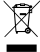{width="0.1388888888888889in"
height="0.18055555555555555in"}

> CHAPTER 1: INTRODUCTION

WEEE policy
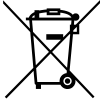{width="0.3472222222222222in"
height="0.3472222222222222in"}

Opentrons is dedicated to adhering to the EU Directive on Waste
Electrical and Electronic\
Equipment (WEEE -- 2012/19/EU). Our goal is to ensure that our products
are properly disposed of or recycled once they reach the end of their
useful life.

Opentrons products that fall under the WEEE directive are labeled with
the symbol, signifying that they should not be thrown away with regular
household waste but must be collected and handled separately.

If you or your business have Opentrons products that are at end of life
or need to be discarded for a separate purpose, contact Opentrons for
proper disposal and recycling.

Wi-Fi precertification

The Wi-Fi module is precertified for use in many regions:

> United States (FCC): FCC Identifier UAY-W8997-M1216\
> European Economic Area (CE): No public identifier (self-declaration)
> Canada (IC): Hardware Version Identification Number W8997-M1216 Japan
> (TELEC): Certified number 020-170034\
> India (WPC): Registration number ETA-SD-20191005525 (self-declaration)

{width="3.3194444444444446in"
height="0.7916666666666666in"}

CHAPTER 2\
**Installation and Relocation**

This chapter describes how to prepare your lab for Opentrons Flex, how
to set up the robot, and how to move it if necessary. Before taking
delivery of your Flex, make sure that your lab or facility meets all the
criteria in the Safety and Operating Requirements section. When it's
time to get your Flex up and running, follow the detailed instructions
in the Unboxing, First Run, and Instrument Installation and Calibration
sections, or use the Opentrons . And if you ever need to move your Flex
to a new location, near or far, follow the steps in the Relocation
section.

**2.1 Safety and operating requirements**

Where to place Opentrons Flex

Space is a valuable commodity in almost every lab. Your Flex is going to
need some---but not too much, as it's designed to fit on half of a
standard lab bench. Make sure that you have a space that meets the
following criteria.

> **Bench surface:** Stationary, sturdy, level, water-resistant surface.
> Tables or benches with wheels (even locking wheels) are not
> recommended. Flex moves quickly and has a lot of mass, which can shake
> or imbalance lightweight or movable tables.
>
> **Weight bearing:** The robot alone weighs 88.5 kg (195 lb) and should
> only be lifted by two people working together. Place the robot on a
> surface that can readily support its weight plus the weight of any
> modules, labware, liquids, or other lab equipment to be used in your
> applications.
>
> **Operating space:** The robot's base dimensions are 87 cm W x 69 cm D
> x 84 cm H (about 34" x 27" x 33"). Flex needs 20 cm (8") of side and
> back clearance for cables, USB connections, and to dissipate exhaust
> from modules that heat and cool.
>
> **Warning:***Do not* position the sides or\
> back of the Flex flush against a wall.

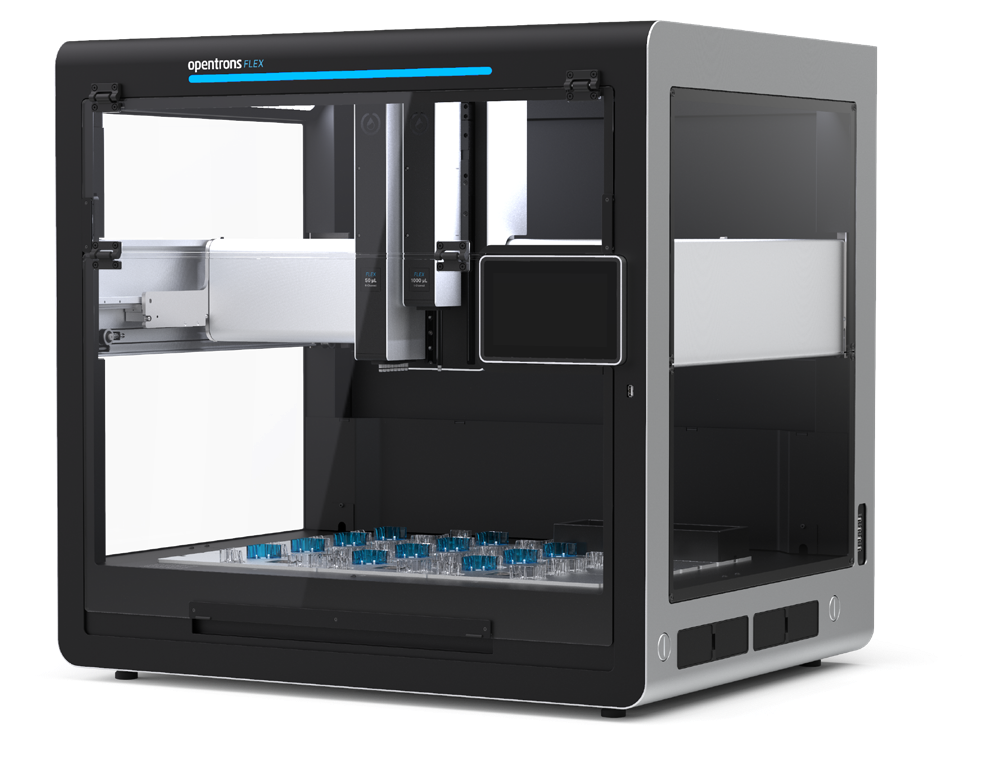{width="3.308333333333333in"
height="2.5886964129483814in"}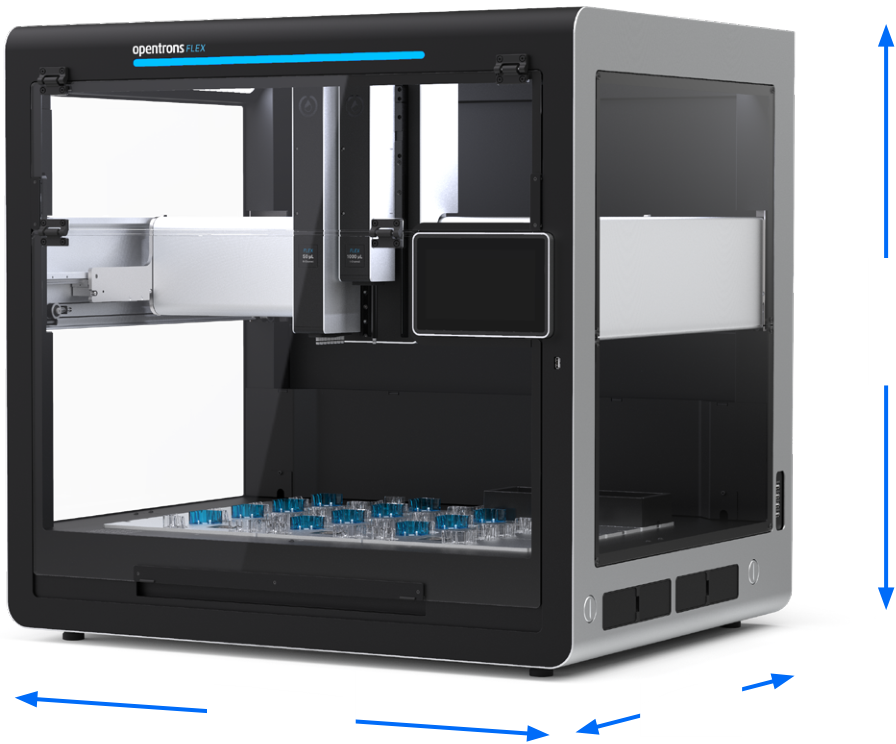{width="3.111111111111111in"
height="2.5833333333333335in"}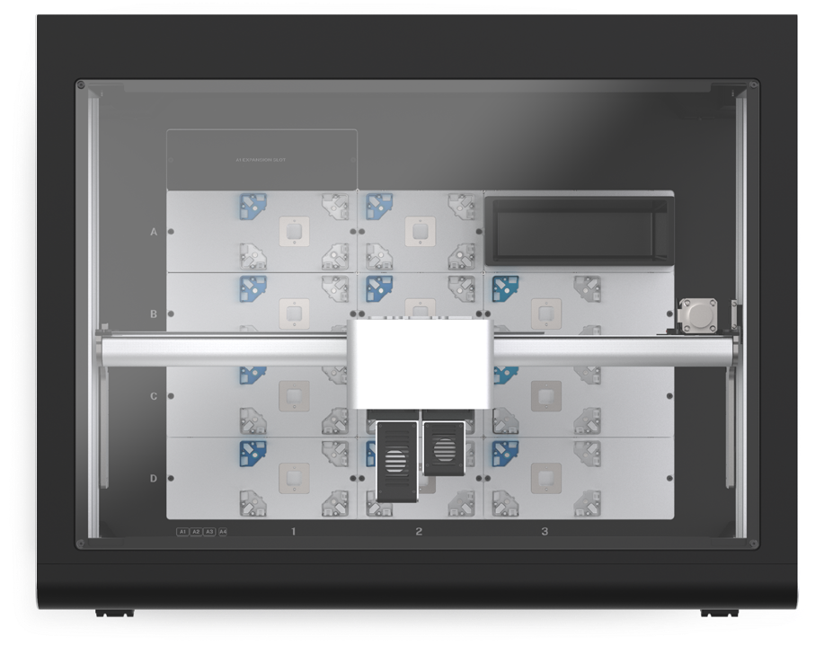{width="3.088888888888889in"
height="2.459115266841645in"}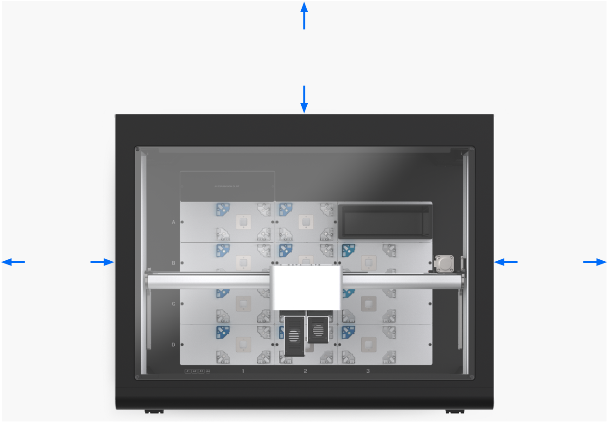{width="4.541666666666667in"
height="3.1527777777777777in"}

> CHAPTER 2: INSTALLATION AND RELOCATION

**84 cm**

**33**"

> **87 cm 69 cm**
>
> **34**" **27**"

Opentrons Flex base dimensions.

**20 cm**

**8**"

> **20 cm** **20 cm**
>
> **8**" **8**"

Top view of Opentrons Flex, showing minimum side and back clearance.

OPENTRONS FLEX 23

{width="6.5in"
height="1.3888888888888888in"}

> CHAPTER 2: INSTALLATION AND RELOCATION
>
> Power consumption
>
> Opentrons Flex should be connected to a wall outlet at or near the
> bench location where you install it. Only connect Flex to circuits
> that can accommodate its peak power draw:
>
> **Input power:** 36 VDC, 6.1 A\
> **Idle consumption:** 30--40 W\
> **Typical consumption:** 40--120 W\
> **Peak consumption:** Up to 250 W

+-----------------------------------+-----------------------------------+
| > **Power Consumption Type**      | > **Description**                 |
+===================================+===================================+
| > **Idle**                        | > The amount of power the robot   |
|                                   | > uses while on and inactive (not |
|                                   | > running a protocol). Flex does  |
|                                   | > not have a low-power sleep or   |
|                                   | > standby mode.                   |
+-----------------------------------+-----------------------------------+
| > **Typical**                     | > The average power the robot and |
|                                   | > attached instruments use when   |
+-----------------------------------+-----------------------------------+

> running a protocol. Different protocols and instruments can cause
> variations within the typical power consumption range. This range does
> not account for separately powered modules used in protocols.

+-----------------------------------+-----------------------------------+
| > **Peak**                        | > The highest instantaneous power |
|                                   | > draw. For example, during fast  |
|                                   | > gantry                          |
+===================================+===================================+
+-----------------------------------+-----------------------------------+

> acceleration, or other high-energy movements, the robot can draw more
> power and exceed typical power consumption values. The peak
> consumption value may also be useful for estimating current handling
> capacity (and circuit breaker selection) for an AC circuit that powers
> multiple robots.
>
> Along with the conditions described above, total power consumption
> also depends on: The amount and type of movement executed during a
> protocol.\
> The amount of time the robot spends idle.
>
> The status lights of the robot.
>
> How many instruments are attached.
>
> **Note:** Always account for other electronics that consume power on
> the same circuit, including Flex modules with their own power
> supplies. For example, the Thermocycler Module has a peak power
> consumption (630 W) that is much greater than the Flex robot itself.
> If necessary, consult the manager of your facility to make sure it
> meets your equipment's peak power requirements.
>
> 24 OPENTRONS FLEX
>
> Environmental conditions
>
> Environmental conditions for recommended use, acceptable use, and
> storage vary:

+-----------------+-----------------+-----------------+-----------------+
|                 | > **Recommended | > **Acceptable  | > **Storage     |
|                 | > for**         | > for**         | > and**         |
+=================+=================+=================+=================+
|                 | > **system      | > **system      | > **t           |
|                 | > operation**   | > operation**   | ransportation** |
+-----------------+-----------------+-----------------+-----------------+
| **Ambient       | > +20 to +25 °C | > +2 to +40 °C  | > −10 to +60 °C |
| temperature**   |                 |                 |                 |
+-----------------+-----------------+-----------------+-----------------+
| > **Relative    | > 40--60%,      | > 30--80%,      | > 10--85%,      |
| > humidity**    |                 |                 |                 |
+-----------------+-----------------+-----------------+-----------------+
|                 | >               | >               | >               |
|                 |  non-condensing |  non-condensing |  non-condensing |
+-----------------+-----------------+-----------------+-----------------+
|                 |                 | > (below 30 °C) | > (below 30 °C) |
+-----------------+-----------------+-----------------+-----------------+
| > **Altitude**  | Approximately   | > Up to 2000 m  | > Up to 2000 m  |
|                 | 500 m           |                 |                 |
+-----------------+-----------------+-----------------+-----------------+
|                 | > above sea     | > above sea     | > above sea     |
|                 | > level         | > level         | > level         |
+-----------------+-----------------+-----------------+-----------------+

> Opentrons has validated the performance of Opentrons Flex in the
> conditions recommended for system operation, and operation in those
> conditions should provide optimal results. Flex is safe to use in
> conditions acceptable for system operation, but results may vary. Do
> not power on or use Flex in conditions outside of those bounds. The
> storage and transportation conditions only apply when the robot is
> completely disconnected from power and other equipment.
>
> Network ports
>
> Flex requires an internet connection for initial setup. After setup,
> it's possible to run Flex without a network connection, although some
> features of Flex and the Opentrons App expect local area network
> access over certain ports.
>
> Network ports are software-defined connections between devices on a
> network. Each numbered port handles data for a specific network
> protocol or service. Flex uses these ports for services like software
> updates, file transfers, or to accept command-line instructions from a
> terminal.
>
> The following table lists the network ports used by Flex, along with
> their function. All listed ports use TCP, except for port 5353, which
> uses UDP.

+-----------------------------------+-----------------------------------+
| > **Port number**                 | > **Description**                 |
+===================================+===================================+
| > **22**                          | > Used to make a Secure Shell     |
|                                   | > (SSH) connection. See           |
|                                   | > [Command-line operation over    |
|                                   | > SSH.]{.underline}               |
+-----------------------------------+-----------------------------------+
| > **80**                          | > Used for HTTP traffic.          |
+-----------------------------------+-----------------------------------+
| > **443**                         | > Used for HTTPS traffic. The     |
|                                   | > Opentrons App uses this port to |
|                                   | > check for and                   |
+-----------------------------------+-----------------------------------+

download software updates.

+-----------------------------------+-----------------------------------+
| > **1883**                        | > Used for . Flex sends realtime  |
|                                   | > notifications to the            |
+===================================+===================================+
+-----------------------------------+-----------------------------------+

> Opentrons App using MQTT. This reduces network traffic and shortens
> delays within the app, compared to polling.

+-----------------------------------+-----------------------------------+
| > **5353**                        | > Used for Multicast DNS (). The  |
+===================================+===================================+
+-----------------------------------+-----------------------------------+

Opentrons App relies on mDNS to find Flex robots on a network.

+-----------------------------------+-----------------------------------+
| > **31950**                       | > Used by the robot server for .  |
+===================================+===================================+
| > **48888**                       | > Used for the built-in [Jupyter  |
|                                   | > Notebook server]{.underline},   |
|                                   | > which you can connect to        |
+-----------------------------------+-----------------------------------+

with your web browser.

> If you're having trouble with these services, consult your facility's
> IT documentation or contact your IT manager for assistance with your
> network setup.

**2.2 Unboxing**

Congratulations! Your Opentrons Flex has arrived and you've prepared a
space for it in your lab. Let's open that monster crate, remove the
robot, and prepare it for operation. The information in this section
provides a parts list and instructions that walk you through the steps
required to get the Flex unboxed, set up, and ready for use. We've
divided the setup procedure into three parts:

> Part 1 covers disassembling the crate.
>
> Part 2 covers detaching the Flex from the crate and moving it to a
> final assembly location. Part 3 covers final assembly and powering on
> the robot for the first time.

Effort and time required

You'll want to ask a lab partner to assist with the unboxing, lifting,
moving, and assembly process. You'll need to budget about 30 minutes to
an hour for this effort.

+-----------------------------------+-----------------------------------+
| {width="0.3333333333333333in" | > Also, lifting and carrying the  |
| height="0.2638888888888889in"}    | > Flex by                         |
+===================================+===================================+
+-----------------------------------+-----------------------------------+

> its handles is the best way to move the robot.

Crate and packing material

Unpacking a Flex gives you an awesome robot, but you're also left with
several large crate panels along with assorted shipping components and
padding. While you could discard this material, we encourage you to keep
these items if storage space is available. The packaging is reusable,
which helps prepare your Flex for shipping if you ever need to send it
somewhere else (e.g., to a conference or a new facility) in the future.

> Product elements\
> The Flex ships with the components listed below. Pipettes, the
> gripper, and modules come in separate
>
> packaging from the main Flex crate, even if you purchased them
> together as a workstation.

+-----------------+-----------------+-----------------+-----------------+
| > ![]           | > ![]           |                 | ![]             |
| (vertopal_63ce7 | (vertopal_63ce7 |                 | (vertopal_63ce7 |
| affef7e4ff0bde7 | affef7e4ff0bde7 |                 | affef7e4ff0bde7 |
| b234c749bde7/me | b234c749bde7/me |                 | b234c749bde7/me |
| dia/image21.png | dia/image22.png |                 | dia/image23.png |
| ){width="1.5555 | ){width="0.9861 |                 | ){width="0.6944 |
| 555555555556in" | 111111111112in" |                 | 444444444444in" |
| >               | >               |                 | height="0.77777 |
| height="1.52777 | height="0.29166 |                 | 77777777778in"} |
| 77777777777in"} | 66666666667in"} |                 |                 |
+=================+=================+=================+=================+
|                 | **(1) USB       | ![]             |                 |
|                 | cable**         | (vertopal_63ce7 |                 |
|                 |                 | affef7e4ff0bde7 |                 |
|                 |                 | b234c749bde7/me |                 |
|                 |                 | dia/image24.png |                 |
|                 |                 | ){width="0.6388 |                 |
|                 |                 | 888888888888in" |                 |
|                 |                 | height="0.31944 |                 |
|                 |                 | 44444444444in"} |                 |
+-----------------+-----------------+-----------------+-----------------+
|                 | ![]             | **(1) Power     | **(5) L-keys**  |
|                 | (vertopal_63ce7 | cable**         |                 |
|                 | affef7e4ff0bde7 |                 |                 |
|                 | b234c749bde7/me |                 |                 |
|                 | dia/image25.png |                 |                 |
|                 | ){width="0.6388 |                 |                 |
|                 | 888888888888in" |                 |                 |
|                 | height="0.31944 |                 |                 |
|                 | 44444444444in"} |                 |                 |
+-----------------+-----------------+-----------------+-----------------+
|                 |                 |                 | > (12 mm hex,   |
|                 |                 |                 | > 1.5 mm hex,   |
+-----------------+-----------------+-----------------+-----------------+
|                 |                 |                 | > 2.5 mm hex, 3 |
|                 |                 |                 | > mm hex,       |
+-----------------+-----------------+-----------------+-----------------+
| > **(1)         | > **(1)         |                 | T10 Torx)       |
| > Opentrons     | > Ethernet      |                 |                 |
| > Flex robot**  | > cable**       |                 |                 |
+-----------------+-----------------+-----------------+-----------------+
| { | dia/image27.png |                 | dia/image28.png |
| width="0.625in" | ){width="1.2361 |                 | ){width="1.2361 |
| height="0.55555 | 111111111112in" |                 | 111111111112in" |
| 55555555556in"} | height="0.77777 |                 | >               |
|                 | 77777777778in"} |                 | height="0.34722 |
|                 |                 |                 | 22222222222in"} |
+-----------------+-----------------+-----------------+-----------------+
| > **(1)         | > **(1) Deck    |                 | > **(4) Spare   |
| > Emergency     | > slot with     |                 | > labware       |
| > Stop          | > labware       |                 | > clips**       |
| > Pendant**     | > clips**       |                 |                 |
+-----------------+-----------------+-----------------+-----------------+
| ![]             |                 |                 |                 |
| (vertopal_63ce7 |                 |                 |                 |
| affef7e4ff0bde7 |                 |                 |                 |
| b234c749bde7/me |                 |                 |                 |
| dia/image29.png |                 |                 |                 |
| ){width="0.2222 |                 |                 |                 |
| 222222222222in" |                 |                 |                 |
| height="0.66666 |                 |                 |                 |
| 66666666666in"} |                 |                 |                 |
+-----------------+-----------------+-----------------+-----------------+
|                 |                 |                 | ![]             |
|                 |                 |                 | (vertopal_63ce7 |
|                 |                 |                 | affef7e4ff0bde7 |
|                 |                 |                 | b234c749bde7/me |
|                 |                 |                 | dia/image30.png |
|                 |                 |                 | ){width="1.0277 |
|                 |                 |                 | 777777777777in" |
|                 |                 |                 | height="0.61111 |
|                 |                 |                 | 11111111112in"} |
+-----------------+-----------------+-----------------+-----------------+
|                 | ![]             |                 |                 |
|                 | (vertopal_63ce7 |                 |                 |
|                 | affef7e4ff0bde7 |                 |                 |
|                 | b234c749bde7/me |                 |                 |
|                 | dia/image31.png |                 |                 |
|                 | ){width="1.0277 |                 |                 |
|                 | 777777777777in" |                 |                 |
|                 | height="0.36111 |                 |                 |
|                 | 11111111111in"} |                 |                 |
+-----------------+-----------------+-----------------+-----------------+
| > **(1) Pipette | > **(4)         |                 | > **(1) Top     |
| > calibration   | > Carrying      |                 | > window        |
| > probe**       | > handles and   |                 | > panel**       |
|                 | > caps**        |                 |                 |
+-----------------+-----------------+-----------------+-----------------+
| ![]             | ![]             |                 | ![]             |
| (vertopal_63ce7 | (vertopal_63ce7 |                 | (vertopal_63ce7 |
| affef7e4ff0bde7 | affef7e4ff0bde7 |                 | affef7e4ff0bde7 |
| b234c749bde7/me | b234c749bde7/me |                 | b234c749bde7/me |
| dia/image32.png | dia/image33.png |                 | dia/image34.png |
| ){width="0.4722 | ){width="0.9583 |                 | ){width="0.9722 |
| 222222222222in" | 333333333334in" |                 | 222222222222in" |
| h               | height="0.58333 |                 | height="0.61111 |
| eight="0.75in"} | 33333333334in"} |                 | 11111111112in"} |
+-----------------+-----------------+-----------------+-----------------+
| > **(4) Side    | > **(1) 2.5 mm  |                 | **(1) 19 mm     |
| > window        | > hex           |                 | wrench**        |
| > panels**      | > screwdriver** |                 |                 |
+-----------------+-----------------+-----------------+-----------------+
|  | ia/image36.png) |                 | ia/image37.png) |
| {width="0.19444 | {width="0.16666 |                 | {width="0.18055 |
| 444444444445in" | 666666666666in" |                 | 555555555555in" |
| height="0.23611 | height="0.31944 |                 | height="0.31944 |
| 11111111111in"} | 44444444444in"} |                 | 44444444444in"} |
+-----------------+-----------------+-----------------+-----------------+
| **(16 + spares) | > **(10) Spare  |                 | > **(12) Spare  |
| Window screws** | > deck slot     |                 | > deck clip     |
|                 | > screws**      |                 | > screws**      |
+-----------------+-----------------+-----------------+-----------------+
| > (M4x8 mm flat | > (M4x10 mm     |                 | > (M3x6 mm      |
| > head)         | > socket head)  |                 | > socket head)  |
+-----------------+-----------------+-----------------+-----------------+

{width="0.25in"
height="0.2638888888888889in"}{width="0.25in"
height="0.2638888888888889in"}

Part 1: Remove the crate

Opentrons ships your Flex in a sturdy plywood crate. The shipping crate
uses hook and latch clamps to secure the top, side, and bottom panels
together. Using latches, instead of nails or screws, means you won't
need a crowbar (or a lot of force) to disassemble the crate, and you can
reassemble it later, if needed.

+-----------------------------------+-----------------------------------+
| {width="0.3333333333333333in" | > may want to use work gloves to  |
| height="0.2638888888888889in"}    |                                   |
+===================================+===================================+
+-----------------------------------+-----------------------------------+

> protect your hands from wood splinters.

To release the latches, flip the latch tab up and turn it to the left
(counterclockwise). This action moves the clamp arm out of its
corresponding retaining bracket. You can then flip the latch arm away
from the crate.

> 1 Unlock the eight latches holding the top to the sides.
>
> 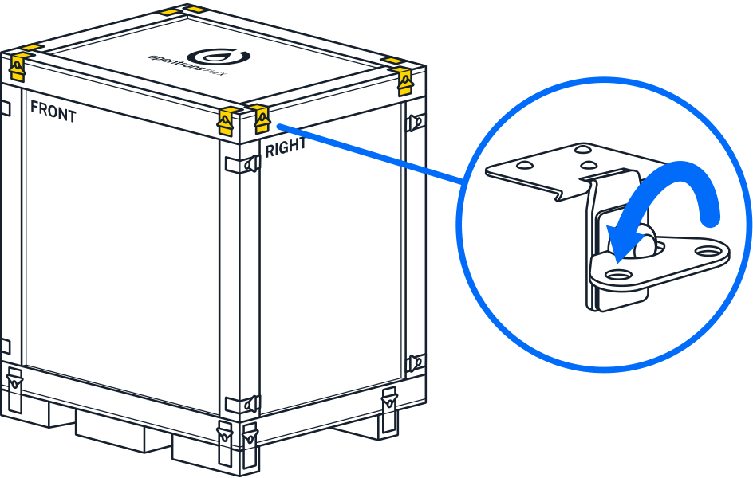{width="3.2777777777777777in"
> height="2.0833333333333335in"}
>
> 2 Remove the top panel after releasing the latches.

{width="0.25in"
height="0.25in"}{width="0.25in"
height="0.2638888888888889in"}{width="0.25in"
height="0.2638888888888889in"}

+-----------------------+-----------------------+-----------------------+
| 3                     | > Cut open the blue   |                       |
|                       | > shipping bag,       |                       |
|                       | > remove these items  |                       |
|                       | > from the padding,   |                       |
|                       | > and set them aside: |                       |
+=======================+=======================+=======================+
|                       | ◾                    | > User Kit            |
+-----------------------+-----------------------+-----------------------+
|                       | ◾                    | > Power, Ethernet,    |
|                       |                       | > and USB cables      |
+-----------------------+-----------------------+-----------------------+
|                       | ◾                    | > Emergency Stop      |
|                       |                       | > Pendant             |
+-----------------------+-----------------------+-----------------------+

> 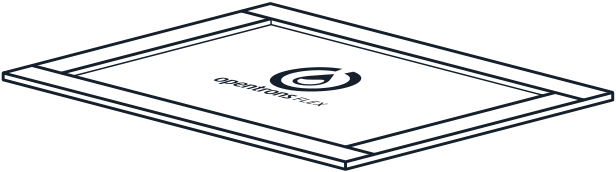{width="2.138888888888889in"
> height="0.5972222222222222in"}
>
> {width="2.138888888888889in"
> height="2.4722222222222223in"}
>
> 4 Remove the top piece of foam padding. The padding protects the
> installed top window panel.
>
> 5 Unlock the remaining 16 latches holding the side panels to each
> other and the base of the crate.

{width="0.25in"
height="0.25in"}{width="0.25in"
height="0.2638888888888889in"}

+-----------------------------------+-----------------------------------+
| 6                                 | > Remove the side panels and set  |
|                                   | > them aside.                     |
+===================================+===================================+
+-----------------------------------+-----------------------------------+

> 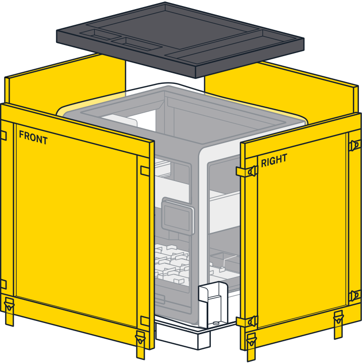{width="2.486111111111111in"
> height="2.5in"}

Part 2: Release the Flex

After completing the steps in Part 1, you should now see a robot that's
in a protective bag and attached to orange steel mounting components.
The bag encloses the robot and protects it from the outside environment.
Steel brackets secure the robot to the bottom of the crate. Two shipping
frames support the robot, distributing its weight evenly, and keeping it
rigid so it doesn't warp during shipping.

Continue to unpack the Flex and get it off the crate base.

> 7 Using the 19 mm wrench from the User Kit, unbolt the brackets from
> the crate bottom. You can discard the brackets, or save them for
> future use.
>
> 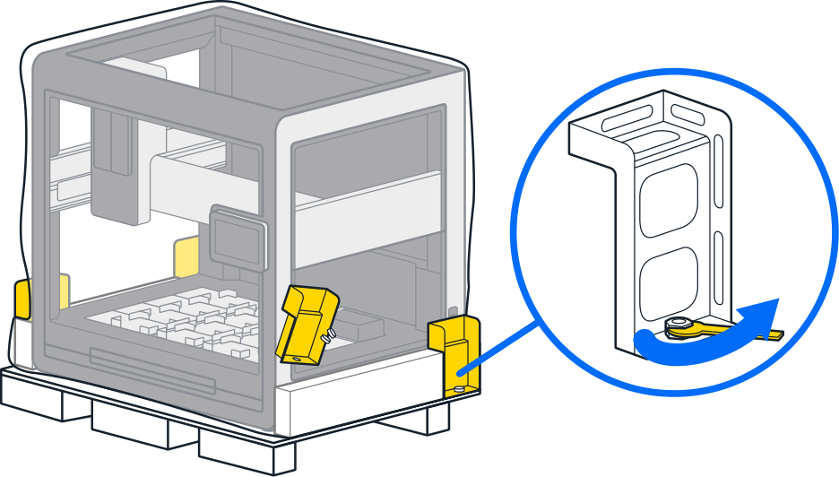{width="3.25in"
> height="1.8472222222222223in"}

{width="0.25in"
height="0.25in"}{width="0.25in"
height="0.25in"}

+-----------------------------------+-----------------------------------+
| 8                                 | > Pull or roll the shipping bag   |
|                                   | > all the way down to expose the  |
|                                   | > entire robot.                   |
+===================================+===================================+
+-----------------------------------+-----------------------------------+

> 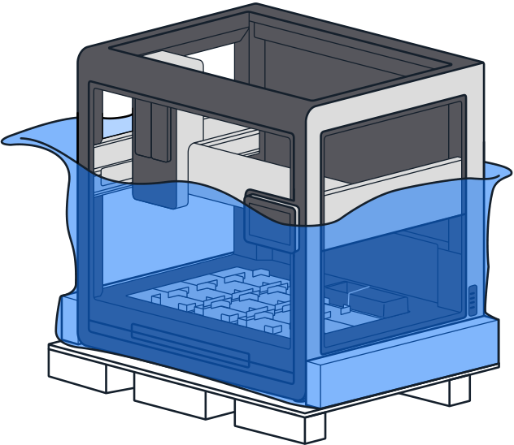{width="2.1944444444444446in"
> height="1.9027777777777777in"}
>
> 9 With help from your lab partner, grab the handholds in the orange
> shipping frames on either side of the robot's base, lift the Flex off
> the crate base, and set it down on the floor. Save or discard the
> crate base and shipping frame.
>
> 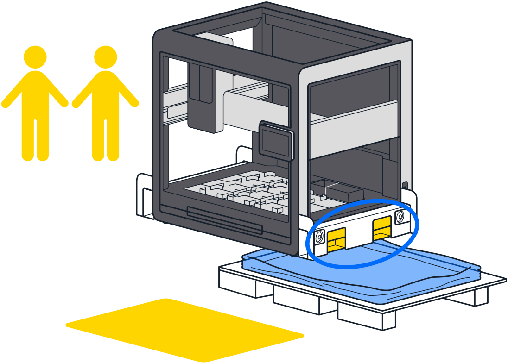{width="3.8055555555555554in"
> height="2.7222222222222223in"}

{width="0.25in"
height="0.25in"}{width="0.25in"
height="0.25in"}

  -----------------------------------------------------------------------
  10                                  Using the 12 mm hex L-key from the
                                      User Kit, remove the four bolts
                                      holding the shipping frames to
  ----------------------------------- -----------------------------------

  -----------------------------------------------------------------------

> the Flex. Save or discard the frames and bolts.
>
> 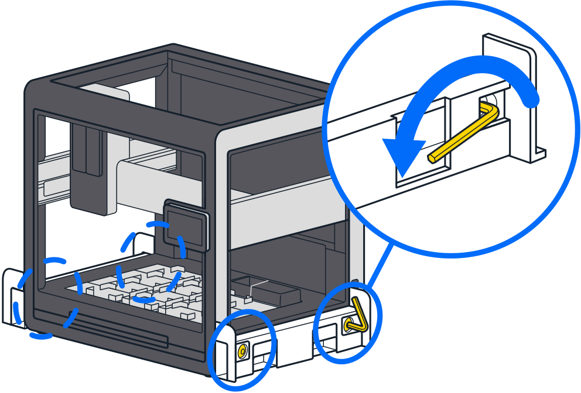{width="3.4444444444444446in"
> height="2.3333333333333335in"}
>
> 11 Remove the four aluminum handles from the User Kit. Screw the
> handles into the same locations
>
> that held the 12 mm shipping frame bolts.
>
> 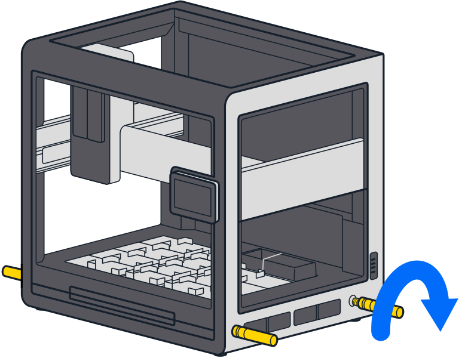{width="2.6666666666666665in"
> height="2.0833333333333335in"}

{width="0.25in"
height="0.25in"}{width="0.25in"
height="0.2638888888888889in"}

+-----------------------------------+-----------------------------------+
| 12                                | > With help from your lab         |
|                                   | > partner, lift the Flex by its   |
|                                   | > carrying handles and move it to |
|                                   | > a workbench for                 |
+===================================+===================================+
+-----------------------------------+-----------------------------------+

> final assembly.
>
> 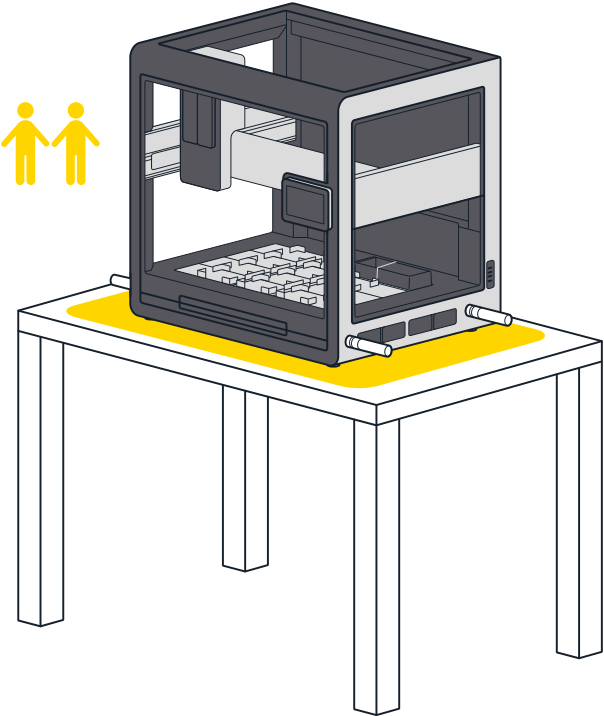{width="2.0972222222222223in"
> height="2.486111111111111in"}

Part 3: Final assembly and power on

After moving the Flex to a temporary work area, or its permanent home,
it's time to put the finishing touches on your new robot.

> 13 If you have moved the robot to its final, working location, remove
> the carrying handles and replace them with the finishing caps. The
> caps close the handle openings in the frame and give the robot a clean
> appearance. Return the handles to the User Kit for storage.
>
> 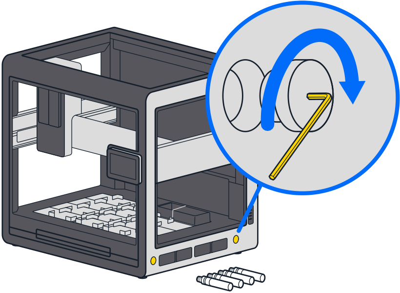{width="2.8472222222222223in"
> height="2.0833333333333335in"}

{width="0.25in"
height="0.2638888888888889in"}{width="0.25in"
height="0.25in"}

  -----------------------------------------------------------------------
  14                                  Using the 2.5 mm screwdriver from
                                      the User Kit, remove the locking
                                      screws from the gantry. These
  ----------------------------------- -----------------------------------

  -----------------------------------------------------------------------

> screws prevent the gantry from moving while in transit. The gantry
> locking screws are located:◾ On the left side rail near the front of
> the robot.
>
> ◾ Underneath the vertical gantry arm.
>
> ◾ On the right side rail near the front of the robot in an orange
> bracket. There are two screws here.
>
> 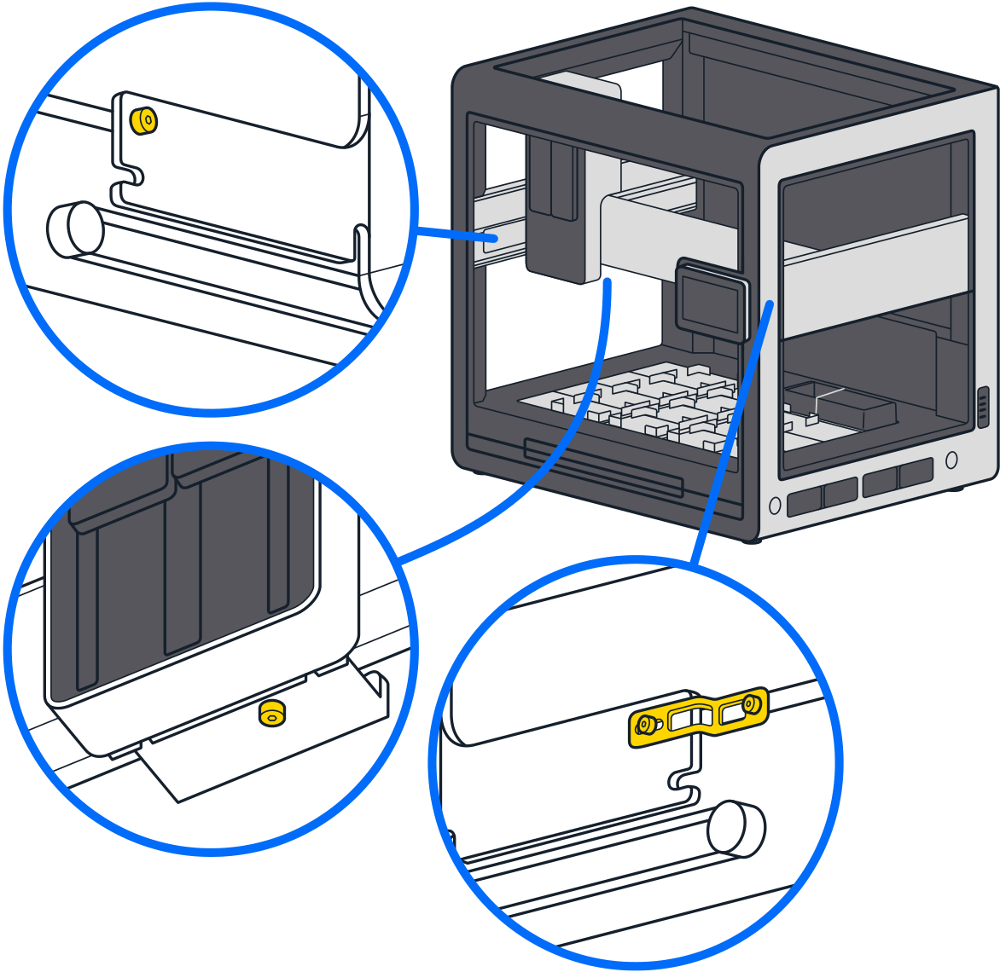{width="4.069444444444445in"
> height="3.9583333333333335in"}
>
> The gantry moves easily by hand after removing all the shipping
> screws.
>
> 15 Cut and remove the two rubber bands that hold the trash bin in
> place during shipping.

{width="0.25in"
height="0.25in"}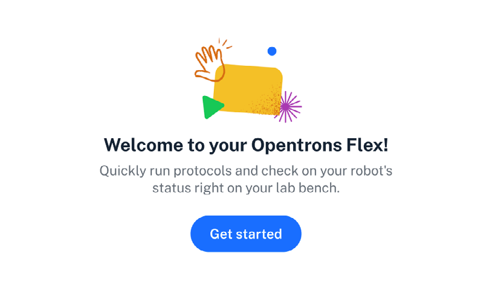{width="2.7125in"
height="1.5895122484689415in"}{width="0.6388888888888888in"
height="0.2222222222222222in"}{width="0.3611111111111111in"
height="8.333333333333333e-2in"}{width="0.6805555555555556in"
height="8.333333333333333e-2in"}{width="0.5138888888888888in"
height="9.722222222222222e-2in"}{width="0.20833333333333334in"
height="8.333333333333333e-2in"}{width="0.4722222222222222in"
height="9.722222222222222e-2in"}{width="0.4027777777777778in"
height="9.722222222222222e-2in"}{width="0.2222222222222222in"
height="8.333333333333333e-2in"}{width="0.2361111111111111in"
height="9.722222222222222e-2in"}{width="0.5138888888888888in"
height="0.1111111111111111in"}{width="0.5694444444444444in"
height="9.722222222222222e-2in"}{width="6.944444444444445e-2in"
height="6.944444444444445e-2in"}{width="0.6111111111111112in"
height="0.4861111111111111in"}

+-----------------------------------+-----------------------------------+
| 16                                | > Attach the power cord to Flex   |
|                                   | > and plug it into the wall       |
|                                   | > outlet. Make sure the deck area |
|                                   | > is free of                      |
+===================================+===================================+
+-----------------------------------+-----------------------------------+

> obstructions. Flip the power switch on the back left of the robot.
> Once powered on, the gantry moves to its home location and the
> touchscreen displays additional configuration instructions.
>
> {width="3.8472222222222223in"
> height="1.9305555555555556in"}
>
> Now that your Flex is out of the box and ready to go, continue to the
> First Run section below.
>
> **2.3 First run**
>
> Perform basic setup on the touchscreen before connecting any other
> hardware to your Flex. The robot will guide you through connecting to
> your lab network, updating to the latest software, and personalizing
> Flex by giving it a name.
>
> Power on
>
> When you power on Flex, the Opentrons logo will appear on the
> touchscreen. After a few moments, it will show the "Welcome to your
> Opentrons Flex" screen.
>
> The Opentrons Flex welcome screen. You should only see this screen
> when you start your Flex for the first time.

{width="5.375in"
height="1.0416666666666667in"}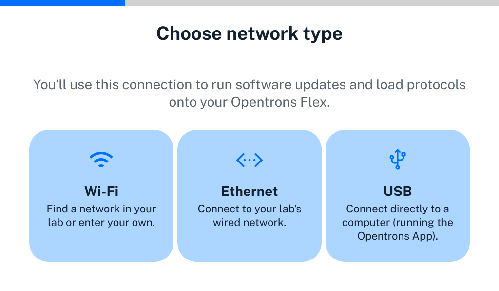{width="3.790277777777778in"
height="2.2208661417322832in"}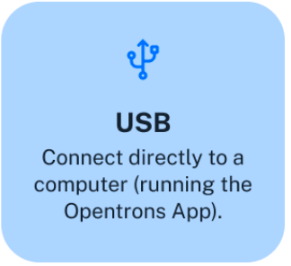{width="1.125in"
height="1.0277777777777777in"}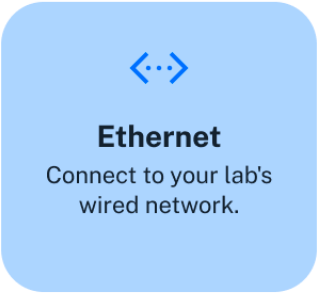{width="1.1111111111111112in"
height="1.0277777777777777in"}{width="1.125in"
height="1.0277777777777777in"}{width="0.2361111111111111in"
height="0.1111111111111111in"}{width="0.9861111111111112in"
height="0.125in"}{width="0.16666666666666666in"
height="8.333333333333333e-2in"}{width="0.18055555555555555in"
height="8.333333333333333e-2in"}{width="0.4583333333333333in"
height="0.1111111111111111in"}{width="0.2222222222222222in"
height="9.722222222222222e-2in"}{width="0.19444444444444445in"
height="9.722222222222222e-2in"}{width="0.3888888888888889in"
height="0.1111111111111111in"}{width="0.4444444444444444in"
height="9.722222222222222e-2in"}{width="0.1111111111111111in"
height="9.722222222222222e-2in"}{width="0.5416666666666666in"
height="9.722222222222222e-2in"}{width="0.19444444444444445in"
height="9.722222222222222e-2in"}{width="0.2638888888888889in"
height="9.722222222222222e-2in"}{width="0.3194444444444444in"
height="0.1388888888888889in"}{width="0.5555555555555556in"
height="0.1388888888888889in"}{width="0.5138888888888888in"
height="0.1388888888888889in"}

> Connect to a network or computer
>
> Follow the prompts on the touchscreen to get your robot connected so
> it can check for software updates and receive protocol files. There
> are three connection methods: Wi-Fi, Ethernet, and USB.

  -----------------------------------------------------------------------

  -----------------------------------------------------------------------

> Network connection options. You need to have internet connectivity to
> set up Flex.
>
> **Wi-Fi:** Use the touchscreen to connect to Wi-Fi networks that are
> secured with WPA2 Personal authentication (most networks that only
> require a password to join fall under this category).

+-----------------------------------+-----------------------------------+
| {width="0.3333333333333333in" | > don't have a password but load  |
| height="0.2638888888888889in"}    | > a webpage to authenticate users |
|                                   | > after connecting).              |
+===================================+===================================+
|                                   |                                   |
+-----------------------------------+-----------------------------------+

> You can also connect to an open Wi-Fi network, but this is not
> recommended.
>
> **Warning:** Connecting to an open Wi-Fi network will allow anyone in
> range of the network signal to control your Opentrons Flex robot
> without authentication.
>
> If you need to connect to a Wi-Fi network that uses enterprise
> authentication (including "eduroam" and similar academic networks that
> require a username and password), first connect to the Opentrons App
> by Ethernet or USB to complete initial setup. Then connect to the
> enterprise Wi-Fi network in the networking settings for your Flex. To
> access the networking settings:

+-----------------------------------+-----------------------------------+
| 1\.                               | > Click **Devices** in the left   |
|                                   | > sidebar of the Opentrons App.   |
| 2\. 3.                            | >                                 |
|                                   | > Click the three-dot menu        |
|                                   | > (**⋮**) for your Flex and       |
|                                   | > choose **Robot Settings**.      |
|                                   | > Click the **Networking** tab.   |
+===================================+===================================+
+-----------------------------------+-----------------------------------+

Select your network from the dropdown menu or choose "Join other
network..." and enter its SSID. Choose the enterprise authentication
method that your network uses. The supported methods are:

> EAP-TTLS with TLS\
> EAP-TTLS with MS-CHAP v2\
> EAP-TTLS with MD5\
> EAP-PEAP with MS-CHAP v2\
> EAP-TLS

Each of these methods requires a username and password, and depending on
your exact network configuration may require certificate files or other
options. Consult your facility's IT documentation or contact your IT
manager for details of your network setup.

**Ethernet:** Connect your robot to a network switch or hub with an
Ethernet cable. You can also connect directly to the Ethernet port on
your computer, starting in robot system version 7.1.0.

**USB:** Connect the provided USB A-to-B cable to the robot's USB-B port
and an open port on your computer. Use a USB B-to-C cable or a USB
A-to-C adapter if your computer does not have a USB-A port.

To proceed with setup, the connected computer must have the Opentrons
App installed *and running*. For details on installing the Opentrons
App, see the [App Installation section]{.underline} of the Software and
Operation chapter.

Install software updates

Now that you've connected to a network or computer, the robot can check
for software and firmware updates and download them if needed. If there
is an update, it may take a few minutes to install. Once the update is
complete, the robot will restart.

> Attach Emergency Stop Pendant\
> Connect the included Emergency Stop Pendant (E-stop) to an auxiliary
> port (AUX-1 or AUX-2) on the back
>
> of the robot.

  -----------------------------------------------------------------------------------------------
  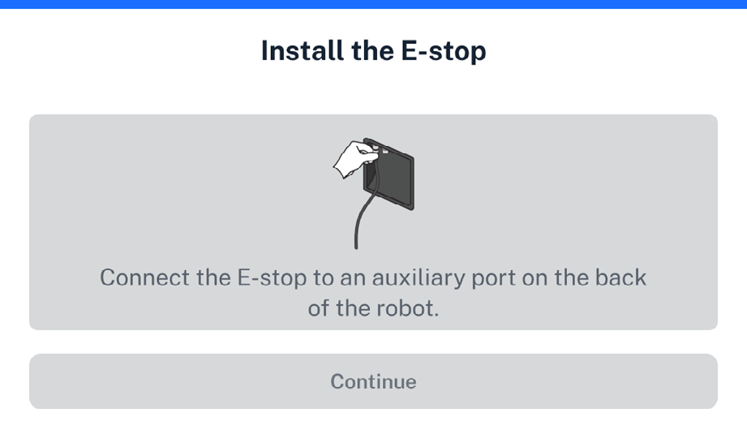{width="3.0680555555555555in"
  height="1.7972222222222223in"}
  -----------------------------------------------------------------------------------------------

  -----------------------------------------------------------------------------------------------

  ------------------------------------------------------------------------------------------------
  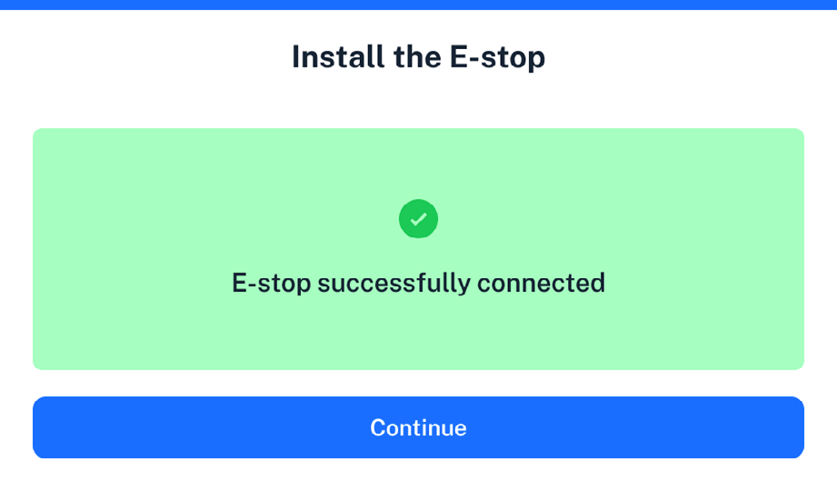{width="3.0680544619422574in"
  height="1.7972222222222223in"}
  ------------------------------------------------------------------------------------------------

  ------------------------------------------------------------------------------------------------

> Before and after connecting the Emergency Stop Pendant.
>
> Attaching and enabling the E-stop is *mandatory* for attaching
> instruments and running protocols on Flex. For more information on
> using the E-stop during robot operation, see the [Emergency Stop
> Pendant section]{.underline} of the System Description chapter.
>
> Give your robot a name
>
> Naming your robot lets you easily identify it in your lab environment.
> If you have multiple Opentrons robots on your network, make sure to
> give them unique names. Once you've confirmed your robot's name,
> you'll be taken to your Opentrons Flex Dashboard. Likely the next step
> you'll want to take is attaching instruments, which is covered in the
> next section.
>
> **2.4 Instrument installation and calibration**
>
> After initial robot setup, the next step is to attach instruments to
> the robot and calibrate them.
>
> To install an instrument, first tap on **Instruments** on the
> touchscreen or go to the **Pipettes and Modules** section of the
> device detail screen in the Opentrons App. Choose an empty mount and
> select either **Attach Pipette** or **Attach Gripper**. If the mount
> you want to use is already occupied, you need to detach the pipette or
> gripper first.

+-----------------------------------+-----------------------------------+
| {width="0.3333333333333333in" | > same regardless of whether you  |
| height="0.2638888888888889in"}    | > use the touchscreen or the      |
|                                   | > Opentrons App. Whatever device  |
|                                   | > you begin on will control the   |
+===================================+===================================+
+-----------------------------------+-----------------------------------+

> installation process until you complete or cancel it.
>
> If you begin on the touchscreen, the app will show the robot as being
> "busy". If you begin in the app, the touchscreen will show a modal
> indicating that instrument installation is in progress.

The exact installation process varies depending on the instrument you
are attaching, as covered in the sections below. All instruments have an
automated calibration procedure, which you should perform immediately
after installation.

Pipette installation

When you install a pipette, you will be guided through the following
steps on the touchscreen or in the Opentrons App.

1\. CHOOSE PIPETTE TYPE

> Choose between **1- or 8-Channel Pipette** and **96-Channel Pipette**.
> Attaching the 96-Channel Pipette requires a few additional steps
> because it attaches to a special mounting plate that spans both
> pipette mounts.

2\. PREPARE FOR INSTALLATION

> Remove labware from the deck and clean up the working area to make
> attachment and calibration easier. Also gather the needed equipment,
> such as the calibration probe, hex screwdriver, and mounting plate
> (for the 96-Channel Pipette).

3\. CONNECT AND SECURE THE PIPETTE

> The gantry will move to the front of the robot so you can attach the
> pipette.
>
> 1- and 8-Channel Pipettes connect directly to a pipette mount. The
> 96-Channel Pipette requires a mounting plate. In order to attach the
> mounting plate, you must first disconnect the z-axis carriage for the
> right pipette mount.
>
> Connect the pipette to the chosen pipette mount and secure its screws.

4\. RUN AUTOMATED CALIBRATION

> To calibrate the pipette, attach the calibration probe to the
> appropriate pipette nozzle. The pipette will automatically move to
> touch certain points on the deck and save these calibration values for
> future use. Once calibration is complete and you've removed the probe,
> the pipette will be ready for use in protocols.

Gripper installation

When you install the gripper, you will be guided through the following
steps on the touchscreen or in the Opentrons App.

1\. PREPARE FOR INSTALLATION

> Remove labware from the deck and clean up the working area to make
> attachment and calibration easier. Also gather the required hex
> screwdriver and make sure that the calibration pin is in its storage
> area on the gripper.

2\. CONNECT AND SECURE THE GRIPPER

> The gantry will move to the front of the robot so you can attach the
> gripper. Connect the gripper to the extension mount and secure its
> screws.

3\. RUN AUTOMATED CALIBRATION

> To calibrate the gripper, insert the calibration pin in the front jaw.
> The gripper will automatically move to touch certain points on the
> deck and save these calibration values for future use. Then repeat the
> same process with the calibration pin in the back jaw. Once
> calibration is complete and you've put the pin back in its storage
> location, the gripper will be ready for use in protocols.

**2.5 Relocation**

This section provides advice and instructions about how to move your
Opentrons Flex robot over short and long distances.

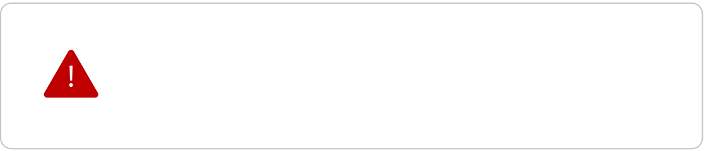{width="3.875in"
height="0.8333333333333334in"}

Short moves

A short move spans a range of distances from "let's just move it over a
little bit" to across the lab, down the hall, or another floor in your
building. In these cases, you can move your Flex by hand. Transporting
it on a hand cart is also a good option.

> **Warning:** The Flex weighs 88.5 kg. As a result,\
> it requires two people to lift and move it safely.

Reattach the lift handles to move your Flex to a new, nearby location.
Lifting and carrying the Flex by its handles is the right way to move
the robot short distances. Remove the handles and store them in the User
Kit after the move is complete. To prevent damaging the robot, always
use the lift handles to pick it up and move it. Do not grab the frame to
lift or move your robot.

Long-distance moves

A long-distance move transports your Flex off the grounds of your
university, facility, or institution. Across town, to a new city, state,
province, or country are all examples of a long-distance move. In this
case, you'll need to pack the Flex to protect it from the elements,
shocks, and rough movements that may occur while in transit.

If you've kept the shipping crate and internal supports that came with
your Flex, you can repackage it in these materials for a long-distance
move. Follow the [unboxing steps]{.underline} in reverse order to
prepare your Flex for a long-distance move. Basically, you should:

> Disconnect the power and network cable, if attached.
>
> Remove all attached hardware and labware.
>
> Reattach the deck plates.
>
> Lock the gantry (see the [General Moving Advice section]{.underline}
> below). Remove and store the window panels.

If you kept the original crate:

> Reattach the shipping frame to the Flex and secure it to the pallet
> base using the L-brackets. Add padding and reassemble the shipping
> crate.

If you don't have the original crate and related material, contact a
reputable shipping company. They can manage the packing, transportation,
and delivery process for you.

General moving advice

DISCONNECT POWER AND NETWORK CABLES

Before moving your Flex, don't forget to:

> Turn off the power and unplug it from the power supply. Disconnect the
> Ethernet or USB cable, if used.

LOCK THE GANTRY

Before moving your Flex, reinsert the locking screws to hold the gantry
in place. The gantry locking points are located:

> On the left side rail near the front of the robot.
>
> Underneath the vertical gantry arm.
>
> On the right side rail near the front of the robot. Locking this part
> of the gantry requires the small orange bracket and two locking
> screws.
>
> 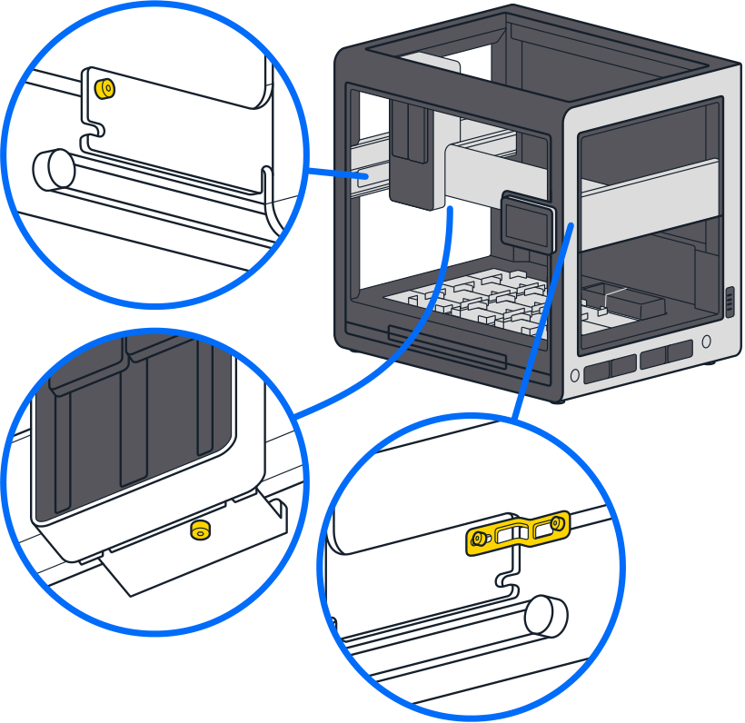{width="2.8472222222222223in"
> height="2.763888888888889in"}
>
> HOME THE GANTRY
>
> You may not want to lock the gantry if you're only moving the robot to
> a nearby location. If you decide not to lock it, at least use the
> touchscreen or the Opentrons App to send the gantry to its home
> position before powering it down.
>
> To home the gantry via the touchscreen, tap the three-dot menu (**⋮**)
> and then tap **Home gantry**.
>
> To home the gantry via the Opentrons App:
>
> Click **Devices**.
>
> Click on your Flex in the device list.
>
> Click the three-dot menu (**⋮**) and then click **Home gantry**.
>
> REMOVE MODULES
>
> In-deck modules and other attachments add extra weight to your Flex.
> They also affect the robot's center of gravity, which can make it feel
> "tippy" when lifting it. To help lighten and balance the robot, remove
> any attached instruments and labware before you pick it up.
>
> REINSTALL DECK SLOTS
>
> We recommend reattaching the deck slots for a long-distance move.
> Securing the slots in their original locations helps prevent
> accidental loss.
>
> Reattaching the deck slots for short moves around the lab is optional.
>
> POST-MOVE RECALIBRATION
>
> You should recalibrate any instruments and modules after reinstalling
> them. For more details on [module calibration]{.underline}, see the
> Modules chapter.

Final thoughts about moving

Your Flex is a sturdy and well-built machine, but it is also a precise
scientific instrument designed to exacting tolerances. As a result, you
should treat it with care when relocating it within your local work area
or sending it across the country. This means following the guidance
provided here *and* using your own common sense about how to transport
an expensive piece of laboratory equipment. Bottom line: when moving
your Flex, err on the side of caution and extra padding.

If you have questions or concerns about relocating your Flex, contact us
at .

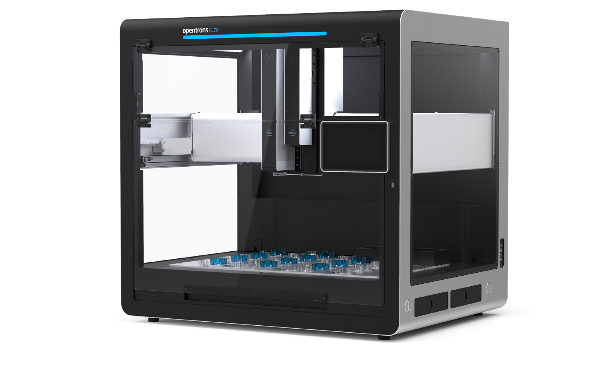{width="5.501388888888889in"
height="3.3321555118110235in"}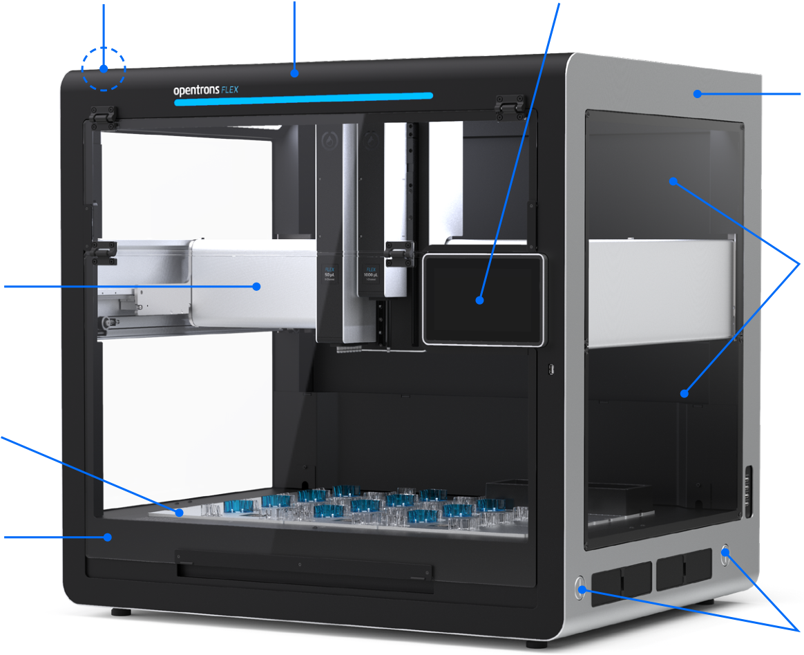{width="4.041666666666667in"
height="3.2916666666666665in"}

CHAPTER 3\
**System Description**

This chapter describes the hardware systems of Opentrons Flex, which
underlie its core lab automation features. The deck, gantry, and
instrument mounts of Opentrons Flex enable the use of precision
liquid-and labware-handling components. The on-device touchscreen
enables running protocols and checking on the robot's status without
needing to bring your computer to the lab bench. Wired and wireless
connectivity enables additional control from the Opentrons App (see the
[Software and Operation chapter]{.underline} for more details) and
extending the system's features by attaching peripherals (see the
[Modules chapter]{.underline}).

**3.1 Physical components**

+-----------------------+-----------------------+-----------------------+
| Camera                | > Status Light        | > Touchscreen         |
+=======================+=======================+=======================+
+-----------------------+-----------------------+-----------------------+

Frame

+-----------------------------------+-----------------------------------+
| > Gantry                          | Side Windows                      |
+===================================+===================================+
+-----------------------------------+-----------------------------------+

> Deck
>
> Front Door

Handle Caps

Locations of the physical components of Opentrons Flex.

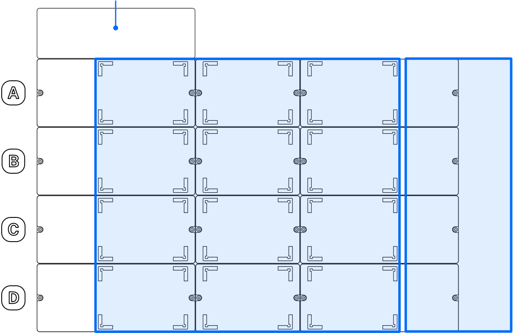{width="4.361111111111111in"
height="2.8333333333333335in"}

> CHAPTER 3: SYSTEM DESCRIPTION
>
> Frame and enclosure
>
> The *frame* of the Opentrons Flex robot provides rigidity and
> structural support for its deck and gantry. All of the mechanical
> subsystems are situated on and mounted to the main frame. The frame is
> constructed primarily of sheet metal and aluminum extrusions.
>
> The metal frame has openings for *side windows* and a *front door*
> made of transparent polycarbonate that let you see what's going on
> inside Flex. The front door hinges open for access to the interior of
> the system. With the front door open, you can attach instruments,
> modules, and deck fixtures; prepare the deck before a protocol; or
> manipulate the state of the deck during a protocol.
>
> White LED strips on the inside top edges of the frame provide
> software-controllable ambient lighting. A 2-megapixel camera can
> photograph the deck and working area for recording and tracking
> protocol execution.
>
> Deck and working area
>
> The deck is the machined aluminum surface on which automated science
> protocols are executed. The deck has 12 main ANSI/SLAS-format slots
> that can be reconfigured to hold labware, modules, and consumables.
> The deck slots are identified by a coordinate system, with slot A1 at
> the back left and slot D3 at the front right.

Expansion Slot (for Thermocycler)

> Working Area Staging Area

Areas of the deck within Flex.

+-------------+-------------+-------------+-------------+-------------+
| > OPENTRONS | {width="5 | g){width="9 | g){width="9 |             |
|             | .5555555555 | .7222222222 | .7222222222 |             |
|             | 55555e-2in" | 22222e-2in" | 22222e-2in" |             |
|             | height      | height      | > height    |             |
|             | ="0.125in"} | ="0.125in"} | ="0.125in"} |             |
+=============+=============+=============+=============+=============+
+-------------+-------------+-------------+-------------+-------------+

> CHAPTER 3: SYSTEM DESCRIPTION
>
> The *working area* is the physical space above the deck that is
> accessible for pipetting. Labware placed in slots A1 through D3 are in
> the working area.
>
> Opentrons Flex comes with *removable deck slots* for all 12 positions
> in the working area. Each deck slot has corner *labware clips* for
> securely placing labware on the deck.
>
> You can reconfigure the deck by replacing slots with other *deck
> fixtures*, including the *movable trash, waste chute,* and *module
> caddies*. The *expansion slot* behind A1 is only used to make
> additional room for the Thermocycler Module, which occupies slots A1
> and B1.

+-----------------------------------+-----------------------------------+
| {width="0.3333333333333333in" | > (1, 2, or 3) but not across     |
| height="0.2638888888888889in"}    | > columns; column 1 and column 3  |
|                                   | > slots are distinct pieces       |
|                                   | > despite their similar size. You |
|                                   | > can tell                        |
+===================================+===================================+
+-----------------------------------+-----------------------------------+

> which column a slot goes in by orienting the blue labware clip to the
> back left.
>
> You should leave deck slots installed in locations where you want to
> place standalone labware. The deck and items placed on it remain
> static, unless moved by the gripper or manual intervention.
>
> Staging area
>
> The *staging area* is additional space along the right side of the
> deck. You can store labware in this location after installing *staging
> areaslots*. Labware placed in slots A4 through D4 are in the staging
> area. Flex pipettes cannot reach into the staging area, but the
> gripper can pick up and move labware to and from this location. Adding
> extra slots helps keep the working area available for the equipment
> used in your automated protocols.
>
> Staging area slots are included in certain workstation configurations.
> You can also purchase a from Opentrons.
>
> 48 OPENTRONS FLEX

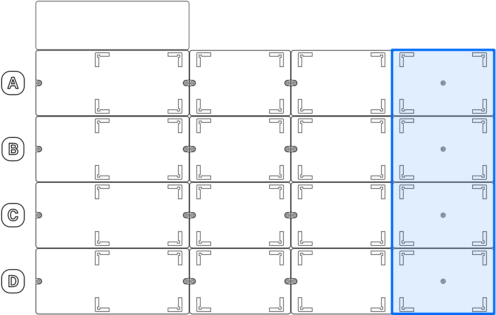{width="4.361111111111111in"
height="2.7777777777777777in"}

> CHAPTER 3: SYSTEM DESCRIPTION
>
> Staging Area with\
> Slots Installed

+-----------------+-----------------+-----------------+-----------------+
| { | /image111.png){ | /image112.png){ | /image113.png){ |
| width="5.555555 | width="8.333333 | width="9.722222 | width="9.722222 |
| 555555555e-2in" | 333333333e-2in" | 222222222e-2in" | 222222222e-2in" |
| he              | he              | he              | > he            |
| ight="0.125in"} | ight="0.125in"} | ight="0.125in"} | ight="0.125in"} |
+=================+=================+=================+=================+
+-----------------+-----------------+-----------------+-----------------+

> Deck fixtures
>
> Fixtures are hardware items that replace standard deck slots. They let
> you customize the deck layout and add functionality to your Flex.
> Currently, deck fixtures include the staging area slots, the internal
> trash bin, and the external waste chute. You can only install fixtures
> in a few specific deck slots. The following table lists the deck
> locations for each fixture.

+-----------------------------------+-----------------------------------+
| > **Fixture**                     | > **Slots**                       |
+===================================+===================================+
| > **Staging area slots**          | > A3--D3                          |
+-----------------------------------+-----------------------------------+
| > **Trash bin**                   | > A1--D1 and A3-D3                |
+-----------------------------------+-----------------------------------+
| > **Waste chute**                 | > D3 only                         |
+-----------------------------------+-----------------------------------+
| > **Waste chute with staging area | > D3 only                         |
| > slot**                          |                                   |
+-----------------------------------+-----------------------------------+

> Fixtures are unpowered. They do not contain electronic or mechanical
> components that communicate their current state and deck location to
> the robot. This means you have to use the deck configuration feature
> to let the Flex know what fixtures are attached to the deck and where
> they're located.
>
> OPENTRONS FLEX 49

{width="4.1930555555555555in"
height="3.193199912510936in"}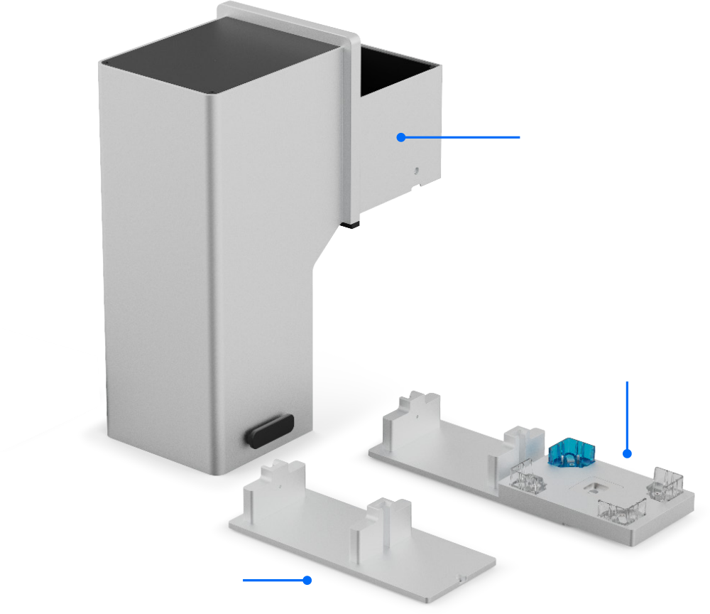{width="3.4722222222222223in"
height="3.0in"}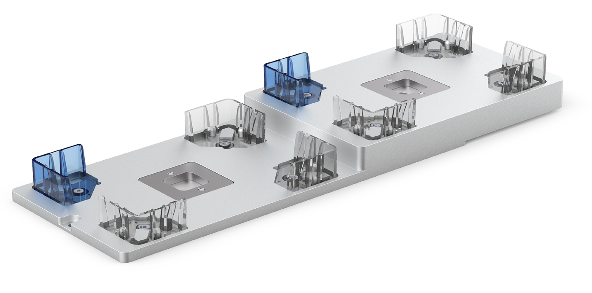{width="4.680555555555555in"
height="2.3169411636045494in"}

> CHAPTER 3: SYSTEM DESCRIPTION

You can access the deck configuration settings from the touchscreen via
the three-dot (**⋮**) menu and from the Opentrons App. See the [Deck
Configuration sectio]{.underline}n of the Software and Operation chapter
for information on how to configure the deck from the touchscreen.

Waste chute

  -----------------------------------------------------------------------
  The Opentrons Flex Waste Chute      **Waste Chute**
  transfers liquids, tips, tip racks, 
  and                                 
  ----------------------------------- -----------------------------------

  -----------------------------------------------------------------------

well plates from the Flex enclosure\
to a trash receptacle placed below\
its external opening. The waste chute

attaches to a deck plate adapter that fits in slot D3. It also comes
with a special window half panel that lets the chute extend out of the
front of the robot.

> **Deck Plate Adapter**\
> **with Staging Area**

Components of the waste chute. **Deck Plate Adapter**

Staging area slots

Staging area slots are ANSI/SLAS compatible deck pieces that replace
standard slots in column 3 and add new slots to the staging area --- all
without losing space in the working area. You can install a single slot
or a maximum of four slots to create a new column (A4 to D4) along the
right side of the deck. Note, however, that replacing deck slot A3
requires moving the trash bin. By adding staging area slots to the deck,
your Flex robot can store more labware and operate more efficiently.

Flex staging area slot.

50 OPENTRONS FLEX

> SLOT INSTALLATION
>
> To install, remove the screws that attach a standard slot to the deck
> and replace it with the staging\
> area slot. After installation, use the touchscreen or Opentrons App to
> tell the robot you've added a staging area slot to the deck.
>
> Installing a staging area slot.
>
> SLOT COMPATIBILITY
>
> 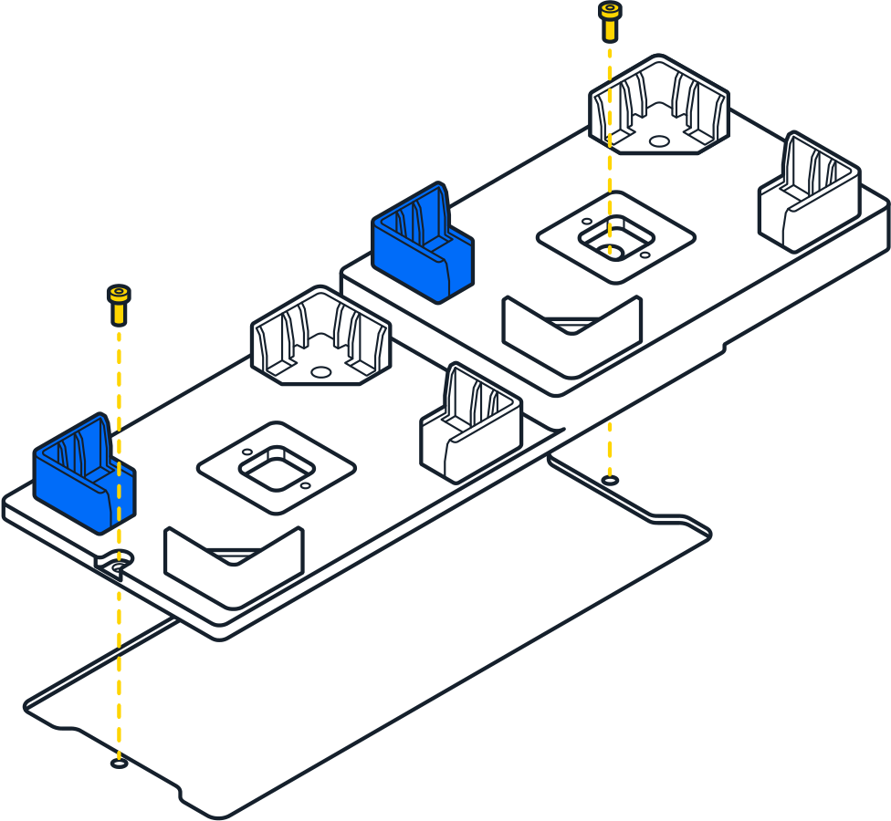{width="3.388888888888889in"
> height="3.125in"}
>
> Staging area slots are compatible with the Flex instruments, modules,
> and labware listed below.

+-----------------------------------+-----------------------------------+
| > **Flex component**              | > **Staging area compatibility**  |
+===================================+===================================+
| > **Gripper**                     | > The Flex Gripper can move       |
|                                   | > labware to or from staging area |
|                                   | > slots.                          |
+-----------------------------------+-----------------------------------+
| > **Pipettes**                    | > Flex pipettes cannot reach the  |
|                                   | > staging area. Use the gripper   |
|                                   | > to move                         |
+-----------------------------------+-----------------------------------+

tip racks and labware from the staging area to the working area

before pipetting.

+-----------------------------------+-----------------------------------+
| > **Modules**                     | > The Magnetic Block GEN1 can be  |
|                                   | > placed in column 3 on top of a  |
+===================================+===================================+
+-----------------------------------+-----------------------------------+

staging area slot. Modules are not supported in column 4.

Powered modules such as the Heater-Shaker and Temperature

Module fit into caddies that can be placed in column 3. You can't add

a staging area slot to a position occupied by a module caddy.

+-----------------------------------+-----------------------------------+
| > **Labware**                     | > Staging area slots have the     |
|                                   | > same ANSI/SLAS dimensions as    |
+===================================+===================================+
+-----------------------------------+-----------------------------------+

standard deck slots. Use [gripper-compatible labware]{.underline} in the
staging

area, or manually add and remove labware from this location.

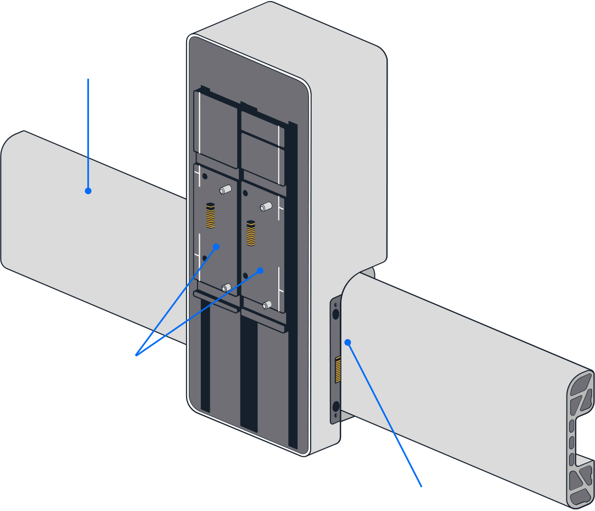{width="3.763888888888889in"
height="3.236111111111111in"}

Movement system

Attached to the frame is the *gantry*, which is the robot's movement and
positioning system.

The gantry moves separately along the x- and y-axis to position the
pipettes and gripper at precise locations for protocol execution.
Movement along these axes is precise to the nearest 0.1 mm. The gantry
is controlled by 36 VDC hybrid bipolar stepper motors.

In turn, attached to the gantry are the *pipette mounts* and the
*extension mount*. These move along the z-axis to position the pipettes
and gripper at precise locations for protocol execution. Movement along
this axis is controlled by 36 VDC hybrid bipolar stepper motors.

The electronics contained in the gantry provide 36 VDC power and
communications to the pipettes and gripper, when attached.

> Gantry
>
> Pipette Mounts
>
> Location of instrument\
> mounts on Flex.

Extension Mount

Touchscreen and LED displays

The primary user interface is the 7-inch LCD *touchscreen*, located on
the front right of the robot. The touchscreen is covered with Gorilla
Glass 3 for scratch and damage resistance. Access many features of Flex
right on the touchscreen, including:

> Protocol management\
> Protocol setup, execution, and monitoring\
> Labware management\
> Robot settings\
> System software and firmware updates\
> Operation logs and error notifications
>
> For more information on using Flex via the touchscreen, see the
> [Touchscreen Operation section]{.underline} of the Software and
> Operation chapter.
>
> The *status light* is a strip of LEDs along the top front of the robot
> that provides at-a-glance information about the robot. Different
> colors and patterns of illumination can communicate various success,
> failure, or idle states:

+-----------------------+-----------------------+-----------------------+
| > **LED color**       | > **LED pattern**     | > **Robot status**    |
+=======================+=======================+=======================+
| > **White**           | > Solid               | > Powered on and not  |
|                       |                       | > running a protocol  |
+-----------------------+-----------------------+-----------------------+
|                       |                       |                       |
+-----------------------+-----------------------+-----------------------+
| **Neutral states**    | > Pulsing             | > Robot is busy       |
|                       |                       | > (e.g., updating     |
|                       |                       | > software or         |
|                       |                       | > firmware,           |
+-----------------------+-----------------------+-----------------------+

setting up protocol run, canceling protocol run)

+-----------------------+-----------------------+-----------------------+
| **Green**             | Blinks twice          | > Action is complete  |
|                       |                       | > (e.g., protocol     |
|                       |                       | > stored, software    |
+=======================+=======================+=======================+
+-----------------------+-----------------------+-----------------------+

**Normal states**

updated, instrument attached or detached)

+-----------------------------------+-----------------------------------+
| > Solid                           | > Protocol is running             |
+===================================+===================================+
| > Pulsing                         | > Protocol is complete            |
+-----------------------------------+-----------------------------------+

+-----------------------+-----------------------+-----------------------+
| **Blue**              | Pulsing               | > Protocol is paused  |
+=======================+=======================+=======================+
+-----------------------+-----------------------+-----------------------+

> **Mandatory states**

+-----------------------+-----------------------+-----------------------+
| **Yellow**            | Solid                 | > Software error      |
+=======================+=======================+=======================+
+-----------------------+-----------------------+-----------------------+

> **Abnormal states**

+-----------------------+-----------------------+-----------------------+
| > **Red**             | Blinks three times,   | > Physical error      |
|                       |                       | > (e.g., instrument   |
|                       |                       | > crash)              |
+=======================+=======================+=======================+
| > **Emergency         | > repeatedly          |                       |
| > states**            |                       |                       |
+-----------------------+-----------------------+-----------------------+

> The status light can also be disabled in the robot settings.

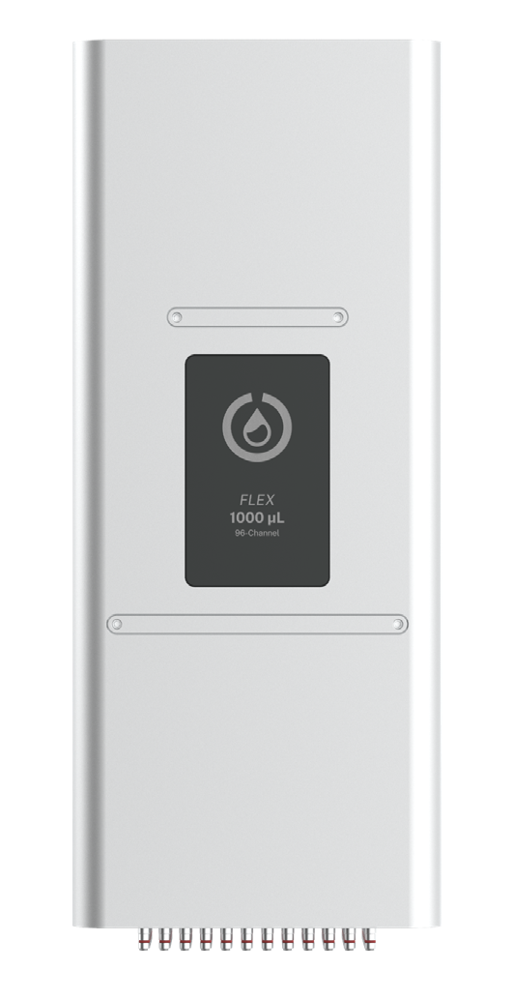{width="1.7722222222222221in"
height="3.44450678040245in"}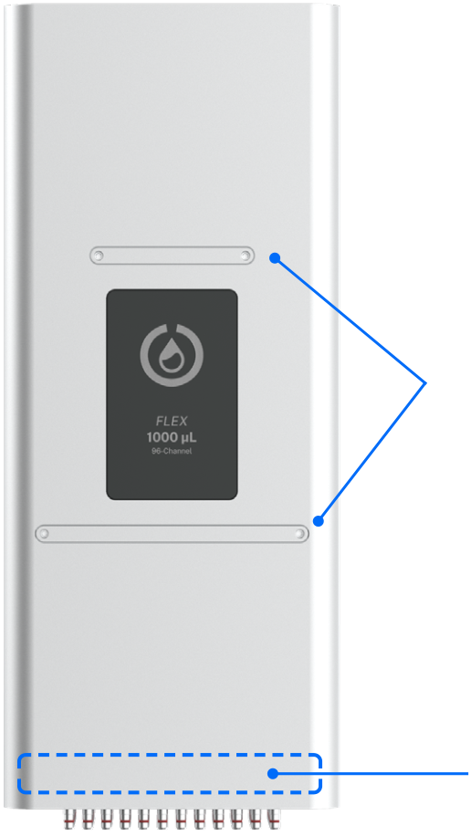{width="1.7916666666666667in"
height="3.1805555555555554in"}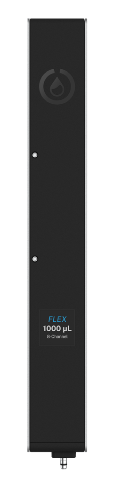{width="0.8069433508311461in"
height="3.4478488626421697in"}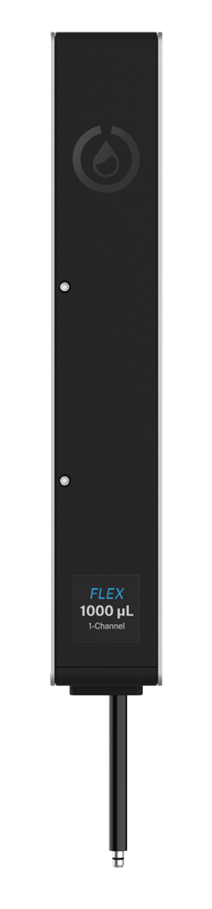{width="0.8055555555555556in"
height="3.4419192913385825in"}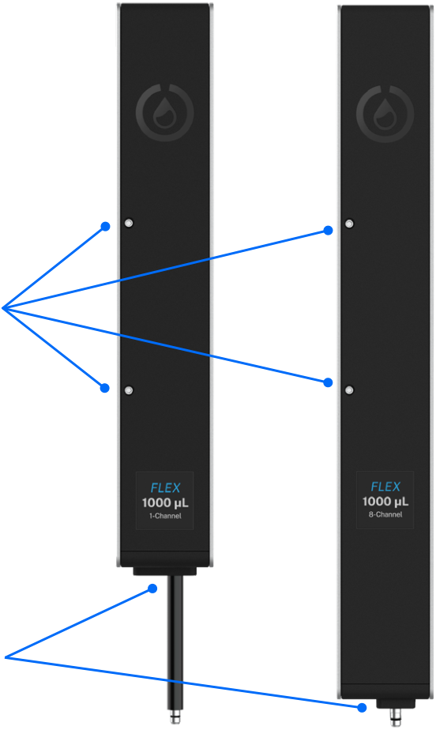{width="1.9166666666666667in"
height="3.2083333333333335in"}

**3.2 Pipettes**

Opentrons *pipettes* are configurable devices used to move liquids
throughout the working area during the execution of protocols. There are
several Opentrons Flex pipettes, which can handle volumes from 1 µL to
1000 µL in 1, 8, or 96 channels:

> Opentrons Flex 1-Channel Pipette (1--50 µL)\
> Opentrons Flex 1-Channel Pipette (5--1000 µL)\
> Opentrons Flex 8-Channel Pipette (1--50 µL)\
> Opentrons Flex 8-Channel Pipette (5--1000 µL)\
> Opentrons Flex 96-Channel Pipette (5--1000 µL)

Pipettes attach to the gantry using captive screws on the front of the
pipette. 1-channel and 8-channel pipettes each occupy one *pipette
mount* (left or right); the 96-channel pipette occupies both mounts. For
details on installing pipettes, see [Instrument Installation and
Calibration]{.underline}.

+-----------------------------------+-----------------------------------+
| Captive\                          | > Captive\                        |
| Attachment\                       | > Attachment\                     |
| Screws                            | > Screws                          |
+===================================+===================================+
+-----------------------------------+-----------------------------------+

> Ejector Ejector
>
> {width="1.0277777777777777in"
> height="0.3055555555555556in"}
> {width="0.8333333333333334in"
> height="0.3055555555555556in"}
>
> Nozzles Nozzles\
> (Replaceable O-rings) (Fixed O-rings)

Locations of components of the 1-, 8-, and 96-channel pipettes.

> The pipettes pick up disposable plastic *tips* by pressing them onto
> the pipette *nozzles*, and then use the tips to aspirate and dispense
> liquids. The amount of total force required for pickup increases as
> more tips get picked up simultaneously. For smaller numbers of tips,
> the pipette attaches tips by pushing each pipette nozzle down into a
> tip. To achieve the necessary force to pick up a full rack of tips,
> the 96-channel pipette also pulls the tips upward onto the nozzles.
> This pulling action requires placing tip racks into a *tip
> rackadapter*, rather than directly in a deck slot. To discard tips (or
> return them to their rack), the pipette *ejector* mechanism pushes the
> tips off of the nozzles.
>
> Pipette specifications
>
> Opentrons Flex pipettes are designed to handle a wide range of
> volumes. Because of their wide overall range, they can use multiple
> sizes of tips, which affect their liquid-handling characteristics.
> Opentrons has tested Flex pipettes for accuracy and precision in a
> number of tip and liquid volume combinations:

  ---------------------------------------------------------------------------
  **Pipette**     **Tip          **Tested       **Accuracy     **Precision
                  Capacity**     Volume**       %D**           %CV**
  --------------- -------------- -------------- -------------- --------------
  **Flex**        50 μL          1 μL           8.00%          7.00%

                  50 μL          10 μL          1.50%          0.50%

  **1-Channel**                                                

                                                               

  **50 µL**       50 μL          50 μL          1.25%          0.40%

                  50 μL          5 μL           5.00%          2.50%

  **Flex**        50 μL          50 μL          0.50%          0.30%
  ---------------------------------------------------------------------------

> **1-Channel**

  ---------------------------------------------------------------------------
  **1000 µL**     200 μL         200 μL         0.50%          0.15%
  --------------- -------------- -------------- -------------- --------------
                  1000 μL        1000 μL        0.50%          0.15%

  **Flex**        50 µL          1 µL           10.00%         8.00%

                  50 µL          10 µL          2.50%          1.00%

  **8-Channel**                                                

                                                               

  **50 µL**       50 µL          50 µL          1.25%          0.60%

                  50 µL          5 µL           8.00%          4.00%

  **Flex**        50 µL          50 µL          2.50%          0.60%
  ---------------------------------------------------------------------------

> **8-Channel**

  --------------------------------------------------------------------------
  **1000 µL**    200 µL         200 µL         1.00%          0.25%
  -------------- -------------- -------------- -------------- --------------
                 1000 µL        1000 µL        0.70%          0.15%

  --------------------------------------------------------------------------

  --------------------------------------------------------------------------
                 50 µL          5 µL           10.00%         5.00%
  -------------- -------------- -------------- -------------- --------------
  **Flex**       50 µL          50 µL          2.50%          1.25%

  --------------------------------------------------------------------------

> **96-Channel**

  --------------------------------------------------------------------------
  **1000 µL**    200 µL         200 µL         1.50%          1.25%
  -------------- -------------- -------------- -------------- --------------
                 1000 µL        1000 µL        1.50%          1.50%

  --------------------------------------------------------------------------

> Keep this accuracy information in mind when choosing tips for your
> pipette. In general, for best results you should use the smallest tips
> that meet the needs of your protocol.

+-----------------------------------+-----------------------------------+
| {width="0.3333333333333333in" | > pipettes to ensure that they    |
| height="0.2638888888888889in"}    | > meet the accuracy and precision |
|                                   | > specifications listed above.    |
|                                   | > You *do not* have to calibrate  |
|                                   | > the                             |
+===================================+===================================+
+-----------------------------------+-----------------------------------+

> volume that your pipettes dispense before use. You only have to
> perform positional calibration. See the next section, as well as the
> [Pipette Installation section]{.underline} of the Installation and
> Relocation chapter, for details.
>
> The Opentrons Care and Opentrons Care Plus services include yearly
> pipette replacement and certificates of calibration. See the
> [Servicing Flex section]{.underline} of the Maintenance and Service
> chapter for details.
>
> Pipette calibration
>
> The User Kit includes a metal pipette calibration probe, which you use
> during positional calibration. During protocol runs, safely store the
> probe on the magnetic holder on the front pillar of the robot. During
> the calibration process, attach the probe to the appropriate nozzle
> and lock it in place. The robot moves the probe to calibration points
> on the deck to measure the pipette's exact position.
>
> Pipette tip rack adapter
>
> The Opentrons Flex 96-channel pipette ships with four tip rack
> adapters. These are precision formed aluminum brackets that you place
> on the deck. The adapters hold Flex 50 μL, 200 μL, and 1000 μL tip
> racks.
>
> 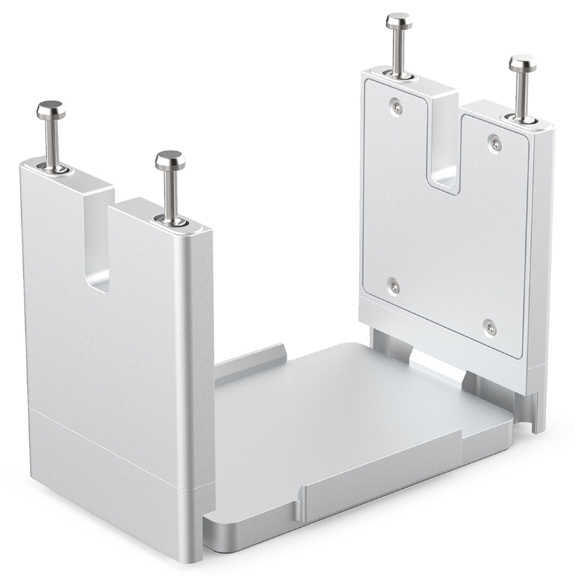{width="1.9111111111111112in"
> height="1.925in"}
>
> Because of the force involved, the 96-channel pipette requires an
> adapter to attach a full tip rack properly. During the attachment
> procedure, the pipette moves over the adapter, lowers itself onto the
> mounting pins, and pulls tips onto the pipettes by lifting the adapter
> and tip rack. Pulling the tips, rather than pushing, provides the
> leverage needed to secure tips to the pipettes and prevents warping
> the deck surface. When finished, the 96-channel pipette lowers the
> adapter and empty tip rack onto the deck. See the [Tips and tip
> racks]{.underline} section of the Labware chapter for more
> information.
>
> Partial tip pickup
>
> By default, multi-channel pipettes use all of their nozzles to pick up
> tips and handle liquids: an 8-channel pipette picks up 8 tips at once,
> and a 96-channel pipette picks up 96 tips at once. Partial tip pickup
> lets you configure a multi-channel pipette to use fewer tips. This
> expands the liquid handling capabilities of your robot without having
> to physically switch pipettes, and is especially useful for the
> 96-channel pipette, which occupies both pipette mounts.
>
> Currently, the 96-channel pipette supports partial tip pickup for a
> column, a row, or a single tip. The 8-channel pipettes support a
> partial column (2--7 consecutive tips) or a single tip.
>
> When picking up fewer than 96 tips from a tip rack with any pipette,
> the rack must be placed directly on the deck, not in the tip rack
> adapter.
>
> Pipette sensors
>
> Opentrons Flex pipettes have a number of sensors that detect and
> record data about the status of the pipette and any tips it has picked
> up.
>
> CAPACITANCE SENSORS
>
> In combination with a metal probe or conductive tip, the capacitance
> sensors detect when the pipette makes contact with something.
> Detection of contact between the metal probe and the deck is used in
> the automated [pipette calibration]{.underline}and[module
> calibration]{.underline}processes.
>
> 1-channel pipettes have one capacitance sensor, while multi-channel
> pipettes have two: on channels 1 and 8 of 8-channel pipettes, and on
> channels 1 and 96 (positions A1 and H12) of the 96-channel pipette.

OPTICAL TIP PRESENCE SENSORS

A photointerruptor switch detects the position of the pipette's tip
ejector mechanism, confirming whether tips were successfully picked up
or dropped. 1-channel, 8-channel, and 96-channel pipettes all have a
single optical sensor that monitors tip attachment across all channels.

PRESSURE SENSORS

Flex pipettes use internal pressure sensors to detect liquid in well
plates, reservoirs, and tubes. Liquid detection takes place as a pipette
approaches the surface of a liquid. Sensors in the pipettes detect
pressure changes relative to ambient pressure. A particular change in
pressure tells the robot that liquid is present in a well and the
pipette tip is in contact with the liquid's surface.

1-channel pipettes have one pressure sensor. The 8-channel pipette
pressure sensors are on channels 1 and 8 (positions A1 and H1). The
96-channel pipette pressure sensors are on channels 1 and 96 (positions
A1 and H12). Other channels on multi-channel pipettes do not have
sensors and cannot detect liquid.

Pipette firmware updates

Opentrons Flex automatically updates pipette firmware to keep it in sync
with the robot software version. Pipette firmware updates are typically
quick, and occur whenever:

> You attach a pipette.\
> The robot restarts.

If, for any reason, your pipette firmware and robot software versions
get out of sync, you can manually update the firmware in the Opentrons
App.

1\. Click **Devices**.

2\. Click on your Flex in the device list.

3\. Under Instruments and Modules, the out-of-sync pipette will show a
warning banner reading "Firmware update available." Click **Update now**
to begin the update.

You can view the currently installed firmware version of any attached
pipette. On the touchscreen, go to **Instruments** and tap the pipette
name. In the Opentrons App, find the pipette card under Instruments and
Modules, click the three-dot menu (**⋮**), and then click **About
pipette**.

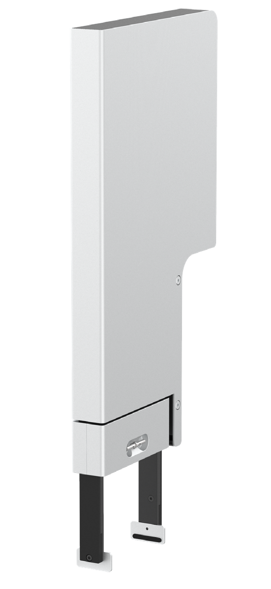{width="1.773611111111111in"
height="3.8500339020122483in"}{width="1.75in"
height="3.7222222222222223in"}

> **3.3 Gripper**
>
> The *gripper* moves labware throughout the working area and staging
> area during the execution of protocols. The gripper attaches to the
> *extension mount*, which is separate from the pipette mounts; the
> gripper can be used with any pipette configuration. For details on
> installing the gripper, see [Instrument Installation and
> Calibration]{.underline}.
>
> The gripper can move labware across the deck and onto or off of
> modules. The gripper can manipulate certain fully skirted well plates,
> deep well plates, and tip racks. For more details on what labware the
> gripper can move, see the [Labware and the Opentrons Flex Gripper
> section]{.underline} of the Labware chapter, or consult the .
>
> Gripper specifications
>
> The *jaws* perform the primary motion of\
> the gripper, which is to open or close two\
> parallel *paddles* to apply or release force\
> on the sides of labware. Movement of the\
> jaws is controlled by a 36 VDC brushed\
> motor connected to a rack-and-pinion\
> gear system.
>
> To move a piece of labware that has Attachment screws been gripped by
> the jaws, the gantry\
> lifts the gripper along the z-axis, moves\
> it laterally, and then lowers it into the Calibration pin labware's
> new position.

Jaws

> Locations of components of the gripper. Paddles
>
> Gripper calibration
>
> The gripper includes a metal *calibration pin*. The calibration pin is
> located in a recessed storage area on the lower part of the gripper. A
> magnet holds the pin in place. To remove the calibration pin, grasp it
> with your fingers and pull gently. To replace the pin, put it back in
> the storage slot. You'll know it's secure when it snaps into place.
>
> When calibrating the gripper, attach the pin to each jaw in turn. The
> robot moves the pin to calibration points on the deck to measure the
> gripper's exact position.
>
> During protocol runs, place the pin in its storage area for
> safekeeping. Contact us at [.com]{.underline} if you lose the
> calibration pin.
>
> Gripper firmware updates
>
> Opentrons Flex automatically updates the gripper firmware to keep it
> in sync with the robot software version. Gripper firmware updates are
> typically quick, and occur whenever:
>
> You attach the gripper.\
> The robot restarts.
>
> If, for any reason, your gripper firmware and robot software versions
> get out of sync, you can manually update the firmware in the Opentrons
> App.
>
> 1\. Click **Devices**.
>
> 2\. Click on your Flex in the device list.
>
> 3\. Under Instruments and Modules, the out-of-sync gripper will show a
> warning banner reading "Firmware update available." Click **Update
> now** to begin the update.
>
> You can view the currently installed firmware version of the gripper.
> On the touchscreen, go to **Instruments** and tap the gripper. In the
> Opentrons App, find the gripper card under Instruments and Modules,
> click the three-dot menu (**⋮**), and then click **About gripper**.

**3.4 Emergency Stop Pendant**

The *Emergency Stop Pendant (E-stop)* is a dedicated hardware button for
quickly stopping robot motion.

Opentrons Flex requires a functional, disengaged E-stop to be attached
at all times. When you press the stop button, Flex cancels any running
protocol or setup workflow as quickly as possible and prevents most
robot motion.

When to use the E-stop

You may need to press the E-stop:

> When there is imminent risk of injury or harm to a user.
>
> When there is imminent risk of damage to the robot or other hardware.
> When samples or reagents are in imminent danger of contamination.
> After a hardware collision.

Ideally you should never have to press the E-stop (except during
infrequent hardware quality testing).

Do not use the E-stop to cancel normal, expected operations. Instead,
use the software button on the touchscreen or in the Opentrons App.
Pausing via software will let you resume or cancel your protocol,
whereas pressing the E-stop always cancels the protocol immediately.

Engaging and releasing the E-stop

The E-stop has a press-to-engage, twist-to-release mechanism.

> **Engage**: Push down firmly on the red button. Flex will enter the
> stopped state.
>
> **Resolve**: Once stopped, safely address any problems in the working
> area, such as clearing spills, removing labware, or moving the gantry
> (it should move freely and easily by hand).
>
> **Release**: Twist the button clockwise. It will pop up to its
> disengaged position.
>
> **Reset**: On the touchscreen or in the Opentrons App, confirm that
> you are ready for Flex to resume motion. The gantry will return to its
> home position and module activity will resume.
>
> In the stopped state, Flex and connected hardware will behave as
> follows:

+-----------------------------------+-----------------------------------+
| > **Hardware**                    | > **Behavior**                    |
+===================================+===================================+
| > **Gantry**                      | > Automated horizontal motion is  |
|                                   | > halted.                         |
+-----------------------------------+-----------------------------------+

Manual horizontal motion is allowed.

+-----------------------------------+-----------------------------------+
| > **Pipettes**                    | > Vertical motion of pipettes is  |
|                                   | > halted.                         |
+===================================+===================================+
+-----------------------------------+-----------------------------------+

> The motor brakes on vertical axes are engaged to prevent pipettes from
> falling.

Plunger motion and tip pickup is halted.

+-----------------------------------+-----------------------------------+
| > **Gripper**                     | > Vertical motion of the gripper  |
|                                   | > is halted.                      |
+===================================+===================================+
+-----------------------------------+-----------------------------------+

> The motor brake on the vertical axis is engaged to prevent the gripper
> from falling.
>
> The jaw motors that exert gripping force remain enabled, so the
> gripper will not drop labware it may be carrying.

+-----------------------------------+-----------------------------------+
| > **Heater-Shaker Module**        | > The shaker stops and homes.     |
+===================================+===================================+
+-----------------------------------+-----------------------------------+

> The labware latch opens.\
> Heating is disabled.

+-----------------------------------+-----------------------------------+
| > **Temperature Module**          | > Heating or cooling is disabled. |
+===================================+===================================+
| > **Thermocycler Module**         | > Heating or cooling is disabled. |
+-----------------------------------+-----------------------------------+
| > **Status light**                | > The light turns red.            |
+-----------------------------------+-----------------------------------+
| > **Touchscreen**                 | > A cancellation message takes    |
|                                   | > over the screen.                |
+-----------------------------------+-----------------------------------+

> An on-screen indicator shows when you have successfully disengaged the
> stop button.

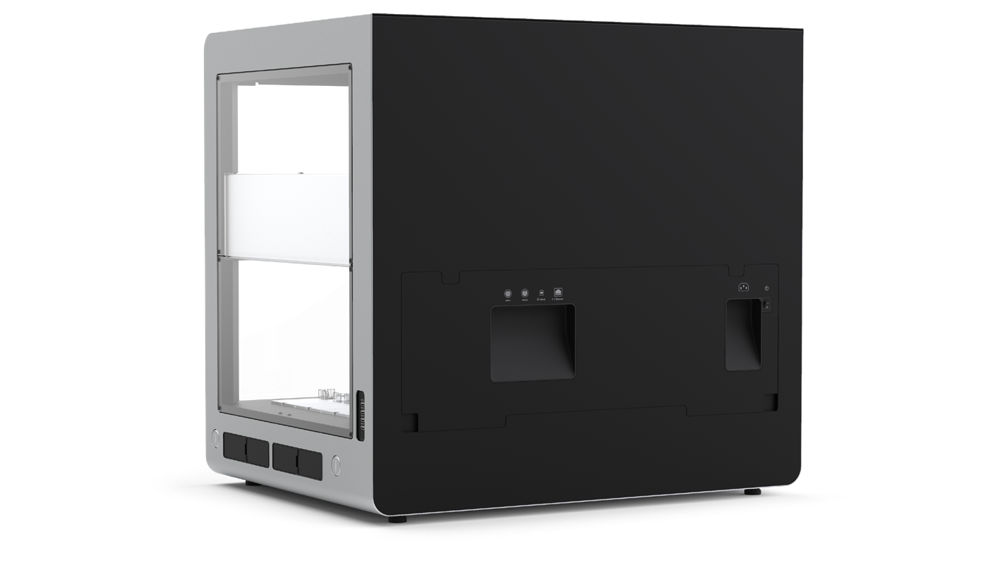{width="4.722222222222222in"
height="2.6727045056867893in"}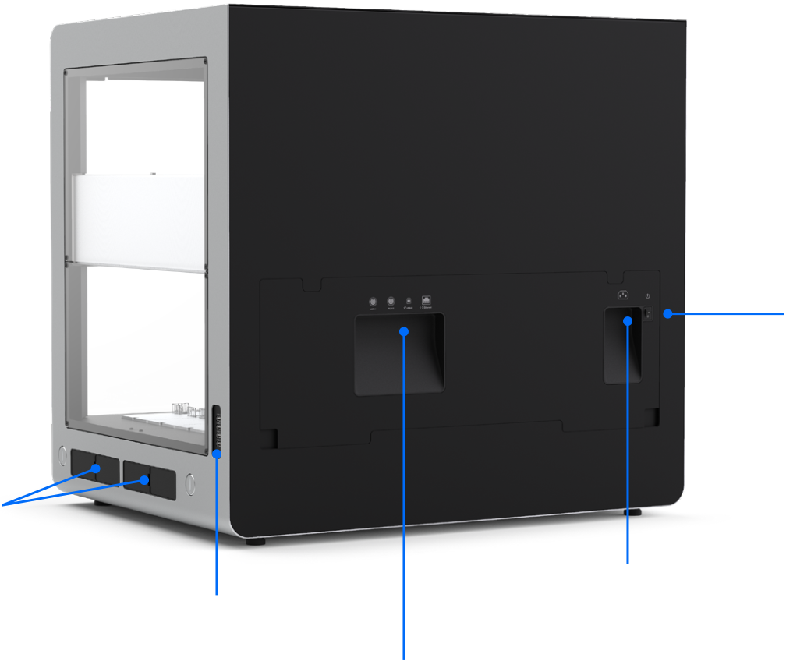{width="3.5in"
height="2.9444444444444446in"}{width="5.611111111111111in"
height="1.1944444444444444in"}

> **3.5 Connections**

On/Off Switch

> Side\
> Covers

+-----------------------------------+-----------------------------------+
| USB-A Ports                       | > IEC Power Inlet                 |
+===================================+===================================+
+-----------------------------------+-----------------------------------+

> Ports\
> AUX-1, AUX-2, USB-B, Ethernet
>
> Power connection
>
> Opentrons Flex connects to a power source via a standard IEC-C14
> inlet. The robot contains an internal full-range AC/DC power supply,
> accepting 100--240 VAC, 50/60 Hz input and converting it to 36 VDC.
> All other internal electronics are powered by the 36 VDC supply.
>
> **Warning:** Only use the power cord provided with the robot. Do not
> use a power cord with inadequate current or voltage ratings.
>
> Keep the power cord free of obstructions so you can remove it if
> necessary.
>
> There is also a CR1220 coin cell battery to power the robot's
> real-time clock when not connected to mains power. The battery is
> located inside the touchscreen enclosure. Contact Opentrons Support
> for more information if you think you need to replace the battery.

USB and auxiliary connections

Opentrons Flex has 10 total USB ports located in different areas of the
robot, which serve different purposes.

The 8 rear USB-A ports (numbered USB-1 through USB-8) and 2 auxiliary
ports (M12 connectors numbered AUX-1 and AUX-2) are for connecting
Opentrons modules and accessories. See the [Modules
chapter]{.underline}for more information on connecting these devices and
using them in your protocols.

The rear USB-B port is for connecting the robot to a laptop or desktop
computer, to establish communication with the Opentrons App running on
the connected computer. The front USB-A port (USB-9), located below the
touchscreen display, has the same functionality as the rear USB-A ports.

+-----------------------------------+-----------------------------------+
| {width="0.3333333333333333in" | > robot and connected devices.    |
| height="0.2638888888888889in"}    | > Power delivery is split         |
|                                   | > internally into three port      |
|                                   | > groups: the left rear USB-A     |
|                                   | > ports                           |
+===================================+===================================+
+-----------------------------------+-----------------------------------+

> (USB-1 through USB-4), the right rear USB-A ports (USB-5 through
> USB-8), and the front USB-A port. Each of these groups will deliver a
> maximum of 500 mA to connected USB 2.0--compatible devices.

Network connections

Opentrons Flex can connect to a local area network through a wired
(Ethernet) or wireless (Wi-Fi) connection.

The Ethernet port is located on the rear of the robot. Connect it to an
Ethernet hub or switch on your network. Or, starting in robot system
version 7.1.0, connect it directly to an Ethernet port on your computer.

The internal Wi-Fi module supports 802.11 ac/a/b/g/n networks with a
dual-band 2.4/5 GHz antenna.

> **3.6 System specifications**
>
> General specifications

+-----------------------------------+-----------------------------------+
| > **Dimensions**                  | > 87 × 69 × 84 cm / 34.25 × 27 ×  |
|                                   | > 33 in (W, D, H)                 |
+===================================+===================================+
| > **Weight**                      | > 88.5 kg / 195 lb                |
+-----------------------------------+-----------------------------------+
| > **Deck slots**                  | > 12 ANSI/SLAS-compatible slots   |
|                                   | > in working area                 |
+-----------------------------------+-----------------------------------+

(accessible to pipettes)

4 additional slots for staging tips and labware

(accessible only to gripper)

+-----------------------+-----------------------+-----------------------+
| > **Touchscreen**     | 7-inch LCD            | > and                 |
|                       | touchscreen with      | > damage-resistant    |
|                       | scratch-              |                       |
+=======================+=======================+=======================+
+-----------------------+-----------------------+-----------------------+

Gorilla Glass 3

+-----------------------------------+-----------------------------------+
| > **Wi-Fi**                       | > 802.11 ac/a/b/g/n dual-band     |
|                                   | > (2.4/5 GHz)                     |
+===================================+===================================+
| > **Ethernet**                    | > 100 Mbps                        |
+-----------------------------------+-----------------------------------+
| > **USB**                         | 9 USB-A ports                     |
+-----------------------------------+-----------------------------------+

1 USB-B port

USB 2.0 speed

+-----------------------------------+-----------------------------------+
| > **Camera**                      | > 2MP, photo and video            |
+===================================+===================================+
| > **Robot power input**           | > 100--240 VAC, 50--60 Hz, 1φ     |
+-----------------------------------+-----------------------------------+

4.0 A/115 VAC, 2.0 A/230 VAC

+-----------------------------------+-----------------------------------+
| > **Mains supply voltage          | > ±10%                            |
| > fluctuation**                   |                                   |
+===================================+===================================+
| **Mains supply frequency          | > ±5%                             |
| fluctuation**                     |                                   |
+-----------------------------------+-----------------------------------+
| > **Distribution system**         | > TN-S                            |
+-----------------------------------+-----------------------------------+
| > **Short-circuit supply          | > 6.3 A                           |
| > current**                       |                                   |
+-----------------------------------+-----------------------------------+
| > **Frame composition**           | > Rigid steel and CNC aluminum    |
|                                   | > design                          |
+-----------------------------------+-----------------------------------+
| > **Window composition**          | > Removable polycarbonate side    |
|                                   | > windows and front door          |
+-----------------------------------+-----------------------------------+
| > **Ventilation requirements**    | > At least 20 cm / 8 in between   |
|                                   | > the unit and a wall             |
+-----------------------------------+-----------------------------------+

> **Connected PC requirements**
>
> The Opentrons App runs on:\
> Windows 10 or later\
> macOS 10.10 or later\
> Ubuntu 12.04 or later
>
> Environmental specifications

+-----------------------------------+-----------------------------------+
| > **Environmental conditions**    | > Indoor use only                 |
+===================================+===================================+
| > **Ambient temperature**         | > +20 to +25 °C (recommended)     |
+-----------------------------------+-----------------------------------+
| > **Relative humidity**           | > 40--60%, non-condensing         |
|                                   | > (recommended)                   |
+-----------------------------------+-----------------------------------+
| > **Pollution degree**            | > 2 (non-conductive pollution     |
|                                   | > only)                           |
+-----------------------------------+-----------------------------------+

> For additional information on acceptable environmental conditions for
> use and transport, see the
>
> [Environmental Conditions section]{.underline} of the Installation and
> Relocation chapter.
>
> Certifications

+-----------------------------------+-----------------------------------+
| > **Certifications complete**     | > CE, ETL, FCC, ISO 9001          |
+===================================+===================================+
| > **Not certified/validated**     | > IVD, GMP                        |
+-----------------------------------+-----------------------------------+

> A summary of certification information is printed on a sticker on the
> back of Flex, near the on/off switch.
>
> For detailed certification and compliance information, see the
> [Regulatory Compliance section]{.underline} in the
>
> Introduction.
>
> Serial number\
> Every Flex has a unique serial number. The format of the serial number
> provides additional information,
>
> including the robot's date of production. For example, the serial
> number FLXA1020231007001 would
>
> indicate:

+-----------------------+-----------------------+-----------------------+
| > **Characters**      |   ------------------  | > **Meaning**         |
|                       |   **Category**        |                       |
|                       |   ------------------  |                       |
|                       |                       |                       |
|                       |   ------------------  |                       |
+=======================+=======================+=======================+
| > FLX                 | > Model               | > The robot is an     |
|                       |                       | > Opentrons Flex.     |
+-----------------------+-----------------------+-----------------------+
| > A10                 | > Version             | > A code for the      |
|                       |                       | > production version  |
|                       |                       | > of the robot.       |
+-----------------------+-----------------------+-----------------------+
| > 2023                | > Year                | > The robot was made  |
|                       |                       | > in 2023.            |
+-----------------------+-----------------------+-----------------------+
| > 10                  | > Month               | > The robot was made  |
|                       |                       | > in October.         |
+-----------------------+-----------------------+-----------------------+
| > 07                  | > Day                 | > The robot was made  |
|                       |                       | > on the 7th day of   |
|                       |                       | > the month.          |
+-----------------------+-----------------------+-----------------------+
| > 001                 | > Unit                | > A unique number for |
|                       |                       | > robots made on a    |
|                       |                       | > certain day.        |
+-----------------------+-----------------------+-----------------------+

> You can find the serial number for your Flex:
>
> On the certification sticker on the back of Flex, near the on/off
> switch.
>
> On the reverse side of the touchscreen (towards the working area).
>
> In the Opentrons App under **Devices** \> your Flex \> **Robot
> settings** \> **Advanced**.
>
> CHAPTER 4\
> **Modules**
>
> Opentrons Flex integrates with a number of Opentrons hardware modules.
> All modules are peripherals that occupy deck slots, and most are
> controlled by the robot over a USB connection.
>
> This chapter describes the functions and physical specifications of
> modules that are compatible with the Opentrons Flex system, as well as
> how to attach and calibrate them. For further details on module setup
> and use, consult the manuals for the individual modules. For details
> on integrating modules into your protocols, see the [Protocol Designer
> section]{.underline} of the Protocol Development chapter or the online
> .
>
> **4.1 Supported modules**
>
> Opentrons Flex is compatible with four types of on-deck Opentrons
> modules:
>
> The **Heater-Shaker Module** provides on-deck heating and orbital
> shaking. The module can be heated to 95 °C, and can shake samples from
> 200 to 3000 rpm.
>
> The **Magnetic Block** is a passive device that holds labware close to
> its high-strength neodymium magnets. The OT-2 Magnetic Module GEN1 and
> GEN2, which actively move their magnets up and down relative to
> labware, are not supported on Opentrons Flex.
>
> The **Temperature Module** is a hot and cold plate module that is able
> to maintain steady state temperatures between 4 and 95 °C.
>
> The **Thermocycler Module** provides on-deck, fully automated
> thermocycling, enabling automation of upstream and downstream workflow
> steps. Thermocycler GEN2 is fully compatible with the gripper.
> Thermocycler GEN1 cannot be used with the gripper, and is therefore
> not supported on Opentrons Flex.
>
> Some modules originally designed for the OT-2 are compatible with
> Flex, as summarized in the table below. A checkmark indicates
> compatibility, and an X indicates incompatibility.
>
> 68 OPENTRONS FLEX
>
> CHAPTER 4: MODULES

+-----------------------+-----------------------+-----------------------+
| > **Device type and   | **OT-2**              | **Flex**              |
| > generation**        |                       |                       |
+=======================+=======================+=======================+
+-----------------------+-----------------------+-----------------------+

+-----------------------+-----------------------+-----------------------+
| > Heater-Shaker       | **✓**                 | **✓**                 |
| > Module GEN1         |                       |                       |
+=======================+=======================+=======================+
| > Magnetic Module     | **✓**                 | **×**                 |
| > GEN1                |                       |                       |
+-----------------------+-----------------------+-----------------------+
| > Magnetic Module     | **✓**                 | **×**                 |
| > GEN2                |                       |                       |
+-----------------------+-----------------------+-----------------------+
| > Magnetic Block GEN1 | **×**                 | **✓**                 |
+-----------------------+-----------------------+-----------------------+
| > Temperature Module  | **✓**                 | **×**                 |
| > GEN1                |                       |                       |
+-----------------------+-----------------------+-----------------------+
| > Temperature Module  | **✓**                 | **✓**                 |
| > GEN2                |                       |                       |
+-----------------------+-----------------------+-----------------------+
| > Thermocycler Module | **✓**                 | **×**                 |
| > GEN1                |                       |                       |
+-----------------------+-----------------------+-----------------------+
| > Thermocycler Module | **✓**                 | **✓**                 |
| > GEN2                |                       |                       |
+-----------------------+-----------------------+-----------------------+
| > HEPA Module         | **✓**                 | **×**                 |
+-----------------------+-----------------------+-----------------------+

> **4.2 Module caddy system**
>
> Compatible modules are designed to fit into caddies that occupy space
> below the deck. This system allows labware on top of modules to remain
> closer to the deck surface, and it also allows for below-deck cable
> routing so the deck stays tidy during your protocol runs.

+-----------------------+-----------------------+-----------------------+
| {width=" | image134.png){width=" | /image135.png){width= |
| 1.6111111111111112in" | 1.6111111111111112in" | "2.577777777777778in" |
| height="1             | > height="1           | > height="1           |
| .2847222222222223in"} | .2847222222222223in"} | .7041666666666666in"} |
+=======================+=======================+=======================+
+-----------------------+-----------------------+-----------------------+

> Caddies for the Heater-Shaker, Temperature, and Thermocycler Modules.
>
> OPENTRONS FLEX 69
>
> CHAPTER 4: MODULES

To fit a module into the deck surface, it must first be placed into the
corresponding module caddy. Each type of compatible module has its own
caddy design that aligns the module and labware precisely with the
surrounding deck. (The exception is the Magnetic Block, which does not
require power or USB cable routing and thus sits directly on the deck
surface.) Caddies for modules that occupy a single slot can be placed
anywhere in column 1 or 3; the Thermocycler can only be placed in slots
A1 and B1 simultaneously.

In general, to install a module caddy:

1\. Remove any deck slots from the location where the module will go.

2\. Seat the module into its caddy and tighten its anchors.

3\. Route the module power and USB cables through the side covers, up
through the empty deck slot, and attach them to the module.

Seat the module caddy into the slot and screw it into place. 4.

For exact installation instructions, consult the Quickstart Guide or
Instruction Manual for the specific module. Cable connections and method
of attachment to the caddy vary by module.

**4.3 Module calibration**

When you first install a module on Flex, you need to run automated
positional calibration. This process is similar to positional
calibration for instruments, and ensures that Flex moves to the exact
correct locations for optimal protocol performance. During calibration,
Flex will move to locations on a module calibration adapter, which looks
similar to the calibration squares that are part of removable deck
slots.

+-----------------------+-----------------------+-----------------------+
| {width="1.9in" | image137.png){width=" | 38.png){width="1.9in" |
| height="1             | 1.8736100174978128in" | > height="1           |
| .2513888888888889in"} | height="1             | .4180555555555556in"} |
|                       | .3152777777777778in"} |                       |
+=======================+=======================+=======================+
+-----------------------+-----------------------+-----------------------+

Calibration adapters for the Heater-Shaker, Temperature, and
Thermocycler Modules.

Module calibration is required for all modules that install via a caddy:
the Heater-Shaker, Temperature, and Thermocycler Modules. The Magnetic
Block doesn't require calibration, and is ready for use as soon as you
place it on the deck.

70 OPENTRONS FLEX

> CHAPTER 4: MODULES

When to calibrate modules

Flex automatically prompts you to perform calibration when you connect
and power on a module that doesn't have any stored calibration data.
(You can dismiss this prompt, but you won't be able to run protocols
with the module until you calibrate it.)

Once you've completed calibration, Flex stores the calibration data and
module serial number for future use. Flex won't prompt you to
recalibrate unless you delete the calibration data for that module in
the robot settings. You can freely power your module on and off, or even
move it to another deck slot, without needing to recalibrate. If you
want to recalibrate, you can begin the process at any time from the
module card in the Opentrons App. (Recalibration is not available from
the touchscreen.)

How to calibrate modules

Instructions on the touchscreen or in the Opentrons App will guide you
through the calibration procedure. In general the steps are:

1\. Gather the required equipment, including the module calibration
adapter and pipette calibration probe. 2. Place the calibration adapter
on the module surface and ensure that it is completely level.\
Some modules may require you to fasten the adapter to the module.

3\. Attach the calibration probe to a pipette.

Flex will automatically move to touch certain points on the calibration
adapter and save these 4.

> calibration values for future use.

Once calibration is complete and you've removed the adapter and probe,
the module will be ready for use in protocols.

At any time, you can view and manage your module calibration data in the
Opentrons App. Go to **Robot Settings** for your Flex and click on the
**Calibration** tab.

OPENTRONS FLEX 71

> CHAPTER 4: MODULES
>
> **4.4 Heater-Shaker Module GEN1**

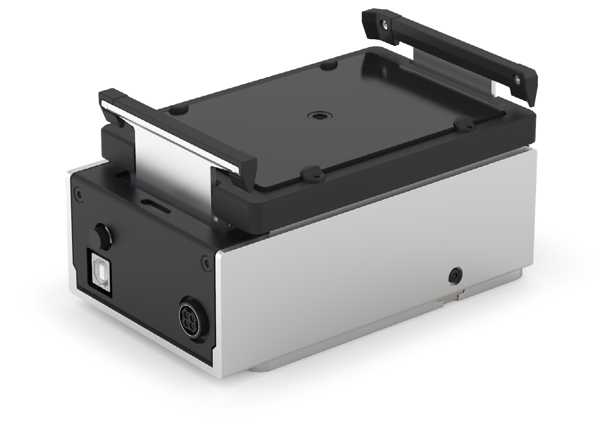{width="4.558333333333334in"
height="3.3111100174978128in"}

> Heater-Shaker features
>
> HEATING AND SHAKING
>
> The Heater-Shaker provides on-deck heating and orbital shaking. The
> module can be heated to 95 °C, with the following temperature profile:
>
> Temperature range: 37--95 °C\
> Temperature accuracy: ±0.5 °C at 55 °C\
> Temperature uniformity: ±0.5 °C at 55 °C\
> Ramp rate: 10 °C/min
>
> The module can shake samples from 200 to 3000 rpm, with the following
> shaking profile:
>
> Orbital diameter: 2.0 mm\
> Orbital direction: Clockwise\
> Speed range: 200--3000 rpm\
> Speed accuracy: ±25 rpm
>
> The module has a powered labware latch for securing plates to the
> module prior to shaking.
>
> 72 OPENTRONS FLEX
>
> CHAPTER 4: MODULES
>
> THERMAL ADAPTERS
>
> A compatible thermal adapter is required for adding labware to the
> Heater-Shaker. Currently available
>
> Thermal Adapters include:

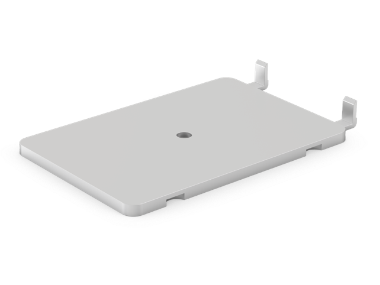{width="2.138888888888889in"
height="1.6055544619422573in"}

> 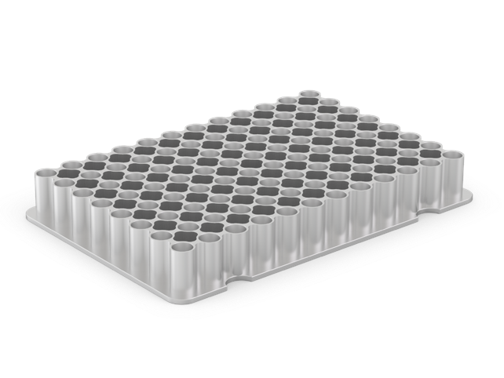{width="2.1374989063867016in"
> height="1.6055544619422573in"}
>
> Universal Flat Adapter PCR Adapter
>
> 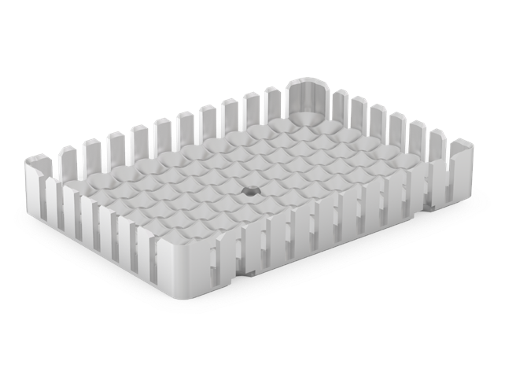{width="2.136111111111111in"
> height="1.6069433508311461in"}
>
> Deep Well Adapter
>
> 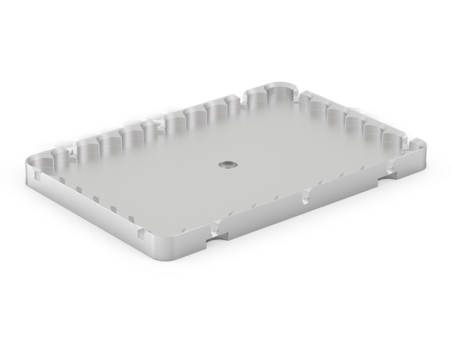{width="2.1374989063867016in"
> height="1.6055555555555556in"}
>
> 96 Flat Bottom Adapter
>
> You can purchase adapters directly from Opentrons:
>
> SOFTWARE CONTROL
>
> The Heater-Shaker is fully programmable in Protocol Designer and the
> Python Protocol API. The Python API additionally allows for other
> protocol steps to be performed in parallel while the Heater-Shaker is
> active. See in the API documentation for details on adding parallel
> steps to your protocols.
>
> Outside of protocols, the Opentrons App can display the current status
> of the Heater-Shaker and can directly control the heater, shaker, and
> labware latch.
>
> OPENTRONS FLEX 73
>
> CHAPTER 4: MODULES
>
> Heater-Shaker specifications

+-----------------------------------+-----------------------------------+
| > **Dimensions**                  | > 152 × 90 × 82 mm (L/W/H)        |
+===================================+===================================+
| > **Weight**                      | > 1.34 kg                         |
+-----------------------------------+-----------------------------------+
| > **Module power input**          | > 36 VDC, 6.1 A                   |
+-----------------------------------+-----------------------------------+
| > **Power adapter input**         | > 100--240 VAC, 50/60 Hz          |
+-----------------------------------+-----------------------------------+
| **Mains supply voltage            | > ±10%                            |
| fluctuation**                     |                                   |
+-----------------------------------+-----------------------------------+
| > **Overvoltage**                 | > Category II                     |
+-----------------------------------+-----------------------------------+
| > **Power consumption**           | > Idle: 3 W                       |
+-----------------------------------+-----------------------------------+

> Typical:\
> Shaking: 4--11 W\
> Heating: 10--30 W\
> Heating and shaking: 10--40 W

Maximum: 125--130 W

+-----------------+-----------------+-----------------+-----------------+
|                 | >               | > Indoor use    |                 |
|                 | **Environmental | > only          |                 |
|                 | > conditions**  |                 |                 |
+=================+=================+=================+=================+
|                 | > **Ambient     | > 20--25 °C     |                 |
|                 | > temperature** |                 |                 |
+-----------------+-----------------+-----------------+-----------------+
|                 | > **Relative    | > Up to 80%,    |                 |
|                 | > humidity**    | >               |                 |
|                 |                 |  non-condensing |                 |
+-----------------+-----------------+-----------------+-----------------+
|                 | > **Altitude**  | > Up to 2,000 m |                 |
|                 |                 | > above sea     |                 |
|                 |                 | > level         |                 |
+-----------------+-----------------+-----------------+-----------------+
| 74              | > **Pollution   | > 2             | OPENTRONS FLEX  |
|                 | > degree**      |                 |                 |
+-----------------+-----------------+-----------------+-----------------+

> CHAPTER 4: MODULES
>
> **4.5 Magnetic Block GEN1**

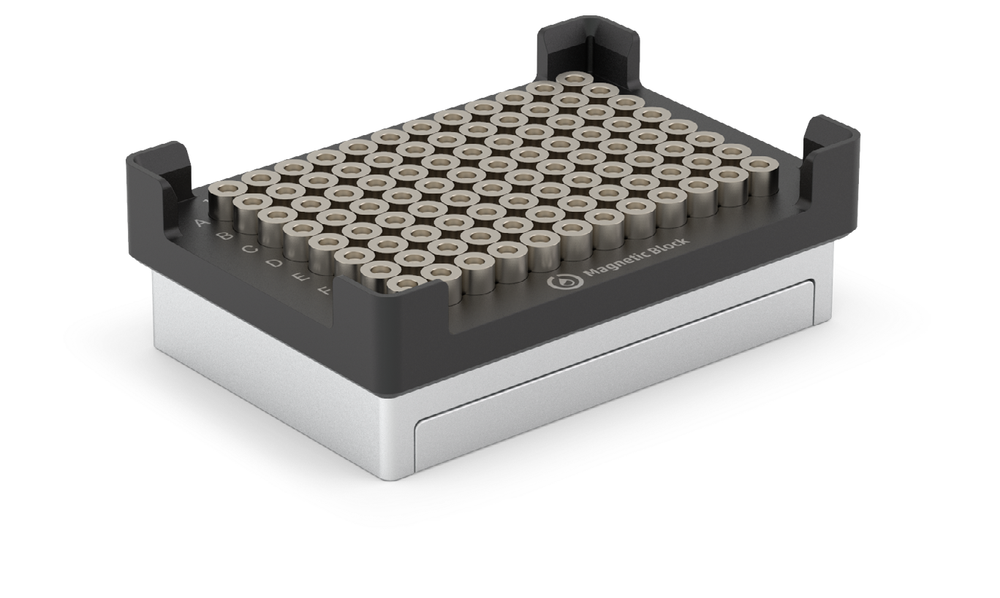{width="4.558333333333334in"
height="2.7291666666666665in"}

> Magnetic Block features
>
> The Opentrons Magnetic Block GEN1 is a magnetic 96-well plate holder.
> Magnetic blocks are used in protocols that rely on magnetism to pull
> particles out of suspension and retain them in well plates during
> wash, rinse, or other elution procedures. For example, automated NGS
> preparation; purifying genomic and mitochondrial DNA, RNA, or
> proteins; and other extraction procedures are all use cases that can
> involve magnetic blocks.
>
> MAGNETIC COMPONENTS
>
> The Magnetic Block is unpowered, does not contain any electronic
> components, and does not move magnetic beads up or down in solution.
> The wells consist of 96 high-strength neodymium ring magnets fixed to
> a spring-loaded bed, which helps maintain tolerances between the block
> and pipettes while running automated protocols.
>
> SOFTWARE CONTROL
>
> The Magnetic Block GEN1 is fully programmable in Protocol Designer and
> the Python Protocol API.
>
> OPENTRONS FLEX 75
>
> CHAPTER 4: MODULES
>
> Outside of protocols, however, the touchscreen and the Opentrons App
> *are not* aware of and *cannot* display the current status of the
> Magnetic Block GEN1. This is an unpowered module. It does not contain
> electronic or mechanical components that can communicate with the Flex
> robot. You "control" the Magnetic Block via protocols that use the
> Opentrons Flex Gripper to add and remove labware from this module.
>
> Magnetic Block specifications

+-----------------+-----------------+-----------------+-----------------+
|                 | >               | > 136 × 94 × 45 |                 |
|                 |  **Dimensions** | > mm (L/W/H)    |                 |
+=================+=================+=================+=================+
|                 | > **Weight**    | > 1.13 kg       |                 |
+-----------------+-----------------+-----------------+-----------------+
|                 | > **Module      | > None, module  |                 |
|                 | > power**       | > is unpowered  |                 |
+-----------------+-----------------+-----------------+-----------------+
|                 | > **Magnet      | > N52 neodymium |                 |
|                 | > grade**       |                 |                 |
+-----------------+-----------------+-----------------+-----------------+
|                 | >               | > Indoor use    |                 |
|                 | **Environmental | > only          |                 |
|                 | > conditions**  |                 |                 |
+-----------------+-----------------+-----------------+-----------------+
|                 | > **Ambient     | > 20--25 °C     |                 |
|                 | > temperature** |                 |                 |
+-----------------+-----------------+-----------------+-----------------+
|                 | > **Relative    | > 30--80%,      |                 |
|                 | > humidity**    | >               |                 |
|                 |                 |  non-condensing |                 |
+-----------------+-----------------+-----------------+-----------------+
|                 | > **Altitude**  | > Up to 2000 m  |                 |
|                 |                 | > above sea     |                 |
|                 |                 | > level         |                 |
+-----------------+-----------------+-----------------+-----------------+
| 76              | > **Pollution   | > 2             | OPENTRONS FLEX  |
|                 | > degree**      |                 |                 |
+-----------------+-----------------+-----------------+-----------------+

> CHAPTER 4: MODULES
>
> **4.6 Temperature Module GEN2**

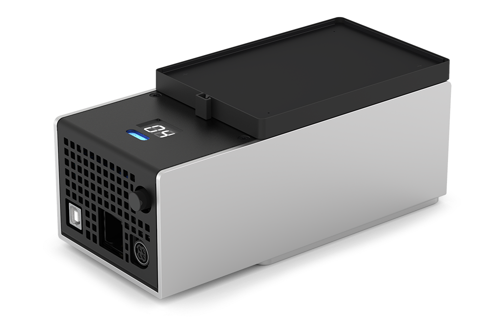{width="4.2in"
height="2.8930555555555557in"}

> Temperature Module features
>
> HEATING AND COOLING
>
> The Opentrons Temperature Module GEN2 is a hot and cold plate module.
> It is often used in protocols that require heating, cooling, or
> temperature changes. The module can reach and maintain temperatures
> ranging from 4 °C to 95 °C within minutes, depending on the module's
> configuration and contents.
>
> THERMAL BLOCKS
>
> To hold labware at temperature, the module uses aluminum thermal
> blocks. The module comes with 24-well and 96-well thermal blocks. The
> Temperature Module caddy comes with a deep well block and a flat
> bottom block designed for use with the Flex Gripper. The blocks hold
> 1.5 mL and 2.0 mL tubes, 96-well PCR plates, PCR strips, deep well
> plates, and flat bottom plates.
>
> OPENTRONS FLEX 77
>
> CHAPTER 4: MODULES

+-----------------------------------+-----------------------------------+
| {width="0.3333333333333333in" | > the OT-2. Do not use the OT-2   |
| height="0.2638888888888889in"}    | > block with Flex. The flat       |
|                                   | > bottom block for Flex has the   |
|                                   | > words "Opentrons Flex"          |
+===================================+===================================+
+-----------------------------------+-----------------------------------+

> on its top surface. The one for OT-2 does not.
>
> 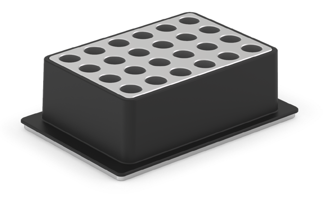{width="2.1666666666666665in"
> height="1.3305544619422571in"}
>
> 24-well thermal block

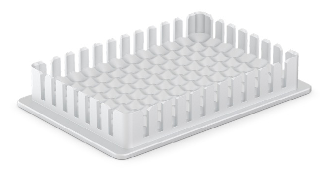{width="2.169443350831146in"
height="1.1166655730533683in"}

> Deep well thermal block
>
> WATER BATHS AND HEATING
>
> 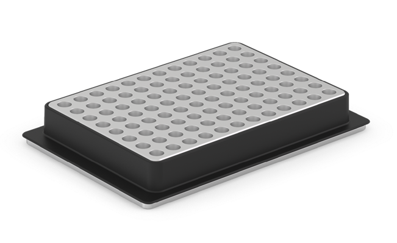{width="2.1666666666666665in"
> height="1.3277777777777777in"}
>
> 96-well thermal block
>
> 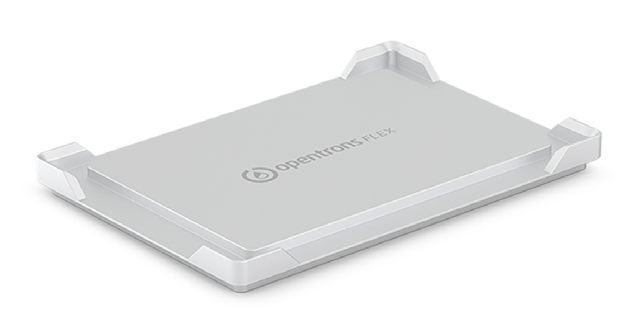{width="2.1375in"
> height="1.1138877952755906in"}
>
> Flat bottom thermal block for Flex
>
> Because air is a good thermal insulator, gaps between labware and a
> thermal block can affect the time-to-temperature performance of the
> Temperature Module. Placing a little water in the 24- or 96-well
> thermal blocks eliminates air gaps and improves heating efficiency.
> The ideal amount of water depends on the thermal block and labware.
> See the for further recommendations.
>
> SOFTWARE CONTROL
>
> The Temperature Module is fully programmable in Protocol Designer and
> the Python Protocol API.
>
> Outside of protocols, the Opentrons App can display the current status
> of the Temperature Module and can directly control the temperature of
> the surface plate.
>
> 78 OPENTRONS FLEX
>
> CHAPTER 4: MODULES
>
> Temperature Module specifications

+-----------------------------------+-----------------------------------+
| > **Dimensions**                  | > 194 × 90 × 84 mm (L/W/H)        |
+===================================+===================================+
| > **Weight**                      | > 1.5 kg                          |
+-----------------------------------+-----------------------------------+
| > **Module power**                | Input: 100--240 VAC, 50/60 Hz,    |
|                                   | 4.0 A                             |
+-----------------------------------+-----------------------------------+

Output: 36 VDC, 6.1 A, 219.6 W max

+-----------------------------------+-----------------------------------+
| > **Environmental conditions**    | > Indoor use only                 |
+===================================+===================================+
| > **Ambient temperature**         | \<22 °C (recommended for optimal  |
|                                   | cooling)                          |
+-----------------------------------+-----------------------------------+
| > **Relative humidity**           | > Up to 60%, non-condensing       |
+-----------------------------------+-----------------------------------+
| > **Altitude**                    | > Up to 2000 m above sea level    |
+-----------------------------------+-----------------------------------+
| > **Pollution degree**            | > 2                               |
+-----------------------------------+-----------------------------------+

> **4.7 Thermocycler Module GEN2**

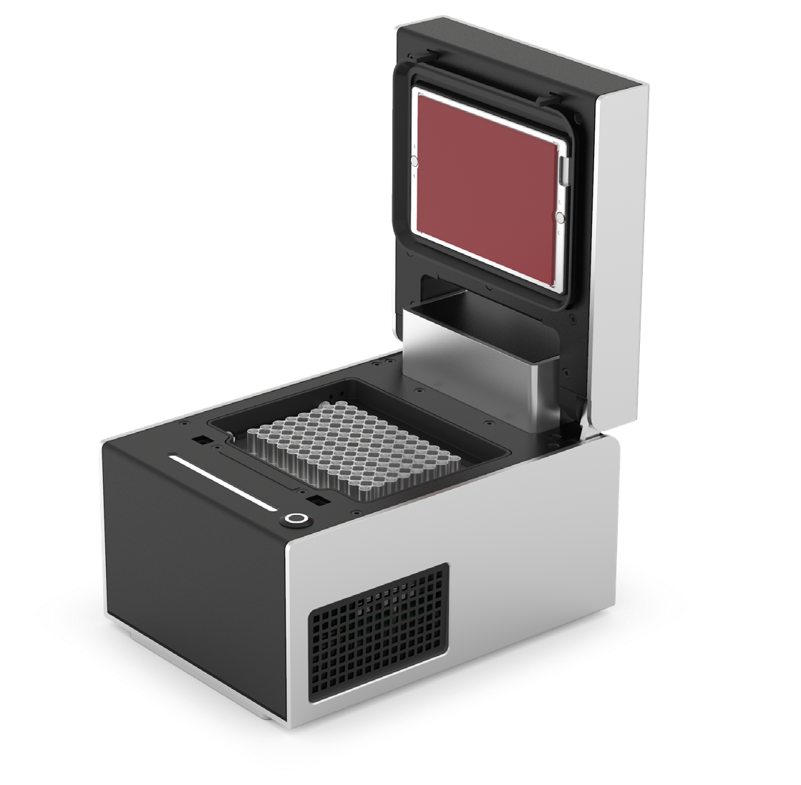{width="3.7277766841644793in"
height="3.651388888888889in"}

> OPENTRONS FLEX 79
>
> CHAPTER 4: MODULES

Thermocycler features

The Opentrons Thermocycler Module GEN2 is a fully automated on-deck
thermocycler, providing hands-free PCR in a 96-well plate format. Its
heated lid and disposable seal fit tightly over the plate, ensuring
efficient sample heating and minimal evaporation.

HEATING AND COOLING

The Thermocycler's block can heat and cool, and its lid can heat, with
the following temperature profile:

> Thermal block temperature range: 4--99 °C\
> Thermal block maximum heating ramp rate: 4.25 °C/s from GEN2 ambient
> to 95 °C Thermal block maximum cooling ramp rate: 2.0 °C/s from 95 °C
> to ambient Lid temperature range: 37--110 °C\
> Lid temperature accuracy: ±1 °C

The automated lid can be opened or closed as needed during protocol
execution.

THERMOCYCLER PROFILES

The Thermocycler can execute *profiles*: automatically cycling through a
sequence of block temperatures to perform heat-sensitive reactions.

RUBBER AUTOMATION SEALS

The Thermocycler comes with rubber automation seals to help reduce
evaporation. Each seal must be sterilized before use and can be used for
several runs. come in packages of 10, which you can purchase directly
from Opentrons.

SOFTWARE CONTROL

The Thermocycler is fully programmable in Protocol Designer and the
Python Protocol API.

Outside of protocols, the Opentrons App can display the current status
of the Thermocycler and can directly control the block temperature, lid
temperature, and lid position.

> CHAPTER 4: MODULES
>
> Thermocycler specifications

+-----------------------+-----------------------+-----------------------+
| > **Dimensions (lid   | > 244.95 × 172 ×      |                       |
| > open)**             | > 310.1 mm (L/W/H)    |                       |
+=======================+=======================+=======================+
| > **Dimensions (lid   | > 244.95 × 172 ×      |                       |
| > closed)**           | > 170.35 mm (L/W/H)   |                       |
+-----------------------+-----------------------+-----------------------+
| > **Weight (including | > 8.4 kg              |                       |
| > rear duct)**        |                       |                       |
+-----------------------+-----------------------+-----------------------+
| > **Power adapter     | > 100--240 V at 50/60 |                       |
| > voltage**           | > Hz                  |                       |
+-----------------------+-----------------------+-----------------------+
| > **Power adapter     | > 8.5--5 A            |                       |
| > current**           |                       |                       |
+-----------------------+-----------------------+-----------------------+
| > **Overvoltage**     | > Category II         |                       |
+-----------------------+-----------------------+-----------------------+
| > **Environmental     | > Indoor use only     |                       |
| > conditions**        |                       |                       |
+-----------------------+-----------------------+-----------------------+
| > **Ambient           | > 20--25 °C (ideal);  |                       |
| > temperature**       | > 2--40 °C            |                       |
|                       | > (acceptable)        |                       |
+-----------------------+-----------------------+-----------------------+
| > **Relative          | > 30--80%,            |                       |
| > humidity**          | > non-condensing      |                       |
+-----------------------+-----------------------+-----------------------+
| > **Altitude**        | > Up to 2000 m above  |                       |
|                       | > sea level           |                       |
+-----------------------+-----------------------+-----------------------+
| > **Ventilation       | > At least 20 cm / 8  |                       |
| > requirements**      | > in between the unit |                       |
|                       | > and a wall          |                       |
+-----------------------+-----------------------+-----------------------+
| > OPENTRONS FLEX      |                       | 81                    |
+-----------------------+-----------------------+-----------------------+

CHAPTER 5\
**Labware**

This chapter covers items in the you can use with Opentrons Flex and the
Opentrons Flex Gripper. It also covers custom labware and, for our power
users, links labware components to their corresponding JSON file
definitions.

You can from the original equipment manufacturers or from the Opentrons
shop. And, Opentrons is always working to verify new labware
definitions. See the Labware Library (linked above) for the latest
listings.

**5.1 Labware concepts**

Labware encompasses more than just the objects placed on the deck and
used in a protocol. To help you understand Opentrons labware, let's
examine this topic from three different perspectives. For the Opentrons
Flex, labware includes items in our Labware Library, data that defines
each piece of labware, and custom labware.

Labware as hardware

The Labware Library includes everything you can use by default with
Opentrons Flex. These are durable components and consumable items that
you work with, reuse, or discard while running a protocol. You don't
need to take any special steps to work with the items in the Labware
Library. The Flex robot knows how to work with everything in the library
automatically.

Labware as data

Labware information is stored in Javascript object notation (JSON) files
with .json file extensions. A JSON file includes spatial dimensions
(length, width, height), volumetric capacity (µL, mL), and other metrics
that define surface features, their shapes, and locations. When running
a protocol, the Flex reads these .json files to know what labware is on
the deck and how to work with it.

82 OPENTRONS FLEX

> CHAPTER 5: LABWARE
>
> Custom labware
>
> Custom labware is labware that *is not* included in the Labware
> Library or is labware created by the . However, sometimes the idea of
> custom labware comes burdened by notions of complexity, expense, or
> difficulty. But, custom labware shouldn't be hard to understand or
> create. Let's take a moment to unpack the concept of custom labware.
>
> As an example, the Opentrons Labware Library includes 96-well plates
> (200 µL) from Corning and Bio-Rad, but other manufacturers make these
> well plates too. And, thanks to commonly accepted industry standards,
> the differences among these ubiquitous lab items are minor. However,
> an ordinary 200 µL, 96-well plate from Stellar Scientific, Oxford Lab,
> or Krackeler Scientific (or any other supplier for that matter) is
> "custom labware" for the Flex because it isn't pre-defined in our
> Labware Library. Additionally, minor differences in labware dimensions
> can have a drastic impact on the success of your protocol run. For
> this reason, it's important to have an accurate labware definition for
> each labware you want to use in your protocol.
>
> Also, while custom labware could be an esoteric, one-off piece of kit,
> most of the time it's just the tips, plates, tubes, and racks used
> every day in labs all over the world. Again, the only difference
> between Opentrons labware and custom labware is the new item is not
> predefined in the software that powers the robot. The Flex can, and
> does, work with other basic labware items or something unique, but you
> need to record that item's characteristics in a labware definition
> JSON file and import that data into the Opentrons App. See the [Custom
> Labware Definitions sectio]{.underline}n below for more information.
>
> To sum up, labware includes:
>
> Everything in the Opentrons Labware Library.
>
> Labware definitions: data in a JSON file that defines shapes, sizes,
> and capabilities of individual items like well plates, tips,
> reservoirs, etc.
>
> Custom labware, which are items that aren't included in the Labware
> Library.
>
> After reviewing these important concepts, let's examine the categories
> and items in the Opentrons Labware Library. After that, we'll finish
> the chapter with an overview of the data components of a labware file
> and summarize the Opentrons features and services that help you create
> custom labware.
>
> OPENTRONS FLEX 83
>
> CHAPTER 5: LABWARE
>
> **5.2 Reservoirs**
>
> The Opentrons Flex works by default with the single- and multi-well
> reservoirs listed below. Using these reservoirs helps reduce your prep
> work burden because they're automation-ready right out of the box.
> Reservoir information is also available in the .
>
> Single-well reservoirs

+-----------------+-----------------+-----------------+-----------------+
| *               | **S             | > **API load    |                 |
| *Manufacturer** | pecifications** | > name**        |                 |
+=================+=================+=================+=================+
| > Agilent       | > 290 mL        |                 | ![]             |
|                 |                 |                 | (vertopal_63ce7 |
|                 |                 |                 | affef7e4ff0bde7 |
|                 |                 |                 | b234c749bde7/me |
|                 |                 |                 | dia/image151.pn |
|                 |                 |                 | g){width="3.188 |
|                 |                 |                 | 888888888889in" |
|                 |                 |                 | height="2.3888  |
|                 |                 |                 | 88888888889in"} |
+-----------------+-----------------+-----------------+-----------------+
| V bottom        |                 |                 |                 |
+-----------------+-----------------+-----------------+-----------------+
| > Axygen        | > 90 mL         |                 | ![]             |
|                 |                 |                 | (vertopal_63ce7 |
|                 |                 |                 | affef7e4ff0bde7 |
|                 |                 |                 | b234c749bde7/me |
|                 |                 |                 | dia/image151.pn |
|                 |                 |                 | g){width="3.188 |
|                 |                 |                 | 888888888889in" |
|                 |                 |                 | height="2.3888  |
|                 |                 |                 | 88888888889in"} |
+-----------------+-----------------+-----------------+-----------------+
| Flat bottom     |                 |                 |                 |
+-----------------+-----------------+-----------------+-----------------+
| > NEST          | > 195 mL        |                 | ![]             |
|                 |                 |                 | (vertopal_63ce7 |
|                 |                 |                 | affef7e4ff0bde7 |
|                 |                 |                 | b234c749bde7/me |
|                 |                 |                 | dia/image151.pn |
|                 |                 |                 | g){width="3.188 |
|                 |                 |                 | 888888888889in" |
|                 |                 |                 | height="2.3888  |
|                 |                 |                 | 88888888889in"} |
+-----------------+-----------------+-----------------+-----------------+
| Flat bottom     |                 |                 |                 |
+-----------------+-----------------+-----------------+-----------------+
| 290 mL          |                 |                 | ![]             |
|                 |                 |                 | (vertopal_63ce7 |
|                 |                 |                 | affef7e4ff0bde7 |
|                 |                 |                 | b234c749bde7/me |
|                 |                 |                 | dia/image151.pn |
|                 |                 |                 | g){width="3.188 |
|                 |                 |                 | 888888888889in" |
|                 |                 |                 | height="2.3888  |
|                 |                 |                 | 88888888889in"} |
+-----------------+-----------------+-----------------+-----------------+
| V bottom        |                 |                 |                 |
+-----------------+-----------------+-----------------+-----------------+
| > Multi-well    |                 |                 |                 |
| > reservoirs    |                 |                 |                 |
+-----------------+-----------------+-----------------+-----------------+
|                 |                 |                 |                 |
+-----------------+-----------------+-----------------+-----------------+
| *               | **S             | > **API load    | ![]             |
| *Manufacturer** | pecifications** | > name**        | (vertopal_63ce7 |
|                 |                 |                 | affef7e4ff0bde7 |
|                 |                 |                 | b234c749bde7/me |
|                 |                 |                 | dia/image152.pn |
|                 |                 |                 | g){width="3.188 |
|                 |                 |                 | 888888888889in" |
|                 |                 |                 | height="2.2638  |
|                 |                 |                 | 88888888889in"} |
+-----------------+-----------------+-----------------+-----------------+
| > NEST          | > 12 wells      |                 | ![]             |
|                 |                 |                 | (vertopal_63ce7 |
|                 |                 |                 | affef7e4ff0bde7 |
|                 |                 |                 | b234c749bde7/me |
|                 |                 |                 | dia/image152.pn |
|                 |                 |                 | g){width="3.188 |
|                 |                 |                 | 888888888889in" |
|                 |                 |                 | height="2.2638  |
|                 |                 |                 | 88888888889in"} |
+-----------------+-----------------+-----------------+-----------------+
| 15 mL/well      |                 |                 |                 |
+-----------------+-----------------+-----------------+-----------------+
| V bottom        |                 |                 |                 |
+-----------------+-----------------+-----------------+-----------------+
| > USA           | > 12 wells      |                 | ![]             |
|                 |                 |                 | (vertopal_63ce7 |
|                 |                 |                 | affef7e4ff0bde7 |
|                 |                 |                 | b234c749bde7/me |
|                 |                 |                 | dia/image152.pn |
|                 |                 |                 | g){width="3.188 |
|                 |                 |                 | 888888888889in" |
|                 |                 |                 | height="2.2638  |
|                 |                 |                 | 88888888889in"} |
+-----------------+-----------------+-----------------+-----------------+
| > Scientific    | 22 mL/well      |                 |                 |
+-----------------+-----------------+-----------------+-----------------+
| V bottom        |                 |                 |                 |
+-----------------+-----------------+-----------------+-----------------+
| > 84            |                 |                 | OPENTRONS FLEX  |
+-----------------+-----------------+-----------------+-----------------+

> CHAPTER 5: LABWARE

Reservoirs and API definitions

The defines the characteristics of the reservoirs listed above in
separate JSON files. The robot and the rely on these JSON definitions to
work with labware used by your protocols. For example, when working with
the API, the ProtocolContext.load_labware function accepts these labware
names as valid parameters in your code. Linked API load names connect to
the reservoir labware definitions in the .

Custom reservoir labware

Try creating a custom labware definition with the if a reservoir you'd
like to use isn't listed here. A custom definition combines all the
dimensions, metadata, shapes, volumetric capacity, and other information
in a JSON file. The Opentrons Flex needs this information to understand
how to work with your custom labware. See the [Custom Labware
Definitions sectio]{.underline}n for more information.

**5.3 Well plates**

The Opentrons Flex works by default with well plates listed below. Using
these well plates helps reduce your prep work burden because they're
automation-ready right out of the box. Well plate information is also
available in the .

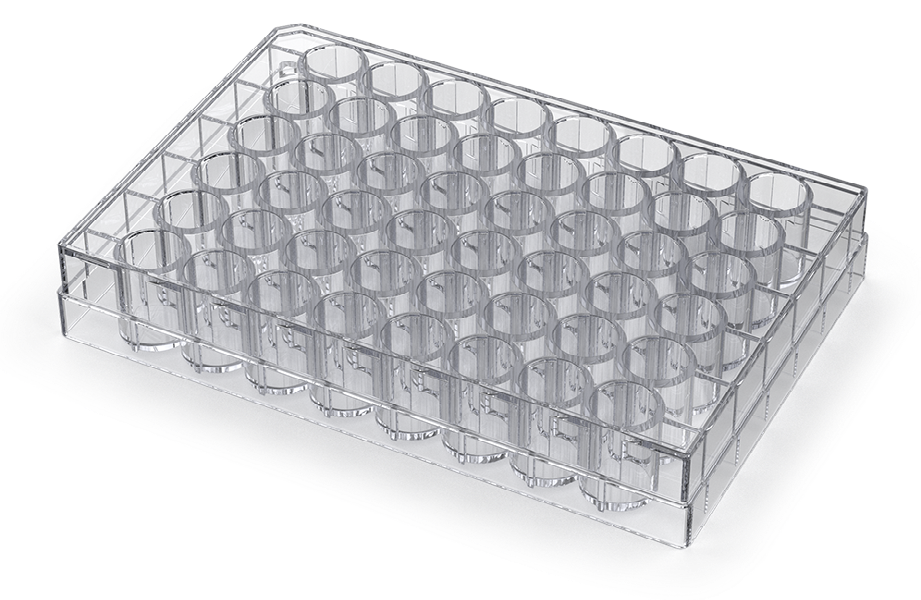{width="3.0680544619422574in"
height="1.9986111111111111in"}

> 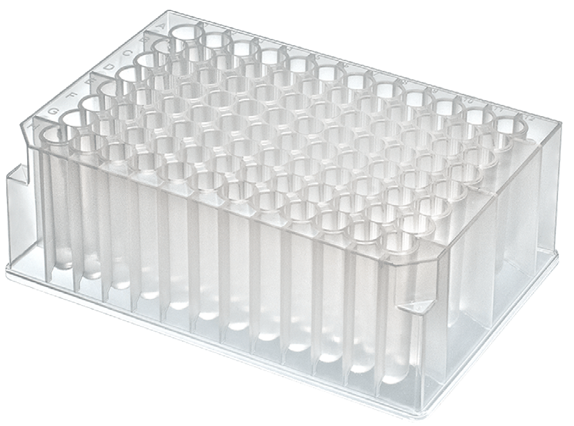{width="2.7472222222222222in"
> height="2.0416666666666665in"}

OPENTRONS FLEX 85

> CHAPTER 5: LABWARE
>
> 6-well plates

+-----------------------+-----------------------+-----------------------+
| > **Manufacturer**    | > **Specifications**  | > **API load name**   |
+=======================+=======================+=======================+
| > Corning             | 6 wells               |                       |
+-----------------------+-----------------------+-----------------------+

> 16.8 mL/well\
> Circular wells, flat bottom
>
> 12-well plates

+-----------------------+-----------------------+-----------------------+
| > **Manufacturer**    | > **Specifications**  | > **API load name**   |
+=======================+=======================+=======================+
| > Corning             | 12 wells              |                       |
+-----------------------+-----------------------+-----------------------+

> 6.9 mL/well\
> Circular wells, flat bottom
>
> 24-well plates

+-----------------------+-----------------------+-----------------------+
| > **Manufacturer**    | > **Specifications**  | > **API load name**   |
+=======================+=======================+=======================+
| > Corning             | 24 wells              |                       |
+-----------------------+-----------------------+-----------------------+

> 3.4 mL/well\
> Circular wells, flat bottom
>
> 48-well plates

+-----------------------+-----------------------+-----------------------+
| > **Manufacturer**    | > **Specifications**  | > **API load name**   |
+=======================+=======================+=======================+
| > Corning             | 48 wells              |                       |
+-----------------------+-----------------------+-----------------------+

> 1.6 mL/well\
> Circular wells, flat bottom

+-----------------------------------+-----------------------------------+
| > 86                              | OPENTRONS FLEX                    |
+===================================+===================================+
+-----------------------------------+-----------------------------------+

> CHAPTER 5: LABWARE
>
> 96-well plates

+-----------------------+-----------------------+-----------------------+
| > **Manufacturer**    | > **Specifications**  | > **API load name**   |
+=======================+=======================+=======================+
| > Bio-Rad             | 96 wells              |                       |
+-----------------------+-----------------------+-----------------------+

200 µL/well

Circular wells, V bottom

+-----------------------+-----------------------+-----------------------+
| > Corning             | 96 wells              |                       |
+=======================+=======================+=======================+
+-----------------------+-----------------------+-----------------------+

360 µL/well

Circular wells, flat bottom

+-----------------------+-----------------------+-----------------------+
| > NEST                | 96 wells              |                       |
+=======================+=======================+=======================+
+-----------------------+-----------------------+-----------------------+

100 µL/well

Circular wells, V bottom

PCR full skirt

+-----------------------------------+-----------------------------------+
| > 96 wells                        |                                   |
+===================================+===================================+
+-----------------------------------+-----------------------------------+

200 µL/well

Circular wells, flat bottom

+-----------------------------------+-----------------------------------+
| > 96 deep wells                   |                                   |
+===================================+===================================+
+-----------------------------------+-----------------------------------+

2000 µL/well

Square wells, V bottom

+-----------------------+-----------------------+-----------------------+
| > Opentrons           | Tough 96 wells        |                       |
+=======================+=======================+=======================+
|                       | 200 µL/well           |                       |
+-----------------------+-----------------------+-----------------------+

Circular wells, V bottom

PCR full skirt

+-----------------------+-----------------------+-----------------------+
| > Thermo Scientific   | > Nunc 96 deep wells  |                       |
+=======================+=======================+=======================+
|                       | > 1300 µL/well        |                       |
+-----------------------+-----------------------+-----------------------+

Circular wells, U bottom

+-----------------------------------+-----------------------------------+
| > Nunc 96 deep wells 2000 µL/well |                                   |
+===================================+===================================+
+-----------------------------------+-----------------------------------+

Circular wells, U bottom

+-----------------------+-----------------------+-----------------------+
| > USA Scientific      | > 96 deep wells       | > p                   |
+=======================+=======================+=======================+
+-----------------------+-----------------------+-----------------------+

2.4 mL/well

Square wells, U bottom

+-----------------------------------+-----------------------------------+
| > OPENTRONS FLEX                  | 87                                |
+===================================+===================================+
+-----------------------------------+-----------------------------------+

> CHAPTER 5: LABWARE
>
> 384-well plates

+-----------------------+-----------------------+-----------------------+
| > **Manufacturer**    | > **Specifications**  | > **API load name**   |
+=======================+=======================+=======================+
| Applied Biosystems    | > 384 wells           | > [a]{.underline}     |
+-----------------------+-----------------------+-----------------------+
|                       | > 40 µL/well          |                       |
+-----------------------+-----------------------+-----------------------+

Circular wells, V bottom

+-----------------------+-----------------------+-----------------------+
| > Bio-Rad             | 384 wells             | > [b]{.underline}     |
+=======================+=======================+=======================+
+-----------------------+-----------------------+-----------------------+

50 µL/well

Circular wells, V bottom

+-----------------------+-----------------------+-----------------------+
| > Corning             | 384 wells             | > t                   |
+=======================+=======================+=======================+
+-----------------------+-----------------------+-----------------------+

112 µL/well

Square wells, flat bottom

> Well plate adapters
>
> The aluminum plates listed below are [thermal adapters]{.underline}
> for the Opentrons Heater-Shaker GEN1 module.
>
> You can use these standalone adapter definitions to load Opentrons
> verified or custom labware on top of
>
> the Heater-Shaker.

+-----------------------------------+-----------------------------------+
| > **Adapter type**                | **API load name**                 |
+===================================+===================================+
+-----------------------------------+-----------------------------------+

> Opentrons 96 Deep Well Heater-Shaker Adapter with NEST Deep Well Plate
> 2 mL
>
> Opentrons 96 Flat Bottom Heater-Shaker Adapter with NEST 96 Well Plate
> 200 µL Flat
>
> \_
>
> Opentrons 96 PCR Heater-Shaker Adapter with NEST Well Plate 100 µL
>
> [opentrons_96_pcr_adapter_nest\_
> wellplate_100ul_pcr_full_skirt]{.underline}
>
> Opentrons Universal Flat Heater-Shaker Adapter with Corning 384 Well
> Plate 112 µL Flat
>
> You can purchase adapters directly from Opentrons:

+-----------------------+-----------------------+-----------------------+
|                       |                       | OPENTRONS FLEX        |
+=======================+=======================+=======================+
|                       |                       |                       |
+-----------------------+-----------------------+-----------------------+
| > 88                  |                       |                       |
+-----------------------+-----------------------+-----------------------+

> CHAPTER 5: LABWARE

+-----------------------------------+-----------------------------------+
| {width="0.3333333333333333in" | > labware onto or off of the      |
| height="0.2638888888888889in"}    | > Heater-Shaker during your       |
|                                   | > protocol, either with the       |
+===================================+===================================+
+-----------------------------------+-----------------------------------+

> gripper or manually. Use a standalone adapter definition instead.

+-----------------------------------+-----------------------------------+
| > **Adapter/labware combination** | **API load name**                 |
+===================================+===================================+
+-----------------------------------+-----------------------------------+

> Opentrons 96 Deep Well Heater-Shaker Adapter with NEST Deep Well Plate
> 2 mL
>
> Opentrons 96 Flat Bottom Heater-Shaker Adapter with NEST 96 Well Plate
> 200 µL Flat
>
> \_ t

+-----------------------------------+-----------------------------------+
| > Opentrons 96 PCR Heater-Shaker  |                                   |
| > Adapter with NEST Well Plate    |                                   |
| > 100 µL                          |                                   |
+===================================+===================================+
+-----------------------------------+-----------------------------------+

> Opentrons Universal Flat Heater-Shaker\
> Adapter with Corning 384 Well Plate 112 µL Flat
>
> Adapters can be purchased directly from Opentrons at .
>
> Well plates and API definitions
>
> The defines the characteristics of the well plates listed above in
> separate JSON files. The Flex robot and the rely on these JSON
> definitions to work with labware used by your protocols. For example,
> when working with the API, the ProtocolContext.load_labware function
> accepts these labware names as valid parameters in your code. Linked
> API load names connect to the well plate labware definitions in the .
>
> Custom well plate labware
>
> Try using the Opentrons Labware Creator to make a custom labware
> definition if a well plate you'd like to use isn't listed here. A
> custom definition combines all the dimensions, metadata, shapes,
> volumetric capacity, and other information in a JSON file. The
> Opentrons Flex reads this information to understand how to work with
> your custom labware. See the [Custom Labware Definitions
> sectio]{.underline}n for more information.
>
> OPENTRONS FLEX 89
>
> CHAPTER 5: LABWARE
>
> **5.4 Tips and tip racks**
>
> Opentrons Flex tips come in 50 µL, 200 µL, and 1000 µL sizes. These
> are clear, non-conducting\
> polypropylene tips that are available with or without filters. They're
> packaged sterile in racks that hold 96 tips and are free of DNase,
> RNase, protease, pyrogens, human DNA, endotoxins, and PCR inhibitors.
> Racks also include lot numbers and expiration dates.
>
> Flex pipette tips work with all single- and multi-channel Opentrons
> Flex 50 µL and 1000 µL pipettes. While any Flex tip fits on any Flex
> pipette, you should always match the tip to a pipette of the same
> capacity or larger. For best performance, use the smallest tips that
> can hold the amount of liquid you need to aspirate. See [Pipette
> specification]{.underline}s for examples.

+-----------------------------------+-----------------------------------+
| > **Pipette capacity**            | > **Compatible tips**             |
+===================================+===================================+
| > 1--50 µL                        | > 50 µL tips only                 |
+-----------------------------------+-----------------------------------+
| > 5--1000 µL                      | > 50 µL, 200 µL, and 1000 µL tips |
+-----------------------------------+-----------------------------------+

> Tip racks
>
> Unfiltered and filtered tips are bundled into a rack that consists of
> a reusable base plate, a mid-plate that holds 96 tips, and a lid.

+-----------------------------------+-----------------------------------+
| > **Tip rack by volume**          | > **API load name**               |
+===================================+===================================+
| > 50 µL                           | > Unfiltered:                     |
+-----------------------------------+-----------------------------------+

Filtered:

+-----------------------------------+-----------------------------------+
| > 200 µL                          | > Unfiltered:                     |
+===================================+===================================+
+-----------------------------------+-----------------------------------+

Filtered: ul

+-----------------------------------+-----------------------------------+
| > 1000 µL                         | > Unfiltered:                     |
+===================================+===================================+
+-----------------------------------+-----------------------------------+

Filtered: ul

> To help with identification, the tip rack mid-plates are color coded
> based on tip size: 50 µL: magenta\
> 200 µL: yellow\
> 1000 µL: blue
>
> 90 OPENTRONS FLEX
>
> CHAPTER 5: LABWARE

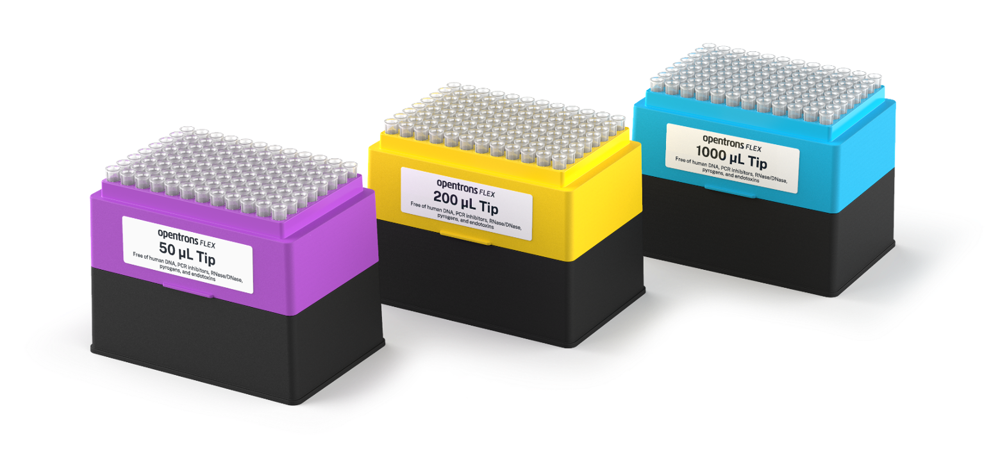{width="5.259722222222222in"
height="2.3666666666666667in"}

> When ordering or reordering, tips and racks come in two different
> packaged configurations:
>
> **Racks:** Consist of separately shrink-wrapped tip racks (base plate,
> mid-plate with tips, and lid). Racked configurations are best when
> cleanliness is paramount, to avoid cross-contamination, or when your
> protocols don't allow for base plate or component reuse.
>
> **Refills:** Consist of one complete tip rack (base plate, mid plate
> with tips, and lid) and individual tip containers. Refill
> configurations are best when your protocols allow for base plate or
> component reuse.
>
> Tip--pipette compatibility
>
> Flex pipette tips are designed for the Opentrons Flex pipettes. Flex
> tips are not backwards compatible with Opentrons OT-2 pipettes, nor
> can you use OT-2 tips on Flex pipettes.
>
> Other industry-standard tips may work with Flex pipettes, but this is
> not recommended. To ensure optimum performance, you should only use
> Opentrons Flex tips with Flex pipettes.
>
> Tip rack adapter
>
> The 96-channel pipette requires an adapter to attach a full rack of
> tips properly. During the attachment procedure, the pipette moves over
> the adapter, lowers itself onto the mounting pins, and pulls tips onto
> the pipettes by lifting the adapter and tip rack.
>
> 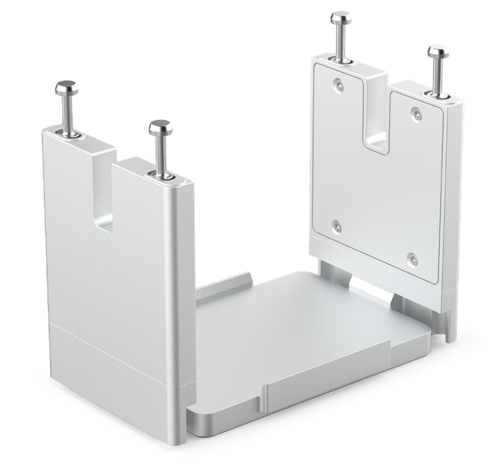{width="2.404166666666667in"
> height="2.3055555555555554in"}

{width="4.5in"
height="0.8055555555555556in"}

> CHAPTER 5: LABWARE

+-----------------------------------+-----------------------------------+
| {width="0.3333333333333333in" | > rack of tips at once. Place tip |
| height="0.2638888888888889in"}    | > racks directly on the deck      |
+===================================+===================================+
+-----------------------------------+-----------------------------------+

> when picking up fewer tips.
>
> **Warning:** Pinch point hazard. Keep hands away from the tip rack
> adapter while the pipette is attaching pipette tips.

+-----------------------------------+-----------------------------------+
| > **Adapter type**                | > **API load name**               |
+===================================+===================================+
+-----------------------------------+-----------------------------------+

+-----------------------------------+-----------------------------------+
| > Opentrons Flex 96 Tip Rack      | > r                               |
| > Adapter                         |                                   |
+===================================+===================================+
+-----------------------------------+-----------------------------------+

> The tip rack adapter is compatible with the Opentrons Flex Gripper.
> You can use the gripper to place fresh tip racks on the adapter or to
> pick up and move used tip racks into the waste chute.
>
> **5.5 Tubes and tube racks**

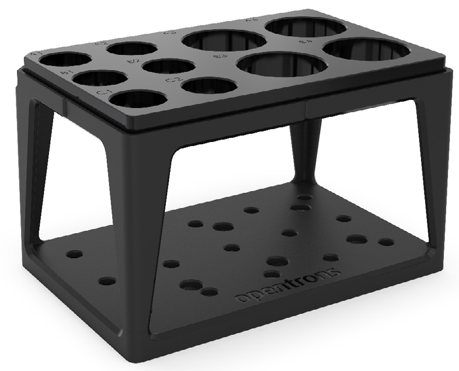{width="2.616665573053368in"
height="2.1152766841644794in"}

> 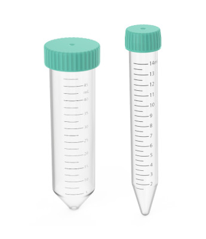{width="1.4874989063867017in"
> height="1.725in"}
>
> The works with the Opentrons Flex by default. Using the 4-in-1 tube
> rack helps reduce your prep work burden because the combinations it
> provides are automation-ready right out of the box. More information
> is also available in the .
>
> 92 OPENTRONS FLEX

{width="3.763888888888889in"
height="0.8333333333333334in"}

> CHAPTER 5: LABWARE
>
> Tube and rack combinations
>
> The Opentrons 4-in-1 tube rack supports a wide variety of tube sizes,
> singly or in different size (volume) combinations. These include a:
>
> 6-tube rack for 50 mL tubes (6 x 50 mL).
>
> 10-tube combination rack for four 50 mL tubes and six 15 mL tubes (4 x
> 50 mL, 6 x 15 mL). 15-tube rack for 15 mL tubes (15 x 15 mL).
>
> 24-tube rack for 0.5 mL, 1.5 mL, or 2 mL tubes (24 x 0.5 mL, 1.5 mL, 2
> mL).
>
> **Note:** All tubes are cylindrical with V-shaped\
> (conical) bottoms unless otherwise indicated.
>
> 6-tube racks

+-----------------------------------+-----------------------------------+
| > **Tube type**                   | > **API load name**               |
+===================================+===================================+
| > 6 Falcon 50 mL                  |                                   |
+-----------------------------------+-----------------------------------+
| > 6 NEST 50 mL                    |                                   |
+-----------------------------------+-----------------------------------+

> 10-tube racks

+-----------------------------------+-----------------------------------+
| > **Tube type**                   | > **API load name**               |
+===================================+===================================+
| > 4 Falcon 50 mL                  |                                   |
+-----------------------------------+-----------------------------------+

> 6 Falcon 15 mL

+-----------------------------------+-----------------------------------+
| > 4 NEST 50 mL                    |                                   |
+===================================+===================================+
+-----------------------------------+-----------------------------------+

> 6 NEST 15 mL
>
> CHAPTER 5: LABWARE
>
> 15-tube racks

+-----------------------------------+-----------------------------------+
| > **Tube type**                   | > **API load name**               |
+===================================+===================================+
| > 15 Falcon 15 mL                 |                                   |
+-----------------------------------+-----------------------------------+
| > 15 NEST 15 mL                   |                                   |
+-----------------------------------+-----------------------------------+

> 24-tube racks

+-----------------------------------+-----------------------------------+
| > **Tube type**                   | > **API load name**               |
+===================================+===================================+
| 24 Eppendorf Safe-Lock 1.5 mL     |                                   |
+-----------------------------------+-----------------------------------+

> 24 Eppendorf Safe-Lock 2 mL, U-shaped bottom

+-----------------------------------+-----------------------------------+
| > 24 generic 2 mL screw cap       |                                   |
+===================================+===================================+
| > 24 NEST 0.5 mL screw cap        |                                   |
+-----------------------------------+-----------------------------------+
| > 24 NEST 1.5 mL screw cap        |                                   |
+-----------------------------------+-----------------------------------+
| > 24 NEST 1.5 mL snap cap         |                                   |
+-----------------------------------+-----------------------------------+
| > 24 NEST 2 mL screw cap          |                                   |
+-----------------------------------+-----------------------------------+
| > 24 NEST 2 mL snap cap,          |                                   |
+-----------------------------------+-----------------------------------+

> U-shaped bottom
>
> Tube rack API definitions
>
> The defines the characteristics of the tube racks listed above in
> separate JSON files. The Flex robot and the rely on these JSON
> definitions to work with labware used by your protocols. For example,
> when working with the API, the ProtocolContext.load_labware function
> accepts these labware names as valid parameters in your code. Linked
> API load names connect to the tube rack labware definitions in the .
>
> CHAPTER 5: LABWARE
>
> Custom tube rack labware
>
> Try creating a custom labware definition using the if a tube and rack
> combination you'd like to use isn't listed here. A custom definition
> combines all the dimensions, metadata, shapes, volumetric capacity,
> and other information in a JSON file. The Opentrons Flex reads this
> information to understand how to work with your custom labware. See
> the [Custom Labware Definitionssection]{.underline} for more
> information.
>
> **5.6 Aluminum blocks**
>
> Aluminum blocks ship with the Temperature Module GEN2 and can be
> purchased separately as a . The set includes a flat bottom plate, a
> 24-well block, and a 96-well block.
>
> The Opentrons Flex uses aluminum blocks to hold sample tubes and well
> plates on the Temperature Module or directly on the deck. When used
> with the Temperature Module, the aluminum blocks can keep your sample
> tubes, PCR strips, or plates at a constant temperature between 4 °C
> and 95 °C.
>
> Flat bottom plate
>
> The flat bottom plate for Flex ships with the Temperature Module's
> caddy and is compatible with various ANSI/SLAS standard well plates.
> This flat plate differs from the plate that ships with the Temperature
> Module itself or the separate three-piece set. It features a wider
> working surface and chamfered corner clips. These features help
> improve the performance of the Opentrons Flex Gripper when moving
> labware onto or off of the plate.
>
> You can tell which flat bottom plate you have because the one for Flex
> has the words "Opentrons Flex" on its top surface. The one for OT-2
> does not.

{width="3.5875in"
height="2.073611111111111in"}

> CHAPTER 5: LABWARE
>
> 24-well aluminum block
>
> The 24-well block is used with individual sample vials. For example,
> it accepts sample vials that:
>
> Have V-shaped or U-shaped bottoms.
>
> Secure contents with snap cap or screw cap closures. Hold liquid in
> capacities of 0.5 mL, 1.5 mL, and 2 mL.
>
> 96-well aluminum block
>
> The 96-well block supports a wide variety of well plate types. For
> example, it accepts well plates that are:
>
> From major well-plate manufacturers like Bio-Rad and NEST.
>
> Designed with V-shaped bottoms, U-shaped bottoms, or flat bottoms.
>
> Designed with 100 µL or 200 µL wells.
>
> It is also compatible with generic PCR strips.
>
> Standalone adapters
>
> 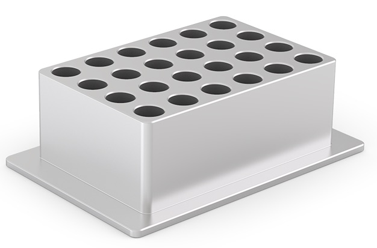{width="2.5694444444444446in"
> height="1.6944444444444444in"}
>
> 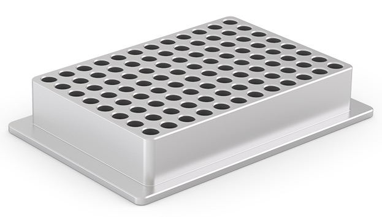{width="2.5694444444444446in"
> height="1.4611100174978127in"}

+-----------------------------------+-----------------------------------+
| > **Thermal block**               | > **API load name**               |
+===================================+===================================+
| > Flex flat bottom plate          | > e                               |
+-----------------------------------+-----------------------------------+
| > 24-well aluminum block          | > *See labware combinations       |
|                                   | > below.*                         |
+-----------------------------------+-----------------------------------+
| > 96-well aluminum block          |                                   |
+-----------------------------------+-----------------------------------+

> Aluminum block labware combinations
>
> The supports the following block, vial, and well plate combinations,
> which
>
> are also defined in separate JSON labware definition files. The Flex
> robot and the
>
> 96 OPENTRONS FLEX
>
> CHAPTER 5: LABWARE
>
> rely on these JSON definitions to work with labware used by your
> protocols. For example, when working with the API, the
> ProtocolContext.load_labware function accepts these labware names as
> valid parameters in your code. The tables below list the default
> block/container combinations and related API load names. Links connect
> to corresponding JSON definitions in the .

+-----------------------------------+-----------------------------------+
| {width="0.3333333333333333in" | > bottoms unless otherwise        |
| height="0.2638888888888889in"}    | > indicated.                      |
+===================================+===================================+
|                                   |                                   |
+-----------------------------------+-----------------------------------+

> 24-well aluminum block labware combinations

+-----------------------------------+-----------------------------------+
| > **24-well block contents**      | > **API load name**               |
+===================================+===================================+
| > Generic 2 mL screw cap          |                                   |
+-----------------------------------+-----------------------------------+
| > NEST 0.5 mL screw cap           |                                   |
+-----------------------------------+-----------------------------------+
| > NEST 1.5 mL screw cap           |                                   |
+-----------------------------------+-----------------------------------+
| > NEST 1.5 mL snap cap            |                                   |
+-----------------------------------+-----------------------------------+
| > NEST 2 mL screw cap             |                                   |
+-----------------------------------+-----------------------------------+
| NEST 2 mL snap cap, U-shaped      |                                   |
| bottom                            |                                   |
+-----------------------------------+-----------------------------------+

> 96-well aluminum block labware combinations

+-----------------------+-----------------------+-----------------------+
| > **96-well block     | > **API load name**   |                       |
| > contents**          |                       |                       |
+=======================+=======================+=======================+
| > Bio-Rad well plate  |                       |                       |
| > 200 µL              |                       |                       |
+-----------------------+-----------------------+-----------------------+
| > Generic PCR strip   |                       |                       |
| > 200 µL              |                       |                       |
+-----------------------+-----------------------+-----------------------+
| > NEST well plate 100 |                       |                       |
| > µL                  |                       |                       |
+-----------------------+-----------------------+-----------------------+
| > OPENTRONS FLEX      |                       | 97                    |
+-----------------------+-----------------------+-----------------------+

> CHAPTER 5: LABWARE
>
> **5.7 Labware and the Opentrons Flex Gripper**
>
> Although the Opentrons Flex works with all the inventory in the
> Labware Library, the Opentrons Flex Gripper is compatible with
> specific labware items only. Currently, the Gripper is optimized for
> use with the following labware items.

+-----------------------------------+-----------------------------------+
| > **Labware category**            | > **Brands**                      |
+===================================+===================================+
| > Deep Well Plates                | > NEST 96 Deep Well Plate 2 mL    |
+-----------------------------------+-----------------------------------+

> Fully Skirted 96 Well Plates
>
> Opentrons Tough 96 Well Plate 200 µL PCR Full Skirt NEST 96 Well Plate
> 200 µL Flat
>
> Tip Racks (unfiltered and filtered tips)
>
> Opentrons Flex 96 Tip Rack 50 µL Opentrons Flex 96 Tip Rack 200 µL
> Opentrons Flex 96 Tip Rack 1000 µL

+-----------------------------------+-----------------------------------+
| {width="0.3333333333333333in" | > labware listed above. The Flex  |
| height="0.2638888888888889in"}    | > Gripper may work with other     |
|                                   | > ANSI/SLAS automation compliant  |
|                                   | > labware,                        |
+===================================+===================================+
+-----------------------------------+-----------------------------------+

> but this is not recommended.
>
> **5.8 Custom labware definitions**
>
> As discussed at the beginning of this chapter, custom labware is
> labware that's not listed in the Opentrons Labware Library. You can
> use other common or unique labware items with the Flex by accurately
> measuring and recording the characteristics of that object and saving
> that data in a JSON file. When imported into the app, the Flex and the
> API uses that JSON data to interact with your labware. Opentrons
> provides tools and services, which we'll examine below, to help you
> use the Flex with custom labware.
>
> 98 OPENTRONS FLEX
>
> CHAPTER 5: LABWARE
>
> Creating custom labware definitions
>
> Opentrons tools and services help put custom labware within your
> reach. These features accommodate different skill levels and ways of
> working. Creating your own labware, and using it with the Opentrons
> Flex, helps make the robot a versatile and powerful addition to your
> lab.
>
> CUSTOM LABWARE CREATOR
>
> The is a no-code, web-based tool that uses a graphical interface to
> help you create a labware definition file. Labware Creator produces a
> JSON labware definition file that you import into the Opentrons App.
> After that, your custom labware is available to the Flex robot and the
> Python API.
>
> CUSTOM LABWARE SERVICE
>
> Get in touch with us if the labware you'd like to use isn't available
> in the library, if you can't create your own definitions, or because a
> custom item includes different shapes, sizes, or other irregularities
> described below.

+-----------------------------------+-----------------------------------+
| > **Labware you can define in     | > **Labware Opentrons needs to    |
| > Labware Creator**               | > define**                        |
+===================================+===================================+
| > ; Wells and tubes are uniform   | > ; Wells and tube shapes vary.   |
| > and identical.                  |                                   |
+-----------------------------------+-----------------------------------+
| > ; All rows are evenly spaced    | > ; Rows are not evenly spaced.   |
+-----------------------------------+-----------------------------------+

> (the space between rows is equal).

+-----------------------------------+-----------------------------------+
| > ; All columns are evenly spaced | > ; Columns are not evenly        |
|                                   | > spaced.                         |
+===================================+===================================+
+-----------------------------------+-----------------------------------+

> (the space between columns is equal).
>
> ; Fits perfectly in one deck slot.
>
> ; Smaller than one deck slot (requires adapter) or spans multiple deck
> slots.
>
> CHAPTER 5: LABWARE

Here are some diagrams that help you visualize the examples described
above.

<table>
<colgroup>
<col style="width: 9%" />
<col style="width: 9%" />
<col style="width: 9%" />
<col style="width: 9%" />
<col style="width: 9%" />
<col style="width: 9%" />
<col style="width: 9%" />
<col style="width: 9%" />
<col style="width: 9%" />
<col style="width: 9%" />
<col style="width: 9%" />
</colgroup>
<thead>
<tr class="header">
<th colspan="2"></th>
<th colspan="3"></th>
<th colspan="3"></th>
<th><blockquote>

</blockquote></th>
<th rowspan="4"></th>
<th><blockquote>

<strong>Regular</strong>

</blockquote></th>
</tr>
<tr class="odd">
<th colspan="2"></th>
<th colspan="3"></th>
<th colspan="3"></th>
<th><blockquote>

</blockquote></th>
<th rowspan="2">All columns are evenly spaced and all rows are evenly
spaced.</th>
</tr>
<tr class="header">
<th colspan="2" rowspan="2"></th>
<th colspan="3" rowspan="2"></th>
<th colspan="3" rowspan="2"></th>
<th rowspan="2"><blockquote>

</blockquote></th>
</tr>
<tr class="odd">
<th><blockquote>

Columns do not need to have the same spacing as rows.

</blockquote></th>
</tr>
</thead>
<tbody>
<tr class="odd">
<td colspan="2"></td>
<td colspan="3"><blockquote>

</blockquote></td>
<td colspan="2"></td>
<td colspan="2"><blockquote>

</blockquote></td>
<td rowspan="4"></td>
<td rowspan="2"><blockquote>

<strong>Regular</strong>

</blockquote></td>
</tr>
<tr class="even">
<td colspan="2" rowspan="2"></td>
<td colspan="3" rowspan="2"><blockquote>

</blockquote></td>
<td colspan="2" rowspan="2"></td>
<td colspan="2" rowspan="2"><blockquote>

</blockquote></td>
</tr>
<tr class="odd">
<td rowspan="2"><blockquote>

The grid does not have to be in the center of labware.

</blockquote></td>
</tr>
<tr class="even">
<td colspan="2"></td>
<td colspan="3"><blockquote>

</blockquote></td>
<td colspan="2"></td>
<td colspan="2"><blockquote>

</blockquote></td>
</tr>
<tr class="odd">
<td colspan="2"></td>
<td colspan="3"></td>
<td colspan="3"></td>
<td><blockquote>

</blockquote></td>
<td rowspan="4"></td>
<td rowspan="2"><blockquote>

<strong>Irregular</strong>

</blockquote></td>
</tr>
<tr class="even">
<td colspan="2" rowspan="2"></td>
<td colspan="3" rowspan="2"></td>
<td colspan="3" rowspan="2"></td>
<td rowspan="2"><blockquote>

</blockquote></td>
</tr>
<tr class="odd">
<td rowspan="2"><blockquote>

Rows are evenly spaced but <strong>columns are not evenly
spaced.</strong>

</blockquote></td>
</tr>
<tr class="even">
<td colspan="2"></td>
<td colspan="3"></td>
<td colspan="3"></td>
<td><blockquote>

</blockquote></td>
</tr>
<tr class="odd">
<td colspan="2"></td>
<td colspan="3"></td>
<td colspan="3"></td>
<td><blockquote>

</blockquote></td>
<td rowspan="4"></td>
<td rowspan="2"><blockquote>

<strong>Irregular</strong>

</blockquote></td>
</tr>
<tr class="even">
<td colspan="2" rowspan="2"></td>
<td colspan="3" rowspan="2"></td>
<td colspan="3" rowspan="2"></td>
<td rowspan="2"><blockquote>

</blockquote></td>
</tr>
<tr class="odd">
<td rowspan="2"><blockquote>

Columns/rows are evenly spaced but <strong>wells are not
identical.</strong>

</blockquote></td>
</tr>
<tr class="even">
<td colspan="2"></td>
<td colspan="3"></td>
<td colspan="3"></td>
<td><blockquote>

</blockquote></td>
</tr>
<tr class="odd">
<td></td>
<td colspan="2"></td>
<td></td>
<td colspan="2"></td>
<td colspan="2" rowspan="2"></td>
<td rowspan="2"><blockquote>

</blockquote></td>
<td rowspan="6"></td>
<td rowspan="3"><blockquote>

<strong>Irregular</strong>

</blockquote></td>
</tr>
<tr class="even">
<td></td>
<td colspan="2"></td>
<td></td>
<td colspan="2"></td>
</tr>
<tr class="odd">
<td rowspan="2"></td>
<td colspan="2" rowspan="2"></td>
<td rowspan="2"></td>
<td colspan="2" rowspan="2"></td>
<td colspan="2" rowspan="2"></td>
<td rowspan="2"><blockquote>

</blockquote></td>
</tr>
<tr class="even">
<td rowspan="3"><blockquote>

There is <strong>more than one grid.</strong>

</blockquote></td>
</tr>
<tr class="odd">
<td></td>
<td colspan="2"></td>
<td></td>
<td colspan="2"></td>
<td colspan="2" rowspan="2"></td>
<td rowspan="2"><blockquote>

</blockquote></td>
</tr>
<tr class="even">
<td></td>
<td colspan="2"></td>
<td></td>
<td colspan="2"></td>
</tr>
<tr class="odd">
<td colspan="11"></td>
</tr>
</tbody>
</table>

Our labware team will work to understand your needs and design custom
labware definitions for you. See

the form for more information. This is a fee-based service.

> CHAPTER 5: LABWARE
>
> PYTHON API
>
> While you cannot create custom labware with our API, you can use
> custom labware with the available API methods. However, you need to
> define your custom labware first and import it into the Opentrons App.
>
> Once you have added your labware to the Opentrons App, it's available
> to the Python API and the robot.
>
> See the [Custom Labware Definitions sectio]{.underline}n of the Python
> API documentation for more information. For information about writing
> protocol scripts with the API, see the [Python Protocol API
> section]{.underline} in the Protocol Development chapter.
>
> JSON labware schema
>
> A JSON file is the blueprint for Opentrons standard and custom
> labware. This file contains and organizes labware data according to
> the design specifications set by the default schema.
>
> A schema is a framework for organizing data. It sets the rules about
> what information is required or optional and how it's organized in the
> JSON file. If you're interested, take a moment to review . For an
> actual example, see the definition for the . The following table lists
> and defines the items in the Opentrons labware schema.

+-----------------------+-----------------------+-----------------------+
| > **Property**        | **Data type**         | > **Definition**      |
+=======================+=======================+=======================+
| schemaVersion         | > Number              | > Schema version used |
|                       |                       | > by a labware. The   |
|                       |                       | > current version is  |
|                       |                       | > 2.                  |
+-----------------------+-----------------------+-----------------------+
| > version             | > Integer             | > An incrementing     |
|                       |                       | > integer that        |
|                       |                       | > identifies the      |
|                       |                       | > labware version.    |
+-----------------------+-----------------------+-----------------------+

Minimum version is 1.

+-----------------------+-----------------------+-----------------------+
| > namespace           | String                | > See safeString in   |
|                       |                       | > the JSON            |
|                       |                       | > definitions section |
|                       |                       | > below.              |
+=======================+=======================+=======================+
| > metadata            | Object                | > Properties used for |
|                       |                       | > search and display. |
|                       |                       | > Accepts only:       |
+-----------------------+-----------------------+-----------------------+

> displayName (String): An easy-to-remember labware name.
> displayCategory: Labels used in the UI to categorize labware. See
> displayCategory in the JSON definitions section below.
>
> displayVolumeUnits (String): Labels used in the UI to indicate volume.
> Must be either µL, mL, or L.

+-----------------------+-----------------------+-----------------------+
| > brand               | Object                | Information about the |
|                       |                       | labware manufacturer  |
|                       |                       | or those products     |
+=======================+=======================+=======================+
+-----------------------+-----------------------+-----------------------+

the labware is compatible with.

> CHAPTER 5: LABWARE

+-----------------------+-----------------------+-----------------------+
| > parameters          | Object                | > Internal parameters |
|                       |                       | > that describe       |
|                       |                       | > labware             |
|                       |                       | > characteristics.    |
+=======================+=======================+=======================+
+-----------------------+-----------------------+-----------------------+

Accepts only:

> format (String): Determines labware compatibility with multichannel
> pipettes. Must be one of 96Standard, 384Standard, trough, irregular,
> or trash.
>
> quirks (Array): Strings describing labware behavior. See the
> definition.
>
> isTiprack (Boolean): Indicates if labware is a tip rack (true) or not
> (false).

tipLength (Number): Required if labware is a tip rack.

Specifies tip length (in mm), from top to bottom, as indicated

in technical drawings or as measured with calipers.

> tipOverlap (Number): Required if labware is a tip rack. Specifies how
> far tips on a tip rack are expected to overlap

with the pipette's nozzle. Defined as tip length minus the

distance between the bottom of the pipette and the bottom

of the tip. The robot's calibration process may fine-tune this

estimate.

> loadName: Name used to reference a labware definition (e.g.,
> opentrons_flex_96_tiprack_50_ul).
>
> isMagneticModuleCompatible (Boolean): Indicates if labware is
> compatible with the Magnetic Module.
>
> magneticModuleEngageHeight: How far the Magnetic Module will move its
> magnets when used with this labware. See positiveNumber in the JSON
> definitions section below.

+-----------------------+-----------------------+-----------------------+
| > ordering            | Array                 | An array that tracks  |
|                       |                       | how wells should be   |
|                       |                       | ordered on a piece of |
+=======================+=======================+=======================+
+-----------------------+-----------------------+-----------------------+

labware. See the example.

+-----------------------+-----------------------+-----------------------+
| cornerOffset          | > Object              | > Used for labware    |
|                       |                       | > that spans multiple |
|                       |                       | > deck slots. Offset  |
|                       |                       | > is the              |
+=======================+=======================+=======================+
| > FromSlot            |                       | distance from the     |
|                       |                       | left-front-bottom     |
|                       |                       | corner of the slot to |
|                       |                       | the left-             |
+-----------------------+-----------------------+-----------------------+

front-bottom corner of the labware bounding box. Accepts only:

> x (number)\
> y (number)\
> z (number)
>
> For labware that does not span multiple slots, these values should be
> zero. See positiveNumber in the JSON definitions section below.
>
> CHAPTER 5: LABWARE

+-----------------------+-----------------------+-----------------------+
| > dimensions          | Object                | > Outer dimensions    |
|                       |                       | > (in mm) of a piece  |
|                       |                       | > of labware. Accepts |
|                       |                       | > only:               |
+=======================+=======================+=======================+
+-----------------------+-----------------------+-----------------------+

> xDimension (length)\
> yDimension (width)\
> zDimension (height)

See the example.

+-----------------------+-----------------------+-----------------------+
| > wells               | Object                | > An unordered object |
|                       |                       | > of well objects,    |
|                       |                       | > including position  |
|                       |                       | > and                 |
+=======================+=======================+=======================+
+-----------------------+-----------------------+-----------------------+

dimensions.

> Each well object's key is the well's coordinates, which must be an
> uppercase letter followed by a number, e.g., A1, B1, H12.

Each well object accepts the following properties:

> depth (Number): The distance (in mm) between the top and bottom of the
> well. For tip racks, depth is ignored in favor of tipLength, but the
> values should match.
>
> x (Number): Location of the center-bottom of a well in reference to
> the left of the labware.
>
> y (Number): Location of the center-bottom of a well in reference to
> the front of the labware.
>
> z (Number): Location of the center-bottom of a well in reference to
> the bottom of the labware.
>
> totalLiquidVolume (Number): Total well, tube, or tip volume in µL.

xDimension (Number): Length of a rectangular well.

yDimension (Number): Width of a rectangular well.

diameter (Number): Diameter of a circular well.

shape (String): Either rectangular or circular.

> If rectangular, specify xDimension and yDimension. If circular,
> specify diameter.
>
> For a circular well example, see the . For a rectangular well example,
> see the .
>
> For dimension, depth, and volume, see positiveNumber in the JSON
> definitions section below.
>
> CHAPTER 5: LABWARE

+-----------------------+-----------------------+-----------------------+
| > groups              | Array                 | > Logical well        |
|                       |                       | > groupings for       |
|                       |                       | > metadata and        |
|                       |                       | > display purposes.   |
+=======================+=======================+=======================+
+-----------------------+-----------------------+-----------------------+

> Changes in groups do not affect protocol execution. Each item in the
> array accepts:
>
> wells (Array): An array of wells (e.g., \["A1","B1","C1"\]) that share
> the same metadata. Array elements are strings.

metadata (Object): Metadata specific to a grid of wells.

> Accepts only:\
> displayName (String): Human-readable name for the well group.

displayCategory: Labels used to categorize well groups.

> See displayCategory in the JSON definitions section below.

wellBottomShape (String): Bottom shape of a well.

Available shapes are flat, u, or v only.

> brand: Brand information for the well group. See brandData in the JSON
> definitions section below.

+-----------------------+-----------------------+-----------------------+
| > allowedRoles        | Array                 | > Defines an item's   |
|                       |                       | > role or purpose. If |
|                       |                       | > the allowedRoles    |
|                       |                       | > field               |
+=======================+=======================+=======================+
+-----------------------+-----------------------+-----------------------+

> is missing from a definition, an item is treated as labware. Possible
> array items are only the following strings:
>
> labware (standard labware items)\
> adapter (items designed to hold labware)\
> fixture (items that are affixed to the deck)\
> maintenance (items not used in normal protocol runs)

+-----------------+-----------------+-----------------+-----------------+
| stackingOffset  | > Object        | > For labware   |                 |
|                 |                 | > that can      |                 |
|                 |                 | > stack on top  |                 |
|                 |                 | > of another    |                 |
|                 |                 | > piece of      |                 |
|                 |                 | > labware.      |                 |
+=================+=================+=================+=================+
| > WithLabware   |                 | Used to         |                 |
|                 |                 | determine       |                 |
|                 |                 | z-height        |                 |
|                 |                 | (labware z      |                 |
|                 |                 | height +        |                 |
|                 |                 | adapter z       |                 |
|                 |                 | height          |                 |
+-----------------+-----------------+-----------------+-----------------+
|                 |                 | \-              | > overlap). See |
|                 |                 |                 | > coordinates   |
|                 |                 |                 | > in the JSON   |
|                 |                 |                 | > definitions   |
|                 |                 |                 | > section       |
+-----------------+-----------------+-----------------+-----------------+

below.

+-----------------+-----------------+-----------------+-----------------+
| stackingOffset  | > Object        | > For labware   |                 |
|                 |                 | > that can      |                 |
|                 |                 | > stack on top  |                 |
|                 |                 | > of a module.  |                 |
|                 |                 | > Used to       |                 |
|                 |                 | > determine     |                 |
+=================+=================+=================+=================+
| > WithModule    |                 | > z-height      | > overlap).     |
|                 |                 | > (module       |                 |
|                 |                 | > labware       |                 |
|                 |                 | > offset z +    |                 |
|                 |                 | > labware z -   |                 |
+-----------------+-----------------+-----------------+-----------------+

See coordinates in the JSON definitions section below.

> CHAPTER 5: LABWARE

+-----------------------+-----------------------+-----------------------+
| gripperOffsets        | > Object              | > Offsets added when  |
|                       |                       | > calculating the     |
|                       |                       | > coordinates the     |
|                       |                       | > gripper             |
+=======================+=======================+=======================+
+-----------------------+-----------------------+-----------------------+

should go to when picking up or dropping other labware on this

labware. Includes a default object that includes two properties:

pickUpOffset: Offset added to calculate the pick-up

coordinates of labware placed on this labware.

dropOffset: Offset added to calculate the drop-off

coordinates of labware placed on this labware.

See coordinates in the JSON definitions section below.

+-----------------------+-----------------------+-----------------------+
| > gripForce           | Number                | Measured in newtons,  |
|                       |                       | this is the force     |
|                       |                       | which the gripper     |
|                       |                       | uses to               |
+=======================+=======================+=======================+
+-----------------------+-----------------------+-----------------------+

grasp labware. Recommended values are between 5 and 16.

+-----------------------+-----------------------+-----------------------+
| > gripHeight          | Number                | > Recommended z-axis  |
|                       |                       | > height, from the    |
|                       |                       | > labware bottom to   |
|                       |                       | > the                 |
+=======================+=======================+=======================+
| > FromLabware         |                       | > center of the       |
|                       |                       | > gripper pads.       |
+-----------------------+-----------------------+-----------------------+

> Bottom
>
> CHAPTER 5: LABWARE
>
> JSON labware definitions

+-----------------------+-----------------------+-----------------------+
| > **Property**        | **Data type**         | > **Definition**      |
+=======================+=======================+=======================+
| positiveNumber        | > Number              | > Minimum: 0.         |
+-----------------------+-----------------------+-----------------------+
| > brandData           | > Object              | > Information about   |
|                       |                       | > branded items.      |
|                       |                       | > Accepts only:       |
+-----------------------+-----------------------+-----------------------+

brand (String): Brand/manufacturer's name.

brandId (Array): OEM part numbers or IDs.

links (Array): Manufacturer URLs. Array items are strings.

+-----------------------+-----------------------+-----------------------+
| displayCategory       | > String              | > Must be one of:     |
+=======================+=======================+=======================+
+-----------------------+-----------------------+-----------------------+

> tipRack\
> tubeRack\
> reservoir\
> trash\
> wellPlate\
> aluminumBlock\
> adapter\
> other

+-----------------------+-----------------------+-----------------------+
| > safeString          | String                | > A string safe to    |
|                       |                       | > use for load names  |
|                       |                       | > and namespaces.     |
+=======================+=======================+=======================+
+-----------------------+-----------------------+-----------------------+

Lowercase letters, numerals, periods, and underscores only.

+-----------------------+-----------------------+-----------------------+
| > coordinates         | Object                | Coordinates that      |
|                       |                       | specify a distance or |
|                       |                       | position along the    |
|                       |                       | x-, y-,               |
+=======================+=======================+=======================+
+-----------------------+-----------------------+-----------------------+

and z-axes. Accepts only:

> x (number)\
> y (number)\
> z (number)

CHAPTER 6\
**Protocol Development**

The Opentrons Flex system can run a wide variety of automated protocols,
for tasks such as PCR, NGS, ELISA, and many more. You can run fully
built and verified protocols, edit community protocols to suit your
needs, or design protocols from scratch---with or without writing code.

This chapter provides an overview of each of these protocol development
methods, as well as giving guidance on how to adapt protocols written
for the Opentrons OT-2 to run on Opentrons Flex.

**6.1 Pre-made protocols**

Protocol Library

The Opentrons Protocol Library hosts protocols authored either by
Opentrons itself or by members of the Opentrons community. To find a
protocol that fits your target application, use the search field at the
top of the .

You can also browse protocols by categories, like DNA/RNA, cell biology,
cell and tissue culture, proteins, commercial assay kits, or molecular
biology. There's even a category for protocols that create art by
pipetting! Take some time to check out the protocols in our library.
Understanding what's available---and making some cool pixel art---is a
great way to learn about the features and capabilities of your robot
before moving on to using real samples and reagents.

SEARCHING FOR PROTOCOLS

The Protocol Library search returns results as you type. You can select
a result from the search list or click **View All Results** to go to the
full results page, which shows more details about each protocol and lets
you filter them based on several criteria.

Each protocol card will show:

OPENTRONS FLEX 107

> CHAPTER 6: PROTOCOL DEVELOPMENT

+-----------------------------------+-----------------------------------+
| > **Item**                        | > **Description**                 |
+===================================+===================================+
+-----------------------------------+-----------------------------------+

+-----------------------------------+-----------------------------------+
| > **Protocol name**               | > The name of the protocol.       |
+===================================+===================================+
| > **Verification**                | > Badges indicate if the protocol |
|                                   | > is verified by Opentrons,       |
+-----------------------------------+-----------------------------------+

a third-party manufacturer, or members of the community.

+-----------------------------------+-----------------------------------+
| > **Time estimate**               | > Approximately how long the      |
|                                   | > protocol takes to run.          |
+===================================+===================================+
| > **Description**                 | > A short summary of what the     |
|                                   | > protocol does.                  |
+-----------------------------------+-----------------------------------+
| > **Robot model**                 | > Which Opentrons robots the      |
|                                   | > protocol is compatible with.    |
+-----------------------------------+-----------------------------------+
| > **Protocol editability**        | > JSON protocols are editable in  |
|                                   | > Protocol Designer, with no      |
|                                   | > coding                          |
+-----------------------------------+-----------------------------------+

> required. Python protocols are editable in any text editor, using the
> Python Protocol API.

+-----------------------------------+-----------------------------------+
| > **Modules**                     | > Any hardware modules that are   |
|                                   | > required.                       |
+===================================+===================================+
+-----------------------------------+-----------------------------------+

> In addition to these categories, in the sidebar you can filter results
> by:
>
> **Pipettes:** Which pipettes the protocol uses (you can usually change
> a protocol's pipettes, but it may affect the run time and the number
> of tips consumed).
>
> **Categories:** Target applications, like DNA/RNA, cell biology,
> proteins, etc. **Protocol version:** Show or hide older versions of
> protocols.
>
> PROTOCOL DETAILS
>
> Click on a protocol to go to its detail page, which provides even more
> information. In addition to what is shown in search, here you can see:
>
> **Supporting data:** Additional data, explanations, or links to
> outside sources provided by the protocol author.
>
> **What you'll need:** A complete list of all equipment needed for the
> protocol, including the robot, modules, labware, pipettes, and
> third-party kits.
>
> **Protocol steps:** A list of steps written by the protocol author, as
> well as a visual deck map and list of liquids specified in the
> protocol file.
>
> 108 OPENTRONS FLEX
>
> CHAPTER 6: PROTOCOL DEVELOPMENT
>
> The details page also provides basic instructions for downloading and
> running the protocol. For more information on importing a protocol to
> the Opentrons App and setting up a run, see the [Transferring
> Protocols to Flex section]{.underline} in the Software and Operation
> chapter.
>
> Custom Protocol Development service
>
> Opentrons provides a for applications not already included in the
> Protocol Library. Our comprehensive authoring and validation service
> has a turnaround time of two weeks. As part of the service, Opentrons
> field applications scientists will:
>
> Develop the Python protocol.
>
> Validate the code.
>
> Install the protocol remotely.
>
> Create deck and reagent setup instructions.
>
> Optimize your protocol as much as needed within one week of initial
> delivery.
>
> By default, Opentrons adds all custom protocols to the Protocol
> Library so the community can benefit from them. However, if your
> application requires privacy, you can opt out of inclusion in the
> Protocol Library.

+-----------------------------------+-----------------------------------+
| {width="0.3333333333333333in" | > Python protocols that control   |
| height="0.2638888888888889in"}    | > Opentrons hardware. It does not |
|                                   | > cover controlling the robot     |
|                                   | > with                            |
+===================================+===================================+
+-----------------------------------+-----------------------------------+

> code in other languages, nor does it cover controlling third-party
> hardware.
>
> PROTOCOL REQUEST GUIDELINES
>
> Describing your protocol in detail enables Opentrons field
> applications scientists to accurately code the automation that you
> need. Consider your protocol's requirements, including:
>
> Hardware (pipettes, gripper, modules, fixtures).
>
> Labware (Opentrons verified, other standard, or custom).
>
> Also consider special cases that apply to your protocol, like:
>
> Liquids that are volatile, viscous, or otherwise behave differently
> than water. Conservation of expensive reagents.
>
> OPENTRONS FLEX 109
>
> CHAPTER 6: PROTOCOL DEVELOPMENT
>
> Sterility and cross-contamination.
>
> Advanced pipetting techniques like air-gapping, high or low flow rate,
> or pipetting at specific locations within wells.
>
> To explain the movements the robot will make in executing the
> protocol, start with your initial deck state. Where should modules,
> labware, and trash containers be located? Which liquids will be in
> which labware, and in what quantities? Use the coordinate systems
> printed on the Opentrons Flex deck and on standard labware to describe
> these locations.
>
> Next, give step-by-step instructions on how Opentrons Flex should
> handle liquids, specifying quantities in microliters (µL) and giving
> exact source and destination locations (rows, columns, or individual
> wells of labware).
>
> In general, following the style of the methods section of an academic
> paper will help the Opentrons team understand your instructions. And
> always err on the side of providing extra information---it may be
> exactly the detail we need to write code for your protocol.
>
> CUSTOM PROTOCOL PRICING
>
> Custom Protocol Development is a service available to all owners of
> Opentrons Flex systems. Opentrons provides remote and onsite protocol
> development services customized to your specific workflow. Price and
> development time are based on the complexity of your protocol and the
> related code. See the\
> of the Opentrons website to contact us for more information about our
> Custom Protocol Development offerings.
>
> 110 OPENTRONS FLEX
>
> **6.2 Protocol Designer**
>
> is a web-based, no-code tool for developing protocols that run on
> Opentrons robots, including Opentrons Flex. You can use Protocol
> Designer to create protocols that:
>
> Aspirate, dispense, transfer, and mix liquids.
>
> Move labware around the deck with the gripper.\
> Operate Opentrons Flex modules.
>
> Pause to let you verify progress or access samples.
>
> All work on your protocol takes place within your web browser. When
> you're done creating or editing your protocol, you need to export it
> to a JSON file. Then upload that file to a robot and run it, as you
> would with any protocol.
>
> Protocol Designer requirements
>
> Currently, Protocol Designer is only supported for use in Google
> Chrome and requires an internet connection. Uploading and running JSON
> protocols on Opentrons Flex requires version 7.0.0 or later of the
> Opentrons App.
>
> You can't create or modify Python protocol files with Protocol
> Designer.
>
> CHAPTER 6: PROTOCOL DEVELOPMENT
>
> Designing a protocol
>
> Protocols are all about informing the robot what hardware it will use
> to take specific actions. This process is broken down into three tabs
> in Protocol Designer:

+-----------------------------------+-----------------------------------+
| **Icon**                          | > **Tab**                         |
+===================================+===================================+
| {width="0.35in" | > specify hardware for use in     |
| height="0.4388888888888889in"}    | > your protocol.                  |
+-----------------------------------+-----------------------------------+
| {width="0.35in" | > any other liquids that your     |
| height="0.4388877952755906in"}    | > robot will handle.              |
+-----------------------------------+-----------------------------------+
| {width="0.35in" | > the deck, add steps that the    |
| height="0.3972211286089239in"}    | > robot will perform, and view    |
|                                   | > the projected outcomes of those |
|                                   | > steps.                          |
+-----------------------------------+-----------------------------------+

> To create a protocol from scratch, you'll start on the File tab, work
> with the Liquids and Design tabs, and then return to the File tab to
> export your work. The remainder of this section goes through the
> protocol creation process in detail.
>
> PART 1: CREATE A PROTOCOL
>
> When you launch Protocol Designer, you'll begin on the **File** tab.
> In the left sidebar, click **Create New** to open the Create New
> Protocol dialog. Click on the image of Opentrons Flex and then click
> **Next**.
>
> 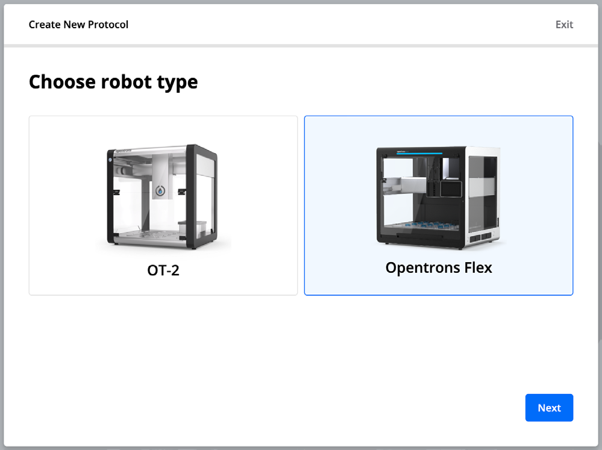{width="3.327777777777778in"
> height="2.4902777777777776in"}
>
> Choosing to create a protocol for Opentrons Flex in Protocol Designer.
>
> 112 OPENTRONS FLEX

Enter a name for your protocol, which is how it will appear in the
Opentrons App and on the touchscreen. You'll also see your protocol name
in the Protocol Designer header while you're working on it. Optionally
add a description and author information for your protocol.

Next, Protocol Designer guides you through choosing the hardware used in
your protocol:

1\. Pipettes and what type of tip racks you'll use with them. Every
protocol requires at least one pipette. 2. Staging area slots in column
3 (optional).

3\. Additional hardware used in your protocol, such as modules, the
gripper, or the waste chute. Only [modules that are compatible with
Flex]{.underline} are shown.

+-----------------------------------+-----------------------------------+
| {width="0.3333333333333333in" | > Modules or Magnetic Blocks in a |
| height="0.2638888888888889in"}    | > JSON protocol. If your          |
|                                   | > application requires them,      |
|                                   | > you'll need to use a Python     |
|                                   | > protocol. See the               |
|                                   | >                                 |
|                                   | > {width="2.0972222222222223in" |
|                                   | > height="2.7777777               |
|                                   | 777777776e-2in"}[Python-exclusive |
|                                   | > features section]{.underline}   |
|                                   | > below.                          |
+===================================+===================================+
|                                   |                                   |
+-----------------------------------+-----------------------------------+

At any time, you can return to the File tab to rename your protocol, add
an author name or description, or change your hardware configuration.

PART 2: DEFINE LIQUIDS

Move on to the **Liquids** tab to set up samples and reagents. This tab
is only for *defining* types of liquids. You'll indicate the starting
positions and amounts of liquids in Part 3, on the Design tab.

Click **New Liquid** and then enter the name of your liquid and an
optional description. You can also choose whether to *serialize* the
liquid, so each well containing that liquid will be numbered on the deck
map and in action steps. For example, if your protocol has blood
samples, serialization can help you keep them separate in your workflow,
while still labeling them all as "blood" and color-coding them the same.

Each type of liquid appears in a different color on the deck map in
Protocol Designer, in the Opentrons App, and on the touchscreen. You can
use the default color, pick another preset color, or enter an RGB hex
code to set a custom color.

> CHAPTER 6: PROTOCOL DEVELOPMENT

PART 3: LAY OUT THE DECK

Go to the Design tab to do the final setup step, which is placing
labware and liquids on the deck. The main view on this tab is the deck
map, which shows everything on the deck down to individual wells ---
even on 384-well plates.

The deck map starts with the tip racks and modules you chose for your
protocol in their default locations. Hover over any open slot and click
**Add Labware or Adapter** to add more tip racks, other types of
labware, or adapters. Drag and drop labware to an open slot to move it
there, or to an occupied slot to swap the two pieces of labware.

+-----------------------------------+-----------------------------------+
| {width="0.3333333333333333in" | > deck map by drag and drop. This |
| height="0.2638888888888889in"}    | > is to make it easier to move    |
|                                   | > *labware* onto or off of a      |
|                                   | > module.                         |
+===================================+===================================+
+-----------------------------------+-----------------------------------+

> To change a module's position, return to the **File** tab and click
> **Edit** next to the module name.
>
> To change an adapter's position, add a new adapter. Then move the
> labware from the old adapter to the new adapter. Finally, delete the
> old adapter.

Hover over any labware and click **Add Liquids** to specify which wells
contain which liquid. Clicking on a single well or dragging across a
range of wells will reveal a form at the top of the screen. Choose one
of the liquids you defined and the volume *each* well should start with,
in µL. For example, if you select the first column on a 96-well plate
and specify 100 µL, that will be 800 µL of liquid total (100 µL × 8
wells).

PART 4: ADD STEPS

At last, it's time to tell your robot how to move liquid around the
deck. Click **Add Step** and choose the type of step.

> Pipetting steps
>
> **Transfer:** Move liquid from one well or group of wells to another.
> Specify the source, where liquid will be aspirated from, on the left.
> Specify the destination, where liquid will be dispensed, on the right.
> Click either gear icon to change behaviors such as flow rate, tip
> height, knocking droplets off (touch tip), air gapping, blowout, and
> more. In the Sterility & Motion section, choose the correct tip-use
> strategy for your application.

114 OPENTRONS FLEX

> **Mix:** Repeatedly aspirate and dispense liquid within the same well.
> Choose how much liquid to mix with, the number of mixing repetitions,
> and which wells will be mixed. Like with transfer steps, click either
> gear to change mixing behavior. You can also choose a tip-use strategy
> for mixing. These options are more limited than for transfers, since
> all liquid returns to its starting location when mixing.
>
> Gripper steps
>
> **Move Labware:** Control the Flex Gripper or move labware around the
> deck manually. Choose which labware you want to move and its new
> location. Check the **Use Gripper** box to have the gripper move the
> labware automatically, or leave it unchecked to have the protocol
> pause so you can move the labware manually. You need to use the
> gripper to dispose labware by moving it into the waste chute. You need
> to move labware manually to move it off the deck (without disposing
> it).
>
> Module steps
>
> **Heater-Shaker:** Control the temperature, shake speed, and labware
> latch of the Heater-Shaker Module. You can set an optional timer that
> will pause the protocol for a set period of time *after* the other
> actions are completed (heating to high temperatures or waiting for the
> module to passively cool to a temperature can take a long time).
>
> **Temperature:** Set a target temperature or deactivate the
> Temperature Module.
>
> **Thermocycler:** This action has two mutually exclusive sets of
> options.
>
> Change Thermocycler state: Set a block temperature, set a lid
> temperature, or move the lid. Program a Thermocycler profile: Define a
> *profile*, a timed heating and cooling routine that can be
> automatically repeated. Each step of the profile holds the block at a
> certain temperature for a certain time. Profiles do not change the
> temperature of the lid.
>
> **Pause:** Prevent the protocol from continuing until one of three
> criteria is met. Pauses can require user intervention (pressing a
> button on the touchscreen or in the app), wait for a fixed time, or
> wait until a module reaches a target temperature. Timed pauses are
> useful for incubation or letting the Magnetic Block work.

PART 5: EDIT STEPS

Once you've created a step, preview its effects by hovering over it in
the Protocol Timeline. Affected tips and wells will be highlighted, as
will the entire labware containing those wells.

Show or hide the details of a step by clicking the disclosure triangle
to the right of its name. For liquid handling steps, this will show
every discrete aspirate and dispense pair comprising the step. For
module steps, this will show the features of the module that the step
controls.

{width="5.805555555555555in"
height="1.1805555555555556in"}

Click on the name of a step in the Protocol Timeline to edit it.
Shift-click to select a range of steps and enter batch editing mode. If
you select only transfer or mix steps, you can change their behavior as
a batch. Reorder steps by dragging and dropping them up or down in the
Protocol Timeline.

When editing any step, click **Notes** to change the step name or add a
description of what the step does. Custom step names replace their
default action descriptions (like "Transfer" and "Temperature") in the
Protocol Timeline, making it easier to navigate around your protocol.

PART 6: EXPORT YOUR PROTOCOL

When your protocol is complete, click **Final Deck State** to preview
how the deck should appear at the end of your protocol. In this view (or
when viewing a particular step), you can click on labware and examine
the expected quantity of liquid in each well.

To save your work, return to the File tab and click **Export** to
download your protocol as a JSON file. The file will have the name you
chose in the Protocol Name field and will have a .json extension. You
can find exported protocols in the default download location of your web
browser.

To run your protocol, import it into the Opentrons App. (See the
[Software and Operation chapter]{.underline} for details on installing
and using the Opentrons App.) Then either run it from the app or send it
to your Flex to run from the touchscreen.

Modifying existing protocols

Click **Import** in the File tab to load an existing protocol. Choose
any JSON protocol file from the standard system file picker. Once
loaded, you can edit any aspect of the protocol, including its name,
description, hardware configuration, and steps.

> **Warning:** Importing a protocol will replace any other protocol that
> you've been working on in Protocol Designer. Be sure to export your
> work before importing another file, or open Protocol Designer in a
> second browser tab to work on multiple files at once.

**6.3 Python Protocol API**

Writing protocol scripts in Python gives you the most fine-grained
control of Opentrons Flex. Version 2 of the Python Protocol API is a
single Python package that exposes a wide range of liquid handling
features on Opentrons robots. For an idea of the breadth of the API,
check out the , which includes topic-based articles as well as a of all
methods and functions contained in the package. If you've never written
an Opentrons protocol before and want to build one from scratch, follow
the .

Writing and running scripts

Python protocols generally follow the same basic structure:

1\. Importing the opentrons package.

2\. Declaring the requirements and metadata in their respective
dictionaries.

3\. Defining a run() function that contains all of the instructions to
the robot, including: the protocol will use.

> Locations of , , and .
>
> types and locations (optional).
>
> Commands the system will physically execute (e.g., or liquid handling
> commands, commands, or commands).

+-----------------------------------------------------------------------+
| > Python                                                              |
+=======================================================================+
+-----------------------------------------------------------------------+

+-----------------------------------------------------------------------+
| > from opentrons import protocol_api                                  |
+=======================================================================+
+-----------------------------------------------------------------------+

+-----------------------------------------------------------------------+
| > requirements = {'robotType': 'Flex', 'apiLevel': '2.15'}            |
+=======================================================================+
+-----------------------------------------------------------------------+

+-----------------------------------------------------------------------+
| > def run(protocol):                                                  |
+=======================================================================+
+-----------------------------------------------------------------------+

+-----------------------------------------------------------------------+
| > \# labware                                                          |
+=======================================================================+
+-----------------------------------------------------------------------+

+-----------------------------------------------------------------------+
| > plate = protocol.load_labware('corning_96_wellplate_360ul_flat',    |
| > location='D1')                                                      |
+=======================================================================+
+-----------------------------------------------------------------------+

+-----------------------------------------------------------------------+
| > tiprack = protocol.load_labware(                                    |
+=======================================================================+
+-----------------------------------------------------------------------+

+-----------------------------------------------------------------------+
| > 'opentrons_flex_96_tiprack_200ul', location='D2')                   |
+=======================================================================+
+-----------------------------------------------------------------------+

+-----------------------------------------------------------------------+
| > \# pipettes                                                         |
+=======================================================================+
+-----------------------------------------------------------------------+

+-----------------------------------------------------------------------+
| > left_pipette = protocol.load_instrument(                            |
+=======================================================================+
+-----------------------------------------------------------------------+

+-----------------------------------------------------------------------+
| > 'flex_1channel_1000', mount='left', tip_racks=\[tiprack\])          |
+=======================================================================+
+-----------------------------------------------------------------------+

+-----------------------------------------------------------------------+
| > \# commands                                                         |
+=======================================================================+
+-----------------------------------------------------------------------+

+-----------------------------------------------------------------------+
| > left_pipette.pick_up_tip()                                          |
+=======================================================================+
+-----------------------------------------------------------------------+

> left_pipette.aspirate(100, plate\['A1'\])\
> left_pipette.dispense(100, plate\['B2'\])

+-----------------------------------------------------------------------+
| > left_pipette.drop_tip()                                             |
+=======================================================================+
+-----------------------------------------------------------------------+

> If you're running a protocol via the Opentrons App or the touchscreen,
> you don't need to call the run() function, because the robot software
> does it for you.
>
> However, one of the advanced features of the Python API is to control
> a robot outside of the usual flow for setting up and running a
> protocol. Opentrons Flex runs a Jupyter Notebook server, which can
> execute discrete blocks of code (called *cells*), rather than a
> complete protocol file. When organizing your code into cells, you can
> define a run() function (and then call it) or run commands without
> one. It's also possible to execute complete protocols in a Jupyter
> terminal session or when connected to Flex via SSH. For more
> information, see the [Advanced Operation section]{.underline} of the
> Software and Operation chapter.
>
> Python-exclusive features
>
> Certain features are only available in Python protocols, either
> because they are part of the API or because of the inherent
> flexibility of Python code.
>
> PARTIAL TIP PICKUP
>
> The Python API supports the most partial tip pickup configurations.
> Currently, JSON protocols only support column pickup with the
> 96-channel pipette. The InstrumentContext.configure\_ nozzle_layout()
> method supports these additional layouts:
>
> Row pickup with the 96-channel pipette.
>
> Partial column pickup with 8-channel pipettes.\
> Single tip pickup with all multi-channel pipettes.
>
> Certain configurations allow changing which nozzles are used. For
> example, you can pick up a column of tips with either the left or
> right edge of the 96-channel pipette.
>
> RUNTIME PARAMETERS
>
> Starting in API version 2.18, you can define user-customizable
> variables in your Python protocols. This gives you greater flexibility
> and puts extra control in the hands of the technician running the
> protocol --- without forcing them to switch between lots of protocol
> files or write code themselves.
>
> Runtime parameters can customize Boolean, numerical, and string values
> in your protocol. And starting in API version 2.20, you can require a
> CSV file of data to be parsed and used in the protocol. See the for
> information on writing them into protocols, and see the Runtime
> Parameters section of the Software and Operation chapter for
> information on changing parameter values during run setup.
>
> NON-BLOCKING COMMANDS
>
> Some module commands that take a long time to complete (such as
> heating from ambient temperature to a high temperature) can be run in
> a *non-blocking* manner. This lets your protocol save time by
> continuing on to other pipetting tasks instead of waiting for the
> command to complete. Non-blocking commands are currently supported on
> the .
>
> MULTIPLE MODULES OF THE SAME TYPE
>
> The Python API only restricts module placement based on physical
> limitations. Protocol Designer can only place one of each type of
> module on the deck, except the Temperature Module. allows placing any
> powered module in any column 1 or 3 slot (except the Thermocycler
> Module, which only fits in slots A1 and B1). And it allows placing
> Magnetic Blocks in any working area slot.
>
> PYTHON PACKAGES
>
> Not only does the Python API support some features not included in
> Protocol Designer, but every Python protocol *is a Python script*,
> which means that it can perform any computation that relies on the
> Python standard libraries or the suite of libraries included in the
> Flex system software.
>
> You can even install additional Python packages on Flex. [Connect to
> your flex via SS]{.underline}H and install the package with pip. To
> avoid analysis errors in the Opentrons App, install the packages on
> your computer as well. In the Opentrons App settings, go to
> **Advanced** and click **Add override path** in the Override Path to
> Python section. Choose the copy of python on your system that has
> access to the packages.
>
> **6.4 OT-2 protocols**
>
> There are hundreds of OT-2 protocols in the Protocol Library, and you
> may have created your own OT-2 protocols for your lab. Opentrons Flex
> can perform all the basic actions that the OT-2 can, but OT-2
> protocols aren't directly compatible with Flex. However, with a little
> effort, you can adapt an OT-2 protocol so it will run on Flex. This
> lets you have parity across different Opentrons robots in your lab, or
> you can extend older protocols to take advantage of new features only
> offered on Flex.

OT-2 Python protocols

Using the Python Protocol API, you only have to change a few aspects of
an OT-2 protocol for it to run on Flex.

METADATA AND REQUIREMENTS

The API requires you to declare that a protocol is designed to run on
Flex. Use the robotType key in the

new requirements dictionary. You should also specify an apiLevel of 2.15
or higher. You can specify

apiLevel either in the metadata dictionary or the requirements
dictionary.

+-----------------------------------------------------------------------+
| > Python                                                              |
+=======================================================================+
+-----------------------------------------------------------------------+

+-----------------------------------------------------------------------+
| > from opentrons import protocol_api                                  |
+=======================================================================+
+-----------------------------------------------------------------------+

+-----------------------------------------------------------------------+
| > requirements = {'robotType': 'Flex', 'apiLevel': '2.15'}            |
+=======================================================================+
+-----------------------------------------------------------------------+

PIPETTES AND TIP RACKS

Flex uses different types of pipettes and tip racks than OT-2, which
have their own load names in the API.

Choose pipettes of the same capacity or larger (or whatever you've
outfitted your Flex with).

For example, you could convert an OT-2 protocol that uses a P300
Single-Channel GEN2 pipette and 300

µL tips to a Flex protocol that uses a Flex 1-Channel 1000 µL pipette
and 1000 µL tips:

+-----------------------------------------------------------------------+
| > Python                                                              |
+=======================================================================+
+-----------------------------------------------------------------------+

+-----------------------------------------------------------------------+
| > \# Original OT-2 code                                               |
+=======================================================================+
+-----------------------------------------------------------------------+

+-----------------------------------------------------------------------+
| > def run(protocol: protocol_api.ProtocolContext):                    |
+=======================================================================+
+-----------------------------------------------------------------------+

+-----------------------------------------------------------------------+
| > tips = protocol.load_labware("opentrons_96_tiprack_300ul", 1)       |
+=======================================================================+
+-----------------------------------------------------------------------+

+-----------------------------------------------------------------------+
| > left_pipette = protocol.load_instrument(                            |
+=======================================================================+
+-----------------------------------------------------------------------+

+-----------------------------------------------------------------------+
| > "p300_single_gen2", "left", tip_racks=\[tips\]                      |
+=======================================================================+
+-----------------------------------------------------------------------+

+-----------------------------------------------------------------------+
| > )                                                                   |
+=======================================================================+
+-----------------------------------------------------------------------+

+-----------------------------------------------------------------------+
| > Python                                                              |
+=======================================================================+
+-----------------------------------------------------------------------+

+-----------------------------------------------------------------------+
| > \# Modified Flex code                                               |
+=======================================================================+
+-----------------------------------------------------------------------+

+-----------------------------------------------------------------------+
| > def run(protocol: protocol_api.ProtocolContext):                    |
+=======================================================================+
+-----------------------------------------------------------------------+

+-----------------------------------------------------------------------+
| > tips = protocol.load_labware("opentrons_flex_96_tiprack_1000ul",    |
| > "D1")                                                               |
+=======================================================================+
+-----------------------------------------------------------------------+

+-----------------------------------------------------------------------+
| > left_pipette = protocol.load_instrument(                            |
+=======================================================================+
+-----------------------------------------------------------------------+

+-----------------------------------------------------------------------+
| > "flex_1channel_1000", "left", tip_racks\[tips\]                     |
+=======================================================================+
+-----------------------------------------------------------------------+

+-----------------------------------------------------------------------+
| > )                                                                   |
+=======================================================================+
+-----------------------------------------------------------------------+

> The only necessary changes are the new arguments of load_labware() and
> load_instrument().

Keep in mind that if you use smaller capacity tips than the original
protocol, you may need to make further

> adjustments to avoid running out of tips, and the protocol may take
> longer to execute.
>
> DECK SLOTS
>
> The API accepts OT-2 and Flex deck slot names interchangeably. It's
> good practice to use the coordinate
>
> deck slot format in Flex protocols (as in the example in the previous
> subsection), but it's not required. The
>
> correspondence between deck slot numbers is as follows:

  ------------------------------------------------------------------------------------
  **Flex**   A1    A2    A3      B1    B2    B3    C1    C2    C3    D1    D2    D3
  ---------- ----- ----- ------- ----- ----- ----- ----- ----- ----- ----- ----- -----
  **OT-2**   10    11    Trash   7     8     9     4     5     6     1     2     3

  ------------------------------------------------------------------------------------

A protocol that calls
protocol.load_labware("opentrons_flex_96_tiprack_200ul", "1") would

> require you to place that tip rack in slot D1 on Flex.
>
> MODULES
>
> Update module load names for the Temperature Module and Thermocycler
> Module to ones that are
>
> compatible with Flex, if necessary. Flex supports:
>
> temperature module gen2
>
> thermocycler module gen2 or thermocyclerModuleV2

The Heater-Shaker Module only has one generation, which is compatible
with Flex and OT-2.

For protocols that load magnetic module, magdeck, or magnetic module
gen2, see Magnetic Module Protocols below.

OT-2 JSON protocols

Currently, Protocol Designer can't convert an OT-2 protocol to a Flex
protocol. You have to choose which robot the protocol will run on when
you create it.

Since Flex protocols support nearly all the features of OT-2 protocols,
you can create a new protocol that performs all the same steps, but is
designed to run on Flex. The simplest way to do this is:

1\. Launch Protocol Designer and import your OT-2 protocol.

2\. Open a second browser window and launch Protocol Designer there.

3\. Create a new Flex protocol in the second browser window.

4\. Set up the Flex hardware as similarly as possible as the OT-2
hardware. For example, choose pipettes of the same capacity or larger,
and choose modules of the same type.

5\. Replicate the liquid setup and steps from the OT-2 protocol.

6\. Export your Flex protocol. Import it into the Opentrons App and
check the run preview to see that it performs the same steps as your
OT-2 protocol.

You can make bigger changes if your Flex configuration differs
significantly from your OT-2 configuration, but you may need to
re-verify your protocol.

Magnetic Module protocols

Note that there is no direct analogue of the Magnetic Module on Flex.
You'll have to use the Magnetic Block and Flex Gripper instead. This
will require reworking some of your protocol steps, and you should
verify that your new protocol design achieves similar results.

CHAPTER 7\
**Software and Operation**

There are multiple ways to control Opentrons Flex, depending on the
needs of your lab. You can perform most functions either from the
touchscreen or from a computer running the Opentrons App. This chapter
will focus primarily on touchscreen operation, and will only cover
features of the Opentrons App that are not possible on the touchscreen.
It will also outline advanced control features, such as running Python
code using the Jupyter Notebook server or from the command line of Flex.

One major difference between touchscreen and app operation is the
software's relationship to the robot.

The touchscreen is integrated, and therefore only controls the Flex
robot that it's physically a part of.

In contrast, the Opentrons App can control any number of Opentrons
robots connected to the computer that's running the app. Using both
pieces of software is required to set up Flex and run your first
protocol, but it's up to you to decide the balance of how you will
control Flex in your daily workflow.

**7.1 Touchscreen operation**

You can use the touchscreen to control Flex whenever the robot is on. If
your robot is on and the touchscreen is off, tap it once to wake the
screen.

Robot dashboard

The dashboard is the main screen for the robot, accessible by tapping
the\
robot's name in the top left corner of the touchscreen.

The dashboard provides quick access to\
recently run protocols. It displays protocols as large cards in a
horizontal carousel. Green cards show protocols that are ready to run.

Orange cards show protocols that require hardware setup or have a deck
configuration conflict. The dashboard can display up to eight previously
run protocols.

> 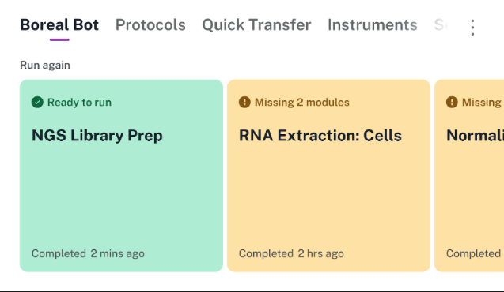{width="3.4499989063867016in"
> height="2.004166666666667in"}

OPENTRONS FLEX 123

> CHAPTER 7: SOFTWARE AND OPERATION
>
> From the dashboard you can also perform actions that apply to the
> robot as a whole, rather than a particular protocol. Access these
> actions by tapping the three-dot (**⋮**) menu:
>
> **Home gantry:** Move the gantry to its home position at the back
> right of the working area. **Restart robot:** Perform a soft restart
> of the robot.
>
> **Deck configuration:** Manage deck fixture locations.
>
> **Lights on/off:** Toggle the LED lights that illuminate the working
> area.
>
> The top navigation on the dashboard provides access to the other main
> screens: All Protocols, Quick Transfer, Instruments, and Settings.
> Next we'll look at how to manage protocols on the All Protocols screen
>
> Protocol management
>
> The All Protocols screen is an interactive list of all protocols that
> you've stored on Opentrons Flex. (Sending a protocol to Flex requires
> the Opentrons App. See the [Transferring Protocols to Flex
> section]{.underline} below for details on that process.)
>
> There are two sections of the All Protocols screen:
>
> Pinned protocols: Large cards in a horizontal carousel at the top of
> the screen. Other protocols: A vertical list at the bottom of the
> screen.

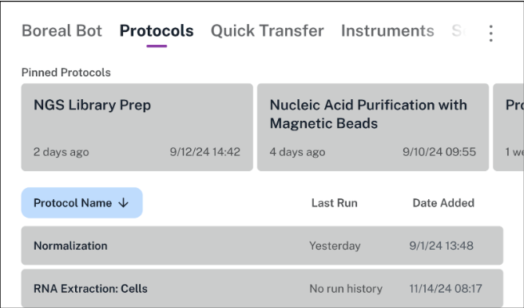{width="4.647222222222222in"
height="2.7263888888888888in"}

> Regardless of which section a protocol is in, its card or list entry
> includes information about when it was last run and when it was added
> to this robot.
>
> 124 OPENTRONS FLEX

{width="5.388888888888889in"
height="1.0138888888888888in"}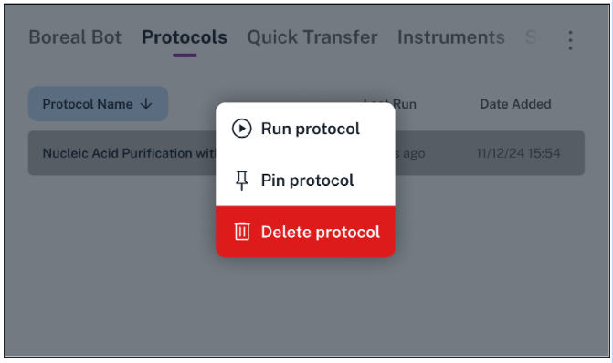{width="3.6in"
height="2.1353193350831146in"}{width="0.5694444444444444in"
height="0.1111111111111111in"}{width="9.722222222222222e-2in"
height="0.1388888888888889in"}{width="0.3888888888888889in"
height="0.1111111111111111in"}{width="0.19444444444444445in"
height="9.722222222222222e-2in"}{width="0.1527777777777778in"
height="0.1388888888888889in"}

> CHAPTER 7: SOFTWARE AND OPERATION
>
> **Note:** Flex can store a maximum of 20 unique protocols. It
> automatically deletes older protocols to maintain this limit. Use the
> Opentrons App if you need to manage a larger number of protocols.

PIN A PROTOCOL

Long press on a protocol and tap **Pin protocol** to move it to the
pinned protocols section. Conversely, long press a pinned protocol and
tap **Unpin protocol** to remove it from the section.

You can pin up to eight protocols. When you hit the maximum, you'll need
to unpin a protocol before pinning another one.

SORT PROTOCOLS

Tap any of the three headers --- Protocol Name, Last Run, or Date Added
--- to sort the All Protocols section. Tap once to sort protocols in
ascending order (A to Z for names, oldest to newest for dates). Tap
again to reverse the sort order. The current sort criterion is
highlighted in blue and the current sort order is indicated by an upward
or downward arrow.

DELETE A PROTOCOL

Long press on a protocol and tap **Delete protocol** to delete it
directly from the All Protocols screen. Flex will prompt you for
confirmation that you want to delete the protocol file and all of its
run history.

OPENTRONS FLEX 125

{width="5.805555555555555in"
height="1.0138888888888888in"}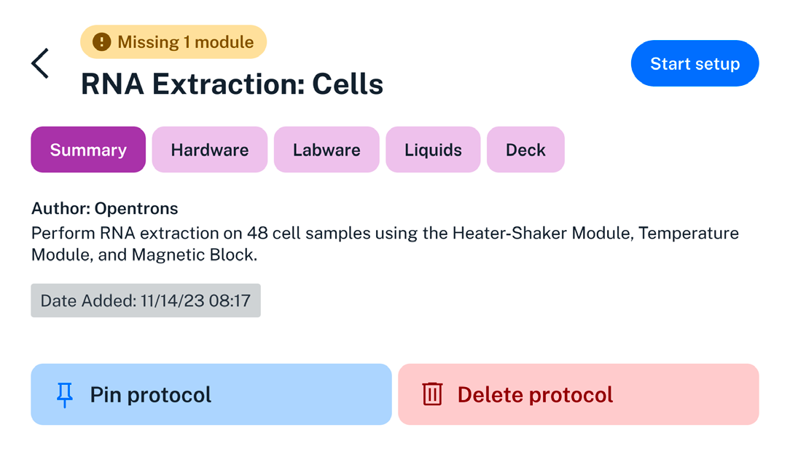{width="3.611111111111111in"
height="2.115365266841645in"}{width="1.6666666666666667in"
height="0.2916666666666667in"}{width="1.6666666666666667in"
height="0.2916666666666667in"}{width="1.0694444444444444in"
height="0.18055555555555555in"}{width="0.2222222222222222in"
height="8.333333333333333e-2in"}{width="0.3472222222222222in"
height="9.722222222222222e-2in"}{width="0.1388888888888889in"
height="8.333333333333333e-2in"}{width="0.2916666666666667in"
height="9.722222222222222e-2in"}{width="0.4861111111111111in"
height="9.722222222222222e-2in"}{width="2.2777777777777777in"
height="9.722222222222222e-2in"}{width="0.16666666666666666in"
height="8.333333333333333e-2in"}{width="0.3055555555555556in"
height="8.333333333333333e-2in"}{width="0.3888888888888889in"
height="9.722222222222222e-2in"}{width="0.2777777777777778in"
height="8.333333333333333e-2in"}{width="0.375in"
height="0.2361111111111111in"}{width="0.4444444444444444in"
height="0.2361111111111111in"}{width="0.5in"
height="0.2361111111111111in"}{width="0.5416666666666666in"
height="0.2361111111111111in"}{width="0.5555555555555556in"
height="0.2361111111111111in"}{width="0.3333333333333333in"
height="0.125in"}{width="0.7083333333333334in"
height="0.125in"}{width="0.3055555555555556in"
height="0.125in"}{width="9.722222222222222e-2in"
height="0.16666666666666666in"}{width="0.6111111111111112in"
height="0.2222222222222222in"}{width="0.875in"
height="0.16666666666666666in"}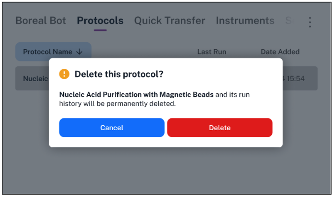{width="3.720832239720035in"
height="2.2006681977252844in"}{width="2.4166666666666665in"
height="0.25in"}{width="1.3194444444444444in"
height="8.333333333333333e-2in"}{width="2.138888888888889in"
height="9.722222222222222e-2in"}{width="1.0138888888888888in"
height="0.1111111111111111in"}{width="0.1388888888888889in"
height="0.1388888888888889in"}

> CHAPTER 7: SOFTWARE AND OPERATION
>
> **Warning:** Run history is *not recoverable* after you delete a
> protocol on Flex. The protocol file itself is also not recoverable,
> although you may be able to resend the protocol to Flex if you've kept
> a copy of it on a computer.
>
> Protocol details
>
> Tap on any protocol to view its detail screen. This screen displays
> all of the types of information included in the protocol file, as well
> as common protocol actions. An indicator at the top left of the screen
> shows whether the protocol is ready to run, or whether you need to
> perform additional setup.
>
> SUMMARY TAB

  -----------------------------------------------------------------------

  -----------------------------------------------------------------------

> 126 OPENTRONS FLEX

{width="5.805555555555555in"
height="1.25in"}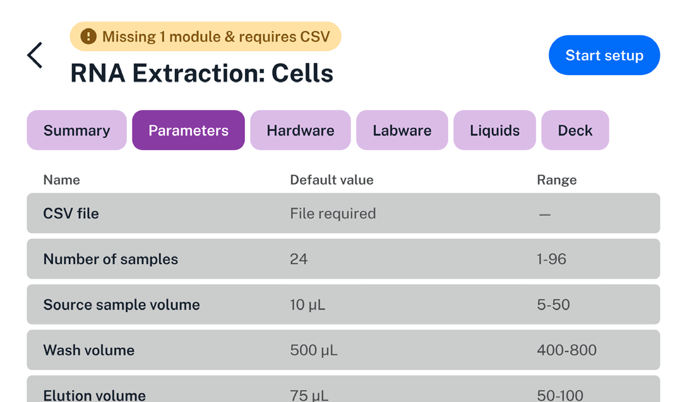{width="3.6236100174978128in"
height="2.124874234470691in"}{width="3.375in"
height="0.2222222222222222in"}{width="3.375in"
height="0.2361111111111111in"}{width="3.375in"
height="0.2222222222222222in"}{width="0.2222222222222222in"
height="8.333333333333333e-2in"}{width="0.4583333333333333in"
height="6.944444444444445e-2in"}{width="0.20833333333333334in"
height="6.944444444444445e-2in"}{width="0.375in"
height="0.2361111111111111in"}{width="0.4444444444444444in"
height="0.2361111111111111in"}{width="0.5in"
height="0.2361111111111111in"}{width="1.7361111111111112in"
height="0.2361111111111111in"}{width="0.3333333333333333in"
height="0.125in"}{width="0.7083333333333334in"
height="0.125in"}{width="0.3055555555555556in"
height="0.125in"}{width="9.722222222222222e-2in"
height="0.16666666666666666in"}{width="0.6111111111111112in"
height="0.2222222222222222in"}{width="1.4444444444444444in"
height="0.16666666666666666in"}

> The Summary tab shows:
>
> **Protocol name:** For protocols with very long names, tap to toggle
> between the full and truncated name. **Author:** Who created the
> protocol.
>
> **Description:** For protocols with long descriptions, scroll to read
> the full text. **Date added:** Timestamp when Flex received the
> protocol file.
>
> PARAMETERS TAB

  -----------------------------------------------------------------------

  -----------------------------------------------------------------------

> The Parameters tab lists all of the runtime parameters that you can
> configure from the touchscreen while setting up the protocol. The
> Default Value column shows the value that the protocol will use if you
> don't change it. The Range column shows the maximum and minimum, list
> of choices, or number of choices depending on the parameter type.
>
> **Note:** Runtime parameters are only available in Python protocols
> that define their names, descriptions, and possible values. See in the
> Python API documentation for information on defining parameters and
> using their values. JSON protocols do not currently support this
> feature.
>
> HARDWARE TAB

+-----------------------------------------------------------------------+
| {width="3.611111111111111in" |
| height="2.1166666666666667in"}                                        |
|                                                                       |
|   ------------------------------------------------------------------  |
|                                                                       |
|   ------------------------------------------------------------------  |
+=======================================================================+
+-----------------------------------------------------------------------+

> The Hardware tab is a list of all instruments, modules, and fixtures
> used in the protocol. The Location column tells you where the hardware
> needs to be attached to Flex. For instruments, location can be the
> left pipette mount, right pipette mount, both mounts (for the
> 96-channel pipette), or the extension mount (for the gripper). For
> modules and fixtures, the location is the deck slot or slots that the
> item occupies.
>
> LABWARE TAB

+-----------------------------------------------------------------------+
| {width="3.611111111111111in" |
| height="2.116665573053368in"}                                         |
|                                                                       |
|   ------------------------------------------------------------------  |
|                                                                       |
|   ------------------------------------------------------------------  |
+=======================================================================+
+-----------------------------------------------------------------------+

> The Labware tab is a list of all labware used in the protocol. It
> shows the names and quantities of labware. It does not show their
> locations, since labware can be moved, added, or removed from the deck
> during the course of a protocol. Use the Deck tab to see initial
> positions of labware.
>
> Opentrons-verified labware is indicated with a blue checkmark.
>
> LIQUIDS TAB

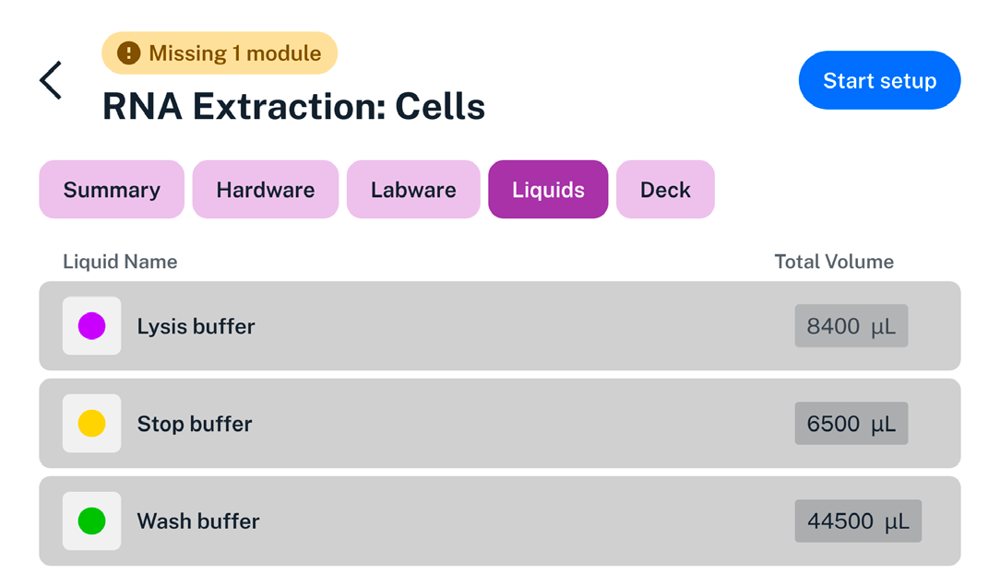{width="3.611111111111111in"
height="2.116665573053368in"}

> The Liquids tab lists all liquids to be loaded into labware at the
> start of the protocol. It shows the color code of the liquid (as
> assigned by the protocol author), the liquid name, and the total
> volume of liquid used across all wells. Use the Deck tab to see
> well-by-well initial positions of liquids.
>
> DECK TAB

+-----------------------------------------------------------------------+
| {width="3.611111111111111in" |
| height="2.116665573053368in"}                                         |
|                                                                       |
|   ------------------------------------------------------------------  |
|                                                                       |
|   ------------------------------------------------------------------  |
+=======================================================================+
+-----------------------------------------------------------------------+

> The Deck tab shows a visual map of the deck at the beginning of the
> protocol.
>
> For an interactive view that provides more information about the
> contents of each deck slot, tap **Start setup**, then tap **Labware**,
> and then tap **Map View**. There you can tap on any labware to see its
> type and custom label (if set by the protocol).
>
> ACTION BUTTONS
>
> On any of the protocol detail tabs, three action buttons are
> available:
>
> **Start setup** (top right)\
> **Pin protocol** (bottom left)\
> **Delete protocol** (bottom right)
>
> Next we'll look at the steps for setting up and performing a protocol
> run.
>
> Run setup
>
> When you start setup for a protocol, you'll see the "Prepare to run"
> screen, which summarizes all of the requirements for the protocol.
>
> 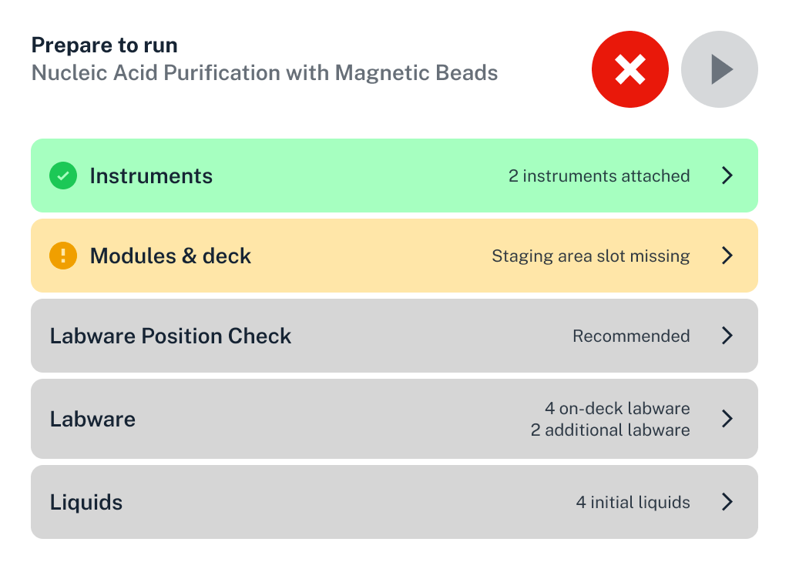{width="3.4583333333333335in"
> height="2.4652777777777777in"}
>
> All sections of the "Prepare to run" screen. On the touchscreen,
> scroll the list to see all sections.
>
> If hardware is not connected or calibrated, you will see a warning
> icon (exclamation point) and the row will be highlighted in orange. If
> all requirements are met, you will see a checkmark and the row will be
> highlighted in green.
>
> Tap any row with a right arrow to show more information for that
> category. (The one exception is tapping Labware Position Check, which
> begins that process. See the Labware Position Check section below for
> more details.)

+-----------------------------------+-----------------------------------+
| > **Category**                    | > **Description**                 |
+===================================+===================================+
| Instruments                       | > See if all instruments are      |
|                                   | > attached to the correct mounts  |
|                                   | > and calibrated.                 |
+-----------------------------------+-----------------------------------+

> Tap **Attach** or **Calibrate** to set up any that aren't.

+-----------------------------------+-----------------------------------+
| > Parameters                      | > See the names, descriptions,    |
|                                   | > and default values of runtime   |
|                                   | > parameters for the              |
+===================================+===================================+
+-----------------------------------+-----------------------------------+

> protocol. Tap a parameter to edit its value. See the Runtime
> Parameters section below for more details.

+-----------------------------------+-----------------------------------+
| > Hardware                        | > See the locations and           |
|                                   | > connection statuses of hardware |
|                                   | > on the deck.                    |
+===================================+===================================+
+-----------------------------------+-----------------------------------+

> Tap ℹ**Setup Instructions** to get detailed .
>
> Tap **Map View** to switch to a visual layout of hardware positions.

+-----------------------------------+-----------------------------------+
| > Labware                         | See the locations of labware.     |
|                                   | Each labware lists its initial    |
|                                   | deck location, and icons          |
+===================================+===================================+
+-----------------------------------+-----------------------------------+

> indicate labware that are on top of modules. Tap **Map View** to
> switch to a visual layout of labware positions.

+-----------------------------------+-----------------------------------+
| > Liquids                         | See the types and total volumes   |
|                                   | of liquids. Tap any liquid name   |
|                                   | to expand a list of               |
+===================================+===================================+
+-----------------------------------+-----------------------------------+

> well-by-well volumes. In turn, tap an individual volume row to show a
> visual layout of its location within labware.
>
> On any category screen, return to the "Prepare to run" screen by
> tapping the back arrow in the top left.
>
> Runtime parameters
>
> Runtime parameters customize protocols during setup, letting you
> adjust pipette types, mount positions, aspirate/dispense volumes,
> labware types, and more---all without writing a new protocol.
>
> 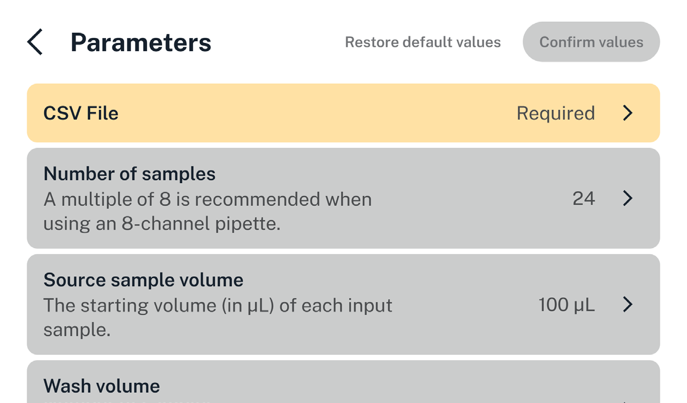{width="4.208333333333333in"
> height="2.473611111111111in"}
>
> Tap a configurable parameter to modify it. Different types of
> touchscreen controls are used for different parameter types.
>
> **Boolean:** Tap the parameter to toggle its value between On and Off.
>
> **String and numeric choices:** Choose from a menu of possible values.
>
> **Numeric range:** Use the onscreen keypad to enter a value within the
> acceptable range. **CSV:** Choose from a file picker.
>
> USING CSV DATA
>
> Flex looks for CSV files in the root directory of an attached USB
> drive or files that were used in a previous run of the same protocol.
> You can connect a USB drive to any open USB port on Flex, but we
> recommend using the port below the touchscreen. As shown here, this
> protocol has no CSV files saved on this robot, but there are several
> on an attached USB drive. Tap the desired CSV file to use its data
> into your protocol.
>
> 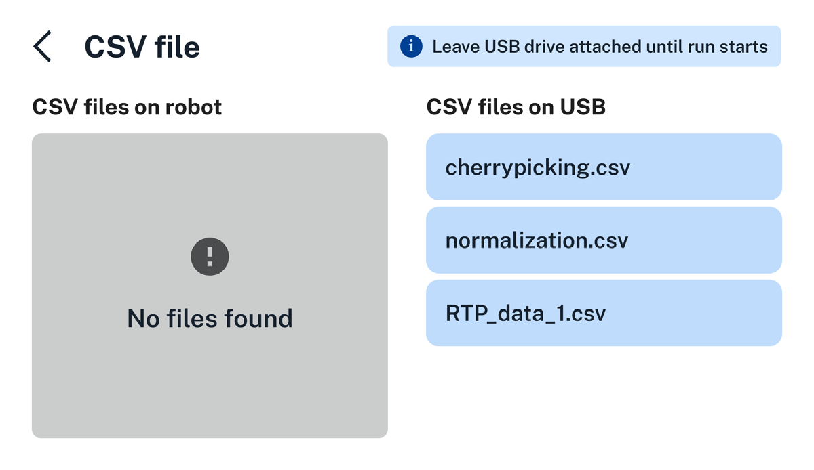{width="3.9972222222222222in"
> height="2.3111100174978128in"}
>
> When working with CSV files, keep in mind that:
>
> The touchscreen truncates file names that are longer than 52
> characters. You can still upload files with names that exceed the
> limit.
>
> The USB drive must use a file system that's readable by the robot.
> FAT32, NTFS, and ext4 file systems are supported. The HFS+ and APFS
> file systems are not.
>
> You must leave the USB drive attached until you start the run, or Flex
> won't be able to access the CSV data that you chose.
>
> CONFIRMING RUNTIME PARAMETERS
>
> Parameter and CSV file selections are still editable until you tap
> **Confirm values**. Modifications become read-only after that. To make
> further adjustments, you'll have to cancel the protocol run and start
> over.
>
> Labware Position Check
>
> Opentrons recommends performing Labware Position Check before your
> protocol run. This process fine-tunes the positioning of instruments,
> relative to specific types of labware in specific slots on the deck.
> The results of Labware Position Check are saved as labware offsets,
> which are measured to the nearest 0.1 mm. You can apply saved labware
> offsets to future runs of the same protocol (or other protocols that
> use the same labware in the same positions) to save time.
>
> Labware Position Check guides you through these steps:
>
> 1\. Attach the calibration probe to the pipette.
>
> 2\. Clear the deck of labware, but leave modules in place.
>
> 3\. Place a specific type of labware in a specific deck slot.
>
> 4\. Align the probe to the labware using the on-screen jog controls.
> Then confirm the position.

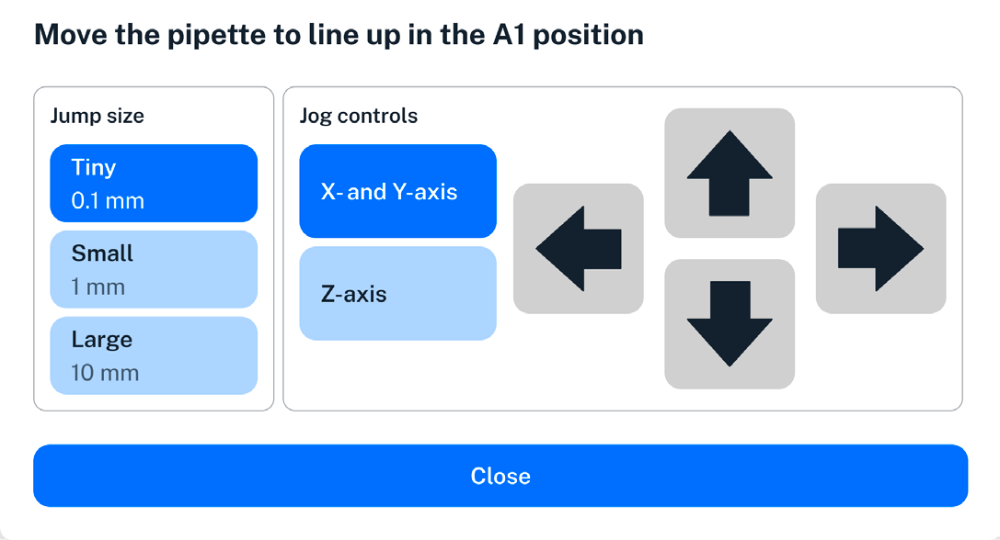{width="3.6222222222222222in"
height="1.9593985126859144in"}{width="3.4166666666666665in"
height="0.25in"}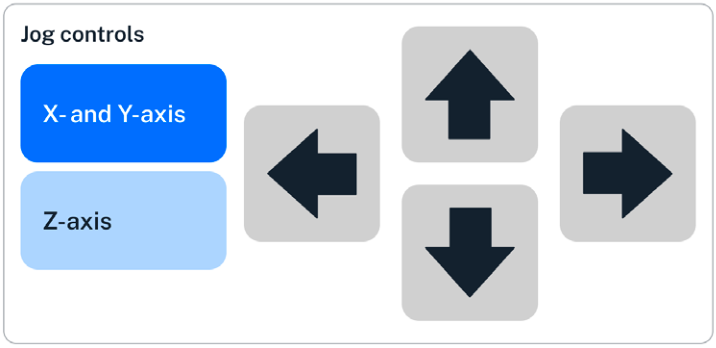{width="2.486111111111111in"
height="1.2083333333333333in"}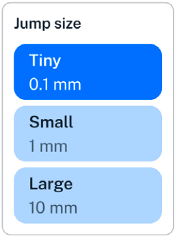{width="0.8888888888888888in"
height="1.2083333333333333in"}{width="0.1388888888888889in"
height="9.722222222222222e-2in"}{width="0.1111111111111111in"
height="9.722222222222222e-2in"}{width="0.4166666666666667in"
height="0.125in"}{width="0.125in"
height="9.722222222222222e-2in"}{width="0.18055555555555555in"
height="0.1111111111111111in"}{width="9.722222222222222e-2in"
height="9.722222222222222e-2in"}{width="0.19444444444444445in"
height="0.1111111111111111in"}{width="0.375in"
height="0.125in"}{width="0.4722222222222222in"
height="0.1111111111111111in"}{width="0.2222222222222222in"
height="9.722222222222222e-2in"}{width="0.2916666666666667in"
height="9.722222222222222e-2in"}{width="0.4027777777777778in"
height="9.722222222222222e-2in"}{width="0.2222222222222222in"
height="9.722222222222222e-2in"}{width="0.1527777777777778in"
height="8.333333333333333e-2in"}{width="6.944444444444445e-2in"
height="8.333333333333333e-2in"}{width="0.1111111111111111in"
height="8.333333333333333e-2in"}{width="0.18055555555555555in"
height="9.722222222222222e-2in"}{width="0.25in"
height="8.333333333333333e-2in"}{width="0.6666666666666666in"
height="8.333333333333333e-2in"}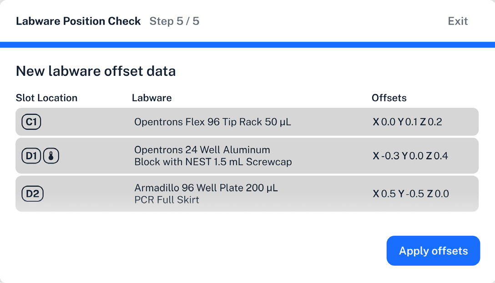{width="3.625in"
height="2.079044181977253in"}{width="0.7083333333333334in"
height="0.25in"}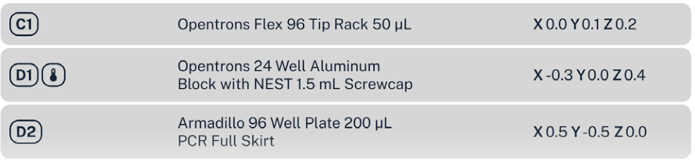{width="3.4166666666666665in"
height="0.7916666666666666in"}{width="0.2777777777777778in"
height="8.333333333333333e-2in"}{width="0.3055555555555556in"
height="8.333333333333333e-2in"}{width="0.4722222222222222in"
height="8.333333333333333e-2in"}

> 5\. Repeat steps 3 and 4 for each labware--slot combination used in
> your protocol.

  -----------------------------------------------------------------------
  6\. 7.                              Review and save your new labware
                                      offset data. Remove the calibration
                                      probe from the pipette.
  ----------------------------------- -----------------------------------

  -----------------------------------------------------------------------

  -----------------------------------------------------------------------

  -----------------------------------------------------------------------

> Jog controls used in Labware Position Check. Use larger jump sizes to
> move the pipette quickly, but beware of crashing the pipette into
> labware.

  -----------------------------------------------------------------------

  -----------------------------------------------------------------------

> Summary of new labware offsets ready to be applied to a protocol.
>
> When you run Labware Position Check for the first time, the pipette
> will start at its default position for all labware (X 0.0 Y 0.0 Z
> 0.0). On subsequent runs, the pipette will start at the previously
> saved offset locations. This lets you quickly confirm offset data
> before every protocol run.

+-----------------------------------+-----------------------------------+
| {width="0.3333333333333333in" | > position if you turn off Apply  |
| height="0.2638888888888889in"}    | > Labware Offsets in the robot    |
|                                   | > settings.                       |
+===================================+===================================+
|                                   |                                   |
+-----------------------------------+-----------------------------------+

> Run progress
>
> Once everything is set up, begin your run by tapping the play button ▶
> on the "Prepare to run" screen. Flex will begin the protocol and
> you'll see the Running screen.
>
> The Running screen gives you quick access to stop and play/pause
> controls, in case you need to intervene in your protocol. On the
> default view, these controls are large and only the current step of
> the protocol is shown.

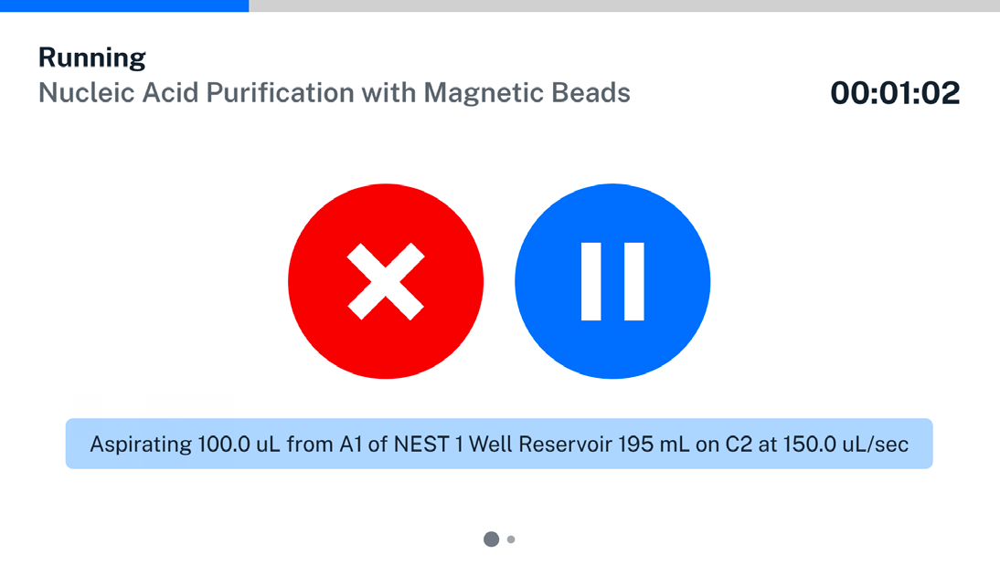{width="3.6458333333333335in"
height="2.140277777777778in"}

> Swipe from right to left to see an alternative view with smaller
> controls and more protocol steps. The current step will always be at
> the top of the list.

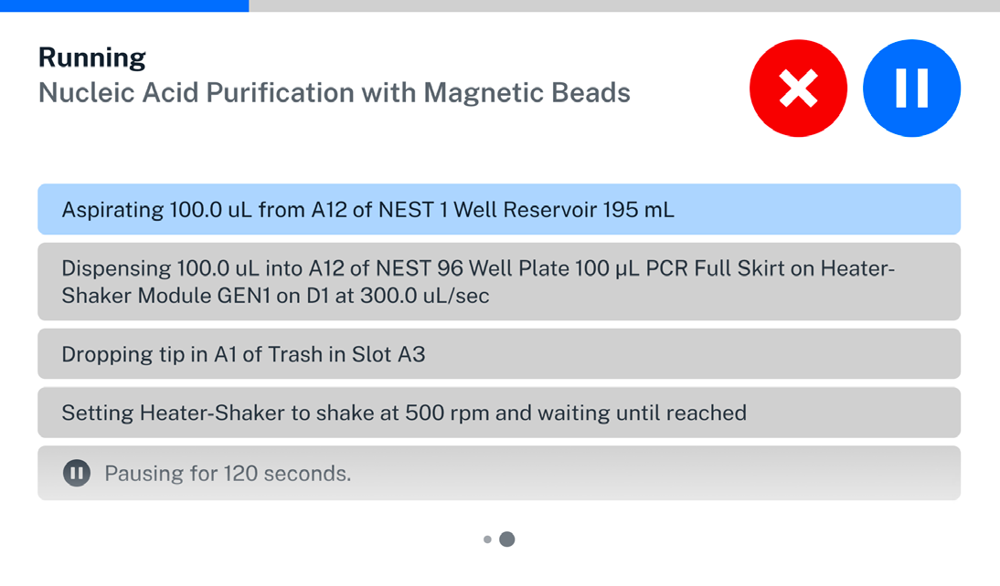{width="3.6458333333333335in"
height="2.1388877952755907in"}

> Starting in robot software version 8.0.0, if something unexpected
> happens during the protocol run, Flex will pause and give you the
> option to enter error recovery mode. In earlier versions, Flex cancels
> the run when an error occurs.
>
> Error recovery
>
> Flex error recovery allows you to continue a protocol run even when
> problems arise.
>
> 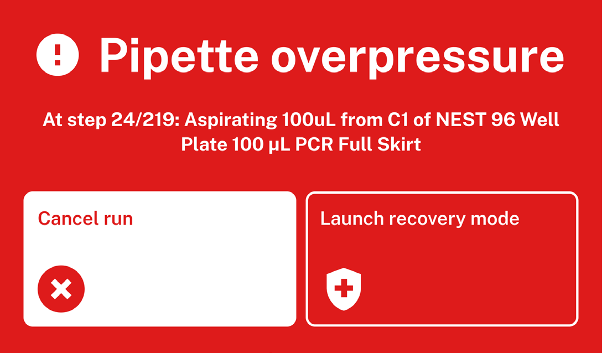{width="3.626388888888889in"
> height="2.125in"}
>
> Tap **Launch recovery mode** to see options for the particular type of
> error that has occurred. Instead of just canceling the protocol and
> forcing a restart, this feature gives you a chance to correct problems
> like replacing a damaged tip or filling an empty well. Even if you
> have to cancel a protocol run, error recovery will let you preserve
> liquids in the pipette and control where tips are dropped. After all,
> an occasional mistake or problem shouldn't end a procedure with the
> loss of expensive reagents or valuable samples.
>
> Flex provides a protocol recovery path for the following error
> conditions.

+-----------------------+-----------------------+-----------------------+
| > **Error type**      | > **Description**     | > **Recovery          |
|                       |                       | > options**           |
+=======================+=======================+=======================+
| > No liquid detected  | Occurs when a pipette | > Manually refill     |
|                       |                       | > well and skip to    |
|                       |                       | > the next step.      |
+-----------------------+-----------------------+-----------------------+

> encounters an empty well\
> and expects a liquid to be\
> present.
>
> Ignore the error and skip to the next step. Cancel protocol run.

+-----------------------+-----------------------+-----------------------+
| Pipette overpressure  | > Occurs when         | > For aspiration:     |
|                       | > pressure            |                       |
+=======================+=======================+=======================+
+-----------------------+-----------------------+-----------------------+

> inside the pipette exceeds\
> the normal range while\
> aspirating or dispensing
>
> Retry with new tips.\
> Cancel protocol run.
>
> liquid. For dispense:\
> Skip to the next step with the same tips.

+-----------------------+-----------------------+-----------------------+
|                       | > Caused by clogged,  | > Skip to the next    |
|                       | > bent,               | > step with new tips. |
+=======================+=======================+=======================+
|                       | > or sealed tips.     | > Cancel protocol     |
|                       |                       | > run.                |
+-----------------------+-----------------------+-----------------------+
| > General errors      | A catch-all category  | > Retry step.         |
|                       | for                   |                       |
+-----------------------+-----------------------+-----------------------+
|                       | > other errors.       | > Skip to next step.  |
+-----------------------+-----------------------+-----------------------+

Cancel protocol run.

{width="9.722222222222222e-2in"
height="8.333333333333333e-2in"}{width="2.8333333333333335in"
height="1.66in"}{width="4.1666666666666664e-2in"
height="6.944444444444445e-2in"}{width="4.1666666666666664e-2in"
height="0.125in"}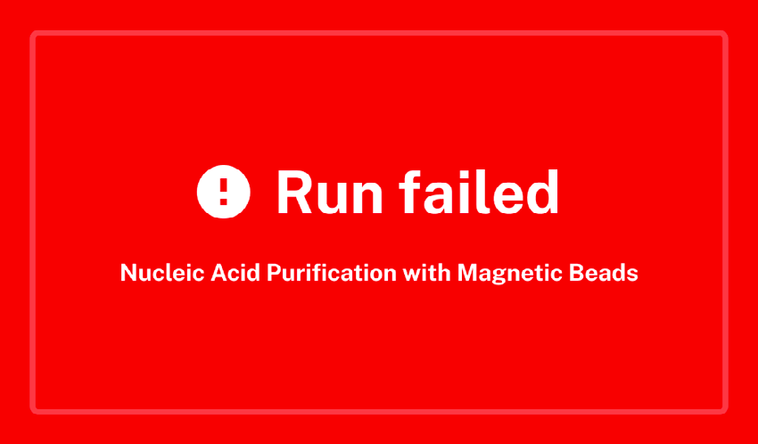{width="2.8333333333333335in"
height="1.66in"}{width="1.2916666666666667in"
height="0.6527777777777778in"}{width="2.1527777777777777in"
height="0.1388888888888889in"}{width="0.7638888888888888in"
height="8.333333333333333e-2in"}{width="0.8888888888888888in"
height="6.944444444444445e-2in"}{width="0.5694444444444444in"
height="9.722222222222222e-2in"}{width="0.1111111111111111in"
height="0.1111111111111111in"}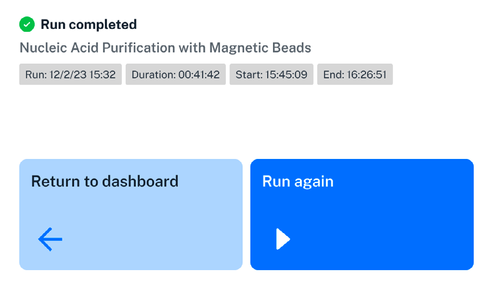{width="2.7916666666666665in"
height="1.635690069991251in"}{width="1.2916666666666667in"
height="0.6527777777777778in"}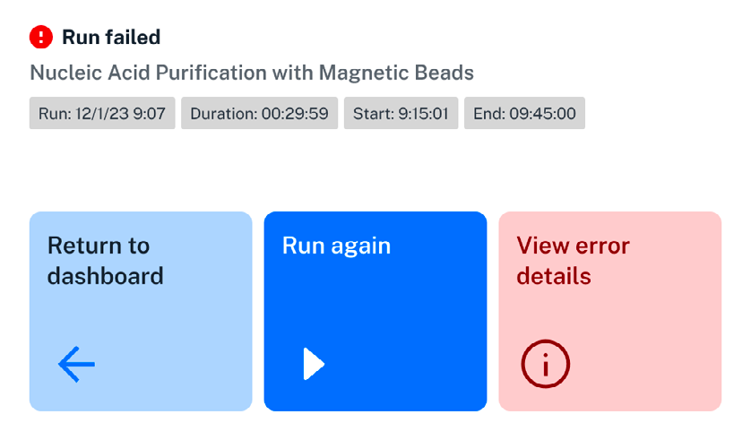{width="2.7902766841644793in"
height="1.6348764216972878in"}{width="0.8472222222222222in"
height="0.7638888888888888in"}{width="0.8611111111111112in"
height="0.7638888888888888in"}{width="0.8611111111111112in"
height="0.7777777777777778in"}{width="2.0972222222222223in"
height="0.1388888888888889in"}{width="0.7638888888888888in"
height="8.333333333333333e-2in"}{width="0.8888888888888888in"
height="6.944444444444445e-2in"}{width="0.2222222222222222in"
height="8.333333333333333e-2in"}{width="0.1527777777777778in"
height="8.333333333333333e-2in"}{width="0.1111111111111111in"
height="0.1111111111111111in"}

+-----------------------------------+-----------------------------------+
| {width="0.3333333333333333in" | > tip pickup]{.underline} of 1,   |
| height="0.2638888888888889in"}    | > 2, or 3 tips. In                |
|                                   | > {width="1.0277777777777777in" |
|                                   | >                                 |
|                                   | height="2.7777777777777776e-2in"} |
|                                   | >                                 |
|                                   | > these configurations, Flex      |
|                                   | > cannot detect tip pickup errors |
|                                   | > and will not present error      |
+===================================+===================================+
+-----------------------------------+-----------------------------------+

> recovery options if the pipette fails to pick up the tips. The run
> will continue unless and until another error occurs.

You can view the status of a finished protocol and review any resolved
errors on the run completion screen.

> Run completion
>
> At the end of your protocol, a large "Run completed" or "Run failed"
> message will take over the\
> touchscreen. These color-coded messages match the LED status bar at
> the top of the robot and are visible at a distance.
>
> Tap anywhere on either of these screens to go to the run summary
> screen, which shows information about the protocol run time and next
> steps. The summary screen always gives you the options to **Return to
> dashboard** or have the protocol **Run again**. If the run failed, you
> can also **View error details** and begin the troubleshooting process.
>
> Quick transfer
>
> Quick transfer is a touchscreen-only feature that lets you create,
> save, and run simple procedures that move liquid from a source to a
> destination, all without creating a protocol or writing code.
> Available starting in robot software version 8.0.0, this feature is
> ideal for preparing labware you need to use in other, more complex
> procedures. For example, you can use quick transfers to:
>
> Provision well plates with a reagent, buffer, or other liquid.
>
> Consolidate liquid from many wells to one well.
>
> Distribute liquid from a single well to multiple wells.
>
> Move culture to growth media or to prepare it for long-term storage.
>
> There are two sections of the quick transfer screen:
>
> Pinned transfers: Large cards on a horizontal carousel. You can pin 8
> cards, maximum.
>
> Saved transfers: A vertical list at the bottom of the screen. Flex can
> save a maximum of 20 quick transfers. You have to delete older quick
> transfers to maintain this limit.

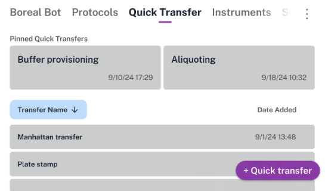{width="4.409722222222222in"
height="2.5888877952755904in"}

> The remainder of this section goes through quick transfer features in
> detail.
>
> CREATING A QUICK TRANSFER
>
> From the Quick Transfer tab on the touchscreen, tap **+ Quick
> transfer.** This starts a guided setup. Follow the instructions on the
> screen. You can run, save, pin, or delete the transfer when finished.
>
> DECK SLOTS AND HARDWARE REQUIREMENTS
>
> Quick transfers require a Flex pipette, a tip rack in slot B2, source
> labware in slot C2, and destination labware in slot D2. For tip
> disposal, quick transfer relies on the robot's [deck
> configuratio]{.underline}n to determine where the trash bin or waste
> chute is on the deck. It shows the trash bin in slot A3 if no trash
> container is configured. You cannot use the gripper, modules, and
> custom labware in a quick transfer.
>
> 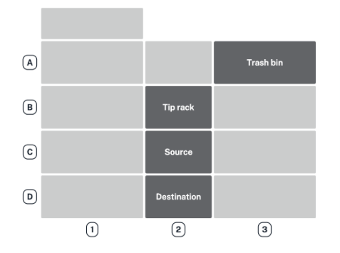{width="4.373611111111111in"
> height="3.254166666666667in"}
>
> If everything is set up correctly, you'll move on to selecting
> pipettes and tips.
>
> PIPETTES AND TIPS
>
> Creating a quick transfer involves selecting a pipette and appropriate
> tips. Quick transfer can use any 1-, 8-, or 96-channel pipette that's
> attached to the robot. When selecting a pipette tip, try to match the
> tip to a pipette of the same capacity or larger. For best performance,
> use the smallest tips that can hold the amount of liquid you need to
> aspirate.
>
> LABWARE
>
> Quick transfer works with most of the labware in the . It omits
> labware from the source and destination menus when those items are
> incompatible with the selected pipette. For example, only the
> 1-channel pipette can aspirate or dispense from tube racks. If you
> select a multi-channel pipette, quick transfer won't let you choose a
> tube rack as a source or destination.
>
> WELL SELECTION
>
> Well selection depends upon the pipette and labware you're using. When
> using a 1- or 8-channel pipette and a 96-well plate, you select
> individual wells by tapping or tapping and dragging on the
> touchscreen. Or, when using multi-channel pipettes and high-density
> well plates, quick transfer provides button controls that let you
> select columns and well groups instead of individual wells.
>
> For example, these controls let you select wells and columns with an
> 8-channel pipette and a 384-well plate.

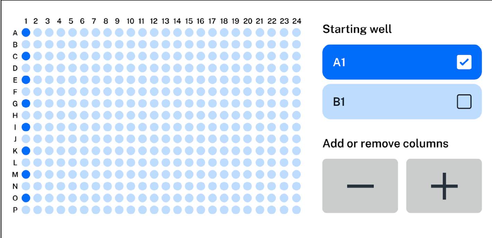{width="4.733333333333333in"
height="2.2916666666666665in"}

> And these controls let you select wells and columns with a 96-channel
> pipette and 384-well plate.
>
> 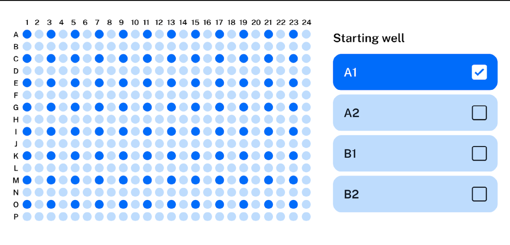{width="4.770833333333333in"
> height="2.298611111111111in"}
>
> Quick transfer checks your pipette, source, and destination choices to
> prevent incompatible combinations. If you make a mistake while
> selecting wells, or want to start over, tap **Reset** to clear your
> selections.
>
> After making instrument and well selections, you'll set the transfer
> volume and give your new quick transfer a name.
>
> TRANSFER VOLUMES AND NAME
>
> You'll set the amount of liquid to transfer (in µL) after specifying
> the source and destination wells. You'll also have a chance to name
> the transfer after setting the transfer volume. A good, concise name
> helps you find a quick transfer in a list of saved or pinned transfers
> and indicates what it does.
>
> ADVANCED SETTINGS
>
> These are available after you name a quick transfer and before you
> save it. If some settings are familiar to you that's because they're
> the same as those offered in Protocol Designer. Advanced settings are
> optional; select any that you need or just save or run the transfer.

+-----------------------------------+-----------------------------------+
| > **Setting**                     | > **Description**                 |
+===================================+===================================+
| Aspirate and dispense             | > Set how quickly the pipette     |
|                                   | > will aspirate or dispense, in   |
|                                   | > µL/s.                           |
+-----------------------------------+-----------------------------------+

> flow rates

+-----------------------------------+-----------------------------------+
| > Pipette path                    | > Choose how the pipette moves    |
|                                   | > between wells. Options include: |
+===================================+===================================+
+-----------------------------------+-----------------------------------+

> single transfer (1 well to 1 well)\
> multi-aspirate (many wells to 1 well)\
> multi-dispense (1 well to many wells)

+-----------------------------------+-----------------------------------+
| > Tip position                    | > Change where in the well the    |
|                                   | > pipette aspirates or dispenses. |
|                                   | > By default,                     |
+===================================+===================================+
+-----------------------------------+-----------------------------------+

the robot positions the tip 1 mm from the bottom center of a well.

+-----------------------------------+-----------------------------------+
| > Pre-wet tip                     | > Pre-wet the pipette tip by      |
|                                   | > aspirating and dispensing ⅔ of  |
|                                   | > the tip's                       |
+===================================+===================================+
+-----------------------------------+-----------------------------------+

maximum volume.

+-----------------------------------+-----------------------------------+
| > Mix                             | > Aspirate and dispense           |
|                                   | > repeatedly from a single        |
|                                   | > location. Used to mix the       |
+===================================+===================================+
+-----------------------------------+-----------------------------------+

contents of a well together.

+-----------------------------------+-----------------------------------+
| > **Setting**                     | +------------------------------+  |
|                                   | | > **Description**            |  |
|                                   | +==============================+  |
|                                   | +------------------------------+  |
+===================================+===================================+
| > Delay                           | > Adds a timed delay (in seconds) |
|                                   | > before an aspirate or dispense  |
|                                   | > action.                         |
+-----------------------------------+-----------------------------------+
| > Touch tip                       | > Move the pipette so the tip     |
|                                   | > touches the wall of a well.     |
|                                   | > Used to help knock              |
+-----------------------------------+-----------------------------------+

> off any droplets that might cling to the pipette's tip. Not supported
> on all labware.

+-----------------------------------+-----------------------------------+
| > Air gap                         | > When used during aspiration,    |
|                                   | > draw in extra air after the     |
|                                   | > liquid. When used               |
+===================================+===================================+
+-----------------------------------+-----------------------------------+

> during dispense, draw in extra air before moving to the trash
> container to dispose of the tip. Used to prevent liquid from leaking
> out of the pipette tip.

+-----------------------------------+-----------------------------------+
| > Blowout                         | > Blow an extra amount of air     |
|                                   | > through the tip to clear it.    |
|                                   | > The pipette can blow            |
+===================================+===================================+
+-----------------------------------+-----------------------------------+

out into the trash bin, source well, or destination well.

+-----------------------------------+-----------------------------------+
| > Change tip                      | > Replace the tip at the start of |
|                                   | > the transfer, before every      |
|                                   | > aspirate, or per                |
+===================================+===================================+
+-----------------------------------+-----------------------------------+

source well.

> MANAGING TRANSFERS
>
> Click **Create Transfer** when you're satisfied with your transfer
> settings. After creating a quick transfer, you can run, save, or
> delete it.
>
> Flex saves a maximum of 20 transfers in a vertical list under the
> Quick Transfer tab.
>
> Long press a saved transfer to run it, pin it, or delete it. Flex pins
> a maximum of 8 quick transfers. Long press a pinned transfer to run
> it, un-pin it (returns it to the saved list), or delete it.
>
> 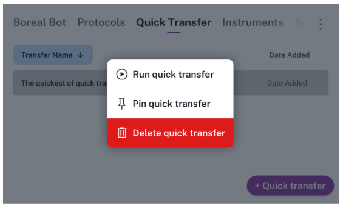{width="3.3055555555555554in"
> height="2.0069444444444446in"}
>
> CHAPTER 7: SOFTWARE AND OPERATION
>
> Instrument management
>
> The Instruments screen is an interactive list of all instruments that
> you've connected to your Flex. The list is organized by mount: left
> pipette mount, right pipette mount, and extension mount.

{width="3.515277777777778in"
height="2.0861100174978127in"}

> For an empty mount, tap anywhere on the row to begin the process of
> attaching an instrument.
>
> For an occupied mount, the row lists its current contents. Tap
> anywhere on the row to get more details about the instrument, detach
> it, or recalibrate it.
>
> 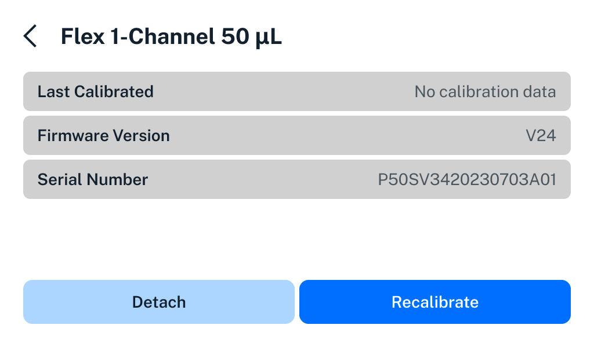{width="3.611111111111111in"
> height="2.116665573053368in"}
>
> **Last Calibrated:** The date and time of the instrument's most recent
> calibration.
>
> **Firmware Version:** The version of the firmware running on the
> instrument. Flex automatically updates instrument firmware whenever
> the instrument is attached, depending on the robot system version.
> **Serial Number:** A unique identifier for the instrument. If you are
> having problems with an instrument, Opentrons Support will want to
> know the serial number.
>
> OPENTRONS FLEX 143

{width="3.986111111111111in"
height="0.8055555555555556in"}

> CHAPTER 7: SOFTWARE AND OPERATION

ATTACH AN INSTRUMENT

Choose an empty mount and then choose the type of instrument to install.
Then connect and secure the instrument using its captive mounting
screws. For more details, follow the instructions on the touchscreen or
see the [Instrument Installation and Calibration section]{.underline} of
the Installation and Relocation chapter.

Exact installation steps depend on the instrument you choose and the
current setup of your robot. For example, if you have an 8-channel
pipette already attached and you attempt to install the 96-channel
pipette on the other mount, the touchscreen will give you instructions
for detaching the 8-channel so the 96-channel can occupy both mounts.

DETACH AN INSTRUMENT

Choose an attached instrument that you want to detach. Then loosen the
instrument's captive mounting screws and remove it from the gantry. For
more details, follow the instructions on the touchscreen. Exact removal
steps depend on the instrument you choose and the current setup of your
robot.

RECALIBRATE AN INSTRUMENT

Choose an attached instrument that you want to recalibrate. Then connect
the instrument's calibration probe or pin and begin the automated
calibration process. For more details, follow the instructions on the
touchscreen or see the [Instrument Installation and Calibration
section]{.underline} of the Installation and Relocation chapter.

> **Note:** The new calibration data will overwrite any\
> previous calibration data for that instrument.

Robot settings

The Settings screen lists all the ways you can customize the behavior of
your Flex.

144 OPENTRONS FLEX

> CHAPTER 7: SOFTWARE AND OPERATION
>
> 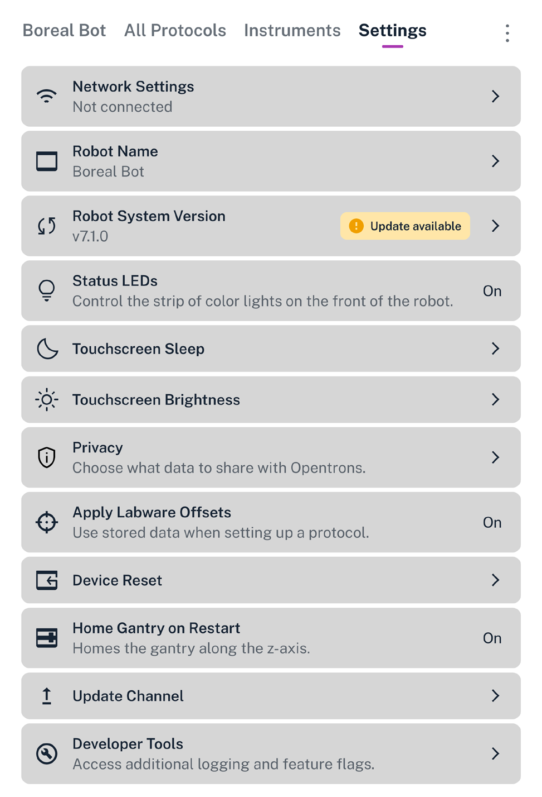{width="3.2430555555555554in"
> height="4.752777777777778in"}
>
> All settings available on Flex. On the touchscreen, scroll the list to
> see all the settings.

Although they are presented in a single list, they roughly break down
into four categories.

SETUP

All of these settings are covered when you [first set up your
Fle]{.underline}x. However, you can change them at any time.

> **Network Settings:** View the status of or set up a Wi-Fi, Ethernet,
> or USB connection. Multiple connections can be active simultaneously.
>
> **Robot Name:** Change the name of your Flex. The robot name appears
> on the touchscreen dashboard and in the Opentrons App.
>
> **Robot System Version:** See the current version of the robot
> software or check for updates. If Flex has already automatically
> checked for updates and found one, this item will have an "Update
> available" badge in the settings list.

OPENTRONS FLEX 145

DISPLAY

Control how Flex displays information to meet the needs of your lab and
users.

> **Status Light:** Turn on or off the strip of color lights on the
> front of the robot.
>
> **Touchscreen Sleep:** Set how long the touchscreen should remain on
> when idle. The default is for the display to never go to sleep. When
> the screen is asleep, tap it once to wake it.
>
> **Touchscreen Brightness:** Set the screen's brightness to one of six
> levels by tapping **−** or **+**.

PRIVACY

Choose what data you want Flex to share with Opentrons. This information
is always anonymized and we only use it to improve our products.

Flex records what it's doing in several log files that are stored on the
robot. These logs are grouped into two categories for privacy opt-in
purposes:

> **Robot Logs:** Data about robot server activities, executed API
> commands, and interactions with attached modules.
>
> **Display Usage:** Data about how the touchscreen draws its graphics.

If you opt out of automatic data sharing, you can still s for your own
use or to manually send them to Opentrons Support for troubleshooting.

+-----------------------------------+-----------------------------------+
| {width="0.3333333333333333in" | > Opentrons App. Turning sharing  |
| height="0.2638888888888889in"}    | > on or off from the touchscreen  |
|                                   | > only affects data collected and |
|                                   | > sent by the robot. Your laptop  |
+===================================+===================================+
+-----------------------------------+-----------------------------------+

> or desktop computer will still automatically share data if this
> feature is enabled in the Opentrons App.

ADVANCED

You shouldn't need these settings for everyday operation, but they may
be useful for troubleshooting or testing pre-release features.

> CHAPTER 7: SOFTWARE AND OPERATION
>
> **Apply Labware Offsets:** Choose whether to use saved offset data
> from Labware Position Check in subsequent protocol runs. This setting
> is on by default. Opentrons recommends running Labware Position Check
> before every run, and applying previous labware offsets at the
> beginning of Labware Position Check can make the process quicker.
>
> **Device Reset:** Batch delete certain types of information from the
> robot, such as calibrations, run history, or protocols.
>
> **Home Gantry on Restart:** By default, the gantry moves to its home
> position any time you turn on Flex. Only disable this behavior if you
> have a reason that the gantry must remain stationary after powering
> on.
>
> **Update Channel:** Choose whether to receive stable or beta software
> updates.
>
> **Developer Tools:** Enable additional tools and features designed for
> developers. Not recommended unless instructed by Opentrons Support.

Deck configuration

Deck configuration tells your Flex what fixtures are attached to the
deck, in what locations. You need to inform the robot about installed
fixtures because they're unpowered attachments. They do not contain
electronic or mechanical components that communicate with the robot.
Flex won't know what's attached and where it is until you configure deck
fixtures via the touchscreen or Opentrons App.

Mapping fixtures to deck slots allows the robot to find discrepancies
between the hardware used in a protocol and what it thinks is attached
to the deck. Flex detects potential conflicts between the hardware setup
of a protocol and the robot's current deck configuration (see [Resolving
Deck Conflict]{.underline}s below). Running protocols with proper deck
configuration helps avoid collisions among the various components
installed on the robot.

For more information on which fixtures you can configure in which slots,
see the [Deck Fixtures section]{.underline} in the System Description
chapter.

ADDING AND REMOVING FIXTURES

To add deck fixtures via the touchscreen:

1\. Tap the three-dot (**⋮**) menu and then tap **Deck configuration**.
This opens the interactive deck map. 2. Tap a blue deck slot that you
want to configure. This opens the fixture menu.\
3. From the fixture menu, select the item you want to add.

OPENTRONS FLEX 147

+-----------------------------------+-----------------------------------+
| 4\.                               | > Tap a fixture to add it to the  |
|                                   | > deck.                           |
+===================================+===================================+
+-----------------------------------+-----------------------------------+

> 5\. Tap **Confirm**.
>
> Click the **X** on a fixture on the deck map to remove it from the
> deck configuration.

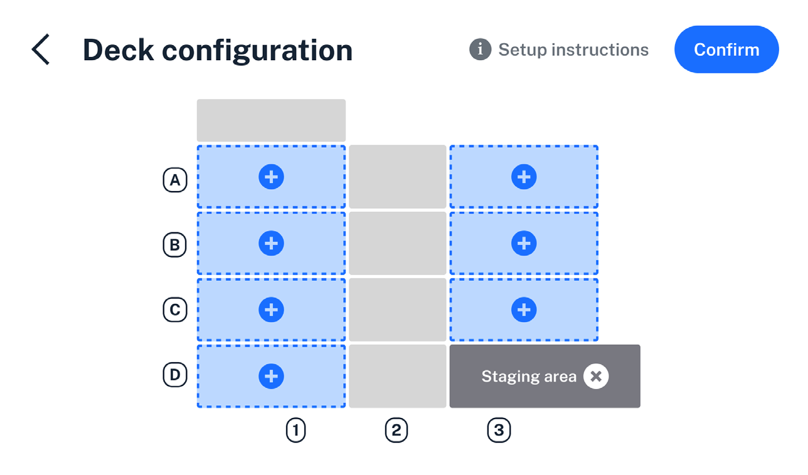{width="4.290277777777778in"
height="2.5236111111111112in"}

> A Flex configured with a staging area slot in D3, and no other
> fixtures.
>
> You can also configure the deck in the Opentrons App, on the robot
> details page for your Flex.
>
> RESOLVING DECK CONFLICTS
>
> Flex displays orange warning prompts when setting up a protocol run
> that conflicts with the current deck configuration. To resolve the
> conflict:
>
> 1\. Tap the prompt for more information on what the protocol
> specifies, compared to the current deck configuration.
>
> 2\. Inspect the hardware configuration of your Flex and attach, move,
> or remove the deck fixtures or modules as needed.
>
> 3\. Tap **Update deck** to clear the conflict warning.
>
> Alternatively, you can modify your protocol to fit your current deck
> configuration, and then resend it to your Flex.
>
> Your Flex won't run a protocol until you resolve all deck conflict
> warnings.
>
> CHAPTER 7: SOFTWARE AND OPERATION
>
> 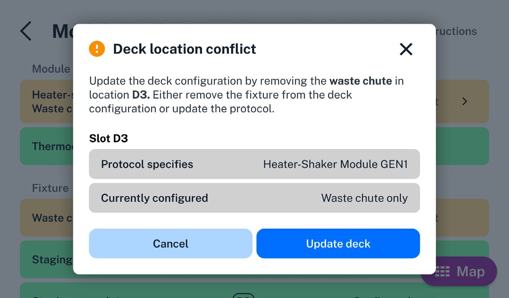{width="4.740277777777778in"
> height="2.7777777777777777in"}
>
> This protocol requires a Heater-Shaker in slot D3, but the deck
> configuration indicates that the waste chute is in that location.
>
> FIXTURE STATUSES
>
> The following table defines the statuses the robot generates when it
> compares its configured deck fixtures to your protocol.

+-----------------------------------+-----------------------------------+
| > **Status**                      | > **Description**                 |
+===================================+===================================+
| > **Configured**                  | > A fixture is specified in the   |
|                                   | > correct location. Always verify |
|                                   | > that the fixture is             |
+-----------------------------------+-----------------------------------+

physically attached before running the protocol.

+-----------------------------------+-----------------------------------+
| > **Location conflict**           | > A deck slot is configured with  |
|                                   | > a fixture different from the    |
|                                   | > fixture specified               |
+===================================+===================================+
+-----------------------------------+-----------------------------------+

> in your protocol (e.g., the protocol specifies a waste chute, but deck
> slot D3 is occupied by a staging area slot).

+-----------------------------------+-----------------------------------+
| > **Not configured**              | > A fixture required by your      |
|                                   | > protocol is missing from the    |
|                                   | > deck configuration              |
+===================================+===================================+
+-----------------------------------+-----------------------------------+

> (e.g., the protocol requires a staging area slot but that fixture is
> not configured in the specified location).
>
> The following table defines the deck configuration statuses the robot
> generates when it compares its attached instruments and attached
> modules to its deck configuration and your protocol.
>
> OPENTRONS FLEX 149

+-----------------------------------+-----------------------------------+
| > **Status**                      | +------------------------------+  |
|                                   | | > **Description**            |  |
|                                   | +==============================+  |
|                                   | +------------------------------+  |
+===================================+===================================+
| > **Attach pipette**              | > A required pipette is not       |
|                                   | > attached.                       |
+-----------------------------------+-----------------------------------+
| > **Calibrate**                   | A module needs calibration. It is |
|                                   | in the right location and         |
|                                   | connected to the robot.           |
+-----------------------------------+-----------------------------------+
| **Calibrate pipette**             | > An attached pipette requires    |
|                                   | > calibration.                    |
+-----------------------------------+-----------------------------------+
| > **Connected**                   | > Modules are connected,          |
|                                   | > calibrated, and in the right    |
|                                   | > locations. Configuration        |
+-----------------------------------+-----------------------------------+

> status is good.

+-----------------------------------+-----------------------------------+
| **Location conflict**             | > A module location conflicts     |
|                                   | > with a deck fixture.            |
+===================================+===================================+
| > **Not connected**               | > The module is not connected to  |
|                                   | > the robot or is powered off.    |
|                                   | > Once connected,                 |
+-----------------------------------+-----------------------------------+

> there will be no location conflict.
>
> **7.2 Opentrons App**
>
> App installation
>
> Download the Opentrons App at . The app requires Windows 10, macOS
> 10.10, or Ubuntu 12.04 or later. The app may run on other Linux
> distributions, but Opentrons does not officially support them.
>
> WINDOWS
>
> The Windows version of the Opentrons App is packaged as an installer.
> To use it:
>
> Open the .exe file you downloaded from opentrons.com.
>
> Follow the instructions in the installer. You can install the app for
> a single user or all users of the computer.
>
> The app opens automatically once installed. Grant the app security or
> firewall permissions, if prompted, to make sure it can launch and
> communicate with Flex over your network.

{width="5.541666666666667in"
height="1.0138888888888888in"}

> CHAPTER 7: SOFTWARE AND OPERATION
>
> MACOS
>
> The macOS version of the Opentrons App is packaged as a disk image. To
> use it:
>
> 1\. Open the .dmg file you downloaded from opentrons.com. A window for
> the disk image will open in Finder.
>
> 2\. Drag the Opentrons icon onto the Applications icon in the window.
> 3. Double-click on the Applications icon.
>
> Double-click on the Opentrons icon in the Applications folder. 4.
>
> Grant the app security or firewall permissions, if prompted, to make
> sure it can launch and communicate with Flex over your network.
>
> UBUNTU
>
> The Ubuntu version of the Opentrons App is packaged as an AppImage. To
> use it:
>
> 1\. Move the .AppImage file you downloaded from opentrons.com to your
> Desktop or Applications folder. 2. Right-click the .AppImage file and
> choose **Properties**.

3\. Click the **Permissions** tab. Then check **Allow executing file as
a program**. Close the Properties window. 4. Double-click the .AppImage
file.

> **Note:** Do not use third-party AppImage launchers with the Opentrons
> App. They may interfere with app updates. Opentrons does not support
> using third-party launchers to control Opentrons robots.
>
> Transferring protocols to Flex
>
> Every protocol will begin as a file on your computer, regardless of
> what method of [Protocol Development]{.underline} you use. You need to
> import the protocol into the Opentrons App and then transfer it to
> your Flex. When transferring a protocol, you can choose to begin run
> setup immediately or later.
>
> OPENTRONS FLEX 151

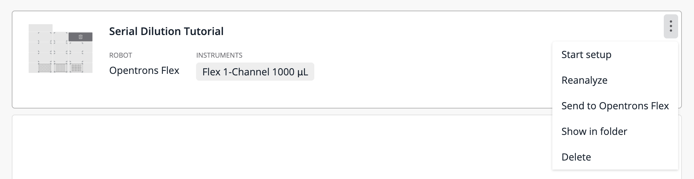{width="6.493054461942258in"
height="1.6789337270341207in"}{width="0.2916666666666667in"
height="8.333333333333333e-2in"}{width="0.2777777777777778in"
height="9.722222222222222e-2in"}{width="8.333333333333333e-2in"
height="9.722222222222222e-2in"}{width="0.25in"
height="9.722222222222222e-2in"}{width="0.18055555555555555in"
height="8.333333333333333e-2in"}{width="0.4722222222222222in"
height="0.1111111111111111in"}{width="0.1111111111111111in"
height="8.333333333333333e-2in"}{width="0.2222222222222222in"
height="8.333333333333333e-2in"}{width="0.4444444444444444in"
height="0.1111111111111111in"}{width="0.25in"
height="0.1111111111111111in"}{width="0.2222222222222222in"
height="8.333333333333333e-2in"}{width="0.4722222222222222in"
height="0.1111111111111111in"}{width="0.18055555555555555in"
height="9.722222222222222e-2in"}{width="1.1111111111111112in"
height="0.18055555555555555in"}{width="0.4444444444444444in"
height="6.944444444444445e-2in"}{width="0.2361111111111111in"
height="6.944444444444445e-2in"}{width="0.3888888888888889in"
height="9.722222222222222e-2in"}{width="0.375in"
height="9.722222222222222e-2in"}{width="0.2777777777777778in"
height="9.722222222222222e-2in"}{width="0.6111111111111112in"
height="0.4722222222222222in"}

> IMPORT A PROTOCOL
>
> When you first launch the Opentrons App, you will see the Protocols
> screen. (Click **Protocols** in the left sidebar to access it at any
> other time.) Click **Import** in the top right corner to reveal the
> Import a Protocol pane. Then click **Choose File** and find your
> protocol in the system file picker, or drag and drop your protocol
> file into the well.
>
> The Opentrons App will analyze your protocol as soon as you import it.
> *Protocol analysis* is the process of taking the JSON object or Python
> code contained in the protocol file and turning it into a series of
> commands that the robot can execute in order. If there are any errors
> in your protocol file, or if you're missing custom labware
> definitions, a warning banner will appear on the protocol's card.
> Correct the errors and re-import the protocol. If there are no errors,
> your protocol is ready to transfer to Flex.

  -----------------------------------------------------------------------

  -----------------------------------------------------------------------

> Actions available in the three-dot menu (**⋮**) for imported
> protocols.

+-----------------------------------+-----------------------------------+
| {width="0.3333333333333333in" | > check of the validity of your   |
| height="0.2638888888888889in"}    | > protocol. Protocol analysis     |
|                                   | > will run again on the robot     |
|                                   | > once you transfer the protocol  |
|                                   | > to it. It's                     |
+===================================+===================================+
+-----------------------------------+-----------------------------------+

> possible for analysis to fail in the app and succeed on the robot, or
> vice versa. Analysis mismatches may occur when your app and robot
> software versions are out of sync, or if you have customized the
> Python environment on your Flex.
>
> RUN IMMEDIATELY
>
> Click the three-dot menu (**⋮**) on your protocol and choose **Start
> setup**. Choose a connected and available Flex from the list to
> transfer the protocol and begin run setup immediately. The run setup
> screen will appear both in the app and on the touchscreen, and you can
> continue from either place.
>
> If you stay in the app, expand the sections under the Setup tab and
> follow the instructions in each one: Robot Calibration, Module Setup
> (if your protocol uses modules), Labware Position Check (recommended),
> and Labware Setup. Then click ▶**Start run** to to begin the protocol.
>
> If you move to the touchscreen, follow the steps in the [Run Setup
> section]{.underline} above.
>
> RUN LATER
>
> Click the three-dot menu (**⋮**) on your protocol and choose **Send to
> Opentrons Flex**. Choose a connected and available Flex from the list
> to transfer the protocol. A message indicating a successful transfer
> will pop up both in the app and on the touchscreen. To set up your
> protocol, you need to move to the touchscreen and follow the steps in
> the [Run Setup section]{.underline} above.
>
> Module status and controls
>
> Use the Opentrons App to view the status of modules connected to your
> Flex and control them outside of protocols. Click **Devices** and then
> click on your Flex to view its robot details page. Under Instruments
> and Modules, there is a card for each attached module. The card shows
> the type of module, what USB port it is connected to, and its current
> status.

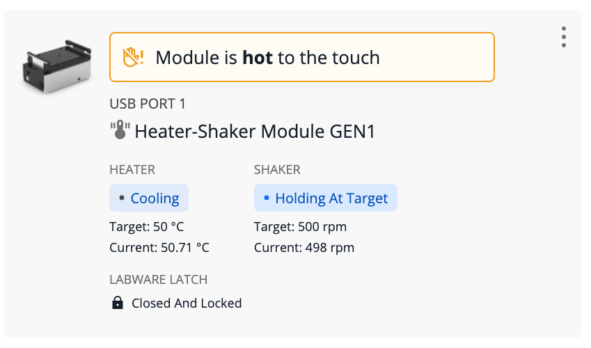{width="5.2in"
height="3.0625in"}

> Module card for the Heater-Shaker Module.

{width="5.291666666666667in"
height="0.8194444444444444in"}

> **Note:** The Magnetic Block does not have a card in Instruments and
> Modules, since it is unpowered and does not connect to Flex via USB.
>
> Click the three-dot menu (**⋮**) on the module card to choose from
> available commands. You can always choose **About module** to see the
> firmware version and serial number of the module. (This information is
> very useful when contacting Opentrons Support!) The other commands
> depend on the type of the module and its current status:

+-----------------------------------+-----------------------------------+
| > **Module type**                 | > **Commands**                    |
+===================================+===================================+
| > **Heater-Shaker**               | > Set module                      |
|                                   | > temperature/Deactivate heater   |
+-----------------------------------+-----------------------------------+

> Open labware latch/Close labware latch
>
> Test shake/Deactivate shaker

+-----------------------------------+-----------------------------------+
| > **Temperature**                 | > Set module                      |
|                                   | > temperature/Deactivate module   |
+===================================+===================================+
| > **Thermocycler**                | > Set lid temperature/Deactivate  |
|                                   | > lid                             |
+-----------------------------------+-----------------------------------+

> Open lid/Close lid
>
> Set block temperature/Deactivate block
>
> Recent protocol runs
>
> The robot details page lists up to 20 recent protocol runs. This
> provides additional information compared to the touchscreen, which
> only shows the most recent run for each unique protocol.
>
> Each entry in the recent protocol runs list includes the protocol
> name, its timestamp, whether the run was canceled or completed, and
> the duration of the run. Click the disclosure triangle next to any run
> to show its associated labware offset data. Click the three-dot menu
> (**⋮**) for related actions:
>
> **View protocol run record:** Show the protocol run screen as it
> appeared when the protocol ended (succeeded, failed, or was canceled),
> including all performed steps.
>
> **Rerun protocol now:** The same as choosing **Start setup** on the
> corresponding protocol.

{width="6.5in"
height="1.4583333333333333in"}

> **Download run log:** Save to your computer a JSON file containing
> information about the protocol run, including all performed steps.
>
> **Delete protocol run record:** Delete all information about this
> protocol run from Flex, including labware offset data. When you choose
> this option, it's as though the protocol run never happened.
>
> **Note:** If you need to maintain a comprehensive record of all runs
> performed on your Flex, you must use the **Download run log** feature
> to save this information to your computer. Flex *will not* retain
> information about more than 20 runs on the robot. Proceeding to the
> Run Setup screen generates an entry in the list and counts towards the
> maximum of 20 runs, even if you never begin the protocol.

**7.3 Advanced operation**

Jupyter Notebook

Flex runs a server on port 48888, which you can connect to with your web
browser. Use Jupyter to individually run discrete chunks of Python code,
called *cells*. This is a convenient environment for writing and
debugging protocols, since you can define different parts of your
protocol in different notebook cells, and run a single cell at a time.

Access your robot's Jupyter Notebook either:

> In the Opentrons App. Go to **Devices** \> your robot \> **Robot
> Settings** \> **Advanced** and then click **Launch Jupyter Notebook**.
>
> In your web browser. Navigate directly to http://\<robot-ip\>:48888,
> replacing \<robot-ip\> with the local IP address of your Flex.

For more details on using Jupyter, including preparing executable cells
of code and running them on a robot, see the of the Python Protocol API
documentation.

> Command-line operation over SSH
>
> You can work with your Flex through a Secure Shell (SSH) terminal
> connection. Terminal access lets you or perform advanced tasks, such
> as customizing the Python environment on the robot. Protocols that
> reference external files on disk (apart from custom labware definition
> files) must be run from the command line.
>
> SSH keys are required to connect to Flex and issue commands from a
> terminal. Setup requires a bash or zsh shell with openssh installed.
>
> Follow these steps to authenticate to your Flex via SSH:
>
> 1\. Open a terminal on your computer and type ssh-keygen -f robot_key
> -t ecdsa
>
> 2\. Create a passphrase when prompted. A passphrase is not required,
> but you should always create one. This process generates a file,
> robot_key.pub.
>
> 3\. Find the robot_key.pub file and copy it to the root of a USB-A
> flash drive.

+-----------------------------------+-----------------------------------+
| {width="0.3333333333333333in" | > formatted with a file system    |
| height="0.2638888888888889in"}    | > readable by the embedded Linux  |
|                                   | > system on Flex. FAT32, NTFS,    |
|                                   | > and ext4 file systems are       |
+===================================+===================================+
+-----------------------------------+-----------------------------------+

> supported. The macOS HFS+ and APFS file systems are not. (macOS can
> read and write to FAT-formatted drives.)
>
> 4\. Eject the drive and connect it to an open USB-A port on your Flex.
> Make sure that it is the only drive attached to your Flex, or the key
> file may not be accessible.
>
> 5\. On your computer, type the following command in your terminal.
> Replace ROBOT_IP with the local IP address of your Flex.

+-----------------------------------------------------------------------+
| > curl \\                                                             |
+=======================================================================+
+-----------------------------------------------------------------------+

+-----------------------------------------------------------------------+
| > \--location \--request POST \\                                      |
+=======================================================================+
+-----------------------------------------------------------------------+

+-----------------------------------------------------------------------+
| > 'http://ROBOT_IP:3195/server/ssh_keys/from_local'                   |
+=======================================================================+
+-----------------------------------------------------------------------+

> The command is successful if you get a 201 response with a message
> indicating how many keys were added. The command failed if you get a
> 404 response.
>
> 6\. After successfully adding the key, type the following command.
> Again, replace ROBOT_IP with the local IP address of your Flex.

+-----------------------------------------------------------------------+
| > ssh -i robot_key root@ROBOT_IP                                      |
+=======================================================================+
+-----------------------------------------------------------------------+

> The connection works if you see an ASCII art version of the Opentrons
> logo. You can now browse the Flex file system and issue commands from
> the terminal.

CHAPTER 8\
**Maintenance and Service**

This chapter covers how to perform routine maintenance on your Opentrons
Flex, and what to do if you require service for a problem. You should be
able to perform cleaning tasks yourself, whereas service and repairs
should be handled by Opentrons Support.

**8.1 Cleaning your Flex**

Routine cleaning helps keep Flex free of contaminants that can affect
your protocols. Cleaning also gives you a chance to inspect the robot
for wear and damage. You should review this section for information,
instructions, and resources about how to clean your Flex, pipettes,
gripper, modules, and other hardware.

If you have any questions about cleaning your Flex and its related
components, contact the support team at .

Before you begin

Flex is an electrically powered mechanical device. As a good practice,
turn off the power before you start cleaning it and before reaching
inside the enclosure. You may even want to unplug the robot as well.
These are simple safety steps you can take to make the robot inoperable
until you're finished.

Along with turning the power off, remove any instruments, modules, and
labware before cleaning the robot. Removing attached items gives you
more room to work and provides better access to the deck, gantry, and
other spaces.

What you can clean

You can wipe off all the visible and easily accessible surfaces of your
Flex. This includes the exterior and interior frame, touchscreen,
windows, gantry, and deck. The Flex does not have any internal parts
that you need to open or disassemble for this level of maintenance. If
you can see it, you can clean it. If you can't see it, don't clean it.

158 OPENTRONS FLEX

{width="4.819444444444445in"
height="0.8333333333333334in"}

> CHAPTER 8: MAINTENANCE AND SERVICE
>
> Cleaning solutions
>
> The following table lists the chemicals you can use to clean your
> Flex. Diluted alcohol and distilled water are our recommended cleaning
> solutions, but you can refer to this list for other cleaning options.
> You can also use these chemicals to clean modules, pipettes, and other
> attached hardware.
>
> **Warning:***Do not use acetone*. The robot, pipettes, and modules are
> made from materials that acetone can damage or dissolve.

+-----------------------------------+-----------------------------------+
| > **Solution**                    | > **Recommendations**             |
+===================================+===================================+
+-----------------------------------+-----------------------------------+

+-----------------------------------+-----------------------------------+
| > **Alcohol**                     | > Includes ethyl/ethanol,         |
|                                   | > isopropyl, and methanol. Dilute |
|                                   | > to 70% for cleaning.            |
+===================================+===================================+
+-----------------------------------+-----------------------------------+

> Do not use 100% alcohol.

+-----------------------------------+-----------------------------------+
| > **Bleach**                      | > Dilute to 10% (1:10             |
|                                   | > bleach/water ratio) for         |
|                                   | > cleaning. Do not use 100%       |
|                                   | > bleach.                         |
+===================================+===================================+
| > **Distilled water**             | > You can use distilled water to  |
|                                   | > clean or rinse your robot.      |
+-----------------------------------+-----------------------------------+

> Frame and window panel cleaning
>
> To clean the exterior and interior frame and window panels of your
> Flex:
>
> 1\. Dampen a soft, clean cloth or paper towel with a cleaning
> solution. 2. Gently wipe off the exposed and easily accessible surface
> areas. 3. Use a cloth dampened with distilled water for a rinse
> wipedown. 4. Let the robot air dry.
>
> Deck cleaning
>
> To clean the deck, deck slots, and trash bin:
>
> 1\. Dampen a soft, clean cloth or paper towel with a cleaning
> solution.
>
> 2\. Gently wipe off the deck, deck slots, and trash bin. You can
> remove the deck slots and trash bin for easier access.
>
> OPENTRONS FLEX 159
>
> CHAPTER 8: MAINTENANCE AND SERVICE

3\. Use a cloth dampened with distilled water for a rinse wipedown.

4\. Let the deck pieces air dry. Replace any pieces that you removed for
cleaning.

Gantry cleaning

To clean the gantry:

1\. Dampen a soft, clean cloth or paper towel with a cleaning solution.
2. Gently wipe off the horizontal and vertical gantry surfaces, and side
rails. 3. Use a cloth dampened with distilled water for a rinse
wipedown.

4\. Let the gantry air dry.

Waste chute cleaning

To clean the waste chute:

1\. Remove the waste chute from its deck plate adapter.

2\. Dampen a soft, clean cloth or paper towel with a cleaning solution.

3\. Gently wipe down the exterior of the chute. The interior is
powder-coated steel, so you can clean it with mild detergents or
surfactants.

Use a cloth dampened with distilled water for a rinse wipedown. 4.

5\. Let the waste chute air dry and reattach it to the deck.

**8.2 Cleaning pipettes and tips**

To clean a 1-, 8-, or 96-channel pipette:

1\. Remove the pipette from the gantry.

2\. Dampen a soft, clean cloth or paper towel with a cleaning solution.

3\. Gently wipe down the following parts:\
Body\
Ejector\
Nozzles\
4. Use a cloth dampened with distilled water for a rinse wipedown. 5.
Let the pipette air dry and reattach.

160 OPENTRONS FLEX

{width="6.5in"
height="1.6944444444444444in"}{width="0.8069433508311461in"
height="3.4478488626421697in"}{width="0.8069433508311461in"
height="3.4478488626421697in"}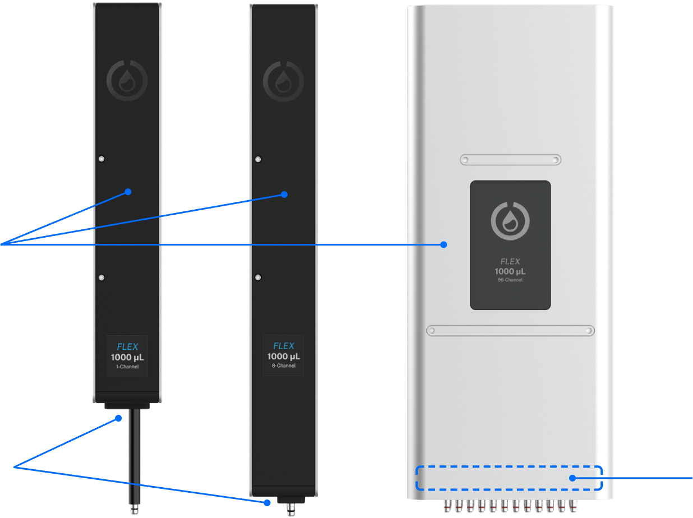{width="4.291666666666667in"
height="3.2083333333333335in"}{width="1.7722222222222221in"
height="3.44450678040245in"}

> Body
>
> Ejector Ejector
>
> {width="2.4027777777777777in"
> height="0.3333333333333333in"}

Nozzles

> **Warning:**\
> *Do not* disassemble Flex pipettes for cleaning or attempt to clean
> their internal electronic components.
>
> *Do not* put Flex pipettes in an autoclave. The high temperatures,
> pressures, and steam used inside an autoclave can damage the
> electronics, circuit boards, small electric motors, and other
> sensitive components.

Pipette decontamination

The routine cleaning steps described above may not clean your pipette if
it becomes contaminated with substances like nucleic acids, proteins, or
radioactive material. When a pipette becomes contaminated, try the
decontamination steps described in this section. You can also contact
support if your pipette gets contaminated and these cleaning procedures
do not work.

> CHAPTER 8: MAINTENANCE AND SERVICE
>
> OUTSIDE OF THE PIPETTE
>
> Refer to the following table for recommended cleaning methods, by
> contamination type.

+-----------------------------------+-----------------------------------+
| > **Contaminant**                 | > **Cleaning recommendation**     |
+===================================+===================================+
| > **Aqueous solutions**           | > Rinse the contaminated parts    |
|                                   | > with distilled water or 70%     |
|                                   | > ethanol and                     |
+-----------------------------------+-----------------------------------+

air dry at 15.5 °C (60 °F).

+-----------------------------------+-----------------------------------+
| > **Nucleic acids**               | > Clean the contaminated parts in |
|                                   | > a glycine/HCl buffer (pH 2) for |
|                                   | > 10                              |
+===================================+===================================+
+-----------------------------------+-----------------------------------+

minutes, rinse with distilled water, and air dry.

+-----------------------------------+-----------------------------------+
| > **Organic solvents**            | > Allow the solvent to evaporate  |
|                                   | > on its own or immerse the       |
|                                   | > pipette *nozzle*                |
+===================================+===================================+
+-----------------------------------+-----------------------------------+

*only* in a detergent, rinse with distilled water, and air dry.

+-----------------------------------+-----------------------------------+
| > **Proteins**                    | > Clean the contaminated parts    |
|                                   | > with a detergent, rinse with    |
|                                   | > distilled                       |
+===================================+===================================+
+-----------------------------------+-----------------------------------+

water, and air dry. *Do not* use alcohol. That will set the proteins.

+-----------------------------------+-----------------------------------+
| > **Radioactive materials**       | > Place the pipette nozzle in a   |
|                                   | > solution like Decon 90, rinse   |
|                                   | > with distilled                  |
+===================================+===================================+
+-----------------------------------+-----------------------------------+

water, and air dry.

> INSIDE THE PIPETTE
>
> Filtered pipette tips help prevent contaminating the barrel or inside
> of the pipette. But, you cannot disassemble the barrel if it becomes
> contaminated. If the inside of your pipette gets contaminated, the
> following steps may help remove the contamination:
>
> 1\. Inject a small amount of cleaning solution into the barrel using a
> manual pipette or syringe. 2. Gently shake the pipette to swirl the
> cleaning solution.\
> 3. Rinse with distilled water.
>
> 4\. Let the pipette air dry and reattach.
>
> Cleaning pipette tips
>
> Flex pipette tips are disposable items. You can autoclave and reuse
> them if your protocol allows it. For best results, we recommend using
> clean, fresh tips. Discard pipette tips after you no longer need them.
> You can purchase directly from Opentrons.
>
> 162 OPENTRONS FLEX

{width="6.5in"
height="1.6527777777777777in"}{width="1.773611111111111in"
height="3.8500339020122483in"}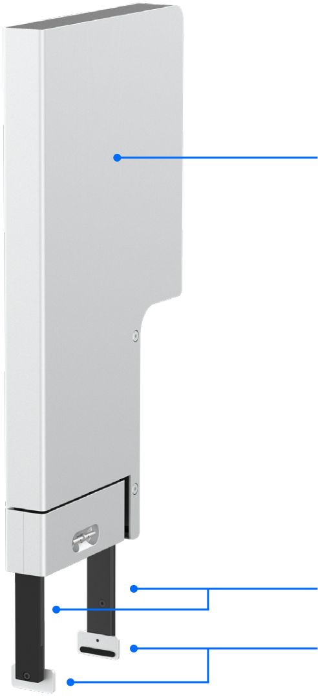{width="1.7083333333333333in"
height="3.7222222222222223in"}

  -----------------------------------------------------------------------
  **8.3 Cleaning the gripper**        Body
  ----------------------------------- -----------------------------------

  -----------------------------------------------------------------------

> To clean the gripper:
>
> 1\. Remove the gripper from the gantry.\
> 2. Dampen a soft, clean cloth or paper\
> towel with a cleaning solution.
>
> 3\. Gently wipe down the following parts:\
> Gripper body\
> Jaws\
> Paddles

+-----------------------+-----------------------+-----------------------+
| 4\.                   | > Use a cloth         | > Jaws\               |
|                       | > dampened with       | > Paddles             |
|                       | > distilled           |                       |
+=======================+=======================+=======================+
| > water for a rinse   |                       |                       |
| > wipedown.           |                       |                       |
| >                     |                       |                       |
| > 5\. Let the gripper |                       |                       |
| > air dry and         |                       |                       |
| > reattach.           |                       |                       |
+-----------------------+-----------------------+-----------------------+

> **Warning:**\
> *Do not* disassemble the gripper for cleaning or attempt to clean its
> internal electronic components.
>
> *Do not* put the gripper in an autoclave. The high temperatures,
> pressures, and steam used inside an autoclave can damage the
> electronics, circuit boards, small electric motors, and other
> sensitive components.
>
> GRIPPER PADDLES
>
> The gripper paddles are wear items that require periodic replacement.
> When cleaning the gripper, inspect the rubber pads for tears, nicks,
> or other wear. Replace the paddles as needed with the two spares
> (included with the gripper). If you need additional gripper paddles,
> contact Opentrons Support at .

+-----------------------------------+-----------------------------------+
| {width="0.3333333333333333in" | > lifetime of the rubber pads on  |
| height="0.2638888888888889in"}    | > the gripper paddles.            |
+===================================+===================================+
|                                   |                                   |
+-----------------------------------+-----------------------------------+

{width="6.5in"
height="1.6666666666666667in"}

> CHAPTER 8: MAINTENANCE AND SERVICE

**8.4 Cleaning modules**

You can clean the surfaces of any of your Flex modules. The general
procedure is the same for all supported modules: Heater-Shaker, Magnetic
Block, Temperature, and Thermocycler.

Be sure to turn the module's power off before cleaning it. You can clean
the top surfaces of modules while they're installed in a deck slot.
However, for better access, you may want to:

> Remove the caddy and module from the deck slot.
>
> Remove the module from the caddy.
>
> Disconnect any USB or power cables (if you're cleaning a powered
> module).
>
> **Warning:**\
> *Do not* disassemble modules for cleaning or attempt to clean their
> internal electronic components.
>
> *Do not* put Flex modules in an autoclave. The high temperatures,
> pressures, and steam used inside an autoclave can damage the
> electronics, circuit boards, small electric motors, and other
> sensitive components.

General module cleaning

Once you've prepared the module for cleaning:

+-----------------------+-----------------------+-----------------------+
| 1\.                   | > Dampen a soft,      | OPENTRONS FLEX        |
|                       | > clean cloth or      |                       |
|                       | > paper towel with a  |                       |
|                       | > cleaning solution.  |                       |
+=======================+=======================+=======================+
| 2\.                   | > Gently wipe off the |                       |
|                       | > module's surfaces.  |                       |
+-----------------------+-----------------------+-----------------------+
| 3\.                   | > Use a cloth         |                       |
|                       | > dampened with       |                       |
|                       | > distilled water as  |                       |
|                       | > a rinse wipedown.   |                       |
+-----------------------+-----------------------+-----------------------+
| 4\.                   | > Let the module air  |                       |
|                       | > dry.                |                       |
+-----------------------+-----------------------+-----------------------+
| 164                   |                       |                       |
+-----------------------+-----------------------+-----------------------+

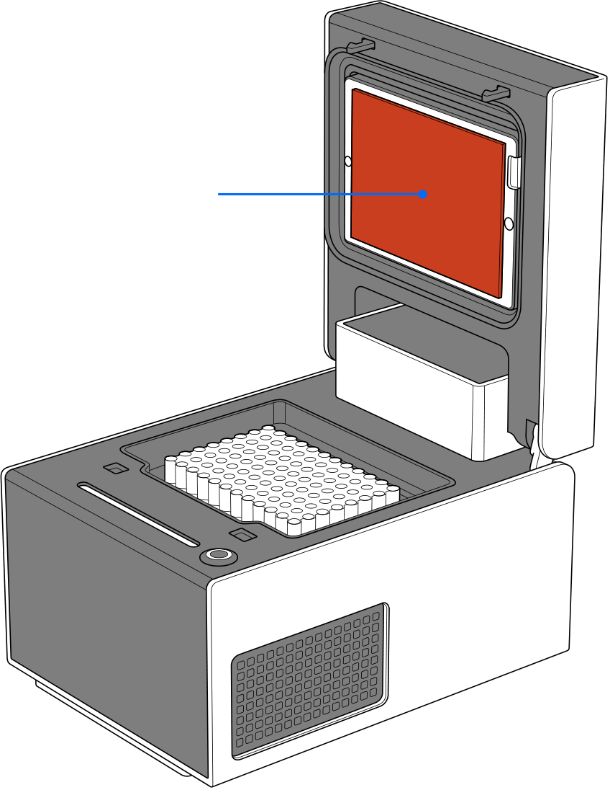{width="2.9444444444444446in"
height="3.8055555555555554in"}

+-----------------------+-----------------------+-----------------------+
| Thermocycler seals\   |                       | > Automation\         |
| To set up the         |                       | > Seal                |
| Thermocycler with a   |                       |                       |
| clean seal:           |                       |                       |
+=======================+=======================+=======================+
| 1\.                   | > Affix a seal to the |                       |
|                       | > Thermocycler lid    |                       |
+-----------------------+-----------------------+-----------------------+

> (if one isn't attached already).
>
> 2\. Wipe the seal with a 1:10 diluted\
> bleach solution.
>
> 3\. Rinse the seal with molecular\
> biology grade water.
>
> Let the seal air dry. 4.
>
> **8.5 Autoclave-safe labware**
>
> The following table lists labware sold by Opentrons that we have
> verified as autoclave-safe. When you can't determine whether a piece
> of labware is autoclave-safe, just replace it with new, clean labware.
> You can from the Opentrons shop.

+-----------------------------------+-----------------------------------+
| > **Labware type**                | > **Autoclave-safe items**        |
+===================================+===================================+
| > **Reservoirs**                  | > All NEST reservoirs             |
+-----------------------------------+-----------------------------------+
| > **Sample vials**                | > Eppendorf Safe-Lock 1.5 mL and  |
|                                   | > 2.0 mL vials (when left open at |
|                                   | > 121 °C, 20 min)                 |
+-----------------------------------+-----------------------------------+
| **Tip racks and tips**            | > All Flex tip racks and tips     |
+-----------------------------------+-----------------------------------+
| > **Well plates**                 | > Thermo Scientific Nunc 96-Well  |
|                                   | > Plate, 1300 µL                  |
+-----------------------------------+-----------------------------------+

> Thermo Scientific Nunc 96-Well Plate, 2000 µL\
> USA Scientific 96 Deep Well Plate, 2.4 mL
>
> If you're using labware from a manufacturer that's not listed here,
> refer to their website to see whether those items can be autoclaved.

**8.6 Servicing Flex**

Opentrons Flex is designed for years of full-time operation. Unlike
cleaning, you should not attempt to service or repair Flex yourself.
Opentrons offers multiple levels of service for Flex and related
Opentrons hardware, some of which include maintenance and repairs. All
Opentrons hardware also has a 1-year warranty, which you can extend to 2
years.

Opentrons services

Opentrons offers two levels of service, Opentrons Care and Opentrons
Care Plus, both of which include benefits for onboarding, maintenance,
repair, and more. Both services are available in the continental United
States; Opentrons Care is also available internationally. Both services
include:

> Onboarding with an Opentrons field applications scientist. Parts for
> yearly preventive maintenance.
>
> Access to a dedicated support engineer.
>
> Extension of the Opentrons warranty from 1 to 2 years.

In addition, Opentrons Care Plus includes on-site visits for:

> Installation.
>
> Preventive maintenance, yearly.\
> Repairs, as needed.

You can also a la carte, including installation, protocol development
(remote or on-site), repair, relocation, and preventive maintenance.
Contact Opentrons Sales for more information.

Installation qualification and operation qualification

Opentrons recommends performing installation qualification and operation
qualification (IQ/OQ) after you first set up Flex, after you attach
hardware, and after having service performed. IQ/OQ generally verifies:

> The serial numbers of your hardware, including the Flex robot,
> pipettes, gripper, and modules. Software and firmware versions.
>
> Proper connection of attached hardware.\
> Pipette and module calibrations.
>
> Consult the for a complete checklist of IQ/OQ activities to perform.
>
> Preventative maintenance
>
> Opentrons recommends performing basic maintenance tasks --- above and
> beyond cleaning, but not repairs or service --- on a regular schedule.
> These recommendations assume that Flex is in operation 20 hours per
> week, 50 weeks per year. Adjust the schedule to meet your needs if you
> use your Flex more or less.

+-----------------------+-----------------------+-----------------------+
| **Frequency**         | > **Task**            | > **Description**     |
+=======================+=======================+=======================+
| > Daily               | Empty trash           | > Take the movable    |
|                       |                       | > trash out of its    |
|                       |                       | > deck slot, safely   |
|                       |                       | > discard its         |
+-----------------------+-----------------------+-----------------------+

contents, and replace it into the deck.

+-----------------------+-----------------------+-----------------------+
|                       | > Inspect             | Clear the deck of any |
|                       |                       | debris, liquid, or    |
|                       |                       | no-longer-needed      |
|                       |                       | labware.              |
+=======================+=======================+=======================+
|                       | working area          | > Check that the      |
|                       |                       | > plastic labware     |
|                       |                       | > clips are not       |
|                       |                       | > damaged.            |
+-----------------------+-----------------------+-----------------------+
| > Weekly              | > Clean               | > Clean the exterior  |
|                       |                       | > surfaces of the     |
|                       |                       | > deck, gantry,       |
|                       |                       | > windows,            |
+-----------------------+-----------------------+-----------------------+
|                       | > surfaces            | > instruments, and    |
|                       |                       | > other hardware, as  |
|                       |                       | > described above.    |
+-----------------------+-----------------------+-----------------------+
| > Monthly             | > Power cycle         | > Turn off Flex and   |
|                       |                       | > all connected       |
|                       |                       | > modules. Then turn  |
|                       |                       | > them back on.       |
+-----------------------+-----------------------+-----------------------+
| > Every six           | > Inspect             | > Inspect the O-rings |
|                       |                       | > on the pipette      |
|                       |                       | > nozzles for signs   |
|                       |                       | > of wear             |
+-----------------------+-----------------------+-----------------------+
| > months              | > pipettes            | > (notches,           |
|                       |                       | > deformation).       |
|                       |                       | > Replace the O-rings |
|                       |                       | > with the provided   |
+-----------------------+-----------------------+-----------------------+

spares, if needed.

+-----------------------------------+-----------------------------------+
| > Inspect\                        | > Inspect the rubber pads on the  |
| > gripper                         | > gripper paddles. Replace the    |
|                                   | > paddles with the provided       |
|                                   | > spares, if needed.              |
+===================================+===================================+
| > Recalibrate                     | > Run recalibration for the       |
|                                   | > pipettes and gripper.           |
+-----------------------------------+-----------------------------------+

> instruments

+-----------------------+-----------------------+-----------------------+
| > Yearly              | > Evaluate            | > Evaluate the        |
|                       |                       | > overall performance |
|                       |                       | > of your Flex        |
|                       |                       | > pipettes. Replace   |
+=======================+=======================+=======================+
|                       | > pipette             | > any pipette that is |
|                       |                       | > not performing      |
|                       |                       | > according to the    |
|                       |                       | > [p                  |
|                       |                       | ublished]{.underline} |
+-----------------------+-----------------------+-----------------------+
|                       | > performance         | > [accuracy and       |
|                       |                       | > precision           |
|                       |                       | > st                  |
|                       |                       | andards]{.underline}. |
+-----------------------+-----------------------+-----------------------+

> The annual on-site preventative maintenance visit that is part of
> Opentrons Care Plus includes performance of all of the tasks listed
> above, as well as replacement parts.

Warranty

All hardware purchased from Opentrons is covered under a . Opentrons
warrants to the end-user of the products that they will be free of
manufacturing defects due to part quality issues or poor workmanship and
also warrants that the products will materially conform to Opentrons'
published specifications. See the of our website for information about
service contracts, custom protocol development, and other support
offerings.

Contact us at if you have any questions about our warranty.

> APPENDIX A\
> **Glossary**
>
> This appendix defines terms related to Opentrons Flex. It omits
> industry-standard terms like "labware" unless the term has a special
> meaning in relation to Flex. For example, the definition for *pipette*
> describes the narrower meaning that the term has when using Flex, as
> opposed to any pipette you might find elsewhere in a lab.
>
> The glossary is formatted to help you navigate within it and to other
> places in this manual. Words in italics indicate terms that are also
> defined in the glossary. Extremely common terms like "deck", "module",
> "pipette", and "protocol" aren't italicized, to improve readability.
> Links within definitions take you to the most relevant section that
> includes additional discussion of the term. And you can always use
> your PDF reader to search for every occurrence of a term to find even
> more information.
>
> ABOVE DECK
>
> Space that is on or above the level of the robot's deck area.
>
> ALUMINUM BLOCK
>
> See *thermal block*.
>
> AMBIENT LIGHTING
>
> LEDs that illuminate the interior of Flex, which you can toggle on and
> off from the *touchscreen* or the *Opentrons App*.
>
> AUXILIARY PORTS
>
> Ports on the back of the Flex labeled AUX-1 and AUX-2. The port
> connection type is an . See the [Connections section]{.underline} in
> the System Description chapter.
>
> A1 EXPANSION SLOT
>
> The area of the deck behind slot A1. When its cover is removed, the A1
> expansion slot provides enough space to install the Thermocycler
> Module. See the [Deck and Working Area section]{.underline} of the
> System Description chapter.
>
> OPENTRONS FLEX 169
>
> APPENDIX A: GLOSSARY
>
> BELOW DECK
>
> The empty area below the robot's *deck slots*. This space provides
> clearance for module caddies that sit below the deck and allows for
> below-deck cable routing.
>
> CADDY
>
> See *module caddy*.
>
> CALIBRATION PIN
>
> A metal pin you attach to the *gripper's jaws* during gripper
> calibration. See the [Gripper Calibration section]{.underline} in the
> System Description chapter.
>
> CALIBRATION PROBE
>
> A metal collar you attach to the *nozzle* of a pipette during pipette
> calibration, module calibration, and *Labware Position Check*. See the
> [Pipette Calibration section]{.underline} in the System Description
> chapter and the [Module Calibration section]{.underline} in the
> Modules chapter. See also the [Labware Position Check
> section]{.underline} of the Software and Operation chapter.
>
> CALIBRATION SQUARE
>
> The central part of a *removable deck slot* or *module calibration
> adapter*. The square is made of steel to reduce the chance of surface
> damage during calibration.
>
> CAMERA
>
> A built-in camera that provides an above-deck view inside the Flex
> enclosure.
>
> CARRYING HANDLE
>
> One of four aluminum handles that screw into the bottom corners of the
> robot. The handles help make Flex easier to lift. Lifting the robot
> requires two people. Using the handles is the best way to pick up Flex
> and move it.
>
> 170 OPENTRONS FLEX
>
> APPENDIX A: GLOSSARY
>
> CARRYING HANDLE CAP
>
> A flat metal cover that goes over the attachment point for a *carrying
> handle*. The caps close the handle openings in the *frame* and give
> the robot a clean appearance. See the [Physical Components
> section]{.underline} in the System Description chapter.
>
> DASHBOARD
>
> The main screen for the robot, accessible by tapping the robot's name
> in the top left corner of the *touchscreen*. The dashboard gives you
> quick access to recently run protocols. See the [Touchscreen Operation
> section]{.underline} in the Software and Operation chapter.
>
> DECK
>
> The machined aluminum surface on which automated science protocols are
> executed. It includes the *working area*, *staging area*, and *A1
> expansion slot*. See the [Deck and Working Area section]{.underline}
> in the System Description chapter.
>
> DECK BORDER
>
> The fixed portion of the deck around the four edges of the robot
> (outside of the area where *deck slot* panels fit). It contains the
> removable accessory covers.
>
> DECK FIXTURE
>
> Hardware items that replace standard *deck slots*. They let you
> customize the deck layout and add functionality to your Flex. Deck
> fixtures include the *staging area slots*, *trash bin*, and *waste
> chute*.
>
> DECK SLOT
>
> A detachable panel on the deck area. Remove deck slots to install
> modules and for access to the space below the deck.
>
> EJECTOR
>
> The mechanism that automatically pushes tips off the *nozzle* of a
> pipette. See the [Pipettes section]{.underline} in the System
> Description chapter.
>
> OPENTRONS FLEX 171
>
> APPENDIX A: GLOSSARY
>
> EMERGENCY STOP PENDANT\
> An external accessory that you press to stop the robot immediately.
> Also referred to as the E-stop. See the [Emergency Stop Pendant
> section]{.underline} in the System Description chapter.
>
> EXPANSION SLOT\
> See *A1 expansion slot*.
>
> EXTENSION MOUNT\
> The attachment point on the *gantry* for the Flex Gripper. See the
> [Movement System section]{.underline} in the System Description
> chapter.
>
> FINISHING CAP\
> See *carrying handle cap*.
>
> FIRMWARE\
> The low-level software that controls the Flex robot and all of its
> peripheral systems. The Flex robot will automatically update the
> firmware on connected instruments and modules to stay in sync with the
> robot software version.
>
> FIXTURE\
> See *deck fixture*.
>
> FRAME\
> The outer metal structure of the robot.
>
> FRONT DOOR\
> The hinged clear panel on the front of the robot.
>
> 172 OPENTRONS FLEX
>
> APPENDIX A: GLOSSARY
>
> GANTRY\
> The robot's positioning system that moves attached *instruments*
> horizontally (on the x- and y-axis). See the [Movement System
> section]{.underline} in the System Description chapter.
>
> GRIPPER\
> The Opentrons Flex Gripper, an *instrument* that picks up labware and
> moves it around the deck automatically.
>
> HOME GANTRY\
> The act of moving the *gantry* to a defined position at the back right
> of the *working area*.
>
> INSTRUMENT\
> Any component that attaches to the *gantry* and manipulates liquids or
> labware on the deck. Examples

+-----------------------+-----------------------+-----------------------+
| include the 1-        | , 8-                  | > , and 96-channel    |
|                       |                       | > pipettes, and the   |
|                       |                       | > gripper.            |
+=======================+=======================+=======================+
+-----------------------+-----------------------+-----------------------+

> INSTRUMENT MOUNT\
> Attachment point for an *instrument*. Examples include the
> *pipettemounts* and the *extension mount* for the *gripper*. See the
> [Movement System section]{.underline} in the System Description
> chapter.
>
> JAWS\
> The moving pincers of the *gripper*. See the [Gripper Specifications
> sectio]{.underline}n in the System Description chapter.
>
> JSON PROTOCOL\
> A standardized scientific procedure written as a file. The Opentrons
> *Protocol Designer* outputs JSON protocols.
>
> OPENTRONS FLEX 173
>
> APPENDIX A: GLOSSARY

JSON SCHEMA\
A set of requirements for the structure and contents of a file. For
example, all of the s are formatted according to a particular JSON
schema, while *JSON protocols* follow another schema.

LABWARE CLIPS\
The plastic pieces at the corners of *deck slots*. Labware clips hold
labware in place.

LABWARE CREATOR\
The is a no-code, web-based tool that uses a graphical interface to help
you create a labware definition file to import into the *Opentrons App*.
After importing it, your custom labware is available to the Flex robot
and the *Python Protocol API*.

LABWARE LIBRARY\
The lists the durable and consumable items you can use with the Flex by
default, without customization. It includes things like well plates,
reservoirs, tips, tip racks, and tubes.

LABWARE OFFSET\
Positional data that is created and stored by running *Labware Position
Check*. Flex takes these offsets into account when moving to a
particular type of labware in a particular *deck slot*.

LABWARE POSITION CHECK\
A guided process to visually check and adjust pipette movement relative
to a piece of labware, with a resolution of 0.1 mm. See the [Labware
Position Check section]{.underline} in the Software and Operation
chapter.

LIFT HANDLES\
See *carrying handles*.

174 OPENTRONS FLEX

> APPENDIX A: GLOSSARY

LIGHTS\
See *ambient lighting* or *status light*.

MAINTENANCE POSITION\
A specific *gantry* position at the front left side of the *working
area*. The gantry moves to this position to facilitate adding or
removing *instruments*.

MODULE\
A peripheral that occupies a *deck slot*. Most modules are controlled by
the robot via a USB connection. The Heater-Shaker, Temperature Module,
and Thermocycler are all powered modules. The Magnetic Block is an
unpowered module. See the [Modules chapter]{.underline}.

MODULE CADDY\
A container that holds a module. It is used to attach modules to the
deck area and help with module removal. Caddies place your labware
closer to the deck surface and allow for below-deck cable routing.

MODULE CALIBRATION ADAPTER\
An adapter that sits on top of a module and is used to automatically
calibrate module position.

MOUNTING PLATE\
See *96-channel mounting plate*.

NOZZLE\
The working end of a pipette. Flex pipettes pick up disposable tips by
pressing the nozzles down into them. See the [Pipettes
section]{.underline} in the System Description chapter.

OPENTRONS FLEX 175

> APPENDIX A: GLOSSARY
>
> OPENTRONS APP
>
> Software used to control a Flex (or other Opentrons robots) from a
> laptop or desktop computer. The Opentrons App is available for Mac,
> Windows, and Linux. See the [Opentrons App section]{.underline} of the
> Software and Operation chapter.
>
> PADDLE
>
> Part of the *gripper* that grasps and holds labware. Paddles are
> replaceable wear items. See the [GripperSpecifications
> sectio]{.underline}n in the System Description chapter.
>
> PINNED PROTOCOL
>
> Protocols you have saved for easy access at the top of the All
> Protocols tab on the *touchscreen*. See the [Protocol Management
> section]{.underline} in the Software and Operation chapter.
>
> PIPETTE
>
> are configurable devices used to move liquids throughout the *working
> area* during the execution of protocols. There are several Flex
> pipettes, which can handle volumes from 1 µL to 1000 µL in 1, 8, or 96
> channels. See the [Pipettes section]{.underline}in the System
> Description chapter.
>
> PIPETTE MOUNT
>
> The attachment point on the *gantry* for a pipette. See the [Movement
> System section]{.underline} in the System Description chapter.
>
> PROFILE
>
> See *Thermocycler profile*.
>
> PROTOCOL
>
> An automated task or procedure you program to run on Opentrons robots,
> including Opentrons Flex. You can also search for, download, and use
> ready-made protocols from the Opentrons *Protocol Library*.
>
> 176 OPENTRONS FLEX
>
> APPENDIX A: GLOSSARY
>
> PROTOCOL DESIGNER
>
> A web-based, no-code tool for developing *JSON protocols* that run on
> Opentrons robots, including Opentrons Flex. See the [Protocol Designer
> section]{.underline} in the Protocol Development chapter and .
>
> PROTOCOL LIBRARY
>
> A public, searchable library that hosts protocols authored by
> Opentrons or by members of the Opentrons community. See the [Protocol
> Library section]{.underline} of the Protocol Development chapter and .
>
> PROTOCOL RUN
>
> A particular instance of Flex performing the actions specified in a
> protocol file. Only a single protocol run can be active at any given
> time. Flex stores historical data on the time and outcome of the 20
> most recent protocol runs.
>
> PYTHON PROTOCOL
>
> A protocol script written using the Opentrons *Python Protocol API*.
> See the [Writing and Running Scripts section]{.underline} in the
> Protocol Development chapter.
>
> PYTHON PROTOCOL API
>
> A Python package that exposes a wide range of liquid handling features
> on Opentrons robots. See the [Python Protocol API section]{.underline}
> in the Protocol Development chapter and the online .
>
> REMOVABLE DECK SLOT
>
> See *deck slot*.
>
> RUN
>
> See *protocol run*.
>
> OPENTRONS FLEX 177
>
> APPENDIX A: GLOSSARY
>
> SIDE COVERS
>
> Detachable panels on the side of the robot, used for module exhaust
> and external cable routing. See the [Connections Section]{.underline}
> in the System Description chapter.
>
> SIDE WINDOWS
>
> Fixed clear panels on the right and left sides of the robot.
>
> STAGING AREA
>
> The right-hand side of the *deck* (column 4), which is only accessible
> by the *gripper*. This area requires special *staging area slots* for
> use. See the [Staging Area section]{.underline} in the System
> Description chapter.
>
> STAGING AREA SLOT
>
> Staging area slots are ANSI/SLAS compatible deck pieces that replace
> the standard slots in column 3 (A3 to D3) and extend a new slot into
> the *staging area*. You can install a single slot or a maximum of four
> slots to create a new column (A4 to D4) along the right side of the
> *deck*. See the [Staging Area section]{.underline} in the System
> Description chapter.
>
> STATUS LIGHT
>
> A strip of color LEDs along the top front of the robot. This light
> provides at-a-glance information about the robot. Different colors and
> patterns of illumination can communicate various success, failure, or
> idle states. See the [Touchscreen and LED Displays
> section]{.underline} in the System Description chapter.
>
> THERMAL ADAPTER
>
> Aluminum blocks that attach to the Heater-Shaker and hold labware. See
> the [Thermal Adapters section]{.underline} in the Modules chapter.
>
> THERMAL BLOCK
>
> Aluminum blocks that attach to the Temperature Module and hold labware
> to facilitate heating, cooling, and maintaining temperature. See the
> [Thermal Blocks section]{.underline} in the Modules chapter.
>
> 178 OPENTRONS FLEX
>
> APPENDIX A: GLOSSARY
>
> THERMOCYCLER PROFILE\
> A sequence of temperature changes used by the Thermocycler to perform
> heat-sensitive reactions. See the [Thermocycler Profiles
> sectio]{.underline}n in the Modules chapter.
>
> TIP RACK ADAPTER\
> An aluminum bracket used by the 96-channel pipette to attach a full
> rack of pipette tips. See the [Pipettes section]{.underline} in the
> System Description chapter.
>
> TOUCHSCREEN\
> The interactive LCD screen mounted to the front of the robot. See the
> [Touchscreen and LED Displayssection]{.underline} in the System
> Description chapter.
>
> TRASH BIN\
> A removable trash container. By default, it occupies slot A3 on the
> deck.
>
> USB PORTS\
> Connections for Flex accessories, modules, and computers. See the [USB
> and Auxiliary Connectionssection]{.underline} in the System
> Description chapter.
>
> USER KIT\
> A box that contains tools, fasteners, and spare parts. Every Flex
> robot ships with a User Kit.
>
> WASTE CHUTE\
> A *deck fixture* that transfers liquids, tips, tip racks, and well
> plates from the Flex enclosure to a trash receptacle placed below its
> external opening.
>
> WORKING AREA\
> The physical space above the deck that is accessible for pipetting.
> See the [Deck and Working Area section]{.underline} in the System
> Description chapter.
>
> OPENTRONS FLEX 179
>
> APPENDIX A: GLOSSARY

WORKSTATION\
Opentrons Flex workstations include the Flex robot, instruments,
modules, accessories, and labware needed to automate a particular
application. See the [Flex Workstations section]{.underline} in the
Introduction.

Z-AXIS CARRIAGE\
The *gantry* component that includes the *pipette mounts* and the
*extension mount* for the *gripper*. It moves these *instruments* along
the z-axis (up and down) to locate them precisely during protocol
execution. See the [Movement System section]{.underline} in the System
Description chapter.

96-CHANNEL MOUNTING PLATE\
A metal frame that mounts to the *z-axis carriage*. It holds the
96-channel pipette to the *gantry*.

180 OPENTRONS FLEX

APPENDIX B\
**Additional Documentation**

Opentrons maintains additional online documentation for our hardware and
software products. You may find these resources valuable as you use
Opentrons Flex.

**B.1 Opentrons Knowledge Hub**

The hosts publications about Opentrons products and related scientific
applications. Some of the publication categories are:

> **Application Notes:** Scientific papers on performing particular
> applications with Opentrons hardware. Topics range from nucleic acid
> extraction and NGS quantification to handling volatile or viscous
> liquids.
>
> **Certificates:** Official regulatory and compliance documents for
> Opentrons hardware.
>
> **Documentation & Manuals:** Product instruction manuals (including
> this one) for Opentrons robots and modules. Also includes digital
> versions of the Quickstart Guides that ship in Opentrons product
> packages.
>
> **White Papers:** Documents that detail how Opentrons products are
> constructed and validated. White papers include dimensional drawings
> of Opentrons hardware.

**B.2 Python Protocol API documentation**

The describes how to write automated biology lab protocols for Opentrons
robots and hardware modules. The documentation includes a for users
writing their first Python protocol.

The Python API documentation covers writing Python code to:

> Load and work with labware.
>
> Load and work with Opentrons modules.
>
> Load and work with pipettes and the gripper.
>
> Perform discrete liquid-handling actions, such as aspirating and
> dispensing. Perform complex liquid-handling actions, such as transfers
> between wells. Move instruments to exact locations in the working
> area.

OPENTRONS FLEX 181

> APPENDIX B: ADDITIONAL DOCUMENTATION

There is also a with information about all of the classes and methods
that comprise the API.

**B.3 Opentrons HTTP API reference**

The describes all of the endpoints of the API used to directly control
Opentrons robots. The API has many endpoint categories, including:

> Querying the state of the robot.
>
> Performing calibration tasks.
>
> Managing and running protocols.
>
> Moving the gantry and instruments.
>
> Controlling discrete systems like the ambient lighting and camera.

The API reference is defined by and generated from an specification.

**B.4 Developer documentation**

Documentation for working directly with Opentrons source code is
available alongside the corresponding code on GitHub. Notable
documentation pages include:

> : Opinionated instructions for setting up your computer to work on the
> software in the Opentrons/opentrons repository. These setup steps are
> required for running the Opentrons App or a simulated robot server
> from source.
>
> : Explanation and instructions for using our software that emulates
> Opentrons robots at the firmware or hardware level.

182 OPENTRONS FLEX

> APPENDIX C\
> **Open-Source Software**
>
> Opentrons believes that open-source software and hardware make science
> better. That's why we make our code available on GitHub and welcome
> contributions from the open-source community.
>
> This appendix covers various ways to use Opentrons open-source
> resources and describes the structure of our repositories.
>
> **C.1 Opentrons on GitHub**
>
> The Opentrons GitHub organization can be found at . All of our
> publicly hosted code resides there, including the Flex robot software,
> the Opentrons App, and our Python and HTTP APIs.
>
> Our GitHub site has several useful resources for Flex users, and you
> can participate in our community even if you're not a coder.

+-----------------------------------+-----------------------------------+
| {width="0.3333333333333333in" | > encounter references to ot3,    |
| height="0.2638888888888889in"}    | > which is a model identifier for |
|                                   | > Opentrons Flex. If you're       |
|                                   | > having trouble finding          |
+===================================+===================================+
+-----------------------------------+-----------------------------------+

> something when searching for "Flex", try searching for "ot3" or "OT-3"
> instead.
>
> Releases
>
> Whenever we create a new version of the robot software and Opentrons
> App, we publish it on GitHub as a release. Past releases of Opentrons
> software are kept at .
>
> Opentrons recommends running the latest version of our software.
> However, we recognize that some users need access to previous versions
> (e.g., for validation or compliance purposes). Download previous
> versions of the Opentrons App or robot software under the **Assets**
> section of each release entry on GitHub.
>
> OPENTRONS FLEX 183
>
> APPENDIX C: OPEN-SOURCE SOFTWARE

Opening issues

Contact Opentrons Support first if you're having a problem with your
robot. Before opening an issue, search through to prevent creating a
duplicate.

We accept two types of issue reports: bugs and feature requests. Each
has its own issue template. Fill out all parts of the template with as
much detail as possible to help us address your issue completely and
quickly.

Contributing code

Get started working with Opentrons code by following the . Work on your
code in your own fork and then create a pull request to contribute to
our codebase. For additional details on creating pull requests,
including testing requirements, see the .

Open-source licenses

Most Opentrons repositories are licensed under the Apache License 2.0,
but some use other licenses. Consult the license on each repository
before using or modifying the code it contains. Keep in mind that any
code you contribute will be governed by the license in place on the
corresponding repository.

**C.2 Opentrons monorepo**

Most of our software is in the *monorepo*: a single repository that
contains multiple software projects, each in its own directory. The
README.md file in each directory describes the project and gives advice
on working with the code. The default branch in the monorepo is called
edge.

The following (non-exhaustive) list of directories, subdirectories, and
files can help you navigate the monorepo and find code relevant to using
Flex.

184 OPENTRONS FLEX

> APPENDIX C: OPEN-SOURCE SOFTWARE

+-----------------------------------+-----------------------------------+
| > **Path**                        | > **Description**                 |
+===================================+===================================+
+-----------------------------------+-----------------------------------+

+-----------------------------------+-----------------------------------+
|                                   | > Source for the Python Protocol  |
|                                   | > API, written in Python and      |
|                                   | > distributed as the              |
+===================================+===================================+
+-----------------------------------+-----------------------------------+

> opentrons PyPI package.

+-----------------------------------+-----------------------------------+
|                                   | > Documentation for the Python    |
|                                   | > Protocol API, written in        |
|                                   | > ReStructuredText.               |
+===================================+===================================+
|                                   | > Release notes for the robot     |
|                                   | > system software (as a whole,    |
|                                   | > including changes outside of    |
|                                   | > the /api/ directory).           |
+-----------------------------------+-----------------------------------+
|                                   | Electron application wrapper for  |
|                                   | the touchscreen software ---      |
|                                   | "odd" stands for                  |
+-----------------------------------+-----------------------------------+

> *on-device display*.

+-----------------------------------+-----------------------------------+
|                                   | > Electron application wrapper    |
|                                   | > for the Opentrons App.          |
+===================================+===================================+
|                                   | > Release notes for the Opentrons |
|                                   | > App (as a whole, including      |
|                                   | > changes outside of the          |
|                                   | > /app-shell/ directory).         |
+-----------------------------------+-----------------------------------+
|                                   | > Source for the Opentrons App.   |
|                                   | > Use make commands in this       |
|                                   | > directory to run the            |
+-----------------------------------+-----------------------------------+

> app from source.

+-----------------------------------+-----------------------------------+
|                                   | > Source for the Labware Library  |
|                                   | > website.                        |
+===================================+===================================+
|                                   | > Source for Protocol Designer,   |
|                                   | > our no-code web application for |
|                                   | > creating JSON                   |
+-----------------------------------+-----------------------------------+

> protocol files.

  -----------------------------------------------------------------------
                                      The web service that runs the
                                      Opentrons HTTP API. The Opentrons
                                      App and
  ----------------------------------- -----------------------------------

  -----------------------------------------------------------------------

> touchscreen use HTTP API calls to control the robot. You can also
> write your own software that makes HTTP API calls or use software like
> curl or Postman to make individual calls to a robot.

+-----------------------------------+-----------------------------------+
|                                   | > Special directory for data that |
|                                   | > needs to be shared between      |
|                                   | > projects.                       |
+===================================+===================================+
|                                   | > Schema and labware definitions  |
|                                   | > for Opentrons-verified labware. |
|                                   | > The Python Protocol API and     |
|                                   | > Labware Library both use the    |
|                                   | > definition files stored here.   |
+-----------------------------------+-----------------------------------+
|                                   | > Source for the                  |
|                                   | > opentrons-shared-data Python    |
|                                   | > package, which is a dependency  |
|                                   | > of the main opentrons package.  |
+-----------------------------------+-----------------------------------+

> APPENDIX C: OPEN-SOURCE SOFTWARE
>
> **C.3 Other repositories**
>
> Opentrons also maintains software outside of the monorepo. A few key
> repositories include:

+-----------------------------------+-----------------------------------+
| > **Repository**                  | > **Description**                 |
+===================================+===================================+
|                                   | > The heart of Opentrons' system  |
|                                   | > definitions.                    |
+-----------------------------------+-----------------------------------+
|                                   | > Emulation of Opentrons robots   |
|                                   | > and modules at either the       |
|                                   | > hardware or firmware level.     |
|                                   | > Uses , configuration files, and |
|                                   | > a simple command-line           |
+-----------------------------------+-----------------------------------+

> interface.

+-----------------------+-----------------------+-----------------------+
|                       | > Firmware for all    |                       |
|                       | > Opentrons modules.  |                       |
+=======================+=======================+=======================+
| > e                   | > Firmware for        |                       |
|                       | > Opentrons Flex and  |                       |
|                       | > all of its          |                       |
|                       | > peripheral systems. |                       |
+-----------------------+-----------------------+-----------------------+
| > 186                 |                       | > OPENTRONS FLEX      |
+-----------------------+-----------------------+-----------------------+

> APPENDIX D\
> **Support and Contact Information**
>
> Contact us if you have any questions about the Opentrons Flex liquid
> handling robot. Opentrons teams are here to help you with:
>
> Sales\
> Technical support\
> Applications support\
> Warranty service\
> Supplies and accessories
>
> **D.1 Sales**
>
> Contact Sales if you'd like to talk with a representative about the
> Flex and schedule a demo.
>
> Phone: +1 (908) 869-8907\
> Email:\
> For online chat, go to and click **Chat With Us**.
>
> Sales business hours are Monday through Friday, 9:00 AM--6:00 PM
> Eastern Time (UTC--5 in autumn/ winter, UTC--4 in spring/summer).
>
> **D.2 Support**
>
> Answers to many common questions are available on the Opentrons Help
> Center at\
> . Contact Opentrons Support directly if you can't find an answer to
> your question. We can also help you with warranty issues, parts,
> repairs, supplies, and other support-related problems or concerns.
>
> Email:\
> For online chat, go to the and click on the live chat popup on the
> lower right corner of the page.
>
> APPENDIX D: SUPPORT AND CONTACT INFORMATION
>
> Support business hours are Monday through Friday, 9:00 AM--6:00 PM
> Eastern Time (UTC--5 in autumn/ winter, UTC--4 in spring/summer).
>
> For after-hours contact and communication, we will do our best to
> address your issues, but may not be able to provide a proper response
> until the next business day.
>
> **D.3 Business information**
>
> Opentrons Labworks Inc\
> 45-18 Ct Square W\
> Long Island City, NY 11101, USA
>
> Our general office hours are Monday through Friday, 9:00 AM--6:00 PM
> Eastern Time (UTC--5 in autumn/ winter, UTC--4 in spring/summer).
>
> Opentrons is closed for the following US holidays:
>
> New Year's Day\
> Martin Luther King Jr. Day\
> President's Day\
> Memorial Day\
> Juneteenth\
> Independence Day\
> Labor Day\
> Veteran's Day\
> Thanksgiving Day (Thursday and Friday)\
> Christmas Day through New Year's Eve
>
> 188 OPENTRONS FLEX

{width="2.175in"
height="0.6069433508311461in"}
