Product and Manufacturer\
Description

> PRODUCT DESCRIPTION
>
> The OT-2 is a liquid handling lab robot. It is open-source, highly\
> customizable, kit- and reagent-agnostic, and takes up half a lab
> bench. Its software and hardware modules are built by scientists for
> scientists and don't require coding knowledge to use.
>
> **Completed Certifications**\
> CE & FCC, NRTL, CB, & ISO 9001
>
> **Not Certified/Validated**\
> IVD & GMP
>
> MANUFACTURER DESCRIPTION
>
> **Opentrons Labworks Inc**\
> 45-18 Ct Square W\
> Long Island City, NY 11101
>
> OT-2 MANUAL

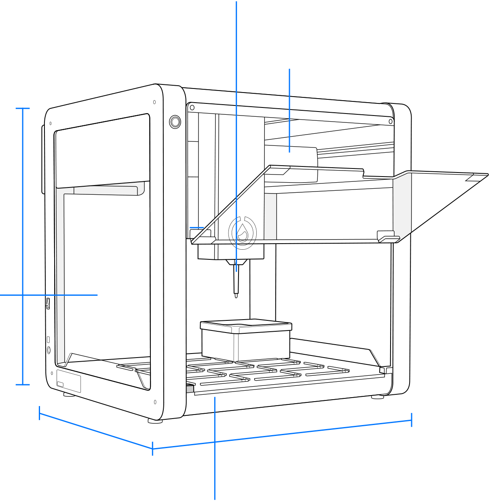{width="4.208333333333333in"
height="4.305555555555555in"}

Product Elements

> 2 interchangeable\
> pipette heads
>
> 0.1mm resolution xyz gantry\
> OT-2
>
> Polycarbonate\
> enclosure
>
> 66CM/26IN
>
> 57CM/22.5IN 63CM/25IN

Easily removable deck

**Serial Number**\
The OT-2 serial number indicates its date\
of manufacture, in the following format:\
OT2XXXYYYYMMDDXXX

5

Product Elements

11 deck slots

+---------+---------+---------+---------+---------+---------+---------+
|   -     |         |         |         |   ----  |         |         |
| - -- -- |         |         |         |         |         |         |
|         |         |         |         |   ----  |         |         |
|         |         |         |         |         |         |         |
|         |         |         |         |         |         |         |
|         |         |         |         |         |         |         |
|         |         |         |         |         |         |         |
|         |         |         |         |         |         |         |
|         |         |         |         |         |         |         |
|         |         |         |         |         |         |         |
|   -     |         |         |         |         |         |         |
| - -- -- |         |         |         |         |         |         |
|         |         |         |         |         |         |         |
| > ![]   |         |         |         |         |         |         |
| (vertop |         |         |         |         |         |         |
| al_48f2 |         |         |         |         |         |         |
| feb7ef2 |         |         |         |         |         |         |
| e4816bd |         |         |         |         |         |         |
| f534a0c |         |         |         |         |         |         |
| 3d5674e |         |         |         |         |         |         |
| /media/ |         |         |         |         |         |         |
| image2. |         |         |         |         |         |         |
| png){wi |         |         |         |         |         |         |
| dth="6. |         |         |         |         |         |         |
| 9444444 |         |         |         |         |         |         |
| 4444444 |         |         |         |         |         |         |
| 5e-2in" |         |         |         |         |         |         |
| > he    |         |         |         |         |         |         |
| ight="0 |         |         |         |         |         |         |
| .555555 |         |         |         |         |         |         |
| 5555555 |         |         |         |         |         |         |
| 556in"} |         |         |         |         |         |         |
| > {w |         |         |         |         |         |         |
| idth="0 |         |         |         |         |         |         |
| .180555 |         |         |         |         |         |         |
| 5555555 |         |         |         |         |         |         |
| 5555in" |         |         |         |         |         |         |
| > heig  |         |         |         |         |         |         |
| ht="0.2 |         |         |         |         |         |         |
| 3611111 |         |         |         |         |         |         |
| 1111111 |         |         |         |         |         |         |
| 1in"}{w |         |         |         |         |         |         |
| idth="0 |         |         |         |         |         |         |
| .194444 |         |         |         |         |         |         |
| 4444444 |         |         |         |         |         |         |
| 4445in" |         |         |         |         |         |         |
| > he    |         |         |         |         |         |         |
| ight="0 |         |         |         |         |         |         |
| .263888 |         |         |         |         |         |         |
| 8888888 |         |         |         |         |         |         |
| 889in"} |         |         |         |         |         |         |
| > ![]   |         |         |         |         |         |         |
| (vertop |         |         |         |         |         |         |
| al_48f2 |         |         |         |         |         |         |
| feb7ef2 |         |         |         |         |         |         |
| e4816bd |         |         |         |         |         |         |
| f534a0c |         |         |         |         |         |         |
| 3d5674e |         |         |         |         |         |         |
| /media/ |         |         |         |         |         |         |
| image5. |         |         |         |         |         |         |
| png){wi |         |         |         |         |         |         |
| dth="6. |         |         |         |         |         |         |
| 9444444 |         |         |         |         |         |         |
| 4444444 |         |         |         |         |         |         |
| 5e-2in" |         |         |         |         |         |         |
| > he    |         |         |         |         |         |         |
| ight="0 |         |         |         |         |         |         |
| .555555 |         |         |         |         |         |         |
| 5555555 |         |         |         |         |         |         |
| 556in"} |         |         |         |         |         |         |
| > {w |         |         |         |         |         |         |
| idth="0 |         |         |         |         |         |         |
| .180555 |         |         |         |         |         |         |
| 5555555 |         |         |         |         |         |         |
| 5555in" |         |         |         |         |         |         |
| > heig  |         |         |         |         |         |         |
| ht="0.2 |         |         |         |         |         |         |
| 3611111 |         |         |         |         |         |         |
| 1111111 |         |         |         |         |         |         |
| 1in"}{w |         |         |         |         |         |         |
| idth="0 |         |         |         |         |         |         |
| .180555 |         |         |         |         |         |         |
| 5555555 |         |         |         |         |         |         |
| 5555in" |         |         |         |         |         |         |
| > he    |         |         |         |         |         |         |
| ight="0 |         |         |         |         |         |         |
| .236111 |         |         |         |         |         |         |
| 1111111 |         |         |         |         |         |         |
| 111in"} |         |         |         |         |         |         |
+=========+=========+=========+=========+=========+=========+=========+
| !       |         | > !     |         |   -- -- |         |         |
| [](vert |         | [](vert |         |         |         |         |
| opal_48 |         | opal_48 |         |   -- -- |         |         |
| f2feb7e |         | f2feb7e |         |         |         |         |
| f2e4816 |         | f2e4816 |         |         |         |         |
| bdf534a |         | bdf534a |         |         |         |         |
| 0c3d567 |         | 0c3d567 |         |         |         |         |
| 4e/medi |         | 4e/medi |         |         |         |         |
| a/image |         | a/image |         |         |         |         |
| 8.png){ |         | 9.png){ |         |         |         |         |
| width=" |         | width=" |         |         |         |         |
| 0.86111 |         | 0.86111 |         |         |         |         |
| 1111111 |         | 1111111 |         |         |         |         |
| 1112in" |         | 1112in" |         |         |         |         |
| heig    |         | > heig  |         |         |         |         |
| ht="6.9 |         | ht="6.9 |         |         |         |         |
| 4444444 |         | 4444444 |         |         |         |         |
| 4444445 |         | 4444445 |         |         |         |         |
| e-2in"} |         | e-2in"} |         |         |         |         |
+---------+---------+---------+---------+---------+---------+---------+
| {wi | .png){w | png){wi | .png){w | png){wi | .png){w | png){wi |
| dth="6. | idth="0 | dth="6. | idth="0 | dth="8. | idth="0 | dth="8. |
| 9444444 | .180555 | 9444444 | .194444 | 3333333 | .194444 | 3333333 |
| 4444444 | 5555555 | 4444444 | 4444444 | 3333333 | 4444444 | 3333333 |
| 5e-2in" | 5555in" | 5e-2in" | 4445in" | 3e-2in" | 4445in" | 3e-2in" |
| he      | he      | > he    | he      | > he    | he      | > he    |
| ight="0 | ight="0 | ight="0 | ight="0 | ight="0 | ight="0 | ight="0 |
| .555555 | .25in"} | .555555 | .25in"} | .555555 | .25in"} | .555555 |
| 5555555 |         | 5555555 |         | 5555555 |         | 5555555 |
| 556in"} |         | 556in"} |         | 556in"} |         | 556in"} |
+---------+---------+---------+---------+---------+---------+---------+
| { |         | 8.png){ |         | 9.png){ |         |         |
| width=" |         | width=" |         | width=" |         |         |
| 0.86111 |         | 0.86111 |         | 0.86111 |         |         |
| 1111111 |         | 1111111 |         | 1111111 |         |         |
| 1112in" |         | 1112in" |         | 1112in" |         |         |
| heig    |         | > heig  |         | > heig  |         |         |
| ht="6.9 |         | ht="6.9 |         | ht="6.9 |         |         |
| 4444444 |         | 4444444 |         | 4444444 |         |         |
| 4444445 |         | 4444445 |         | 4444445 |         |         |
| e-2in"} |         | e-2in"} |         | e-2in"} |         |         |
+---------+---------+---------+---------+---------+---------+---------+
| {wi | .png){w | png){wi | .png){w | png){wi | .png){w | png){wi |
| dth="6. | idth="0 | dth="6. | idth="0 | dth="8. | idth="0 | dth="8. |
| 9444444 | .194444 | 9444444 | .180555 | 3333333 | .194444 | 3333333 |
| 4444444 | 4444444 | 4444444 | 5555555 | 3333333 | 4444444 | 3333333 |
| 5e-2in" | 4445in" | 5e-2in" | 5555in" | 3e-2in" | 4445in" | 3e-2in" |
| he      | he      | > he    | he      | > he    | he      | > he    |
| ight="0 | ight="0 | ight="0 | ight="0 | ight="0 | ight="0 | ight="0 |
| .555555 | .236111 | .555555 | .25in"} | .555555 | .25in"} | .555555 |
| 5555555 | 1111111 | 5555555 |         | 5555555 |         | 5555555 |
| 556in"} | 111in"} | 556in"} |         | 556in"} |         | 556in"} |
+---------+---------+---------+---------+---------+---------+---------+
| { |         | 8.png){ |         | 9.png){ |         |         |
| width=" |         | width=" |         | width=" |         |         |
| 0.86111 |         | 0.86111 |         | 0.86111 |         |         |
| 1111111 |         | 1111111 |         | 1111111 |         |         |
| 1112in" |         | 1112in" |         | 1112in" |         |         |
| heig    |         | > heig  |         | > heig  |         |         |
| ht="6.9 |         | ht="6.9 |         | ht="6.9 |         |         |
| 4444444 |         | 4444444 |         | 4444444 |         |         |
| 4444445 |         | 4444445 |         | 4444445 |         |         |
| e-2in"} |         | e-2in"} |         | e-2in"} |         |         |
+---------+---------+---------+---------+---------+---------+---------+
| > {wi |         |         |         |         |         |         |
| dth="6. |         |         |         |         |         |         |
| 9444444 |         |         |         |         |         |         |
| 4444444 |         |         |         |         |         |         |
| 5e-2in" |         |         |         |         |         |         |
| > he    |         |         |         |         |         |         |
| ight="0 |         |         |         |         |         |         |
| .541666 |         |         |         |         |         |         |
| 6666666 |         |         |         |         |         |         |
| 666in"} |         |         |         |         |         |         |
| > ![]   |         |         |         |         |         |         |
| (vertop |         |         |         |         |         |         |
| al_48f2 |         |         |         |         |         |         |
| feb7ef2 |         |         |         |         |         |         |
| e4816bd |         |         |         |         |         |         |
| f534a0c |         |         |         |         |         |         |
| 3d5674e |         |         |         |         |         |         |
| /media/ |         |         |         |         |         |         |
| image31 |         |         |         |         |         |         |
| .png){w |         |         |         |         |         |         |
| idth="0 |         |         |         |         |         |         |
| .166666 |         |         |         |         |         |         |
| 6666666 |         |         |         |         |         |         |
| 6666in" |         |         |         |         |         |         |
| > he    |         |         |         |         |         |         |
| ight="0 |         |         |         |         |         |         |
| .25in"} |         |         |         |         |         |         |
| > {wi |         |         |         |         |         |         |
| dth="6. |         |         |         |         |         |         |
| 9444444 |         |         |         |         |         |         |
| 4444444 |         |         |         |         |         |         |
| 5e-2in" |         |         |         |         |         |         |
| > he    |         |         |         |         |         |         |
| ight="0 |         |         |         |         |         |         |
| .541666 |         |         |         |         |         |         |
| 6666666 |         |         |         |         |         |         |
| 666in"} |         |         |         |         |         |         |
| > ![]   |         |         |         |         |         |         |
| (vertop |         |         |         |         |         |         |
| al_48f2 |         |         |         |         |         |         |
| feb7ef2 |         |         |         |         |         |         |
| e4816bd |         |         |         |         |         |         |
| f534a0c |         |         |         |         |         |         |
| 3d5674e |         |         |         |         |         |         |
| /media/ |         |         |         |         |         |         |
| image33 |         |         |         |         |         |         |
| .png){w |         |         |         |         |         |         |
| idth="0 |         |         |         |         |         |         |
| .180555 |         |         |         |         |         |         |
| 5555555 |         |         |         |         |         |         |
| 5555in" |         |         |         |         |         |         |
| > he    |         |         |         |         |         |         |
| ight="0 |         |         |         |         |         |         |
| .25in"} |         |         |         |         |         |         |
| > {wi |         |         |         |         |         |         |
| dth="8. |         |         |         |         |         |         |
| 3333333 |         |         |         |         |         |         |
| 3333333 |         |         |         |         |         |         |
| 3e-2in" |         |         |         |         |         |         |
| > he    |         |         |         |         |         |         |
| ight="0 |         |         |         |         |         |         |
| .541666 |         |         |         |         |         |         |
| 6666666 |         |         |         |         |         |         |
| 666in"} |         |         |         |         |         |         |
| > ![]   |         |         |         |         |         |         |
| (vertop |         |         |         |         |         |         |
| al_48f2 |         |         |         |         |         |         |
| feb7ef2 |         |         |         |         |         |         |
| e4816bd |         |         |         |         |         |         |
| f534a0c |         |         |         |         |         |         |
| 3d5674e |         |         |         |         |         |         |
| /media/ |         |         |         |         |         |         |
| image35 |         |         |         |         |         |         |
| .png){w |         |         |         |         |         |         |
| idth="0 |         |         |         |         |         |         |
| .166666 |         |         |         |         |         |         |
| 6666666 |         |         |         |         |         |         |
| 6666in" |         |         |         |         |         |         |
| > he    |         |         |         |         |         |         |
| ight="0 |         |         |         |         |         |         |
| .25in"} |         |         |         |         |         |         |
| > {wi |         |         |         |         |         |         |
| dth="8. |         |         |         |         |         |         |
| 3333333 |         |         |         |         |         |         |
| 3333333 |         |         |         |         |         |         |
| 3e-2in" |         |         |         |         |         |         |
| > he    |         |         |         |         |         |         |
| ight="0 |         |         |         |         |         |         |
| .541666 |         |         |         |         |         |         |
| 6666666 |         |         |         |         |         |         |
| 666in"} |         |         |         |         |         |         |
|         |         |         |         |         |         |         |
|   --    |         |         |         |         |         |         |
| ------- |         |         |         |         |         |         |
| ------- |         |         |         |         |         |         |
| ------- |         |         |         |         |         |         |
| ------- |         |         |         |         |         |         |
| ------- |         |         |         |         |         |         |
| ------- |         |         |         |         |         |         |
| ------- |         |         |         |         |         |         |
| ------- |         |         |         |         |         |         |
| ------- |         |         |         |         |         |         |
| ------- |         |         |         |         |         |         |
| ------- |         |         |         |         |         |         |
| ------- |         |         |         |         |         |         |
| ------- |         |         |         |         |         |         |
| ------- |         |         |         |         |         |         |
| ------- |         |         |         |         |         |         |
| ------- |         |         |         |         |         |         |
| ------- |         |         |         |         |         |         |
| ------- |         |         |         |         |         |         |
| ------- |         |         |         |         |         |         |
| ------- |         |         |         |         |         |         |
| ------- |         |         |         |         |         |         |
| ------- |         |         |         |         |         |         |
| ------- |         |         |         |         |         |         |
| ------- |         |         |         |         |         |         |
| ------- |         |         |         |         |         |         |
| ------- |         |         |         |         |         |         |
| ------- |         |         |         |         |         |         |
| ------- |         |         |         |         |         |         |
| ------- |         |         |         |         |         |         |
|         |         |         |         |         |         |         |
|         |         |         |         |         |         |         |
|         |         |         |         |         |         |         |
|         |         |         |         |         |         |         |
|         |         |         |         |         |         |         |
|         |         |         |         |         |         |         |
|         |         |         |         |         |         |         |
|         |         |         |         |         |         |         |
|         |         |         |         |         |         |         |
|         |         |         |         |         |         |         |
|         |         |         |         |         |         |         |
|         |         |         |         |         |         |         |
|         |         |         |         |         |         |         |
|         |         |         |         |         |         |         |
|         |         |         |         |         |         |         |
|         |         |         |         |         |         |         |
|    {wi |         |         |         |         |         |         |
| dth="6. |         |         |         |         |         |         |
| 9444444 |         |         |         |         |         |         |
| 4444444 |         |         |         |         |         |         |
| 5e-2in" |         |         |         |         |         |         |
|         |         |         |         |         |         |         |
|         |         |         |         |         |         |         |
|         |         |         |         |         |         |         |
|         |         |         |         |         |         |         |
|         |         |         |         |         |         |         |
|         |         |         |         |         |         |         |
|         |         |         |         |         |         |         |
|         |         |         |         |         |         |         |
|         |         |         |         |         |         |         |
|         |         |         |         |         |         |         |
|         |         |         |         |         |         |         |
|         |         |         |         |         |         |         |
|         |         |         |         |         |         |         |
|         |         |         |         |         |         |         |
|         |         |         |         |         |         |         |
|         |         |         |         |         |         |         |
|   heigh |         |         |         |         |         |         |
| t="4.16 |         |         |         |         |         |         |
| 6666666 |         |         |         |         |         |         |
| 6666664 |         |         |         |         |         |         |
| e-2in"} |         |         |         |         |         |         |
|   --    |         |         |         |         |         |         |
|  -- --- |         |         |         |         |         |         |
| ------- |         |         |         |         |         |         |
| ------- |         |         |         |         |         |         |
| ------- |         |         |         |         |         |         |
| ------- |         |         |         |         |         |         |
| ------- |         |         |         |         |         |         |
| ------- |         |         |         |         |         |         |
| ------- |         |         |         |         |         |         |
| ------- |         |         |         |         |         |         |
| ------- |         |         |         |         |         |         |
| ------- |         |         |         |         |         |         |
| ------- |         |         |         |         |         |         |
| ------- |         |         |         |         |         |         |
| ------- |         |         |         |         |         |         |
| - -- -- |         |         |         |         |         |         |
|  ------ |         |         |         |         |         |         |
| ------- |         |         |         |         |         |         |
| ------- |         |         |         |         |         |         |
| ------- |         |         |         |         |         |         |
| ------- |         |         |         |         |         |         |
| ------- |         |         |         |         |         |         |
| ------- |         |         |         |         |         |         |
| ------- |         |         |         |         |         |         |
| ------- |         |         |         |         |         |         |
| ------- |         |         |         |         |         |         |
| ------- |         |         |         |         |         |         |
| ------- |         |         |         |         |         |         |
| ------- |         |         |         |         |         |         |
| ------- |         |         |         |         |         |         |
|         |         |         |         |         |         |         |
|         |         |         |         |         |         |         |
|         |         |         |         |         |         |         |
|         |         |         |         |         |         |         |
|         |         |         |         |         |         |         |
|         |         |         |         |         |         |         |
|         |         |         |         |         |         |         |
|         |         |         |         |         |         |         |
|         |         |         |         |         |         |         |
|         |         |         |         |         |         |         |
|         |         |         |         |         |         |         |
|         |         |         |         |         |         |         |
|         |         |         |         |         |         |         |
|         |         |         |         |         |         |         |
|         |         |         |         |         |         |         |
|         |         |         |         |         |         |         |
|         |         |         |         |         |         |         |
|         |         |         |         |         |         |         |
|    {wi |         |         |         |         |         |         |
| dth="0. |         |         |         |         |         |         |
| 7777777 |         |         |         |         |         |         |
| 7777777 |         |         |         |         |         |         |
| 78in"   |         |         |         |         |         |         |
|         |         |         |         |         |         |         |
|         |         |         |         |         |         |         |
|    heig |         |         |         |         |         |         |
| ht="0.2 |         |         |         |         |         |         |
| 3611111 |         |         |         |         |         |         |
| 1111111 |         |         |         |         |         |         |
| 1in"}   |         |         |         |         |         |         |
|         |         |         |         |         |         |         |
|         |         |         |         |         |         |         |
|         |         |         |         |         |         |         |
|         |         |         |         |         |         |         |
|         |         |         |         |         |         |         |
|         |         |         |         |         |         |         |
|         |         |         |         |         |         |         |
|         |         |         |         |         |         |         |
|         |         |         |         |         |         |         |
|         |         |         |         |         |         |         |
|         |         |         |         |         |         |         |
|         |         |         |         |         |         |         |
|    DECK |         |         |         |         |         |         |
|  OUTLIN |         |         |         |         |         |         |
| E       |         |         |         |         |         |         |
|         |         |         |         |         |         |         |
|         |         |         |         |         |         |         |
|         |         |         |         |         |         |         |
|         |         |         |         |         |         |         |
|         |         |         |         |         |         |         |
|         |         |         |         |         |         |         |
|         |         |         |         |         |         |         |
|         |         |         |         |         |         |         |
|         |         |         |         |         |         |         |
|         |         |         |         |         |         |         |
|         |         |         |         |         |         |         |
|         |         |         |         |         |         |         |
|   --    |         |         |         |         |         |         |
| ------- |         |         |         |         |         |         |
| ------- |         |         |         |         |         |         |
| ------- |         |         |         |         |         |         |
| ------- |         |         |         |         |         |         |
| ------- |         |         |         |         |         |         |
| ------- |         |         |         |         |         |         |
| ------- |         |         |         |         |         |         |
| ------- |         |         |         |         |         |         |
| ------- |         |         |         |         |         |         |
| ------- |         |         |         |         |         |         |
| ------- |         |         |         |         |         |         |
| ------- |         |         |         |         |         |         |
| ------- |         |         |         |         |         |         |
| ------- |         |         |         |         |         |         |
| ------- |         |         |         |         |         |         |
| ------- |         |         |         |         |         |         |
| ------- |         |         |         |         |         |         |
| ------- |         |         |         |         |         |         |
| ------- |         |         |         |         |         |         |
| ------- |         |         |         |         |         |         |
| ------- |         |         |         |         |         |         |
| ------- |         |         |         |         |         |         |
| ------- |         |         |         |         |         |         |
| ------- |         |         |         |         |         |         |
| ------- |         |         |         |         |         |         |
| ------- |         |         |         |         |         |         |
| ------- |         |         |         |         |         |         |
| ------- |         |         |         |         |         |         |
| ------- |         |         |         |         |         |         |
+---------+---------+---------+---------+---------+---------+---------+

> Adapters allow for existing hardware to fit on deck

Modules snap into place

> Deck slots are compatible with standard SBS\
> dimensions. Deck also includes a removable trash bin.
>
> OT-2 MANUAL

Instructions for

Unboxing and Use

+-----------------------------------------------------------------------+
| > To get started quickly, visit our online resources and follow the   |
| > step by step instructions to help you go from unboxing your robot   |
| > to running your first protocol.                                     |
| >                                                                     |
| > Visit for more information.                                         |
+=======================================================================+
+-----------------------------------------------------------------------+

> INCLUDED BOX CONTENTS / PARTS & ACCESSORIES
>
> ◾ (1) OT-2
>
> ◾ (3) Window Covers
>
> ◾ (2) Side Window Covers
>
> ◾ (1) Rear Window Cover
>
> ◾ (1) Power Supply (36V/6A)
>
> ◾ (1) Regional IEC Power Cable
>
> ◾ (1) Ethernet Cable
>
> ◾ (1) Ethernet-to-USB Dongle (connects the OT-2 to a laptop)
>
> ◾ (1) Toolkit
>
> ◾ Hand Screwdriver (2.5mm)
>
> ◾ 14mm Wrench
>
> ◾ Torx Key (T10)
>
> ◾ Hex Key Set (1.5mm, 2mm, 2.5mm, 3mm)
>
> ◾ Super Lube (silicone-based lubricant)
>
> ◾ (2) M3 Hex Nut
>
> ◾ (2) M4 Square Nut
>
> ◾ Window Screws
>
> ◾ (4) M4x12mm low profile socket screw, M4 thick washer,

and rubber O-ring

> ◾ Pipette Screws
>
> ◾ (4) M3x6mm Socket Head Screws (2 are spares)
>
> ◾ (1) Trash Bin
>
> ◾ (1) Calibration Block
>
> ◾ (1) Top Window

7

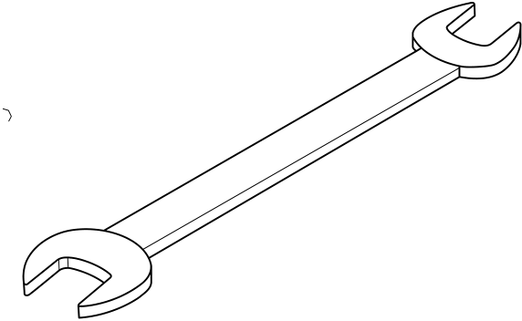{width="1.9861111111111112in"
height="1.2222222222222223in"}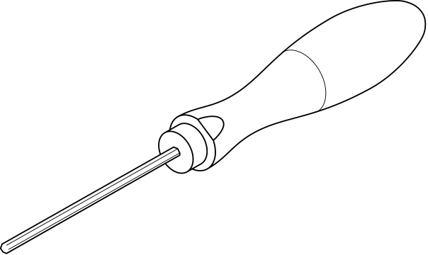{width="2.0972222222222223in"
height="1.25in"}

> Instructions for\
> Unboxing and Use
>
> 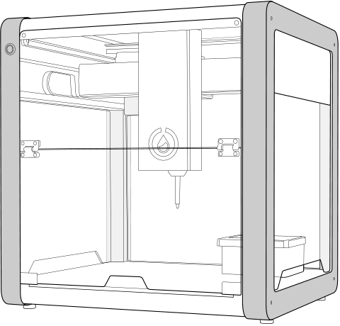{width="1.6666666666666667in"
> height="1.5972222222222223in"}
>
> **(1) OT-2**
>
> 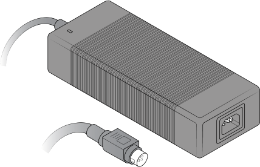{width="1.4861111111111112in"
> height="0.9583333333333334in"}

**(1) Power Supply (36V/6A)**

> 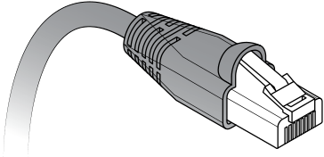{width="1.2638888888888888in"
> height="0.6111111111111112in"}
>
> **(1) Ethernet Cable**
>
> **(1) Hand Screwdriver** **(2.5mm)**
>
> OT-2 MANUAL
>
> 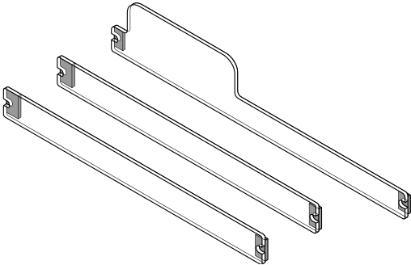{width="1.7638888888888888in"
> height="1.1388888888888888in"}
>
> **(3) Window Covers**\
> **(2 side window covers, 1 rear window cover)**

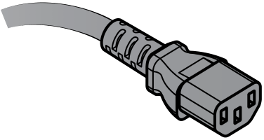{width="1.3055555555555556in"
height="0.6944444444444444in"}

> **(1) Regional IEC Power Cable**

**(1) Ethernet-to-USB dongle**

> 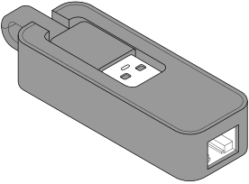{width="0.9583333333333334in"
> height="0.7083333333333334in"}**laptop)**\
> **(Connects the OT-2 to a**

**(1) 14mm Wrench**

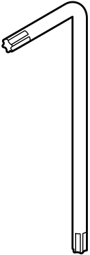{width="0.4583333333333333in"
height="1.2916666666666667in"}

**(1) Torx Key (T10)**

> **(1) Super
> Lube**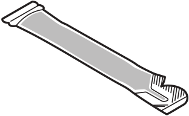{width="1.0833333333333333in"
> height="0.6666666666666666in"}

+-----------------------------------+-----------------------------------+
| >  Hex Key Set**\            |
| 16bdf534a0c3d5674e/media/image49. | > **(1.5mm, 2mm, 2.5mm, 3mm)**    |
| png){width="1.1805555555555556in" |                                   |
| > height="2.125in"}               |                                   |
+===================================+===================================+
+-----------------------------------+-----------------------------------+

**(2) M3 Hex Nut**

+-----------------------------------+-----------------------------------+
| > **(silicone-based lubricant)**  | {width="0.5972222222222222in" |
|                                   | height="0.2916666666666667in"}    |
+===================================+===================================+
+-----------------------------------+-----------------------------------+

**(2) M4 Square Nut**

> 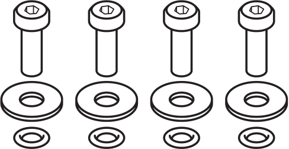{width="1.6944444444444444in"
> height="0.875in"}
>
> **(4) Window Screws**\
> **(M4x12mm low profile socket screw, M4 thick washer, and rubber
> O-ring)**
>
> 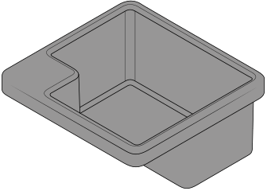{width="1.1666666666666667in"
> height="0.8333333333333334in"}
>
> **(1) Trash Bin**
>
> 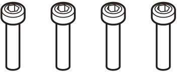{width="1.2222222222222223in"
> height="0.5in"}
>
> **(4) Pipette Screws**\
> **(M3x6mm socket head screws, 2 are spares)**
>
> 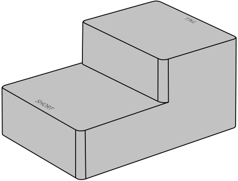{width="1.6944444444444444in"
> height="1.2916666666666667in"}
>
> **(1) Calibration Block**

REQUIRED FOR OPERATION

> ◾ A computer (self-provided)
>
> ◾ An open-end wrench (included)
>
> ◾ Space larger than 625mm x 570mm x 680mm

OT-2 MANUAL

{width="0.25in"
height="0.2638888888888889in"}{width="0.2638888888888889in"
height="0.2638888888888889in"}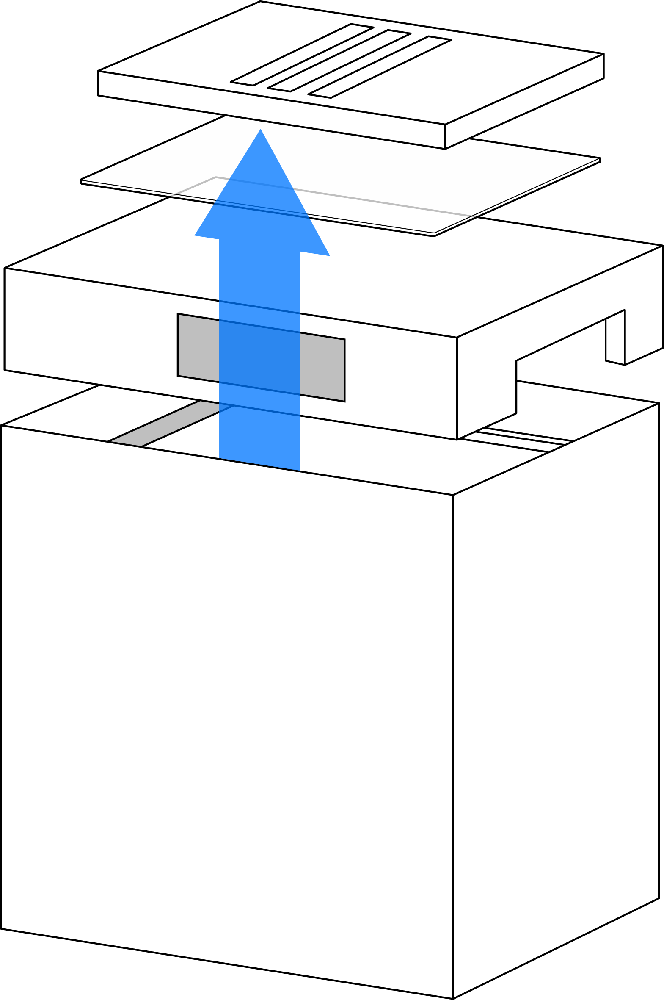{width="1.6611111111111112in"
height="2.499607392825897in"}{width="0.3333333333333333in"
height="0.1388888888888889in"}{width="5.555555555555555e-2in"
height="0.125in"}{width="4.1666666666666664e-2in"
height="4.1666666666666664e-2in"}{width="4.1666666666666664e-2in"
height="4.1666666666666664e-2in"}{width="4.1666666666666664e-2in"
height="4.1666666666666664e-2in"}{width="4.1666666666666664e-2in"
height="4.1666666666666664e-2in"}{width="4.1666666666666664e-2in"
height="4.1666666666666664e-2in"}{width="4.1666666666666664e-2in"
height="4.1666666666666664e-2in"}{width="4.1666666666666664e-2in"
height="4.1666666666666664e-2in"}{width="4.1666666666666664e-2in"
height="4.1666666666666664e-2in"}{width="4.1666666666666664e-2in"
height="4.1666666666666664e-2in"}{width="4.1666666666666664e-2in"
height="4.1666666666666664e-2in"}{width="4.1666666666666664e-2in"
height="4.1666666666666664e-2in"}{width="4.1666666666666664e-2in"
height="4.1666666666666664e-2in"}{width="4.1666666666666664e-2in"
height="4.1666666666666664e-2in"}{width="4.1666666666666664e-2in"
height="4.1666666666666664e-2in"}{width="4.1666666666666664e-2in"
height="4.1666666666666664e-2in"}{width="4.1666666666666664e-2in"
height="4.1666666666666664e-2in"}{width="4.1666666666666664e-2in"
height="4.1666666666666664e-2in"}{width="4.1666666666666664e-2in"
height="4.1666666666666664e-2in"}{width="4.1666666666666664e-2in"
height="4.1666666666666664e-2in"}{width="4.1666666666666664e-2in"
height="4.1666666666666664e-2in"}{width="4.1666666666666664e-2in"
height="4.1666666666666664e-2in"}{width="4.1666666666666664e-2in"
height="4.1666666666666664e-2in"}

Instructions

> MACHINE SETUP
>
> 1 **Remove the top foam and window and top covers. Remove the power
> cable box from the foam, if present.**
>
> 2 **Carefully cut open the plastic VCI bag. Be sure to avoid cutting
> any machine components inside.**

+-----------------------------------+-----------------------------------+
| > {width="2.5833333333333335in" |                                   |
| > height="2.8472222222222223in"}  |                                   |
+===================================+===================================+
+-----------------------------------+-----------------------------------+

{width="0.25in"
height="0.2638888888888889in"}{width="0.25in"
height="0.2638888888888889in"}

Instructions\
3 **The machine requires two people for lifting out of**

**the packaging (the machine weighs over 40kg).**

> {width="2.013888888888889in"
> height="2.0694444444444446in"}
> {width="0.8055555555555556in"
> height="0.6805555555555556in"}
>
> 4 **Pull upwards using the black steel frame.**

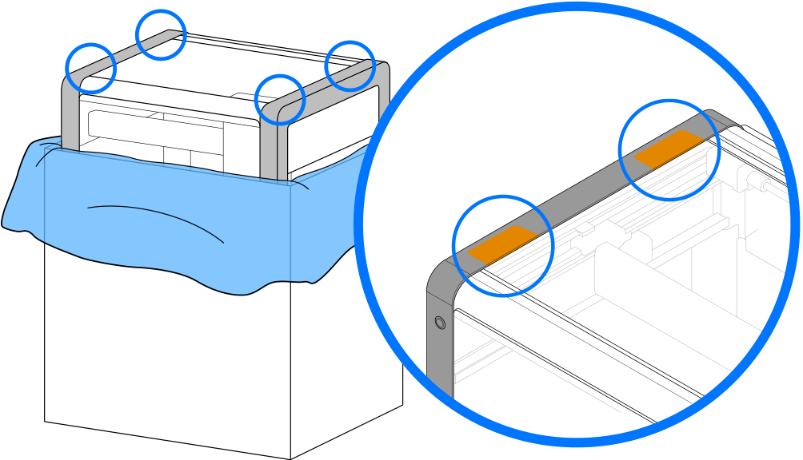{width="3.486111111111111in"
height="2.0in"}

OT-2 MANUAL

{width="0.25in"
height="0.2638888888888889in"}{width="0.25in"
height="0.2638888888888889in"}

> 5 **Place the machine on a secure and stable surface.**
>
> 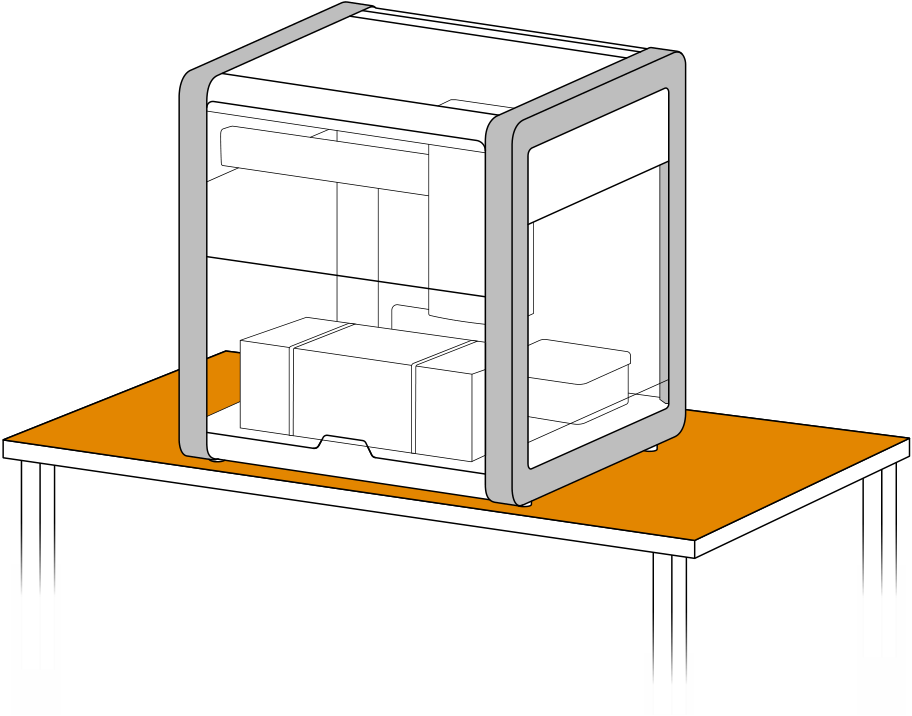{width="3.1666666666666665in"
> height="2.486111111111111in"}
>
> 6 **Cut the zip ties supporting the customer kit and**
>
> **place the kit aside.**
>
> 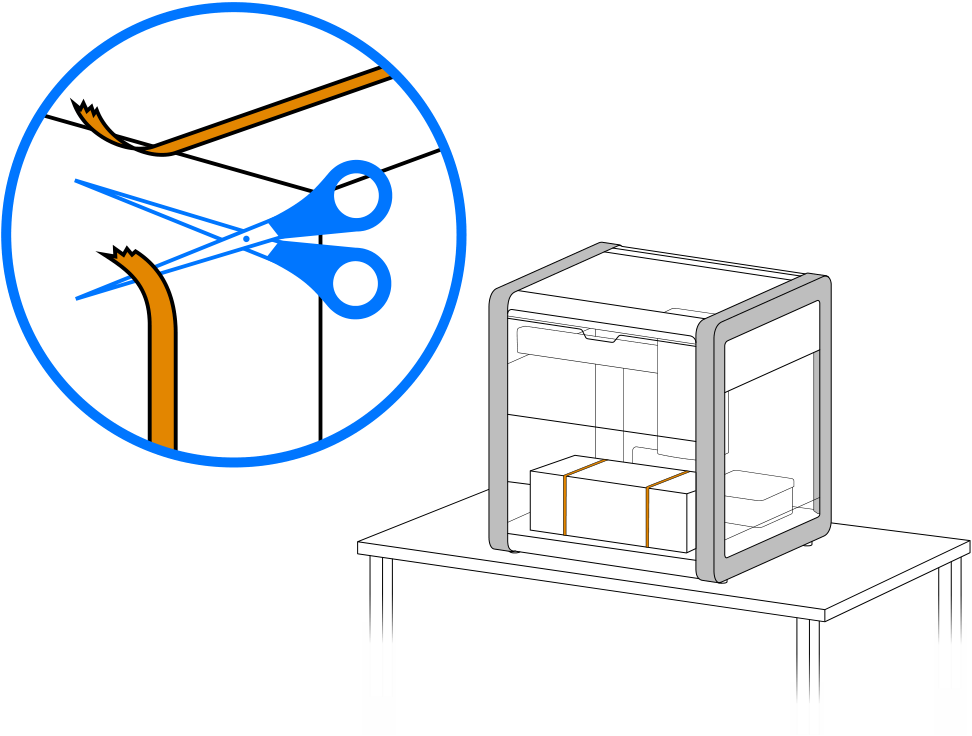{width="3.375in"
> height="2.5555555555555554in"}

13

{width="0.25in"
height="0.2638888888888889in"}{width="0.25in"
height="0.2638888888888889in"}

Instructions

> 8 7 **Pull the remaining zip tie ends and remove completely from**

**the deck.**

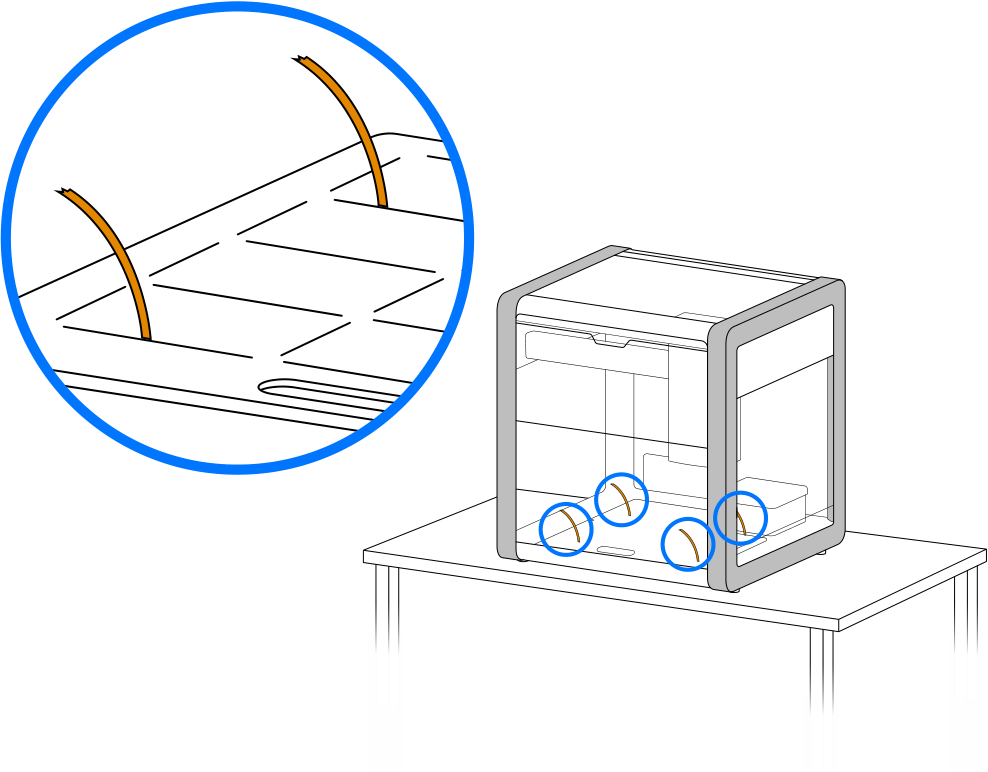{width="3.4305555555555554in"
height="2.6805555555555554in"}

> 8 8 **Remove tape from the calibration switch cover.**

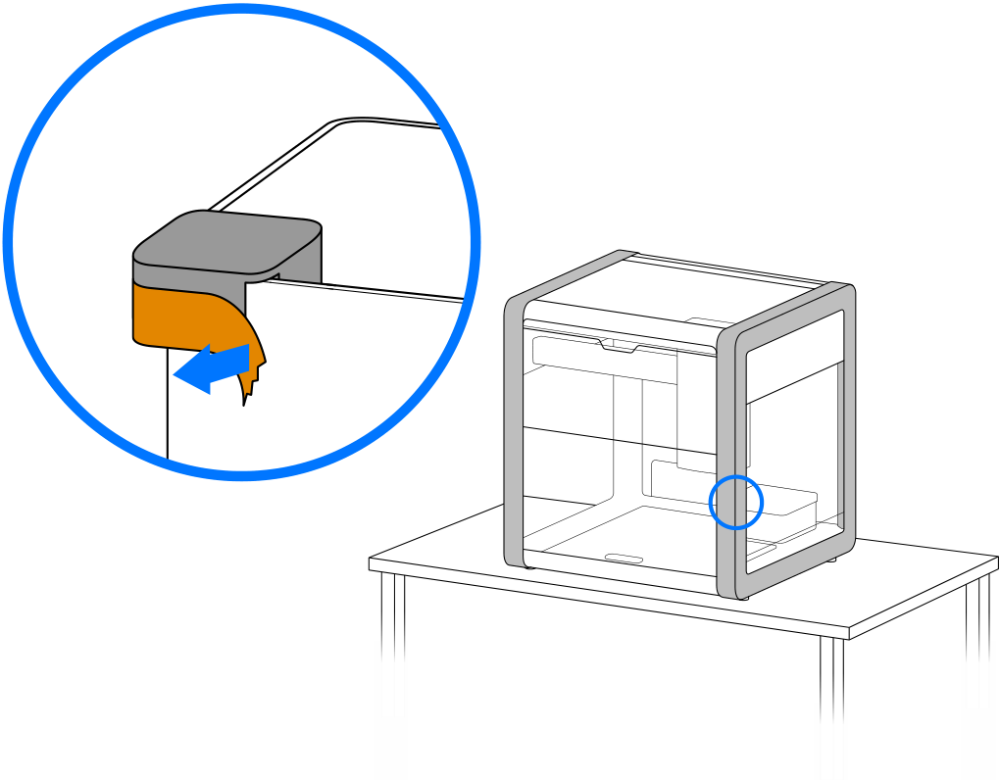{width="3.5416666666666665in"
height="2.763888888888889in"}

OT-2 MANUAL

{width="0.25in"
height="0.2638888888888889in"}{width="0.25in"
height="0.2638888888888889in"}

> 9 **Remove the plastic cover completely.**
>
> 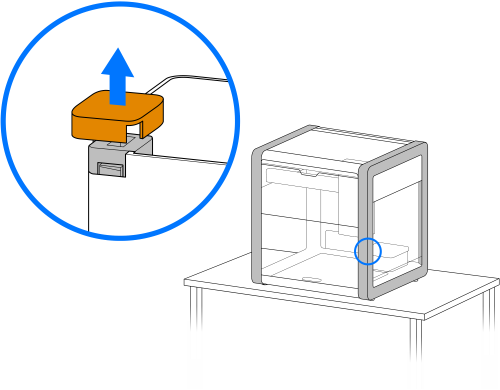{width="3.4722222222222223in"
> height="2.7083333333333335in"}
>
> 10 **Put the trash bin in place.**
>
> 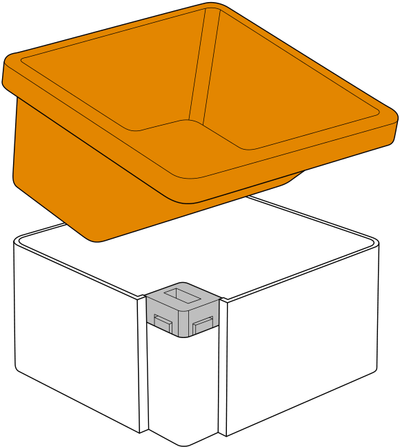{width="2.013888888888889in"
> height="2.25in"}

15

{width="0.25in"
height="0.2638888888888889in"}

Instructions

> 11 **Remove the 3 transport fasteners:**

**1**

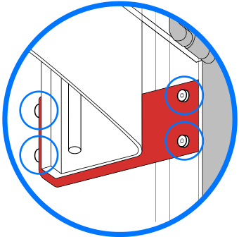{width="1.1805555555555556in"
height="1.1666666666666667in"}

**2**

**3**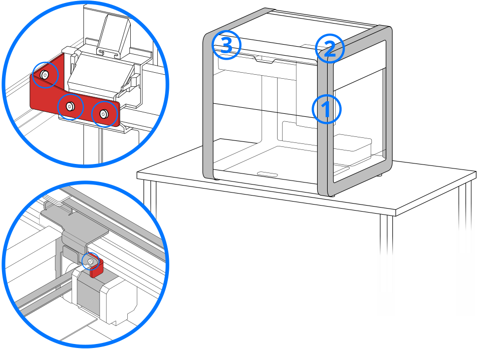{width="3.3055555555555554in"
height="2.4166666666666665in"}

> 1\. Unlock and remove the x-axis locking bracket (red) and 4x locking
> screws using the 3mm hex key
>
> 2\. Unlock and remove the z-axis locking bracket (red) and 4x locking
> screws using the 3mm hex key. Note that after removing the rear
> screws, one can move the z-stage further left by hand, allowing more
> room for removing the screw.
>
> 3\. Unlock and remove the y-axis locking bracket (red) and 1x locking
> screw using the 3mm hex key

OT-2 MANUAL

{width="0.25in"
height="0.2638888888888889in"}{width="0.25in"
height="0.2638888888888889in"}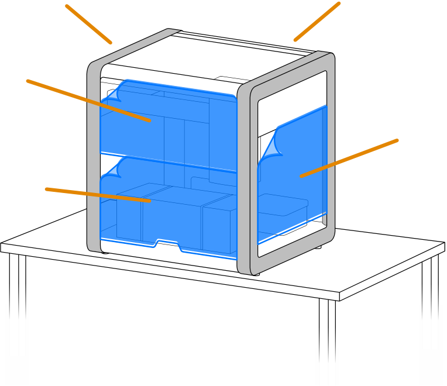{width="2.6527777777777777in"
height="2.2916666666666665in"}

+-----------------------+-----------------------+-----------------------+
| 12                    | > **Remove the film   |                       |
|                       | > used to protect the |                       |
| 13                    | > polycarbonate       |                       |
|                       | > sheets.**           |                       |
+=======================+=======================+=======================+
|                       | **3**                 | **4**                 |
+-----------------------+-----------------------+-----------------------+
|                       | > **2**\              | **5**                 |
|                       | > **1**               |                       |
+-----------------------+-----------------------+-----------------------+
|                       | **Install the top     |                       |
|                       | polycarbonate sheet   |                       |
|                       | and fasten the        |                       |
|                       | corner**              |                       |
+-----------------------+-----------------------+-----------------------+

> **screws using the 2.5mm hex screwdriver and 4x top window screws.**
>
> 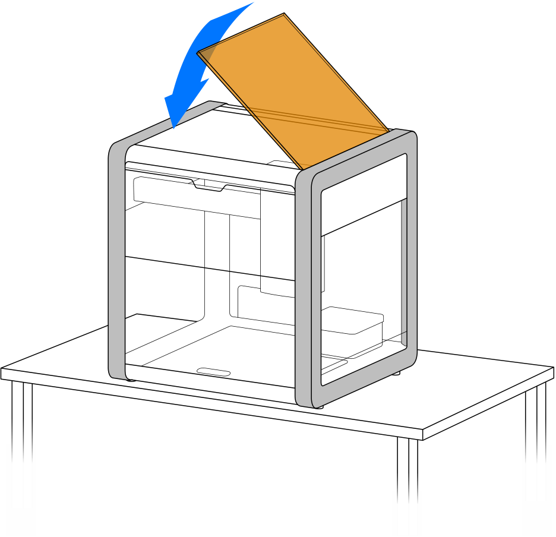{width="3.25in"
> height="3.138888888888889in"}

17

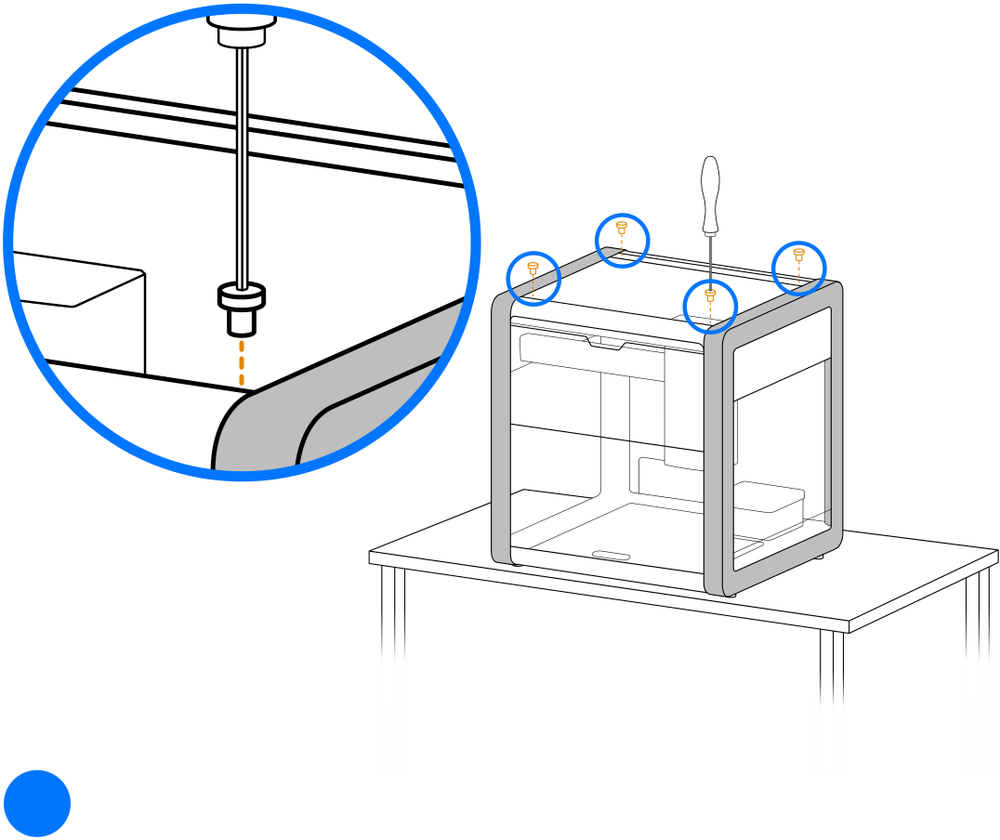{width="3.736111111111111in"
height="3.138888888888889in"}

Instructions

> 14 **Check the machine:**
>
> {width="0.125in"
> height="0.125in"} Confirm that 3 brackets have been removed, as
> powering on the robot with brackets may cause damage.
>
> {width="0.125in"
> height="0.125in"} Confirm that you are not missing any required cables
> or parts. If you are missing components, contact Customer Support.

+-----------------------------------+-----------------------------------+
|   ------------------------------  | > Visually check the deck and     |
|                                   | > windows; if there are any       |
|   ------------------------------  |                                   |
+===================================+===================================+
+-----------------------------------+-----------------------------------+

> significantly scratched, broken, or bent components, contact Customer
> Support.
>
> {width="0.125in"
> height="0.125in"} Visually check the gantry; if it is uneven or
> slanted, contact Customer Support.
>
> {width="0.125in"
> height="0.125in"} Move the pipette head in the x and y direction; if
> it makes any loud/abnormal noises or requires a large thrust to move,
> contact Customer Support.

OT-2 MANUAL

{width="0.25in"
height="0.25in"}{width="0.25in"
height="0.2638888888888889in"}

> 15 **Install window covers**
>
> 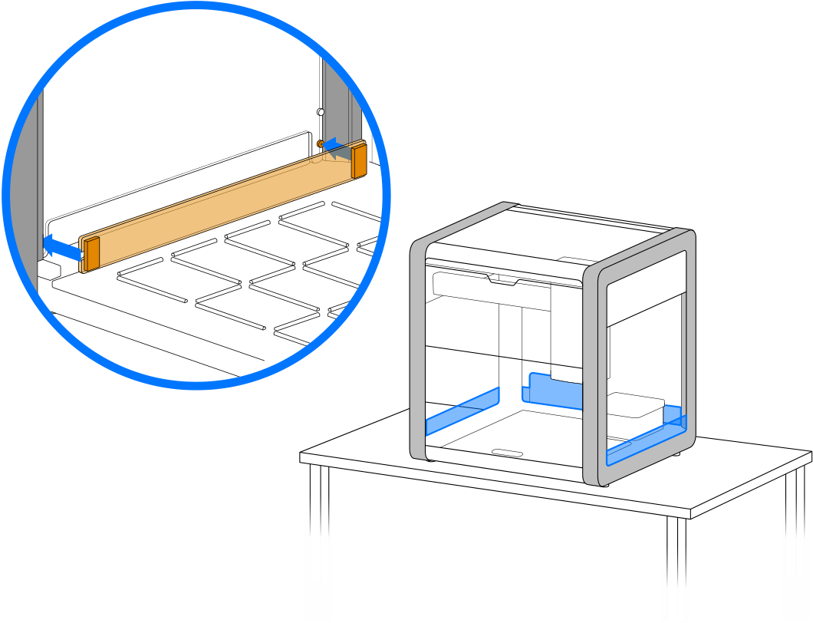{width="3.6805555555555554in"
> height="2.8194444444444446in"}
>
> 16 **Clean & sterilize robot**
>
> *Note: When cleaning and maintaining the machine, be sure*
>
> *to turn off the machine and disconnect the power before*
>
> *proceeding. Also pay attention to warning labels*

19

{width="0.25in"
height="0.2638888888888889in"}

Instructions

> 17 **Connect power source & USB/Ethernet cable**
>
> POWER AND CONNECTION\
> Connect Ethernet and connect the power cable.
>
> If your computer does not have Ethernet use the Ethernet-to-USB dongle
> provided.
>
> POWER REQUIREMENTS\
> 100-240 VAC / 50-60 Hz\
> 220 W max

CONNECTIVITY

Wi-Fi 2.4 GHz IEEE 802.11b/g/n, USB 2.0.

> 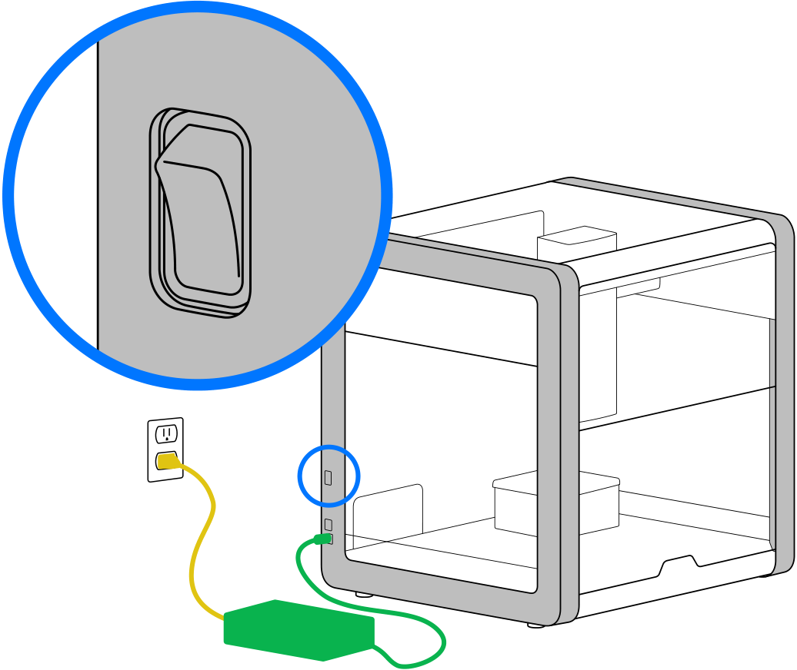{width="3.5972222222222223in"
> height="3.0277777777777777in"}

OT-2 MANUAL

{width="0.25in"
height="0.2638888888888889in"}

> 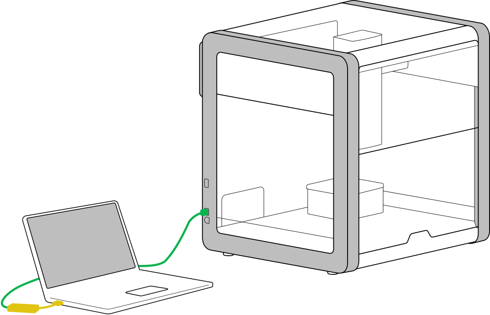{width="3.8472222222222223in"
> height="2.4722222222222223in"}
>
> 18 **Install the Opentrons App**\
> **Download from**
>
> MIN REQUIREMENTS\
> Windows 10, macOS 10.10 or later, Ubuntu 12.04 or later.
>
> **Congratulations! Now your OT-2 robot has been successfully unlocked
> and set up!**
>
> When everything is ready, power on the machine by pressing the power
> button and wait for about 45 seconds before the machine starts running
> and the x-, y-, and z-axes each return to the origin.
>
> Once the robot is turned on, follow instructions in the Opentrons App
> to connect to the OT-2, attach pipettes, and calibrate the robot.

21

> Online Resources
>
> Now that you have your robot connected, it's time to start using it!
>
> **For consumable materials visit opentrons.com where you find tips,
> labware, and reagents.**
>
> **Protocol Library -** The Protocol Library is home to our shared
> protocols.
>
> Cleaning and Maintenance
>
> CLEANING\
> The OT-2 can be cleaned and disinfected with alcohol, bleach, or any
> standard household cleaner using a rag or paper towel. Avoid contact
> with any electronics.
>
> The OT-2 is *not* a sterile environment. Add your own UV lights or the
> Opentrons HEPA Module.
>
> *Note: When cleaning and maintaining the machine, be sure to turn off
> the machine and disconnect the power before proceeding. Also pay
> attention to warning labels.*
>
> MAINTENANCE\
> Performing routine will ensure that your OT-2 is functioning optimally
> and can prolong its lifespan. You can also about Opentrons service
> plans.
>
> Support
>
> In case of any issues or questions, contact: . Please note your OT-2's
> serial number is located on the bottom right side of the machine.
>
> WARRANTY\
> One year warranty against manufacturer defects. Stress tested to last
> a minimum of 3 years of full-time use.

OT-2 MANUAL

Specs

> PIPETTE CONFIGURATIONS\
> Single and multi-channel pipetting. 2-pipette mounts, for a\
> configuration of 1 or 2 single or 8-channel pipettes. Pipettes are
> easily interchangeable.
>
> PIPETTE VOLUMES AND SPECS\
> **Single-Channel:** 1-1000 µl\
> **8-Channel:** 1-300 µl\
> **Whitepaper:**
>
> FRAME COMPOSITION\
> Rigid steel and CNC aluminum design
>
> OPERATING TEMPERATURE & RELATIVE HUMIDITY\
> Recommended 20-24°C. Recommended 40-60% RH.
>
> PLATE TYPE COMPATIBILITY\
> Use 96- or 384-well plates. Use 96-well plates for optimal deck
> compatibility & touch tips. Compatible with up to 384-well plates.
>
> Use common labware already in our Labware Library, or add your own. If
> your labware fits on the OT-2 but is not in the Labware Library, it
> can be added by you using our Labware Creator, or by our team.
>
> API COMPATIBILITY\
> Interfaces with any product that has an API. Opentrons software is
> open-source and users can make adjustments to the software as needed
> to interface with other products. While all integrations are possible,
> they require custom code work, i.e. most customers will need to write
> custom libraries and install software packages that aren't shipped
> with the robot.

23
