About Protocol Designer

> is a no-code, web-based tool for developing protocols that run on
> Opentrons robots, including the Flex and the OT-2. You can use
> Protocol Designer to create protocols that:
>
> Mix and transfer liquids, including advanced pipetting techniques
>
> Operate Opentrons modules
>
> Move labware around the deck, including on and off of modules
>
> Pause to verify progress or access your samples
>
> All protocol design takes place in your web browser. After creating
> and editing your protocol, you can export it as a JSON file and import
> it into the Opentrons App to run on the robot like any\
> other protocol.
>
> In your protocol, you'll define the hardware, labware, and liquids the
> robot will use during a procedure. This manual details how to use
> Protocol Designer to build a protocol that works for your application
> in four steps:

+-----------------------------------+-----------------------------------+
| > **Step**                        | > **Description**                 |
+===================================+===================================+
| > Protocol setup                  | > Specify your robot, pipettes,   |
|                                   | > modules, and                    |
+-----------------------------------+-----------------------------------+

other hardware (like the gripper)

Protocol overview

> Information about your protocol, including instruments, liquids,
> steps, and labware on the starting deck at-a-glance

+-----------------------------------+-----------------------------------+
| > Edit protocol                   | > Edit your protocol starting     |
|                                   | > deck, define                    |
+===================================+===================================+
+-----------------------------------+-----------------------------------+

liquids, and create protocol steps

+-----------------------------------+-----------------------------------+
| > Export protocol                 | > Save a JSON protocol file to    |
|                                   | > import into the                 |
+===================================+===================================+
+-----------------------------------+-----------------------------------+

Opentrons App and run on the robot

  -----------------------------------------------------------------------
  PROTOCOL DESIGNER                   3
  ----------------------------------- -----------------------------------

  -----------------------------------------------------------------------

> PROTOCOL DESIGNER REQUIREMENTS
>
> Protocol Designer requires an internet connection and is currently
> only supported in Google Chrome. For the best experience, use the
> latest version of Chrome, maximize your browser window size, and zoom
> out if needed.
>
> Newly created or modified JSON protocol files created in Protocol
> Designer require Opentrons App version 8.2.0 or higher to run on your
> robot. While Protocol Designer works with JSON files previously
> created in earlier versions, you can't use it to create or modify
> Python files.
>
> Create a protocol
>
> ROBOT AND INSTRUMENTS
>
> First, select the robot you're going to use. You can use Protocol
> Designer to create protocols that run on either the Opentrons Flex or
> the OT-2.
>
> Next, add your pipettes. Select your pipette type and volume to view
> available tip rack options. Protocol Designer automatically shows you
> tips that are compatible with your chosen pipette.
>
> You will need to choose at least one tip rack for each pipette. If
> your protocol uses two of the same pipette, you can start with a
> single tip rack for both. Later, you can add tip racks to the protocol
> starting deck to be sure you have enough tips for all the steps in
> your protocol.
>
> After adding up to two pipettes, confirm your selections. Click **Swap
> pipette mounts** to change pipette mounts from left to right. On the
> Flex, the 96-channel pipette uses both the left and right mounts.
>
> Add a gripper to move labware automatically on the Flex. You'll need a
> gripper to use some modules, like the Absorbance Plate Reader. The
> instrument section of your protocol overview will include the gripper,
> attached to the extension mount.

4 PROTOCOL DESIGNER

MODULES AND FIXTURES

Protocol Designer protocols can also control Opentrons modules on the
Flex or the OT-2, as shown below. Flex lets you use multiple modules of
the same type, except for the Thermocycler. On the Flex, you can also
customize fixtures, including the waste chute, trash bin, and staging
areas, to optimize deck space.

To avoid deck conflicts with fixtures like the trash bin, you won't be
able to add the full number of modules shown below when creating your
protocol. For example, you can start by adding one Heater-Shaker Module
to your Flex deck. Later, edit your protocol starting deck to add up to
another 6 Heater-Shaker Modules.

+-----------------------+-----------------------+-----------------------+
| > **Module**          | **Opentrons Flex**    | **Opentrons OT-2**    |
+=======================+=======================+=======================+
| > Thermocycler        | > 1 module only       | > 1 module only       |
+-----------------------+-----------------------+-----------------------+
|                       | > GEN2 only           | > GEN1 or GEN2        |
+-----------------------+-----------------------+-----------------------+
| > Module              |                       | > Slots 7 and 10      |
+-----------------------+-----------------------+-----------------------+
|                       | Slots A1 and B1       |                       |
+-----------------------+-----------------------+-----------------------+
| > Heater-Shaker       | Up to 7 modules       | > Only 1 module       |
+-----------------------+-----------------------+-----------------------+
|                       | > GEN1 only           | > GEN1 only           |
+-----------------------+-----------------------+-----------------------+
| > Module              | > Slots A1--D1 or     | Slot 1, 3, 4, 6, 7,   |
+-----------------------+-----------------------+-----------------------+
|                       | > A3--D3              | > or 10               |
+-----------------------+-----------------------+-----------------------+

Up to 1 modules

+-----------------------+-----------------------+-----------------------+
| > Absorbance Plate    | > GEN1 only           | > Not compatible      |
+=======================+=======================+=======================+
| > Reader Module       |                       |                       |
+-----------------------+-----------------------+-----------------------+

Slots A1--D3

Up to 11 modules

+-----------------------+-----------------------+-----------------------+
| > Magnetic Block      | > GEN1 only           | > Not compatible      |
+=======================+=======================+=======================+
+-----------------------+-----------------------+-----------------------+

Slots A1--D3

1 module only

+-----------------------+-----------------------+-----------------------+
| > Magnetic Module     | > Not compatible      | > GEN1 or GEN2        |
+=======================+=======================+=======================+
+-----------------------+-----------------------+-----------------------+

> Slot 1, 3, 4, 6, 7,\
> 9, or 10

+-----------------+-----------------+-----------------+-----------------+
| Temperature     | > Up to 7       | > 1 module only | 5               |
| Module          | > modules       |                 |                 |
+=================+=================+=================+=================+
|                 | > GEN2 only     | > GEN1 or GEN2  |                 |
+-----------------+-----------------+-----------------+-----------------+
|                 | > Slots A1--D1  | > Slot 1, 3, 4, |                 |
|                 | > or            | > 6, 7,         |                 |
+-----------------+-----------------+-----------------+-----------------+
|                 | > A3--D3        | > 9, or 10      |                 |
+-----------------+-----------------+-----------------+-----------------+
|                 | > PROTOCOL      |                 |                 |
|                 | > DESIGNER      |                 |                 |
+-----------------+-----------------+-----------------+-----------------+

+-----------------------+-----------------------+-----------------------+
| > **Fixture**         | **Opentrons Flex**    | **Opentrons OT-2**    |
+=======================+=======================+=======================+
| > Trash Bin           | 1 trash bin only      | > 1 trash bin only    |
+-----------------------+-----------------------+-----------------------+
|                       | Slots A1--D1 or       | > Slot 12             |
+-----------------------+-----------------------+-----------------------+

A3--D3

+-----------------------+-----------------------+-----------------------+
| > Waste Chute         | > 1 waste chute only  | > Not compatible      |
+=======================+=======================+=======================+
+-----------------------+-----------------------+-----------------------+

Slot D3

+-----------------------+-----------------------+-----------------------+
| > Staging area        | > Up to 4 staging     | > Not compatible      |
+=======================+=======================+=======================+
+-----------------------+-----------------------+-----------------------+

areas

Slots A3--D3

> You can create additional space on the Flex deck by adding as many as
> four staging areas to slots A3--D3. This creates an additional row of
> slots (A4--D4).
>
> PROTOCOL METADATA
>
> Finally, tell us about your protocol. A unique title, description, and
> author details will be displayed for your completed protocol when
> imported into the Opentrons App and help it stand out from the others.
>
> PROTOCOL OVERVIEW
>
> The protocol overview summarizes details you've added for your
> protocol. A protocol metadata section at the top left includes your
> protocol description, author, and organization details. You can also
> see the dates the protocol was created and exported. Modifying a
> protocol updates the last export date. Click **Edit** at the top right
> of the section to make changes.

6 PROTOCOL DESIGNER

> 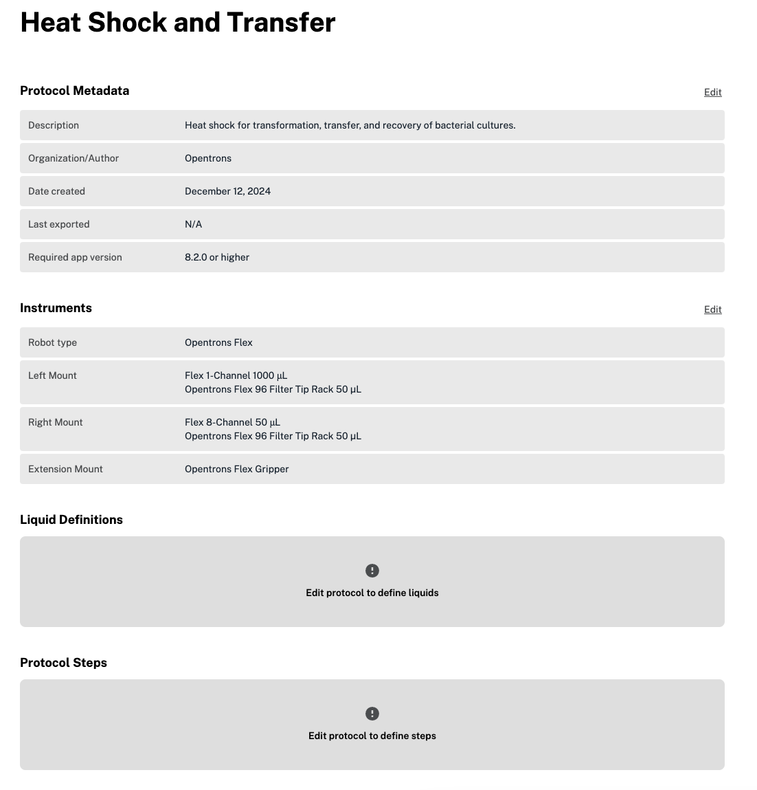{width="3.9611111111111112in"
> height="4.129166666666666in"}

The protocol overview shows instruments, including pipettes and the
gripper, added to your protocol. In this example, a\
1- and 8-channel Flex pipette are in the left and right mounts,
respectively. By default, Protocol Designer adds your first 1- or
8-channel pipette to the left mount. Click **Edit** at the top right of
the section to swap mounts or add, edit, or remove pipettes or the
gripper.

The protocol overview also includes a preview of your protocol starting
deck. The initial deck state for a protocol includes all the labware,
modules, and fixtures you've added. Protocol\
Designer automatically adds modules, fixtures, and tip racks to deck
slots. You can edit their locations on the starting deck and add labware
and liquids by clicking **Edit protocol** in the upper right.

> PROTOCOL DESIGNER 7
>
> {width="5.0in"
> height="4.618055555555555in"}
>
> In the example above, the protocol starting deck includes a trash bin
> (slot A3), Temperature and Heater-Shaker modules (slots C1 and D1,
> respectively), two staging areas (creating slots B4 and D4), and two
> tip racks (one for each pipette).
>
> Hover over each deck slot to view individual details. In the example
> starting deck, hovering over slot B2 shows an Opentrons Flex filter
> tip rack in that slot. The materials list shows the same\
> information, including liquid definitions, at a glance. Use the toggle
> switch at the upper right to view any off-deck labware added to your
> protocol.

8 PROTOCOL DESIGNER

> EDIT PROTOCOL
>
> When creating a new protocol, click **Edit protocol** to open the
> protocol editor and add labware, liquids, and protocol steps. The
> protocol editor has two tabs: one for the protocol starting deck and
> another for protocol steps. This section describes editing your
> protocol starting deck, defining liquids, and adding different types
> of steps in Protocol Designer.
>
> **Protocol starting deck**\
> The protocol starting deck tab shows the same view of the deck as in
> the protocol overview, but now allows you to edit. Hover over each
> deck slot to view slot details. You can click to edit slots and add,
> remove, or change hardware and labware.

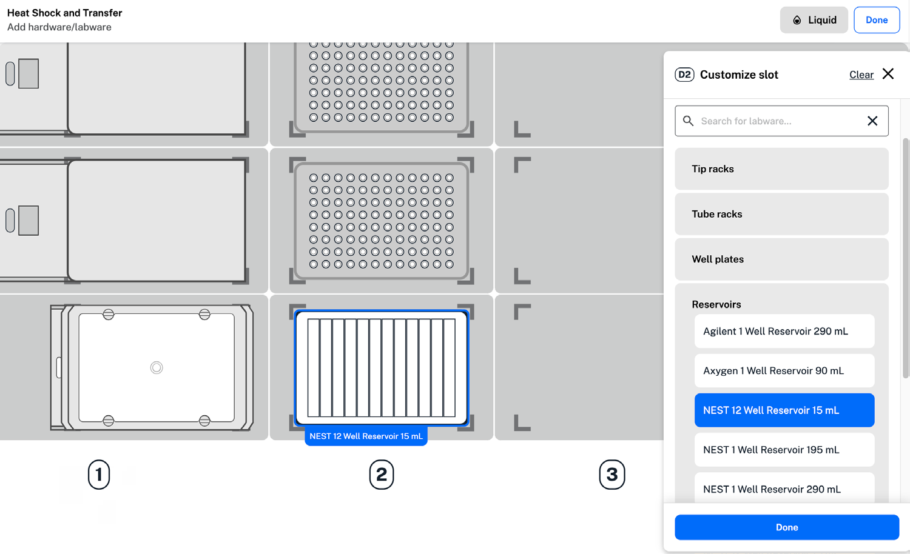{width="5.0in"
height="3.0458333333333334in"}

> For the example deck slot D2, you can add any module or fixture
> allowed in this deck slot by clicking **Deck hardware**. Click
> **Labware** to search for or select a labware type, like a reservoir,
> and view available options from the . Hover over or select an option
> to see the labware appear in your deck slot. At the bottom of the
> labware list, you can upload a JSON file to use custom labware in your
> protocol.
>
> PROTOCOL DESIGNER 9
>
> When adding labware to a module, Protocol Designer only shows
> recommended labware in the list of available options. You can choose
> to view all labware, including labware that may be\
> incompatible with the module. If an adapter is available for the
> module, it will be included in the "adapter" labware category. Use the
> toggle switch at the upper right of the protocol starting deck tab to
> add any off-deck labware.
>
> You can place compatible labware on or off-deck and move to a module
> later in your protocol. You'll need to use a move step to add any
> labware to the Absorbance Plate Reader Module.
>
> After adding labware, hover over the deck slot for additional editing
> options:
>
> Duplicate labware to add the same selection to another open deck slot.
>
> Rename any labware (with the exception of tip racks) to make them
> easier to identify throughout your protocol.

Clear all hardware and labware from any slot.

> Edit staging areas by clicking any deck slot in row 3 or 4. To add or
> edit a Thermocycler Module, click deck slot B1 on the Flex or 7 on the
> OT-2. A trash bin or waste chute is always required on the deck. On
> the OT-2, the trash bin is always placed in slot 12.
>
> **Define and add liquids**\
> In the protocol starting deck tab, click **Liquid** in the top right
> to define liquids to use in your protocol. For each liquid, add a name
> and description. Choose a color for your liquid with the custom slider
> tools or a hex code. You can view your full list of defined liquids by
> clicking **Liquid** again.
>
> On the protocol starting deck, click a piece of labware and select
> **Add liquid**. In the labware graphic, click and drag to select
> multiple wells across rows and columns. From the dropdown menu, select
> your liquid and enter the starting volume for each well in\
> microliters (µL). Click **Save** for each liquid added to your labware
> before clicking **Done**.

10 PROTOCOL DESIGNER

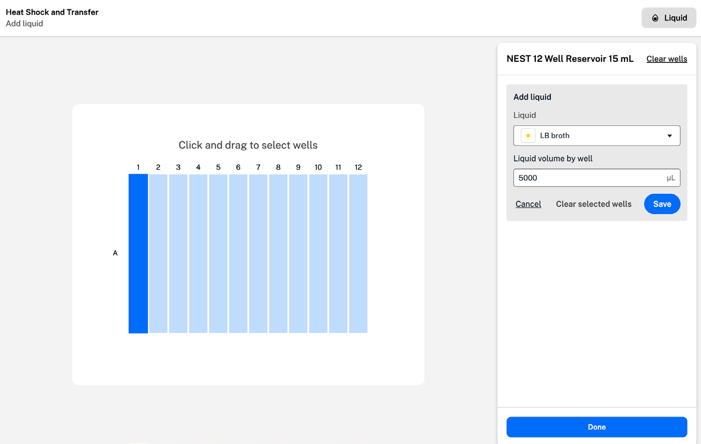{width="4.979166666666667in"
height="3.15in"}

> **Protocol steps**\
> The protocol steps tab includes your protocol timeline, or the steps
> the robot will perform in your protocol. To start, the protocol
> timeline includes the starting and final deck states. Return to the
> protocol starting deck tab to edit your starting deck state.
>
> Click **Add Step** to add transfer, move, mix, pause, or module-
> specific steps in your protocol.
>
> **Transfer steps**\
> Transfer steps move liquid from one well or group of wells to another.
> Adding a transfer step opens a two-part form. In the first, select
> basic settings for your liquid transfer:

The pipette to perform the transfer and the tip rack it will use.

> Source and destination labware, including wells.
>
> Pipette path, or motion the pipette uses to perform the transfer.
>
> Tip handling settings, including how often the pipette picks up a new
> tip and where tips are dropped.
>
> Click **Choose wells** then click and drag to select source and
> destination wells. Pipette path and tip handling options, shown below,
> are only available if they are compatible with your well selections
> and other transfer settings.
>
> PROTOCOL DESIGNER 11

+-----------------+-----------------+-----------------+-----------------+
| **Pipette       | **Well Ratio**  | >               | > **Tip         |
| Path**          |                 | **Description** | > Handling**    |
+=================+=================+=================+=================+
| > Single path   | > N to N        | > Aspirates     | > Select a new  |
|                 |                 | > enough liquid | > tip:          |
+-----------------+-----------------+-----------------+-----------------+

> for a single transfer and\
> repeats
>
> Before every aspirate\
> Once at the start of the step Per source well\
> Never

+-----------------+-----------------+-----------------+-----------------+
| > Consolidate   | > Many-to-1     | >               | > Select a new  |
|                 |                 |  Multi-aspirate | > tip:          |
+=================+=================+=================+=================+
| > path          |                 | > Aspirates     | > Before every  |
|                 |                 | > from multiple | > aspirate      |
+-----------------+-----------------+-----------------+-----------------+
|                 |                 | > wells for a   | > Once at the   |
|                 |                 | > single        | > start of the  |
|                 |                 |                 | > step          |
+-----------------+-----------------+-----------------+-----------------+
|                 |                 | > dispense      |                 |
+-----------------+-----------------+-----------------+-----------------+
|                 |                 |                 | > Never         |
+-----------------+-----------------+-----------------+-----------------+
| Distribute path | > 1-to-many     | >               | > Select a new  |
|                 |                 |  Multi-dispense | > tip:          |
+-----------------+-----------------+-----------------+-----------------+
|                 |                 | > Aspirates     | > Before every  |
|                 |                 | > enough        | > aspirate      |
+-----------------+-----------------+-----------------+-----------------+

> volume from 1 well for\
> multiple dispenses
>
> Once at the start of the step Never
>
> Customizing tip handling in your transfer steps can prevent\
> contamination or reduce tip use in a protocol. Choose how often the
> robot selects a new tip:
>
> **Before every aspirate:** selects a new tip before every aspirate in
> a transfer step.
>
> **Once at the start of the step**: selects a new tip once at the
> beginning of the entire transfer step.
>
> **Never:** reuses the tip used in the previous step.
>
> **Per source well:** selects a new tip for each source well, including
> the first. Not compatible with a consolidate or distribute path.
>
> **Per destination well**: selects a new tip for each destination well,
> including the first. Not compatible with a consolidate or distribute
> path.
>
> Consolidate and distribute paths use a cycle of aspiration and
> dispensing to combine liquid in source or destination wells. When you
> choose "before every aspirate" for a consolidate or dispense path, the
> robot selects a new tip before the first aspirate of the cycle:
>
> Consolidate cycle: aspirate, aspirate, dispense.
>
> Distribute cycle: aspirate, dispense, dispense.
>
> If you choose an incompatible well ratio or an empty source well,
> Protocol Designer displays a warning in the transfer form.

12 PROTOCOL DESIGNER

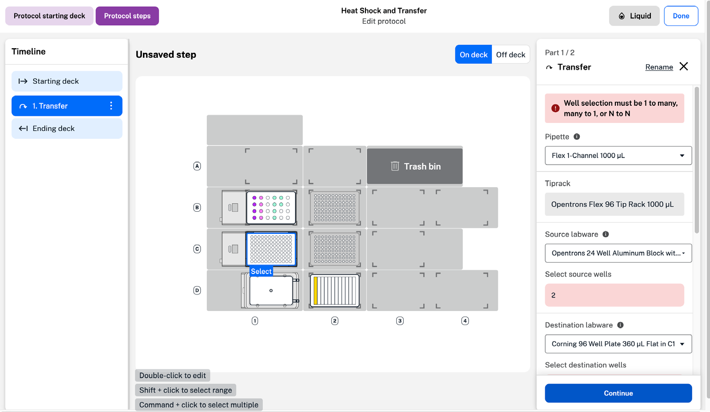{width="5.0in"
height="2.9055555555555554in"}

> Choose a tip drop location to dispose of used tips before\
> clicking **Continue**. Options include fixtures like the trash bin and
> waste chute, if used in your protocol.
>
> The second transfer form includes tabs for additional aspirate and
> dispense settings.
>
> **Custom flow rate:** the speed the robot aspirates or dispenses
> liquid at.
>
> **Well order:** the order the robot addresses source or destination
> wells in.
>
> **Tip position**: where the robot aspirates or dispenses in your
> labware.
>
> Other pipetting settings like mix, delay, blowout, and air gap.
>
> Enter a custom value in the valid range for settings like flow rate
> and tip position. Default flow rates and ranges change depending on
> the combination of pipette and tips selected to perform the transfer.
> Remove your custom settings at any time by clicking **Reset to
> default**.
>
> Click the default well order or tip position to open the menu and
> edit. Here, graphics show the order the robot moves from well to well,
> and where in each well the robot aspirates or dispenses liquid. You
> can choose a custom well order and adjust the X, Y, and Z tip
> positions within the valid range for your chosen labware.
>
> PROTOCOL DESIGNER 13
>
> 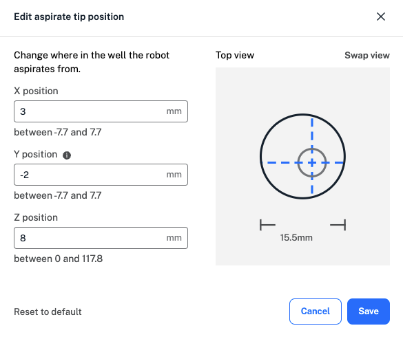{width="3.9611111111111112in"
> height="3.3375in"}
>
> The default tip position value of 0 represents the middle of the well
> for both X and Y positions. In the example above, a positive X value
> moves the tip to the right within the well, a negative Y value moves
> the tip to the left, and a positive Z value moves the tip up towards
> the top of the well. As you enter custom values, the graphic\
> changes to demonstrate the new tip position. Toggle between top and
> side views of the well by clicking **Swap view**.
>
> Additional advanced pipetting settings are available in the Aspirate
> and Dispense tabs. These are listed in the order in which the\
> robot performs them. Protocol Designer supports the following advanced
> settings:

+-----------------------+-----------------------+-----------------------+
| > **Module**          | **Opentrons Flex**    | > **Opentrons OT-2**  |
+=======================+=======================+=======================+
| Pre-wet tip           | > Aspirate            | Aspirate and dispense |
|                       |                       | in the                |
+-----------------------+-----------------------+-----------------------+

> source well before aspirationg\
> the transfer volume

+-----------------------+-----------------------+-----------------------+
| > Mix                 | Aspirate              | > Mix the contents of |
|                       |                       | > the well            |
+=======================+=======================+=======================+
|                       | Dispense              | > either before       |
|                       |                       | > aspirating or after |
+-----------------------+-----------------------+-----------------------+
|                       |                       | > dispensing          |
+-----------------------+-----------------------+-----------------------+

> Customize volume and number\
> of repetitions

14 PROTOCOL DESIGNER

+-----------------------+-----------------------+-----------------------+
| > **Module**          | > **Opentrons Flex**  | > **Opentrons OT-2**  |
+=======================+=======================+=======================+
| > Delay               | > Aspirate            | > Hold the pipette    |
|                       |                       | > tip at a            |
+-----------------------+-----------------------+-----------------------+
|                       | > Dispense            | > position for a      |
|                       |                       | > defined amount      |
+-----------------------+-----------------------+-----------------------+
|                       |                       | > of time after       |
|                       |                       | > aspirating or       |
+-----------------------+-----------------------+-----------------------+

dispensing

> Customize duration and\
> position from bottom of well

+-----------------------+-----------------------+-----------------------+
| > Blowout             | Dispense              | > Blow any remaining  |
|                       |                       | > liquid out          |
+=======================+=======================+=======================+
+-----------------------+-----------------------+-----------------------+

of the tip

> Customize location (source\
> well, destination well, trash bin,\
> or trash chute)
>
> Customize flow rate and tip\
> position from bottom during\
> blowout

+-----------------------+-----------------------+-----------------------+
| > Touch tip           | > Aspirate            | > Touch the tip to    |
|                       |                       | > the four sides      |
+=======================+=======================+=======================+
|                       | Dispense              | of the well to remove |
|                       |                       | droplets              |
+-----------------------+-----------------------+-----------------------+
|                       |                       | after aspirating or   |
|                       |                       | dispensing            |
+-----------------------+-----------------------+-----------------------+

> Customize touch tip position\
> from the top of the well

+-----------------------+-----------------------+-----------------------+
| > Air gap             | Aspirate              | > Draw air into the   |
|                       |                       | > tip after           |
+=======================+=======================+=======================+
+-----------------------+-----------------------+-----------------------+

aspirating transfer volume

Customize air gap volume

Some advanced settings, like mix and blowout, are not available

with consolidate and distribute pipette paths to prevent sample

contamination. Settings like touch tip are not available with some

types of labware. Protocol Designer only allows you to select

compatible settings.

> PROTOCOL DESIGNER 15
>
> MIX STEPS
>
> In a mix step, the robot mixes liquid by repeatedly aspirating and
> dispensing. Mixing occurs in each well you select, one after the
> other, without moving any liquid between wells.
>
> You can customize settings for your mix step in a two-part form.
>
> Just like in a transfer step, start by selecting a pipette, tip rack,
> and labware. You can customize volume per well and the number of times
> the robot will mix. Choose tip handling settings, or how often the
> robot will select a new tip, and a tip drop location before clicking
> **Continue**.
>
> In the aspirate and dispense tabs, you can adjust the flow rate, well
> order, and tip position within the well. Available advanced\
> settings in a mix step include a delay after aspirating or\
> dispensing, and blowout and touch tip after dispensing. See the
> advanced settings table in the [Transfer steps]{.underline} section
> for\
> descriptions of each.
>
> MOVE STEPS
>
> Add a move step whenever you need to move labware during a protocol,
> either with the Flex Gripper or manually. By default, move steps will
> use a gripper if added in your protocol. Click **Use gripper** in the
> step form to change your selection.
>
> During a manual move step, the protocol will pause and display a
> message on the Flex touchscreen or in the Opentrons App. Confirm your
> labware move to resume the protocol.
>
> When selecting labware for a move step, labware locations in a module
> are listed. In the example below, a Corning 96-well plate is moved to
> the Heater-Shaker Module in deck slot D1.

16 PROTOCOL DESIGNER

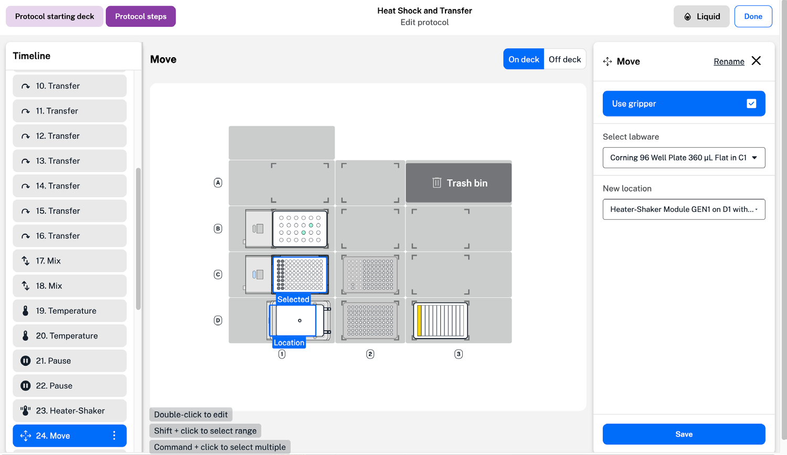{width="5.0in"
height="2.8916666666666666in"}

> If required, labware adapters need to be added to a module before a
> labware move. To add an adapter, return to the protocol starting deck
> tab.
>
> When moving labware to and from at Heater-Shaker or Absorbance Plate
> Reader Module, the labware latch or lid must be open. Add a
> Heater-Shaker or Absorbance Plate Reader step to open the latch or lid
> before moving labware to or from the module. You need to use a Flex
> gripper to move the lid on or off the Absorbance Plate Reader Module.
>
> MODULE STEPS
>
> When you add modules to the robot deck, available module steps appear
> in the "Add step" menu. Protocol Designer supports the use of the
> following modules:
>
> PROTOCOL DESIGNER 17

+-----------------------+-----------------------+-----------------------+
| > **Module and        | **Opentrons**         | > **Opentrons**       |
| > generation**        |                       |                       |
+=======================+=======================+=======================+
|                       | > **Flex**            | > **OT-2**            |
+-----------------------+-----------------------+-----------------------+
| Absorbance Plate      | > {width=" | /image9.png){width="0 |
|                       | 0.2222222222222222in" | .19444444444444445in" |
|                       | > height="0.          | > height="0.          |
|                       | 18055555555555555in"} | 19444444444444445in"} |
+-----------------------+-----------------------+-----------------------+
| > GEN1                |                       |                       |
+-----------------------+-----------------------+-----------------------+
| > Heater-Shaker       | > {width=" | /image11.png){width=" |
|                       | 0.2222222222222222in" | 0.2222222222222222in" |
|                       | > height="0.          | > height="0.          |
|                       | 18055555555555555in"} | 18055555555555555in"} |
+-----------------------+-----------------------+-----------------------+
| > Magnetic Module     | > {width="0 | /image13.png){width=" |
|                       | .19444444444444445in" | 0.2222222222222222in" |
|                       | > height="0.          | > height="0.          |
|                       | 19444444444444445in"} | 18055555555555555in"} |
+-----------------------+-----------------------+-----------------------+
| > Magnetic Module     | > {width="0 | /image15.png){width=" |
|                       | .19444444444444445in" | 0.2222222222222222in" |
|                       | > height="0.          | > height="0.          |
|                       | 18055555555555555in"} | 18055555555555555in"} |
+-----------------------+-----------------------+-----------------------+
| > Magnetic Block GEN1 | > {width=" | image17.png){width="0 |
|                       | 0.2222222222222222in" | .19444444444444445in" |
|                       | > height="0.          | > height="0.          |
|                       | 16666666666666666in"} | 19444444444444445in"} |
+-----------------------+-----------------------+-----------------------+
| > Temperature Module  | > {width="0 | /image19.png){width=" |
|                       | .19444444444444445in" | 0.2222222222222222in" |
|                       | > height="0.          | > height="0.          |
|                       | 19444444444444445in"} | 16666666666666666in"} |
+-----------------------+-----------------------+-----------------------+
| > Temperature Module  | > {width=" | /image21.png){width=" |
|                       | 0.2222222222222222in" | 0.2222222222222222in" |
|                       | > height="0.          | > height="0.          |
|                       | 18055555555555555in"} | 18055555555555555in"} |
+-----------------------+-----------------------+-----------------------+
| > Thermocycler Module | > {width="0 | /image23.png){width=" |
|                       | .19444444444444445in" | 0.2222222222222222in" |
|                       | > height="0.          | > height="0.          |
|                       | 19444444444444445in"} | 16666666666666666in"} |
+-----------------------+-----------------------+-----------------------+
| > Thermocycler Module | > {width=" | /image25.png){width=" |
|                       | 0.2222222222222222in" | 0.2222222222222222in" |
|                       | > height="0.          | > height="0.          |
|                       | 16666666666666666in"} | 16666666666666666in"} |
+-----------------------+-----------------------+-----------------------+

> You can add multiple modules of the same type only on the Flex. Only
> one Thermocycler can be used on the Flex and the OT-2.
>
> **Absorbance Plate Reader Module steps**
>
> You'll need a Flex gripper to add an Absorbance Plate Reader Module to
> your protocol starting deck. To prevent damage, only the gripper can
> move the lid on and off the Absorbance Plate Reader. The gripper
> automatically places the lid to the right of the Plate Reader, in deck
> column 4.
>
> To use an Absorbance Plate Reader Module in a Protocol Designer
> protocol, you'll need to initialize the Plate Reader, move a plate to
> the module, and read the plate using your chosen wavelength settings.
>
> Follow the instructions to add a total of six Absorbance Plate Reader
> steps to your protocol.

18 PROTOCOL DESIGNER

{width="0.2638888888888889in"
height="0.25in"}{width="0.2638888888888889in"
height="0.2638888888888889in"}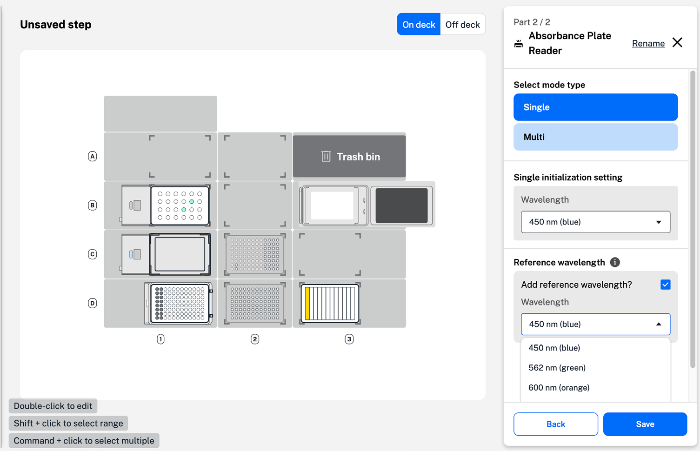{width="5.0152777777777775in"
height="3.2324376640419947in"}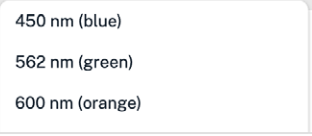{width="1.0833333333333333in"
height="0.4722222222222222in"}{width="1.0694444444444444in"
height="0.1527777777777778in"}{width="0.1527777777777778in"
height="5.555555555555555e-2in"}{width="0.6805555555555556in"
height="6.944444444444445e-2in"}{width="8.333333333333333e-2in"
height="8.333333333333333e-2in"}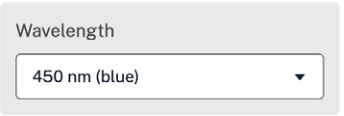{width="1.1944444444444444in"
height="0.4027777777777778in"}{width="0.8055555555555556in"
height="8.333333333333333e-2in"}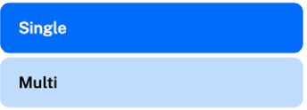{width="1.1944444444444444in"
height="0.4305555555555556in"}{width="0.5277777777777778in"
height="8.333333333333333e-2in"}{width="8.333333333333333e-2in"
height="8.333333333333333e-2in"}{width="8.333333333333333e-2in"
height="8.333333333333333e-2in"}{width="9.722222222222222e-2in"
height="9.722222222222222e-2in"}{width="8.333333333333333e-2in"
height="9.722222222222222e-2in"}{width="8.333333333333333e-2in"
height="9.722222222222222e-2in"}{width="8.333333333333333e-2in"
height="9.722222222222222e-2in"}{width="8.333333333333333e-2in"
height="8.333333333333333e-2in"}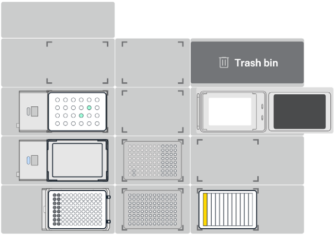{width="2.4027777777777777in"
height="1.6944444444444444in"}{width="0.2638888888888889in"
height="6.944444444444445e-2in"}

> 1 Add an Absorbance Plate Reader step to close the lid. In the step
> form, click to **Change lid position**. Click **Continue** and use the
> toggle switch to change the lid position from open to closed. The
> gripper will close the lid with no labware inside.
>
> 2 Use a second Absorbance Plate Reader step to initialize the module.
> Click **Define initialization settings** and choose a single or
> multiple initialization wavelengths from the\
> dropdown menu.
>
> Custom wavelengths between 350--1000 nanometers are supported. When
> using a single wavelength, you can add a reference wavelength for
> normalization or to correct for background interference. Your chosen
> settings appear as the current initialization settings when you add
> another Absorbance Plate Reader step.

+-----------------------------------+-----------------------------------+
| {width="0.3333333333333333in" | > module must be empty with the   |
| height="0.2638888888888889in"}    | > lid closed. Remove any          |
+===================================+===================================+
+-----------------------------------+-----------------------------------+

> labware and use a Plate Reader step to close the lid.

  -----------------------------------------------------------------------
  PROTOCOL DESIGNER                   19
  ----------------------------------- -----------------------------------

  -----------------------------------------------------------------------

{width="0.2638888888888889in"
height="0.25in"}{width="0.2638888888888889in"
height="0.2638888888888889in"}{width="0.2638888888888889in"
height="0.2638888888888889in"}{width="0.2638888888888889in"
height="0.2638888888888889in"}

> 3 Add an Absorbance Plate Reader step to open the lid using the
> gripper. The Plate Reader lid must be open to add labware to the
> module.
>
> 4 Use a move step to move your plate to the Absorbance Plate Reader.
> You can add labware to the module manually or using the gripper.
>
> Most 96-well plates from the Opentrons Labware Library are supported.
>
> 5 Add an Absorbance Plate Reader step to read the plate in the module.
> Click **Read labware** to collect absorbance data for the samples in
> your plate.
>
> **Read labware** is only available if the Plate Reader is initialized,
> with a plate inside and the lid closed.
>
> 6 Enter a name for your CSV file. You can find this file and any
> previous Absorbance Plate Reader data in your robot's recent protocol
> runs in the Opentrons App.
>
> Data from this CSV file can be used in your Python protocols, but not
> in Protocol Designer protocols.
>
> After reading your plate, follow the same steps to open the lid,
> remove the plate, and close the Absorbance Plate Reader lid with the
> gripper.

20 PROTOCOL DESIGNER

> **Heater-Shaker Module steps**
>
> Adding a Heater-Shaker Module step to your protocol displays any
> labware and adapters currently on the module.

{width="5.0in"
height="3.209722222222222in"}

> In this example, a Corning 96-well flat plate is placed on top of an
> Opentrons universal flat Heater-Shaker adapter. Both are on the
> Heater-Shaker in deck slot D1. Before moving labware to or from the
> Heater-Shaker, make sure that the labware latch is open. Add a
> Heater-Shaker step that opens the labware latch before\
> any step that moves labware to the Heater-Shaker. Without\
> this step, a could occur.
>
> In the Heater-Shaker step form, set the temperature or shake functions
> to "Active" and enter a custom value for temperature or shake speed.
> The Heater-Shaker module can heat samples between 37 and 95° C, and
> shake samples between 200\
> and 3000 rpm.
>
> Set a custom time for your Heater-Shaker step by enabling the timer.
> The timer will begin after the Heater-Shaker reaches the target
> temperature or shaking speed. Reaching a target\
> temperature takes more time than changing the shaking speed, so you
> can set the Heater-Shaker to reach a target temperature while your
> protocol proceeds.
>
> PROTOCOL DESIGNER 21
>
> 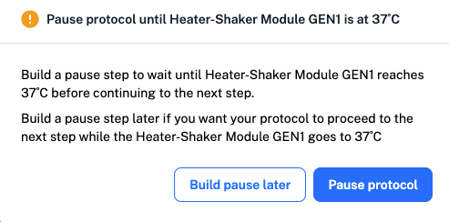{width="3.9611111111111112in"
> height="1.9597222222222221in"}
>
> You can choose to pause your protocol until the Heater-Shaker reaches
> the set temperature, or build a pause step later in your protocol.
> Building a pause step later allows the robot to continue your protocol
> while the module reaches the set temperature.
>
> After your Heater-Shaker step, follow the same steps to deactivate the
> temperature and shake functions, open the labware latch, and move your
> labware.
>
> **Temperature Module steps**\
> Adding a Temperature Module step to your protocol displays any labware
> and adapters currently on the module. Aluminum blocks or a deep well
> adapter can be used to add labware to the module.
>
> Click to set the module state and enter a temperature between 4 and 95
> °C.
>
> After your Temperature module step, add a second step to deactivate
> the module. Just like in a Heater-Shaker step, you can choose to pause
> your protocol until the Temperature module reaches the set
> temperature, or build a pause step later in\
> your protocol.
>
> **Thermocycler Module steps**\
> Adding a Thermocycler Module step to your protocol opens a two-part
> Thermocycler form. First, choose whether to change the state of the
> Thermocycler module or to program a profile. Changes to the module
> state include simple changes like opening the lid or setting an
> initial lid temperature, while programming a profile sets timed
> temperature cycles for your experiment.

22 PROTOCOL DESIGNER

Click **Change Thermocycler state** to set a block or lid\
temperature, or to open or close the lid. You can set the block at any
temperature between 4 and 99° C and the lid at any\
temperature between 37 and 110° C.

Click **Program a Thermocycler profile** to choose parameters for your
experiment. Start by entering values for your individual well volume and
initial lid temperature. Click **No profile defined** to open the
profile steps menu.

> 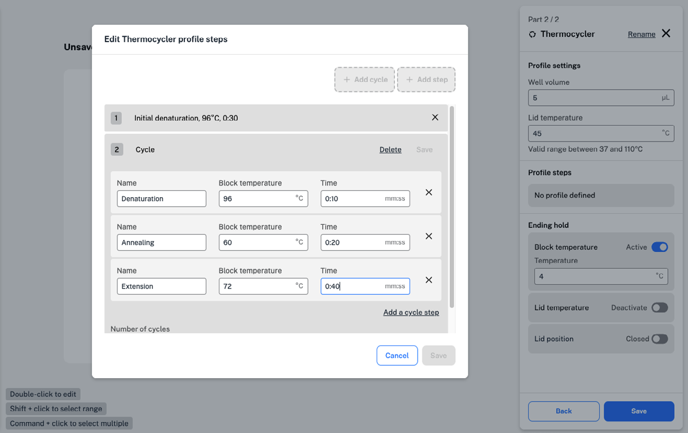{width="3.966666666666667in"
> height="2.5in"}

Click **Add step** to create a step, like an initial denaturation, that
only needs to happen once. Choose a block temperature, time, and name
for your step.

Cycles are made up of steps that are repeated a set number of times in
your experiment. Click **Add cycle** to add steps to a cycle. At the
bottom of the menu, enter the number of times the cycle should repeat
before saving your work. Define the ending hold after all cycles and
steps are complete with a block temperature, lid\
temperature, and lid position before saving your Thermocycler Module
step.

When adding a Thermocycler Module step, labware in the module is not
automatically displayed. Load labware in the Thermocycler on the
Protocol starting deck or move your labware to the\
Thermocycler module in a move step. To move labware to\
and from the Thermocycler, first open the lid by clicking **Change
Thermocycler state.**

> PROTOCOL DESIGNER 23
>
> MAGNET STEPS
>
> Module steps using the Magnetic Module (GEN1 or GEN2, only on the
> OT-2) appear as magnet steps in the "Add step" menu. When you add a
> magnet step, the form shows the deck slot the module is on and any
> labware currently in the module.
>
> Use the toggle switch to engage or disengage the module's\
> magnets. The form also lets you specify the height in the module at
> which the magnets will engage. Valid ranges are different for the
> Magnetic Module GEN1 (0 to 45 mm) and GEN2 (-2.5 to 25 mm). Swapping
> between Magnetic Module generations on the protocol starting deck will
> clear any custom engage height values you have entered.
>
> 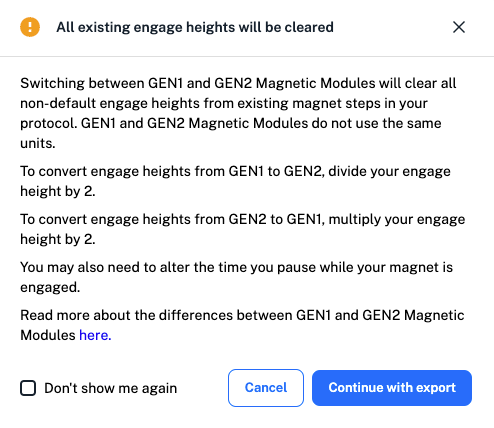{width="4.0in"
> height="3.4652777777777777in"}
>
> Before moving labware from a Magnetic Module, set the magnet state to
> "Disengage" to avoid sample disruption.
>
> The Magnetic Block (GEN1, only on the Flex) is unpowered and cannot be
> controlled by the robot. Load the Magnetic Block on the protocol
> starting deck and use a move step to place labware in the Magnetic
> Block.

24 PROTOCOL DESIGNER

PAUSE STEPS

You can add a pause step in Protocol Designer to stop your protocol.
Three options are available in the form to define the pause and instruct
the robot how to resume your protocol.

+-----------------------------------+-----------------------------------+
| > **Pause option**                | > **Description**                 |
+===================================+===================================+
| > Pause until told to resume      | > Robot pauses the protocol until |
|                                   | > you click Resume on the Flex    |
|                                   | > touchscreen or in the           |
+-----------------------------------+-----------------------------------+

Opentrons App

Add a message to display

+-----------------------------------+-----------------------------------+
| > Delay for an\                   | > Robot automatically pauses the  |
| > amount of time                  | > protocol for a defined amount   |
|                                   | > of time                         |
+===================================+===================================+
+-----------------------------------+-----------------------------------+

Enter a duration and a message to display

+-----------------------------------+-----------------------------------+
| > Pause until\                    | > Robot automatically pauses the  |
| > temperature reached             | > protocol until a module reaches |
|                                   | > a defined temperature           |
|                                   | >                                 |
|                                   | > Select the module, temperature  |
|                                   | > in °C, and add                  |
+===================================+===================================+
+-----------------------------------+-----------------------------------+

a message to display

For each option, you can add a custom message to display on the Flex
touchscreen or in the Opentrons App. Once a pause step is created, you
can also rename the step to add more information.

> PROTOCOL DESIGNER 25
>
> Finalize a protocol
>
> After adding steps the robot will perform in your protocol, you can
> view or change the protocol timeline, edit steps, and fix any\
> warnings or errors. This section describes finalizing a newly created
> protocol in Protocol Designer.
>
> PROTOCOL TIMELINE
>
> Each step in your protocol appears in the protocol timeline in the
> order you've added them. Use the protocol timeline to preview the
> steps the robot will perform in your protocol. Hover over each step to
> view a description of the step and changes to the robot deck, like
> labware moves or liquid transfers.
>
> EDITING STEPS
>
> To view or edit a step in your protocol timeline, start by clicking on
> the step. For the transfer step shown below, hover or click on the
> step to view a step name and description, including transfer volume
> and source and destination labware locations.
>
> 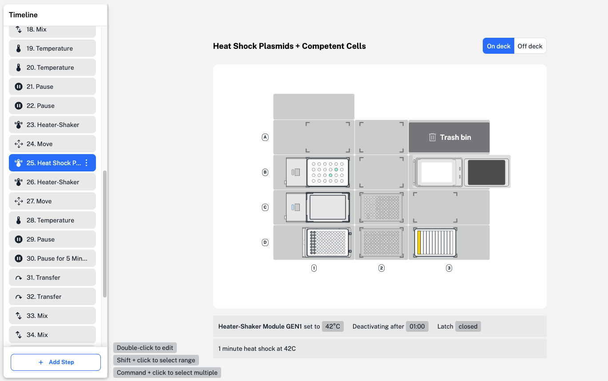{width="5.0in"
> height="3.1333333333333333in"}
>
> To edit, double click the step in the protocol timeline. This opens
> the same step form used when adding a step. At the top right of the
> form, click **Rename** to give steps a custom name and description.
>
> The step name is displayed in the Opentrons App during your protocol
> run.

26 PROTOCOL DESIGNER

> Use the three-dot menu at the right side of each step in the protocol
> timeline to access more step options. Here, you can edit the step or
> view more details, if available.

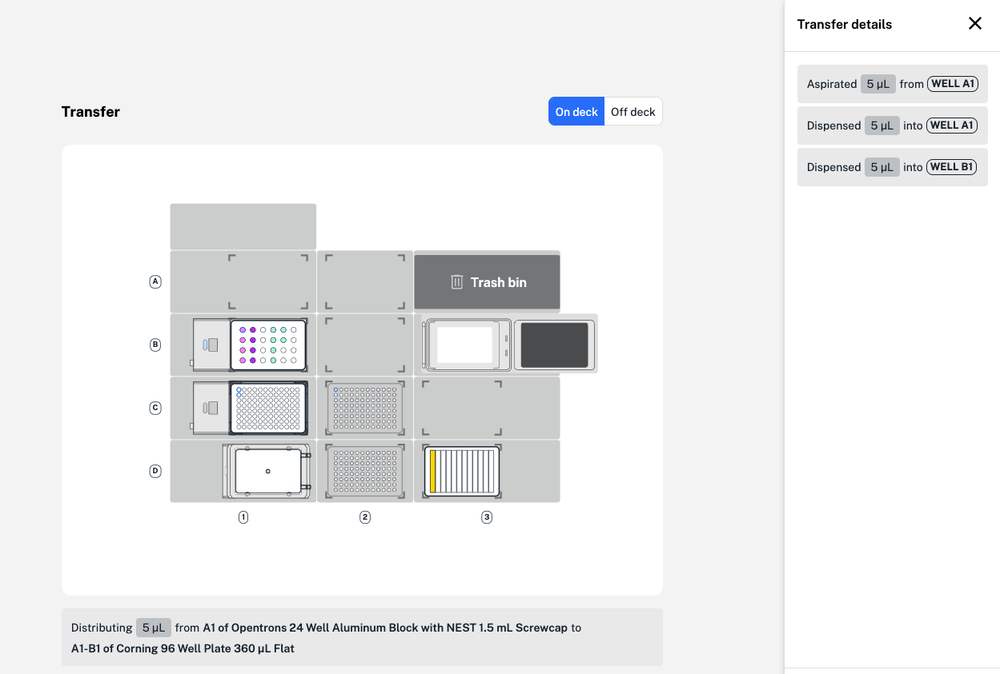{width="4.480555555555555in"
height="3.0236111111111112in"}

> In the same transfer step, step details include each single-path
> aspirate and dispense motion required to add 10 µL of a DNA sample to
> wells A1 and A2 of a Corning 96-well plate in the Heater-Shaker
> Module. Step details can also show mix wells and repetitions for a mix
> step, or steps and cycles of a Thermocycler Module profile.
>
> To edit multiple transfer steps of the same type, use the shift or
> command key and click to select. Selecting multiple transfer steps
> allows you to batch edit aspirate and dispense flow rate, well order,
> tip position, and other advanced settings.
>
> Steps in your protocol timeline initially appear in the order you've
> added them. To change the step order, click and drag to move a single
> step in the protocol timeline. You can only reorder one step at a
> time. Changing the step order can cause protocol errors, so Protocol
> Designer will ask you to confirm your change each time.
>
> WARNINGS AND ERRORS
>
> To prevent errors, Protocol Designer displays hints, warnings, and
> error descriptions as you create a protocol. This section covers types
> and causes of warnings and errors in Protocol Designer.
>
> PROTOCOL DESIGNER 27
>
> **Warnings**
>
> Warnings in Protocol Designer alert you to a potential problem with a
> protocol step. In the example below, 4 source wells have\
> been selected for a liquid transfer to 16 destination wells. Protocol
> Designer includes a warning in the transfer step form because this
> well selection, or ratio of source to destination wells, isn't
> allowed.
>
> {width="5.0in"
> height="2.9055555555555554in"}
>
> The step warning appears in a red text box at the top of the step
> form. In most cases, the warning includes a description of the issue
> or action needed to resolve the warning. To quickly resolve this step
> warning, change the well selection to just one source or\
> destination well.
>
> In some cases, a step warning appears after creating a step. If a
> transfer step aspirates more liquid than is available in the source
> well, a step warning is included only after the step has been saved
> and analyzed by Protocol Designer. To view and resolve the warn ing,
> double-click the step to reopen the form and edit.
>
> Many step warnings shown by Protocol Designer will not affect the
> function of your protocol steps. You can save and run a protocol on
> the robot with these warnings present. For example, the robot can
> still aspirate and dispense your chosen amount of liquid, even if it
> overflows a destination well. We recommend resolving all warnings to
> avoid problems in your workflow.

28 PROTOCOL DESIGNER

> **Errors**
>
> A protocol error represents a larger problem in the protocol\
> timeline. Although you can save, download, and import your\
> protocol into the Opentrons App, a protocol with an error cannot be
> run on the robot and will cause a run to fail.
>
> A protocol error appears in a red text box above the deck map and,
> like a warning, includes a description of the error and required
> action to resolve it. Most errors in Protocol Designer are caused by
> the order of steps or changes to the protocol timeline. Any\
> labware, liquids, or modules that you edit or delete on the protocol
> starting deck can also cause errors for each protocol step they are
> used in.

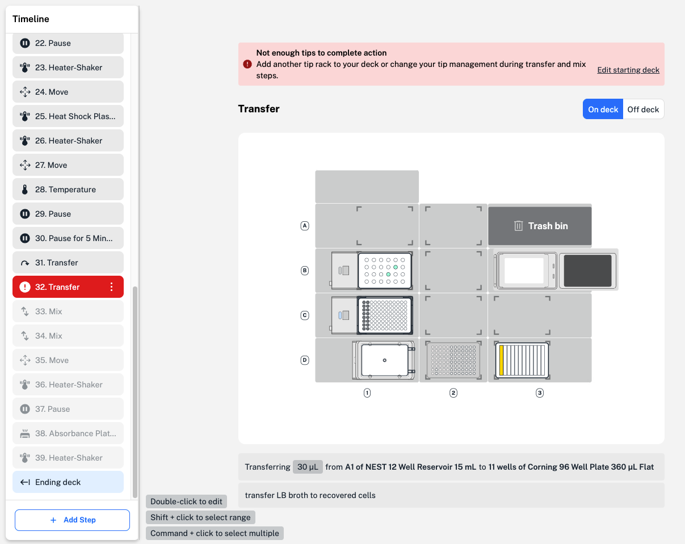{width="5.0in"
height="3.9722222222222223in"}

> In this example, not enough tips are available on the deck to complete
> the number of transfers. Because the robot cannot complete the
> protocol as is, Protocol Designer displays a protocol error. To
> resolve this error, add more tips to the protocol starting deck or
> change tip management, or tip handling, settings in the transfer step
> form.
>
> PROTOCOL DESIGNER 29
>
> When designing your protocol, consider the order the labware and
> modules should interact in to avoid protocol errors.
>
> 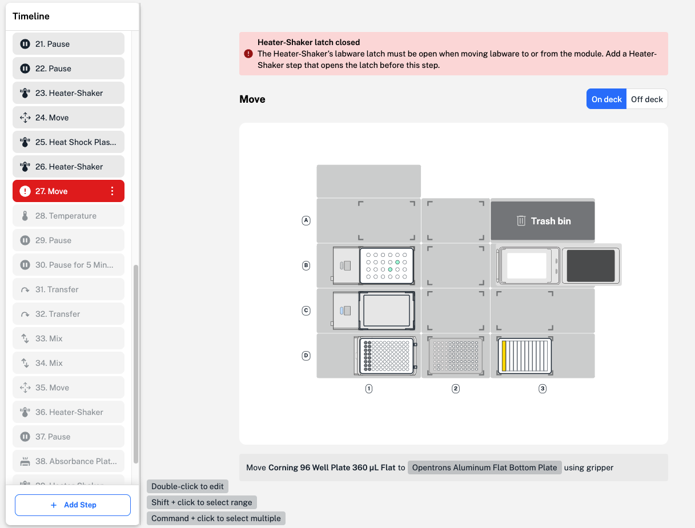{width="5.0in"
> height="3.8in"}
>
> Export protocol
>
> When you're finished creating and editing your protocol, click Done in
> the upper right to return to the protocol overview. Click Export
> protocol to download your protocol as a JSON file.
>
> If your protocol contains unused hardware or labware, Protocol
> Designer will ask if you'd like to remove it before exporting the
> protocol.
>
> Modify an existing protocol
>
> You can upload and edit protocols you have previously made in Protocol
> Designer. On the starting screen, click Edit existing protocol and
> upload your Protocol Designer JSON file. Your protocol details will be
> visible in the protocol overview. Click Edit protocol to make your
> desired changes.

30 PROTOCOL DESIGNER

> When uploading a JSON file created in a previous version of\
> Protocol Designer, the protocol will be automatically updated to the
> latest version. The updated JSON file will be incompatible with
> previous Protocol Designer and Opentrons App versions.
>
> We recommend making a separate copy of your protocol before importing
> and editing.
>
> If you edit an exported JSON file in a text editor outside of Protocol
> Designer, errors could occur when re-uploading. JSON files created
> outside of Protocol Designer aren't supported.

Protocol Designer settings

> Click the settings icon in the top right to access Protocol Designer
> settings. You can access this software manual and view release notes
> in the App Info links.
>
> Protocol Designer shows hints, tips, and timeline editing\
> suggestions to help you fix protocol warnings and errors. You can
> restore all hints and tips shown during protocol editing and toggle
> timeline editing guidance on and off.
>
> You can choose to share analytics with Opentrons to improve Protocol
> Designer and other services. To report a Protocol Designer bug,
> contact Opentrons Support at
>
> PROTOCOL DESIGNER 31
