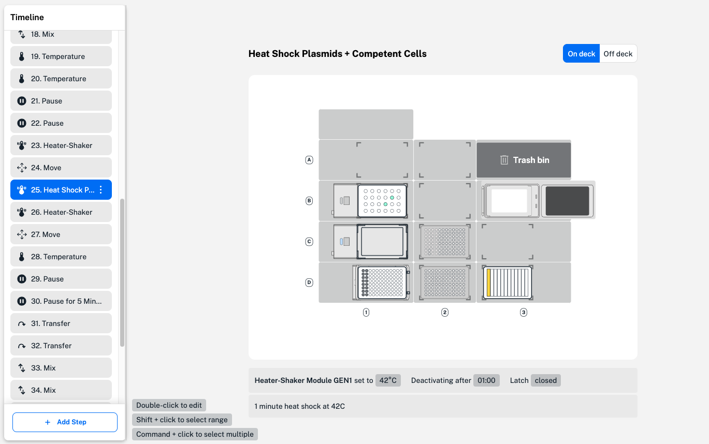
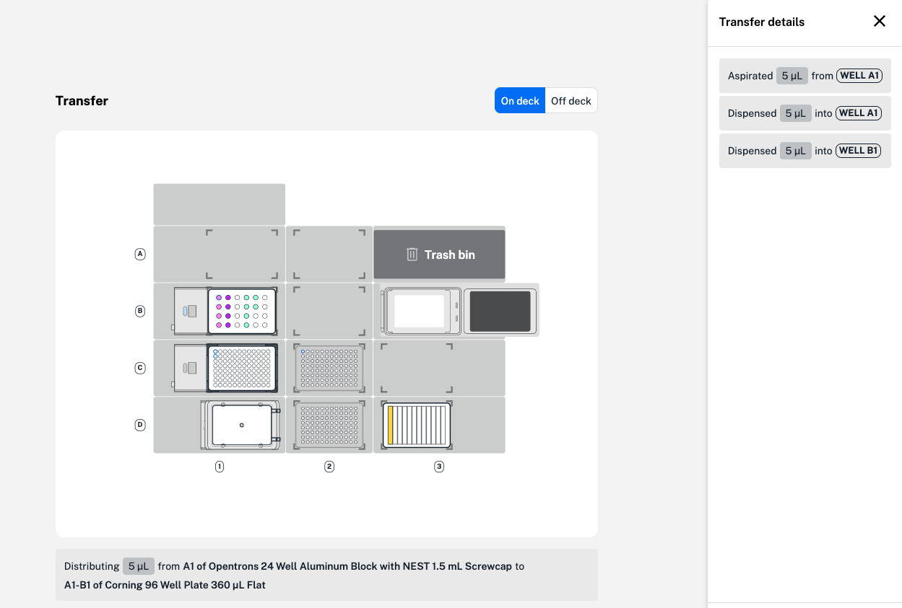

Each step in your protocol appears in the protocol timeline in the order you've added them. After adding steps the robot will perform in your protocol, you can make edits to finalize your protocol. 

Hover over each step in the protocol timeline to view a description of the step and changes to the robot deck, like labware moves or liquid transfers. 

To view more details or edit a step in your protocol timeline, start by clicking on the step. For the heat shock step shown below, hover or click on the step to view a step name and description, including transfer volume and source and destination labware locations. 

<figure class="screenshot" markdown>
  
  <figcaption>Hover over a step, shown in blue, to view details below the deck map.</figcaption>
</figure>

To edit, double click the step in the protocol timeline. This opens the same step form used when adding a step. At the top right of the
form, click **Rename** to give steps a custom name and description. This can make it easier for you to tell the difference between multiple steps of the same type.  

Use the three-dot menu at the right side of each step in the protocol
timeline to access more step options. Here, you can edit the step or
view more details, if available. 

<figure class="screenshot" markdown>
  
  <figcaption>Click the three-dot menu to view more step details on the right.</figcaption>
</figure>

In this transfer step, step details include each single-path
aspirate and dispense motion required to add 10 µL of a DNA sample
to wells A1 and B1 of a Corning 96-well plate in the Heater-Shaker
Module. Step details can also show mix wells and repetitions for a
mix step, or steps and cycles of a Thermocycler Module profile.

## Batch edit steps

To edit multiple transfer steps of the same type, use the shift or
command key and click to select. Selecting multiple transfer steps
allows you to batch edit aspirate and dispense flow rate, well order,
tip position, and other advanced settings. 

## Change step order

Steps in your protocol timeline initially appear in the order you’ve
added them. To change the step order, click and drag to move a
single step in the protocol timeline. You can only reorder one step
at a time. Changing the step order can cause protocol errors, so
Protocol Designer will ask you to confirm your change each time.

