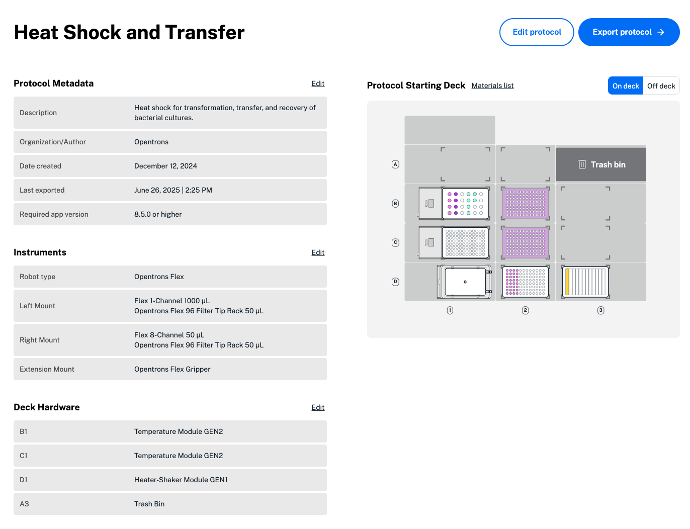

When you're finished creating and editing your protocol, click **Back to overview** in the upper left. Review the hardware, labware, liquids, and steps added to your protocol. Then, click **Export protocol** in the upper right. Your protocol will automatically download as a Python (.py) file. 

!!! Note
    Protocols created in earlier versions of Protocol Designer 8.5.0 were exported as .json files. 

    As of Protocol Designer 8.5.0, you can still import any .json protocol created in Protocol Designer and make changes. When you're finished, export and download your new .py protocol.

If your protocol contains unused hardware or labware, Protocol Designer will ask if you'd like to remove it before exporting the protocol.

<figure class="screenshot" markdown>
  
  <figcaption>Click in the upper right to export your protocol.</figcaption>
</figure>