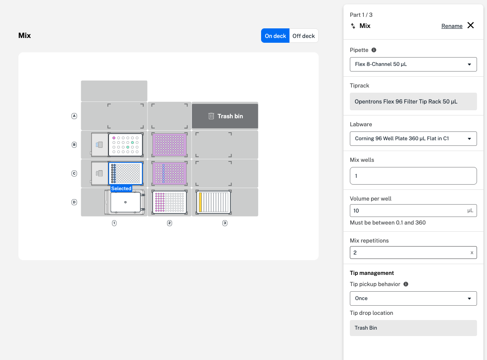

In a mix step, the robot mixes liquid by repeatedly aspirating and dispensing. Mixing occurs in each well you select, one after the other, without moving any liquid between wells. 

You can customize settings for your mix step in a two-part form. Just like in a transfer step, start by selecting a pipette, tip rack, and labware. You can customize volume per well and the number of times the robot will mix. Choose tip management settings, or how often the robot will select a new tip, and a tip drop location before clicking **Continue**. 

<figure class="screenshot" markdown>
  
  <figcaption>Select wells, volume, repetitions, and tip management settings in the first mix step form.</figcaption>
</figure>

In the aspirate and dispense tabs, you can adjust the flow rate, well order, and tip position within the well. Available advanced settings in a mix step include a delay after aspirating or dispensing, and blowout and touch tip after dispensing. See the advanced settings table in [Transfer steps](transfer-steps.md) for descriptions of each.