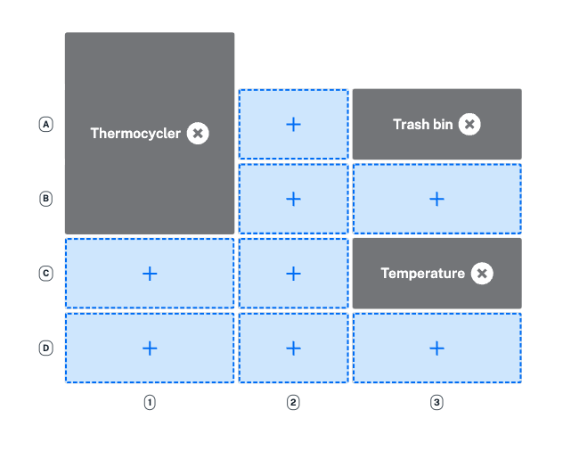

The second step in building your protocol is to add modules or fixtures to the deck. Click an open slot to add a module, like the Temperature Module, or a fixture like the trash bin. 

<figure class="screenshot" markdown>
  
  <figcaption>Click an open Flex deck slot to add compatible modules and fixtures.</figcaption>
</figure>

Protocol Designer protocols can control Opentrons modules on the Flex or OT-2, as shown below. Flex lets you use multiple modules of the same type, except for the Thermocycler.

| **Module** | **Opentrons Flex** | **Opentrons OT-2** |
| :----------|------------------- | ------------------ |
| Thermocycler Module | <ul><li>Only 1 module</li><li>GEN2 only</li><li>Slots A1 and B1</li></ul> | <ul><li>Only 1 module</li><li>GEN1 or GEN2</li><li>Slots 7 and 10</li></ul> |
| Heater-Shaker Module | <ul><li>Up to 7 modules</li><li>GEN1 only</li><li>Slots A1–D1 or A3–D3</li></ul> | <ul><li>Only 1 module</li><li>GEN1 only</li><li>Slot 1, 3, 4, 6, 7, or 10</li></ul> |
| Absorbance Plate Reader Module | <ul><li>1 module only</li><li>GEN1 only</li><li>Slots A1–D3</li></ul> | Not compatible |
| Magnetic Block | <ul><li>Up to 11 modules</li><li>GEN1 only</li><li>Slots A1–D3</li></ul> | Not compatible |
| Magnetic Module | Not compatible | <ul><li>1 module only</li><li>GEN1 or GEN2</li><li>Slot 1, 3, 4, 6, 7, 9, or 10</li></ul> |
| Temperature Module | <ul><li>Up to 7 modules</li><li>GEN2 only</li><li>Slots A1–D1 or A3–D3</li></ul> | <ul><li>1 module only</li><li>GEN1 or GEN2 only</li><li>Slot 1, 3, 4, 6, 7, 9, or 10</li></ul> |

On the Flex, you can also customize fixtures, including the waste chute, trash bin, and staging areas, to optimize deck space. 

| **Fixture** {style="width: 30%"} | **Opentrons Flex** {style="width: 35%"}| **Opentrons OT-2** {style="width: 35%"} |
| :------------| :------------------ | :------------------ |
| Trash Bin | <ul><li>Only 1 trash bin</li><li>Slots A1-D1 or A3-D3</li></ul> | <ul><li>Only 1 trash bin</li><li>Slot 12</li></ul> |
| Waste Chute | <ul><li>Only 1 waste chute</li><li>Slot D3</li></ul> | Not compatible |
| Staging area | <ul><li>Up to 4 staging areas</li><li>Slots A3-D3</li></ul> | Not compatible |

You can create additional space on the Flex deck by adding as many as four staging areas to slots A3–D3. This creates an additional row of slots (A4-D4). 