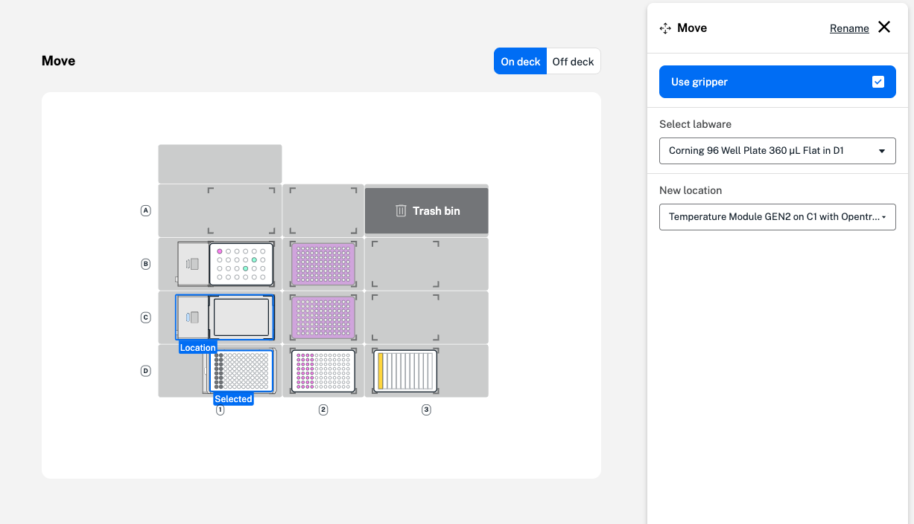

Add a move step whenever you need to move labware during a protocol, either with the Flex Gripper or manually. By default, move steps will use a gripper if added in your protocol. Click **Use gripper** in the step form to change your selection. 

During a manual move step, the protocol will pause and display a message on the Flex touchscreen or in the Opentrons App. Confirm your labware move to resume the protocol. 

When selecting labware for a move step, you can choose labware directly on the deck or on a module. The example below shows moving a Corning 96-well plate to the Heater-Shaker Module in deck slot D1. 

<figure class="screenshot" markdown>
  
  <figcaption>Add a move step that uses the Flex Gripper.</figcaption>
</figure>

If required, labware adapters need to be added to a module before a labware move. To add an adapter, return to the protocol starting deck. 

When moving labware to and from the Heater-Shaker, Thermocycler, or Absorbance Plate Reader Module, the labware latch or lid must be open. Add a module step to open the latch or lid before moving labware to or from the module. You'll need to use a Flex Gripper to move the lid on or off the Absorbance Plate Reader Module. 
