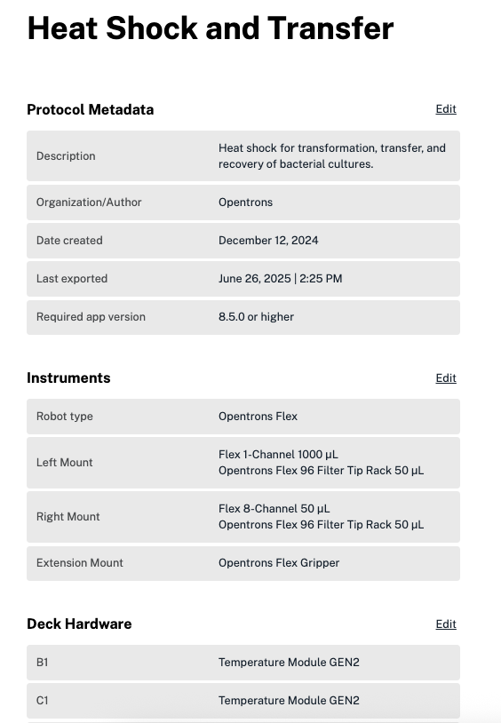
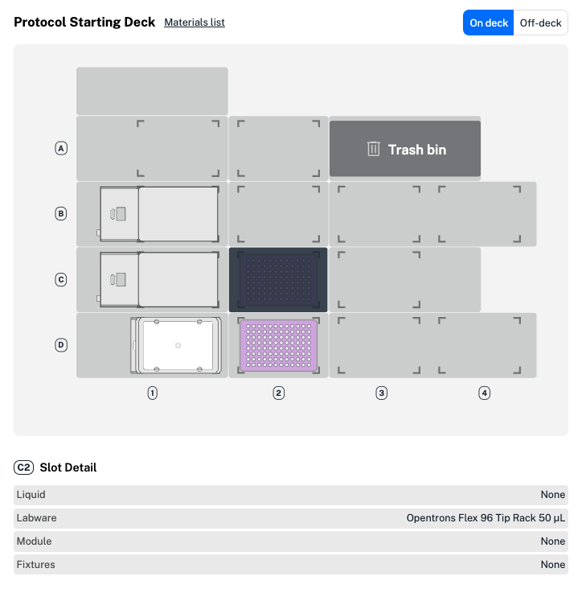

## Protocol metadata

Before you finish creating your protocol, add a few more details. A unique title, description, and author details will be displayed in the Opentrons App for your completed protocol and help it stand out from the others. 

## Protocol overview

The protocol overview summarizes details you've added for your protocol. The protocol metadata section at the top left includes your protocol description, author, and organization details. You can also see the dates the protocol was created and exported. Modifying a protocol updates the last export date. Click **Edit** at the top right of the section to make changes. 

<figure class="screenshot" markdown>
  
  <figcaption>The left section of the protocol overview screen.</figcaption>
</figure>

The protocol overview shows instruments, including pipettes and the gripper, added to your protocol. In this example, a 1- and 8-channel Flex pipette are in the left and right mounts, respectively. By default, Protocol Designer adds your first 1- or 8-channel pipette to the left mount. Click **Edit** at the top right of the section to swap mounts or add, edit, or remove pipettes or the gripper. 

The protocol overivew also includes a preview of your protocol starting deck. The initial deck state for a protocol includes all the labware, modules, and fixtures you've added. Protocol Designer automatically adds modules, fixtures, and tip racks to deck slots. You can edit their locations on the starting deck and add labware and liquids by clicking  **Edit protocol** in the upper right. 

Hover over a deck slot to see individual details beneath the deck map, like labware and liquids. In the example below, slot C2 contains an Opentrons Flex filter tip rack. 

<figure class="screenshot" markdown>
  
  <figcaption>The right section of the protocol overview screen.</figcaption>
</figure>

This protocol starting deck also includes a trash bin (slot A3), Temperature and Heater-Shaker Modules (slots B1–C1 and D1, respectively), two staging areas (creating slots B4 and D4), and a second tip rack (one tip rack for each pipette).

Use the toggle switch at the upper right to view any off-deck labware added to your protocol. 
