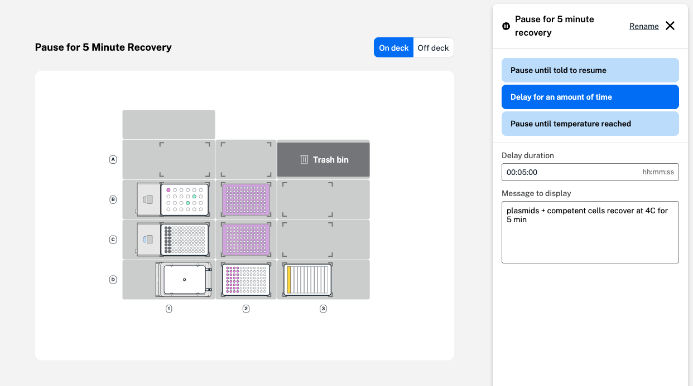

You can add a pause step in Protocol Designer to stop your protocol. Three options are available in the form to define the pause and instruct the robot how to resume your protocol. 

| Pause option | Description | 
| ---------------- | --------------- | 
| Pause until told to resume | <ul><li>Robot pauses the protocol until you click **Resume** on the Flex touchscreen or in the Opentrons App</li><li>Add a message to display</li></ul> | 
| Delay for an amount of time | <ul><li>Robot automatically pauses the protocol for a defined amount of time</li><li>Enter a duration and a message to display</li></ul> | 
| Pause until temperature reached | <ul><li>Robot automatically pauses the protocol until a module reaches a defined temperature</li><li>Select the module, temperature in °C, and add a message to display</li></ul> | 

For each option, you can add a custom message to display on the
Flex touchscreen or in the Opentrons App. Once a pause step is
created, you can also rename the step to add more information. 

<figure class="screenshot" markdown>
  
  <figcaption>Add a custom name and message for your pause step.</figcaption>
</figure>