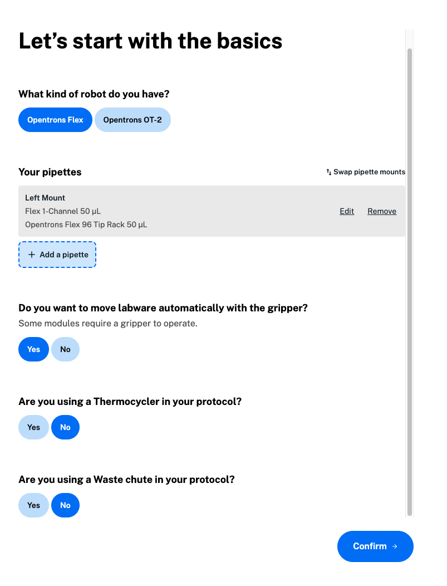

Click **Create a protocol** on the Protocol Designer homepage or click **Create new** in the header at any time to get started building a protocol. First, select the robot you'll use. You can use Protocol Designer to create protocols that run on either the Opentrons Flex or the OT-2. 

Next, add your pipettes. Select your pipette type and volume to view available tip rack options. Protocol Designer automatically shows you tips that are compatible with your chosen pipette. You will need to choose at least one tip rack for each pipette. If your protocol uses two of the same pipette, you can start with a single tip rack for both. Later, you can add tip racks to the protocol starting deck to be sure you have enough tips for all the steps in your protocol. 

After adding up to two pipettes, confirm your selections. Click **Swap pipette mounts** to change pipette mounts from left to right. On the Flex, the 96-channel pipette uses both the left and right mounts. 

Add a gripper to move labware automatically on the Flex. You'll need a gripper to use some modules, like the Absorbance Plate Reader. The instrument section of your protocol overview will include the gripper, attached to the extension mount. 

To start, Protocol Designer will automatically assign deck slots for modules and fixtures in your protocol. To avoid deck conflicts, choose whether your Flex protocol will include a Thermocycler Module or waste chute. Both occupy a fixed deck slot.

<figure class="screenshot" markdown>
  
  <figcaption>Add the basics for your protocol.</figcaption>
</figure>

