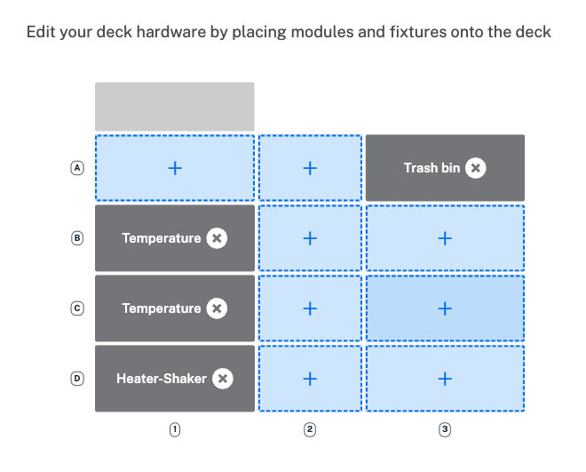
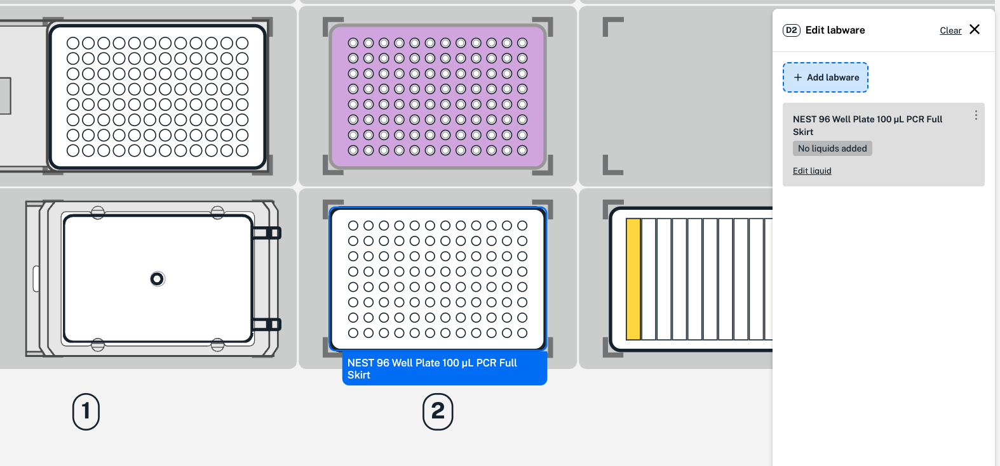
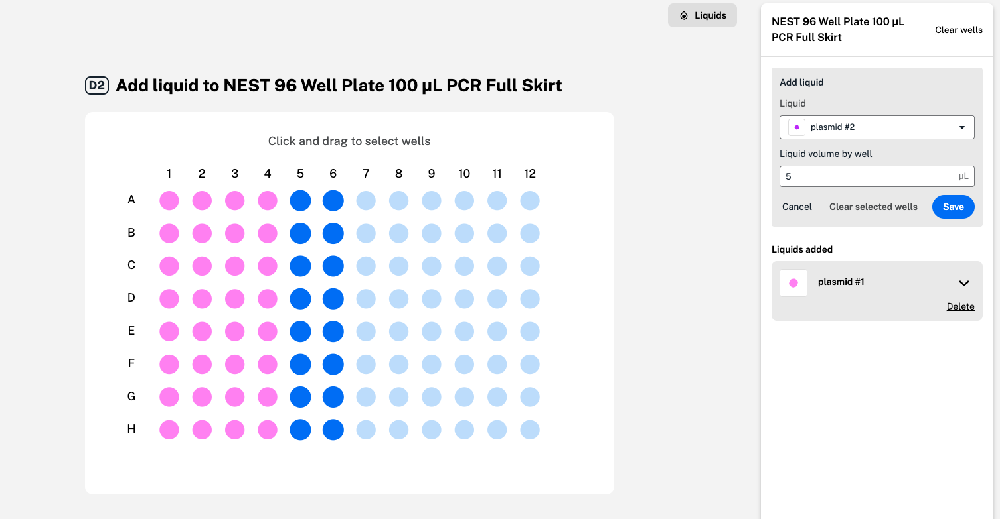
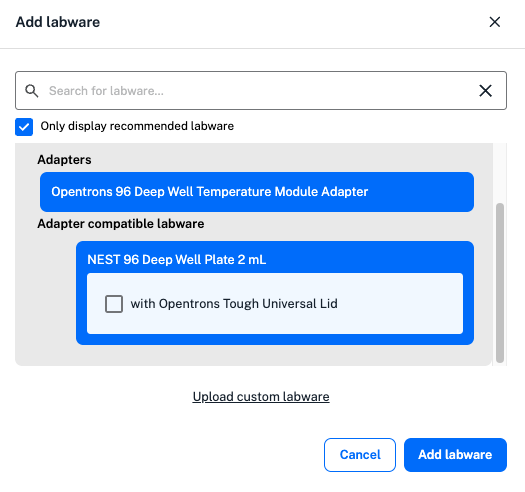

Click **Edit protocol** to add and edit hardware, labware,  and liquids on the protocol starting deck. 

The protocol starting deck view shows how your Flex or OT-2 deck will look at the beginning of a protocol. This is the first step in your protocol timeline, shown on the left. It's also the same view of the deck as in the protocol overview, but editable. 

## Deck hardware

To start, Protocol Designer automatically places modules and fixtures used in your protocol on the robot deck. Click **Deck hardware** in the upper left to add, move, or delete modules or fixtures. Protocol Designer only shows compatible options for each slot. 

<figure class="screenshot" markdown>
  
  <figcaption>Add, move, or delete deck hardware, like modules and fixtures.</figcaption>
</figure>

## Liquids

Next, click **Liquids** in the upper left. First, define a liquid to use in your protocol with a name, description, and color. You can also define the liquid as an Opentrons-verified liquid class to apply optimized pipetting settings during transfer and mix steps. You'll be able to add liquids to labware already on the robot deck.

## Labware

Click to return to the protocol starting deck, the first step in your protocol timeline. Here, you can edit labware on or off the robot deck. Hover over each deck slot to view slot details. Then, click individual slots to add, remove, or change labware. 

Use the toggle switch at the upper right of the protocol starting deck to add, view, and edit off-deck labware.

<figure class="screenshot" markdown>
  
  <figcaption>Add a well plate to the deck.</figcaption>
</figure>

For the example slot D2, you can add labware by clicking an open deck slot and choosing **Add labware**. 

In the menu, search for or select a labware type, like well plates, and view available options from the [Labware Library](https://labware.opentrons.com "Labware Library"). At the bottom of the labware list, you can upload a JSON file to use custom labware in your protocol. 

Click **Edit liquid** in the labware menu on the right to add liquids you've already defined in your protocol. In the labware graphic, click and drag to select wells across rows and columns. From the dropdown menu, select your liquid and enter the starting volume for each well in microliters (µL). Click **Save** for each liquid added to your labware before clicking **Done**.  

<figure class="screenshot" markdown>
  
  <figcaption>Add liquid to your chosen wells. Wells shown in blue are selected to add a second liquid (plasmid #2). </figcaption>
</figure>

To add labware to a module, click any open module and choose **Edit labware**. 

<figure class="screenshot" markdown>
  
  <figcaption>Add compatible labware to the Temperature Module. </figcaption>
</figure>

Protocol Designer only shows recommended labware in the list of available options. You can choose to view all labware, including labware that may be incompatible with the module. Add compatible adapters for modules on the deck from the "adapter" labware category. Use the toggle switch at the upper right of the protocol starting deck if you need to add any off-deck labware. 

You can place compatible labware on or off-deck and move to a module later in your protocol. You'll need to use a move step to add any labware to the Absorbance Plate Reader Module. 

After adding labware, drag and drop to move to another slot. Click the deck slot for additional editing options: 

* Duplicate labware to add the same selection to another open deck slot. 
* Rename any labware (with the exception of tip racks) to make them easier to identify throughout your protocol. 
* Clear all hardware and labware from any slot. 

Edit staging areas by clicking any deck slot in row 3 or 4. To edit a Thermocycler Module, click deck slot B1 on the Flex or 7 on the OT-2. A trash bin or waste chute is always required on the deck. On the OT-2, the trash bin is always placed in slot 12. 
