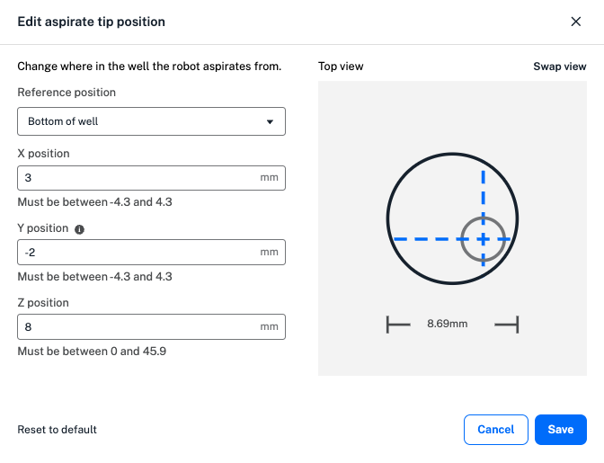

Your protocol timeline includes steps the robot will peform in your protocol. To start, the timeline includes the starting and ending deck states. Click **Add Step** in the lower left to add transfer, move, mix, pause, or module-specific steps to your protocol. 

## The basics

Transfer steps move liquid from one well or group of wells to another. Adding a transfer step opens a three-part form. In the first, select basic settings for your liquid transfer: 

* The pipette to perform the transfer and the tip rack it will use. 
* Source and destination labware, including wells. 
* Pipette path, or motion the pipette uses to perform the transfer. 
* Tip management settings, including how often the pipette picks up a new tip and where tips are dropped. 

Click **Choose wells**, and then click and drag to select source and destination wells. Pipette path and tip handling options, shown below, are only available if they are compatible with your well selections and other transfer settings. 

| **Pipette Path** | **Well Ratio** | **Description** {style="width: 25%;"}| **Tip Handling** |
| ---------------- | -------------- | --------------- | ---------------- |
| Single path | N to N | <ul><li>Aspirates enough liquid for a single transfer and repeats</li></ul> | Select a new tip: <ul><li>Before every aspirate</li><li>Once at the start of the step</li><li>Per source well</li><li>Never</li></ul> |
| Consolidate path | Many-to-1 | <ul><li>Multi-aspirate</li><li>Aspirates from multiple wells for a single dispense</li></ul> | Select a new tip: <ul><li>Before every aspirate</li><li>Once at the start of the step</li><li>Never</li></ul> |
| Distribute path | 1-to-many | <ul><li>Multi-dispense</li><li>Aspirates enough volume from 1 well for multiple dispenses</li></ul> | Select a new tip: <ul><li>Before every aspirate</li><li>Once at the start of the step</li><li>Never</li></ul> |

## Tip management

Customizing tip management in your transfer steps can prevent contamination or reduce tip use in a protocol. Choose how often the robot selects a new tip: 

* **Before every aspirate**: selects a new tip before every aspirate in a transfer step. 
* **Once at the start of the step**: selects a new tip once at the beginning of the entire transfer step. 
* **Never**: reuses the tip used in the previous step. 
* **Per source well**: selects a new tip for each source well, including the first. Not compatible with a consolidate or distribute path. 
* **Per destination well**: selects a new tip for each destination well, including the first. Not compatible with a consolidate or distribute path. 

Consolidate and distribute paths use a cycle of aspiration and dispensing to combine liquid in source or destination wells. When you choose "before every aspirate" for a consolidate or dispense path, the robot selects a new tip before the first aspirate of the cycle: 

* Consolidate cycle: aspirate, aspirate, dispense.
* Distribute cycle: aspirate, dispense, dispense. 

If you choose an incompatible well ratio or an empty source well, Protocol Designer displays a warning in the transfer form. 

<figure class="screenshot" markdown>
  
  <figcaption>Incompatible well ratio in a transfer step.</figcaption>
</figure>

Choose a tip drop location to dispose of used tips before clicking **Continue**. Options include fixtures like the trash bin and waste chute, if used in your protocol. 

In the second form, choose whether to use liquid class settings in the transfer. You can choose from three Opentrons-verified liquid classes: for an aqueous, viscous, or volatile liquid. Applying a liquid class changes the transfer step's pipetting settings, so Protocol Designer will ask you each time. 

## Additional settings

In the third form, click the aspirate and dispense tabs to access additional settings.

* **Custom flow rate**: the speed the robot aspirates or dispenses liquid at. 
* **Well order**: the order the robot addresses source or destination wells in. 
* **Tip position**: where the robot aspirates or dispenses in your labware. 
* Other pipetting settings like mix, delay, blowout, and air gap.  

If you chose to apply a liquid class to your transfer step, each tab already contains values, like flow rate, optimized to transfer your liquid. In this form, you're able to enter custom values in the valid range for settings like tip position. Default values and ranges change depending on the combination of pipette and tips selected to perform the transfer. Remove your custom settings at any time by clicking **Reset to default**. 

Click the default well order or tip position to open the menu and edit. Here, graphics show the order the robot moves from well to well, and where in each well the robot aspirates or dispenses liquid. You can choose a custom well order and adjust the X, Y, and Z tip positions within the valid range for your chosen labware. 

<figure class="screenshot" markdown>
  
  <figcaption>Edit the aspirate tip position.</figcaption>
</figure>

The default tip position value of 0 represents the middle of the well for both X and Y positions. In the example above, a positive X value moves the tip to the right within the well, a negative Y value moves the tip to the left, and a positive Z value moves the tip up towards the top of the well. as you enter custom values, the graphic changes to demonstrate the new tip position. Toggle between top and side views of the well by clicking **Swap view**.

Additional advanced pipetting settings are available in the Aspirate and Dispense tabs. These are listed in the order in which the robot performs them. Protocol Designer supports the following advanced settings: 

| **Advanced Setting** | **Pipette Movement** | **Description** |
| :------------------- | :------------------- | :-------------- |
| Pre-wet tip | <ul><li>Aspirate</li></ul> | <ul><li>Aspirate and dispense once in the source well before aspirating the transfer volume</li></ul> |
| Mix | <ul><li>Aspirate</li><li>Dispense</li></ul> | <ul><li>Mix the contents of the well either before aspirating or after dispensing</li><li>Customize volume and number of repetitions</li></ul> |
| Delay | <ul><li>Aspirate</li><li>Dispense</li></ul> | <ul><li>Hold the pipette tip at a position for a defined amount of time after aspirating or dispensing</li><li>Customize duration and position from bottom of well</li></ul> |
| Blowout | <ul><li>Dispense</li></ul> | <ul><li>Blow any remaining liquid out of the tip</li><li>Customize location (source well, destination well, trash bin, or trash chute)</li><li>Customize flow rate and tip position from bottom during blowout</li></ul> |
| Touch tip | <ul><li>Aspirate</li><li>Dispense</li></ul> | <ul><li>Touch the tip to the four sides of the well to remove droplets after aspirating or dispensing</li><li>Customize touch tip position from the top of the well</li></ul> |
| Air gap | <ul><li>Aspirate</li></ul> | <ul><li>Draw air into the tip after aspirating transfer volume</li><li>Customize air gap volume</li></ul> |

Some advanced settings, like mix and blowout, are not available with consolidate and distribute pipette paths to prevent sample contamination. Settings like touch tip are not available with some types of labware. Protocol Designer only allows you to select compatible settings in your transfer step. 
