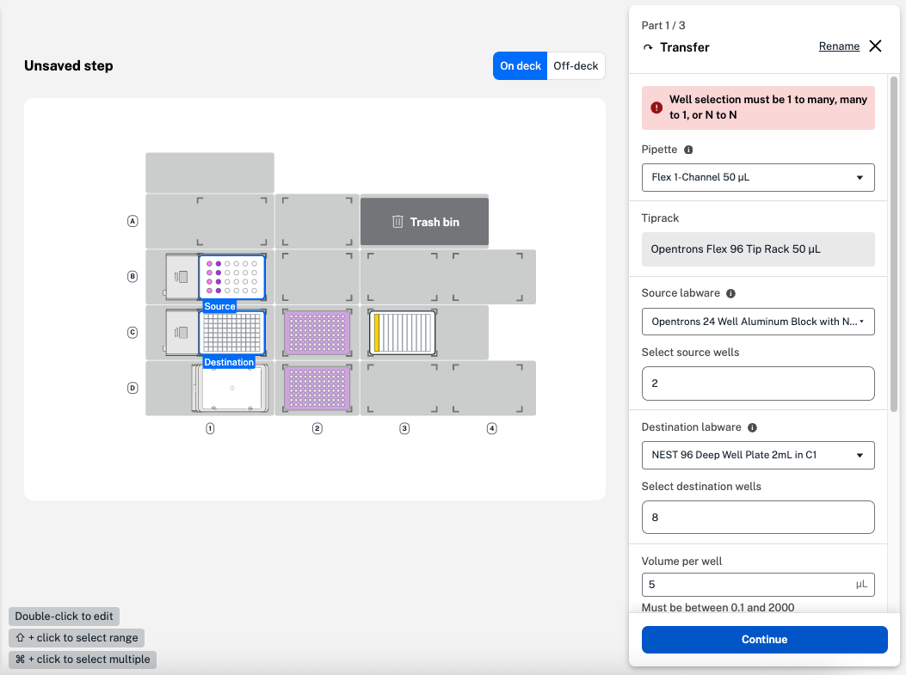
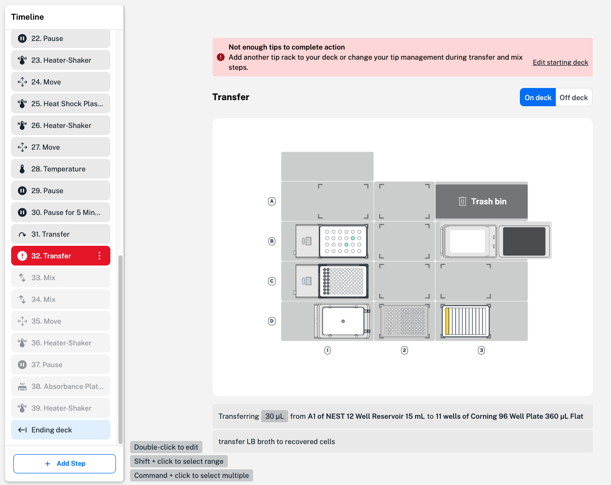
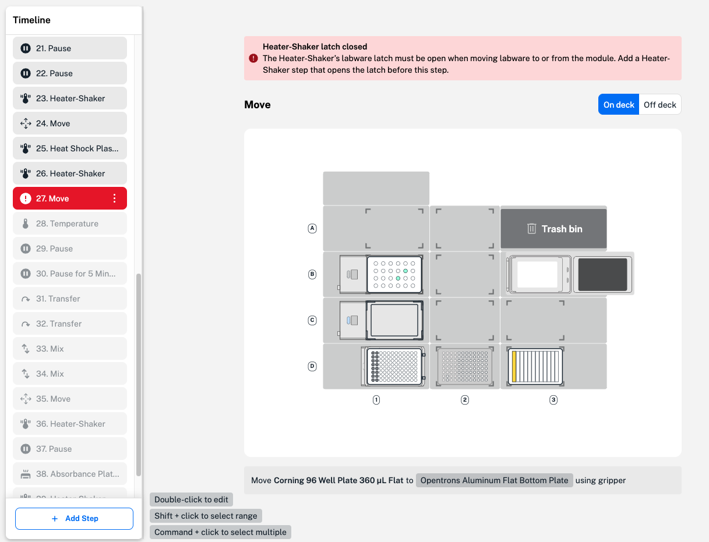

To prevent errors, Protocol Designer displays hints, warnings, and error descriptions as you create a protocol. This section covers types and causes of warnings and errors in Protocol Designer. 

## Warnings

Warnings in Protocol Designer alert you to a potential problem with a protocol step. In the example below, 4 source wells have been selected for a liquid transfer to 16 destination wells. Protocol Designer includes a warning in the transfer step form because this well selection, or ratio of source to destination wells, isn't allowed. 

<figure class="screenshot" markdown>
  
  <figcaption>Incompatible well ratio in a transfer step.</figcaption>
</figure>

The step warning appears in a red text box at the top of the step form. In most cases, the warning includes a description of the issue or action needed to resolve the warning. To quickly resolve this step warning, change the well selection to just one source or destination well. 

In some cases, a step warning appears after creating a step. If a transfer step aspirates more liquid than is available in the source well, a step warning is included only after the step has been saved and analyzed by Protocol Designer. To view and resolve the warning, double-click the step to reopen the form and edit. 

Many step warnings shown by Protocol Designer will not affect the function of your protocol steps. You can save and run a protocol on the robot with these warnings present. For example, the robot can still aspirate and dispense your chosen amount of liquid, even if it overflows a destination well. We recommend resolving all warnings to avoid problems in your workflow. 

## Errors

A protocol error represents a larger problem in the protocol timeline. Although you can save, download, and import your protocol into the Opentrons App, a protocol with an error cannot be run on the robot and will cause a run to fail. 

A protocol error appears in a red text box above the deck map and, like a warning, includes a description of the error and required actions to resolve it. Most errors in Protocol Designer are caused by the order of steps or changes to the protocol timeline. Any labware, liquids, or modules that you edit or delete on the protocol starting deck can also cause errors for each protocol step they are used in. 

<figure class="screenshot" markdown>
  
  <figcaption>The Flex deck doesn't have enough tips to complete the transfer step.</figcaption>
</figure>

In this example, not enough tips are available on the deck to complete the number of transfers. Because the robot cannot complete the protocol as is, Protocol Designer displays a protocol error. To resolve the error, add more tips to the protocol starting deck or change tip management settings in the transfer step form. 

When designing your protocol, consider the order the labware and modules should interact in to avoid protocol errors. 

<figure class="screenshot" markdown>
  
  <figcaption>Labware can't be moved to the Heater-Shaker module when the labware latch is closed.</figcaption>
</figure>

For example, the labware latch of the Heater-Shaker needs to be open to move labware to and from the module. Before heating or shaking, the latch needs to be closed. To resolve this errors, add a Heater-Shaker step to open the labware latch or drag and drop to change the order of steps. 