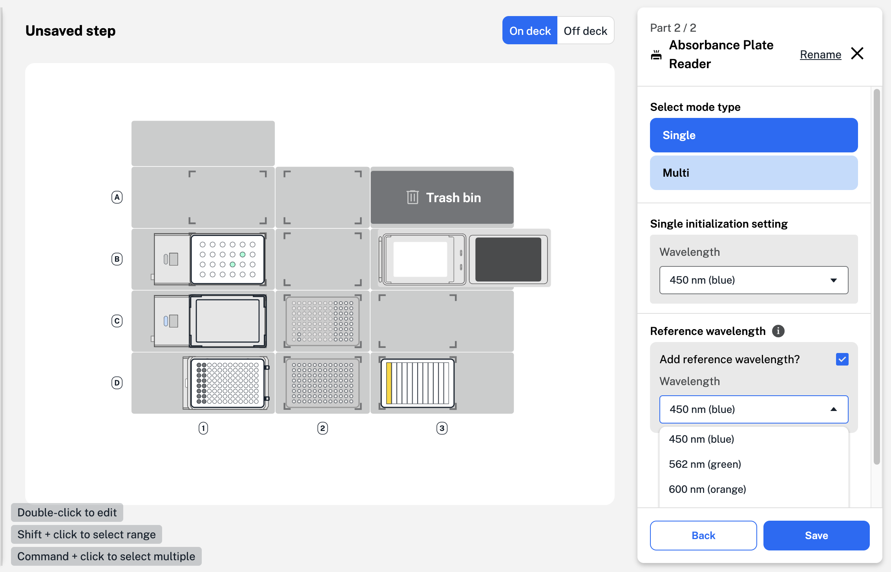
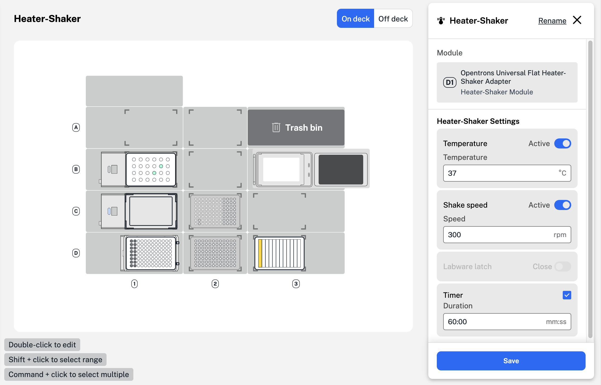
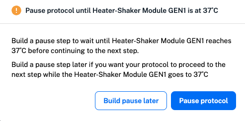
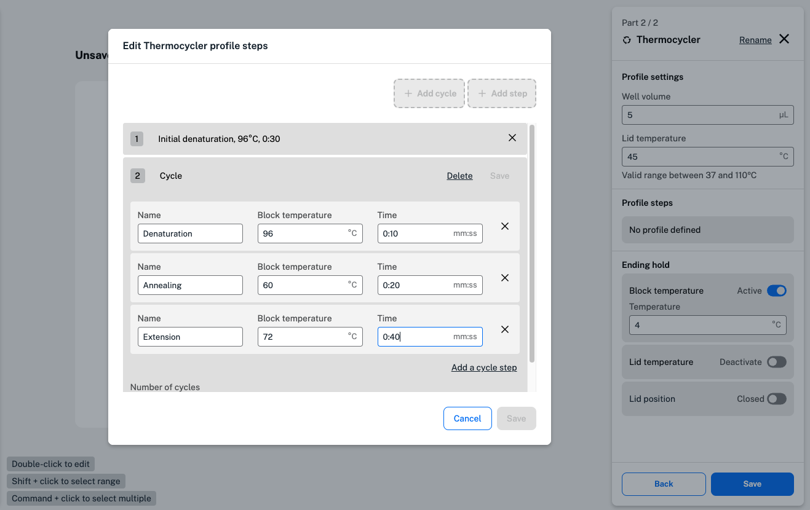

When you add modules to the robot deck, available module steps appear in the "Add step" menu. Protocol Designer supports the use of the following modules:

| Module and generation | Opentrons Flex | Opentrons OT-2 |
| --------------------- | :--------------: | :--------: |
| Absorbance Plate Reader Module GEN1 | :octicons-check-16: | :octicons-x-16: |
| Heater-Shaker Module GEN1 | :octicons-check-16: | :octicons-x-16: |
| Magnetic Module GEN1 | :octicons-x-16: | :octicons-check-16: |
| Magnetic Module GEN2 | :octicons-x-16: | :octicons-check-16: |
| Magnetic Block GEN1 | :octicons-x-16: | :octicons-check-16: |
| Temperature Module GEN1 | :octicons-x-16: | :octicons-check-16: |
| Temperature Module GEN2 | :octicons-check-16: | :octicons-check-16: |
| Thermocycler Module GEN1 | :octicons-x-16:| :octicons-check-16: |
| Thermocycler Module GEN2 | :octicons-check-16: | :octicons-check-16: |

You can add multiple modules of the same type only on the Flex. Only one Thermocycler can be used on the Flex and the OT-2. 

## Absorbance Plate Reader Module steps

You'll need a Flex Gripper to add an Absorbance Plate Reader Module to your protocol starting deck. To prevent damage, only the gripper can move the lid on and off the Absorbance Plate Reader. The gripper automatically places the lid to the right of the plate reader, in deck column 4. 

To use an Absorbance Plate Reader Module in a Protocol Designer protocol, you'll need to initialize the Plate Reader, move a plate to the module, and read the plate using your chosen wavelength settings. 

Follow the instructions to add a total of six Absorbance Plate Reader steps to your protocol. 

1. Add an Absorbance Plate Reader step to close the lid. In the step form, click to **Change lid position**. Click **Continue** and use the toggle switch to change the lid position from open to closed. The gripper will close the lid with no labware inside.

2. Use a second Absorbance Plate Reader step to initialize the module. Click **Define initialization settings** and choose a single or multiple initialization wavelengths from the dropdown menu. 
    Custom wavelengths between 350–1000 nanometers are supported. When using a single wavelength, you can add a reference wavelength for normalization or to correct for background interference. Your chosen settings appear as the current initialization settings when you add another Absorbance Plate Reader step.
    
    !!! Note
        To initialize the Absorbance Plate Reader, the module must be empty with the lid closed. Remove any labware and use a Plate Reader step to close the lid. 
    

    <figure class="screenshot" markdown>
    
   <figcaption>Add a single initialization and a reference wavelength in a Plate Reader step.</figcaption>
   </figure>

3. Add an Absorbance Plate Reader step to open the lid using the gripper. The Plate Reader lid must be open to add labware to the module. 

4. Use a move step to move your plate to the Absorbance Plate Reader. You can add labware to the module manually or using the gripper. 

    Most 96-well plates from the Opentrons [Labware Library](https://labware.opentrons.com "Labware Library") are supported. 

5. Add an Absorbance Plate Reader step to read the plate in the module. Click **Read labware** to collect absorbance data for the samples in your plate. 

    **Read labware** is only available if the Plate Reader is initialized, with a plate inside and the lid closed. 

6. Enter a name for your CSV file. You can find this file and any previous Absorbance Plate Reader data in your robot's recent protocol runs in the Opentrons App. 

    Data from this CSV file can be used in your Python protocols created outside of Protocol Designer.

    After reading your plate, follow the same steps to open the lid, remove the plate, and close the Absorbance Plate Reader lid with the gripper. 

## Heater-Shaker Module steps

Adding a Heater-Shaker Module step to your protocol displays any labware and adapters currently on the module. 

<figure class="screenshot" markdown>
  
  <figcaption>Add a temperature, shake speed, and timer for a Heater-Shaker step.</figcaption>
</figure>

In this example, a Corning 96-well flat plate is placed on top of an Opentrons universal flat Heater-Shaker adapter. Both are on the Heater-Shaker in deck slot D1. Before moving labware to or from the Heater-Shaker, make sure that the labware latch is open. Add a Heater-Shaker step that opens the labware latch before any step that moves labware to the Heater-Shaker. Without this step, a [timeline error](warnings-errors.md#errors) could occur. 

In the Heater-Shaker step form, set the temperature or shake functions to **Active** and enter a custom value for temperature or shake speed. The Heater-Shaker module can heat samples between 37 and 95° C, and shake samples between 200 and 3000 rpm. 

Set a custom time for your Heater-Shaker step by enabling the timer. The timer will begin after the Heater-Shaker reaches the target temperature or shaking speed. 

If your Heater-Shaker Step doesn't include a set time, Protocol Designer will ask how to pause your protocol. Because reaching a target temperature takes more time than changing the shaking speed, you can set the Heater-Shaker to reach a target temperature while your protocol proceeds to the next step. 

<figure class="screenshot" markdown>
  
  <figcaption>Build a pause step now or later in your protocol.</figcaption>
</figure>

You can choose to:

* pause your protocol until the Heater-Shaker reaches the set temperature. 
* build a pause step later in your protocol. 

Building a pause step later allows the robot to continue
your protocol while the module reaches the set temperature. 

After your Heater-Shaker step, follow the same steps to deactivate
the temperature and shake functions, open the labware latch, and
move your labware. 

## Temperature Module steps

Adding a Temperature Module step to your protocol displays any
labware and adapters currently on the module. Aluminum blocks or
a deep well adapter can be used to add labware to the module.
Click to set the module state and enter a temperature between
4 and 95 °C. 

After your Temperature module step, add a second step to
deactivate the module. Just like in a Heater-Shaker step, you
can choose to pause your protocol until the Temperature module
reaches the set temperature, or build a pause step later in
your protocol.

## Thermocycler Module steps 

Adding a Thermocycler Module step to your protocol opens a
two-part Thermocycler form. First, choose whether to change
the state of the Thermocycler module or to program a profile.
Changes to the module state include simple changes like opening
the lid or setting an initial lid temperature, while programming a
profile sets timed temperature cycles for your experiment.

Click **Change Thermocycler state** to set a block or lid
temperature, or to open or close the lid. You can set the block at
any temperature between 4 and 99 °C and the lid at any
temperature between 37 and 110 °C. 

Click **Program a Thermocycler profile** to choose parameters for
your experiment. Start by entering values for your individual well
volume and initial lid temperature. Click **No profile defined** to open
the profile steps menu.

<figure class="screenshot" markdown>
  
  <figcaption>Add a cycle of temperature holds within a Thermocycler step.</figcaption>
</figure>

Click **Add step** to create a step, like an initial denaturation, that only needs to happen once. Choose a block temperature, time, and name for your step. 

Cycles are made up of steps that are repeated a set number of times
in your experiment. Click **Add cycle** to add steps to a cycle. At the
bottom of the menu, enter the number of times the cycle should
repeat before saving your work. Define the ending hold after all
cycles and steps are complete with a block temperature, lid
temperature, and lid position before saving your Thermocycler
Module step. 

When adding a Thermocycler Module step, labware in the module is not automatically displayed. Load labware in the Thermocycler on the protocol starting deck or move your labware to the Thermocycler module in a move step. To move labware to and from the Thermocycler, first open the lid by clicking **Change Thermocycler state**.

