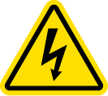
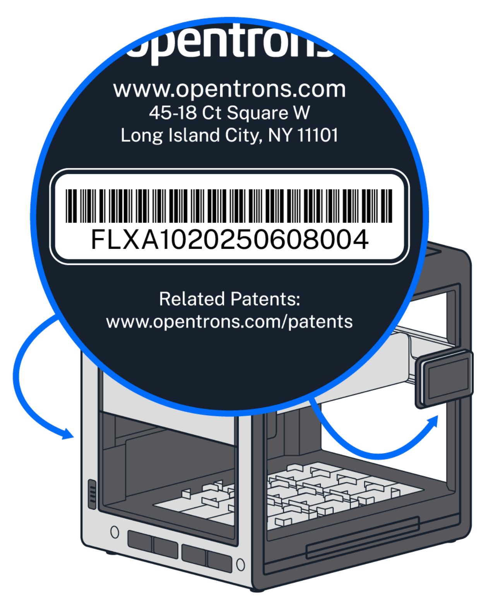

# Safety Information and Regulatory Compliance

Opentrons recommends that you follow the safe use specifications listed in this section and throughout this manual.

## General Safety Guidelines

The Stacker is designed for laboratory use by trained personnel only. Use this product only as specified. Review the safety information before installing or operating this module. This information can help you operate the Stacker safely and avoid damage to it or any other attached equipment. If the Stacker is used in a manner not specified by Opentrons, the protection provided by the equipment may be impaired.

## Instrument Safety Warnings

Various labels on the Stacker or in this manual warn you about sources of potential injury or harm.

<table>
    <tr>
        <th>Symbol</th>
        <th>Description</th>
    </tr>
    <tr>
        <td></td>
        <td><strong>Warning</strong> or <strong>Caution</strong> alerts users about:
            <ul>
                <li>Potentially hazardous conditions.</li>
                <li>Equipment damage.</li>
                <li>Actions that may result in personal injury or death.</li>
                <li>Potentially lost or corrupted data.</li>
                <li>An unrecoverable interruption of the operation being performed.</li>
            </ul>
        </td>
    </tr>
    <tr>
        <td></td>
        <td><strong>Electrical shock</strong>: alerts users about instrument components that might pose a risk of electrical shock if the instrument is handled improperly.</td>
    </tr>
    <tr>
        <td></td>
        <td><strong>Heavy object</strong>: alerts users about potentially heavy objects that may require 2 people to lift properly.</td>
    </tr>
</table>

### Power Supply

The Flex Stacker has the following power input and output requirements, which are met by the included power/data hub.

#### Input

- 100–240 VAC, 50/60 Hz
- 6.4 A/115 VAC, 3.2 A/230 VAC
- Mains fluctuation: ± 10%
- Overvoltage: Category III

#### Output

- Each connection: 2.7 A
- Total: 8.3 A (maximum)

### Electrical Safety Warnings

Always observe the following electrical safety warnings.

<table>
    <tr>
        <th>Symbol</th>
        <th>Description</th>
    </tr>
    <tr> <td></td>
        <td>Plug the Stacker into a grounded, Class 1 circuit. The module is grounded through the grounding conductor of the power cable. Do not:
            <ul>
                <li>Damage, disable, or remove the ground connection on the power cable.</li>
                <li>Replace the AC power cable unless at the direction of Opentrons Support.</li>
            </ul>
        </td>
    </tr>
    <tr>
        <td></td>
        <td>Do not connect (plug in), disconnect (unplug), or use AC power cables if:
            <ul>
                <li>The cable is frayed or damaged.</li>
                <li>Other attached cables, cords, or receptacles are frayed or damaged.</li>
            </ul>
            Using damaged power cords can cause an electric shock hazard resulting in serious injury or damage to the robot.
        </td>
    </tr>
    <tr>
        <td></td>
        <td>Risk of electric shock. Power/data hub components can remain charged even after the unit is disconnected from mains power. Do not attempt to open or repair the power/data hub.</td>
    </tr>
</table>

## Standards Compliance

The Flex Stacker has been tested and found to be in compliance with all applicable requirements of the following standards.

### Safety

| Rule ID | Title |
|----|----|
| IEC/UL/CSA 61010-1 | Safety Requirements for Electrical Equipment for Measurement, Control, and Laboratory Use–Part 1: General Requirements |
| IEC/UL/CSA 61010-2-051 | Safety Requirements for Electrical Equipment for Measurement, Control and Laboratory Use - Part 2-051: Particular Requirements for Laboratory Equipment for Mixing and Stirring |

### Electromagnetic Compatibility

| Rule ID | Title |
|----|----|
| EN/BSI 61326-1 | Electrical Equipment for Measurement, Control, and Laboratory Use–EMC Requirements–Part 1: General Requirements |
| FCC 47 CFR Part 15 Subpart B Class A | Equipment Authorization of Unintentional Radiators |
| IC ICES-003 | Spectrum Management and Telecommunications–Interference-Causing Equipment Standard–Information Technology Equipment (Including Digital Apparatus) |

### Hazardous Substances

RoHS3 compliant.

### FCC Warnings and Notes

Warning: Changes or modifications to this module not expressly approved by Opentrons could void the user’s authority to operate the equipment. This device complies with part 15 of the FCC Rules.

Note: This equipment has been tested and found to comply with the limits for a Class A digital device, pursuant to part 15 of the FCC rules. These limits are designed to provide a reasonable protection against harmful interference when the equipment is operated in a commercial environment. This equipment generates, uses, and can radiate radio frequency energy and, if not installed and used in accordance with the instruction manual, may cause harmful interference to radio communications. Operation of this equipment in a residential area is likely to cause harmful interference in which case the user will be required to correct the interference at their own expense.

### Canada ISED ICES–003(A)/NMB–003(A)

This product meets the applicable Innovation, Science and Economic Development Canada technical specifications.

Le présent produit est conforme aux spécifications techniques applicables d’Innovation, Sciences et Développement économique Canada.

### CISPR 11 Class A

Caution: This equipment is not intended for use in residential environments and may not provide adequate protection to radio reception in such environments.

### WEEE Policy

<figure markdown="span" style="float: right; width: 10%;">
    
</figure>

Opentrons is dedicated to adhering to the EU Directive on Waste Electrical and Electronic Equipment (WEEE – 2012/19/EU). Our goal is to ensure that our products are properly disposed of or recycled once they reach the end of their useful life. 

Opentrons products that fall under the WEEE directive are labeled with the {: style="vertical-align: middle; height: 1.25em;"} symbol, signifying that they should not be thrown away with regular household waste but must be collected and handled separately.

### Environmental Warning

Cancer and reproductive harm – [www.P65Warnings.ca.gov](https://www.p65warnings.ca.gov/).

## UV Safety Features

You can install and use Stackers with the [Opentrons Flex HEPA/UV Module](https://opentrons.com/products/opentrons-flex-hepa-uv-module). Newer Flex models, the HEPA/UV module, and the Stacker all include features that help protect you from UV-C exposure and prevent the UV lights from operating unsafely.

| Safety feature | Description |
|----|----|
|Side panels | The replacement side panel that comes with the User Kit is opaque to UV-C light. The other panels on the robot block UV-spectrum light to below a level which represents an exposure risk. |
| Attachment sensors | The Stacker and HEPA/UV Module each use sensors and switches to determine if they’re installed properly. These devices deactivate/disable the UV lights when the Stacker door is open, or these components are improperly installed, removed during operation, or misaligned.|

## Stacker and HEPA/UV Compatibility

Flex robots manufactured before September 2025 require an upgrade kit. This kit adds new hardware to your Flex, preventing the HEPA/UV module from operating if the Stacker is improperly installed.

Refer to your robot's serial number to determine if an upgrade is required. Robots with a version identifier of A30 or higher are compatible with the Stacker and the HEPA/UV Module without the kit. For example, serial number FLX**A30**20250902003 indicates HEPA/UV compatibility, whereas robots with A20 or A10 version identifiers require an upgrade.

{width="50%"}

The serial number can be found on the certification sticker on the back of each Flex near the on/off switch, or under the touchscreen, or in the Opentrons App under the **Advanced** tab.

Contact [Opentrons Sales](https://opentrons.com/contact) if you're unsure about your robot's manufacture date and/or have a robot that needs to be upgraded.
