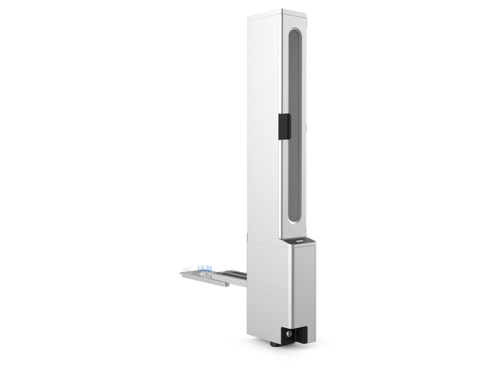

<!-- If there's a new logo .svg please provide it. -->

# Stacker Module GEN1 Instruction Manual

    <strong>Opentrons Labworks Inc</strong> August 2025

## Product Description

The Opentrons Flex® Stacker is an external module that provides automated, high-capacity storage for ANSI/SLAS compatible labware such as well plates, tip racks, and reservoirs. It also includes a shuttle that moves labware from the Stacker to the deck where it can be accessed manually or by the Flex Gripper. While ideal for high-throughput NGS workflows, the Stacker can help streamline a wide range of automated liquid handling protocols. When attached, the Stacker increases your robot’s labware storage capacity and throughput, allowing you to run longer, more complex protocols without interruption. Each Flex supports up to four attached Stackers.
