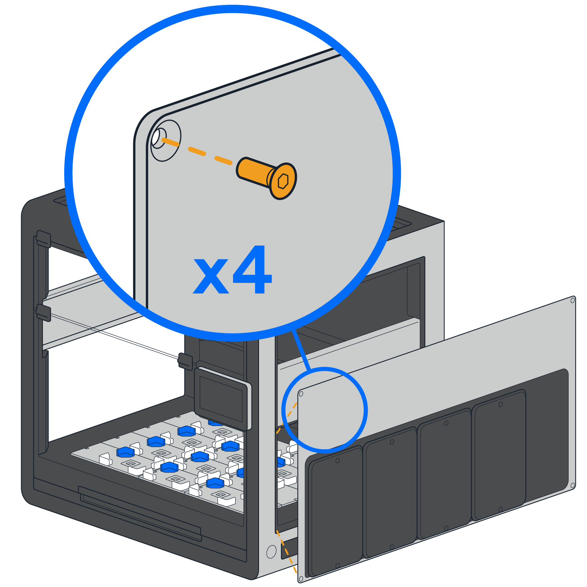
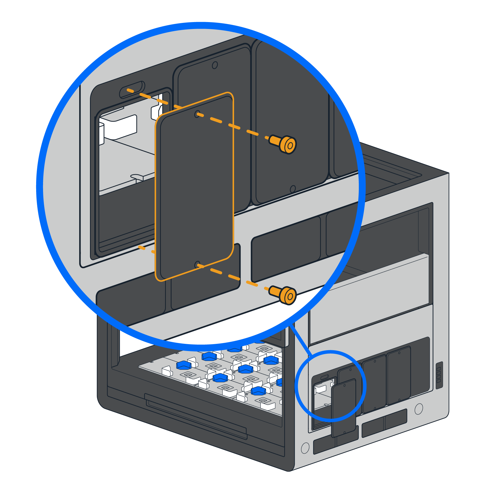
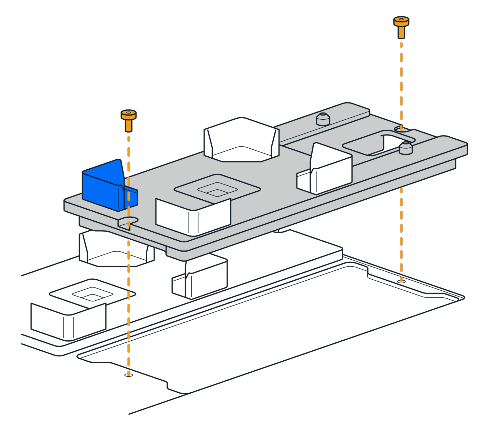
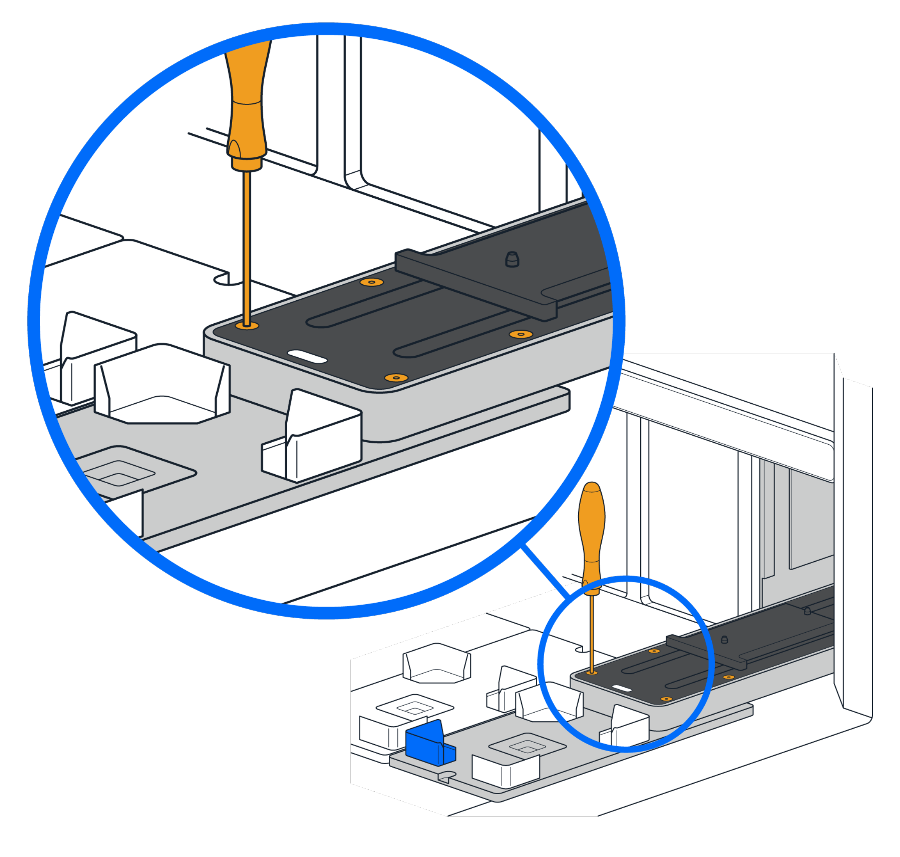

# Installing the Stacker

Before you begin, make sure you've read and are familiar with the information provided in the [Pre-Installation Information section](preinstall.md).

## Part 1: Unboxing the Stacker

Your Stacker ships in two separate  boxes; one contains the module, and the other includes a special User Kit. Follow these instructions to begin:

1. Open the shipping boxes and remove the internal boxes that hold the Stacker and User Kit.

1. Open the Stacker's box and the User Kit. Remove any additional shipping and packaging material inside these boxes.

## Part 2: Replacing the Side Window Panel

The Stacker attaches to the right side of your robot and requires a replacement window panel. This panel blocks UV-C light from an installed Flex HEPA/UV module. Follow these instructions to replace the side window panel. If this panel is already in place from a previous Stacker installation, skip to [Step 6](#identify-access-panels).

3. Turn off the power to the robot.

1. Remove the screws holding the lower right side window panel in place and detach the panel. Save it for future use.

1. Take the replacement side panel from the User Kit and attach it to the robot. You can re-use the original window screws or the screws that ship in the User Kit. When attaching the panel ensure the beveled (V-shaped) holes in the replacement panel face out, towards you.

    !!!tip
        Hand tighten the screws until the window panels are reasonably secure. This is not a trial of strength. Excessive torque may damage the screws.

    {: .img-medium }

    !!!Note
        A properly attached panel fits flush and square to the robot's frame, without gaps or misalignment. This helps ensure a good connection between the safety interlock pins on panel and Flex.

6. After attaching the replacement window, identify the four, smaller access panels on the window. Select the panel that matches the deck slot where you will attach the Stacker.

    {: .img-medium }

7. Remove the 2 screws from your selected access panel and detach it. Save the screws and panel for future use.

## Part 3: Attaching the Stacker

With the new window panel in place, it's time to install a deck plate adapter and attach the Stacker to the robot.

!!!Warning "Warning: Heavy Object"
    The Stacker is heavy. Ask a lab partner to assist with lifting and attaching this module.

To install the deck adapter and attach the Stacker:

8. Unscrew the deck plate from the slot in column 3 that matches the previously removed window access panel.

1. Replace the deck plate with the Stacker's deck slot adapter and screw it in place. You can re-use the original deck plate screws or the screws that ship in the User Kit.

    {: .img-medium }

    !!!note
        Use the Waste Chute adapter if you want to use the Waste Chute and Stacker in adjacent slots (D3 and D4).

1. Insert the Stacker through the access panel opening and lower it onto the adapter plate alignment pins. The module should be flush against the adapter plate when properly seated.

    {: .img-medium }

1. Fasten the 4 captive screws on the track to the deck slot adapter to secure the Stacker in place.

    {: .img-medium }

1. Remove the packing tape from the Stacker door and peel the protective film from the door window.

## Part 4: Connecting the Hub and Cables

After attaching the Stacker to the robot, you can connect all the cables and turn on the power. See [Physical Connections](preinstall.md#physical-connections) for more information about the type and purpose of each cable. To connect the power and data cables to the hub:

13. Remove the power/data hub from the User Kit. Place it with its back flush against the robot.

    !!!note
        * Keep the area around the hub free from obstacles that could prevent easy access to the main power switch or Emergency Stop Pendant (E-stop).
        * To help with heat dissipation, do not place labware or other objects on top of the hub.

1. Retrieve the various cables from the Stacker box and User Kit. Start connecting the supplied cables as described below.

    !!!warning
        _Do not force cable connections_. Aligned cables attach easily; misaligned cables do not.

    <table>
        <tr>
            <th>Cable</th>
            <th>Connection instructions</th>
        </tr>
        <tr>
            <td>Power/Data</td>
            <td>
                <ul>
                    <li>Connect one end of the cable to the Stacker's power/data port.</li>
                    <li>Connect the other end of the cable to a labeled port (S-1, S-2, S-3, S-4) on the power/data hub.</li>
                </ul>
            </td>
        </tr>
        <tr>
            <td>USB</td>
            <td>
                <ul>
                    <li>Connect one end to any open USB-A port on the right side of the Flex (ports 5–8).</li>
                    <li>Connect the other end to the USB-B port on the power/data hub.</li>
                </ul>
            </td>
        </tr>
        <tr>
            <td>E-stop/AUX</td>
            <td>
                <ul>
                    <li>Disconnect the E-stop from its AUX port on the robot.</li>
                    <li>Connect the E-stop to the **AUX In** port on the power/data hub.</li>
                    <li>Connect the Stacker's AUX cable to the AUX Out port on the power/data hub and then to any open AUX port on the back of the robot.</li>
                </ul>
            </td>
        </tr>
        <tr>
            <td>IEC power cable</td>
            <td>Connect one end of the power cable to the power/data hub and connect the other end to a wall outlet.</td>
        </tr>
    </table>

1. Check each cable to make sure it's connected securely and turn on the power to your Flex and the Stacker.

## Next Steps

See [Post-Installation Procedures](postinstall.md). The information in that section will help you finish setting up your Stacker.
