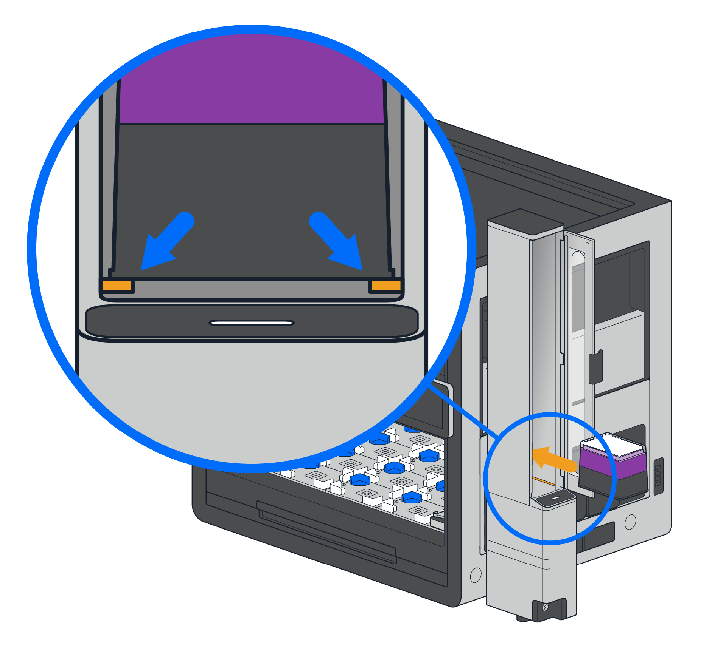

## Loading Labware

To load the Stacker, open the loading door and place your labware inside the unit. The first piece of labware rests on two latches inside the Stacker. You place additional labware on top of the labware already loaded in the module. Each Stacker should contain one type of labware only.

{: .img-medium }

Instructions on the touchscreen will also provide information about how to load the Stacker.

## Unloading Labware

To unload the Stacker, open the loading door and remove labware from the module, starting from the top.
