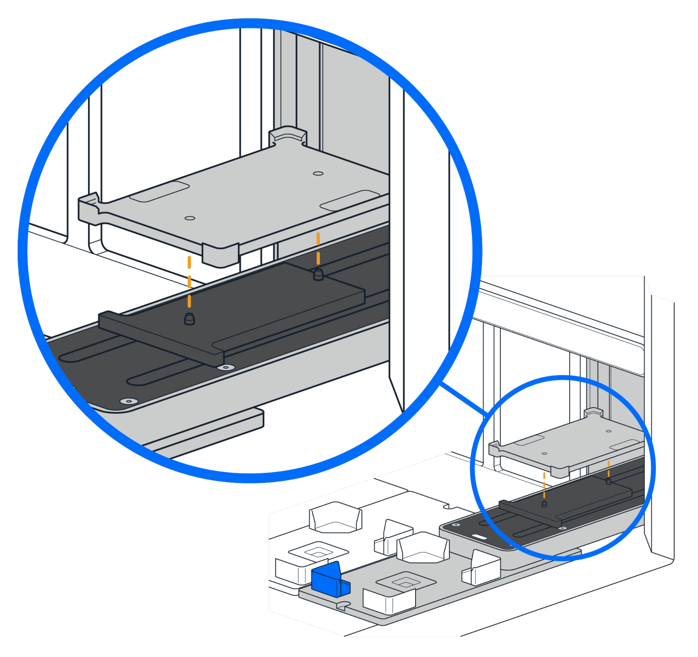

# Post-installation Procedures

## Touchscreen Instructions

After attaching and powering on the robot and Stacker, instructions on the touchscreen will guide you through these final steps:

- Updating firmware, if required.
- Mapping the Stacker's deck location.
- Attaching the labware shuttle to the track.

## Attaching the Shuttle

During the touchscreen configuration process, Flex will move the track from its storage position inside the Stacker to its home position in column 4. After homing, you can place the shuttle on the track.

{: .img-medium } <!-- width 70%; height auto-->

To ensure a proper fit, align the pins on the track to corresponding holes on the shuttle. Magnets on the shuttle help hold it in place.
