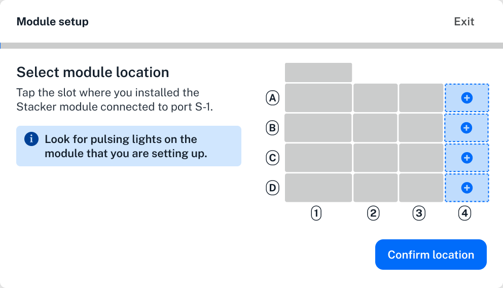
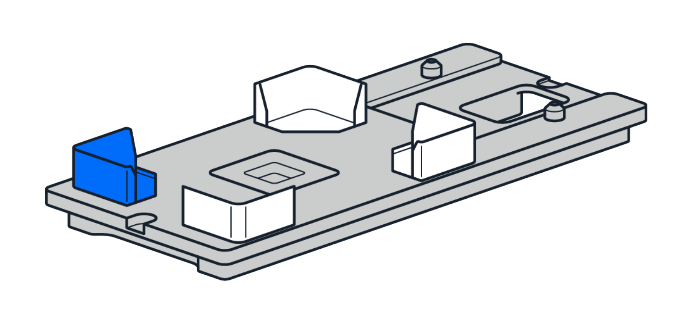
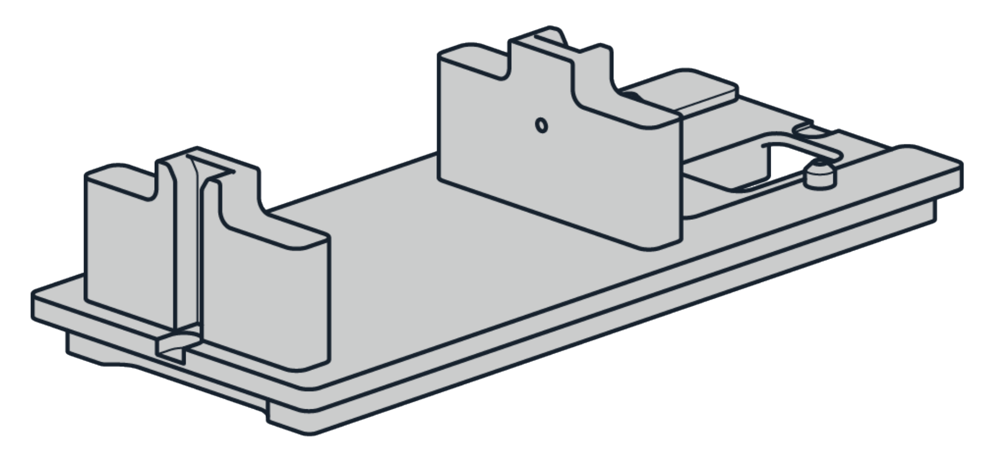
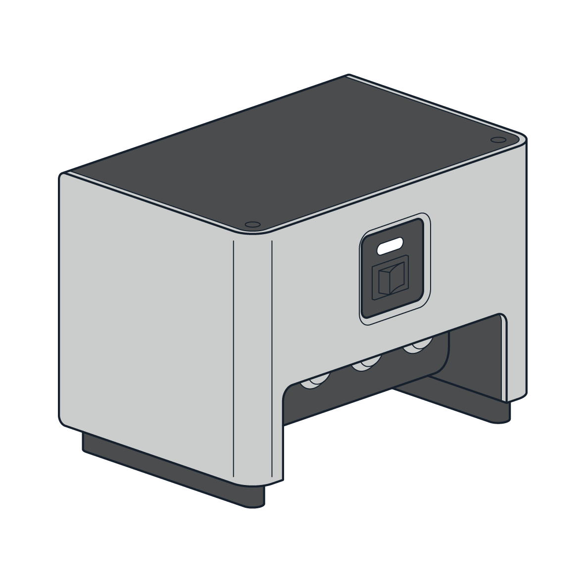

# Pre-installation Information

Review this section for important information about Stacker placement, deck adapters, the power/data hub, and other components.

## Deck Locations

You attach a Stacker to the right side of the robot with its deck slot adapter. You can install the adapter in any available column 3 deck slot (A3 to D3). The adapter also provides labware storage in column 3, so you don’t lose any deck space.

Once attached, the Stacker becomes part of column 4, like a [staging area slot](https://opentrons.com/products/opentrons-flex-deck-expansion-set-4-count). Refer to deck coordinates for column 4 (A4 to D4) when programming the robot to access the Stacker. See [Hardware Modules](https://docs.opentrons.com/v2/new_modules.html) in our API documentation for more information.

After your Stacker is attached to the deck and powered on, instructions and animated images on the touchscreen take you through a guided setup.

<figure class="screenshot">
    
</figure>

Because you can install a Stacker anywhere in column 4, and connect it to any port on the power/data hub, the touchscreen setup process gives you the opportunity to tell Flex where this module is on the deck. See [Post-Installation Procedures](postinstall.md).

## Deck Adapters

Each Stacker ships with its own deck plate adapter. The adapter secures the Stacker to the deck of your robot.

{: .img-medium }

A separate Waste Chute Adapter (shown below) allows you to install the Stacker and the [Waste Chute](https://opentrons.com/products/opentrons-flex-waste-chute-gen1) in adjacent slots (D3 and D4).

{: .img-medium }

## Power and Data Hub

This external component provides power to the Stacker and bidirectional data connectivity between each attached Stacker and your Flex.

{: .img-medium }

All the module's power and data cables route through the hub, which can support up to four Stackers on the same robot. The on/off switch on the hub controls power to all connected Stackers. The four labeled ports (S-1 through S-4) help you identify each Stacker's deck location during setup.

### Physical Connections

The following illustration shows the physical cable connections on the hub. [Part 4 of the installation instructions](installation.md#part-4-connecting-the-hub-and-cables) will provide more information about how to connect these cables.

The following table lists and describes the function of each cable.

<table>
    <tr>
        <th>Cable</th>
        <th>Purpose</th>
        <th>Notes</th>
    </tr>
    <tr>
        <td>USB-A to USB-B</td>
        <td>Bidirectional data communication.</td>
        <td>A single USB cable connects the hub to a Flex. It completes the data communication path between an attached Stacker and the robot.</td>
    </tr>
    <tr>
        <td>AUX</td>
        <td><a href="https://insights.opentrons.com/hubfs/Products/Flex/Opentrons%20Flex%20manual%20REV3.pdf#page=61">Emergency Stop Pendant</a> (E-stop) and power/data hub connections.</td>
        <td>
            
This is a 12-pin threaded connector that connects the E-stop to the hub and the hub to the robot.

            
When attaching the E-stop or AUX cable, look for an arrow on the connector. This is an alignment mark. This mark should be facing up and towards the AUX port.

            
Turn the knurled collar clockwise to tighten the cable and counterclockwise to loosen it.

        </td>
    </tr>
    <tr>
        <td>IEC power cable</td>
        <td>Mains power connection from a wall outlet to the power/data hub.</td>
        <td>This is a region-specific power cable that ships with the Stacker. It conforms to International Electrotechnical Commission (IEC) standards.</td>
    </tr>
    <tr>
        <td>Power/Data</td>
        <td>Power and bidirectional data communication.</td>
        <td>When attaching this cable, look for a small red dot on the end of the connector. This is an alignment mark. It should be facing upwards when you attach the cable.</td>
    </tr>
</table>

## Installing Multiple Stackers

The [installation instructions](installation.md) in this guide assume you're installing one Stacker only. If you're installing multiple Stackers on the same Flex:

* Attach only one Stacker at a time. Complete all of the installation and post-installation procedures before installing the next module.
* Attach Stackers from the rear (A4) to the front (D4). This prevents the need to work around previously installed modules.
