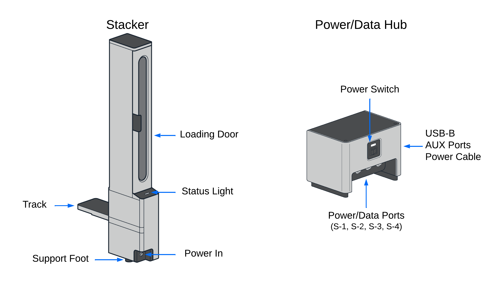
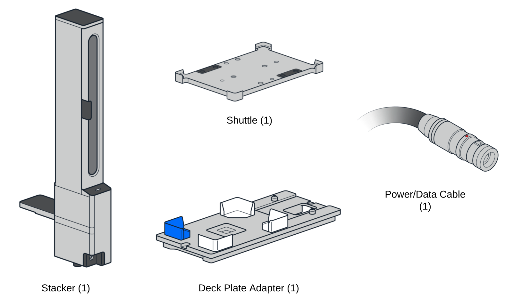
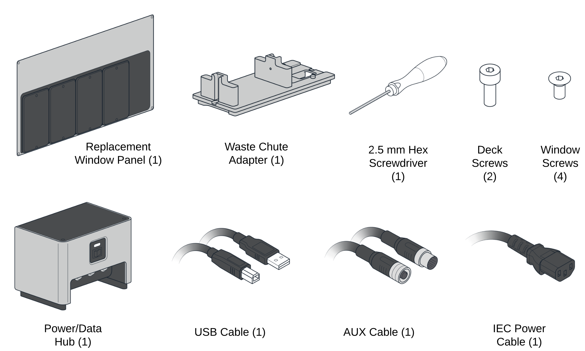

# Product Specifications

## Stacker Box Parts

The Stacker is packaged separately from the User Kit and ships with its own set of parts. The Stacker box contains the following items:

## User Kit Parts

The User Kit is packaged separately from the Stacker and ships with its own set of parts. Each kit supports up to 4 Stackers. The User Kit contains the following items:

## Physical Specifications

<table>
    <tr>
        <th><strong>Tower and track dimensions</strong></th>
        <td>385.5 mm L x 106 mm W x 955.5 mm H (~15” L x 4” W x 37” H)</td>
    </tr>
    <tr>
        <th><strong>Tower dimensions</strong></th>
        <td>194.5 mm L x 106 mm W x 955.5 mm H
(~8” L x 4” W x 37” H). Measurements are taken from the base of the tower and exclude the track.</td>
    </tr>
    <tr>
        <th><strong>Side clearance</strong></th>
        <td>When attached, this module extends approximately 20 cm (8”) from the side of the robot. You’ll also need additional clearance for the Stacker’s loading door, which requires slightly more space to open fully and to allow for easy labware loading.</td>
    </tr>
    <tr>
        <th><strong>Weight</strong></th>
        <td>13.6 kg (~30 lbs). Installation may require the assistance of a lab partner.</td>
    </tr>
</table>

## Environmental Specifications

The following table lists the environmental conditions for recommended use, acceptable use, and storage.

|    | Recommended | Acceptable | Storage and transportation |
|----|----|----|----|
| Ambient temperature | +20 to +25 °C | +2 to +40 °C | -10 to +60 °C |
| Relative humidity | 40–60%, non-condensing | 30–80%, non-condensing (below 30 °C) | 10–85%, non-condensing (below 30 °C) |
| Altitude | Approximately 500 m above sea level | Up to 2000 m above sea level | Up to 2000 m above sea level |
| Pollution degree | 2 or lower | 2 or lower | 2 or lower |

!!!info "Info: Pollution Degree"
    Pollution degree is a measure of the contaminants that could occur in the environment around and within this module. The Stacker is designed for indoor use in dry locations with a pollution degree of 2 or lower where only dry, non-conductive pollution is present and only temporary condensation occurs.

## LED Status Lights

Status lights on the Stacker provide at-a-glance information about its operations. The colors and illumination patterns listed below indicate all of the possible operating states.

<table>
    <tr>
        <th>LED color</th>
        <th>Stacker status</th>
    </tr>
    <tr>
        <td> White</td>
        <td>A white light indicates a neutral operation state. For example:
            <ul>
                <li>Solid white: idle.</li>
                <li>Pulsing white: busy (e.g., starting, updating, or canceling an operation).</li>
            </ul>
        </td>
    </tr>
    <tr>
        <td> Green</td>
        <td>A solid green light indicates a protocol is running.</td>
    </tr>
    <tr>
        <td> Blue</td>
        <td>A pulsing blue light indicates a Stacker requires attention (e.g., for empty/fill commands, door open, identification).</td>
    </tr>
    <tr>
        <td> Red</td>
        <td>A pulsing red light indicates a stall or other type of error condition.</td>
    </tr>
</table>

## Supported Labware

The Stacker accepts Opentrons Flex tip racks, selected items in our [Labware Library](https://labware.opentrons.com/), and well plates and reservoirs that conform to ANSI/SLAS dimensional standards. The following table lists labware that has been tested and verified by Opentrons to work with the Stacker.

!!!note
    To help ensure reliable Stacker operations, test any well plates or reservoirs not listed in the compatibility table before running a protocol.

<table>
    <tr>
        <th>Labware category</th>
        <th>Stacker-compatible labware</th>
    </tr>
    <tr>
        <td>Pipette tips</td>
        <td>All <a href="https://opentrons.com/products/categories/tips-&-labware">Opentrons Flex tip racks</a>:
            <ul>
                <li>50 µL, 200 µL, and 1000 µL tips</li>
                <li>Filtered and unfiltered tips</li>
                <li>With or without lids</li>
            </ul>
        </td>
    </tr>
    <tr>
        <td>Well plates</td>
        <td>
            <ul>
                <li>Opentrons Tough 96 Well Plate 200 µL PCR Full Skirt</li>
                <li>Bio-Rad 96 Well Plate 200 µL PCR</li>
                <li>Bio-Rad 384 Well Plate 50 µL</li>
                <li>Corning 24 Well Plate 3.4 mL Flat</li>
                <li>NEST 96 Deep Well Plate 2 mL</li>
                <li>NEST 96 Well Plate 100 µL PCR Full Skirt</li>
                <li>NEST 96 Well Plate 200 µL Flat</li>
                <li>ThermoFisher Armadillo PCR Plate, 384-Well, Clear Wells</li>
            </ul>
        </td>
    </tr>
</table>

!!!warning
    Do not put microcentrifuge tubes, PCR tubes, tube racks, or custom labware in the Stacker.
