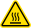

Opentrons recommends that you follow the safe use specifications in this section and throughout this manual.

## Safe Use Specifications

### Input and Output Connections

The Thermocycler requires the following power input, met by the included power supply.

!!!warning
    Do not replace the power supply cable unless directed by Opentrons Support.

### Power supply (AC)

- **Voltage**: 100–240 V
- **Frequency**: 50/60 Hz
- **Current**: 8.5–5 A
- **Overvoltage**: Category II

### Environmental Conditions { #environmental-conditions-thermocycler }

The Thermocycler should only be used indoors on a sturdy, dry, flat horizontal surface. Install this module in a low-vibration environment with stable ambient conditions. Keep it away from direct sunlight or HVAC systems that may cause significant temperature or humidity changes.

!!!note
    The Thermocycler should not be powered on or used in conditions outside of the acceptable operating conditions.

The following table defines the environmental standards for recommended use, acceptable use, and storage of your Thermocycler.

| Environmental Conditions | Recommended | Acceptable | Storage and Transportation |
|----|----|----|----|
| Ambient Temperatures | +20 to +25 °C | +2 to +40 °C | –10 to +60 °C |
| Relative Humidity | 30–80%, non-condensing | 30–80%, non-condensing (below 30 °C) | 10–85%, non-condensing (below 30 °C) |
| Altitude | Approximately 500 m above sea level | Up to 2000 m above sea level | Up to 2000 m above sea level |

The following table lists and defines standards for recommended use, acceptable use, and storage.

| Operating Conditions | Description |
|----|----|
| Recommended | Opentrons has validated the Thermocycler’s performance in the conditions recommended for system operation. Operating the Thermocycler in these conditions helps provide optimal results. |
| Acceptable | The Thermocycler is safe to use in conditions acceptable for system operation, but results may vary. |
| Storage | Storage and transportation conditions only apply when the device is completely disconnected from power and other equipment. |

### Low Temperature Condensation

Holding the Thermocycler below ambient temperature for extended periods can cause condensation to develop in and on the device.

!!!warning
    Do not set the plate temperature below the ambient temperature for over two hours: condensation could affect performance or damage the module.

### Software Requirements

The Thermocycler requires version 6.2.0 (or higher) of the Opentrons App and robot software. You can download the Opentrons App for Mac, Windows, or Linux at <https://opentrons.com/ot-app>.

### Labware Compatibility

The Thermocycler is compatible with full-skirted, 96-well PCR plates. Performance specifications are based on use with Opentrons Tough PCR Plates, available from the [Tips and Labware section](https://opentrons.com/products/categories/tips-&-labware) of the Opentrons website.

## Module Safety Warnings

Warning symbols posted on the Opentrons Thermocycler and in this manual warn you about sources of potential injury or harm. The following table defines these safety warning symbols.

<table>
  <thead>
    <tr>
      <th>Symbol</th>
      <th>Description</th>
    </tr>
  </thead>
  <tbody> <tr>
      <td></td>
      <td><strong>CAUTION: Injury or damage.</strong> 
          Operating the Opentrons Thermocycler before reading this manual poses a risk of personal injury or instrument damage. Only qualified laboratory personnel should operate this equipment.
      </td>
    </tr>
    <tr>
      <td></td>
      <td><strong>CAUTION: Electrical shock.</strong> 
          Do not attempt to repair or remove the outer case of the Opentrons Thermocycler or its power supply unless directed by Opentrons Support. Attempting to do so puts you at risk of electrical shock.
      </td>
    </tr>
    <tr>
      <td></td>
      <td><strong>CAUTION: Hot surface.</strong> 
          The Opentrons Thermocycler generates enough heat to cause serious burns. Wear safety goggles or other eye protection at all times during operation. Always ensure the sample block returns to idle temperature before opening the lid and removing samples. Allow maximum clearance to avoid accidental burns. The lid seal can also be hot when opened. Unplug the unit after use, if possible.
      </td>
    </tr>
    <tr>
      <td></td>
      <td><strong>CAUTION: Pinch point.</strong> 
          The lid on the Opentrons Thermocycler presents a pinch point hazard. Keep hands and fingers away from the module while the lid is opening or closing.
      </td>
    </tr>
    <tr>
      <td></td>
      <td><strong>CAUTION: Risk of explosion.</strong> 
          Do not operate the Opentrons Thermocycler in areas used for working with explosive substances. Do not process explosive or highly reactive materials in the module or use it with substances that could generate explosive gases.
      </td>
    </tr>
  </tbody>
</table>

## Standards Compliance

The Thermocycler has been tested and found to be in compliance with all applicable requirements of the following safety and electromagnetic standards.

### Safety

- IEC/UL/CSA 61010-1 Safety­ Requirements­ for­ Electrical Equipment­ for Measurement­ Control­ and­ Laboratory Use–­Part­ 1:­ General Requirements
- IEC/UL/CSA­ 61010-2-010­ Particular­ Requirements­ for Laboratory­ Equipment for­ the Heating­ of­ Materials

### Electromagnetic Compatibility

- EN/BSI 61326-1­ Electrical ­ Equipment­ for Measurement Control­ and­ Laboratory­ Use­–EMC Requirements–Part­ 1: General­ Requirements
- EN 55011 Industrial, Scientific and Medical Equipment–Radio Frequency­ Disturbance Characteristics–Limits­ and­ Methods of­ Measurement
- FCC 47CFR Part 15 Subpart B Class A: Unintentional Radiators
- IC ICES-003 Spectrum Management and Telecommunications Interference Causing Equipment Standard–Information Technology Equipment (Including Digital Apparatus)

### FCC Warnings and Notes

**Warning:** Changes or modifications to this unit not expressly approved by Opentrons could void the user’s authority to operate the equipment. This device complies with part 15 of the FCC Rules. Operation is subject to the following two conditions:

- This device may not cause harmful interference.
- This device must accept any interference received, including interference that may cause undesired operation.

**Note:** This equipment has been tested and found to comply with the limits for a Class A digital device, pursuant to part 15 of the FCC rules. These limits are designed to provide a reasonable protection against harmful interference when the equipment is operated in a commercial environment. This equipment generates, uses, and can radiate radio frequency energy and, if not installed and used in accordance with the instruction manual, may cause harmful interference to radio communications. Operation of this equipment in a residential area is likely to cause harmful interference in which case the user will be required to correct the interference at their own expense.

### Canada ISED

Canada ICES-003(A)/NMB-003(A)
This­ product­ meets­ the­ applicable­ Innovation,­ Science­ and Economic Development Canada technical specifications.

Le présent produit est conforme aux spécifications techniques applicables d’Innovation, Sciences et Développement économique Canada.

### CISPR 11 Class A

**Caution:** This equipment is not intended for use in residential environments and may not provide adequate protection to radio reception in such environments.
