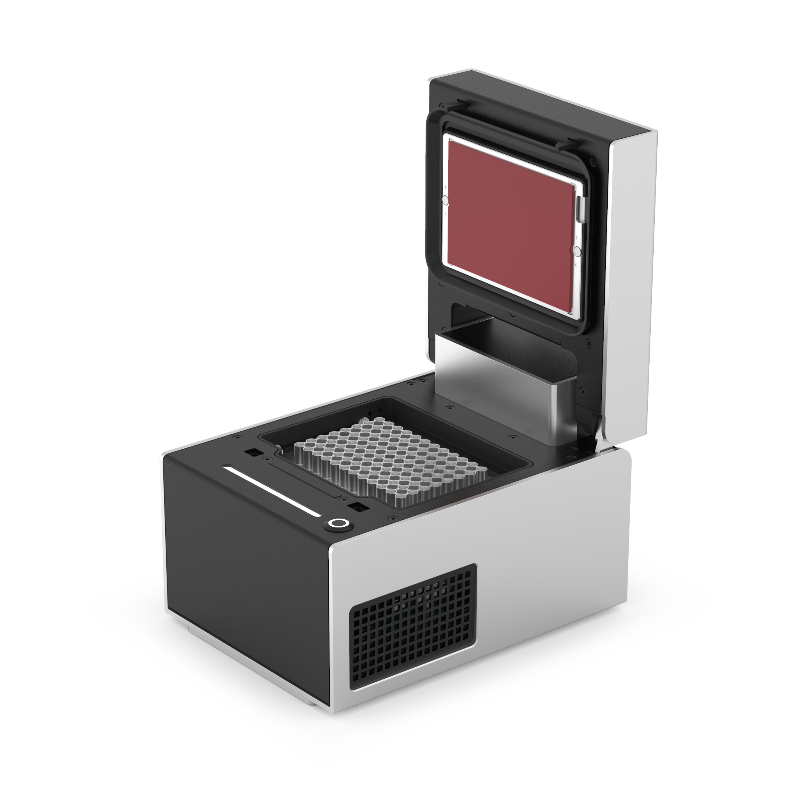

{style="width: 60%"}

**Opentrons Labworks Inc.** 
August 2025

## Product Description

The Opentrons Thermocycler Module is a fully automated on-deck
thermocycler, providing hands-free PCR in a 96-well plate format.
Its heated lid works in combination with Opentrons single-use PCR
lids or reusable rubber seals to help ensure efficient plate heating,
protect samples against contamination, and reduce sample loss
from evaporation.
