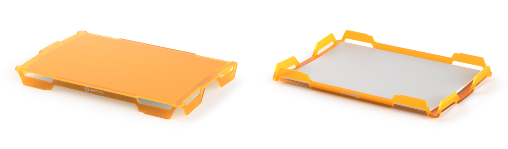
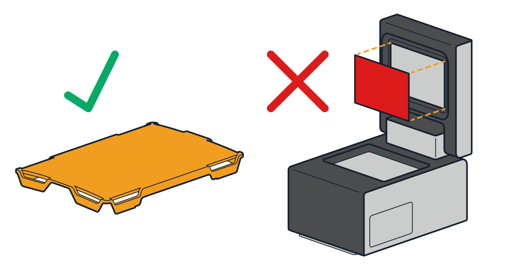
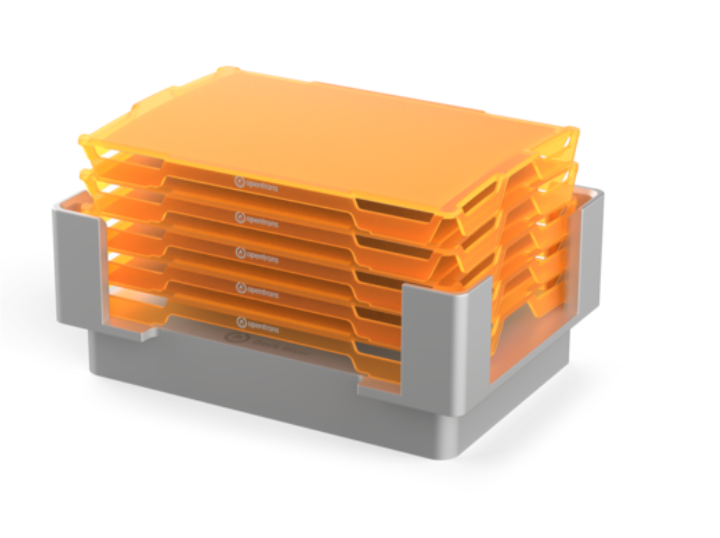
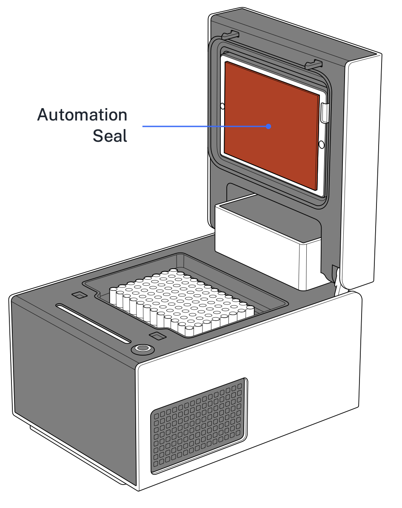

The Thermocycler GEN2 accepts two different plate seals to help protect PCR samples: the disposable [Opentrons Tough PCR Auto-sealing Lid](https://opentrons.com/products/opentrons-flex-tough-auto-sealing-lids-20-count) and the reusable [GEN2 automation seals](https://opentrons.com/products/gen2-thermocycler-seals).

## Disposable PCR Lids

Opentrons Tough Auto-sealing Lids are disposable, stackable well plate lids. They're ideal for protocols that require sterility, automated lid handling, single-use consumables, or that include two or more PCR steps in a single automated protocol.

### Compatibility

The Opentrons auto-sealing lids work with the following Flex hardware and software.

| Hardware | Compatibility |
|:---------|:--------------|
| Modules | Lids are compatible with the Thermocycler GEN2. |
| Instruments | Lids are compatible with the Flex Gripper. The gripper can pick up lids directly off the deck or from a special deck riser, move them onto or off a PCR plate, and drop them in the trash. Note, however, the gripper cannot simultaneously pick up a well plate and an attached lid. It must move labware and lids separately. |
| Labware | Lids are designed to cover the Opentrons Tough PCR plates. These sterile lids provide improved PCR plate sealing to help prevent sample contamination and reduce evaporation. |
| Deck fixtures | Lids are compatible with the trash bin, the waste chute, the special deck riser, and other deck fixtures that can hold the Opentrons Tough PCR well plates. |
| API | Use the Python Protocol API to add and work with Opentrons Auto-sealing Lids in your PCR protocols. |

!!!warning
    Do not use the disposable lid while your Thermocycler has a rubber seal attached. Remove the rubber seal before using disposable lids in a protocol run.
    

### Cleanliness Standards

Auto-sealing lids are manufactured and packaged in cleanroom facilities that meet ISO 14644-1 Class 8 standards. Lids also have a "Sterile-R" designation, which means they're irradiated to a sterility assurance level (SAL) of 10-6. Each box contains documentation certifying the lids are free of ATP, pyrogens, DNA, DNase, RNase, and PCR inhibitors.

### Packaging

Opentrons auto-sealing lids ship in blister packs of five lids each. There are four packs in a box, totaling 20 disposable lids per box. Each blister has its own lot, production, and serial number for tracking or other record-keeping purposes. You can store the lids until they're needed, but we recommend using them within two years of their manufacture date.

### Deck Riser

You can stack up to 5 auto-sealing lids on a special [deck riser](https://opentrons.com/products/opentrons-flex-deck-riser). The riser keeps lids away from the unsterilized deck and provides better access for the gripper. The deck riser is also autoclave-safe. You can clean and reuse it between protocol runs without worrying too much about contaminating sterile lids.

!!!note
    You can place lids directly on the deck, though you can only stack a maximum of 3 lids this way. Also, the gripper can pick up lids from the deck without needing the riser. However, use the deck riser if you need to stack more lids or require a sterile environment.

## Reusable Automation Seals (GEN2)

While disposable PCR lids offer sterile, single-use convenience, the Thermocycler GEN2 also ships with a package of reusable automation seals. Unlike the disposable lids, these seals require sanitization before use and can be reused up to 20 times. Note that only one type of seal (disposable or reusable) should be used at a time; _do not_ use both simultaneously on the same Thermocycler.

!!!note "Note: Thermocycler GEN1 Incompatibility"
    If you have a Thermocycler Module GEN1, you must use the [Thermocycler GEN1 Seals](https://opentrons.com/products/thermocycler-seals-1). You cannot use GEN2 seals on a GEN1 Thermocycler.

### Attachment Instructions 

To properly attach reusable automation seals:

- Attach a seal after module installation. 
- Apply the seal to the module lid, not the plate.
- Clean or sanitize the seal before your first Thermocycler run.

{width="60%"}

After applying the seal, wipe it with a 1:10 diluted bleach solution. Rinse the seal by wiping it with molecular biology grade water, then air dry.

!!!warning
    Reusable seals are not autoclave-safe.

Each seal may be used for several runs. Check the seal's condition after each run and replace it if needed. Worn or damaged seals may result in increased sample evaporation.
