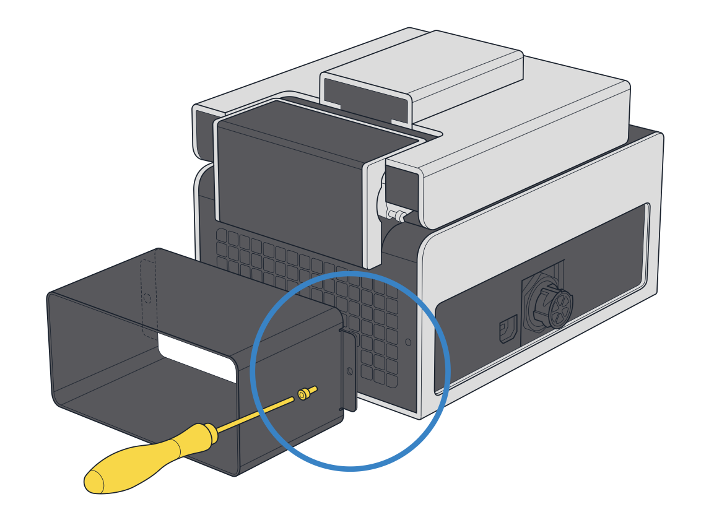

# OT-2 Attachment Steps

To attach the Thermocycler to your OT-2:

1. Use a 2.5 mm hex screwdriver or L-key to attach the exhaust duct to the back of the module. Use the two included screws, one on either side of the duct.

    

2. Using both hands, lift the module carefully, set it in its supported deck location, and gently press it into place.

3. Connect the USB cable to the module. Route the remaining cable through the cable management bracket, then connect the other end of the USB cable to a USB port on the OT-2.

4. Connect one end of the power cable to the module and then to the external power supply unit. Manually tighten the locking ring to secure it to the power supply.

5. Connect the power supply to a wall outlet and turn on the power supply. If you see a white light on the Thermocycler, it is powered on. 

6. Press the illuminated button on the Thermocycler to open the lid.

7. Remove and discard the shipping insert after opening the module's lid. The insert consists of a pad attached to a PCR plate.

    

When successfully connected, the module appears in the Pipettes and Modules section on your robot's device detail page in the Opentrons App. The module is ready to use and does not require calibration on an OT-2.
