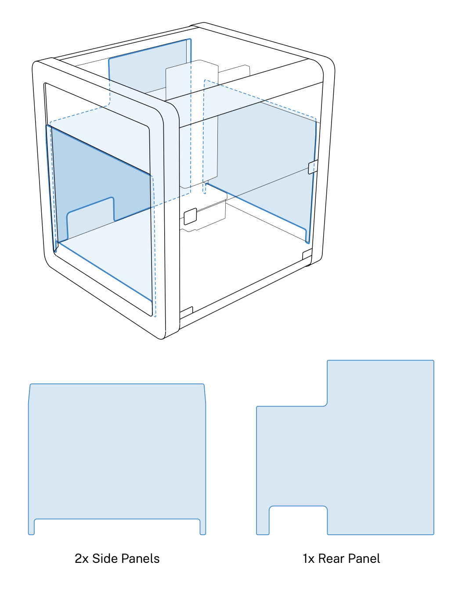

Review this section for important information about the Thermocycler's deck placement, alignment, and anchor adjustments.

## Flex Caddies

When used with a Flex robot, the Thermocycler fits into a caddy that occupies space below the deck. The caddy places your labware closer to the deck surface and allows for below-deck cable routing. See the [Modules chapter](../flex/modules/index.md) in the Flex Instruction Manual for more information.

The OT-2 does not use caddies. Modules clip directly to the deck. Also, the Thermocycler ships with a short exhaust duct, which is used by the OT-2 only. The module will not fit properly in its caddy with the OT-2 duct attached.

Caddies are available for purchase from the [Modules section](https://opentrons.com/products/categories/modules) of the Opentrons website.

## Anchor Adjustments

Anchors are screw-adjustable panels on the Thermocycler caddy. They provide the clamping force that secures the module to its caddy. Use a 2.5 mm screwdriver to adjust the anchors.

- To loosen/extend the anchors, turn the screws counterclockwise.
- To tighten/retract the anchors, turn the screws clockwise.

Before installation:

- Check the anchors to make sure they’re level or extend slightly past the sides of the caddy.
- If the anchors interfere with installing the module, adjust them until there’s enough clearance to seat the module and then tighten them to hold it in place.

## Deck Placement and Cable Alignment

The supported deck slot positions for the Thermocycler depend on the robot you’re using.

| Robot Model | Deck Placement |
|----|----|
| Flex | Requires deck slots A1, B1 ,and the A1 expansion slot. |
| OT-2 | Requires deck slots 7, 8, 10, and 11. |

To properly align the module relative to the robot, make sure its exhaust port faces to the rear (away from the center of the deck). This keeps the exhaust port clear and aligns the power and USB ports to the left side of the robot for easy access.

## Ventilation Clearance

The Flex and OT-2 need at least 20 cm (8") of side and back clearance. This space helps dissipate exhaust from the Thermocycler.

For OT-2 ventilation, Opentrons recommends using the side and rear window panels shown below. These panels are included with newer OT-2 models. If you have an older OT-2 and need these panels, contact us at <support@opentrons.com>.

