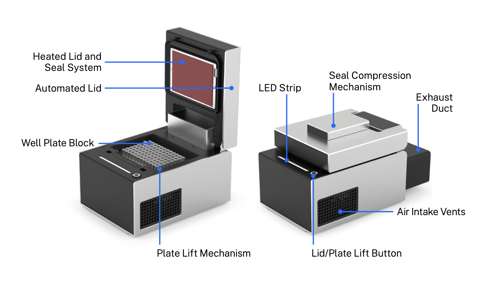
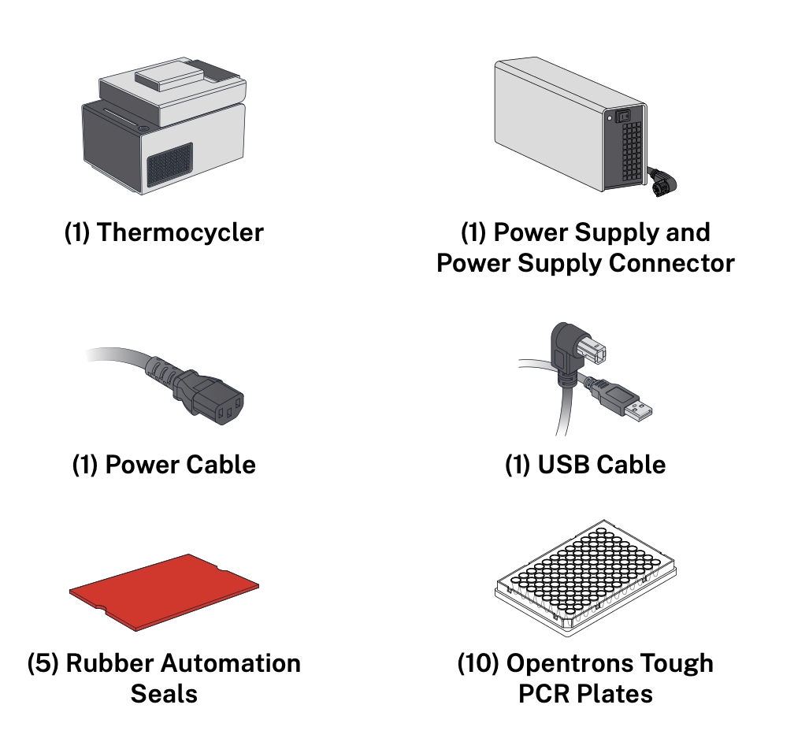
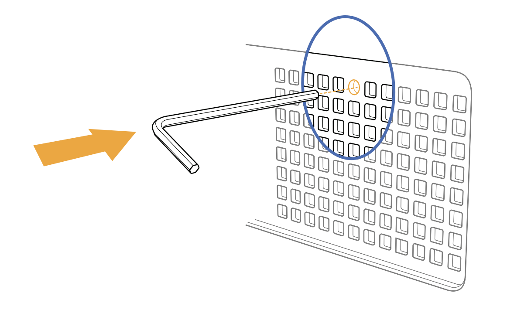

# Product Specifications

## Model Number

TCG2

## Included Parts

## Physical Specifications

<table>
  <tbody>
    <tr>
      <th>Dimensions (lid open)</th>
      <td>244.95 mm L x 172 mm W x 310.1 mm H</td>
    </tr>
    <tr>
      <th>Dimensions (lid closed)</th>
      <td>244.95 mm L x 172 mm W x 170.25 mm H</td>
    </tr>
    <tr>
      <th>Weight</th>
      <td>8.4 kg (including rear duct)</td>
    </tr>
  </tbody>
</table>

## Temperature Profile

<table>
  <tbody>
    <tr>
      <th>Thermal block</th>
      <td>
        <ul>
          <li>Range: 4–99 °C</li>
          <li>Maximum heating ramp rate: 4.25 °C/s from ambient to 95 °C</li>
          <li>Maximum cooling ramp rate: 2.0 °C/s from 95 °C to ambient</li>
        </ul>
      </td>
    </tr>
    <tr>
      <th>Lid</th>
      <td>
        <ul>
          <li>Range: 37–110 °C</li>
          <li>Accuracy: ±1 °C</li>
        </ul>
      </td>
    </tr>
  </tbody>
</table>

## LED Status Light

<table>
  <thead>
    <tr>
      <th>LED Color</th>
      <th>Module Status</th>
    </tr>
  </thead>
  <tbody>
    <tr>
      <td>White</td>
      <td>A solid white light indicates the module is idle (not actively heating or cooling). 
        ⚠️ <strong> Warning: </strong>The module could still be hot. Handle with care.</td>
    </tr>
    <tr>
      <td>Orange</td>
      <td>A pulsing orange light indicates an error state.</td>
    </tr>
    <tr>
      <td>Red</td>
      <td>A red light indicates a hot temperature state.
        <ul>
          <li>Solid red: holding at a hot temperature (&gt;23 °C)</li>
          <li>Pulsing red: changing to a hot temperature (&gt;23 °C)</li>
        </ul>
      </td>
    </tr>
    <tr>
      <td>Blue</td>
      <td>A blue light indicates a cool temperature state.
        <ul>
          <li>Solid blue: holding at a cool temperature (&lt;23 °C)</li>
          <li>Pulsing blue: changing to a cool temperature (&lt;23 °C)</li>
        </ul>
      </td>
    </tr>
  </tbody>
</table>

## Emergency Lid Opening

In case of a power outage, connectivity issue, or other electrical failure, the Thermocycler lid may not open. Follow these steps to manually open the lid:

1. If possible, turn the unit off and unplug it.
2. Insert the included hex wrench into the circular slot on the left side of the module.
3. Push the wrench inward 25 mm / 1 inch.
4. Lift the lid manually.

